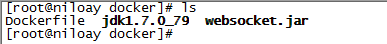
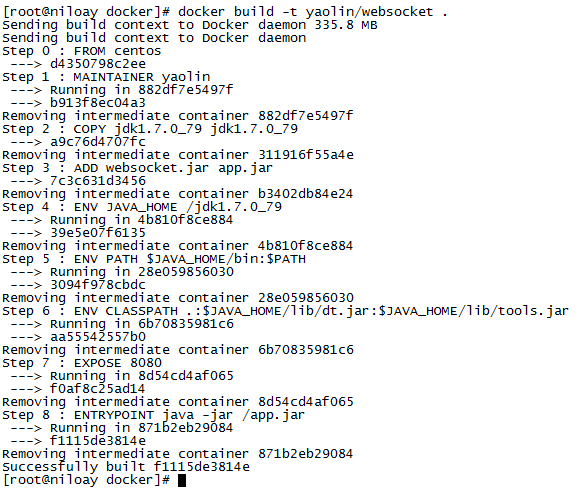
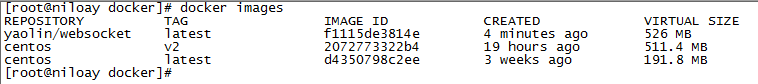
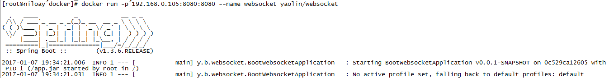
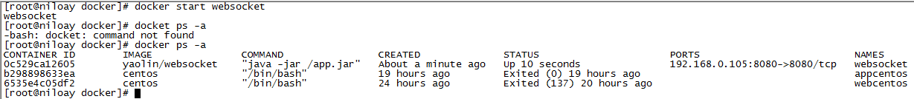

## docker——Dockerfile创建镜像

继续docker的学习，昨天用docker成功跑了tomcat，但是在centos中镜像跑的容器手动装jdk和tomcat，今天学习用Dockerfile创建镜像，并在上面搭建java环境，跑一个spring boot小项目。

Dockerfile：

Dockerfile由一行行命令语句组成，并且支持用“#”开头作为注释，一般的，Dockerfile分为四部分：基础镜像信息，维护者信息，镜像操作指令和容器启动时执行的指令。

Dockerfile指令：

1、FROM

格式：FROM <image>或 FROM <image>:<tag>

第一条指令必须为FROM指令，并且，如果在同一个Dockerfile中创建多个镜像时，可以使用多个FROM指令（每个镜像一次）

2、MAINTAINET

格式：MAINTAINET <name>

指定维护者的信息

3、RUN

格式：RUN <command> 或 RUN ["", "", ""]

每条指令将在当前镜像基础上执行，并提交为新的镜像。（可以用“\”换行）

4、CMD

格式：CMD ["","",""]

指定启动容器时执行的命令，每个Dockerfile只能有一条CMD指令，如果指定了多条指令，则最后一条执行。（会被启动时指定的命令覆盖）

5、EXPOSE

格式：EXPOSE <port>  [ <port> ...]

告诉Docker服务端暴露端口，在容器启动时需要通过 -p 做端口映射

6、ENV

格式：ENV <key> <value>

指定环境变量，会被RUN指令使用，并在容器运行时保存

7、ADD

格式：ADD  <src>  <dest>

复制指定的<src>到容器的<dest>中，<src>可以是Dockerfile所在的目录的一个相对路径；可以是URL，也可以是tar.gz（自动解压）

8、COPY

格式：COPY <src>  <dest>

复制本地主机的 <src> （ 为 Dockerfile 所在目录的相对路径）到容器中的 <dest> （当使用本地目录为源目录时，推荐使用 COPY）

9、ENTRYPOINT

格式：ENTRYPOINT ["","",""]

配置容器启动后执行的命令，并且不可被 docker run 提供的参数覆盖。（每个 Dockerfile 中只能有一个 ENTRYPOINT ，当指定多个时，只有最后一个起效）

10、VOLUME

格式：VOLUME ["/mnt"] 

创建一个可以从本地主机或其他容器挂载的挂载点，一般用来存放数据库和需要保持的数据等

11、USER

格式：USER daemon

指定运行容器时的用户名或 UID，后续的 RUN 也会使用指定用户。

12、WORKDIR

格式：WORKDIR /path/to/workdir

为后续的 RUN 、 CMD 、 ENTRYPOINT 指令配置工作目录。（可以使用多个 WORKDIR 指令，后续命令如果参数是相对路径， 则会基于之前命令指定的路径）

13、ONBUILD

格式：ONBUILD [INSTRUCTION]

配置当所创建的镜像作为其它新创建镜像的基础镜像时，所执行的操作指令

------------------分割线----------------------

创建镜像：

1、准备jdk、需要运行的spring boot小项目

　　将jdk压缩包解压到Dockerfile所在的目录中，将spring boot小项目websocket.jar复制到Dockerfile所在的目录下：



2、创建Dockerfile，内容如下：

[](javascript:void(0);)

```
 1 FROM centos
 2 
 3 MAINTAINER yaolin
 4 
 5 COPY jdk1.7.0_79 jdk1.7.0_79
 6 ADD websocket.jar app.jar
 7 
 8 ENV JAVA_HOME=/jdk1.7.0_79
 9 ENV PATH=$JAVA_HOME/bin:$PATH
10 ENV CLASSPATH=.:$JAVA_HOME/lib/dt.jar:$JAVA_HOME/lib/tools.jar
11 
12 EXPOSE 8080
13 
14 ENTRYPOINT ["java","-jar","/app.jar"]
```

[](javascript:void(0);)

　　指定基镜像 centos

　　指定维护者信息 yaolin

　　复制jdk

　　添加spring boot 小项目，并重命名为app.jar

　　配置jdk环境

　　暴露8080端口

　　指定执行启动spring boot小项目

3、编译并生成镜像 （. 表示当前路径） 

```
 docker build -t yaolin/websocket .
```



4、查看生成的镜像 

```
docker images
```



5、创建容器并运行

```
docker run -p 192.168.0.105:8080:8080 --name websocket  yaolin/websocket
```



 可以看到容器正常运行并打印日志，但是这种运行方式会抢占终端。改为使用docker start websocket的方式启动：

