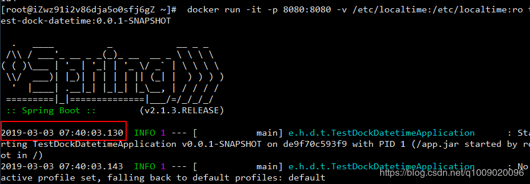
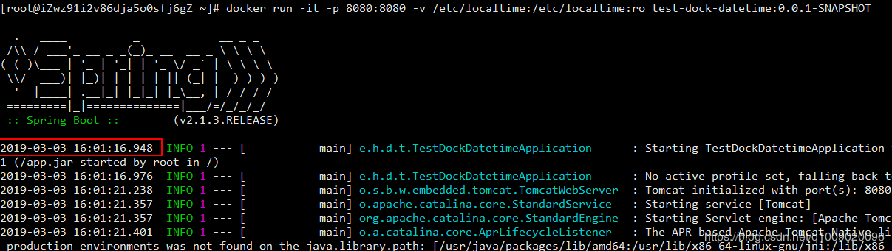

**Docker容器时间与主机时间不一致**

通过date命令查看时间

查看主机时间

```
[root@localhost ~]# date


2016年 07月 27日 星期三 22:42:44 CST
```

查看容器时间

```
root@b43340ecf5ef:/#date                                                                                                                          


Wed Jul 27 14:43:31 UTC 2016
```

可以发现，他们相隔了8小时。

CST应该是指（China Shanghai Time，东八区时间） 
UTC应该是指（Coordinated Universal Time，标准时间） 

所以，这2个时间实际上应该相差8个小时。(bluer: 所以没有设置过的容器, 一般跟宿主机时间相差8h)

所以，必须统一两者的时区。

**共享主机的localtime (方法一)**

创建容器的时候指定启动参数，挂载localtime文件到容器内 ，保证两者所采用的时区是一致的。

```bash
docker run -d -v /etc/localtime:/etc/localtime --rm -p 8888:8080 tomcat:latest
```

**复制主机的localtime (方法二)**

```bash
docker cp /etc/localtime:[容器ID或者NAME]/etc/localtime
```

在完成后，再通过date命令进行查看当前时间。 

但是，在容器中运行的程序的时间不一定能更新过来，比如在容器运行的MySQL服务，在更新时间后，通过sql查看MySQL的时间

```sql
select now() from dual;
```

可以发现，时间并没有更改过来。 

这时候必须要重启mysql服务或者重启Docker容器，mysql才能读取到更改过后的时间。

**创建自定义的dockerfile (方法三)**

创建dockerfile文件，其实没有什么内容，就是自定义了该镜像的时间格式及时区。

```bash
FROM redis FROM tomcat 
ENV CATALINA_HOME /usr/local/tomcat
#设置时区
RUN /bin/cp /usr/share/zoneinfo/Asia/Shanghai /etc/localtime \  && echo 'Asia/Shanghai' >/etc/timezone \
```

保存后，利用docker build命令生成镜像使用即可。

---

### 1. 容器与宿主机同步时间

在启动镜像时候把操作系统的时间通过"只读"的方式挂载到容器中

命令行配置

```bash
-v /etc/localtime:/etc/localtime:ro
```

> 如：
> `docker -it -v /etc/localtime:/etc/localtime:ro centos bash`

docker compose配置方式

```
volumes:
  -  /etc/localtime:/etc/localtime:ro
```

### 2. Spring boot Jar 启动时增加时区参数

在制作镜像时候，运行jar时指定上时区参数，以便Springboot项目中的日志中能够正确读取到指定时区的时间。中国采用东八区的时区，所以是`GMT+8`

```bash
-Duser.timezone=GMT+8
```

> 如：
> `java -jar -Duser.timezone=GMT+8 your_application.jar`

对应的Dockerfile应该为

```Dockfile
ENTRYPOINT ["java", "-jar", "-Duser.timezone=GMT+8", "/app.jar"]
```

实验以及解决过程
Spring boot的jar名称为test-dock-datetime-0.0.1-SNAPSHOT.jar

Dockerfile如下
```
FROM openjdk:8-jre
MAINTAINER hznu@cliven
VOLUME /tmp
COPY test-dock-datetime-0.0.1-SNAPSHOT.jar /app.jar

EXPOSE 8080
ENTRYPOINT ["java", "-jar", "/app.jar"]
```


容器运行命令

```
 docker run -it -p 8080:8080 test-dock-datetime:0.0.1-SNAPSHOT
```


发现日志时间都不正确

linux 上的时间为`Sun Mar 3 15:15:53 CST 2019`

通过`exec`到容器中确认时间，`Sun Mar 3 07:17:20 UTC 2019`，偏差极大

> docker exec -it container_id bash


首先解决容器中的时间与宿主机的时间不一致的问题，
命令行配置

```bash
docker run -it -p 8080:8080 -v /etc/localtime:/etc/localtime:ro test-dock-datetime:0.0.1-SNAPSHOT
```

再次运行可以看到容器中的时间和宿主机的时间已经保持一致。

接下来我们在观察一下Spring boot 的启动日志


发现时间仍然不对，导致这个的原因是没有为该应用设置时区，所以采用了0区的时间，那么我们需要在jar的启动命令上加上时区参数。

修改Dockerfile，加入-Duser.timezone=GMT+8启动参数，表示东8的时区。

```
FROM openjdk:8-jre
MAINTAINER hznu@cliven
VOLUME /tmp
COPY test-dock-datetime-0.0.1-SNAPSHOT.jar /app.jar

EXPOSE 8080
ENTRYPOINT ["java", "-jar", "-Duser.timezone=GMT+8","/app.jar"]
```

修改Dockerfile 后需要重新打包镜像，重新打包镜像，运行后可以看到Springboot 的启动的日志中的时间都已经是正确的时间。

