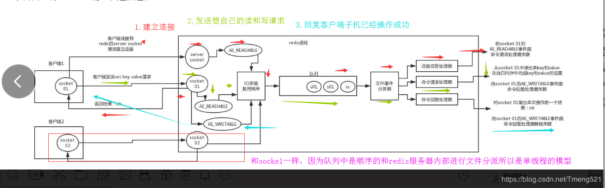

redis 是一个基于内存的高性能 key-value数据库

支持丰富的数据类型(String,List , Set ,Sorted Set，Hash )

redis中的单个value的存储限制是1G，比 Memcached的1MB要强大太多

### 1.redis有什么优缺点

redis是内存数据库，所以当数据量达到一定程度的时候，单机版的必然是其瓶颈所在，这个时候我们就需要引入主从复制方案，用了主从复制之后我们就会发现，主库值负责读写，从库负责读，数据量达到千万级的时候写的库还是扛不住，所以就更加深入的使用了集群。

### 2.redis的线程模型

redis内部使用的是文件事件处理器方式(file event handler)它是一个单线程的，所以redis也是单线程模型的关于这个文件事件处理器方式可参照下图

此图形象的标出了redis存储原理

客户端 socket01 向 redis 的 server socket 请求建立连接，此时 server socket 会产生一个 AE_READABLE 事件，IO 多路复用程序监听到 server socket 产生的事件后，将该事件压入队列中。文件事件分派器从队列中获取该事件，交给连接应答处理器。连接应答处理器会创建一个能与客户端通信的 socket01，并将该 socket01 的 AE_READABLE 事件与命令请求处理器关联。
假设此时客户端发送了一个 set key value 请求，此时 redis 中的 socket01 会产生 AE_READABLE 事件，IO 多路复用程序将事件压入队列，此时事件分派器从队列中获取到该事件，由于前面 socket01 的 AE_READABLE 事件已经与命令请求处理器关联，因此事件分派器将事件交给命令请求处理器来处理。命令请求处理器读取 socket01 的 key value 并在自己内存中完成 key value 的设置。操作完成后，它会将 socket01 的 AE_WRITABLE 事件与令回复处理器关联。

如果此时客户端准备好接收返回结果了，那么 redis 中的 socket01 会产生一个 AE_WRITABLE 事件，同样压入队列中，事件分派器找到相关联的命令回复处理器，由命令回复处理器对 socket01 输入本次操作的一个结果，比如 ok，之后解除 socket01 的 AE_WRITABLE 事件与命令回复处理器的关联。

### 3.为什么redis单线程效率也能那么高

1. 纯内存操作，数据什么的都存在服务器内存中(使用的时候要注意设置服务器可分不配给redis的内存大小，并且根据业务使用持久化机制)

2. 非阻塞的IO多路复用机制

3. 单线程避免了多线程情况下的上下文切换问题(内部使用了队列技术，避免了传统DB控制串行的开销)

### 4.redis有几种持久化方式

####  1 RDB

rdb是全量持久化，是在配置文件中指定持久化的间隔时间，然后将内存中的数据集快照写入磁盘，实际操作是fork一个子进程然后将数据集写入一个临时磁盘，字后覆盖掉以前的数据集文件。

优点，可以灵活的设置备份频率和周期因为是自己设置的，并且因为备份的一个数据集文件，所以当redis宕机的时候很容易就可以备份，内部使用了一个子进程所以在持久化的时候可以保证redis的高性能。恢复数据比AOF要快

缺点 :因为rdb是以时间为单位存储的，比如每5分钟写一次，那么在第4分钟59秒的时候redis服务器宕机了那么在这4分多钟里面的数据就会丢失。严重还是影响蛮大的。

####  2 AOF

aof可以带来更高的数据安全性，aof中有3中同步策略，（1.每秒同步 2.没执行一个修改命令就同步3.不同步）

每秒同步是异步执行了，效率高但如果redis宕机了那么那一秒的数据就丢了

每修改同步。redis中每次有写的操作，都会同步到磁盘，效率比上面的每秒同步要低一些，但是极度安全

持久化的时候采用的是append的方式，由此可见恢复策略做的比较好，不会出现持久化文件错乱问题，并且这个写入磁盘的效率是非常之高，没有磁盘寻址操作(kafka的消息存储也是这个干的，追加写的形式)

如果日志过大，Redis可以自动启用 rewrite 机制。即使出现后台重写操作，也不会影响客户端的读写。因为在 rewrite log 的时候，会对其中的指令进行压缩，创建出一份需要恢复数据的最小日志出来。

缺点

同数据量下aof文件比rdb文件要大的多，因为它记录的是所有的写指令，并且恢复速度也慢一点

总结:使用的时候可以同时开启两种持久化方式，利用aof来保证数据不丢失，在aof无法使用的时候，在用reb的备份文件做替补恢复，在两种模式都开启的情况下，默认采取aof来进行数据恢复

[AOF设计实现](https://redisbook.readthedocs.io/en/latest/internal/aof.html)

[RDB设计实现](https://redisbook.readthedocs.io/en/latest/internal/rdb.html)

### 5.redis有几种数据过期策略

#### 1 被动删除:

当读/写 一个过期的key时，会触发惰性删除策略，直接删除这个key

### 2 主动删除

由于惰性策略无法保证冷数据已经被删除，所以redis会定期主动删除一些已过期的key，或者当内存达到为redis服务器设置的最大内存的时候，会主动的删除一些数据（触发数据淘汰策略）

[写的不错的关于过期策越的文章](https://www.cnblogs.com/chenpingzhao/p/5022467.html)

### 6.什么是redis的数据淘汰策略

1. volatile-lru
2. volatile-ttl
3. volatile-random
4. allkeys-lru
5. allkeys-random
6. no-enviction

[形象生动的说明了几种策略的用法](http://blog.720ui.com/2016/redis_action_02_maxmemory_policy/)

### 7. **MySQL 里有 2000w 数据，Redis 中只存 20w 的数据，如何保证 Redis *中的数据都是热点数据？**

**设置过期策略为**volatile-lru 或者allkeys-lru 这样就会删除不常用的，留下来的就是热点数据了。

### 8.redis回收进程工作原理

1.在写入redis之前查看是已经达到最大内存了，如果达到了就走数据淘汰策略，然后在写入

### 9.redis如何解决缓存雪崩，缓存穿透，缓存击穿

缓存雪崩呢就表示 在某个时间段设置了过期时间的key都一起失效了，那么db肯定扛不住那么大的并发量，可能会崩溃，所以我们在设置一些热点key的时候，要尽量设置不同的过期时间，以避免在高并发的情况下缓存雪崩问题

缓存穿透呢 从字面上理解就是因为每次做查询请求的时候无法从缓存中查询，从而直接将请请求落入DB，刚好db中也没这条数据，那么返回的就是null，就不会放入缓存中，周而复始知道db炸裂。 这种方案简单粗暴的解决方式就是当db中查询为null的时候自己给个设置过期时间 的默认值，从而解决掉这种查询直接到达db的频率

缓存击穿，某个热点key突然过期了，那么必然会导致，大量的请求入db那么db就会扛不住压力，凉凉。解决方案设置锁，如果是分布式系统就设置分布式锁。

### 10.redis如何实现分布式锁呢

[代码地址](https://github.com/LxyTe/Lock/tree/master/lock-java/src/main/java/com/te/redis)

实际上要理解的原理就是 设置key的过期时间，然后有请求到来的时候，去redis写入这个key，如果这个key已经被写入redis说明此锁已经被占用了，那么就循环就如等待，上一个占用锁的人，在处理完逻辑后会释放掉锁，那么下一个人就可以获取这个锁了然后执行自己的逻辑，总结来就是分布式系统下的强制串行操作。

### 11.redis使用场景

1. 数据缓存(不做过多介绍)

2. 手机验证码多长时间过期(可通过设置key的过期时间实现)

3. 积分排行(设置key的过期时间，然后定时做统计)

4. 计算器(单线程计数，不考虑并发情况下的数据不一致问题)

5. 限流(通过设置某个ip的在1分钟内访问次数，来达到限流效果)

6. 消息队列

7. 分布式锁

8. 热门列表(根据访问次数来进行统计)

9. 限制登录次数(如果密码错了就计算1次，设置一个过期时间，连错5次就锁定此账号)

10. 唯一登录，在系统登录成功后记录这个账号信息，如果此账号在其他地方又登录，就清除某个token信息

11. token信息保存，刚好对应sprong-session中的核心处理

### 12.后续关于

主从复制的原理和实现

哨兵机制的原理和实现

redis事务的原理和实现

发布订阅机制的原理和实现

rdb和aof和实现

以及几个使用场景的实现

https://github.com/LxyTe/redis

### 13记录一点关于redis和db的数据一致性问题。

这个问题读者应该在面试的时候都会被问题，其实这个已经涉及到了两个数据库了，已经算作分布式事务的领域了。下面来说下解决方案。

#### 方案一 没有使用MQ的系统(并发写量小的系统 )

先更新数据库，数据库更新完成之后，更新缓存(直接将结果给缓存不在查询db)。(直接更新，不是删除)，缺点，数据库如若成功，redis更新失败，数据就不一致了。

#### 方案二 使用了MQ的系统

先更新数据库，数据库更新成功返回状态，然后把更新redis的操作使用MQ异步发出，然后使用MQ的消费者机制来保证一定会消费，从而避免由redis更新失败带来 数据不一致。(直接将结果给缓存不在查询db)

#### 方案三（并发量特别大的情况(这里的并发只的是并发写。),如果一个key的修改频率大于查询，那么就要考虑这个key是否 适合缓存）

这个时候使用方案二会出现一个弊端，那就是在你使用MQ消费的时候是肯定存在延迟的，这个时候如果db的值已经改变那么就会造成数据不一致，那么这个时候第二步的做法就可以修改为 消息到达mq只有，从db中查询一次，然后将结果重新放在redis中

#### 方案四 没有使用MQ，系统并发量写太大,但是并发读不是很大，因为删缓存，并发读又太大那么容易造成缓存穿透)

那么可以直接使用先更新数据库，然后删除缓存(等缓存使用的时候，从db中查询，按需加载)

#### 方案五 并发写很大，并发读也很大(秒杀系统(下单，那么就要减库存，下单前要判断是否还与库存))

此种解决方案的核心点是限流，通过各种限流将并发量减小，如果达到db能承受的范围，在达到db能承受的范围之后，将请求下放的数据库层，然后先减去库存，然后修改成功，在修改redis的数值(实际上的做法是先在redis层做限流，然后减去redis的库存，然后再到db去修改。那么这个时候就不用管redis的库存了。)

#### 方案六 基于canal订阅mysql master的binlog，然后进行写入redis，可以实现最小程度的数据不一致。也是最佳方案，不过成本较高。

总结:redis和db的数据一致性在不同的情景下有不同的做法，上面的六种场景第1种是用的最多的，如果对数据一致性比较重视，那么可以用第二种，第三种的使用场景适用于少量写，大量读，情况下，数据的相对一致性。

   分布式系统下的数据一致性其实是可以有一点不一致的(据说12306那种级别的网站，也是在每天晚上的时候，做一次数据同步，将db中的数据，重新刷到缓存中，为什么要重新呢，这里就不多解释了吧，肯定是db和缓存数据不一致呀)，因为分布式系统访问的时候肯定会出现网络延迟，有网络延迟，肯定会出现数据不一致，以前有个同学和我说过， 如果你的系统连一点点数据一致性偏差都不能承受，那你还玩什么分布式系统呢。

### 14.如何解决rediskey倾斜问题

什么是热点key倾斜？就是在redis集群中某个节点一直承受这大量的查询操作，压力非常大，而其他节点压力都较小。这个时候需要解决这个压力太大的问题

 解决思路有两种

1. 在将一些特别热点的key直接放在客户端进行存储，设置过期时间，过期后从后台查询。

2. 上面的方法可以解决热点key的倾斜问题，但是如果存储在前端的数据在同一个时间都过期了呢，那么还是有大量的请求到达redis的某一个节点，这个时候我们可以将一个热点key 复制出多分子key，每个子key的value值一样，查询的时候使用hash取模算法，将压力分配到不同的节点