**什么是临时顺序节点？**

让我们来回顾一下Zookeeper节点的概念：

Zookeeper的数据存储结构就像一棵树，这棵树由节点组成，这种节点叫做Znode。

Znode分为四种类型：

#### 1.持久 （PERSISTENT）

默认的节点类型。创建节点的客户端与zookeeper断开连接后，该节点依旧存在 。

#### 2.持久节点顺序节点（PERSISTENT_SEQUENTIAL）

所谓顺序节点，就是在创建节点时，Zookeeper根据创建的时间顺序给该节点名称进行编号：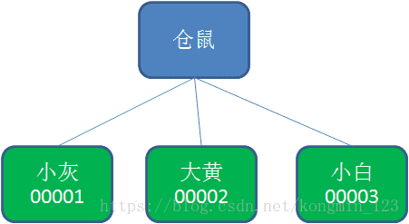

#### **3.临时节点（EPHEMERAL）** 

和持久节点相反，当创建节点的客户端与zookeeper断开连接后，临时节点会被删除。

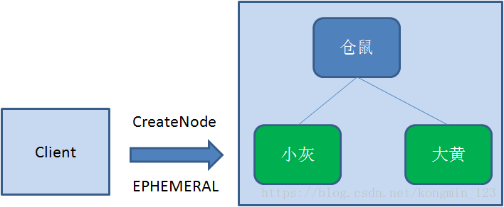

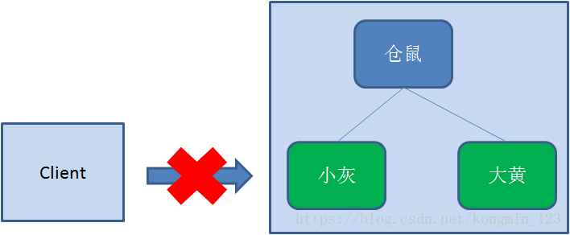

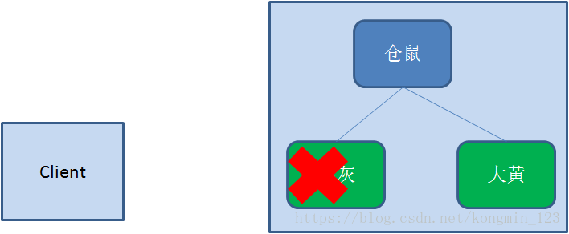

#### 4.临时顺序节点（EPHEMERAL_SEQUENTIAL） 

顾名思义，临时顺序节点结合和临时节点和顺序节点的特点：在创建节点时，Zookeeper根据创建的时间顺序给该节点名称进行编号；当创建节点的客户端与Zookeeper断开连接后，临时节点会被删除。

那临时顺序节点和Zookeeper的分布式锁有什么关系呢？

### Zookeeper分布式锁的原理

Zookeeper分布式锁恰恰应用了临时顺序节点。具体如何实现呢？让我们来看一看详细步骤：

#### 获取锁

首先，在Zookeeper当中创建一个持久节点ParentLock。当第一个客户端想要获得锁时，需要在ParentLock这个节点下面创建一个临时顺序节点 Lock1。

之后，Client1查找ParentLock下面所有的临时顺序节点并排序，判断自己所创建的节点Lock1是不是顺序最靠前的一个。如果是第一个节点，则成功获得锁。 

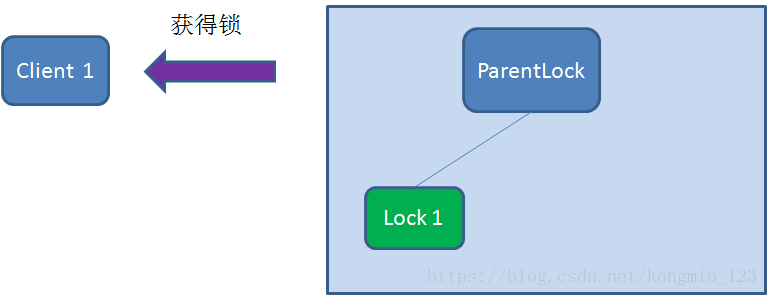

这时候，如果再有一个客户端 Client2 前来获取锁，则在ParentLock下载再创建一个临时顺序节点Lock2。 

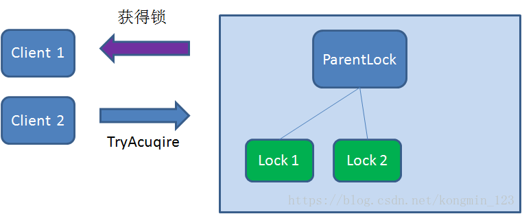

Client2查找ParentLock下面所有的临时顺序节点并排序，判断自己所创建的节点Lock2是不是顺序最靠前的一个，结果发现节点Lock2并不是最小的。

于是，Client2向排序仅比它靠前的节点Lock1注册Watcher，用于监听Lock1节点是否存在。这意味着Client2抢锁失败，进入了等待状态。 

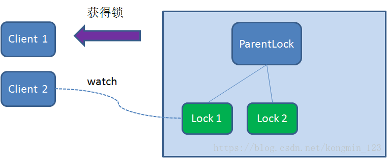

这时候，如果又有一个客户端Client3前来获取锁，则在ParentLock下载再创建一个临时顺序节点Lock3。 

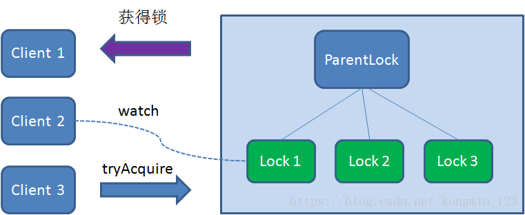

Client3查找ParentLock下面所有的临时顺序节点并排序，判断自己所创建的节点Lock3是不是顺序最靠前的一个，结果同样发现节点Lock3并不是最小的。

于是，Client3向排序仅比它靠前的节点**Lock2**注册Watcher，用于监听Lock2节点是否存在。这意味着Client3同样抢锁失败，进入了等待状态。 

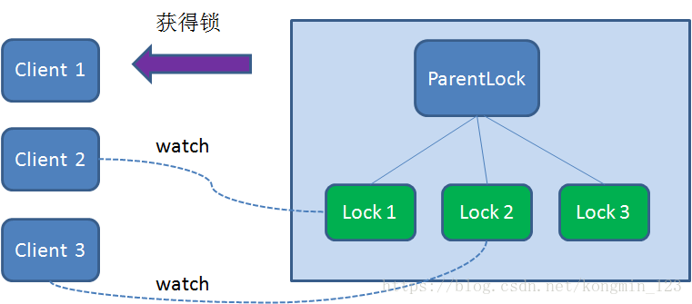

这样一来，Client1得到了锁，Client2监听了Lock1，Client3监听了Lock2。这恰恰形成了一个等待队列，很像是Java当中ReentrantLock所依赖的AQS（AbstractQueuedSynchronizer）。

获得锁的过程大致就是这样，那么Zookeeper如何释放锁呢？

释放锁的过程很简单，只需要释放对应的子节点就好。

释放锁

释放锁分为两种情况：

1.任务完成，客户端显示释放

当任务完成时，Client1会显示调用删除节点Lock1的指令。

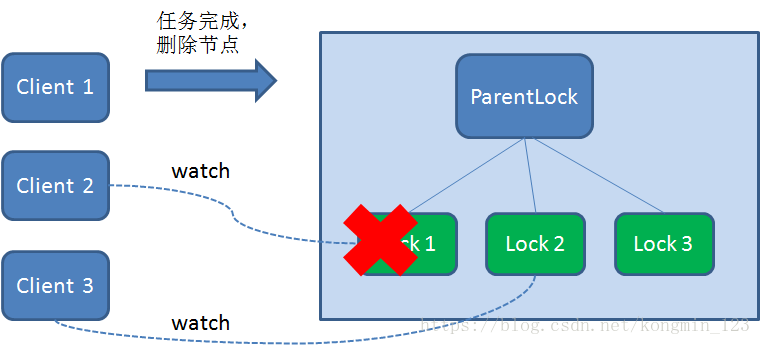

**2.任务执行过程中，客户端崩溃**

获得锁的Client1在任务执行过程中，如果Duang的一声崩溃，则会断开与Zookeeper服务端的链接。根据临时节点的特性，相关联的节点Lock1会随之自动删除。 

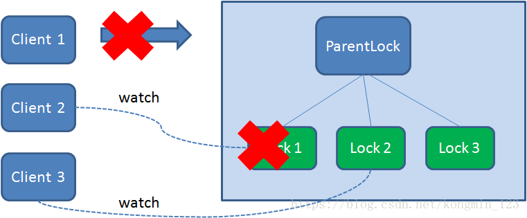

由于Client2一直监听着Lock1的存在状态，当Lock1节点被删除，Client2会立刻收到通知。这时候Client2会再次查询ParentLock下面的所有节点，确认自己创建的节点Lock2是不是目前最小的节点。如果是最小，则Client2顺理成章获得了锁。 

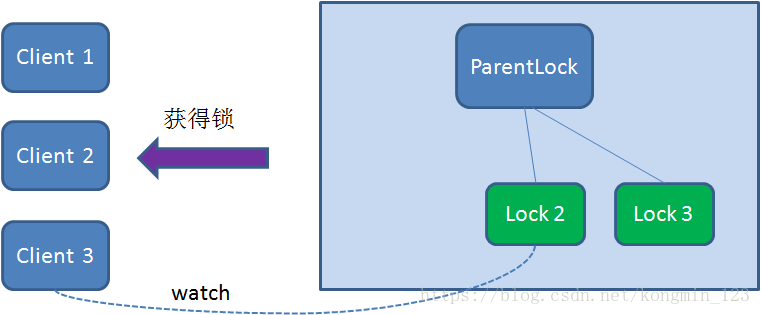

同理，如果Client2也因为任务完成或者节点崩溃而删除了节点Lock2，那么Client3就会接到通知。 

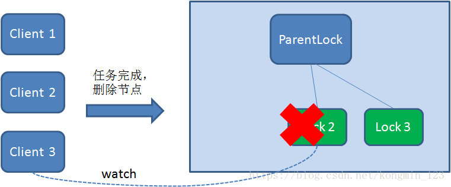

最终，Client3成功得到了锁。 

使用Zookeeper实现分布式锁的大致流程就是这样。那么使用Zookeeper实现的分布式锁和Redis实现的分布式锁相比有什么优势和劣势呢？

下面总结一下他们各自的优劣。

| 分布式锁 | 优点 | 缺点 |
| -------- | ---- | ---- |
| Zookeeper	| 1.有封装好的框架，容易实现 2.有等待锁的队列，大大提升抢锁效率。 | 添加和删除节点性能较低 |
| Redis | Set和Del指令性能较高 | 1.实现复杂，需要考虑超时，原子性，误删等情形。2.没有等待锁的队列，只能在客户端自旋来等待，效率低下。 |
