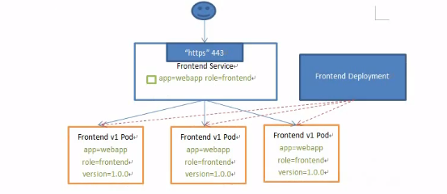
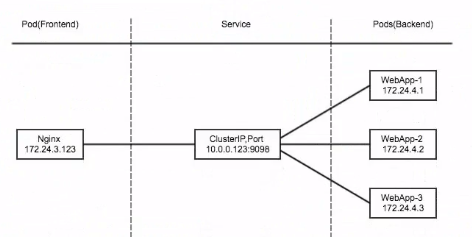
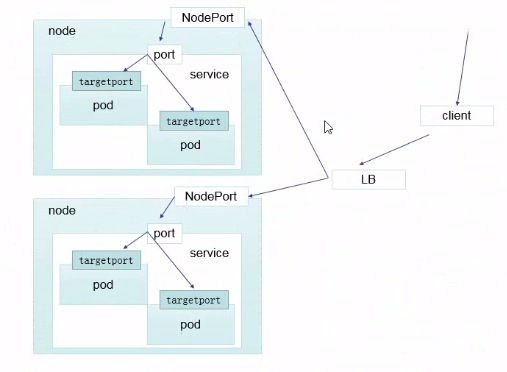
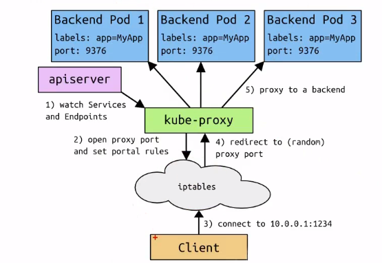
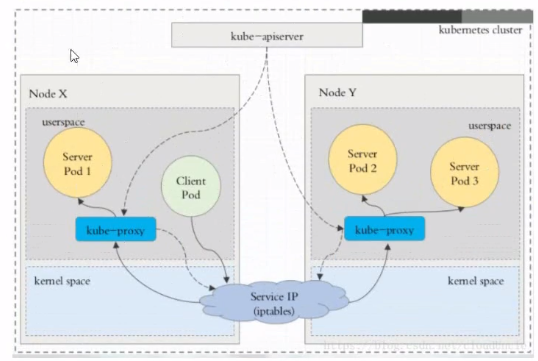
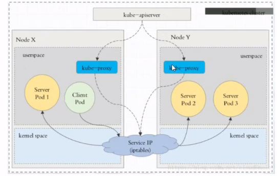
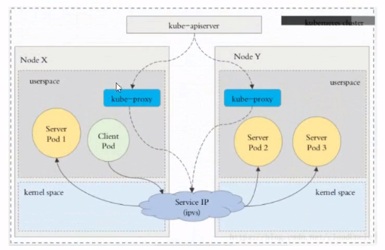
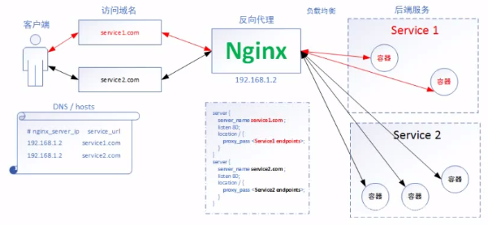
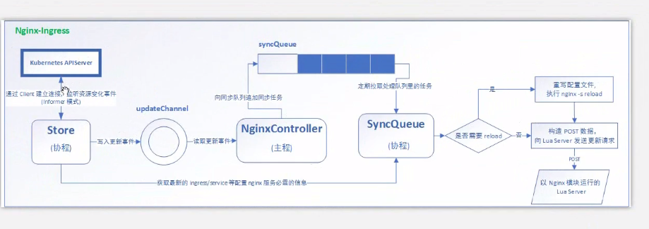

# Kubernetes

## 介绍说明

### 发展历史

#### 公有云类型说明

#### 资源管理器对比

#### K8S其优势

### K8S组件说明

#### Borg组件说明

#### K8S结构说明


- APISERVER：所有服务访问统一入口

- CrontrollerManager：维持副本期望数目

- Scheduler：负责介绍任务，选择合适的节点进行分配任务

- ETCD：键值对数据库 存储K8s集群所有重要信息（持久化）

- Kubelet：直接跟容器引擎交互实现容器的生命周期管理

- Kube-proxy：负责写入规则至IPTABLES、IPVS实现服务映射访问的

  ##### 其他插件

  

  - COREDNS：可以为集群中的SVC创建一个域名IP的对应关系解析
  - DASHBOARD：给K8s集群提供一个B/S结构访问体系
  - Ingress Controller：官方只能实现四层代理，Ingress可以实现七层代理
  - FEDETATION：提供一个可以跨集群中心多K8s统一管理的功能
  - PROMETHEUS（普罗米修斯）：提供K8S集群的监控能力
  - ELK：提供K8s集群日志统一分析介入平台

##### 网络结构

##### 组件结构

### K8S中一些关键字解释

## 基础概念

### Pod概念

#### 自助式Pod
#### 管理器管理的Pod
##### RS，RC

**ReplicationController用来确保容器应用的副本数始终保持在用户定义的副本数，即如果有容器异常退出，会自动创建新的Pod来替代；而如果异常多出来的容器也会自动回收在新版本的 Kubernetes中建议使用 ReplicaSe来取代 ReplicationControlle**

**ReplicaSe跟 ReplicationController没有本质的不同，只是名字不一样，并且Replicase支持集合式的 selector**

**虽然 ReplicaSe可以独立使用，但一般还是建议使用 Deployment来自动管理Repl icase，这样就无需担心跟其他机制的不兼容问题（比如 Replicase不支持rolling update但 Deployment支持）**

##### deployment
##### HPA

**Horizontal Pod Autoscaling仅适用于 Deployment和 Replicase，在V版本中仪支持根据Pod的cP利用率扩所容，在 alpha版本中，支持根据内存和用户自定义的 metric扩缩容**

##### StatefullSet

**Statefulset是为了解决有状态服务的问题（对应 Deployments和 Replicase是为无状态服务面设计），其应用场景包括：**

- **稳定的持久化存储，即Pod重新调度后还是能访问到相同的持久化数据，基于PvC来实现**
- **稳定的网络标志，即Pod重新调度后其 TodTnau和os不变，基于 Headless Service(即没有 Cluster IP的 Service）来实现**
- **有序部署，有序扩展，即Pod是有顺序的，在部署或者扩展的时候要依据定义的顺序依次依次进行（即从0到N-1.在下一个Pod运行之前所有之前的Pod必须都是 Running和 Ready状态），基于 init containers来实现**
- **有序收缩，有序剩除（即从N-1到0）**

##### DaemonSet

**Daemon Set确保全部（或者一些）Node上运行一个Pod的副本。当有Mode加入集群时，也会为他们新增一个Pod，当有Nod从集群移除时，这些Pd也会被回牧。删除 DemonSet将会删除它创建的所有Pod**

**使用DaemonSet的一些典型用法：**

- ***运行集群存储 daemon，例如在每个Node上运行 cluster、ceph**
- **在每个Node上运行口志收集 daeron，例如 fluentd、 logstash**
- **在每个Mde上运行监控 daemon，例如 Prometheus Node Exporter**


##### Job,Cronjob

**Job负责批处理任务，即仅执行一次的任务，它保证批处理任务的一个或多个Pod成功结束**

**Cron Job管理基于时间的job，即：**

- **在更定时间点只运行一次**
- **周期性地在给定时间点运行**

#### 服务发现


#### Pod协同


### 网络通讯模式

#### 网络通讯模式说明

**Kubernetes的网络模型假定了所有Pod都在一个可以直接连通的扁平的网络空间中，这在GCE（ Google Compute Engine）里面是现成的网络模型， Kubernetes假定这个网络已经存在。
而在私有云里搭建 Kubernetes集群，就不能假定这个网络已经存在了。我们需要自己实现这个网络假设，将不同节点上的 Docker容器之间的互相访问先打通，然后运行 Kubernetes**

- **同一个Pod内的多个容器之间：lo**
- **各Pod之间的通讯：Overlay Network**
- **Pod与 Service之间的通讯：各节点的 Iptables规则**

1. Flannel

   **Flannel是 CoreOS团队针对 Kubernetes设计的一个网络规划服务，简单来说，它的功能是让集群中的不同节点主机创建的 Docker容器都具有全集群唯一的虚拟IP地址。而且它还能在这些IP地址之间建立一个覆盖网络（Overlay Network），通过这个覆盖网络，将数据包原封不动地传递到目标容器内**

#### 组件通讯模式说明

**ETCD之 Flannel提供说明：**

- > 存储管理 Flannel可分配的IP地址段资源

- > 监控ETCD中每个Pod的实际地址，并在内存中建立维护Pod节点路由表

**同一个Pod内部通讯：同一个Pod共享同一个网络命名空间，共享同一个 Linux协议栈**

**Podl至Pod2**

- Podl与Pod2不在同一台主机，Pod地址是与 docker0在同一个网段的，但 docker0网段与宿主机网卡是两个完全不同的IP网段，并且不同Node之间的通信只能通过宿主机的物理网卡进行。将 PodINJIP和所在 NodeflJIP关联起来，通过这个关联让Pod可以互相访问
- Podl与Pod2在同一台机器，由 Docker0网桥直接转发请求至Pod2，不需要经过 Flannel演示

**Pod至 Service的网络：目前基于性能考虑，全部为 iptables维护和转发**

**Pod到外网：Pod向外网发送请求，查找路由表，转发数据包到宿主机的网卡，宿主网卡完成路由选择后， iptables执行 Masquerade，把源IP更改为宿主网卡的IP，然后向外网服务器发送请求**

**外网访问Pod:Service**

> 最新Pod至service的网络已经改用lvs模式

## Kubernetes安装

### 系统初始化

### Kubeadm部署安装

### 常见问题分析

## 资源清单

### K8S中资源的概念

#### 什么是资源

K8s中所有的内容都抽象为资源，资源实例化之后，叫做对象

#### 名称空间级别的资源

**工作负载型资源（ workload）：rod、 ReplicaSe、 Deployment、 StatefulSet、 Daemon Set、Job、 Cronjob（ Replication Controller在v1.11版本被废弃）**

**服务发现及负载均衡型资源（ ServiceDiscovery LoadBalance）：Service、 Ingress配置与存储型资源：Volume（存储卷）、CSI（容器存储接口，可以扩展各种各样的第三方存储卷）**

**特殊类型的存储卷：ConfigMap（当配置中心来使用的资源类型）、 Secret（保存敏感数据）、 DownwardAPI（把外部环境中的信息输出给容器）**

- kubeadm

- k8s

- kube-system

  ```bash
  kubectl get pod -n default
  ```

#### 集群级别的资源

- Namespace
- Node
- Role
- ClusterRole
- RoleBinding
- ClusterRoleBinding

#### 元数据型资源

- HPA
- PodTemplate
- LimitRange

### 资源清单

#### yaml语法格式

### 通过资源清单编写Pod

| 参数名                  | 字段类型 | 说明                                                         |
| ----------------------- | -------- | ------------------------------------------------------------ |
| version                 | String   | 治理是指K8sAPI的版本，目前基本上是v1，可以用kubectl api-version命令查询 |
| kind                    | String   | 这里指的是yaml文件定义的资源类型和角色，比如说pod            |
|                         | Object   | 元数据对象，固定值就写metadata                               |
| metadata.name           | String   | 元数据对象的名字，这里由我们编写，比如命名Pod的名字          |
| metadata.namespace      | String   | 元数据对象的命名空间，由我们自身定义                         |
|                         | Object   | 详细定义对象，固定值就写Spec                                 |
| spec.containers[]       | list     | 这里是Spec对象的容器列表定义，是个列表                       |
| spec.containers[].name  | String   | 这里定义容器的名字                                           |
| spec.containers[].image | String   | 这里定义要用到的镜像名称                                     |

- Always 每次都尝试重新拉取镜像
- Never 表示仅适用本地镜像
- IfNotPresent 如果本地有进项就使用本地镜像，如果没有就拉取在线镜像
- 上边三个都没设置的话，默认是Always

spec.containers[]下边的值

| 参数名                                      | 字段类型 | 说明                                                         |
| ------------------------------------------- | -------- | ------------------------------------------------------------ |
| spec.containers[].name                      | String   | 定义容器的名字                                               |
| spec.containers[].image                     | String   | 定义要用到的镜像名称                                         |
| spec.containers[].imagePullPolicy           | String   | 定义镜像拉取策略，有Always、Never、IfNotPresent三个值可选    |
| spec.containers[]/command[]                 | List     | 指定容器启动命令，因为是数组可以指定多个，不指定则使用镜像打包时使用的启动命令 |
| spec.containers[].args[]                    | List     | 指定容器启动命令参数，因为是数组可以指定多个                 |
| spec.containers[].workingDir                | String   | 指定容器的工作目录                                           |
| spec.containers[].volumeMounts[]            | List     | 指定容器内部的存储卷配置                                     |
| spec.containers[].volumeMounts[].name       | String   | 指定可以被容器挂载的存储卷的名称                             |
| spec.containers[].volumeMounts[].mountPath  | String   | 指定可以被容器挂载的存储卷的路径                             |
| spec.containers[].volumeMounts[].readOnly   | String   | 设置存储卷路径的读写模式。true或者false，默认为读写类型      |
| spec.containers[].ports[]                   | List     | 指定容器需要用到的端口列表                                   |
| spec.containers[].ports[].name              | String   | 指定端口名称                                                 |
| spec.containers[].ports[].containerPort     | String   | 指定容器需要监听的端口号                                     |
| spec.containers[].ports[].hostPort          | String   | 指定容器所在主机需要监听的端口号，默认跟上面的containerPort相同，注意设置了hostPort同一台主机无法启动该容器的相同副本（因为主机的端口号不能相同，这样会冲突） |
| spec.containers[].ports[].protocol          | String   | 指定端口协议，支持TCP和UDP，默认值为TCP                      |
| spec.containers[].env[]                     | List     | 指定容器运行前需设置的环境变量列表                           |
| spec.containers[].env[].name                | String   | 指定环境变量名称                                             |
| spec.containers[].env[].value               | String   | 指定环境变量值                                               |
| spec.containers[].resources                 | Object   | 指定资源限制和资源请求的值（这里开始就是设置容器的资源上限） |
| spec.containers[].resources,limits          | Object   | 指定设置容器运行时资源的运行上限                             |
| spec.containers[].resources.limits.cpu      | String   | 指定CPU的限制，单位为core数，将用于docker run --cpu-shares参数 |
| spec.containers[].resources.limits.memory   | String   | 指定MEM内存的限制，单位为MIB，GiB                            |
| spec.containers[].resources.requests        | Object   | 指定容器启动和调度时的限制设置                               |
| spec.containers[].resources.requests.cpu    | String   | CPU请求，单位为core数，容器启动时初始化可用数量              |
| spec.containers[].resources.requests.memory | String   | 内存请求，单位为MIB，GiB，容器启动时的初始化可用数量         |

| 参数名               | 字段类型 | 说明                                                         |
| -------------------- | -------- | ------------------------------------------------------------ |
| spec.restartPolicy   | String   | 定义Pod的重启策略，可选值的Alwayss、OnFailure、Never，默认值的Always |
| spec.nodeSelector    | Object   | 定义Node的Label过滤标签，以key:value格式指定                 |
| spec.imagePulSecrets | Object   | 定义pull镜像时使用Secret名称，以name:secretkey格式指定       |
| spec.hostNetwork     | Boolean  | 定义是否使用主机网络模式，默认值为false。设置true表示使用宿主机网络，不适用docker网桥，同时设置了true将无法在同一台宿主机上启动第二个副本 |

- Always：Pod一旦终止运行，则无论容器是如何终止的，kubelet服务都将重启他
- OnFailure：只有Pod以非零退出码终止时，kubelet才会重启该容器。如果容器正常结束（退出码为0），则kubelet将不会重启它。
- Never：Pod终止后，kubelet将退出码报告给Master，不会重启该Pod

### Pod的生命周期


#### Pause

#### initC

初始化容器

在初始化容器之后就会自动销毁

如果initC没有执行成功 MainC并不会执行

**Pod能够具有多个容器，应用运行在容器里面，但是它也可能有一个或多个先于应用容器启动的Init容器 **

**Init容器与普通的容器非常像，除了如下两点:**

- **Init容器总是运行到成功完成为止**

* **每个Init器都必须在下一个Init容器启动之前成功完成**


- **如果pod的Init容器失败， Kubernetes会不断地重启该pod，直到Init容器成功为止然面**
- **如果Pod对应的 restartPolicy为 Never，它不会重新启动**

**因为Init容器具有与应用程序容器分离的单独镜像，所以它们的启动相关代码具有如下优势**

- 它们可以包含并运行实用工具，但是出于安全考虑，是不建议在应用程序容器镜像中包含这些实用工具的
- 它们可以包含使用工具和定制化代码来安装，但是不能出现在应用程序镜像中。例如，创建镜像没必要FROM另一个镜像，只需要在安装过程中使用类似sed、awk、 python或dig这样的工具。
- 应用程序镜像可以分离出创建和部署的角色，而没有必要联合它们构建一个单独的镜像。
- Init容器使用 Linux Namespace，所以相对应用程序容器来说具有不同的文件系统视图。因此，它们能够具有访问 Secret的权限，而应用程序容器则不能
- 它们必须在应用程序容器启动之前运行完成，而应用程容器是并行运行的，所以Init容器能够提供了一种简单的阻塞或延迟应用容器的启动的方法，直到满足了一组先决条件。


- 在Pod启动过程中，Init容器会按顺序在网络和数据卷初始化之后启动。每个容器必须在下一个容器启动之前成功退出
- 如果由于运行时或失败退出，将导致容器启动失败，它会根据Pod的 restartPolicy指定的策略进行重试。然而，如果Pod的 restartPolicy设置为 Always,Init容器失败时会使用RestartPolicy策略
- 在所有的Init容器没有成功之前，Pod将不会变成 Ready状秦。Init容器的端口将不会在Service中进行聚集。正在初始化中的Pod处于 Pending状态，但应该会将 Initializing状态设置为true
- 如果Pod重启，所有Init容器必须重新执行日#对Init容器spec的修改被限制在容器 lmage字段，修改其他宁段都不会生效。史改Init容器的 image字段，等价于重启该Pod
- Init容器具有应用容器的所有字段。除了 readinessprobe，因为Init容器无法定义不同于完成（ completion）的就绪（ readiness）之外的其他状态。这会在验证过程中强制执行
- 在Pod中的每个app和Init容器的名称必须唯一；与任何其它容器共享同一个名称，会在验证时抛出错误


##### init容器

```yaml
apiVersion:v1
kind: Pod
metadata:
  name: myapp-pod
  labels:
    app: myapp
  spec: 
    containers:
    - name: myapp-container
      image: busybox
      command: ['sh', '-c', 'echo The app is running! && sleep 3600']
    initContainers:
    - name: init-myservice
      image: busybox
      command: ['sh', '-c', 'until nslookup myservice; do echo waiting for myservice; sleep 2; done;']
    - name: init-mydb
      image: busybox
      command: ['sh', '-c', 'until nslookup mydb; do echo waiting for mydb; sleep 2; done;']
```

```yaml
kind: Service 
apiVersion: v1
metadata:
  name: myservice
spec:
  ports:
  - protocol: TCP
    port: 80
    targetPort: 9376
---
kind: Service
apiVersion: v1
metadata:
  name: mydb
spec:
  ports:
  - protocol: TCP
    port: 80
    targetPort: 9377
```


#### Pod phase

可能存在的值

- 挂起（Pending): Pod已被Kubernetes系统结构，但有一个或者多个容器镜像尚未被创建。等待时间包括调度Pod的时间和通过网络下载镜像的时间，这可能需要花点时间
- 运行中（Running）：该Pod已经绑定到了一个节点上，Pod中所有的容器都已经被创建。至少有一个容器正在运行，过着正处于启动或重启状态
- 成功（Success）：Pod中所有容器都被成功终止，并且不会再重启
- 失败（Failed）： Pod中所有的容器都已终止了，并且不会再重启
- 未知（Unknown）：应为某些原因无法取得Pod的状态，通常是因为与Pod所在主机通信失败

#### 容器探针

> 探针是由kubelet对容器执行的定期诊断。要执行诊断,kubelet调用由容器实现的Handler

有三种类型的处理程序

- ExecAction: 在容器内执行指定命令。如果命令退出时返回码为，则认为诊断成功
- TCPSocketAction:对指定端口上的容器的IP地址进行TCP检查。如果端口打开，则诊断被认定是成功的
- HTTPGetAction：对指定的端口和路径上的容器的IP地址执行HTTP Get请求，若果响应的状态码大于等于200且小于400，则诊断被认定是成功的

每次探测都将获得一下三种结果之一

- 成功： 容器通过了诊断
- 失败： 容器未通过诊断
- 未知： 诊断失败，因此不会采取任何行动

##### livenessProbe

就绪检测

只是容器是否正在运行。如果存活探测失败，则kubelet会杀死容器，并且容器将受到其重启策略的影响。如果容器不提供存活探针，则默认状态为Success

###### livenessProbe-exec

```yaml
apiVersion: v1
kind: Pod
metadata:
  name: liveness-exec-pod
  namespace: default
spec:
  containers:
  - name: liveness-exec-container
    image: hub.atguigu.com/library/busybox
    imagePullPolicy: IfNotPresent
    command: ["/bin/sh","-c","touch /tmp/live ; sleep 60; rm -rf /tmp/live; sleep 3600"]
    livenessProbe:
      exec:
        command: ["test", "-e", "/tmp/live"]
      initialDelaySeconds: 1
      periodSeconds: 3
```

###### livenessProbe-httpget

```yaml
apiVersion: v1
kind: Pod
metadata: 
  name: liveness-httpget-pod
  namespace: default
spec:
  containers:
  - name: readiness-httpget-container
    image: hub.atguigu.com/library/myapp:v1
    imagePullPolicy: ifNotPresentports
    ports:
    - name: http
      containerPort: 80
    livenessProbe:
      httpGet:
        port: http
        path: /index.html
      initialDelaySeconds: 1
      periodSeconds: 3
      timeoutSeconds: 10
```

###### livenessProbe-tcp

```yaml
apiVersion: v1
kind: Pod
metadata:
  name: probe-tcp
spec:
  containers:
  - name: nginx
  image: hub.atguigu.com/library/myapp:v1
  livenessProbe:
    initialDelaySeconds: 5
    timeoutSeconds: 1
    tcpSocket:
      port: 80
```


##### readinesssProbe

就绪检测

只是容器是否准备好服务请求。如果就绪探测失败，端点控制器将从与Pod匹配的所有Service的端点中删除该Pod的IP地址。初始延迟之前的就绪状态默认为Failure。如果容器不提供就绪探针，则默认状态为Success

###### readinessPrebe-httpget

```yaml
apiVersion: v1
kind: Pod
metadata: 
  name: rediness-httpget-pod
  namespace: default
spec:
  containers:
  - name: readiness-httpget-container
    image: *****:v1
    imagePullPolicy: ifNotPresentports
    readinessProbe:
      httpGet:
        port: http
        path: /index1.html
      initialDelaySeconds: 1
      periodSeconds: 3
```


#### Pod hook

#### 重启策略

#### 启动、退出动作

```yaml
apiVersion: v1
kind: Pod
metadata:
  name: lifecycle-demo
spec:
  containers:
  - name: lifecycle-demo-container
    image: nginx
    lifecycle:
      postStart:
        exec:
          command: ["/bin/sh", "-c", "echo Hello from the postStart handler > /usr/share/message"]
        preStop:
          exec:
            command: ["/usr/sbin/nginx", "-s", "quit"]
```


## Pod控制器

### Pod控制器说明

#### 什么是控制器

Kubernetes中内建了很多controller（控制器），这些相当于一个状态机，用来控制Pod的具体状态和行为

#### 控制器类型说明

##### ReplicationController和ReplicaSet

RC用来确保容器应用的副本数使用保持在用户定义的副本数，即如果有空气异常退出，会自动创建新的Pod来替代；而如果异常多出来的容器也会自动回收

在新版本的kubernetes中建议使用RS来取代RC。RS跟RC没有本质的不同，只是名字不一样，而且RS支持集合式的selector；

##### Deployment

Deployment为Pod和RS提供了一个声明式定义（declarative）方法，用来替代以前的RC来方便的管理应用。典型的应用场景包括：

- 定义Deployment来创建Pod和RS
- 滚动升级和回滚应用
- 扩容和缩容
- 暂停和继续Deployment

**1. 部署一个简单的Nginx应用**

```yaml
apiVersion: extensions/v1beta1
kind: Deployment
metadata:
  name: nginx-deployment
spec:
  replicas: 3
  template:
    metadata:
      labels:
        app: nginx
    spec:
      containers:
      - name: nginx
        image: nginx:1.7.9
        ports:
        - containerPort: 80
```

```bash
kubectl create -f https://kubertes.io/docs/user-guid/nginx-deployment.yaml --record ##--record参数可以记录命令，我们可以很方便的查看每次revision的变化
```

**2. 扩容**

```bash
kubectl scale deployment nginx-deployment --replicas 10
```

**3. 如果集群支持horizontal pod autoscaling的话，还可以为Deployment设置自动扩展**

```bash
kubectl autoscale deployment nginx-deployment --min=10 --max=15 --cpu-percent=80
```

**4. 更新镜像也比较简单**

```bash
kubectl set image deployment/nginx-deployment nginx=ngingx:1.9.1
```

**5. 回滚**

```yaml
kubectl rollout undo deployment/nginx-deployment
```


###### RS与RC与Deployment关联

RC主要的作用就是用来确保容器应用的副本数始终保持在用户定义的副本数，即如果由容器异常退出，会自动创建新的Pod来替代；如果异常多出来的容器也会自动回收

**Kubernetes官方建议使用RS替代RC进行部署**

```yaml
apiVersion: extensions/v1beta1
kind: ReplicaSet
metadata:
  name: frontend
spec:
  replicas: 3
  selector:
    matchLables:
      tier: frontend
    spec:
      containers:
      - name: php-redis
        image: gcr.io/gogle_samples/gb-frontend:v3
        env:
        - name:GET_HOSTS_FROM
          value: dns
        ports:
        - containerPort: 80
```

###### RS与Deployment的关联


###### Deployment更新策略

**Deployment可以保证在升级时只有一定数量的Pod是Down的。默认的，他会确保至少有比期望的Pod数量少一个是up状态（最多一个不可用）**

**Deployment同时也可以确保只创建出超过期望数量的一定数量的Pod。默认的，它会确保最多比期望的Pod数量多一个的Pod是up的（最多一个surge）**

**未来的Kubernetes版本中，将从1-1变成25%-25%**

```bash
kubectl describe deployments
```

###### Rollover(若阁rollout并行)

**假如创建了一个有5个nginx:1.7.9replica的Deployment，但是当还只有3个nginx:1.7.9的replica创建出来的时候就开始更新含有5个的nginx:1.9.1replica的Deployment。在这种情况下，Deployment会立即杀掉已创建的3个nginx:1.7.9的Pod。并开始创建nginx：1.9.1的Pod，它不会等到所有的5个nginx:1.7.9的Pod都创建完成后才开始改变航道**

###### 回退Deployment

>只要Deployment的rollout被触发就会创建一个revision。也就是说当且仅当Deployment的Pod template本更改，例如更新template中的label和容器镜像时，就会创建出一个新的revision。其他的更新，比如扩容Deployment不会创建revision--因此我们可以很方便的手动或自动扩容。这意味着当回退到历史revision时，只有Deployment中的Pod template部分才会回退

```bash
kubectl set image deployment/nginx-deployment nginx=nginx:1.9.1
kubectl rollout status deployment nginx-deployment
## 查看当前的更新状况
kubectl get pods
kubectl rollout history deployment/nginx-deployment
## 查看历史版本
kubectl rollout undo deployment/nginx-deployment
kubectl rollout undo deployment/nginx-deployment --to-revision=2
##可以使用revision参数指定某个历史版本
kubectl rollout pause deployment/nginx-deployment
## 暂停 deployment的更新
```

###### 清理Policy

**可以通过设置.spec.revisionHistoryLimit项来指定deployment最多保留多少revision历史记录；如果将该项设置为0，Deployment就不允许回退了**

##### DaemonSet

DaemonSet确保全部（或者一些）Node上运行一个Pod的副本。当有Node加入集群时，也会为阀门新增一个Pod。当有Node从集群移除时，这些Pod也会被回收，删除DaemonSet将会删除它创建的所有Pod

使用DaemonSet的一些典型用法：

- 运行集群存储daemon，例如在Node上运行glusterd、ceph
- 在每个Node上运行日志收集daemon，例如fluentd、logstash
- 在每个Node上运行监控daemon，例如Prometheus Node Exporter、collected、Datadog代理、NewRelic代理，或Ganglia gmond

```yaml
apiVersion: apps/v1
kind: DaemonSet
metadata:
  name: daemonset-example
  lables:
    app: daemonset
spec:
  selector:
    matchLabels:
      name: daemonset-example
  template:
    metadata:
      labels:
        name: daemonset-example
    spec:
      containers:
      - name: daemonset-example
        image:wangyanglinux/myapp:v1
```


##### Job

> Job负责批处理任务，即仅执行一个的任务，它保证批处理任务的一个或多个Pod成功结束

特殊说明

- spec.template格式同Pod
- RestartPolicy仅支持Never或OnFailure
- 单个Pod时，默认Pod成功允许后Job即结束
- .spec.completions标志Job结束需要成功运行Pod个数，默认为1
- .spec.parallelism标志并运行的Pod的个数，默认为1
- sepc.activeDeadlineSeconds标志失败Pod的重试最大时间，超过这个时间不会继续重试

```yaml
apiVesion: batch/v1
kind: Job
metadata:
  name: pi
spec: 
  template:
    metadata:
      name: pi
    spec:
      containers:
      - name: pi
        image: perl
        command: ["perl", "-Mbignum-bpi", "-wle", "print bpi(2000)"]
      restartPolicy: Never
```

<!--查看日志，可以显示出答应的2000位 π值-->

##### CronJob Spec

- **`spec.template`**格式同Job
- RestartPolict仅支持Never或OnFailure
- 单个Pod时，默认Pod成功运行后Job即结束
- **`.spec.completions`**标志Job结束需要成功运行的Pod个数，默认为1
- **`.spec.parallelism`**标志并运行的Pod的格式，默认为1
- **`spec.activeDeadlineSeconds`**标志失败的Pod的重试最大时间，超过这个时间不会重试

##### CronJob 

> 在特定的时间循环创建Job

CronJob管理基于时间的Job，即

- 在给定时间点只运行一次
- 周期性地在给定时间点运行

适用前提条件：**当前使用的Kubernetes集群，版本>=1.8(对CronJob)。对弈先前版本的集群，版本<1.8,启动API Server时，通过传递选项--runtime-config=batch/v2alpha1-true可以开启batch/v2alpha1API**

典型的用法如下所示：

- 在给定的时间点调度Job运行
- 创建周期性运行的Job，例如：数据库备份、发送邮件

###### CronJob Spec

- **`.spec.schedule`**:调度，必须字段，指定任务运行周期，格式同Cron

- **`.spec.jobTemplate`**:Job模板，必须字段，指定需要运行的任务，格式同Job

- **`.spec.startingDeadlineSeconds`**：启动Job的期限（秒级别），该字段是可选的，如果应为任何原因而错过了被调度的时间，那么错过执行时间的Job将被认为是失败的。如果没有指定，则没有期限

- **`.spec.concurrencyPolicy`**:并发策略，该字段也是可选的。它制定了如何处理被CronJob创建的Job的并发执行，只允许指定下面策略中的一种

  - **`Allow`(默认)**：运行并发运行Job

  - **`Forbid`**：禁止并发运行，如果前一个还没有完成，则直接跳过下一个

  - **`Replace`**：取消当前正在运行的Job，用一个新的来替代

    **注意，当前策略只能应用于用一个CronJob创建的Job。若果存在多个CronJob，他们创建的Job之间重视允许并发运行**

- **`.spec.suspend`**:挂起，该字段也是可选的。如果设置为true，后续的所有执行都会被挂起。它对已经开始执行的Job不起作用，默认为false

- **`.spec.successfulJobHistoryLimit`**和**`.spec.failedJobHistoryLimit`**:历史限制，是可选的字段。它们制定了可以保留多少完成和失败的Job。默认情况下，它们分别设置为3和1.设置限制的值为0，相关类型的Job完成后不会被保留

```yaml
apiVersion: batch/b1beta1
kind: CronJob
metadata:
  name: hello
spec:
  schedule: "*/1 * * * *"
  jobTemplate:
    spec:
      template:
        spec:
          containers:
          - name: hello
            image: busybox
            args:
            - /bin/sh
            - -c
            - date; ceho Hello from the Kubernetes cluster
          restartPolicy: OnFailure
```

###### CronJob本身的一些限制

**创建Job操作应该是幂等的**

##### StatefulSet

StatefulSet作为Controller为Pod提供的唯一表示。它可以保证部署和Scale的顺序

StatefulSet是为了解决有状态服务的问题（对应Deployment和ReplicaSets是为无状态服务而设），其应用场景包括

- 稳定的持久化存储，即Pod重新调度后还是能访问到相同的持久化数据，基于PVC来实现
- 稳定的网络标志，即Pod重新调度后其PodName和HostName不变，基于Headless Service（即没有Cluster IP的Service）来实现
- 有序部署，有序扩展，即Pod是有顺序的，在部署或者扩展的时候要依据定义的顺序依次进行（即从0到N-1，在下一个Pod运行之前所有之前的Pod必须是Running和Ready状态），基于init containers来实现
- 有序收缩，有序删除（即从N-1到0）

##### Horizontal Pod AutoScaling

> 应用的资源使用率通常都有高峰和低谷的时候，如何削峰填谷，提高集群的整体资源利用率，让service中的Pod个数自动调整呢？这就有赖于Horizontal Pod AutoScaling了，顾名思义，使Pod水平自动缩放


## 服务发现

### Service原理

#### Service的概念

**Kubernetes `Service`定义了这样一种抽象：一个`Pod`的逻辑分组，一种可以访问它们的策略———通常称之为微服务。这一组Pod能够被Service访问到，通常是通过Label Selector**



#### Service含义

**Service能够提供负载均衡的能力，但是在使用上有以下限制**

- **只提供4层负载均衡能力，而没有7层功能，但有时我们可能需要更多的匹配规则来转发请求，这点上4层的负载均衡是不支持的**

#### Service常见分类

##### ClusterIP

**默认类型，自动分配一个仅Cluster内部可以访问的虚拟IP**

**clusterIP主要在每个node节点使用iptables，将发向clsterIP对应端口的数据，转发到kube-proxy中。然后kube-proxy自己内部实现有负载均很的方法，并可以查询到这个service下对应pod的地址和端口，进而把数据转发给对应的pod的地址和端口**



**为了实现图上的功能，主要需要以下几个组件的协同工作：**

- **apiserver 用户通过kubectl命令向apiserver发送创建service的命令， apiserver接收到请求后将数据存储到etcd中**
- **kube-proxy Kubernetes的内阁节点中都有一个叫做kube-proxy的进程，这个进程负责感知service、pod的变化，并将变化的信息写入到本地的iptables规则中**
- **iptables通过NAT等技术将virtualIP的流量转至endpoint中**

###### 例子

创建deployment 

```yaml
apiVersion: apps/v1
kind: Deployment
metadata:
  name: myapp-deploy
  namespace: defualt
spec:
  replicas: 3
  selector:
    matchLabels:
      app: myapp
      release: stabel
    template:
      metadata:
        labels:
          app: myapp
          release: stabel
          env: test
      spec:
        containers:
        - name: myapp
          image: ikubernetes/myapp:v2
          imagePullPolicy: IfNotPresent
          ports:
          - name: http
            containerPort: 80
```

创建Service信息

```yaml
apiVersion: v1
kind: Service
metadata:
  name: myapp
  namespace: default
spec:
  type: ClusterIP
  selector:
    app: myapp
    release: stabel
  ports:
  - name: http
    port: 80
    targetPort: 80
```


##### NodePort

**在ClusterIP基础上为Service在每台机器上绑定一个端口，这样就可以通过<NodeIP>:<NodePort>来访问该服务**

**nodePort的原理在于在node上开了一个端口，将向改端口的流量导入到kube-proxy，然后由kube-proxy进一步到给对应的Pod**

###### 例子

```yaml
apiVersion: v1
kind: Service
metadata:
  name: myapp
  namespace: default
spec:
  type: NodePort
  selector:
    app: myapp
    release: stabel
  ports:
  - name: http
    port: 80
    targetPort: 80
```


##### LoadBalancer

**在NodePort的基础上，借助Cloud provider创建一个外部负载均衡器，并将请求转发到<NodeIP>:<NodePort>**

**loadBalancer和nodePort其实是同一种方式，区别在于loadBalancer比nodePort多了一步，就是可以调用cloud provider去创建LB来向节点导流**



##### ExternalName

**把集群外部的服务引入到集群内部来，在集群内部直接使用。没有任何类型代理被创建，这只有kubernetes1.7或更高版本的kube-dns才支持**



**这种类型的Service通过返回CNAME和它的值，可以将服务映射到externalName字段的内容(例如:`hub.atguigu.com`)。ExternalName Service是Service的特例，它没有selector，也没有定义任何的端口和Endpoint。相反的，对于运行在集群外部的服务，它通过返回该外部服务的别名这种方式来提供服务**

###### 例子

```yaml
kind: Service
apiVersion: v1
metadata:
  name: my-service-1
  namespace: defualt
spec:
  type: ExternalName
  externalName: my.database.example.com
```

**当查询主机my-service.default.svc.cluster.local(SVC_NAME.NAMESPACE.svc.cluster.local)时，集群的DNS服务将返回一个值 my.database.example.com的CNAME记录。访问这个服务的工作方式和其他的相同，唯一不同的是重定向发生在DNS层，而且不会进行代理或转发**


##### Headless Service

**有时不需要或者不想要负载均衡，一级单独的Service IP。遇到这种情况，可以通过制定Cluster IP(`spec.clusterIP`)的值为"None"来创建Headless Service。这类额Service并不会分配ClusterIP，kube-proxy不会处理他们，而且平台也不会为它们进行负载均衡和路由**

###### 例子

```yaml
apiVersion: v1
kind: Service
metadata:
  name: myapp-headless
  namespace: default
spec:
  selector:
    app: myapp
  clusterIP: "None"
  ports:
  - port: 80
    targetPort: 80
```

#### VIP和Service代理

**在Kubernetes集群中，每个Node运行一个`kube.proxy`进程。`kube-proxy`负责为`serivce`实现一种VIP(虚拟IP)的形式。而不是`ExternalName`的形式。在Kubernetes v1.0版本，代理完全在userspace。在Kubernetes v1.1版本，新增了iptables代理，但并不是默认的运行模式。从Kubernetes v1.2起，默认就是iptables代理。在Kubernetes v1.8.0-beta.0中，添加了`ipvs`代理**

**在Kubernetes 1.14版本开始默认使用ipvs代理**

**在Kubernetes v1.0版本，`Service`是“4层”（TCP/UDP over IP） 概念。在Kubernetes v1.1版本，新增了`Ingress`API（beta版），同来表示“7层”（HTTP）服务**

#### Service实现方式（代理模式的分类）

##### userspace



##### iptables



##### ipvs

**这种模式，kube-proxy会监视Kubernetes`Service`对象和`Endpoints`,调用`netlink`接口以相应地创建ipvs规则并定期与Kubernetes `Service`对象和`Endpoints`对象同步ipvs规则，以确保ipvs状态与期望一致。访问服务时，流量将被重新丁香岛其中一个后端Pod**

**与iptables类似，ipvs与netfilter的hook功能，但使用哈希表作为底层数据结构并在内核空间中工作。这意味着ipvs可以更快的重定向流量，并且在同步代理规则时具有更好的性能。此外，ipvs为负载均衡算法提供了更多选项，例如**

- **`rr`:轮询调度**
- **`lc`:最小连接数**
- **`dh`:目标哈希**
- **`sh`:源哈希**
- **`sed`:最短期望延迟**
- **`nq`:不排队调度**

<!--注意：ipvs模式假定在运行kube-proxy之前在节点上都已经安装了IPVS内核模块。当kube-proxy以ipvs代理模式启动时，kube-proxy将验证节点上是否安装了IPVS模块，如果未安装，则kube-proxy将回退到iptables代理模式-->



#### Ingress

##### Nginx

**Ingress-Nginx github地址: https://github.com/kubernetes/ingress-nginx**

**Ingress-Nginx 官网地址: https://kubernetes.github.io/ingress-nginx/**





###### HTTP代理访问

**deployment、service、Ingress Yaml文件**

```yaml
apiVersion: extensions/v1beta1
kind: Deployment
metadata:
  name: nginx-dm
spec:
  replicas: 2
  template:
    metadata:
      labels:
        name: nginx
    spec:
      containers:
        - name: nginx
          image: wangyanglinux/app:v1
          imagePullPolicy: IfNotPresent
          ports:
            - containerPort: 80
---
apiVersion: v1
kind: Service
metadata:
  name: nginx-svc
spec:
  ports:
    - port: 80
      targetPort: 80
      protocol: TCP
  selector:
    name: nginx
---
apiVersion: extensions/v1beta1
kind: Ingress
metadata:
  name: nginx-test
spec:
  rules:
    - host: foo.bar.com
      http:	
        paths:
        - path: /
          backend:
            serviceName: nginx-svc
            servicePort: 80
```

###### HTTPS代理访问

**创建证书，以及cert存储方式**

```bash
openssl req -x509 -sha256 -nodes -days 365 -newkey rsa:2048 -keyout tls.key -out tls.crt -subj "/CN=nginxsvc/O=nginxsvc"
kubectl create secret tls tls-secret --key tls.key --cert tls.crt
```

**deployment、service、Ingress Yaml文件**

```yaml
apiVersion: extensions/v1beta1
kind: Ingress
metadata:
  name: nginx-test
spec:
  tls:
    - hosts:
      - foo.bar.com
      secretName: tls-secret
  rules:
    - host: foo.bar.com
      http:
        paths:
        - path: /
          backend:
            serviceName: nginx-svc
            servicePort: 80
```


###### 使用cookie实现会话关联

###### Nginx进行BasicAuth

```bash
yum -y install httpd
htpasswd -C auth foo
kubectl create secret generic basic-auth --from-file=auth
```

```yaml
apiVersion: extensions/v1beta1
kind: Ingress
metadata:
  name: ingress-with-auth
  annotations:
    nginx.ingress.kubernetes.io/auth-type: basic
    nginx.ingress.kubernetes.io/auth-secret: basic-auth
    nginx.ingress.kubernetes.io/auth-realm: 'Authentication Required - foo'
spec:
  rules:
  - host: foo2.bar.com
    http:
      paths:
      - path: /
        backend:
          serviceName: nginx-svc
          servicePort: 80
```


###### Nginx进行重写

| 名称                                           | 描述                                                       | 值   |
| ---------------------------------------------- | ---------------------------------------------------------- | ---- |
| nginx.ingress.kubernetes.io/rewrite-target     | 必须重定向流量的目标URI                                    | 串   |
| nginx.ingress.kubernetes.io/ssl-redirect       | 只是未知部分是否仅可访问SSL(当Ingress包含证书时默认为True) | 布尔 |
| nginx.ingress.kubernetes.io/force-ssl-redirect | 及时Ingress未启用TLS，也强制重定向到HTTPS                  | 布尔 |
| nginx.ingress.kubernetes.io/app-root           | 定义Controller必须重定向的应用程序根，如果它在'/'上下文中  | 串   |
| nginx.ingress.kubernetes.io/use-regex          | 只是Ingress上定义的路径是否使用正则表达式                  | 布尔 |

```yaml
apiVersion: extensions/v1beta1
kind: Ingress
metadata:
  name: nginx-test
  annotations:
    nginx.ingress.kubernetes.io/rewrite-target: http://foo.bar.com:31795/hostname.html
spec:
  rules:
  - host: foo10.bar.com
    http:
      paths:
      - path: /
        backend:
        serviceName: nginx-svc
        servicePort: 80
```


## 存储

### PV

#### 概念解释

##### `PersistentVolume`(PV)

**是由管理员设置的存储，它是群集的一部分。就像节点是集群中的资源样，PV也是集群中的资源。PV是Volume之类的卷插件但目有独立于使用PV的Pod的生命周期。此API对象包含存储实现的细节，即NFS iSCSI或特定于云供应商的存储系统**

##### `PersistentVolumeClaim`(PVC)

**是用户存储的请求。它与Pod相似。Pod消耗节点资源，pvc消耗PV资源。Pod可以请求特定级别的资源（cpU和内存）。声明可以请求特定的大小和访问模式（例如，可以以读写一次或只读多次模式挂载）**

##### 静态pv

**集群管理员创建一些PⅤ，它们带有可供群集用户使用的实际存储的细节。它们存在于 Kubernetes APl中，可用于消费**

##### 动态

**当管理员创的静态PV都不匹配用户的 `PersistentvolumeClain`时，集群可能会尝试动态地为Pvc创建卷。此配置基于 `Storageclasses`:Pvc必须请求【储类】，井目管理员必须创建并配罟该类才能进行动态创建。声明该类为`""`可以有效地禁用其动态配置**

**要启用基于存储级別的动态存储配置，集群管理员需要启用 API server上的 `DefaultstorageClass`[唯入控制器]。例如，通过确保 `Defaultstorageclass`位于 API server组件的`--admission-control`标志，使用逗号分隔的有序值列表中，可以完成比操作**

##### 绑定

**master中的控制环路监视新的PVC，寻找匹配的PV（如果可能），并将它们绑定在一起。如果为新的PVC动态调配PV，则该环路将始终将该PV绑定到PVC。否则，用户总会得到他们所请求的存储，但是客量可能超岀要求的数显。一旦PV和PVC绑定后， `Persistentvolumeclaim`绑定是排他性的，不管它们是如何绑定的。pVc跟PV绑定是一对一的映射**

#### 持久化卷声明的保护

**pvC保护的目的是确保由pod正在使用的pvC不会从系统中移除，因为如果被移除的话可能会导致数据丢失**

<!--注意：当Pod状态为`Pending`并且pod已经分配给节点或pod为`Running`状态时，PVC处于活动状态-->

**当启用PvC保护 alpha功能时，如果用户删除了一个pod正在使用的PVC，则该PVC不会被立即删除。PVC的删除将被推迟，直到该PVC不再被任何pod使用**

#### 持久化卷类型

**`PersistentVolume`类型以插件形式实现。Kubernetes目前支持以下插件类型**

- **GCEPersistentDis AWSElasticBlockStore AzureFile AzureDis FC(Fibre Channel)**
- **FlexVolume Flocker NFS iSCSI RBD(Caph Block Device) CephFS**
- **Cinder(OpenStack block storage) Glusterfs VsphereVolume Quobyte Volumes**
- **HostPath VMware Photon Portworx Volumes ScaleIO Volumes StorageOS**

##### 持久卷演示代码

```yaml
apiVersion: v1
kind: PersistentVolume
metadata:
  name: pv0003
spec:
  capacity:
    storage: 5Gi
  volumeMode: Filesystem
  accessModes: 
    - ReadWriteOnce
  persistentVolumeReclaimPolicy: Recycle
  storageClassName: slow
  mountOptions:
    - hard
    - nfsvers=4.1
  nfs:
    path: /tmp
    server: 172.17.0.2
```


#### PV And PVC

##### 后端类型

##### PV访问模式说明

**`Persistent volume`可以以资源提供者支持的任何方式挂载到主机上。如下表所示，供应商目有不同的功能，每个Pv的访问模式都将被设置为该卷支持的特定模式。例如，NFS可以支持多个读/写客户端，但特定的 NFS PV可能以只读方式导出到服务器上。每个PV都有一套自己的用来描述特定功能的访问式**

- **ReadWriteOnce——该卷可以被单个节点以读/写模式挂载**
- **ReadOnlyMany——该卷可以被多个节点以只读模式挂载**
- **ReadWriteMany——该卷可以被多个节点以读/写模式挂载**

**在命令行中，访问模式缩写为**

- **RWO - ReadWriteOnce**
- **ROX - ReadOnlyMany**
- **RWX - ReadWriteMany**

<!--一个卷一次只能使用一种访问模式挂载，即使它支持很多访问模式。例如：GCEPersistentDisk可以由单个节点作为ReadWriteOnce模式挂载，或由多个节点以ReadOnlyMany模式挂载，但不能同时挂载-->

##### 回收策略

- **Retain(保留): ——手动回收**
- **Recycle(回收)：——基本擦除(`rm -rf /thevolume/*`)**
- **Delete(删除):——关联的存储资产（例如AWS EBS、GCE PD、Azure Disk和OpenStack Cinder卷）将被删除**

**当前只有NFS和HostPath支持回收策略。AWS EBS、GCE PD、Azure Disk和Cinder卷支持删除策略**

##### 状态

**卷可以处以以下的某种状态**

- **Available(可用) —— 一块空闲资源还没有被任何声明绑定**
- **Bound(以绑定) —— 卷已经被声明绑定**
- **Released(已释放) —— 声明被删除，但是资源还未被集群重新声明**
- **Failed(失败) —— 该卷的自动回收失败**

**命令行会显示绑定到PV 的PVC名称**

##### 实例演示

###### 1. 安装NFS服务器

```bash
yum install -y nfs-common nfs-utils rpcbind
mkdir /nfsdata
chmod 666 /nfsdata
chown nfsnobody /nfsdata
cat /etc/exports
   /nfsdata *(rw,no_root-squash,no_all_squash,sync)
systemctl start rpcbind
systemctl start nfs
```

###### 2. 部署PV

```yaml
apiVersion: v1
kind: PersistentVolume
metadata:
  name: nfspv1
spec:
  capaticy:
    storage: 1Gi
  accessModes:
    - ReadWriteOnce
  persistenVolumeReclaimPolicy: Recycle
  storageClassName: nfs
  nfs:
    path: /data/nfs
    server: 10.66.66.10
```

###### 3. 创建服务并使用PVC

```yaml
apiVersion: v1
kind: Service
metadata:
  name: nginx
  labels:
    app: nginx
spec:
  ports:
  - port: 80
    name: web
  clusterIP: None
  selector:
    app: nginx
---
apiVersion: apps/v1
kind: StatefulSet
metadata:
  name: web
sepc:
  selector:
    matchLabels:
      app: nginx
  serviceName: "nginx"
  replicas: 3
  template:
    metadata:
      labels:
        app: nginx
    spec:
      containers:
      - name: nginx
        image: k8s.gcr.io/nginx-slim:0.8
        ports:
        - containerPort: 80
          name: web
        volumeMounts:
          - name: www
            mountPath: /usr/share/nginx/html
  voluClaimTemplates:
  - metadata:
      name: www
    spec:
      accessModes: ["ReadWriteOnce"]
      storageClassName: "nfs"
      resources:
        requests:
          storage: 1Gi
```

#### 关于StatefulSet

- **匹配 Pod name（网络标识）的模式为:$(stateful名称)-(序号)，比如上面的示例：web-0，web-1, web-2**
- **StatefulSet为每个Pod副本创建了一个DNS域名，这个域名的格式为：$(podname).(headless server name)，也就意味着服务间是通过Pod名来通信而非 Pod ip，因为当Pod所在Node发生故障时，Pod会被飘移到其它Node上， Pod Ip会发生变化，但是Pod域名不会有变化**
- **Statefulset使用 Headless服务来控制Pod的域名，这个域名的FQDN为:(*servicename*).(namespace)svc.cluster.local，其中，" cluster.local"指的是集群的域名**
- **根据 volume Claim Templates，为每个Pod创建一个pvc,pvc的命名规则匹配模式:(volume.Claim.Templates.name)-(pod name)。比如上面的 volume Mounts. name=www,pod name=web-[0-2]，因此创建出来的PvC是 www-web-0、 www-web-1、 www-web2**
- **删除Pod不会删除其pvc，手动删除pvc将自动释放pv**

**Statefulset的启停顺序**

- **有序部署：部罟 StatefulSetl时，如果有多个Pod副本，它们会被顺序地创建（从0到N-1）井且，在下一个Pod运行之前所有之前的Pod必须都足 Running和 Ready状态**
- **有序删除：当Pod被删除时，它们被终止的顺序是从N-1到0。**
- **有序扩展：当对Pod执行扩展操作时，与部署一样，它前面的Pod必须都处于 Running和 Ready状态。**

**StatefulSet使用场景**

- **稳定的持久化存储，即Pod新调度后还是能访问到相同的持久化数据，基于PVC来实现。**
- **稳定的网络标识符，即Pod重新调度后其 PodName和 HostName不变。**
- **有序部署，有序扩展，基于 init containers来实现。**
- **有序收缩。**

###### 

### Volume

#### 概念定义

**容器磁盘上的文件的生命周期是短暂的，这就使得在容器中运行車要应用时会出现一些问题。首先，当容器崩溃时， kubelet会重启它，但足客器中的文件将丢失——容器以干净的状态（镜像最初的状态）重新启动。其次，在`pod`中时运行多个容器时，这些容器之间通常需要共享文件。 Kubernetes中的 `Volume`抽象就很好的解决**

**背景**

**Kubernetes中的卷有明确的寿命——与封装它的Pod相同。所以，卷的生命比Pod中的所有容器都长，当这个容器重启时数据仍然得以保存。当然，当Pod不再存在时，卷也将不复存在。也许更重要的是， Kubernetes支持多种类型的卷，Pod可以同时使用任意数量的卷**

##### 卷的类型

**Kubernetes支持以下类型的卷**

- `awsElasticBlockStore` `azureDisk` `azureFile` `cephfs` `cfi` `downwardAPI` `emptyDir`
- `fc` `flocker` `gcePersistentDisk` `gitRepo` `glusterfs` **`hostPath`** `iscsi` `local` `nfs`
- `persistentVolumeClaim` `projected` `portworxVolume` `quobyte` `rbd` `scaleIO` `secret`
- `storageos` `vsphereVolume`

#### emptyDir

##### 说明

**当Pod被分配给节点时，首先创建`emptyDir`卷，并目只要该Pd在该节点上运行，该卷就会存在。正如卷的名字宁所述，它最初是空的。Pod中的容器可以读取和写入 `emptyDir`卷中的相同文件，尽管该卷可以挂载到每个容器中的相同或不同路径上。当出于任何原因从节点中删除Pod时， `emptyDir`中的数据将被永久删除**

<!--注意：容器崩溃不会从节点中移除Pod，因此，`emptyDir`卷中的数据在容器崩溃时是安全的-->

##### 用途假设

- **暂存空间，例如用于基于磁盘的合并排序**
- **用作长时间计算崩溃恢复的检查点**
- **Web服务器容器提供数据时，保存内容管理器容器提取的数据**

##### 实验演示

```yaml
apiVersion: v1
kind: Pod
metadata:
  name: test-pd
spec:
  containers:
  - image: k8s.gcr.io/test-webserver
    name: test-container
    volumeMounts:
    - mountPath: /cache
      name: cache-volume
  volumes:
  - name: cache-volume
    emptyDir: {}
```


#### hostPath

##### 说明

**`hostpath`卷将主机节点的文件系统中的文件或目录挂载到集群中**

##### 用途说明

**`hostPath`的用途如下**

- **运行时需要访问Docker内部的容器： 使用`/var/lib/docker`的`hostPath`**
- **在容器中运行cAdvisor: 使用`/dev/cgroups`的`hostPaht`**

**除了所需的`path`属性之外，用户还可以为`hostPath`卷指定`type`**

| 值                  | 行为                                                         |
| ------------------- | ------------------------------------------------------------ |
|                     | 空字符串（默认）用于向后兼容，这意味看在挂载 hostPath卷之前不会执行任何检查。 |
| `DirectoryOrCreate` | 如果在给定的路径上没有任何东西存在，那么将根据需要在那里创建一个空目录，权限设置为0755，与 Kubelet具有相同的组和所有权 |
| `Directory`         | 给定的路径下必须存在目录                                     |
| `FileOrCreate`      | 如果在给定的路径上没有任何东西存在，那么会根据需要创建一个空文件，权跟设置为0644，与 Kubelet具有相同的组和所有权。 |
| `File`              | 给定的路径下必须存在文件                                     |
| `Socket`            | 给定的路径下必须存在UNIX套接字                               |
| `CharDevice`        | 给定的路径下必须存在字符设备                                 |
| `BlockDevice`       | 给定的路径下必须存在块设备                                   |

**使用这种卷类型时请注意，因为:**

- **由于每个节点上的文件都不同，具有相同配置（例如从 podTemplate创建的）的pod在不同节点上的行为可能会有所不同**。
- **当 Kubernetes按照计划添加资源感知调度时，将无法考虑 `host Path`使用的资源**
- **在底层主机上创建的文件或目录只能由root写入。您需要在特权客器中以root身份运行进程，或修改主机上的文件权限以便写入 `hostpath`卷**

##### 实验演示

```yaml
apiVersion: v1
kind: Pod
metadata:
  name: test-pd
spec:
  containers:
  - image: k8s.gcr.io/test-webserver
    name: test-container
    volumeMounts:
    - mountPaht: /test-pd
      name: test-volume
  volumes:
  - name: test-volume
    hostPath: 
      # directory location on host
      path: /data
      # this field is optional
      type: Directory
```

### Secret

#### 定义概念

##### 概念说明

**Secret解决了密码、token、秘钥等铭感数据的配置问题，而不需要把这些敏感数据暴露到镜像或者Pod Sepc中。Secret可以以Volume或者环境变量的方式使用**

##### 分类

###### 1. Service Account

**用来访问Kubernetes API，由Kubernetes自动创建，并且会自动挂载到Pod的`/run/secret/kubernetes.io/serviceaccount`目录中**

```bash
$ kubectl run nginx --image nginx
deployment "nginx" create
$ kubectl get pods

$ kubectl exec ******* ls /run/secret/kubernetes.io/serviceaccount
ca.crt
```


###### 2. Opaque Secret

**base64编码格式的Secret，用来存储密码、密钥等**

**a. 创建说明**

Opaque类型的数据时一个map类型，要求value是base64编码格式

```bash
$ echo -n "admin" | base64
```

**secrets.yaml**

```yaml
apiVersion: v1
kind: Secret
metadata:
  name: mysecret
type: Opaque
data:
 password: *********
 username: *********
```

**b. 使用方式**

**1) 将Secret挂载到Volume中**

```yaml
apiVersion: v1
kind: Pod
metadata:
  labels:
    name: secret-test
  name: secret-test
spec:
  volumes:
  - name: secrets
    secret:
      secretName: mysecret
  containers:
  - image: hub.atguigu.com/library/myapp:v1
    name: db
    volumeMounts:
    - name: secrets
      moutPath: "/etc/secrets"
      readOnlu: true
```

**2) 将Secret导出到环境变量中**

```yaml
apiVersion: extensions/v1beta1
kind: Deployment
metadata:
  name: pod-deployment
spec:
  replicas: 2
  template:
    metadata:
      labels:
        app: pod-deployment
    spec:
      containers:
      - name: pod-1
        image: hub.atguigu.com/library/myapp:v1
        ports:
        - containerPort: 80
        env:
        - name: TEST_USER
          valueFrom:
            secretKeyRef:
              name: mysecret
              key: username
        - name: TEST_PASSWORD
          valueFrom:
            secretKeyRef:
              name: mysecret
              key: password
```


###### 3. kubernetes.io/dockerconfigjson

**用来存储私有docker registry的认证信息**

**使用kubectl创建docker registry认证的secret**

```bash
$ kubectl create secret docker-registry myregistrykey --docker-server=DOCKER_REGISTRY_SERVER --docker-username=DOCKER_USER --docker-password=DOCKER_PASSWORD --docker-email=DOCKER_EMAIL
secret "myregistrykey" created
```

**创建Pod的时候，通过imagePullSecrets来引用刚创建的`myregistrykey`**

```yaml
apiVersion: v1
kind: Pod
metadata:
  name: foo
spec:
  containers:
    - name: foo
      image: roc/awangyang:v1
  imagePullSecrets:
    - name: myregistrykey
```

### ConfigMap

#### 定义概念

**ConfigMap功能在Kubernetes1.2版本版本中引入，许多应用程序会从配置文件，命令行参数或环境变量中读取配置信息。ConfigMap API给我们提供了向容器中注入配置信息的机制，ConfigMap 可以被用来保存单个属性，也可以用来保存整个配置文件或者JSON二进制大对象**

#### 创建configMap

##### 1. 使用目录创建

```bash
$ ls docs/user-gitde/configmap/kubectl
game.properties
ui.properties

$ cat docs/user-gitde/configmap/kubectl/game.properties
enemies=aliens
lives=3
enemies.cheat=true
enemies.cheat.level=noGoodRotten
secret.code.passphrase=UUDDLRLRBABAS
secret.code.allowed=true
secret.code.lives=30

$ cat docs/user-guid/configmap/kubectl/ui.properties
color.good=purple
color.bad=yellow
allow.textmode=true
how.nice.to.look=firlyNice

$ kubectl create configmap game-config --from-file=docs/user-guide/configmap/kubectl
```

**`-from-file`指定在目录下的所有文件都会被用在ConfigMap里面创建一个键值对，键的名字就是文件名，值就是文件的内容**

##### 2. 使用文件创建

**只要指定为一个文件就可以从单个文件中创建ConfigMap**

```bash
$ kubectl create configmap game-config-2 --from-file=docs/user-guide/configmap/kubectl/game.properties

$ kubectl get configmaps game-config-2 -o yaml
```

**`--fomr-file`这个参数可以使用多次，你可以使用两次分别制定上个实例中的那两个配置文件，效果就是跟指定整个目录一样的**

##### 3. 使用字面值创建

**使用文字值创建，利用`-from-literal`参数传递配置信息，该参数可以使用多次，格式如下**

```bash
$ kubectl create configmap special-config --from-literal=special.how=very --from-literal=special.type=charm

$ kubectl get configmaps special-config -o yaml
```


#### Pod中使用configMap

##### 1. 使用ConfigMap来替代环境变量

```yaml
apiVersion: v1
kind: ConfigMap
metadata:
  name: special-config
  namespace: default
data:
  special.how: very
  special.type: charm
```

```yaml
apiVersion: v1
kind: ConfigMap
metadata:
  name: env-config
  namespace: default
data:
  log_level: INFO
```

```yaml
apiVersion: v1
kind: Pod
metadata:
  name: dapi-test-pod
spec:
  containers:
    - name: test-container
      image: hun.atguigu.com/library/myapp:v1
      command: ["/bin/sh", "-c", "env"]
      env:
        - name: SPECIAL_LEVEL_KEY
          valueFrom:
            configMapKeyRef:
              name: special-config
              key: special.how
        - name: SPECIAL_TPYE_KEY
          valueFrom:
            configMapKeyRef:
              name: special-config
              key: special.type
       envFrom:
         -configMapRef:
           name: env-config
  restartPolicy: Never
```


##### 2. ConfigMap设置命令行参数

```yaml
apiVersion: v1
kind: ConfigMap
metadata:
  name: special-config
  namespace: defualt
data:
  special.how: very
  special.type: charm
```

```yaml
apiVersion: v1
kind: Pod
metadata:
  name: dapi-test-pod
spec:
  containers:
    - name: test-container
      image: hun.atguigu.com/library/myapp:v1
      command: ["/bin/sh","-c","echo $(SPECIAL_LEVEL_KEY) $(SPECIAL_LEVEL_KEY)"]
      env:
        - name: SPECIAL_LEVEL_KEY
          valueFrom:
            configMapKeyRef:
              name: special-config
              key: special.how
        - name: SPECIAL_TPYE_KEY
          valueFrom:
            configMapKeyRef:
              name: special-config
              key: special.type
  restartPolicy: Never
```


##### 3. 通过数据卷插件使用ConfigMap

```yaml
apiVersion: v1
kind: ConfigMap
metadata:
  name: special-config
  namespace: default
data:
  special.how: very
  special.type: charm
```

**在数据卷里面使用这个ConfigMap，有不同的选项。最基本的就是将文件填入数据卷，在这个文件中，键就是文件名，键值就是文件内容**

```yaml
apiVersion: v1
kind: Pod
metadata:
  name: dapi-test-pod
spec:
  containers:
    - name: test-container
      image: hun.atguigu.com/library/myapp:v1
      command: ["/bin/sh","-c","cat /etc/config/special.how"]
      volumeMounts:
      - name: config-volume
        mountPath: /etc/config
  volumes:
    - name: config-volume
      configMap:
        name: special-config
  restartPolicy: Never
```


#### ConfigMap热更新

##### 实现演示

```yaml
apiVersion: v1
kind: ConfigMap
metadata:
  name: log-config
  namespace: defualt
data:
  log_level: INFO
---
apiVersion: extensions/v1beta1
kind: Deployment
metadata:
  name: my-nginx
spec:
  replicas: 1
  template:
    metadata:
      labels:
        run: my-nginx
    spec:
      containers:
      - name: my-nginx
        image: hub.atguigu.com/library/myapp:v1
        ports:
        - containerPort: 80
        volumeMounts:
        - name: config-volume
          mountPath: /etc/config
      volumes:
        - name: config-volume
          configMap:
            name: log-config
```

```bash
$ kubectl exec 'kubectl get pods -l run=my-nginx -o=name|cut -d"/" -f2' cat /ect/config/log_level
INFO
```

**修改ConfigMap**

```bash
$ kubectl edit configmap log-config
```

**修改`log_level`的值为`DEBUG`等待大概10秒的时间，再次查看环境变量的值**

```bash
$ kubectl exec 'kubectl get pods -l run=my-nginx -o=name|cut -d"/" -f2' cat /ect/config/log_level
DEBUG
```

<!--特别注意configMap如果以ENV的方式挂载至容器，修改configMap并不会实现热更新-->

##### 更新触发说明

**ConfigMap更新后滚动更新Pod**

更新ConfigMap目前并不会触发相关Pod的滚动更新，可以通过修改pod annotations的方式强制触发滚动更新

```bash
$ kubectl patch deployment my-nginx --patch '{"spec": {"template": {"metadata": {"annotations": {"version/config": "20190411"}}}}}'
```

这个例子中在`.spec.template.metadata.annotations`中添加`version/config`，每次通过修改`version/cong`来触发滚动更新


**!!!更新ConfigMap后**

- **使用该ConfigMap挂载的ENV不会同步更新**

- **使用该ConfigMap挂载的Volume中的数据需要一段时间才能同步更新**

  

## 调度器

### 调度器概念

**Scheduler是 kubernetes的调度器，主的任务是把定义的pod分配到集群的节点上。听起来非常简单，但有很多要考虑的问题：**

- **公平：如何保证每个节点都能被分配资源**
- **资源高效利用：集群所有资源最大化被使用**
- **效率：调度的性能要好，能够尽快地对大批星的pod完成调度工作**
- **灵活：允许用户根据自己的需求控制调度的逻辑**

**Sheduler是作为单独的程序运行的，启动之后会一直坚挺 API Server，获取 `Podspec.Nodename`为空的pod，对每个pod都会创建一个 binding，表明该pod应该放到哪个节点上**

#### 调度过程

**调度分为几个部分：首先是过滤掉不满足条件的节点，这个过程称为 `predicate`；然后对通过的节点按照优先级排序，这个是 `priority`;最后从中选择优先级最高的节点。如果中间任何一步獵有错误，就直接返回错误**


**Perdicate有一系列的算法可以使用**

- **`PodFitsResources`：节点上剩余的资源是否大于pod请求的资源**
- **`PodFitsHost`：如果pod指定了 NodeName，检查节点名称是否和 NodeName匹配**
- **`PodFitsHostPorts`：节点上已经使用的port是否和pod申请的port冲突**
- **`PodSelectorMatches`：过湖掉和pod指定的 label不匹配的节点**


**如果在 predicate过程中没有合适的节点，pod会一百在 `pending`状态，不断更试调度，直到有节点满足条件。经过这个步骤，如果有多个节点满足条件，就继续 priorities过程：按照优先级大小对节点排序**

**优先级由一系列键值对组成，键是该优先级项的名称，值是它的权重（该项的重要性）。这些优先级选项包括**

- **`LeastRequestedpriority`：通过计算cPU和 Memory的使用率来决定权重，使用率越低权重越高。换句话说，这个优先级指标倾向于资源使用比例更低的节点**
- **`BalancedResourceAllocation`：节点上cpU和 Memory便用率越接近，权重越高。这个应该和上面的一起使用，不应该单独使用**
- **`ImageLocalityPriority`：倾向于已经有要使用镜像的节点，镜像总大小值越大，权重越高通过算法对所有的优先级项目和权重进行计算，得出最终的结果**

#### 自定义调度器

**除了 kubernetes自带的调度器，你也可以编写自己的调度器。通过`spec:schedulername`参数指定调度器的名字，可以为pod选择某个调度器进行调度。比如下面的pod选择`my-scheduler`进行调度，而不是默认的`default-scheduler`**

```yaml
apiVersion: v1
kind: Pod
metadata:
  name: annotation-second-scheduler
  labels:
    name: multischeduler-example
spec:
  schedulername: my-schedulet
  containers:
  - name: pod-with-second-annotation -container
    image: gcr.io/google_containers/pause:2.0
```


### 调度亲和度

#### nodeAffinity(节点亲和度)

**pod.spec.nodeAffinity**

- **preferredDuringChedulingIgnoredDuringExecution:软策略**
- **requiredDuringSchedulingIgnoredDuringExecution：硬策略**

##### preferredDuringChedulingIgnoredDuringExecution

```yaml
apiVersion: v1
kind: Pod
metadata:
  name: affinity
  labels:
    app: node-affinity-pod
spec:
  containers:
  - name: with-node-affinity
    image: hub.atguigu.com/library/myapp:v1
  affinity:
    nodeAffinity:
      preferredDuringSchedulingIgnoredDuringExecution:
      - weight: 1
        preferrnce:
          matchExpressions:
          - key: source
            operator: In
            values:
            - qikqiak
```

##### requiredDuringSchedulingIgnoredDuringExecution

```yaml
apiVersion: v1
kind: pod
metadata:
  name: affinity
  labels:
    app: node-affinity-pod
spec:
  containers:
  - name: with-node-affinity
    image: hub.atguigu.com/library/myapp:v1
  affinity:
    nodeAffinity:
      requiredDuringschedulingIgnoredDuringExecution:
        nodeSelectorTerms:
        - matchExpressions:
          - key: kubernetes.io/hostname
            operator: NotIn
            values:
            - k8s-node02
```

**键值运算关系**

- **In: label的值在某个列表中**
- **NotIn: label的值不再某个列表中**
- **Gt: label的值大于某个值**
- **Lt: label的值小于某个值**
- **Exists: 某个label存在**
- **DoesNotExist: 某个label不存在**

<!--如果`nodeSelectorTers`下面有多个选项的话，满足任何一个条件就可以了，如果过`matchExpressions`有多个选项的话，则必须同时满足这些条件才能正常调度Pod-->

#### podAntiAffinity(Pod亲和度)

**`pod.spec.affinity.podAffinity/podAntiAffinity`**

- **preferredDuringSchedulingIgnoreDuringExecution：软策略**
- **requiredDuringSchedulingIgnoredDuringExecution：硬策略**

```yaml
apiVersion: v1
kind: Pod
metadata:
  name: pod-3
  labels:
    app: pod-3
spec:
  containers:
  - name: pod-3
    image: hub.atguigu.com/library/myapp:v1
  affinity:
    podAffinity:
      requiredDuringSchedulingIngoredDuringExecution:
      - labelSelector:
          matchExpressions:
          - key: app
            operator: In
            values:
            - pod-1
        topologyKey: kubernetes.io/hostname
    podAntiAffinity:
      preferredDuringSchedulingIngoredDuringExcecution:
      - wight: 1
        podAffinityTerm:
          labelSelector:
            matchExpressions:
            - key: app
              operator: In
              values:
              - pod-2
          topologyKey: kubernetes.io/hostname
```

**亲和度/反亲和性调度策略比较如下:**

| 调度策略            | 匹配标签 | 操作符                                 | 拓扑域支持 | 调度目标                       |
| ------------------- | -------- | -------------------------------------- | ---------- | ------------------------------ |
| **nodeAffinity**    | **主机** | **In,NotIn,Exists,DoesNotExist,Gt,Lt** | 否         | 指定主机                       |
| **podAffinity**     | **Pod**  | **In,NotIn,Exists,DoesNotExist**       | 是         | **Pod与指定Pod同一拓扑域**     |
| **podAnitAffinity** | **Pod**  | **In,NotIn,Exists,DoesNotExist**       | 是         | **Pod与指定Pod不在同一拓扑域** |


### Taint和Toleration

****

**节点亲和性，是pod的一种属性（偏好或硬性要求），它使Pod被吸引到一类特定的节点。Taint则相反，它使节点能够排斥一类特定的pod**

**Taint和 toleration相互配合，可以用来避免pod被分配到不合适的节点上。每个节点上都可以应用一个或多个 taint，这表示对于那些不能容忍运些 taint的pod，是不会被该节点接受的。如果将 toleration应用于pod上，则表示这些pod可以（但不要求）被调度到具有匹配 taint的节点上**

#### 污点(Taint)

##### 1. 污点(Taint)的组成

**使用`kubectl taint`命令可以给某个Node节点设置污点，Node被设置上污点之后就和pod之间存在了一种相斥的关系，可以让Node拒绝Pod的调度执行，甚至将Node已经存在的Pod驱逐出去**

**每个污点的组成如下：**

```
key=value:effect
```

**每个污点有一个key和 value作为污点的标签，其中 value可以为空， effect描述污点的作用。当前 taint effect支持如下三个选项**

- **`NoSchedule`:表示k8s将不会将Pod调度到具有该污点的Node上**
- **`PreferNoSchedule`:表示k8s将尽量避免将Pod调度到具有该污点的Node上**
- **`NoExecute`：表示k8s将不会将Pod调度到具有该污点的Node上，同时会将Node上已经存在的Pod驱逐出去**

##### 2. 污点的设置、查看和去除

```bash
# 设置污点
kubectl taint nodes node1 key1=value1:NoSchedule

# 节点说明中，查找Taints字段
kubectl describe pod pod-name

# 去除污点
kubectl taint nodes node1 key1:NoSchedule-
```

#### 容忍(Tolerations)

**设置了污点的Node将根据 taint的 effect:NoSchedule、 PreferNoSchedule、 NoExecute和Pod之间产生互斥的关系，Pod将在一定程度上不会被调度到Node上，但我们可以在Pod上设置容忍（ Toleration），原思是设置了容忍的pod将可以容忍污点的存在，可以被调度到存在污点的Node上**


**pod.spec.tolerations**

```yaml
tolerations:
- key: "key1"
  operator: "Equal"
  value: "value1"
  effect: "NoSchedule"
  tolerationSeconds: 3600
- key: "key1"
  operator: "Equal"
  value: "value1"
  effect: "NoExecute"
- key: "key2"
  operator: "Exists"
  effect: "NoSchedule"
```

- **其中key,value,effect要与Node上设置的taint保持一致**
- **operator的值为Exists将会忽略value值**
- **tolerationSeconds用于描述当pod需要被驱逐时可以在Pod上继续保运行的时间**

##### 1. 当不指定key值时，表示容忍所有的污点key:

```yaml
tolerations:
- operator: "Exists"
```

##### 2. 当不指定effect值时，表示容忍所有的污点作用

```yaml
tolerations:
- key: "key"
  operator: "Exists"
```

##### 3. 有多个Master存在时，防止资源浪费，可以如下设置

```bash
kubectl taint nodes Node-Name node-role.kubernetes.io/master=:PerferNoSchedule
```

### 指定调度节点

**`Pod.spec.nodeName`将Pod直接调度到指定的Node节点上，会跳过Scheduler的调度策略，该匹配规则是强制匹配**

```yaml
apiVersion: extensions/v1betal
kind: Deployment
metadata:
  name: myweb
spec:
  replicas: 7
  template:
    metadata:
      labels:
        app: myweb
    spec:
      nodeName: k8s-node01
      containers:
      - name: myweb
        image: hub.atguigu.com/library/myapp:v1
        ports:
        - containerPort: 80
        
```

**`Pod.spec.nodeSelector`：通过Kubernetes的label-selector机制选择节点，由调度器调度策略匹配label，而后调度Pod到目标节点，该匹配规则属于强制约束**

```yaml
apiVersion: extensions/v1betal
kind: Deployment
metadata:
  name: myweb
spec:
  replicas: 2
  template:
    metadata:
      labels:
        app: myweb
    spec:
      nodeSelector:
        type: backEndNode1
      containers:
      - name: myweb
        image: harbor/tomcat:8.5-jre8
        ports:
        - containerPort: 80
```


## 集群暗转机制

### 准入控制

### 鉴权

#### AlwaysDeny

#### AlwaysAllow

#### ABAC

#### Webbook

#### RBAC

##### RBAC

##### Role and ClusterRole

##### RoleBinding and ClusterRoleBinding

##### Resources

##### to Subjects

##### 创建一个系统用户管理k8s dev名称空间：重要实验

### 认证

#### HTTPS

##### HTTP Base

## HELM

### HELM概念

#### HELM概念说明

#### 组件构成

#### HELM部署

#### HELM自定义

### HELM部署实例

#### HELM部署dashboard

#### metrics-server

##### HPA演示

##### 资源限制

###### Pod

###### 名称空间

#### Prometheus

#### EFK

## 运维

### Kubeadm源码修改

### Kubernetes高可用构建