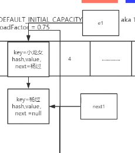
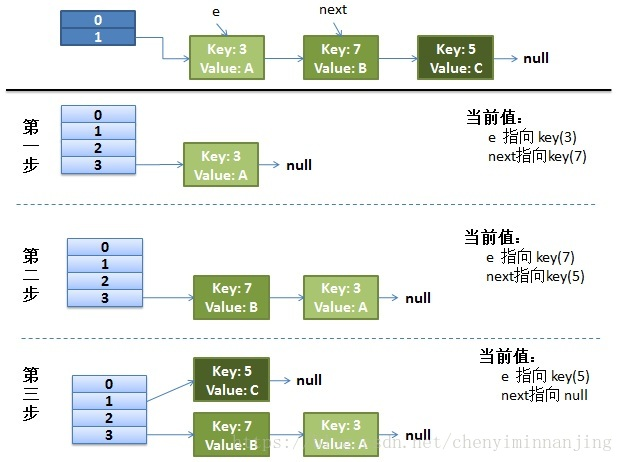
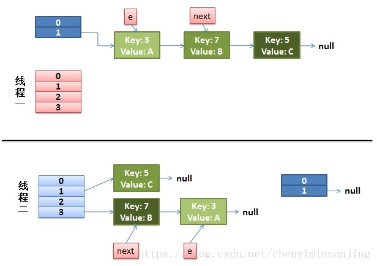

## Java1.7 HashMap扩容节点转移分析


JDK1.7 HashMap由数组和链表组成

JDK1.8 加入了红黑树(链表长度>=8链表转红黑树)


HashMap数组初始化长度**16**

```java
static final int DEFAULT_INITIAL_CAPACITY = 1<<4;	//16
loadFactor=0.75;
```


### 为什么初始容量要是2的指数次幂

HashMap的初始容量必须是2的指数次幂

如果传进来的初始容量不是2的指数次幂的话，初始化函数会自动将你数向上转成最靠近2的指数次幂的数


HashMap中put和get方法计算索引index

```java
JDK1.7
	static int indexFor(int h, int length) {
    	return h & (length - 1)
	}
    
	index = hash%index
	hash%index = hash & (length - 1)		//length是2的指数次幂的时候才成立

	hash%index != hash & (length - 1)		//当length不为2的指数次幂的时候
```

```java
JDK1.8
    static final int hash(Object key) {
        int h;
        return (key == null) ? 0 : (h = key.hashCode()) ^ (h >>> 16);
    }
```


在计算机中

加法>乘法>除法>取模


```
//例如
hashcode: 1101 0010 1010 1010
length  : 0000 0000 0000 1111

// 做与运算的时候后四位总是在0-15区间内,因此不会出现越界的问题，以及减小碰撞
```

### 为什么加载因子默认是0.75

在查询时间与空间之处最好的平衡点

哈希冲突和空间利用

### 为什么链表长度为8的时候转成红黑树

数组长度大于64，链表长度大于8转换为红黑树,小于6的时候又转为链表

```java
    /**
     * The bin count threshold for using a tree rather than list for a
     * bin.  Bins are converted to trees when adding an element to a
     * bin with at least this many nodes. The value must be greater
     * than 2 and should be at least 8 to mesh with assumptions in
     * tree removal about conversion back to plain bins upon
     * shrinkage.
     */
    static final int TREEIFY_THRESHOLD = 8;

	/**
     * The bin count threshold for untreeifying a (split) bin during a
     * resize operation. Should be less than TREEIFY_THRESHOLD, and at
     * most 6 to mesh with shrinkage detection under removal.
     */
    static final int UNTREEIFY_THRESHOLD = 6;


	/**
     * The smallest table capacity for which bins may be treeified.
     * (Otherwise the table is resized if too many nodes in a bin.)
     * Should be at least 4 * TREEIFY_THRESHOLD to avoid conflicts
     * between resizing and treeification thresholds.
     */
    static final int MIN_TREEIFY_CAPACITY = 64;
```


遵循泊松分布


### Java7的HashMap扩容死锁演示与环链行程分析

JDK1.7Map数据块转移

```java
void transfer(Entry[] newTable, boolean rehash) {
    int newCapacity = newTable.length;
    for(Entry<K,V> e: table) {
        while(null != e){
            Entry<K,V> next = e.next;
            //非关键代码
            if (rehash) {
                e.hash = null == e.key ? 0 : hash(e.key);
            }
            int i = indexFor(e.hash, newCapacity);
            //
            e.next = newTable[i];
            newTable[i] = e;
            e = next;
        }
    }
}
```

```java
void transfer(Entry[] newTable) {  
    Entry[] src = table;                   //src引用了旧的Entry数组  
    int newCapacity = newTable.length;  
    for (int j = 0; j < src.length; j++) { //遍历旧的Entry数组  
        Entry<K, V> e = src[j];             //取得旧Entry数组的每个元素  
        if (e != null) {  
            src[j] = null;//释放旧Entry数组的对象引用（for循环后，旧的Entry数组不再引用任何对象）  
            do {  
                Entry<K, V> next = e.next;  
                int i = indexFor(e.hash, newCapacity); //！！重新计算每个元素在数组中的位置  
                e.next = newTable[i]; //标记[1]  
                newTable[i] = e;      //将元素放在数组上  
                e = next;             //访问下一个Entry链上的元素  
            } while (e != null);  
        }  
    }  
}
```


线程2执行到Entry<K,V> next = e.next时被阻塞

线程1开始启动



线程1执行完毕


进行2遍循环后


此时执行的第三次循环就会出现环链

```java
e.next=newTable[i];
e==>第二个元素
newTable[i]===>第一个元素
```


### Java8HashMap扩容优化

JDK8 resize方法

```java
/**
     * Initializes or doubles table size.  If null, allocates in
     * accord with initial capacity target held in field threshold.
     * Otherwise, because we are using power-of-two expansion, the
     * elements from each bin must either stay at same index, or move
     * with a power of two offset in the new table.
     *
     * @return the table
     */
    final Node<K,V>[] resize() {
        Node<K,V>[] oldTab = table;
        int oldCap = (oldTab == null) ? 0 : oldTab.length;
        int oldThr = threshold;
        int newCap, newThr = 0;
        if (oldCap > 0) {
            if (oldCap >= MAXIMUM_CAPACITY) {
                threshold = Integer.MAX_VALUE;
                return oldTab;
            }
            else if ((newCap = oldCap << 1) < MAXIMUM_CAPACITY &&
                     oldCap >= DEFAULT_INITIAL_CAPACITY)
                newThr = oldThr << 1; // double threshold
        }
        else if (oldThr > 0) // initial capacity was placed in threshold
            newCap = oldThr;
        else {               // zero initial threshold signifies using defaults
            newCap = DEFAULT_INITIAL_CAPACITY;
            newThr = (int)(DEFAULT_LOAD_FACTOR * DEFAULT_INITIAL_CAPACITY);
        }
        if (newThr == 0) {
            float ft = (float)newCap * loadFactor;
            newThr = (newCap < MAXIMUM_CAPACITY && ft < (float)MAXIMUM_CAPACITY ?
                      (int)ft : Integer.MAX_VALUE);
        }
        threshold = newThr;
        @SuppressWarnings({"rawtypes","unchecked"})
        Node<K,V>[] newTab = (Node<K,V>[])new Node[newCap];
        table = newTab;
        if (oldTab != null) {
            for (int j = 0; j < oldCap; ++j) {
                Node<K,V> e;
                if ((e = oldTab[j]) != null) {
                    oldTab[j] = null;
                    if (e.next == null)
                        newTab[e.hash & (newCap - 1)] = e;
                    else if (e instanceof TreeNode)
                        ((TreeNode<K,V>)e).split(this, newTab, j, oldCap);
                    else { // preserve order
                        Node<K,V> loHead = null, loTail = null;
                        Node<K,V> hiHead = null, hiTail = null;
                        Node<K,V> next;
                        do {
                            next = e.next;
                            if ((e.hash & oldCap) == 0) {
                                if (loTail == null)
                                    loHead = e;
                                else
                                    loTail.next = e;
                                loTail = e;
                            }
                            else {
                                if (hiTail == null)
                                    hiHead = e;
                                else
                                    hiTail.next = e;
                                hiTail = e;
                            }
                        } while ((e = next) != null);
                        if (loTail != null) {
                            loTail.next = null;
                            newTab[j] = loHead;
                        }
                        if (hiTail != null) {
                            hiTail.next = null;
                            //将链表对半切分扩容
                            newTab[j + oldCap] = hiHead;
                        }
                    }
                }
            }
        }
        return newTab;
    }
```


JDK8在做数据迁移的时候定义了四组指针

2个高位指针，2个低位指针


JDK8中HashMap没有对元素进行Rehash，性能大大提高


JDK8中HashMap解决了多线程扩容死锁问题，但是并不是线程安全的

### concurrenthashmap线程安全吗？


---

## CSDN

### HashMap的长度为什么要是2的幂次方

HashMap存储数据时要避免位置碰撞且数据分配均匀，于是采用位移运算的算法计算存储链表的位置，假设HashMap的长度不为2的幂次方则有可能产生碰撞

### 为什么加载因子默认是0.75

HashMap源码中的加载因子

```java
static final float DEFAULT_LOAD_FACTOR = 0.75f;
```

当时想到的是应该是“哈希冲突”和“空间利用率”矛盾的一个折衷。
跟数据结构要么查询快要么插入快一个道理，hashmap就是一个插入慢、查询快的数据结构。

**加载因子**是表示Hsah表中元素的填满的程度。
加载因子越大,填满的元素越多,空间利用率越高，但冲突的机会加大了。
反之,加载因子越小,填满的元素越少,冲突的机会减小,但空间浪费多了。


### 为什么链表长度为8的时候转成红黑树

为了配合使用分布良好的hashCode，树节点很少使用。并且在理想状态下，受随机分布的hashCode影响，链表中的节点遵循泊松分布，而且根据统计，链表中节点数是8的概率已经接近千分之一，而且此时链表的性能已经很差了。所以在这种比较罕见和极端的情况下，才会把链表转变为红黑树。因为链表转换为红黑树也是需要消耗性能的，特殊情况特殊处理，为了挽回性能，权衡之下，才使用红黑树，提高性能。也就是大部分情况下，hashmap还是使用的链表，如果是理想的均匀分布，节点数不到8，hashmap就自动扩容了。


为什么链表长度为8的时候转成红黑树


### Java7的HashMap扩容死锁演示与环链行程分析

故事的起源从hashmap的数据存放开始说起，默认hashmap大小是16.当数据过大时，毫无疑问，hashmap需要扩容去支持存放更多的数据。
源码如下 ——–Put一个Key,Value对到Hash表中：

```java
public V put(K key, V value)
{
    ......
    //计算Hash值
    int hash = hash(key.hashCode());
    int i = indexFor(hash, table.length);
    //各种校验吧
    for (Entry<K,V> e = table[i]; e != null; e = e.next) {
        Object k;
        if (e.hash == hash && ((k = e.key) == key || key.equals(k))) {
            V oldValue = e.value;
            e.value = value;
            e.recordAccess(this);
            return oldValue;
        }
    }
    modCount++;
    //该key不存在，需要增加一个结点
    addEntry(hash, key, value, i);
    return null;
}
```

这里添加一个节点需要检查是否超出容量，出现了一个负载因子。

```java
void addEntry(int hash, K key, V value, int bucketIndex)
{
    Entry<K,V> e = table[bucketIndex];
    table[bucketIndex] = new Entry<K,V>(hash, key, value, e);
    //查看当前的size是否超过了我们设定的阈值threshold，如果超过，需要resize
    if (size++ >= threshold)
        resize(2 * table.length);//扩容都是2倍2倍的来的，
}
```

既然新建了一个更大尺寸的hash表，然后把数据从老的Hash表中迁移到新的Hash表中。

```java
void resize(int newCapacity)
{
    Entry[] oldTable = table;
    int oldCapacity = oldTable.length;
    ......
    //创建一个新的Hash Table
    Entry[] newTable = new Entry[newCapacity];
    //将Old Hash Table上的数据迁移到New Hash Table上
    transfer(newTable);
    table = newTable;
    threshold = (int)(newCapacity * loadFactor);
}
```

```java
void transfer(Entry[] newTable)
{
    Entry[] src = table;
    int newCapacity = newTable.length;
    //下面这段代码的意思是：
    //  从OldTable里摘一个元素出来，然后放到NewTable中
    for (int j = 0; j < src.length; j++) {
        Entry<K,V> e = src[j];
        if (e != null) {
            src[j] = null;
            do {
                Entry<K,V> next = e.next;
                int i = indexFor(e.hash, newCapacity);
                e.next = newTable[i];
                newTable[i] = e;
                e = next;
            } while (e != null);
        }
    }
}
```

do循环里面的是最能说明问题的
当只有一个线程的时候：


最上面的是old hash 表，其中的Hash表的size=2, 所以key = 3, 7, 5，在mod 2以后都冲突在table[1]这里了。
接下来的三个步骤是Hash表 扩容变成4，然后所有的

```c
do {
    Entry<K,V> next = e.next; // <--假设线程一执行到这里就被调度挂起了
    int i = indexFor(e.hash, newCapacity);
    e.next = newTable[i];
    newTable[i] = e;
    e = next;
} while (e != null);
```

而我们的线程二执行完成了。于是我们有下面的这个样子。



注意，因为Thread1的 e 指向了key(3)，而next指向了key(7)，其在线程二rehash后，指向了线程二重组后的链表。我们可以看到链表的顺序被反转后。
这里的意思是线程1这会还没有完全开始扩容，但e和next已经指向了，线程2是正常的扩容的，那这会在3这个位置上，就是7->3这个顺序。
然后：
2）线程一被调度回来执行。

先是执行 newTalbe[i] = e;
然后是e = next，导致了e指向了key(7)，
而下一次循环的next = e.next导致了next指向了key(3)
注意看图里面的线，线程1指向线程2里面的key3.

回到线程1里面的时候
3）一切安好。

线程一接着工作。把key(7)摘下来，放到newTable[i]的第一个，然后把e和next往下移。

这时候，原来的线程2里面的key7的e和key3的next没了，e=key3,next=null。

4）环形链接出现。
当继续执行，需要将key3加回到key7的前面。
e.next = newTable[i] 导致 key(3).next 指向了 key(7)

注意：此时的key(7).next 已经指向了key(3)， 环形链表就这样出现了。

我理解是线程2生成的e和next的关系影响到了线程1里面的情况。从而打乱了正常的e和next的链。

于是，当我们的线程一调用到，HashTable.get(11)时，即又到了3这个位置，需要插入新的，那这会就e 和next就乱了。


### JDK7的ConcurrentHashMap扩容

HashMap是线程不安全的，我们来看下线程安全的ConcurrentHashMap，在JDK7的时候，这种安全策略采用的是分段锁的机制，ConcurrentHashMap维护了一个Segment数组，Segment这个类继承了重入锁ReentrantLock，并且该类里面维护了一个 HashEntry<K,V>[] table数组，在写操作put，remove，扩容的时候，会对Segment加锁，所以仅仅影响这个Segment，不同的Segment还是可以并发的，所以解决了线程的安全问题，同时又采用了分段锁也提升了并发的效率。 

```java
// 方法参数上的 node 是这次扩容后，需要添加到新的数组中的数据。
private void rehash(HashEntry<K,V> node) {
    HashEntry<K,V>[] oldTable = table;
    int oldCapacity = oldTable.length;
    // 2 倍
    int newCapacity = oldCapacity << 1;
    threshold = (int)(newCapacity * loadFactor);
    // 创建新数组
    HashEntry<K,V>[] newTable =
        (HashEntry<K,V>[]) new HashEntry[newCapacity];
    // 新的掩码，如从 16 扩容到 32，那么 sizeMask 为 31，对应二进制 ‘000...00011111’
    int sizeMask = newCapacity - 1;
 
    // 遍历原数组，老套路，将原数组位置 i 处的链表拆分到 新数组位置 i 和 i+oldCap 两个位置
    for (int i = 0; i < oldCapacity ; i++) {
        // e 是链表的第一个元素
        HashEntry<K,V> e = oldTable[i];
        if (e != null) {
            HashEntry<K,V> next = e.next;
            // 计算应该放置在新数组中的位置，
            // 假设原数组长度为 16，e 在 oldTable[3] 处，那么 idx 只可能是 3 或者是 3 + 16 = 19
            int idx = e.hash & sizeMask;
            if (next == null)   // 该位置处只有一个元素，那比较好办
                newTable[idx] = e;
            else { // Reuse consecutive sequence at same slot
                // e 是链表表头
                HashEntry<K,V> lastRun = e;
                // idx 是当前链表的头结点 e 的新位置
                int lastIdx = idx;
 
                // 下面这个 for 循环会找到一个 lastRun 节点，这个节点之后的所有元素是将要放到一起的
                for (HashEntry<K,V> last = next;
                     last != null;
                     last = last.next) {
                    int k = last.hash & sizeMask;
                    if (k != lastIdx) {
                        lastIdx = k;
                        lastRun = last;
                    }
                }
                // 将 lastRun 及其之后的所有节点组成的这个链表放到 lastIdx 这个位置
                newTable[lastIdx] = lastRun;
                // 下面的操作是处理 lastRun 之前的节点，
                //    这些节点可能分配在另一个链表中，也可能分配到上面的那个链表中
                for (HashEntry<K,V> p = e; p != lastRun; p = p.next) {
                    V v = p.value;
                    int h = p.hash;
                    int k = h & sizeMask;
                    HashEntry<K,V> n = newTable[k];
                    newTable[k] = new HashEntry<K,V>(h, p.key, v, n);
                }
            }
        }
    }
    // 将新来的 node 放到新数组中刚刚的 两个链表之一 的 头部
    int nodeIndex = node.hash & sizeMask; // add the new node
    node.setNext(newTable[nodeIndex]);
    newTable[nodeIndex] = node;
    table = newTable;
}
```

注意这里面的代码，外部已经加锁，所以这里面是安全的，我们看下具体的实现方式：先对数组的长度增加一倍，然后遍历原来的旧的table数组，把每一个数组元素也就是Node链表迁移到新的数组里面，最后迁移完毕之后，把新数组的引用直接替换旧的。此外这里这有一个小的细节优化，在迁移链表时用了两个for循环，第一个for的目的是为了，判断是否有迁移位置一样的元素并且位置还是相邻，根据HashMap的设计策略，首先table的大小必须是2的n次方，我们知道扩容后的每个链表的元素的位置，要么不变，要么是原table索引位置+原table的容量大小，举个例子假如现在有三个元素（3,5,7）要放入map里面，table的的容量是2，简单的假设元素位置=元素的值 % 2，得到如下结构：

```java
[0]=null
[1]=3->5->7
```

现在将table的大小扩容成4，分布如下：

```java
[0]=null
[1]=5->7
[2]=null
[3]=3
```

因为扩容必须是2的n次方，所以HashMap在put和get元素的时候直接取key的hashCode然后经过再次均衡后直接采用&位运算就能达到取模效果，这个不再细说，上面这个例子的目的是为了说明扩容后的数据分布策略，要么保留在原位置，要么会被均衡在旧的table位置，这里是1加上旧的table容量这是是2，所以是3。基于这个特点，第一个for循环，作的优化如下，假设我们现在用0表示原位置，1表示迁移到index+oldCap的位置，来代表元素：

```java
[0]=null
[1]=0->1->1->0->0->0->0
```

第一个for循环的会记录lastRun，比如要迁移[1]的数据，经过这个循环之后，lastRun的位置会记录第三个0的位置，因为后面的数据都是0，代表他们要迁移到新的数组中同一个位置中，所以就可以把这个中间节点，直接插入到新的数组位置而后面附带的一串元素其实都不需要动。

接着第二个循环里面在此从第一个0的位置开始遍历到lastRun也就是第三个元素的位置就可以了，只循环处理前面的数据即可，这个循环里面根据位置0和1做不同的链表追加，后面的数据已经被优化的迁移走了，但最坏情况下可能后面一个也没优化，比如下面的结构：

```java
[0]=null
[1]=1->1->0->0->0->0->1->0
```

这种情况，第一个for循环没多大作用，需要通过第二个for循环从头开始遍历到尾部，按0和1分发迁移，这里面使用的是还是头插法的方式迁移，新迁移的数据是追加在链表的头部，但这里是线程安全的所以不会出现循环链表，导致死循环问题。迁移完成之后直接将最新的元素加入，最后将新的table替换旧的table即可。

### JDK8的HashMap扩容

在JDK8里面，HashMap的底层数据结构已经变为数组+链表+红黑树的结构了，因为在hash冲突严重的情况下，链表的查询效率是O(n），所以JDK8做了优化对于单个链表的个数大于8的链表，会直接转为红黑树结构算是以空间换时间，这样以来查询的效率就变为O(logN)，图示如下：


我们看下其扩容代码：

```java
    final Node<K,V>[] resize() {
        Node<K,V>[] oldTab = table;
        int oldCap = (oldTab == null) ? 0 : oldTab.length;
        int oldThr = threshold;
        int newCap, newThr = 0;
        if (oldCap > 0) {
            if (oldCap >= MAXIMUM_CAPACITY) {
                threshold = Integer.MAX_VALUE;
                return oldTab;
            }
            else if ((newCap = oldCap << 1) < MAXIMUM_CAPACITY &&
                     oldCap >= DEFAULT_INITIAL_CAPACITY)
                newThr = oldThr << 1; // double threshold
        }
        else if (oldThr > 0) // initial capacity was placed in threshold
            newCap = oldThr;
        else {               // zero initial threshold signifies using defaults
            newCap = DEFAULT_INITIAL_CAPACITY;
            newThr = (int)(DEFAULT_LOAD_FACTOR * DEFAULT_INITIAL_CAPACITY);
        }
        if (newThr == 0) {
            float ft = (float)newCap * loadFactor;
            newThr = (newCap < MAXIMUM_CAPACITY && ft < (float)MAXIMUM_CAPACITY ?
                      (int)ft : Integer.MAX_VALUE);
        }
        threshold = newThr;
        @SuppressWarnings({"rawtypes","unchecked"})
            Node<K,V>[] newTab = (Node<K,V>[])new Node[newCap];
        table = newTab;
        if (oldTab != null) {
            for (int j = 0; j < oldCap; ++j) {
                Node<K,V> e;
                if ((e = oldTab[j]) != null) {
                    oldTab[j] = null;
                    if (e.next == null)
                        newTab[e.hash & (newCap - 1)] = e;
                    else if (e instanceof TreeNode)
                        ((TreeNode<K,V>)e).split(this, newTab, j, oldCap);
                    else { 
                        //重点关注区域
                        // preserve order
                        Node<K,V> loHead = null, loTail = null;
                        Node<K,V> hiHead = null, hiTail = null;
                        Node<K,V> next;
                        do {
                            next = e.next;
                            if ((e.hash & oldCap) == 0) {
                                if (loTail == null)
                                    loHead = e;
                                else
                                    loTail.next = e;
                                loTail = e;
                            }
                            else {
                                if (hiTail == null)
                                    hiHead = e;
                                else
                                    hiTail.next = e;
                                hiTail = e;
                            }
                        } while ((e = next) != null);
                        if (loTail != null) {
                            loTail.next = null;
                            newTab[j] = loHead;
                        }
                        if (hiTail != null) {
                            hiTail.next = null;
                            newTab[j + oldCap] = hiHead;
                        }
                    }
                }
            }
        }
        return newTab;
    }
 
```

在JDK8中，单纯的HashMap数据结构增加了红黑树是一个大的优化，此外根据上面的迁移扩容策略，我们发现JDK8里面HashMap没有采用头插法转移链表数据，而是保留了元素的顺序位置，新的代码里面采用

```java
//按原始链表顺序，过滤出来扩容后位置不变的元素（低位=0），放在一起
Node<K,V> loHead = null, loTail = null;
//按原始链表顺序，过滤出来扩容后位置改变到（index+oldCap）的元素（高位=0），放在一起
Node<K,V> hiHead = null, hiTail = null;
```

把要迁移的元素分类之后，最后在分别放到新数组对应的位置上：

```java
//位置不变    
if (loTail != null) {
	loTail.next = null;
	newTab[j] = loHead;
}
//位置迁移(index+oldCap)
if (hiTail != null) {
	hiTail.next = null;
	newTab[j + oldCap] = hiHead;
}
```

JDK7里面是先判断table的存储元素的数量是否超过当前的threshold=table.length*loadFactor（默认0.75），如果超过就先扩容，在JDK8里面是先插入数据，插入之后在判断下一次++size的大小是否会超过当前的阈值，如果超过就扩容。


### JDK8的ConcurrentHashMap扩容

在JDK8中彻底抛弃了JDK7的分段锁的机制，新的版本主要使用了Unsafe类的CAS自旋赋值+synchronized同步+LockSupport阻塞等手段实现的高效并发，代码可读性稍差。

ConcurrentHashMap的JDK8与JDK7版本的并发实现相比，最大的区别在于JDK8的锁粒度更细，理想情况下talbe数组元素的大小就是其支持并发的最大个数，在JDK7里面最大并发个数就是Segment的个数，默认值是16，可以通过构造函数改变一经创建不可更改，这个值就是并发的粒度，每一个segment下面管理一个table数组，加锁的时候其实锁住的是整个segment，这样设计的好处在于数组的扩容是不会影响其他的segment的，简化了并发设计，不足之处在于并发的粒度稍粗，所以在JDK8里面，去掉了分段锁，将锁的级别控制在了更细粒度的table元素级别，也就是说只需要锁住这个链表的head节点，并不会影响其他的table元素的读写，好处在于并发的粒度更细，影响更小，从而并发效率更好，但不足之处在于并发扩容的时候，由于操作的table都是同一个，不像JDK7中分段控制，所以这里需要等扩容完之后，所有的读写操作才能进行，所以扩容的效率就成为了整个并发的一个瓶颈点，好在Doug lea大神对扩容做了优化，本来在一个线程扩容的时候，如果影响了其他线程的数据，那么其他的线程的读写操作都应该阻塞，但Doug lea说你们闲着也是闲着，不如来一起参与扩容任务，这样人多力量大，办完事你们该干啥干啥，别浪费时间，于是在JDK8的源码里面就引入了一个ForwardingNode类，在一个线程发起扩容的时候，就会改变sizeCtl这个值，其含义如下：

```
sizeCtl ：默认为0，用来控制table的初始化和扩容操作，具体应用在后续会体现出来。
-1 代表table正在初始化
-N 表示有N-1个线程正在进行扩容操作
其余情况：
1、如果table未初始化，表示table需要初始化的大小。
2、如果table初始化完成，表示table的容量，默认是table大小的0.75倍
```

扩容时候会判断这个值，如果超过阈值就要扩容，首先根据运算得到需要遍历的次数i，然后利用tabAt方法获得i位置的元素f，初始化一个forwardNode实例fwd，如果f == null，则在table中的i位置放入fwd，否则采用头插法的方式把当前旧table数组的指定任务范围的数据给迁移到新的数组中，然后 给旧table原位置赋值fwd。直到遍历过所有的节点以后就完成了复制工作，把table指向nextTable，并更新sizeCtl为新数组大小的0.75倍 ，扩容完成。在此期间如果其他线程的有读写操作都会判断head节点是否为forwardNode节点，如果是就帮助扩容。

扩容源码如下：

```java
    private final void transfer(Node<K,V>[] tab, Node<K,V>[] nextTab) {
        int n = tab.length, stride;
        if ((stride = (NCPU > 1) ? (n >>> 3) / NCPU : n) < MIN_TRANSFER_STRIDE)
            stride = MIN_TRANSFER_STRIDE; // subdivide range
        if (nextTab == null) {            // initiating
            try {
                @SuppressWarnings("unchecked")
                Node<K,V>[] nt = (Node<K,V>[])new Node<?,?>[n << 1];
                nextTab = nt;
            } catch (Throwable ex) {      // try to cope with OOME
                sizeCtl = Integer.MAX_VALUE;
                return;
            }
            nextTable = nextTab;
            transferIndex = n;
        }
        int nextn = nextTab.length;
        ForwardingNode<K,V> fwd = new ForwardingNode<K,V>(nextTab);
        boolean advance = true;
        boolean finishing = false; // to ensure sweep before committing nextTab
        for (int i = 0, bound = 0;;) {
            Node<K,V> f; int fh;
            while (advance) {
                int nextIndex, nextBound;
                if (--i >= bound || finishing)
                    advance = false;
                else if ((nextIndex = transferIndex) <= 0) {
                    i = -1;
                    advance = false;
                }
                else if (U.compareAndSwapInt
                         (this, TRANSFERINDEX, nextIndex,
                          nextBound = (nextIndex > stride ?
                                       nextIndex - stride : 0))) {
                    bound = nextBound;
                    i = nextIndex - 1;
                    advance = false;
                }
            }
            if (i < 0 || i >= n || i + n >= nextn) {
                int sc;
                if (finishing) {
                    nextTable = null;
                    table = nextTab;
                    sizeCtl = (n << 1) - (n >>> 1);
                    return;
                }
                if (U.compareAndSwapInt(this, SIZECTL, sc = sizeCtl, sc - 1)) {
                    if ((sc - 2) != resizeStamp(n) << RESIZE_STAMP_SHIFT)
                        return;
                    finishing = advance = true;
                    i = n; // recheck before commit
                }
            }
            else if ((f = tabAt(tab, i)) == null)
                advance = casTabAt(tab, i, null, fwd);
            else if ((fh = f.hash) == MOVED)
                advance = true; // already processed
            else {
                synchronized (f) {
                    if (tabAt(tab, i) == f) {
                        Node<K,V> ln, hn;
                        if (fh >= 0) {
                            int runBit = fh & n;
                            Node<K,V> lastRun = f;
                            for (Node<K,V> p = f.next; p != null; p = p.next) {
                                int b = p.hash & n;
                                if (b != runBit) {
                                    runBit = b;
                                    lastRun = p;
                                }
                            }
                            if (runBit == 0) {
                                ln = lastRun;
                                hn = null;
                            }
                            else {
                                hn = lastRun;
                                ln = null;
                            }
                            for (Node<K,V> p = f; p != lastRun; p = p.next) {
                                int ph = p.hash; K pk = p.key; V pv = p.val;
                                if ((ph & n) == 0)
                                    ln = new Node<K,V>(ph, pk, pv, ln);
                                else
                                    hn = new Node<K,V>(ph, pk, pv, hn);
                            }
                            setTabAt(nextTab, i, ln);
                            setTabAt(nextTab, i + n, hn);
                            setTabAt(tab, i, fwd);
                            advance = true;
                        }
                        else if (f instanceof TreeBin) {
                            TreeBin<K,V> t = (TreeBin<K,V>)f;
                            TreeNode<K,V> lo = null, loTail = null;
                            TreeNode<K,V> hi = null, hiTail = null;
                            int lc = 0, hc = 0;
                            for (Node<K,V> e = t.first; e != null; e = e.next) {
                                int h = e.hash;
                                TreeNode<K,V> p = new TreeNode<K,V>
                                    (h, e.key, e.val, null, null);
                                if ((h & n) == 0) {
                                    if ((p.prev = loTail) == null)
                                        lo = p;
                                    else
                                        loTail.next = p;
                                    loTail = p;
                                    ++lc;
                                }
                                else {
                                    if ((p.prev = hiTail) == null)
                                        hi = p;
                                    else
                                        hiTail.next = p;
                                    hiTail = p;
                                    ++hc;
                                }
                            }
                            ln = (lc <= UNTREEIFY_THRESHOLD) ? untreeify(lo) :
                                (hc != 0) ? new TreeBin<K,V>(lo) : t;
                            hn = (hc <= UNTREEIFY_THRESHOLD) ? untreeify(hi) :
                                (lc != 0) ? new TreeBin<K,V>(hi) : t;
                            setTabAt(nextTab, i, ln);
                            setTabAt(nextTab, i + n, hn);
                            setTabAt(tab, i, fwd);
                            advance = true;
                        }
                    }
                }
            }
        }
    }
```

#### 在扩容时读写操作如何进行

(1)对于get读操作，如果当前节点有数据，还没迁移完成，此时不影响读，能够正常进行。

如果当前链表已经迁移完成，那么头节点会被设置成fwd节点，此时get线程会帮助扩容。

(2)对于put/remove写操作，如果当前链表已经迁移完成，那么头节点会被设置成fwd节点，此时写线程会帮助扩容，如果扩容没有完成，当前链表的头节点会被锁住，所以写线程会被阻塞，直到扩容完成。

#### 对于size和迭代器是弱一致性

volatile修饰的数组引用是强可见的，但是其元素却不一定，所以，这导致size的根据sumCount的方法并不准确。

同理Iteritor的迭代器也一样，并不能准确反映最新的实际情况