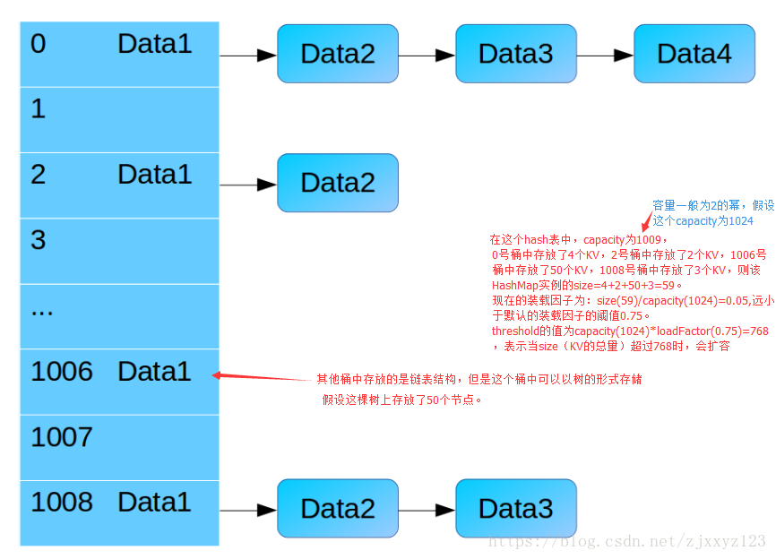
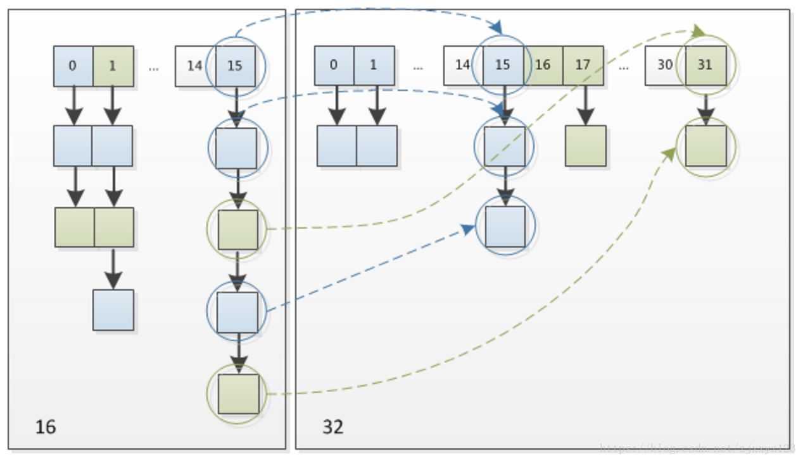
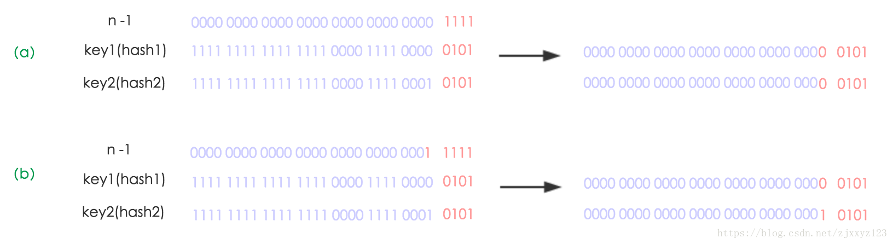

[HashMap详解](https://blog.csdn.net/zjxxyz123/article/details/81111627)

## HashMap 底层数据结构

### JDK 8 之前：

JDK 8 以前 HashMap 的实现是 数组+链表，即使哈希函数取得再好，也很难达到元素百分百均匀分布。
当 HashMap 中有大量的元素都存放到同一个桶中时，这个桶下有一条长长的链表，极端情况HashMap 就相当于一个单链表，假如单链表有 n 个元素，遍历的时间复杂度就是 O(n)，完全失去了它的优势。

### JDK 8:

JDK7与JDK8中HashMap实现的最大区别就是对于冲突的处理方法。JDK 1.8 中引入了红黑树（查找时间复杂度为 O(logn)）,用数组+链表+红黑树的结构来优化这个问题。
图解：


### 代码实现：

#### 链表Node节点的定义：

```java
/**
 * Basic hash bin node, used for most entries.  (See below for
 * TreeNode subclass, and in LinkedHashMap for its Entry subclass.)
 */
static class Node<K,V> implements Map.Entry<K,V> {
    final int hash;
    final K key;
    V value;
    Node<K,V> next;

    Node(int hash, K key, V value, Node<K,V> next) {
        this.hash = hash;
        this.key = key;
        this.value = value;
        this.next = next;
    }

    public final K getKey()        { return key; }
    public final V getValue()      { return value; }
    public final String toString() { return key + "=" + value; }

    public final int hashCode() {
        return Objects.hashCode(key) ^ Objects.hashCode(value);
    }

    public final V setValue(V newValue) {
        V oldValue = value;
        value = newValue;
        return oldValue;
    }

    public final boolean equals(Object o) {
        if (o == this)
            return true;
        if (o instanceof Map.Entry) {
            Map.Entry<?,?> e = (Map.Entry<?,?>)o;
            if (Objects.equals(key, e.getKey()) &&
                Objects.equals(value, e.getValue()))
                return true;
        }
        return false;
    }
}
```
#### TreeNode 红黑树节点的定义：

```java
// Tree bins
/**
 * Entry for Tree bins. Extends LinkedHashMap.Entry (which in turn
 * extends Node) so can be used as extension of either regular or
 * linked node.
 */
static final class TreeNode<K,V> extends LinkedHashMap.Entry<K,V> {
    TreeNode<K,V> parent;  // red-black tree links
    TreeNode<K,V> left;
    TreeNode<K,V> right;
    TreeNode<K,V> prev;    // needed to unlink next upon deletion
    boolean red;
    TreeNode(int hash, K key, V val, Node<K,V> next) {
        super(hash, key, val, next);
    }
```
#### 整体结构：

 /**
     * The table, initialized on first use, and resized as
          * necessary. When allocated, length is always a power of two.
          * (We also tolerate length zero in some operations to allow
               * bootstrapping mechanics that are currently not needed.)
               */
            transient Node<K,V>[] table;

```java
/**
 * Holds cached entrySet(). Note that AbstractMap fields are used
 * for keySet() and values().
 */
transient Set<Map.Entry<K,V>> entrySet;

/**
 * The number of key-value mappings contained in this map.
 */
transient int size;

/**
 * The number of times this HashMap has been structurally modified
 * Structural modifications are those that change the number of mappings in
 * the HashMap or otherwise modify its internal structure (e.g.,
 * rehash).  This field is used to make iterators on Collection-views of
 * the HashMap fail-fast.  (See ConcurrentModificationException).
 */
transient int modCount;

/**
 * The next size value at which to resize (capacity * load factor).
 *
 * @serial
 */
// (The javadoc description is true upon serialization.
// Additionally, if the table array has not been allocated, this
// field holds the initial array capacity, or zero signifying
// DEFAULT_INITIAL_CAPACITY.)
int threshold;

/**
 * The load factor for the hash table.
 *
 * @serial
 */
final float loadFactor;
```
## 常见概念解释

- 根据结构图来了解常见概念：
  

- 一般将数组中的每一个元素称作桶（segment），桶中连的链表或者红黑树中的每一个元素成为bin
- capacity： 源码中没有将它作为属性，但是为了方便，引进了这个概念，是指HashMap中桶的数量。默认值为16。扩容是按照原容量的2倍进行扩。如果在构造函数中指定了Map的大小，那么进行put操作时，初始化后的容量为离传入值最近的2的整数幂，是通过tableSizeFor() 函数达到该目的。总之，容量都是2的幂。
  设计成16的好处在《全网把Map中的hash()分析的最透彻的文章，别无二家。》中也简单介绍过，主要是可以使用按位与替代取模来提升hash的效率。

```java
/**
 * Returns a power of two size for the given target capacity.
 */
static final int tableSizeFor(int cap) {
    int n = cap - 1;
    n |= n >>> 1;
    n |= n >>> 2;
    n |= n >>> 4;
    n |= n >>> 8;
    n |= n >>> 16;
    return (n < 0) ? 1 : (n >= MAXIMUM_CAPACITY) ? MAXIMUM_CAPACITY : n + 1;
}
```
关于此方法，具体解析见[HashMap源码注解之静态工具方法hash()、tableSizeFor()（四）](https://blog.csdn.net/fan2012huan/article/details/51097331)

- loadFactor: 译为装载因子。装载因子用来衡量HashMap满的程度。loadFactor的默认值为0.75f。计算HashMap的实时装载因子的方法为：size/capacity，而不是占用桶的数量去除以capacity。
- threshold: threshold表示当HashMap的size大于threshold时会执行resize操作。`threshold = capacity*loadFactor`
- DEFAULT_INITIAL_CAPACITY : 默认初始化容量 16。容量必须为2的次方。默认的hashmap大小为16.
- MAXIMUM_CAPACITY :最大的容量大小2^30
- DEFAULT_LOAD_FACTOR: 默认resize的因子。0.75，即实际数量超过总
- DEFAULT_LOAD_FACTOR的数量即会发生resize动作。
  为什么是0.75，网上有些答案说是，因为capcity是2的次方，那么与之相乘会得到整数。还有一种说法更为可靠，负载因子0.75是对空间和时间效率的一个平衡选择，建议大家不要修改，除非在时间和空间比较特殊的情况下，如果内存空间很多而又对时间效率要求很高，可以降低负载因子Load factor的值；相反，如果内存空间紧张而对时间效率要求不高，可以增加负载因子loadFactor的值，这个值可以大于1。
- TREEIFY_THRESHOLD: 树化阈值 8。当单个segment的容量超过阈值时，将链表转化为红黑树。
- UNTREEIFY_THRESHOLD :链表化阈值 6。当resize后或者删除操作后单个segment的容量低于阈值时，将红黑树转化为链表。
- MIN_TREEIFY_CAPACITY ：最小树化容量 64。当桶中的bin被树化时最小的hash表容量，低于该容量时不会树化。

## HashMap扩容及其树化的具体过程

如果在创建 HashMap 实例时没有给定capacity、loadFactor则默认值分别是16和0.75。
当好多bin被映射到同一个桶时，如果这个桶中bin的数量小于等于TREEIFY_THRESHOLD当然不会转化成树形结构存储；如果这个桶中bin的数量大于了 TREEIFY_THRESHOLD ，但是capacity小于MIN_TREEIFY_CAPACITY 则依然使用链表结构进行存储，此时会对HashMap进行扩容；如果capacity大于了MIN_TREEIFY_CAPACITY ，才有资格进行树化(当bin的个数大于8时)。

## hash 值的计算

- 根据存入的key-value对中的key计算出对应的hash值，然后放入对应的桶中，所以好的hash值计算方法十分重要，可以大大避免哈希冲突。
- HashMap是以hash操作作为散列依据。但是又与传统的hash存在着少许的优化。其hash值是key的hashcode与其hashcode右移16位的异或结果。在put方法中，将取出的hash值与当前的hashmap容量-1进行与运算。得到的就是位桶的下标。那么为何需要使用key.hashCode() ^ h>>>16的方式来计算hash值呢。其实从微观的角度来看，这种方法与直接去key的哈希值返回在功能实现上没有差别。但是由于最终获取下表是对二进制数组最后几位的与操作。所以直接取hash值会丢失高位的数据，从而增大冲突引起的可能。由于hash值是32位的二进制数。将高位的16位于低位的16位进行异或操作，即可将高位的信息存储到低位。因此该函数也叫做扰乱函数。目的就是减少冲突出现的可能性。而官方给出的测试报告也验证了这一点。直接使用key的hash算法与扰乱函数的hash算法冲突概率相差10%左右。

```java
static final int hash(Object key) {
    int h;
    return (key == null) ? 0 : (h = key.hashCode()) ^ (h >>> 16);
}

n = table.length;
index = （n-1） & hash;
```
- 根据以上可知，hashcode是一个32位的值，用高16位与低16位进行异或，原因在于求index是是用 （n-1） & hash ，如果hashmap的capcity很小的话，那么对于两个高位不同，低位相同的hashcode，可能最终会装入同一个桶中。那么会造成hash冲突，好的散列函数，应该尽量在计算hash时，把所有的位的信息都用上，这样才能尽可能避免冲突。这就是为什么用高16位与低16位进行异或的原因。

- 为什么capcity是2的幂？
  因为 算index时用的是（n-1） & hash，这样就能保证n -1是全为1的二进制数，如果不全为1的话，存在某一位为0，那么0，1与0与的结果都是0，这样便有可能将两个hash不同的值最终装入同一个桶中，造成冲突。所以必须是2的幂。
  
- 在算index时，用位运算（n-1） & hash而不是模运算 hash % n的好处（在HashTable中依旧是取模运算）？
  - 位运算消耗资源更少，更有效率
  - 避免了hashcode为负数的情况
  
- jdk 7中hash的计算方式有所不同：

  

hashtable， hashmap,以及concurrentHashMap的hash值计算方法都不一样，具体请参阅 [全网把Map中的hash()分析的最透彻的文章，别无二家。](https://blog.csdn.net/moakun/article/details/80231067)

## put 操作

- put 操作的主要流程如下：
  

①.判断键值对数组table[i]是否为空或为null，否则执行resize()进行扩容；

②.根据键值key计算hash值得到插入的数组索引i，如果table[i]==null，直接新建节点添加，转向⑥，如果table[i]不为空，转向③；

③.判断table[i]的首个元素是否和key一样，如果相同直接覆盖value，否则转向④，这里的相同指的是hashCode以及equals；

④.判断table[i] 是否为treeNode，即table[i] 是否是红黑树，如果是红黑树，则直接在树中插入键值对，否则转向⑤；

⑤.遍历table[i]，判断链表长度是否大于8，大于8的话把链表转换为红黑树，在红黑树中执行插入操作，否则进行链表的插入操作；遍历过程中若发现key已经存在直接覆盖value即可；

⑥.插入成功后，判断实际存在的键值对数量size是否超多了最大容量threshold，如果超过，进行扩容。


/**
     * Associates the specified value with the specified key in this map.
          * If the map previously contained a mapping for the key, the old
          * value is replaced.
               *
               * @param key key with which the specified value is to be associated
                    * @param value value to be associated with the specified key
                    * @return the previous value associated with <tt>key</tt>, or
                         *         <tt>null</tt> if there was no mapping for <tt>key</tt>.
                         *         (A <tt>null</tt> return can also indicate that the map
                              *         previously associated <tt>null</tt> with <tt>key</tt>.)
                                   */
                            public V put(K key, V value) {
        return putVal(hash(key), key, value, false, true);
                            }

```java
/**
 * Implements Map.put and related methods
 *
 * @param hash hash for key
 * @param key the key
 * @param value the value to put
 * @param onlyIfAbsent if true, don't change existing value
 * @param evict if false, the table is in creation mode.
 * @return previous value, or null if none
 */
final V putVal(int hash, K key, V value, boolean onlyIfAbsent,
               boolean evict) {
    Node<K,V>[] tab; Node<K,V> p; int n, i;
    //初始化时，map中还没有key-value
    if ((tab = table) == null || (n = tab.length) == 0)
        //利用resize生成对应的tab[]数组
        n = (tab = resize()).length;
    if ((p = tab[i = (n - 1) & hash]) == null)
        //当前桶无元素
        tab[i] = newNode(hash, key, value, null);
    else {//桶内有元素
        Node<K,V> e; K k;
        if (p.hash == hash &&
            ((k = p.key) == key || (key != null && key.equals(k))))
            //桶内第一个元素的key等于待放入的key，用
            e = p;
        else if (p instanceof TreeNode)
            //如果此时桶内已经树化
            e = ((TreeNode<K,V>)p).putTreeVal(this, tab, hash, key, value);
        else {//桶内还是一个链表，则插入链尾（尾插）
            for (int binCount = 0; ; ++binCount) {
                if ((e = p.next) == null) {
                    p.next = newNode(hash, key, value, null);
                    if (binCount >= TREEIFY_THRESHOLD - 1) // -1 for 1st
                        //变成红黑树
                        treeifyBin(tab, hash);
                    break;
                }
                if (e.hash == hash &&
                    ((k = e.key) == key || (key != null && key.equals(k))))
                    break;
                p = e;
            }
        }
        if (e != null) { // existing mapping for key
            V oldValue = e.value;
            if (!onlyIfAbsent || oldValue == null)
                e.value = value;
            afterNodeAccess(e);
            return oldValue;
        }
    }
    //检查是否应该扩容
    ++modCount;
    if (++size > threshold)
        resize();
    afterNodeInsertion(evict);
    return null;
}
```
resize 扩容操作
resize扩容操作主要用在两处：
向一个空的HashMap中执行put操作时，会调用resize()进行初始化，要么默认初始化，capacity为16，要么根据传入的值进行初始化
put操作后，检查到size已经超过threshold，那么便会执行resize，进行扩容，如果此时capcity已经大于了最大值，那么便把threshold置为int最大值，否则，对capcity,threshold进行扩容操作。
发生了扩容操作，那么必须Map中的所有的数进行再散列，重新装入。
具体扩容图如下：将一个原先capcity为16的扩容成32的：



在扩充HashMap的时候，不需要像JDK1.7的实现那样重新计算hash，只需要看看原来的hash值新增的那个bit是1还是0就好了，是0的话索引没变（因为任何数与0与都依旧是0），是1的话index变成“原索引+oldCap”。
例如：n为table的长度，图（a）表示扩容前的key1和key2两种key确定索引位置的示例，图（b）表示扩容后key1和key2两种key确定索引位置的示例，其中hash1是key1对应的哈希与高位运算结果。


元素在重新计算hash之后，因为n变为2倍，那么n-1的mask范围在高位多1bit(红色)，因此新的index就会发生这样的变化：


## jdk 7 与 jdk 8 中关于HashMap的对比

- 8时红黑树+链表+数组的形式，当桶内元素大于8时，便会树化

- hash值的计算方式不同

- 1.7 table在创建hashmap时分配空间，而1.8在put的时候分配，如果table为空，则为table分配空间。

- 在发生冲突，插入链中时，7是头插法，8是尾插法。

- 在resize操作中，7需要重新进行index的计算，而8不需要，通过判断相应的位是0是1，要么依旧是原index，要么是oldCap + 原index

  

  

  同类文章[Java8源码-HashMap](https://blog.csdn.net/panweiwei1994/article/details/77244920)

相关面试题：
