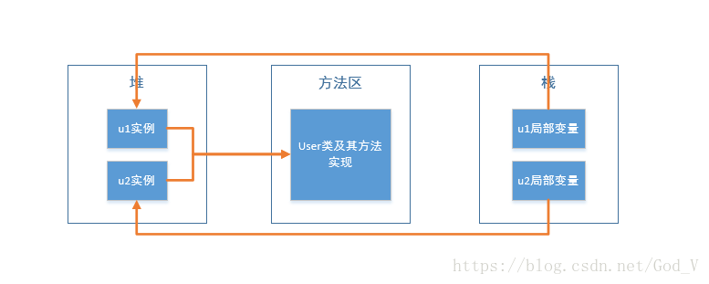
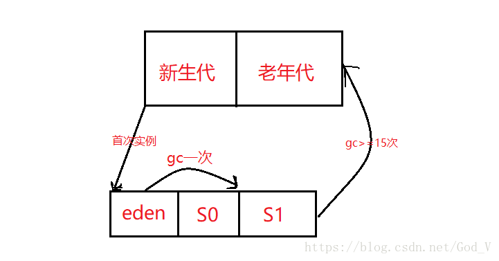

堆解决的是数据存储问题，即数据怎么放，数据放哪。
栈解决程序的运行问题，即程序如何执行，或者说如何处理数据。
方法区则是辅助栈的一块永久区（perm），解决堆栈信息的产生，是先决条件。

堆
java堆分为新生代和老年代。
新生代分为：eden、s0、s1区。s0和s1也被称为from和to区域，他们是两块大小相等并且可以互换角色的空间。

栈
java栈是一块线程私有的内存空间，一个栈由三部分组成：局部变量表、操作数栈、帧数据区

局部变量表：用于报错函数的参数及局部变量。
操作数栈：主要保存计算过程的中间结果，同时作为计算过程中变量临时的存储空间。
帧数据区：保存着访问常量池的指针，异常处理表也是帧数据区的一部分。

方法区
是一块所有线程共享的内存区域，他保存系统的类信息，比如类的字段、方法、常量池等。方法区的大小决定了系统可以保存多少个类，如果系统定义太多的类，导致方法区溢出，虚拟机同样会抛出内存溢出错误。方法区可以理解为永久区。