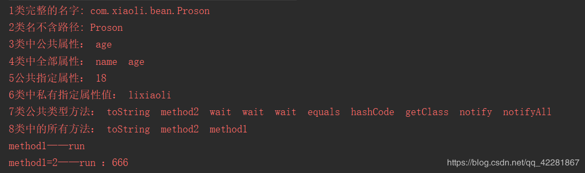

## （一）什么是反射？

Java反射机制是在运行状态中，对于任意一个类，都能够知道这个类的所有属性和方法；对于任意一个对象，都能够调用它的任意一个方法和属性；这种动态获取的信息以及动态调用对象的方法的功能称为Java语言的反射机制。

> 简单的来说：
> 1.通过new关键字创建对象操作对象，在编译时就已经确定。
> 2.通过反射可以在程序运行过程中动态的操作对象，可以获得编译期无法获得的信息，动态操作最大限度发挥了java扩展性。

**反射是框架的灵魂，它可以有效地降低类之间的耦合，很多框架都运用了反射原理，例如hibernate 的实体类，Spring 的 AOP等等都有反射的实现**

## （二）反射的具体实现

想要实现反射，就必须先拿到该类的字节码文件对象(.class),通过字节码文件对象，就能够通过该类中的方法获取到我们想要的所有信息，每一个类对应着一个字节码文件也就对应着一个Class类型的对象，也就是字节码文件对象.

### 1. 获取字节码文件对象（Class）的三种方式

```java
   /**
     * 方式一：
     * Object中的getClass方法来获取Class对象
     * 使用这方式必须有具体的类，并创建对象。
     * 这种方式使用的少，一般是传的是Object，不知道类型的时候才使用。
     */
            Object obj=new Proson();
	        Class clazz1 =obj.getClass();
	        System.err.println("通过getClass():"+clazz1);


   /**
     * 方式二：
     * 直接通过 类名.class来获取Class对象。
     * 任何类型中都具有隐含的静态成员变量class,使用简单，但是扩展性还是不足。
     */
            Class clazz2=Proson.class;
	        System.err.println("通过类名.class:"+clazz2);


  /**
     * 方式三：
     * 通过Class 对象的forName()静态方法来获取Class对象。
     * 使用最多，通过类的全限定名，但可能抛出ClassNotFoundException异常
     */
          Class clazz3 = Class.forName("com.xiaoli.bean.Proson");
	      System.err.println("通过类的全限定名:"+clazz3);

         //比较三种方法对象是否是相同实例。
	       System.err.println(clazz1==clazz2);
	       System.err.println(clazz1==clazz3);
	       System.err.println(clazz2==clazz3);

```

**运行结果得知**

1. 三种方法都可以获取字节码文件对象。
2. 一个类在 JVM 中只会有一个 Class 实例（比较之后全为true）


### 2. 创建对象的方式。

**Proson类**

```java
 public class Proson {
    //私有属性
    private String name;
    //公有属性
    public  Integer age;
    //无参构造
    public Proson() {
    }
    //有参构造
    public Proson(String name, Integer age) {
        this.name = name;
        this.age = age;
    }
    //私有方法
     private void method1(){
        System.err.println("method1——run");
    }
    //公有方法
    public void method2(String param){
        System.err.println("method1=2——run ："+param);
    }


    @Override
    public String toString() {
        return "Proson{" +
                "name='" + name + '\'' +
                ", age=" + age +
                '}';
    }
}

```

**实例化对象的方式**
通过new关键字与反射相互对比加深对反射的认识，详解代码如下：

```java
	 // 不用反射: 创建对象，需要手动new对象不能动态创建。
	 // new的时候根据new的类名寻找字节码文件，加载进入内存，创建Class对象，并接着创建对应的Proson对象。
         Proson p=new Proson();

        //通过反射:只需要一个名字，就可以创建对象。
        String className="com.xiaoli.bean.Proson";
        //寻找该名称的类文件，加载进内存，并创建Class对象。
        Class clazz = Class.forName(className);
        //通过Class对象的newInstance()创建类对象。
        Object o = clazz.newInstance();


```

**调用有参构造方法初始化变量**
通过有参构造对比反射，详解代码如下：

```java
        //不用反射：通过构造方法实例化并初始化变量
        Object obj1=new Proson("name",18);
        System.err.println("不用反射： "+obj1);
        //通过反射：Class对象的getConstructor方法拿到构造器。
        Constructor constructor = clazz.getConstructor(String.class, Integer.class);
        //通过构造器的newInstance方法实例化并初始化变量
        Object obj2=constructor.newInstance("name2",22);
        System.err.println("通过反射： "+obj2);

```

得到结果


## （三） Class 类中方法详解

到这里应该理解到Class对反射的重要性了吧？那么Class类中有什么常用方法呢？

- 获取公共构造器 getConstructors()
- 获取所有构造器 getDeclaredConstructors()
- 获取该类对象 newInstance()
- 获取类名包含包路径 getName()
- 获取类名不包含包路径 getSimpleName()
- 获取类公共类型的所有属性 getFields()
- 获取类的所有属性　getDeclaredFields()
- 获取类公共类型的指定属性 getField(String name)
- 获取类全部类型的指定属性 getDeclaredField(String name)
- 获取类公共类型的方法 getMethods()
- 获取类的所有方法 getDeclaredMethods()
- 获得类的特定公共类型方法: getMethod(String name, Class[] parameterTypes)
- 获取内部类 getDeclaredClasses()
- 获取外部类 getDeclaringClass()
- 获取修饰符 getModifiers()
- 获取所在包 getPackage()
- 获取所实现的接口 getInterfaces()

通过一些例子来演示以上常用方法，详解代码如下。

```java
       //这里方便操作演示用第二种发方法获取字节码对象
        Class clazz2=Proson.class;
        //通过反射调用有参构造函数初始化对象（上面演示过） 
        Constructor constructor = clazz2.getConstructor(String.class, Integer.class);
        Object obj = constructor.newInstance("lixiaoli", 18);

       //获得类完整的名字
        String className1 = clazz2.getName();
        System.err.println("1类完整的名字: "+className1);

       //获得类名不包含包路径
        String className2 = clazz2.getSimpleName();
        System.err.println("2类名不含路径: "+className2);

        //获得类中公共类型（public）属性
        Field[] fields = clazz2.getFields();
        String fieldName="";
        for(Field field : fields){
            fieldName+=field.getName()+"  ";
        }
        System.err.println("3类中公共属性： "+fieldName);

        //获得类中全部类型（包括私有）属性
        Field[] fieldsAll = clazz2.getDeclaredFields();
        fieldName="";
        for(Field field : fieldsAll){
            fieldName+=field.getName()+"  ";
        }
        System.err.println("4类中全部属性： "+fieldName);

        //获得公共指定属性值
        Field age = clazz2.getField("age");
        Object o = age.get(obj);
        System.err.println("5公共指定属性： "+o);

        //获得私有指定属性值
        Field name = clazz2.getDeclaredField("name");
        // Field name = clazz2.getField("name");只能获取共有属性 故此方法会抛出NoSuchFieldException异常,所以选用getDeclaredField();
        name.setAccessible(true); //设置为true才能获取私有属性
        Object o2 = name.get(obj);
        System.err.println("6类中私有指定属性值： "+o2);

        //获取类所有公共类型方法   这里包括 Object 类的一些方法
        Method[] methods = clazz2.getMethods();
        String methodsName="";
        for(Method method : methods){
            methodsName+=method.getName()+"  ";
        }
        System.err.println("7类公共类型方法： "+methodsName);

        //获取该类中的所有方法（包括私有）
        Method[] methodsAll = clazz2.getDeclaredMethods();
        methodsName="";
        for(Method method : methodsAll){
            methodsName+=method.getName()+"  ";
        }
        System.err.println("8类中的所有方法： "+methodsName);

        //获取并使用指定方法
        Method method1 = clazz2.getDeclaredMethod("method1");//获取无参私有方法
        method1.setAccessible(true);//设置为true才能获取私有方法
        method1.invoke(obj);//调用无参方法

        Method method2 = clazz2.getMethod("method2",String.class);//获取有参数方法
        method2.invoke(obj,"666");//调用有参方法


```

运行结果

四 反射总结
熟练的使用反射能让我们的程序耦合度降低，当然会损失一部分性能，毕竟有失才有得。