# 1 编辑【Editing】

| 快捷键                     | 英文说明                                                     | 中文说明                                                     |
| -------------------------- | ------------------------------------------------------------ | ------------------------------------------------------------ |
| Ctrl + Space               | Basic code completion (the name of any class, method or variable) | 补全代码，由于经常与操作系统的输入法的切换冲突，所以实际很少用。一般直接在 idea 中开启输入自动补全机制。 |
| Ctrl + Shift + Space       | Smart code completion (filters the list of methods and variables by expected type | 在列出的可选项中只显示出你所输入的关键字最相关的信息。**（常用）** |
| Ctrl + Shift + Enter       | Complete statement                                           | 代码补全后，自动在代码末尾添加分号结束符                     |
| Ctrl + P                   | Parameter info (within method call arguments)                | 在某个方法中，调用该按键后，会展示出这个方法的调用参数列表信息。 |
| Ctrl + Q                   | Quick documentation lookup                                   | 展示某个类或者方法的 API 说明文档                            |
| Ctrl + mouse               | over code Brief Info                                         | 跳进到某个类或者方法源代码中进行查看。**（常用）**           |
| Alt + Insert               | Generate code… (Getters, Setters, Constructors, hashCode/equals, toString) | 自动生成某个类的 Getters, Setters, Constructors, hashCode/equals, toString 等代码。**（常用）** |
| Ctrl + O                   | Override methods                                             | 展示该类中所有覆盖或者实现的方法列表，注意这里是字母小写的 O！ |
| Ctrl + Alt + T             | Surround with… (if…else,try…catch, for, synchronized, etc.)  | 自动生成具有环绕性质的代码，比如：if…else,try…catch, for, synchronized 等等，使用前要先选择好需要环绕的代码块。**（常用）** |
| Ctrl + /                   | Comment/uncomment with line comment                          | 对单行代码，添加或删除注释。分为两种情况：如果只是光标停留在某行，那么连续使用该快捷键，会不断注释掉下一行的代码；如果选定了某行代码（选定了某行代码一部分也算这种情况），那么连续使用该快捷键，会在添加或删除该行注释之间来回切换。**（常用）** |
| Ctrl + Shift + /           | Comment/uncomment with block comment                         | 对代码块，添加或删除注释。它与 Ctrl + / 的区别是，它只会在代码块的开头与结尾添加注释符号！**（常用）** |
| Ctrl + W                   | Select successively increasing code blocks                   | 选中当前光标所在的代码块，多次触发，代码块会逐级变大。**（常用）** |
| Ctrl + Shift + W           | Decrease current selection to previous state                 | 是 Ctrl + W 的反向操作，多次触发，代码块会逐级变小，最小变为光标。 |
| Alt + Q                    | Context info                                                 | 展示包含当前光标所在代码的父节点信息，比如在 java 方法中调用，就会展示方法签名信息。 |
| Alt + Enter                | Show intention actions and quick-fixes                       | 展示当前当前光标所在代码，可以变化的扩展操作                 |
| Ctrl + Alt + L             | Reformat code                                                | 格式化代码 **（常用）**                                      |
| Ctrl + Alt + O             | Optimize imports                                             | 去除没有实际用到的包，这在 java 类中特别有用。**（常用）**   |
| Ctrl + Alt + I             | Auto-indent line(s)                                          | 按照缩进的设定，自动缩进所选择的代码段。                     |
| Tab / Shift + Tab          | Indent/unindent selected lines                               | 缩进或者不缩进一次所选择的代码段。**（常用）**               |
| Ctrl + X 或 Shift Delete   | Cut current line or selected block to clipboard              | 剪切当前代码。 **（常用）**                                  |
| Ctrl + C 或 Ctrl + Insert  | Copy current line or selected block to clipboard             | 拷贝当前代码。 **（常用）**                                  |
| Ctrl + V 或 Shift + Insert | Paste from clipboard                                         | 粘贴之前剪切或拷贝的代码。**（常用）**                       |
| Ctrl + Shift + V           | Paste from recent buffers…                                   | 从之前的剪切或拷贝的代码历史记录中，选择现在需要粘贴的内容。**（常用）** |
| Ctrl + D                   | Duplicate current line or selected block                     | 复制当前选中的代码。**（常用）**                             |
| Ctrl + Y                   | Delete line at caret                                         | 删除当前光标所在的代码行。**（常用）**                       |
| Ctrl + Shift + J           | Smart line join                                              | 把下一行的代码接续到当前的代码行。                           |
| Ctrl + Enter               | Smart line split                                             | 当前代码行与下一行代码之间插入一个空行，原来所在的光标不变。**（常用）** |
| Shift + Enter              | Start new line                                               | 当前代码行与下一行代码之间插入一个空行，原来光标现在处于新加的空行上。**（常用）** |
| Ctrl + Shift + U           | Toggle case for word at caret or selected block              | 所选择的内容进行大小写转换。。**（常用）**                   |
| `Ctrl + Shift + ]/[`       | Select till code block end/start                             | 从当前光标所在位置开始，一直选择到当前光标所在代码段起始或者结束位置。 |
| Ctrl + Delete              | Delete to word end                                           | 删除从当前光标所在位置开始，直到这个单词的结尾的内容。       |
| Ctrl + NumPad(+/-)         | Expand/collapse code block                                   | 展开或收缩代码段。 **（常用）**                              |
| Ctrl + Shift + NumPad(+)   | Expand all                                                   | 展开所有代码段。                                             |
| Ctrl + Shift + NumPad(-)   | Collapse all                                                 | 收缩所有代码段。                                             |
| Ctrl + F4                  | Close active editor tab                                      | 关闭当前标签页。                                             |
| Shift + F6                 |                                                              | 修改名字。**（常用）**                                       |

## 1.1 Ctrl + Shift + Space 示例（智能补全）

使用前，用于补全的列表，默认是以输入的关键字作为前缀的：

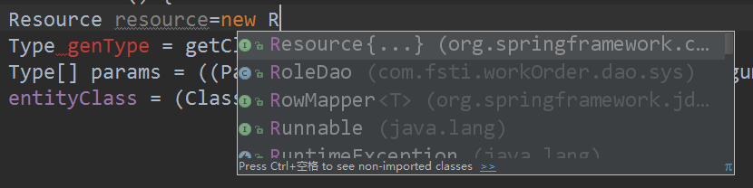

使用后，用于补全的列表，会把与输入的关键字最相关的信息排到最前面，比如这里的 Resource 的实现类会直接过滤出来，很方便吧 O(∩_∩)O~：

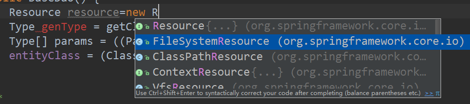

## 1.2 Ctrl + P 示例（方法参数列表）

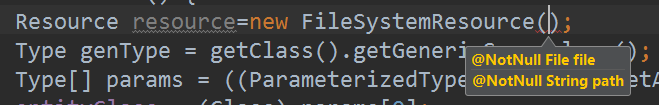

## 1.3 Ctrl + Q 示例（API 说明文档）

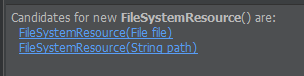

不大好用，字体太小了，还不如直接 [ctrl + 点击] 看源代码来的方便！

## 1.4 Alt + Insert 示例（自动生成与类相关的代码）

如果绑定了 Spring 框架，还能自动生成与 Spring 相关的依赖参数哦：

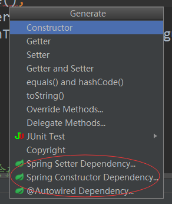

## 1.5 Ctrl + O 示例（该类中所有覆盖或者实现的方法列表）

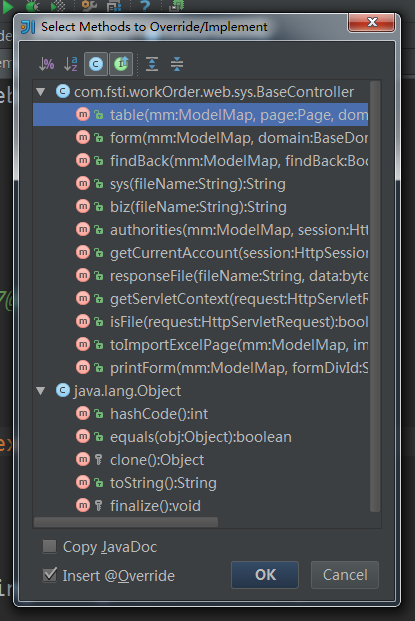

## 1.6 Ctrl + Alt + T 示例（生成具有环绕性质的代码）

再强调一遍，使用前要先选择好需要环绕的代码块！没有选择代码块，还做环绕干嘛呢 O(∩_∩)O~
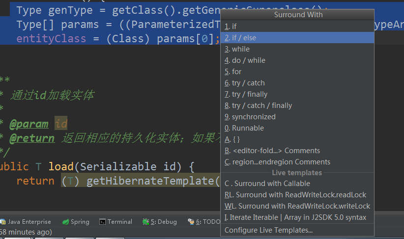

在右边的 Surround with 列表，就是目前支持的自动代码环绕功能，可以直接通过列表最左边的快捷键选择，是不是很方便呀 O(∩_∩)O~

它还支持自定义的代码模板（Live templates）呢，很强大吧。

## 1.7 Ctrl + Shift + V 示例（剪切或拷贝的代码历史记录中，选择粘贴的内容）

这是一个很酷的功能 O(∩_∩)O~，它会把之前剪切或拷贝的代码历史记录（最近 5 条）展示出来，让你来选择哦。可惜的是，列表选项如果是中文会乱码，还好内容可以正常显示：

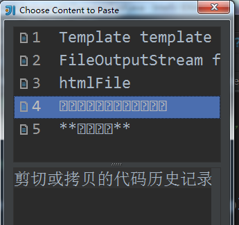

# 2 查找或替换【Search/Replace】

| 快捷键           | 英文说明        | 中文说明                                                     |
| ---------------- | --------------- | ------------------------------------------------------------ |
| Ctrl + F         | Find            | 在当前标签页中进行查找，还支持正则表达式哦。**（常用）**     |
| F3               | Find next       | 如果找到了多个查找结果，每调用一次就会跳到下一个结果，很方便哦。 |
| Shift + F3       | Find previous   | 是 F3 的反向操作，即每调用一次就会跳到上一个结果。           |
| Ctrl + R         | Replace         | 在当前标签页中进行替换操作。**（常用）**                     |
| Ctrl + Shift + F | Find in path    | 通过路径查找。**（常用）**                                   |
| Ctrl + Shift + R | Replace in path | 通过路径替换。**（常用）**                                   |

## 2.1 Ctrl + F （查找）

触发后，会打开一个查找面板：

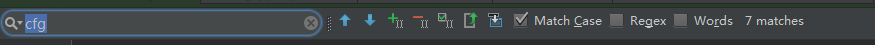

具体含义如下：

| 图示                 | 说明                                                      |
| -------------------- | --------------------------------------------------------- |
| 向上箭头             | 就是 快捷键【Shift + F3】，每调用一次就会跳到上一个结果。 |
| 向下箭头             | 就是 快捷键【F3】，每调用一次就会跳到下一个结果。         |
| 加号符号             | 把当前的高亮项加入到选中的列表中。                        |
| 减号符号             | 把当前的高亮项从选中的列表中移除。                        |
| 勾选符号             | 把所有的查找结果同时选中，这很适合批量操作。              |
| 文本内的向上箭头     | 打开查询结果列表面板。                                    |
| 两个框加一个向下箭头 | 更多选项。                                                |
| Match Case           | 是否大小写敏感。                                          |
| Regex                | 正则表达式。                                              |
| Words                | 匹配单词。                                                |
| x matches            | x 表示的是找到的记录数。                                  |

------

勾选符号选中效果：

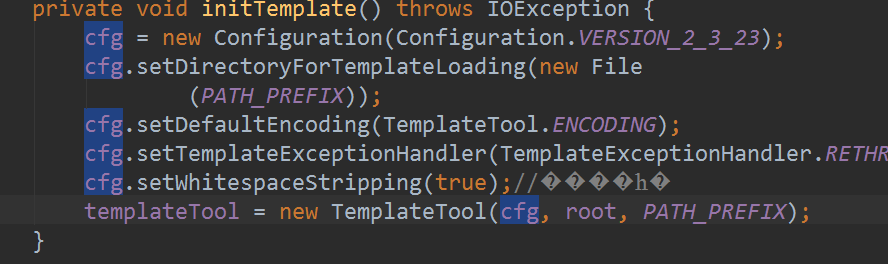

点击文本内的向上箭头，打开后的查询结果列表面板：

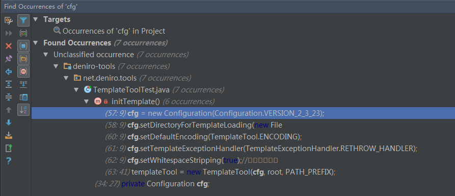

两个框加一个向下箭头，会变成一个大文本输入框，而且还多出一个查看搜索历史的按钮：

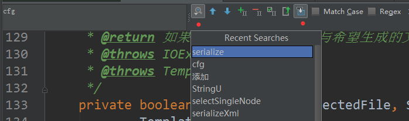

## 2.2 Ctrl + Shift + F （通过路径查找）

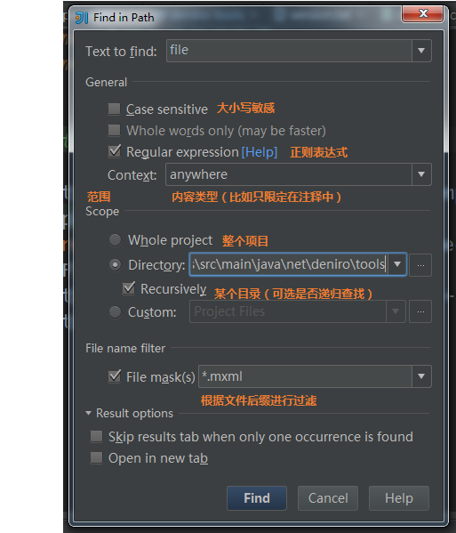

# 3 查看使用情况【Usage Search】

主要是查看当前光标所在内容使用情况。

| 快捷键            | 英文说明                                     | 中文说明                                         |
| ----------------- | -------------------------------------------- | ------------------------------------------------ |
| Alt + F7          | Find usages                                  | 在当前项目中的使用情况，会打开一个使用情况面板。 |
| Ctrl + F7         | Find usages in file                          | 在当前文件中的使用情况，找的内容会低亮显示。     |
| Ctrl + Shift + F7 | 在当前文件中的使用情况，找的内容会高亮显示。 |                                                  |
| Ctrl + Alt + F7   | Show usages                                  | 打开使用情况列表。 **（常用）**                  |

## 3.1 Ctrl + Alt + F7（打开使用情况列表）

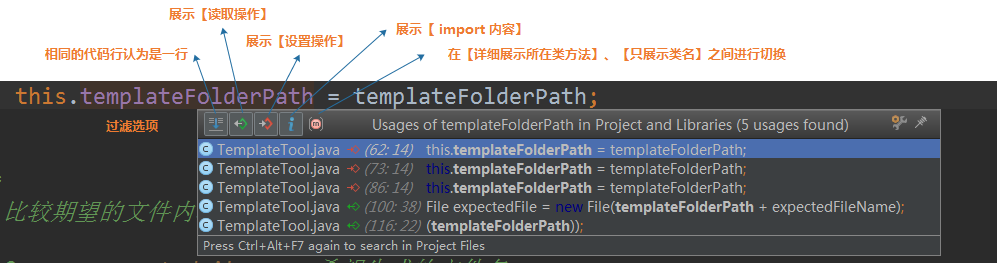

# 4 编译与运行【Compile and Run】

| 快捷键             | 英文说明                                     | 中文说明                                                     |
| ------------------ | -------------------------------------------- | ------------------------------------------------------------ |
| Ctrl + F9          | Make project (compile modifed and dependent) | 编译项目（如果之前有编译过，那么只会编译那些修改的类或者依赖的包）。 |
| Ctrl + Shift + F9  | Compile selected file, package or module     | 编译所中的范围（如果在某个类中，那么只会编译当前类）。       |
| Alt + Shift + F10  | Select configuration and run                 | 会打开一个已经配置的运行列表，让你选择一个后，再运行。       |
| Alt + Shift + F9   | Select configuration and debug               | 会打开一个已经配置的运行列表，让你选择一个后，再以调试模式运行。 |
| Shift + F10        | Run                                          | 立即运行当前配置的运行实例，这个在单元测试中特别好用。 **（常用）** |
| Shift + F9         | Debug                                        | 立即以编译模式运行当前配置的运行实例。                       |
| Ctrl + Shift + F10 | Run context configuration from editor        | 按照编辑器绑定的文件类型，运行相关的程序。比如一个 html 页面，调用后，会直接打开一个浏览器。 |

## 4.1 Alt + Shift + F10（打开运行列表，选择一个运行）

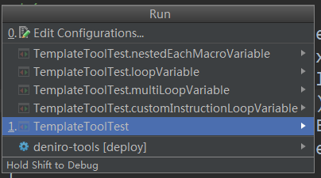

# 5 调试【Debugging】

| 快捷键            | 英文说明            | 中文说明                                                     |
| ----------------- | ------------------- | ------------------------------------------------------------ |
| F8                | Step over           | 跳到当前代码下一行。 **（常用）**                            |
| F7                | Step into           | 跳入到调用的方法内部代码。 **（常用）**                      |
| Shift + F7        | Smart step into     | 会打开一个面板，让你选择具体要跳入的类方法，这个在复杂的嵌套代码中特别有用。 |
| Shift + F8        | Step out            | 跳出当前的类，到上一级。 **（常用）**                        |
| Alt + F9          | Run to cursor       | 让代码运行到当前光标所在处，非常棒的功能。 **（常用）**      |
| Alt + F8          | Evaluate expression | 打开一个表达式面板，然后进行进一步的计算。                   |
| F9                | Resume program      | 结束当前断点的本轮调试（因为有可能代码会被调用多次，所以调用后只会结束当前的这一次）；如果有下一个断点会跳到下一个断点中。**（常用）** |
| Ctrl + F8         | Toggle breakpoint   | 在当前光标处，添加或者删除断点。                             |
| Ctrl + Shift + F8 | View breakpoints    | 打开当前断点的面板，可以进行条件过滤哦。                     |

## 5.1 Shift + F7（选择具体要跳入的类方法）

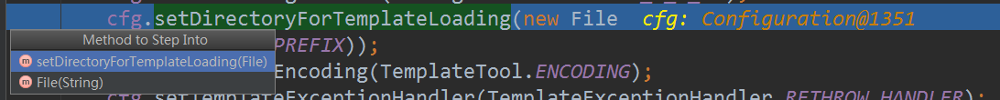

## 5.2 Alt + F8 （计算表达式）

注意：要在当前断点之前的代码中，选择某一个变量运行才有效，因为只有代码运行过了，才会有值的呀 O(∩_∩)O~

## 5.3 Ctrl + Shift + F8 （当前断点的面板）

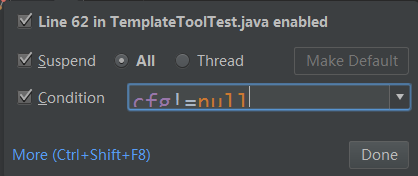

# 6 导航【Navigation】

| 快捷键                      | 英文说明                                  | 中文说明                                                     |
| --------------------------- | ----------------------------------------- | ------------------------------------------------------------ |
| Ctrl + N                    | Go to class                               | 打开类查询框。**（常用）**                                   |
| Ctrl + Shift + N            | Go to file                                | 打开文件查询框。**（常用）**                                 |
| Ctrl + Alt + Shift + N      | Go to symbol                              | 打开文本查询框。                                             |
| Alt + 右箭头/左箭头         | Go to next/previous editor tab            | 跳到下一个/上一个编辑器标签。                                |
| F12                         | Go back to previous tool window           | 如果当前在编辑窗口，触发后，会跳到之前操作过的工具栏上。     |
| ESC                         | Go to editor (from tool window)           | 从工具栏上，再跳回原来的编辑窗口，一般与 F12 配合使用。      |
| Shift + ESC                 | Hide active or last active window         | 隐藏最后一个处于活跃状态的工具窗口。                         |
| Ctrl + Shift + F4           | Close active run/messages/find/… tab      | 同时关闭处于活动状态的某些工具栏窗口。                       |
| Ctrl + G                    | Go to line                                | 跳转至某一行代码。。**（常用）**                             |
| Ctrl + E                    | Recent files popup                        | 打开曾经操作过的文件历史列表。                               |
| Ctrl + Alt + 右箭头/左箭头  | Navigate back/forward                     | 在曾经浏览过的代码行中来回跳                                 |
| Ctrl + Shift + Backspace    | Navigate to last edit location            | 跳转到最近的编辑位置（如果曾经编辑过代码）。                 |
| Alt + F1                    | Select current file or symbol in any view | 打开一个类型列表，选择后会导航到当前文件或者内容的具体与类型相关的面板中。 |
| Ctrl + B 或 Ctrl + 鼠标左键 | Go to declaration                         | 如果是类，那么会跳转到当前光标所在的类定义或者接口；如果是变量，会打开一个变量被引用的列表。**（常用）** |
| Ctrl + Alt + B              | Go to implementation(s)                   | 跳转到实现类，而不是接口。**（常用）**                       |
| Ctrl + Shift + I            | Open quick definition lookup              | 打开一个面板，里面包含类代码。                               |
| Ctrl + Shift + B            | Go to type declaration                    | 打开变量的类型所对应的类代码，只对变量有用。                 |
| Ctrl + U                    | Go to super-method/super-class            | 打开方法的超类方法或者类的超类，只对有超类的方法或者类有效。 |
| Alt + 上/下箭头             | Go to previous/next method                | 在某个类中，跳到上一个/下一个方法的签名上。                  |
| `Ctrl + ]/[`                | Move to code block end/start              | 移动光标到类定义的终止右大括号或者起始左大括号。             |
| Ctrl + F12                  | File structure popup                      | 打开类的结构列表。**（常用）**                               |
| Ctrl + H                    | Type hierarchy                            | 打开类的继承关系列表。**（常用）**                           |
| Ctrl + Shift + H            | Method hierarchy                          | 打开某个类方法的继承关系列表。                               |
| Ctrl + Alt + H              | Call hierarchy                            | 打开所有类的方法列表，这些方法都调用了当前光标所处的某个类方法。**（常用）** |
| F2/Shift + F2               | Next/previous highlighted error           | 在编译错误的代码行中来回跳。                                 |
| F4                          | Edit source                               | 打开当前光标所在处的方法或类源码。                           |
| Alt + Home                  | Show navigation bar                       | 激活包路径的导航栏。                                         |
| F11                         | Toggle bookmark                           | 把光标所处的代码行添加为书签或者从书签中删除。**（常用）**   |
| Ctrl + F11                  | Toggle bookmark with mnemonic             | 把光标所处的代码行添加为带快捷键的书签或者从快捷键书签中删除。 |
| Ctrl + [0-9]                | Go to numbered bookmark                   | 跳转到之前定义的快捷键书签。                                 |
| Shift + F11                 | Show bookmarks                            | 打开书签列表。**（常用）**                                   |

## 6.1 Ctrl + N （打开类查询框）

键入类名的关键字，会自动出现相关的类哦，右侧还有一个勾选项，能够把引用的 jar 包中的类也加进来，很强大 O(∩_∩)O~

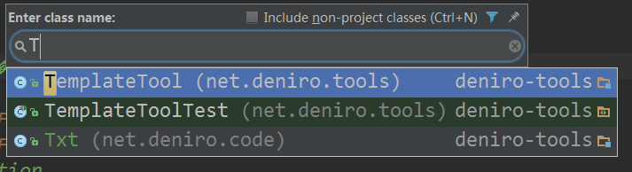

## 6.2 Ctrl + Alt + 右箭头/左箭头（在曾经浏览过的代码行中来回跳）

如果操作系统装的是 NVIDIA 显卡驱动程序，那么触发这个热键，会把旋转显示内容，而不是触发 idea 的功能，因为 idea 热键被 NVIDIA 显卡驱动给劫持咯。

解决方法是禁用 NVIDIA 显卡驱动所有快捷键，：

1、控制面板-》显示-》屏幕分辨率：

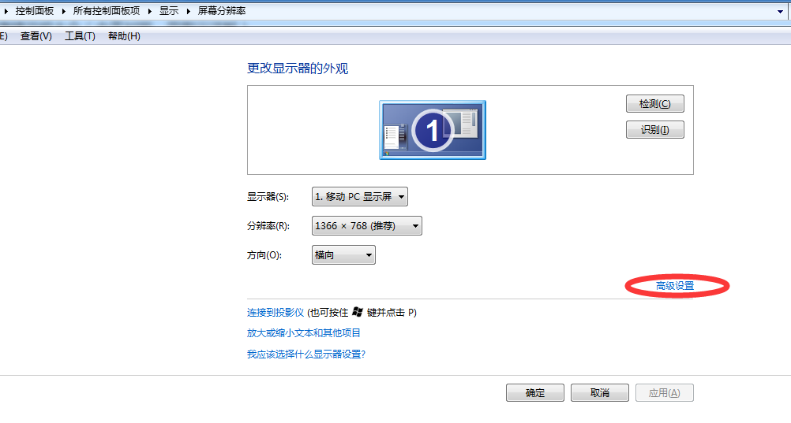

2、点击【高级设置】-》核芯显卡控制面板：

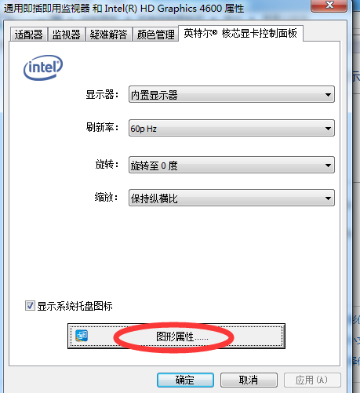

3、图形属性-》选项与支持-》禁用所有快捷键（这些快捷键几乎没有什么用处！）

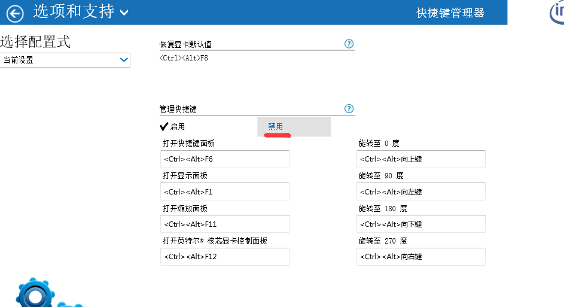

## 6.3 Alt + F1（打开一个类型列表）

## 6.4 F11（添加为书签或者从书签中删除）

书签不是默认视图，所以我们要把它添加到当前视图中：View -> Tool Windows -> Favorites，打开 Favorites 面板：

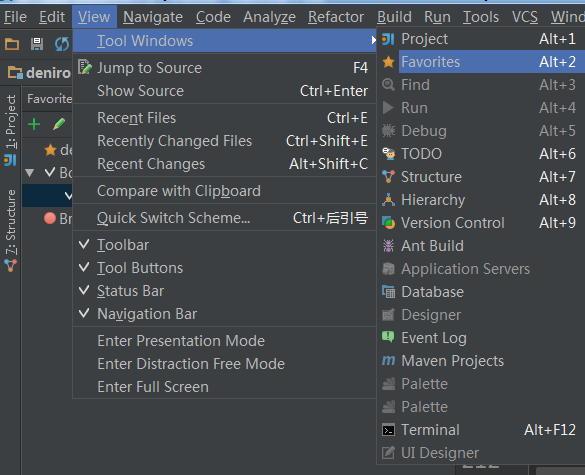

Favorites 面板中的 Bookmarks 就是我们添加的书签哦：

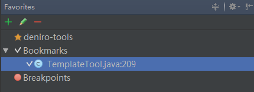

或者直接使用 Shift + F11，打开书签列表也可以的哦 O(∩_∩)O~。

## 6.5 Ctrl + F11 （添加或删除带快捷键的书签）

会打开一个设置快捷键的面板，比如这里点击了 1，那么它的快捷键就是 Ctrl + 1。

注意不要选择面板提供的 26 个大写字母，因为这会与 idea 的其他快捷键冲突，不知道 idea 为什么要把它们放在这里？好奇怪 O(∩_∩)O~

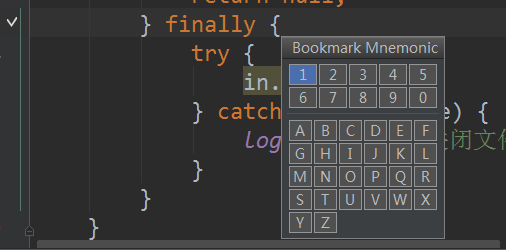