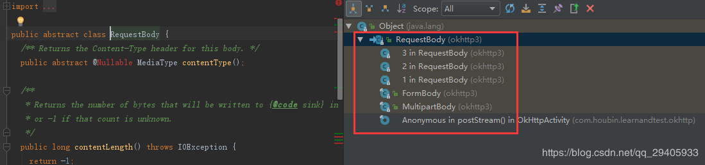
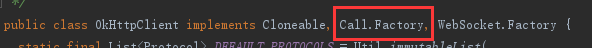

**简单说一下学习okhttp的理由**

1. google在Android 6.0中删除了HttpClient的Api,采用的是则是okhttp
2. 高效的使用HTTP,使应用运行更快更省流量
3. 响应缓存数据避免重复网络请求
4. 无缝的支持GZIP来减少数据流量
5. 使用非常简单，请求和响应的Api具有流畅的建造和不变性，同时支持同步异步调用回调函数
6. 如果网络出现问题，它会从常见的连接问题中恢复
7. 如果服务器配置有多个IP地址，当第一个IP连接失败，它会尝试连接下一个IP


# OkHttpClient类、Request类、Call类、Response的简单分析

通过上一节 OkHttp3.0（一）-OkHttp的基本使用 ，我们掌握了OkHttp的基本使用，如何发送同步请求、异步请求，如何发送GET请求、POST请求，如何提交不同类型的请求参数等等。本节我们来简单分析一下我们使用OkHttp时候，必然会用到的四个类：

1. OkHttpClient，OkHttp客户端类，用来构建请求发起类Call，设置超时，设置缓存，设置拦截器等；

2. Request，OkHttp请求包装类，用来封装网络请求信息及请求体，比如请求方式（GET、POST、DELETE、PUT等），url，headers，请求参数等，服务器端最终接受并解析的请求消息，就是由该类提供。OkHttpClient获取Call对象时，需要传入Request作为参数；

3. Call，发送请求类，该类用来发起OkHttp的网络请求（同步、异步），并将请求结果返回给调用者，该类初始化系统拦截器，并启动拦截器链；

4. Response，OkHttp响应包装类，用来封装OkHttp网络请求的结果，包括Http请求响应码，以及服务器端返回的数据（响应体），以及此次请求的Request信息。客户端最终接受并解析的由服务器返回的消息，就是该类提供的。同步请求可以直接获取该类的对象，异步请求通过接口回调获取该类对象。


我们先用OkHttp同步、异步请求的代码作为探讨开头：

OkHttp同步GET请求

```java
 OkHttpClient client = new OkHttpClient.Builder().readTimeout(6, TimeUnit.SECONDS).build();
    public void syncGet(View view) {
        String url = "http://www.baidu.com";
        final Request request = new Request.Builder()
                .url(url)
                .get()
                .build();
        new Thread(new Runnable() {
            @Override
            public void run() {
                Call call = client.newCall(request);
                try {
                    Response response = call.execute();
                    Log.i(TAG + " syncGet", response.body().string());
                } catch (IOException e) {
                    Log.e(TAG + " syncGet", "onFailure: " + e.getMessage());
                }
            }
        }).start();
    }
```

OkHttp异步GET请求

```java
OkHttpClient client = new OkHttpClient.Builder().readTimeout(6, TimeUnit.SECONDS).build();
    public void asyncGet(View view) {
        String url = "http://www.baidu.com";
        Request request = new Request.Builder()
                .url(url)
                .get()
                .build();
        Call call = client.newCall(request);
        call.enqueue(new Callback() {
            @Override
            public void onFailure(Call call, IOException e) {
                Log.e(TAG + " asyncGet", "onFailure: " + e.getMessage());
            }
            @Override
            public void onResponse(Call call, Response response) throws IOException {
                Log.i(TAG + " asyncGet", response.body().string());
            }
        });
    }
```


# 1，OkHttpClient

OkHttpClient，是OkHttp的客户端类，该类使用的是构建者模式，所以通常情况下，我们使用new OkHttpClient.Builder().......build()方式来创建OkHttpClient的实例，OkHttpClient的属性以及相关方法，大部分体现在OkHttpClient.Builde中，所以我们学习OkHttpClient，就先学习OkHttpClient.Builder构建者，为了方便文章阅读，我们只挑选重点需要关注的代码进行分析。

```java
 public static final class Builder {
    //请求分配器
    Dispatcher dispatcher;
    ...
    //全局拦截器（最早被调用）
    final List<Interceptor> interceptors = new ArrayList<>();
    //非网络请求拦截器（链接拦截器调用之后调用）
    final List<Interceptor> networkInterceptors = new ArrayList<>();
    ...
    //网络请求缓存
    @Nullable Cache cache;
    //Cache内部缓存类，主要用来操作Cache
    @Nullable InternalCache internalCache;
    ...
    //连接池
    ConnectionPool connectionPool;
    ...
    //连接超时
    int connectTimeout;
    //读取超时
    int readTimeout;
    //写入超时
    int writeTimeout;
    ...
 
    public Builder() {
      dispatcher = new Dispatcher();
      ...
      connectionPool = new ConnectionPool();
      ...
      connectTimeout = 10_000;
      readTimeout = 10_000;
      writeTimeout = 10_000;
      ...
    }
   
    public int connectTimeoutMillis() {
      return connectTimeout;
    }
    
    public int readTimeoutMillis() {
      return readTimeout;
    }
    
    public int writeTimeoutMillis() {
      return writeTimeout;
    }  
    ...
      public @Nullable Cache cache() {
        return cache;
      }
      InternalCache internalCache() {
        return cache != null ? cache.internalCache : internalCache;
      }
     
      void setInternalCache(@Nullable InternalCache internalCache) {
        this.internalCache = internalCache;
        this.cache = null;
      }
     
      public Builder cache(@Nullable Cache cache) {
        this.cache = cache;
        this.internalCache = null;
        return this;
      }
 
    public Builder connectTimeout(long timeout, TimeUnit unit) {
      connectTimeout = checkDuration("timeout", timeout, unit);
      return this;
    }
 
    public Builder readTimeout(long timeout, TimeUnit unit) {
      readTimeout = checkDuration("timeout", timeout, unit);
      return this;
    }
   
    public Builder writeTimeout(long timeout, TimeUnit unit) {
      writeTimeout = checkDuration("timeout", timeout, unit);
      return this;
    }
    ...
    
    public Builder connectionPool(ConnectionPool connectionPool) {
      if (connectionPool == null) throw new NullPointerException("connectionPool == null");
      this.connectionPool = connectionPool;
      return this;
    }
    ...
   
    public Builder dispatcher(Dispatcher dispatcher) {
      if (dispatcher == null) throw new IllegalArgumentException("dispatcher == null");
      this.dispatcher = dispatcher;
      return this;
    }
   ...
    
    public List<Interceptor> interceptors() {
      return interceptors;
    }
    public Builder addInterceptor(Interceptor interceptor) {
      if (interceptor == null) throw new IllegalArgumentException("interceptor == null");
      interceptors.add(interceptor);
      return this;
    }
  
    public List<Interceptor> networkInterceptors() {
      return networkInterceptors;
    }
    public Builder addNetworkInterceptor(Interceptor interceptor) {
      if (interceptor == null) throw new IllegalArgumentException("interceptor == null");
      networkInterceptors.add(interceptor);
      return this;
    }
    ...
    public OkHttpClient build() {
      return new OkHttpClient(this);
    }
  }
```

从Builder源码中，我们可以看到，定义了请求分配器、超时、拦截器、缓存等变量。其中请求分配器（Dispatcher），连接池和连接超时、读取超时、写入超时等，在Builder的构造函数中，已经默认初始化赋值了，说明这些是OkHttp网络请求必须用到的；而缓存（Cache）和用户可传入拦截器（Interceptor）等，并未在构造函数中赋值，说明这些并不是OkHttp网络请求所必须的。Builder类中定义很多变量，均可以通过Builder构建者模式提供的方法，给他们赋值，比如设置readTimeout：

```java
OkHttpClient client = new OkHttpClient.Builder().readTimeout(6, TimeUnit.SECONDS).build();
```

关于[分配器（Dispatcher）](https://mp.csdn.net/postedit/83822900)、缓存（Cache）、拦截器（Interceptor）以及连接池（ConnectionPool）等，属于OkHttp的核心，我们在后面章节会重点从源码角度介绍。

还需要注意的是，OkHttpClient类中，有一个静态代码块，如下：

```java
 static {
    Internal.instance = new Internal() {
      ...
      @Override public void setCache(OkHttpClient.Builder builder, InternalCache internalCache) {
        builder.setInternalCache(internalCache);
      }
      @Override public boolean connectionBecameIdle(
          ConnectionPool pool, RealConnection connection) {
        return pool.connectionBecameIdle(connection);
      }
      @Override public RealConnection get(ConnectionPool pool, Address address,
          StreamAllocation streamAllocation, Route route) {
        return pool.get(address, streamAllocation, route);
      }
      ...
      @Override public void put(ConnectionPool pool, RealConnection connection) {
        pool.put(connection);
      }
      @Override public RouteDatabase routeDatabase(ConnectionPool connectionPool) {
        return connectionPool.routeDatabase;
      }
      @Override public int code(Response.Builder responseBuilder) {
        return responseBuilder.code;
      }       
      ...
      @Override public StreamAllocation streamAllocation(Call call) {
        return ((RealCall) call).streamAllocation();
      }
      ...
    };
  }
```

下面是Internal抽象类中部分代码：

```java
/**
 * Escalate internal APIs in {@code okhttp3} so they can be used from OkHttp's implementation
 * packages. The only implementation of this interface is in {@link OkHttpClient}.
 */
public abstract class Internal {
  ...   
  //定义实例
  public static Internal instance;
  ...
  public abstract void setCache(OkHttpClient.Builder builder, InternalCache internalCache);
 
  public abstract RealConnection get(ConnectionPool pool, Address address,
      StreamAllocation streamAllocation, Route route);
 ...
 
  public abstract void put(ConnectionPool pool, RealConnection connection);
  public abstract boolean connectionBecameIdle(ConnectionPool pool, RealConnection connection);
 ...
  public abstract int code(Response.Builder responseBuilder);
 ...
  public abstract StreamAllocation streamAllocation(Call call);
 ...
}
```

在OkHttpClient的静态代码块中，初始化了Internal抽象类中的静态public引用instance,实现了该类的抽象方法，类加载的时候，给Internal的instance赋值。根据Internal的类的注释可以明白，OkHttpClient中是唯一实现了Internal的地方，这样做主要是为了让外部包的成员访问非public方法。后面，我们在讲到与服务器端建立连接的时候，会有体现。

还有一个地方，是我们使用OkHttpClient获取Call的方法newCall，需要传入Request参数，返回的是Call的实现类RealCall的实例，所以我们在阅读Call的源码的时候，要跳入RealCall中阅读。

```java
 /**
   * Prepares the {@code request} to be executed at some point in the future.
   */
  @Override public Call newCall(Request request) {
    return RealCall.newRealCall(this, request, false /* for web socket */);
  }
```

这样，就简单的把OkHttpClient分析完了，其实，OkHttpClient的主要作用有如下几点：

- 对网络请求的一些基本设置：比如连接超时、读取超时、写入超时、拦截器、缓存等；
- 初始化网络请求一些必须的实例：比如分配器（Dispatcher）、连接池（ConnectionPool）等；
- Internal的实现以及类加载时的初始化；
- 提供获取Call的方法：newCall(Request)，用来发送请求。

# 2，Request

Request与OkHttpClient一样，也使用了[构建者模式](https://blog.csdn.net/lms1719/article/details/70741691)，所以与OkHttpClient的使用方式大同小异。同样的道理，我们要学习Request，主要需要掌握其Builder，因此，我们先简单看一下Request.Builder的代码：

```java
 public static class Builder {
    //请求网址
    HttpUrl url;
    //请求方法
    String method;
    //请求头
    Headers.Builder headers;
    //请求体
    RequestBody body;
    ...    
    public Builder() {
      this.method = "GET";
      this.headers = new Headers.Builder();
    }
    Builder(Request request) {
      this.url = request.url;
      this.method = request.method;
      this.body = request.body;
      ...
      this.headers = request.headers.newBuilder();
    }
    public Builder url(HttpUrl url) {
      if (url == null) throw new NullPointerException("url == null");
      this.url = url;
      return this;
    }
   
    public Builder url(String url) {
      if (url == null) throw new NullPointerException("url == null");
 
      // Silently replace web socket URLs with HTTP URLs.
      if (url.regionMatches(true, 0, "ws:", 0, 3)) {
        url = "http:" + url.substring(3);
      } else if (url.regionMatches(true, 0, "wss:", 0, 4)) {
        url = "https:" + url.substring(4);
      }
      return url(HttpUrl.get(url));
    }
  
    public Builder url(URL url) {
      if (url == null) throw new NullPointerException("url == null");
      return url(HttpUrl.get(url.toString()));
    }
   
    public Builder header(String name, String value) {
      headers.set(name, value);
      return this;
    }
  
    public Builder addHeader(String name, String value) {
      headers.add(name, value);
      return this;
    }
    /** Removes all headers named {@code name} on this builder. */
    public Builder removeHeader(String name) {
      headers.removeAll(name);
      return this;
    }
    /** Removes all headers on this builder and adds {@code headers}. */
    public Builder headers(Headers headers) {
      this.headers = headers.newBuilder();
      return this;
    }
  
    public Builder cacheControl(CacheControl cacheControl) {
      String value = cacheControl.toString();
      if (value.isEmpty()) return removeHeader("Cache-Control");
      return header("Cache-Control", value);
    }
    public Builder get() {
      return method("GET", null);
    }
    public Builder head() {
      return method("HEAD", null);
    }
    public Builder post(RequestBody body) {
      return method("POST", body);
   }
    public Builder delete(@Nullable RequestBody body) {
      return method("DELETE", body);
    }
    public Builder delete() {
      return delete(Util.EMPTY_REQUEST);
    }
    public Builder put(RequestBody body) {
      return method("PUT", body);
    }
    public Builder patch(RequestBody body) {
      return method("PATCH", body);
    }
    public Builder method(String method, @Nullable RequestBody body) {
      if (method == null) throw new NullPointerException("method == null");
      if (method.length() == 0) throw new IllegalArgumentException("method.length() == 0");
      if (body != null && !HttpMethod.permitsRequestBody(method)) {
        throw new IllegalArgumentException("method " + method + " must not have a request body.");
      }
      if (body == null && HttpMethod.requiresRequestBody(method)) {
        throw new IllegalArgumentException("method " + method + " must have a request body.");
      }
      this.method = method;
      this.body = body;
      return this;
    }
  ...
    public Request build() {
      if (url == null) throw new IllegalStateException("url == null");
      return new Request(this);
    }
  }
```

Request类，比较简单，主要就是定义了OkHttp网络请求的url、请求方法（GET、POST、PUT......）method、请求头headers和请求体RequestBody。前面说过，Request最终会被服务器端接收并解析，所以这些不难理解。我们可以通过Request.Builder提供给我们的方法，给这些变量赋值，比如：

```java
Request request = new Request.Builder().url(url).post(body).build();
```

需要注意的是，Builder的构造函数，默认给method赋值为“GET”，显而易见，如果我们不给Request指定请求方法时，会默认为GET请求：

```java
public Builder() {
    this.method = "GET";
    this.headers = new Headers.Builder();
}
```

## 2.1，RequestBody

Request中，url和method没有什么好说的，一个表示网络请求的url，另一个表示Http请求的方法，相信大家都知道。Request中，当请求需要传入请求体，比如向服务器端发送表单，发送json数据，上传图片，提交数据流等，就需要用到RequestBody（请求体）了，RequestBody中提供了添加向服务器发送的数据的方法，以及设置发送的数据格式，将这些数据封装起来提交到服务器端。我们先看下RequestBody的类结构：



我们可以看到，RequestBody是个抽象类，其实现类中，有三个是在RequestBody内部实现的，还有两个，FormBody（用来向服务器提交表单）和MultipartBody（向服务器提交分块请求）。我们可以看一下RequestBody中的抽象方法：

```java
 /** 返回请求体的MediaType（内容类型）. */
  public abstract @Nullable MediaType contentType();
  /**
   * 返回调用 writeTo 方法时写入 sink的字节数
   * or -1 if that count is unknown.
   */
  public long contentLength() throws IOException {
    return -1;
  }
  /** 将请求内容写入到{BufferedSink  sink}中临时保存*/
  public abstract void writeTo(BufferedSink sink) throws IOException;
```

由此可见，在创建RequestBody时，需要重写两个方法，ContentType()、writeTo(BufferedSink sink)，ContentType()方法是用来设置请求体的内容类型；writeTo(BufferedSink sink)方法，是用来将请求体的内容写入到硬盘，我们可以将sink简单理解为OutputStream就可以了，个人觉得没有必要在深究下去。上面给出的RequestBody类结构图中，说过，在RequestBody内部，有自身的三个实现类，其实正是框架提供给我们的创建方法create()，我们看一下RequestBody中的几个create方法

**RequestBody**

```java
/**
创建一个RequestBody，传入的消息内容是String，一般用于向服务器端提交String
*/ 
public static RequestBody create(@Nullable MediaType contentType, String content) {
    Charset charset = Util.UTF_8;
    if (contentType != null) {
      charset = contentType.charset();
      if (charset == null) {
        charset = Util.UTF_8;
        contentType = MediaType.parse(contentType + "; charset=utf-8");
      }
    }
    byte[] bytes = content.getBytes(charset);
    return create(contentType, bytes);
  }
 
 /**
创建一个RequestBody，传入的内容是byte[]类型，一般用于向服务器端提交数据流 
 */
  public static RequestBody create(final @Nullable MediaType contentType, final byte[] content) {
    return create(contentType, content, 0, content.length);
  }
 
  /** Returns a new request body that transmits {@code content}. */
  public static RequestBody create(final @Nullable MediaType contentType, final byte[] content,
      final int offset, final int byteCount) {
    if (content == null) throw new NullPointerException("content == null");
    Util.checkOffsetAndCount(content.length, offset, byteCount);
    return new RequestBody() {
      @Override public @Nullable MediaType contentType() {
        return contentType;
      }
 
      @Override public long contentLength() {
        return byteCount;
      }
 
      @Override public void writeTo(BufferedSink sink) throws IOException {
        sink.write(content, offset, byteCount);
      }
    };
  }
 
 /** 
创建一个RequestBody，传入的数据是File，一般用于向服务器提交文件
 */
  public static RequestBody create(final @Nullable MediaType contentType, final File file) {
    if (file == null) throw new NullPointerException("content == null");
 
    return new RequestBody() {
      @Override public @Nullable MediaType contentType() {
        return contentType;
      }
 
      @Override public long contentLength() {
        return file.length();
      }
 
      @Override public void writeTo(BufferedSink sink) throws IOException {
        Source source = null;
        try {
          source = Okio.source(file);
          sink.writeAll(source);
        } finally {
          Util.closeQuietly(source);
        }
      }
    };
  }
```

RequestBody分别像我们提供了不同的create方法创建RequestBody实例，用来传入不同类型的数据作为向服务器提交的内容，有String、byte[]、File供我们选择。使用起来比较简单，下面我们列举他的几种使用方法：

```java
//创建RequestBody对象  
final RequestBody requestBody = new RequestBody() {
       @NonNull
       @Override
       public MediaType contentType() {
           return MediaType.parse("text/x-markdown; charset=utf-8");
       }
       @Override
       public void writeTo(BufferedSink sink) throws IOException {
                sink.writeUtf8("I am HouBin");
       }
 };
 Request request = new Request.Builder()
                .url(url)
                .post(requestBody)//传入请求体构建Request
                .build();
```

```java
File file = FileUtils.getOkHttpTestFile(this);
//创建一个提交File的RequestBody
RequestBody requestBody = RequestBody.create(MediaType.parse("text/x-markdown; charset=utf-8"), file);
Request request = new Request.Builder()
                .post(requestBody)//传入RequestBody构建Request
                .url(url)
                .build();
```

当然了，OkHttp框架还专门向我们提供了RequestBody的两个实现类供我们使用，一个是用来向服务器端提交表单的FormBody，另一个是用来提交分块请求的MultipartBody。

### 2.1.1,FormBody

FormBody继承自RequestBody，所以可以作为消息体，传入到Request提供的方法中，构建一个带有消息体的Request对象，最后Request对象作为发送Http请求的参数被传入。通过前面对RequestBody的讲解，我们应该很明白，先看一下FormBody实现的父类的两个抽象方法

**contentType方法：**

```java
 private static final MediaType CONTENT_TYPE = MediaType.get("application/x-www-form-urlencoded");
  @Override public MediaType contentType() {
    return CONTENT_TYPE;
  }
```

很明显，FormBody已经确定好了MediaType的类型（application/x-www-form-urlencoded），不需要用户手动传入。

**writeTo方法：**

```java
 @Override public void writeTo(BufferedSink sink) throws IOException {
    writeOrCountBytes(sink, false);
  }
 
 private long writeOrCountBytes(@Nullable BufferedSink sink, boolean countBytes) {
    long byteCount = 0L;
 
    Buffer buffer;
    if (countBytes) {
      buffer = new Buffer();
    } else {
      buffer = sink.buffer();
    }
    for (int i = 0, size = encodedNames.size(); i < size; i++) {
      if (i > 0) buffer.writeByte('&');
      buffer.writeUtf8(encodedNames.get(i));
      buffer.writeByte('=');
      buffer.writeUtf8(encodedValues.get(i));
    }
    if (countBytes) {
      byteCount = buffer.size();
      buffer.clear();
    }
    return byteCount;
  }
```

可以发现，在writeTo方法中，将encodedNames和encodedValues分别当做键和值的集合，最后遍历，写入硬盘，用于后面使用，那么encodedNames和encodedValues是什么？这两个变量是如何复制的？我们可以看到FormBody中如下代码：

```java
  private final List<String> encodedNames;
  private final List<String> encodedValues;
  FormBody(List<String> encodedNames, List<String> encodedValues) {
    this.encodedNames = Util.immutableList(encodedNames);
    this.encodedValues = Util.immutableList(encodedValues);
  }
```

可以发现，是两个List<String>集合，分别用来存储我们表单的键和值，其实不难发现，FormBody类，同样使用的是构建者模式，可以猜想到，他的构建者Builder中，必然也有两个List<String>变量，用户可以根据Builder提供的方法来操作这两个集合，最后通过build方法，将Builder的两个集合分别赋值给FormBody的两个集合成员变量，我们可以看下源码：

**FormBody.Builder**

```java
public static final class Builder {
    private final List<String> names = new ArrayList<>();
    private final List<String> values = new ArrayList<>();
    private final Charset charset;
 
    public Builder() {
      this(null);
    }
    public Builder(Charset charset) {
      this.charset = charset;
    }
    public Builder add(String name, String value) {
      if (name == null) throw new NullPointerException("name == null");
      if (value == null) throw new NullPointerException("value == null");
      names.add(HttpUrl.canonicalize(name, FORM_ENCODE_SET, false, false, true, true, charset));
      values.add(HttpUrl.canonicalize(value, FORM_ENCODE_SET, false, false, true, true, charset));
      return this;
    }
    public Builder addEncoded(String name, String value) {
      if (name == null) throw new NullPointerException("name == null");
      if (value == null) throw new NullPointerException("value == null");
      names.add(HttpUrl.canonicalize(name, FORM_ENCODE_SET, true, false, true, true, charset));
      values.add(HttpUrl.canonicalize(value, FORM_ENCODE_SET, true, false, true, true, charset));
      return this;
    }
    public FormBody build() {
      return new FormBody(names, values);
    }
  }
```

FormBody使用起来也比较简单，[构建者模式](https://blog.csdn.net/lms1719/article/details/70741691)，通过其Builder来构建，可以像如下这样使用：

```java
//构建FormBody实例，并传入键值对  
RequestBody body = new FormBody.Builder()
                .add("search", "Jurassic Park")
                .build();
Request request = new Request.Builder()
                .url(url)
                .post(body)//传入FromBody构建Request
                .build();
```

### 2.1.2，MultipartBody

MultipartBody同样，也是继承自RequestBody，也是采用了Builder[构建者模式](https://blog.csdn.net/lms1719/article/details/70741691)，所以我们同样的方法，来读一下它的源码。

**contentType()**

```java
  /** A combination of {@link #type()} and {@link #boundary()}. */
  @Override public MediaType contentType() {
    return contentType;
  }
```

该方法并没有看到返回一个具体的MediaType，而是返回了contentType这个成员变量，所以我们需要追踪一下contentType这个变量，同时该方法的注释告诉我们：结合type()方法和boundary()方法。我们先分别看一下contentType变量、type()方法和boundary()方法

```java
 private final ByteString boundary;
 private final MediaType originalType;
 private final MediaType contentType;
 private final List<Part> parts;
 
 MultipartBody(ByteString boundary, MediaType type, List<Part> parts) {
    this.boundary = boundary;
    this.originalType = type;
    this.contentType = MediaType.get(type + "; boundary=" + boundary.utf8());
    this.parts = Util.immutableList(parts);
 }
 
 public MediaType type() {
   return originalType;
 }
 public String boundary() {
   return boundary.utf8();
 }
```

通过读取源码，可知，type()返回的MediaType正是构造函数所赋值的变量originalType，boundary()方法返回的同样也是构造函数赋值的boundary的字符串，而contentType是通过构造函数的type和boundary的字符串构建出来的。可以理解为，contentType是通过成员变量originalType和boundart.utf8()通过MediaType的get(String)方法获取的。

同时我们还观察到，成员变量中有一个List<Part> parts也是通过构造函数被赋值的，所以，很有必要了解一下MultipartBody的构造函数，究竟实在哪里调用传入这几个参数的？在查看其构造函数被调用之前，我们解释一下Util.immutableList(parts)这句代码：

```java
  /** Returns an immutable copy of {@code list}. */
  public static <T> List<T> immutableList(List<T> list) {
    return Collections.unmodifiableList(new ArrayList<>(list));
  }
```

*复制并且返回一个不可被改变的List集合。*Collections.unmodifiableList(List)方法，的中文文档截图如下：


由此可知，当我们调用了MultipartBody的构造函数之后，List<Part> parts就变成只读状态，不被允许修改。MultipartBody继承自RequestBody，那么他还实现了另一个方法writeTo(),我们来看下

**writeTo(BufferSink)**

```java
  @Override 
  public void writeTo(BufferedSink sink) throws IOException {
    writeOrCountBytes(sink, false);
  }
  private long writeOrCountBytes(
      @Nullable BufferedSink sink, boolean countBytes) throws IOException {
    long byteCount = 0L;
    Buffer byteCountBuffer = null;
    if (countBytes) {
      sink = byteCountBuffer = new Buffer();
    }
    for (int p = 0, partCount = parts.size(); p < partCount; p++) {
      Part part = parts.get(p);
      Headers headers = part.headers;
      RequestBody body = part.body;
      ...
      if (headers != null) {
        for (int h = 0, headerCount = headers.size(); h < headerCount; h++) {
          sink.writeUtf8(headers.name(h))
              .write(COLONSPACE)
              .writeUtf8(headers.value(h))
              .write(CRLF);
        }
      }
      MediaType contentType = body.contentType();
      if (contentType != null) {
        sink.writeUtf8("Content-Type: ")
            .writeUtf8(contentType.toString())
            .write(CRLF);
      }
      long contentLength = body.contentLength();
      if (contentLength != -1) {
        sink.writeUtf8("Content-Length: ")
            .writeDecimalLong(contentLength)
            .write(CRLF);
      } else if (countBytes) {
        // We can't measure the body's size without the sizes of its components.
        byteCountBuffer.clear();
        return -1L;
      }
     ...
      if (countBytes) {
        byteCount += contentLength;
      } else {
        body.writeTo(sink);
      }
      sink.write(CRLF);
    }
   ...
    return byteCount;
  }
```

从上面代我们可以知道writeTo()方法，主要做的就是将成员变量boundary和parts集合写入到硬盘中，后面会拿出来提交给后台解析。我们可以看出Part这个类，主要维护两个变量Headers和RequestBody。请求头（Headers）和请求体（RequestBody），是Http请求的主要组成部分，MultipartBody是用来向服务器提交分块请求，内部维护了List<Part> parts集合，而每个Part都是由一个请求头和一个请求体构成的，所以我们可以这样理解：

> MultipartBody分块请求，List<Part> parts集合就是它分出来的每一个“块” ，可以理解为向服务器提交了多个Part来实现分块请求（Part最终被解析成为Headers和RequestBody提交到服务器）

我们可以简单看一下Part的代码

**Part**

```java
 public static final class Part {
    final @Nullable Headers headers;
    final RequestBody body;
    private Part(@Nullable Headers headers, RequestBody body) {
      this.headers = headers;
      this.body = body;
    }
    public @Nullable Headers headers() {
      return headers;
    }
    public RequestBody body() {
      return body;
    }
 
    public static Part create(RequestBody body) {
      return create(null, body);
    }
    public static Part create(@Nullable Headers headers, RequestBody body) {
      ...
      return new Part(headers, body);
    }
    public static Part createFormData(String name, String value) {
      return createFormData(name, null, RequestBody.create(null, value));
    }
    public static Part createFormData(String name, @Nullable String filename, RequestBody body) {
      ...
      return create(Headers.of("Content-Disposition", disposition.toString()), body);
    }
  }
```

可以非常清晰的看到，Part就是封装了Headers和RequestBody的一个类，通过create或者createFormData方法来创建Part对象。我们接着上面继续往下分析，现在我们需要找出调用MultipartBody构造函数的地方，前面已经说过，MultipartBody也采用了构建者模式，所以，不难想到，一定是在MultipartBody.Builder的build方法里面，调用了他的构造函数，我们不妨看一下他的Builder。

**MultipartBody.Builder**

```java
 public static final class Builder {
    private final ByteString boundary;
    private MediaType type = MIXED;
    private final List<Part> parts = new ArrayList<>();
    //分隔符默认取UUID随机值
    public Builder() {
      this(UUID.randomUUID().toString());
    }
    public Builder(String boundary) {
      this.boundary = ByteString.encodeUtf8(boundary);
    }
    /**
     * Set the MIME type. Expected values for {@code type} are {@link #MIXED} (the default), {@link
     * #ALTERNATIVE}, {@link #DIGEST}, {@link #PARALLEL} and {@link #FORM}.
     */
    public Builder setType(MediaType type) {
      if (type == null) {
        throw new NullPointerException("type == null");
      }
      if (!type.type().equals("multipart")) {
        throw new IllegalArgumentException("multipart != " + type);
      }
      this.type = type;
      return this;
    }
    /** Add a part to the body. */
    public Builder addPart(RequestBody body) {
      return addPart(Part.create(body));
    }
    /** Add a part to the body. */
    public Builder addPart(@Nullable Headers headers, RequestBody body) {
      return addPart(Part.create(headers, body));
    }
    /** Add a form data part to the body. */
    public Builder addFormDataPart(String name, String value) {
      return addPart(Part.createFormData(name, value));
    }
    /** Add a form data part to the body. */
    public Builder addFormDataPart(String name, @Nullable String filename, RequestBody body) {
      return addPart(Part.createFormData(name, filename, body));
    }
    /** Add a part to the body. */
    public Builder addPart(Part part) {
      if (part == null) throw new NullPointerException("part == null");
      parts.add(part);
      return this;
    }
    /** Assemble the specified parts into a request body. */
    public MultipartBody build() {
      if (parts.isEmpty()) {
        throw new IllegalStateException("Multipart body must have at least one part.");
      }
      return new MultipartBody(boundary, type, parts);
    }
  }
```

我们先看一下成员变量，别的不多解释，我们需要解释一下boundary，从字面意思讲，是“分界线”的意思。有的人不知道这里boundary的意思，我们稍微做一下解释：

> 1，boundary表示分隔符，一般为随机的、不会在表单内容中出现的字符串，从MultipartBody.Builder源码可以看到，其默认值是取UUID随机值，目的就是为了防止与表单内容重复冲突；
>
> 2，Multipart请求（分块请求）的消息体的多个子部分，就是用boundary来分隔，分隔多个文件、表单项；
>
> 3，boundary可通过MultipartBody.Builder的构造方法传入设置，如果选择无参构造，则会默认为UUID随机值。

MediaType type变量，表示内容类型，默认为multipart/mixed，通过setType()方法来设置，List<Part> parts变量通过addPart()方法或者addFormPart方法来设置。最后通过调用其build()方法，来调用MultipartBody的构造方法，创建MultipartBody实例，然后实现发送分块请求。我们简单写一下使用MultipartBody来发送分块请求。

```java
        File file = FileUtils.getOkHttpTestPngFile(this);
        /**
         * "Content-Disposition"属性，消息头的一部分，在 Multipart/form-data类型的应答消息体中 可用在被Multipart消息体的子部       分中，
         * 用来给出其对应字段的相关信息，各个子部分由在Content-Type中定义的分隔符分割。用在消息体自身则无实际意义。
         * "Content-Disposition"的value参数子集，"form-data"必选，"name"和"filename"可选。
         */
        MultipartBody body = new MultipartBody.Builder("AaB03x")//boundary:分隔符，分割多个文件、表单项，
                // 分隔符一般不会在表单内容中出现
                .setType(MultipartBody.FORM)
                .addPart(
                        Headers.of("Content-Disposition", "form-data; name=\"title\""),
                        RequestBody.create(null, "Square Logo"))
                .addPart(
                        Headers.of("Content-Disposition", "form-data; name=\"image\""),
                        RequestBody.create(MEDIA_TYPE_PNG, file))
                .build();
        Request request = new Request.Builder()
                .header("Authorization", "Client-ID " + IMGUR_CLIENT_ID)
                .url(url)
                .post(body)
                .build();
```

上面的代码，还可以换一种写法：

```java
        File file = FileUtils.getOkHttpTestPngFile(this);
        MultipartBody body = new MultipartBody.Builder("AaB03x")//boundary:
                .setType(MultipartBody.FORM)
                .addFormDataPart("title", "Square Logo")
                .addFormDataPart("image", file.getName(), RequestBody.create(MEDIA_TYPE_PNG, file))
                .build();
 
        Request request = new Request.Builder()
                .header("Authorization", "Client-ID " + IMGUR_CLIENT_ID)
                .url(url)
                .post(body)
                .build();
```

我们可以通过源码来分析一下为什么一样，先看一下我们的第一种构建方法，调用了addPart方法

```java
   /** Add a part to the body. */
    public Builder addPart(@Nullable Headers headers, RequestBody body) {
      return addPart(Part.create(headers, body));
    }
    
     /** Add a part to the body. */
    public Builder addPart(Part part) {
      if (part == null) throw new NullPointerException("part == null");
      parts.add(part);
      return this;
    }
```

我们来看下Part.create(Headers,RequestBody)方法

```java
   public static Part create(@Nullable Headers headers, RequestBody body) {
      if (body == null) {
        throw new NullPointerException("body == null");
      }
      if (headers != null && headers.get("Content-Type") != null) {
        throw new IllegalArgumentException("Unexpected header: Content-Type");
      }
      if (headers != null && headers.get("Content-Length") != null) {
        throw new IllegalArgumentException("Unexpected header: Content-Length");
      }
      return new Part(headers, body);
    }
```

直接通过传入的Headers和RequestBody创建了Part对象。而我们的Headers和Request对象，在第一种构建方法中，是通过如下代码创建的：

```java
Headers.of("Content-Disposition", "form-data; name=\"title\""),
RequestBody.create(null, "Square Logo");
Headers.of("Content-Disposition", "form-data; name=\"image\""),
RequestBody.create(MEDIA_TYPE_PNG, file)
```

我们看下使用第二种方式调用到的源码，调用了addFormPart方法，源码如下

```java
   /** Add a form data part to the body. */
    public Builder addFormDataPart(String name, String value) {
      return addPart(Part.createFormData(name, value));
    }
 
    /** Add a form data part to the body. */
    public Builder addFormDataPart(String name, @Nullable String filename, RequestBody body) {
      return addPart(Part.createFormData(name, filename, body));
    }
 
 /** Add a part to the body. */
    public Builder addPart(Part part) {
      if (part == null) throw new NullPointerException("part == null");
      parts.add(part);
      return this;
    }
```

所以，源头还是在Part.createFormData方法中，我们点进去看下

```java
    public static Part createFormData(String name, String value) {
      return createFormData(name, null, RequestBody.create(null, value));
    }
 
   public static Part createFormData(String name, @Nullable String filename, RequestBody 
   body) {
      if (name == null) {
        throw new NullPointerException("name == null");
      }
      StringBuilder disposition = new StringBuilder("form-data; name=");
      appendQuotedString(disposition, name);
 
      if (filename != null) {
        disposition.append("; filename=");
        appendQuotedString(disposition, filename);
      }
 
      return create(Headers.of("Content-Disposition", disposition.toString()), body);
    }
```

我们看到，在createFormDate中，也是按照我们第一种构建方式那样进行了字符串的拼接，并且创建了Headers，可见，两种构建方式其实是一样的：

```java
return create(Headers.of("Content-Disposition", disposition.toString()), body);
```

## 2.2，Headers

说完了请求体（RequestBody），我们该说一下请求头（Headers）了，作为Http请求最重要的两个部分。Headers使用的也是我们提过无数遍的构建者模式，所以Headers是完全可以通过Headers.Builder来创建，添加请求头部信息的。既然他叫做Headers，那他应该有一个专门存储头部信息的容器，用来存储我们常见的诸如：Content-Type、Cookie、Accept等键值对。可以看到Headers和Headers.Builder中都只有一个成员变量，那就是namesAndValues集合（Headers把Builder传来的集合转成String[]）,所以说，Headers其实就是维护了一个用来存储请求头的数组，大体代码如下。

**Headers**

```java
public final class Headers {
  private final String[] namesAndValues;
 
  Headers(Builder builder) {
    this.namesAndValues = builder.namesAndValues.toArray(new String[builder.namesAndValues.size()]);
  }
 
  private Headers(String[] namesAndValues) {
    this.namesAndValues = namesAndValues;
  }
 
  /** Returns the last value corresponding to the specified field, or null. */
  public @Nullable String get(String name) {
    return get(namesAndValues, name);
  }
 
  ...
  public static final class Builder {
    final List<String> namesAndValues = new ArrayList<>(20);
 
   ...
    public Builder add(String name, String value) {
      checkNameAndValue(name, value);
      return addLenient(name, value);
    }
    ...
 
    /**
     * Set a field with the specified value. If the field is not found, it is added. If the field is
     * found, the existing values are replaced.
     */
    public Builder set(String name, String value) {
      checkNameAndValue(name, value);
      removeAll(name);
      addLenient(name, value);
      return this;
    }
 
   ...
    public Headers build() {
      return new Headers(this);
    }
  }
}
```

所以我们可以通过如下方式设置请求头：


我们分别看一下RequestBuilder的这几个设置请求头的方法是如何调用的：

**Request.Builder的header方法**

```java
/**
     * Sets the header named {@code name} to {@code value}. If this request already has any headers
     * with that name, they are all replaced.
     */
    public Builder header(String name, String value) {
      headers.set(name, value);
      return this;
    }
```

我们看下Headers.Builder的set方法

```java
/**
     * Set a field with the specified value. If the field is not found, it is added. If the field is
     * found, the existing values are replaced.
     */
    public Builder set(String name, String value) {
      checkNameAndValue(name, value);
      //先删除掉所有的key相同的请求头信息，然后添加单条请求头键值对
      removeAll(name);
      addLenient(name, value);
      return this;
    }
```

> 结论：如果我们使用Request.Builder的hearder(String,String)方法添加请求头，会先将Headers内部的与当前传入的name相同的请求头都清空，再添加传入的键值对，得到的Headers,当前name的请求头是唯一的，不会重复。比如说只保持有一个Accept，那么就使用此方法。

Request.Builder的headers()方法

```java
/** Removes all headers on this builder and adds {@code headers}. */
    public Builder headers(Headers headers) {
      this.headers = headers.newBuilder();
      return this;
    }
```

Headers的newBuilder方法

```java
public final class Headers {
    private final String[] namesAndValues;
...
    public Builder newBuilder() {
       Builder result = new Builder();
       Collections.addAll(result.namesAndValues, namesAndValues);
       return result;
    }
...
 
   public static final class Builder {
      final List<String> namesAndValues = new ArrayList<>(20);
   ...
   }
}
```

> **结论**：Request.Builder的headers(Headers)方法会用传入的Headers将Request之前的Headers取代。

**Request.Builder的addHeader()**方法

```java
/**
     * Adds a header with {@code name} and {@code value}. Prefer this method for multiply-valued
     * headers like "Cookie".
     *
     * <p>Note that for some headers including {@code Content-Length} and {@code Content-Encoding},
     * OkHttp may replace {@code value} with a header derived from the request body.
     */
    public Builder addHeader(String name, String value) {
      headers.add(name, value);
      return this;
    }
```

Headers的Builder的add方法

```java
 /**
     * Add a header with the specified name and value. Does validation of header names and values.
     */
    public Builder add(String name, String value) {
      checkNameAndValue(name, value);
      return addLenient(name, value);
    }
 
  /**
     * Add a field with the specified value without any validation. Only appropriate for headers
     * from the remote peer or cache.
     */
    Builder addLenient(String name, String value) {
      namesAndValues.add(name);
      namesAndValues.add(value.trim());
      return this;
    }
 
```

> **结论**：Request.Builder的addHeader(String,String)，会在原有的Headers的列表中继续添加新传入的键值对，可以出现与之name相同的请求头。

**Request.Builder的removeHeader()**方法

```java
/** Removes all headers named {@code name} on this builder. */
    public Builder removeHeader(String name) {
      headers.removeAll(name);
      return this;
    }
```

> **结论**：Request.Builder的removeHeader(String)，可以删除掉当前Headers列表内，与传入的参数相同name所有的请求头

Headers的另一个使用方法，我们前面代码中提到过，还记的这句代码吗？

```java
Headers.of("Content-Disposition", "form-data; name=\"title\"")
```

可以知道，Headers除了使用Builder来初始化，添加请求头，还可以通过它的of()方法来快速实现。我们看一下of方法：

```java
private Headers(String[] namesAndValues) {
    this.namesAndValues = namesAndValues;
  }
 /**
   * Returns headers for the alternating header names and values. There must be an even number of
   * arguments, and they must alternate between header names and values.
   */
  public static Headers of(String... namesAndValues) {
    if (namesAndValues == null) throw new NullPointerException("namesAndValues == null");
    if (namesAndValues.length % 2 != 0) {
      throw new IllegalArgumentException("Expected alternating header names and values");
    }
 
    // Make a defensive copy and clean it up.
    namesAndValues = namesAndValues.clone();
    for (int i = 0; i < namesAndValues.length; i++) {
      if (namesAndValues[i] == null) throw new IllegalArgumentException("Headers cannot be null");
      namesAndValues[i] = namesAndValues[i].trim();
    }
 
    // Check for malformed headers.
    for (int i = 0; i < namesAndValues.length; i += 2) {
      String name = namesAndValues[i];
      String value = namesAndValues[i + 1];
      if (name.length() == 0 || name.indexOf('\0') != -1 || value.indexOf('\0') != -1) {
        throw new IllegalArgumentException("Unexpected header: " + name + ": " + value);
      }
    }
 
    return new Headers(namesAndValues);
  }
 
  /**
   * Returns headers for the header names and values in the {@link Map}.
   */
  public static Headers of(Map<String, String> headers) {
    if (headers == null) throw new NullPointerException("headers == null");
 
    // Make a defensive copy and clean it up.
    String[] namesAndValues = new String[headers.size() * 2];
    int i = 0;
    for (Map.Entry<String, String> header : headers.entrySet()) {
      if (header.getKey() == null || header.getValue() == null) {
        throw new IllegalArgumentException("Headers cannot be null");
      }
      String name = header.getKey().trim();
      String value = header.getValue().trim();
      if (name.length() == 0 || name.indexOf('\0') != -1 || value.indexOf('\0') != -1) {
        throw new IllegalArgumentException("Unexpected header: " + name + ": " + value);
      }
      namesAndValues[i] = name;
      namesAndValues[i + 1] = value;
      i += 2;
    }
 
    return new Headers(namesAndValues);
  }
```

所以我们还可以通过Headers.of()方式来创建请求头，比如Headers.of("Content-Disposition", "form-data; name=\"title\"")。Headers中维护的请求头集合，并不是以Map<key,value>的形式，而是以String[]类型维护，采用name和value前后相邻的方式维护。通过上面源码的分析，对于Request类，我们做如下几点总结：

> 1，Request类是OkHttp的请求类，包含了请求的所有内容，url、method、headers、requestBody；
>
> 2，Request使用了构建者模式，可以通过其Builder提供的方法，设置它的url、method、headers、requestBody等请求内容；
>
> 3、Request是OkHttpClient获取请求发起者（Call）的必要参数。

# Call

我们通过前面的OkHttp3.0（一）-OkHttp的基本使用，应该已经知道了OkHttp的基本使用，每次发起请求的时候，都是通过Call对象调用他的同步请求execute()方法或者异步请求enqueue()方法，发起了请求。我们可以把Call当成OkHttp提供给我们的一个面对开发者的网络请求发起者，通过OkHttpClient对象和Request对象，创建了Call，然后由Call对象发出同步或者异步请求。我们非常有必要看一下Call的源码

```java
 
/**
 * A call is a request that has been prepared for execution. A call can be canceled. As this object
 * represents a single request/response pair (stream), it cannot be executed twice.
 */
public interface Call extends Cloneable {
  /**返回原始的Request作为请求使用. */
  Request request();
 
  /**
   发送同步请求
   */
  Response execute() throws IOException;
/**
  发送异步请求
   */
  void enqueue(Callback responseCallback);
 
  /**
    取消请求
   */
  void cancel();
 
  /**
  是否执行
   */
  boolean isExecuted();
  /**
    能否被取消
    */
  boolean isCanceled();
 
  /**
   * Create a new, identical call to this one which can be enqueued or executed even if this call
   * has already been.
   */
  Call clone();
 
  interface Factory {
    Call newCall(Request request);
  }
}
```

*单个Call对象，只能执行一次请求，可以被取消，目前而言，Call接口只有唯一的实现类RealCall。*

需要注意一下，OkHttpClient获取Call对象，使用newCall()方法，是因为OkHttpClient实现了Call.Factory接口。



我们要阅读Call代码，实际上就是要阅读RealCall的代码。我们，我们先通过OkHttpClient的newCall方法，进入看一下RealCall的构造方法

```java
/**
   * Prepares the {@code request} to be executed at some point in the future.
   */
  @Override public Call newCall(Request request) {
    return RealCall.newRealCall(this, request, false /* for web socket */);
  }
```

RealCall的构造方法

```java
static RealCall newRealCall(OkHttpClient client, Request originalRequest, boolean forWebSocket) {
    // Safely publish the Call instance to the EventListener.
    RealCall call = new RealCall(client, originalRequest, forWebSocket);
    call.eventListener = client.eventListenerFactory().create(call);
    return call;
  }
 
 private RealCall(OkHttpClient client, Request originalRequest, boolean forWebSocket) {
    this.client = client;
    this.originalRequest = originalRequest;
    this.forWebSocket = forWebSocket;
    this.retryAndFollowUpInterceptor = new RetryAndFollowUpInterceptor(client, forWebSocket);
  }
```

我们可以看到，在创建RealCall的构造函数中，分别给他的成员变量OkHttpClient、Request赋了值，同时，还初始化了一个成员变量：RetryAndFollowUpInterceptor，我们把它叫做重定向拦截器，关于拦截器的内容，我们将在后面专门拿出来讲解，这里只需要知道，在RealCall的构造函数中，创建了RetryAndFollowUpInterceptor对象。我们从我们代码调用的角度，了解一下RealCall类，我们使用Call对象发送请求的时候，分为同步和异步两种，我们先看一下同步请求

## 同步请求

我们通过call.execute()方法发送同步请求，发送请求之后，请求所在线程会处于阻塞状态，直到该方法返回请求结果（Response）。我们先来看一下execute()方法：

```java
@Override public Response execute() throws IOException {
    synchronized (this) {
      if (executed) throw new IllegalStateException("Already Executed");
      //此成员变量可保证单个RealCall对象只能发送一次请求
      executed = true;
    }
    captureCallStackTrace();
    eventListener.callStart(this);
    try {
      client.dispatcher().executed(this);
      Response result = getResponseWithInterceptorChain();
      if (result == null) throw new IOException("Canceled");
      return result;
    } catch (IOException e) {
      eventListener.callFailed(this, e);
      throw e;
    } finally {
      client.dispatcher().finished(this);
    }
  }
```

我们需要注意的是，当excuted为true跑出异常Already Executed，否则就把excuted赋值为true，如果再次调用时，则同样抛出异常。我们可以看到excute()方法中，有这样的代码：

```java
   ... 
   try {
      client.dispatcher().executed(this);
     ...
    } catch (IOException e) {
      ...
    } finally {
      client.dispatcher().finished(this);
    }
```

看到client.dispatcher时，我们回想一下，本章最开始讲解OkHttpClient的时候，讲到过，在OkHttpClient.Builder的构造函数中，初始化了请求分发器Dispatcher。在这里发送网络请求的时候，我们使用到了分发器Dispatcher的方法，我们分别看一下Dispatcher的executed()方法和finished()方法。

```java
  /** 准备好了要发送的异步请求队列. */
  private final Deque<AsyncCall> readyAsyncCalls = new ArrayDeque<>();
  /** 正在发送的异步请求队列，包括未结束的被取消请求 */
  private final Deque<AsyncCall> runningAsyncCalls = new ArrayDeque<>();
  /** 正在发送的同步请求队列，包括未结束的被取消请求. */
  private final Deque<RealCall> runningSyncCalls = new ArrayDeque<>();
 
  synchronized void executed(RealCall call) {
    //将请求添加到正在执行的同步请求队列
    runningSyncCalls.add(call);
  }
  
  void finished(RealCall call) {
    finished(runningSyncCalls, call, false);
  }
  private <T> void finished(Deque<T> calls, T call, boolean promoteCalls) {
    int runningCallsCount;
    Runnable idleCallback;
    synchronized (this) {
      //将请求从队列中移除
      if (!calls.remove(call)) throw new AssertionError("Call wasn't in-flight!");
      //同步请求，这里的promoteCalls为false，所以不会调用promoteCalls()方法，这是与异步的区别
      if (promoteCalls) promoteCalls();
      runningCallsCount = runningCallsCount();
      idleCallback = this.idleCallback;
    }
    if (runningCallsCount == 0 && idleCallback != null) {
      idleCallback.run();
    }
  }
```

关于请求分发器Dispatcher，我们这里先不做详细讲解，后面会专门讲解。我们通过上面代码只需要知道，Call发送同步请求之前，Dispatcher首先会将该请求存入正在运行的同步请求队列，等结束之后，Dispatcher又会将该请求从队列移除。接下来，我们看一下真正发起请求的代码：

在RealCall的excute()方法中，有如下这样的代码

```java
  ...
   try {
      ...
      Response result = getResponseWithInterceptorChain();
      if (result == null) throw new IOException("Canceled");
      return result;
    } catch (IOException e) {
      ...
    } finally {
      ...
    }
```

我们可以看到，通过getResponseWithInterceptorChain()方法，得到了请求结果Response，并且返回给调用者，完成一次请求，所以，整整发送请求的地方，应该在getResponseWithInterceptorChain()方法中，我们看一下getResponseWithInterceptorChain()方法

```java
  Response getResponseWithInterceptorChain() throws IOException {
    // Build a full stack of interceptors.
    List<Interceptor> interceptors = new ArrayList<>();
    interceptors.addAll(client.interceptors());
    interceptors.add(retryAndFollowUpInterceptor);
    interceptors.add(new BridgeInterceptor(client.cookieJar()));
    interceptors.add(new CacheInterceptor(client.internalCache()));
    interceptors.add(new ConnectInterceptor(client));
    if (!forWebSocket) {
      interceptors.addAll(client.networkInterceptors());
    }
    interceptors.add(new CallServerInterceptor(forWebSocket));
    Interceptor.Chain chain = new RealInterceptorChain(interceptors, null, null, null, 0,
        originalRequest, this, eventListener, client.connectTimeoutMillis(),
        client.readTimeoutMillis(), client.writeTimeoutMillis());
    return chain.proceed(originalRequest);
  }
```

上面的代码中，很多类我们都不认识，其中retryAndFollowUpInterceptor我在本章前面讲RealCall的构造函数的时候讲过，这个我们称之为重定向拦截器，Interceptor是拦截器的意思，从上面代码，我们只需要知道，getResponseWithInterceptorChain()方法，主要做了如下的事情：

> 1，创建了一个类型为Interceptor的List集合；
>
> 2，将分别将从OkHttpClient中获取的Interceptor列表、已经初始化好的retryAndFollowUpInterceptor拦截器、以及此方法中创建的其他一些拦截器对象，添加到第一步创建的Interceptor列表中；
>
> 3，使用前两步得到的存储拦截器的List集合作为构造参数，创建一个Interceptor.Chain（拦截器链）对象，然后调用它的proceed(Request)方法，并返回Response对象。

关于拦截器，我会在后面对其专门进行讲解。在这里，我们只需要知道，Call发送同步请求，是通过拦截器链的调用，最终返回给我们请求结果，就可以了。下面我们再看一下异步请求


## 异步请求

OkHttp通过Call的enqueue(Callback)方法发送异步请求，所以我们直奔主题，看一下RealCall的enqueue()方法

```java
@Override public void enqueue(Callback responseCallback) {
    synchronized (this) {
      if (executed) throw new IllegalStateException("Already Executed");
      //保证了单个Call对象只能发送一次请求
      executed = true;
    }
    captureCallStackTrace();
    eventListener.callStart(this);
    client.dispatcher().enqueue(new AsyncCall(responseCallback));
  }
```

果然我们又看到了前面提到的[分发器Dispatcher](https://mp.csdn.net/postedit/83822900)，调用了Dispatcher的enqueue()方法，我们点进去看一下Dispatcher的enqueue()方法

```java
  //允许同时执行的最大请求数
  private int maxRequests = 64;
  //相同主机下，允许运行的最多请求数
  private int maxRequestsPerHost = 5;
  private @Nullable Runnable idleCallback;
 
  /** 执行请求的线程池. Created lazily. */
  private @Nullable ExecutorService executorService;
 
 /** 准备好了要发送的异步请求队列. */
  private final Deque<AsyncCall> readyAsyncCalls = new ArrayDeque<>();
  /** 正在发送的异步请求队列，包括未结束的被取消请求 */
  private final Deque<AsyncCall> runningAsyncCalls = new ArrayDeque<>();
  /** 正在发送的同步请求队列，包括未结束的被取消请求. */
  private final Deque<RealCall> runningSyncCalls = new ArrayDeque<>(); 
 
synchronized void enqueue(AsyncCall call) {
    if (runningAsyncCalls.size() < maxRequests && runningCallsForHost(call) < maxRequestsPerHost) {
      runningAsyncCalls.add(call);
      executorService().execute(call);
    } else {
      readyAsyncCalls.add(call);
    }
  }
```

通过Dispatcher的enqueue()，我们需要注意，当正在执行的异步请求数量小于允许同时执行的最大请求数（默认为64），并且相同主机运行的当前请求数小于允许的最大值时（默认为5），先将请求加入到正在执行的异步请求队列，然后通过线程池，执行异步请求；如果不满足上述条件，则会将该请求加入到准备执行的异步请求队列中。

我们继续往下走，看一下异步请求究竟是怎么执行的，因为ExecutorService的execute(Runnable)方法，实际执行的是其参数（Runnable）线程的run方法，所以我们打开我们这里的参数AsyncCall类，找一下其run方法。结果你会发现，很不巧，AsyncCall类中没有run方法，我们打开AsyncCall的父类NamedRunnable，找到了原因：


我们找到了Named的run方法，然而这里并没有我们要的执行异步请求的代码，而是调用了本身的抽象方法execute，所以转了一圈，我们要的发送异步请求的代码，就在AsyncCall类实现的execute()方法中，我们点进去看一下：

```java
private final Callback responseCallback; 
@Override protected void execute() {
      ...
      try {
        //调用拦截器链，发送请求
        Response response = getResponseWithInterceptorChain();
        if (retryAndFollowUpInterceptor.isCanceled()) {
          ...
          //返回给调用者请求失败
          responseCallback.onFailure(RealCall.this, new IOException("Canceled"));
        } else {
          ...
          ////返回给调用者请求成功
          responseCallback.onResponse(RealCall.this, response);
        }
      } catch (IOException e) {
        if (signalledCallback) {
         ...
        } else {
          ...
          //返回给调用者请求失败
          responseCallback.onFailure(RealCall.this, e);
        }
      } finally {
        //结束请求
        client.dispatcher().finished(this);
      }
    }
```

AsyncCall是RealCall的内部类，这也算是分工明确，因为RealCall本身就是用来发送调用者调用的请求，并将请求结果返回调用者。上面的代码，我们应该有些熟悉，在AsyncCall的execute()方法中，首先调用了getResponseWithInterceptorChain()来调用拦截器链，向服务器端发送请求，同时获取请求结果Response，这个方法在我们刚刚讲过的同步请求中也调用过。接下来就是对返回结果做一些判断，调用客户端传来的回调接口Callback，利用接口回调，分别通过Callback的onFailure()方法和onResponse()方法，将失败或者陈功的消息封装返回给调用者，就完成里一次异步请求。

**注意：因为AsyncCall的execute()方法是由Runnable的run方法调用的，所以客户端接收到请求结果的回调方法所处线程，是子线程，不可做更新UI的操作**

我们看到，上面代码的finally方法中，与同步请求一样，调用了的[分发器Dispatcher](https://mp.csdn.net/postedit/83822900)的finished()方法，我们点进去看一下，异步请求与同步请求在调用Dispatcher的finished()方法时，有什么不同

```java
//允许同时执行的最大请求数
  private int maxRequests = 64;
  //相同主机下，允许运行的最多请求数
  private int maxRequestsPerHost = 5;
  private @Nullable Runnable idleCallback;
 
  /** 执行请求的线程池. Created lazily. */
  private @Nullable ExecutorService executorService;
 
 /** 准备好了要发送的异步请求队列. */
  private final Deque<AsyncCall> readyAsyncCalls = new ArrayDeque<>();
  /** 正在发送的异步请求队列，包括未结束的被取消请求 */
  private final Deque<AsyncCall> runningAsyncCalls = new ArrayDeque<>();
  /** 正在发送的同步请求队列，包括未结束的被取消请求. */
  private final Deque<RealCall> runningSyncCalls = new ArrayDeque<>(); 
 
 
/** Used by {@code AsyncCall#run} to signal completion. */
  void finished(AsyncCall call) {
    finished(runningAsyncCalls, call, true);
  }
 
 private <T> void finished(Deque<T> calls, T call, boolean promoteCalls) {
    int runningCallsCount;
    Runnable idleCallback;
    synchronized (this) {
      if (!calls.remove(call)) throw new AssertionError("Call wasn't in-flight!");
      //此处promoteCalls为true，会调用promoteCalls()方法
      if (promoteCalls) promoteCalls();
      runningCallsCount = runningCallsCount();
      idleCallback = this.idleCallback;
    }
 
    if (runningCallsCount == 0 && idleCallback != null) {
      idleCallback.run();
    }
  }
 
 
 private void promoteCalls() {
    if (runningAsyncCalls.size() >= maxRequests) return; // Already running max capacity.
    if (readyAsyncCalls.isEmpty()) return; // No ready calls to promote.
    for (Iterator<AsyncCall> i = readyAsyncCalls.iterator(); i.hasNext(); ) {
      AsyncCall call = i.next();
      if (runningCallsForHost(call) < maxRequestsPerHost) {
        //从准备执行的异步线程队列中移除掉
        i.remove();
        //加入到正在执行的队列中
        runningAsyncCalls.add(call);
        //线程池异步执行该请求
        executorService().execute(call);
      }
      if (runningAsyncCalls.size() >= maxRequests) return; // Reached max capacity.
    }
  }
```

前面所做的和同步请求没有区别，就是将该请求从正在执行的异步执行的队列中移除掉。相比同步请求，这里多调用了一个promoteCalls()方法，这也是异步请求的一个关键。有细心的同学可能在看到这个promoteCalls()方法之前会有疑问：既然异步请求，有一个存储准备执行的异步请求队列，那么这个队列里面的请求什么时候被调用呢？readyAsyncCalls 和runningAsyncCalls 两个队列，是如何来维护的呢？这些就是promoteCalls()做的事情。它会循环readyAsyncCalls队列，找到符合执行条件的请求，并从readyAsyncCalls队列中移除，然后将该请求加入到runningAsyncCalls队列，使用线程池对该请求做异步执行。至于方法中对maxRequests 和对maxRequestsPerHost的判断，我想不需要再继续讲下去了，前面已经说过了。

综上所述，对于Call，我们可以这么理解：

> 1，Call用来发送调者要执行的网络请求，并将请求结果返回给调用者；
>
> 2，不论是同步请求还是异步请求，都是通过RealCall中的getResponseWithInterceptorChain()方法调用拦截器链，向服务器发送请求，并获取请求结果Response；
>
> 3，同步请求，通过OkHttpClient.dispatcher()得到分发器，并进行相应的队列存储和移除；
>
> 4，异步请求，通过OkHttpClient.dispatcher()得到分发器，进行相应的队列存储和移除，同时维护那些正在排队的准备执行的请求，适当时候会执行掉。

# Response

Response与Request的结构非常相似，也使用了[构建者模式](https://blog.csdn.net/lms1719/article/details/70741691)，对于我们而言，拿到请求结果，大部分情况下就意味着任务完成，只需要获取Response的一些关键内容即可，所以我们简单的看一下Response即可：

```java
public final class Response implements Closeable {
  //请求消息
  final Request request;
  //请求协议（http/1.1、h2）
  final Protocol protocol;
  //响应码
  final int code;
  //响应的message，比如“ok”
  final String message;
  ...
  //响应头，包含返回的消息类型（content-type）、返回消息的长度content-length
  final Headers headers;
  //响应体（服务器端返回的消息内容）
  final @Nullable ResponseBody body;
  //网络请求的响应Response
  final @Nullable Response networkResponse;
  //缓存的响应Response
  final @Nullable Response cacheResponse;
  ...
  //发送请求的时间（毫秒单位）
  final long sentRequestAtMillis;
  //接收到响应的时间（毫秒单位）
  final long receivedResponseAtMillis;
  ...
  Response(Builder builder) {
    this.request = builder.request;
    this.protocol = builder.protocol;
    this.code = builder.code;
    this.message = builder.message;
    this.handshake = builder.handshake;
    this.headers = builder.headers.build();
    this.body = builder.body;
    this.networkResponse = builder.networkResponse;
    this.cacheResponse = builder.cacheResponse;
    this.priorResponse = builder.priorResponse;
    this.sentRequestAtMillis = builder.sentRequestAtMillis;
    this.receivedResponseAtMillis = builder.receivedResponseAtMillis;
  }
 
  public Request request() {
    return request;
  }
 
  public Protocol protocol() {
    return protocol;
  }
 
  public int code() {
    return code;
  }
 
  public boolean isSuccessful() {
    return code >= 200 && code < 300;
  }
 
  public String message() {
    return message;
  }
 
  ...
  public List<String> headers(String name) {
    return headers.values(name);
  }
 
  public @Nullable String header(String name) {
    return header(name, null);
  }
 
  public @Nullable String header(String name, @Nullable String defaultValue) {
    String result = headers.get(name);
    return result != null ? result : defaultValue;
  }
 
  public Headers headers() {
    return headers;
  }
 
  public @Nullable ResponseBody body() {
    return body;
  }
 
  public Builder newBuilder() {
    return new Builder(this);
  }
 
 ...
  public @Nullable Response networkResponse() {
    return networkResponse;
  }
 
  public @Nullable Response cacheResponse() {
    return cacheResponse;
  }
  public long sentRequestAtMillis() {
    return sentRequestAtMillis;
  }
 
  public long receivedResponseAtMillis() {
    return receivedResponseAtMillis;
  }
  ...
  @Override public String toString() {
    return "Response{protocol="
        + protocol
        + ", code="
        + code
        + ", message="
        + message
        + ", url="
        + request.url()
        + '}';
  }
 
  public static class Builder {
    Request request;
    Protocol protocol;
    int code = -1;
    String message;
    ...
    Headers.Builder headers;
    ResponseBody body;
    Response networkResponse;
    Response cacheResponse;
    Response priorResponse;
    long sentRequestAtMillis;
    long receivedResponseAtMillis;
 
    public Builder() {
      headers = new Headers.Builder();
    }
 
    Builder(Response response) {
      this.request = response.request;
      this.protocol = response.protocol;
      this.code = response.code;
      this.message = response.message;
      ...
      this.headers = response.headers.newBuilder();
      this.body = response.body;
      this.networkResponse = response.networkResponse;
      this.cacheResponse = response.cacheResponse;
      this.priorResponse = response.priorResponse;
      this.sentRequestAtMillis = response.sentRequestAtMillis;
      this.receivedResponseAtMillis = response.receivedResponseAtMillis;
    }
 
    public Builder request(Request request) {
      this.request = request;
      return this;
    }
 
    public Builder protocol(Protocol protocol) {
      this.protocol = protocol;
      return this;
    }
 
    public Builder code(int code) {
      this.code = code;
      return this;
    }
 
    public Builder message(String message) {
      this.message = message;
      return this;
    }
 
    ...
    public Builder header(String name, String value) {
      headers.set(name, value);
      return this;
    }
    public Builder addHeader(String name, String value) {
      headers.add(name, value);
      return this;
    }
    public Builder removeHeader(String name) {
      headers.removeAll(name);
      return this;
    }
    public Builder headers(Headers headers) {
      this.headers = headers.newBuilder();
      return this;
    }
 
    public Builder body(@Nullable ResponseBody body) {
      this.body = body;
      return this;
    }
 
    public Builder networkResponse(@Nullable Response networkResponse) {
      if (networkResponse != null) checkSupportResponse("networkResponse", networkResponse);
      this.networkResponse = networkResponse;
      return this;
    }
 
    public Builder cacheResponse(@Nullable Response cacheResponse) {
      if (cacheResponse != null) checkSupportResponse("cacheResponse", cacheResponse);
      this.cacheResponse = cacheResponse;
      return this;
    }
    ...    
    public Builder sentRequestAtMillis(long sentRequestAtMillis) {
      this.sentRequestAtMillis = sentRequestAtMillis;
      return this;
    }
 
    public Builder receivedResponseAtMillis(long receivedResponseAtMillis) {
      this.receivedResponseAtMillis = receivedResponseAtMillis;
      return this;
    }
 
    public Response build() {
      if (request == null) throw new IllegalStateException("request == null");
      if (protocol == null) throw new IllegalStateException("protocol == null");
      if (code < 0) throw new IllegalStateException("code < 0: " + code);
      if (message == null) throw new IllegalStateException("message == null");
      return new Response(this);
    }
  }
}
```

通过大致的解读源码，可知Response封装了Request（请求信息）、http协议、code响应码、message、响应头部Headers、响应体body、请求响应时间以及网络和缓存的相应对象，同时还对外提供了这些内容的设置、获取方法，我们最常用的就是获取他的响应码以及他的响应体ResponseBody body，通过Response提供的方法获取body中的内容并解析为我们需要的即可。
