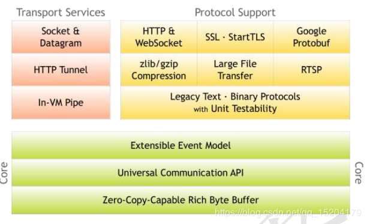
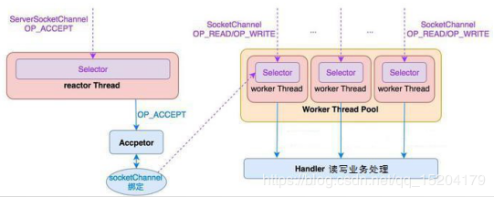
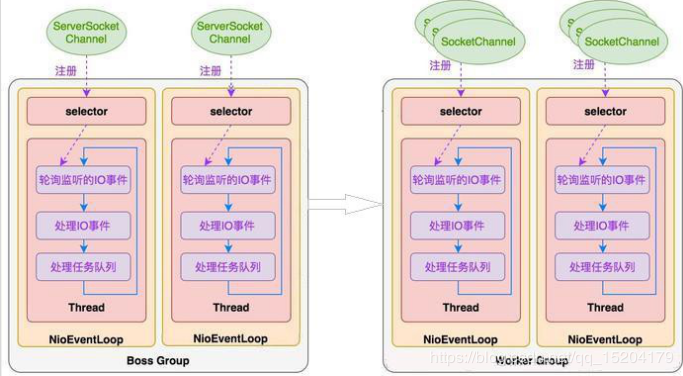

# Netty框架

Netty 是由 JBOSS 提供的一个 Java 开源框架。Netty 提供异步的、基于事件驱动的网络应用程序框架，用以快速开发高性能、高可靠性的网络 IO 程序。

Netty 是一个基于 NIO 的网络编程框架，使用 Netty 可以帮助你快速、简单的开发出一个网络应用，相当于简化和流程化了 NIO 的开发过程。

作为当前最流行的 NIO 框架，Netty 在互联网领域、大数据分布式计算领域、游戏行业、通信行业等获得了广泛的应用，知名的 Elasticsearch 、Dubbo 框架内部都采用了 Netty。

​	

## 整体设计

### 线程模型

#### 单线程模型

服务器端用一个线程通过多路复用搞定所有的 IO 操作（包括连接，读、写等），编码简单，清晰明了，但是如果客户端连接数量较多，将无法支撑，咱们前面的 NIO 案例就属于这种模型。

#### 线程池模型

服务器端采用一个线程专门处理客户端连接请求，采用一个线程池负责 IO 操作。在绝大多数场景下，该模型都能满足使用。

#### **Netty 模型**

比较类似于上面的线程池模型，Netty 抽象出两组线程池，BossGroup 专门负责接收客户端连接，WorkerGroup 专门负责网络读写操作。NioEventLoop 表示一个不断循环执行处理任务的线程，每个 NioEventLoop 都有一个 selector，用于监听绑定在其上的 socket 网络通道。NioEventLoop 内部采用串行化设计，从消息的读取->解码->处理->编码->发送，始终由 IO 线程 NioEventLoop 负责。

- 一个 NioEventLoopGroup 下包含多个 NioEventLoop
- 每个 NioEventLoop 中包含有一个 Selector，一个 taskQueue
- 每个 NioEventLoop 的 Selector 上可以注册监听多个 NioChannel
- 每个 NioChannel 只会绑定在唯一的 NioEventLoop 上
- 每个 NioChannel 都绑定有一个自己的 ChannelPipeline

#### 异步模型

`FUTURE`,``CALLBACK` 和`HANDLER Netty` 的异步模型是建立在 future 和 callback 的之上的。callback 大家都比较熟悉了，这

里重点说说 Future，它的核心思想是：假设一个方法 fun，计算过程可能非常耗时，等待 fun 返回显然不合适。那么可以在调用 fun 的时候，立马返回一个 Future，后续可以通过 Future 去监控方法 fun 的处理过程。

在使用 Netty 进行编程时，拦截操作和转换出入站数据只需要您提供 callback 或利用future 即可。这使得链式操作简单、高效, 并有利于编写可重用的、通用的代码。Netty 框架的目标就是让你的业务逻辑从网络基础应用编码中分离出来、解脱出来。

	

### 核心API

#### ChanneHandler及其实现类

ChannelHandler 接口定义了许多事件处理的方法，我们可以通过重写这些方法去实现具体的业务逻辑。API 关系如下图所示：

我们经常需要自定义一个 Handler 类去继承 ChannelInboundHandlerAdapter，然后通过重写相应方法实现业务逻辑，我们接下来看看一般都需要重写哪些方法：

- public void channelActive(ChannelHandlerContext ctx)，通道就绪事件
- public void channelRead(ChannelHandlerContext ctx, Object msg)，通道读取数据事件
- public void channelReadComplete(ChannelHandlerContext ctx) ，数据读取完毕事件
- public void exceptionCaught(ChannelHandlerContext ctx, Throwable cause)，通道发生异常事件

##### Pipeine 和 ChannePipeline

ChannelPipeline 是一个 Handler 的集合，它负责处理和拦截 inbound 或者 outbound 的事件和操作，相当于一个贯穿 Netty 的链。

- ChannelPipeline addFirst(ChannelHandler... handlers)，把一个业务处理类（handler）添加到链中的第一个位置
- ChannelPipeline addLast(ChannelHandler... handlers)，把一个业务处理类（handler）添加到链中的最后一个位置

##### ChannelHandlerContext

这 是事 件 处理 器 上 下 文对 象 ， Pipeline 链 中 的 实际 处 理 节 点。 每 个 处理 节 点

ChannelHandlerContext  中 包 含 一 个 具 体 的 事 件 处 理 器 ChannelHandler ， 同 时

ChannelHandlerContext 中也绑定了对应的 pipeline 和 Channel 的信息，方便对 ChannelHandler

进行调用。常用方法如下所示：

- ChannelFuture close()，关闭通道
- ChannelOutboundInvoker flush()，刷新
- ChannelFuture writeAndFlush(Object msg) ， 将 数 据 写 到 ChannelPipeline 中 当 前

#### ChannelHandler 的下一个 ChannelHandler 开始处理（出站）

##### ChanneOption

Netty 在创建 Channel 实例后,一般都需要设置 ChannelOption 参数。ChannelOption 是

Socket 的标准参数，而非 Netty 独创的。常用的参数配置有：

##### ChannelOption.SO_BACKLOG

对应 TCP/IP 协议 listen 函数中的 backlog 参数，用来初始化服务器可连接队列大小。服务端处理客户端连接请求是顺序处理的，所以同一时间只能处理一个客户端连接。多个客户端来的时候，服务端将不能处理的客户端连接请求放在队列中等待处理，backlog 参数指定了队列的大小。

##### ChannelOption.SO_KEEPALIVE ，一直保持连接活动状态。

#### ChanneFuture

表示 Channel 中异步 I/O 操作的结果，在 Netty 中所有的 I/O 操作都是异步的，I/O 的调用会直接返回，调用者并不能立刻获得结果，但是可以通过 ChannelFuture 来获取 I/O 操作的处理状态。

常用方法如下所示：

- Channel channel()，返回当前正在进行 IO 操作的通道

ChannelFuture sync()，等待异步操作执行完毕

#### EventLoopGroup和其实现类NioEventLoopGroup

EventLoopGroup 是一组 EventLoop 的抽象，Netty 为了更好的利用多核 CPU 资源，一般会有多个 EventLoop 同时工作，每个 EventLoop 维护着一个 Selector 实例。

EventLoopGroup 提供 next 接口，可以从组里面按照一定规则获取其中一个 EventLoop 来处理任务。在 Netty 服务器端编程中，我们一般都需要提供两个 EventLoopGroup，例如： BossEventLoopGroup 和 WorkerEventLoopGroup。

通常一个服务端口即一个ServerSocketChannel 对应一个Selector 和一个EventLoop 线程。BossEventLoop 负责接收客户端的连接并将 SocketChannel 交给 WorkerEventLoopGroup 来进行 IO 处理，如下图所示：

BossEventLoopGroup 通常是一个单线程的 EventLoop ， EventLoop 维护着一个注册了ServerSocketChannel 的 Selector 实例，BossEventLoop 不断轮询 Selector 将连接事件分离出来，通常是 OP_ACCEPT 事件， 然后将接收到的 SocketChannel 交给 WorkerEventLoopGroup ， WorkerEventLoopGroup 会由 next 选择其中一个 EventLoopGroup 来将这个 SocketChannel 注册到其维护的 Selector 并对其后续的 IO 事件进行处理。

常用方法如下所示：

- public NioEventLoopGroup()，构造方法
- public Future<?> shutdownGracefully()，断开连接，关闭线程

#### ServerBootstrap和Bootstrap

ServerBootstrap 是 Netty 中的服务器端启动助手，通过它可以完成服务器端的各种配置； Bootstrap 是 Netty 中的客户端启动助手，通过它可以完成客户端的各种配置。常用方法如下所示：

- public ServerBootstrap group(EventLoopGroup parentGroup, EventLoopGroup childGroup)， 该方法用于服务器端，用来设置两个 EventLoop
- public B group(EventLoopGroup group) ，该方法用于客户端，用来设置一个 EventLoop
- public B channel(Class<? extends C> channelClass)，该方法用来设置一个服务器端的通道实现
- public <T> B option(ChannelOption<T> option, T value)，用来给 ServerChannel 添加配置public <T> ServerBootstrap childOption(ChannelOption<T> childOption, T value)，用来给接收到的通道添加配置
- public ServerBootstrap childHandler(ChannelHandler childHandler)，该方法用来设置业务处理类（自定义的 handler）
- public ChannelFuture bind(int inetPort) ，该方法用于服务器端，用来设置占用的端口号
- public ChannelFuture connect(String inetHost, int inetPort) ，该方法用于客户端，用来连接服务器端

#### Unpooed类

这是 Netty 提供的一个专门用来操作缓冲区的工具类，常用方法如下所示：

- public static ByteBuf copiedBuffer(CharSequence string, Charset charset)，通过给定的数据和字符编码返回一个 ByteBuf 对象（类似于 NIO 中的 ByteBuffer 对象）