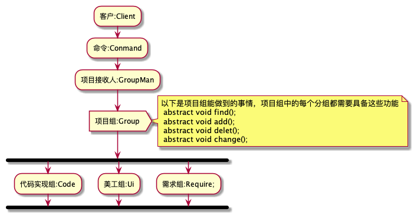
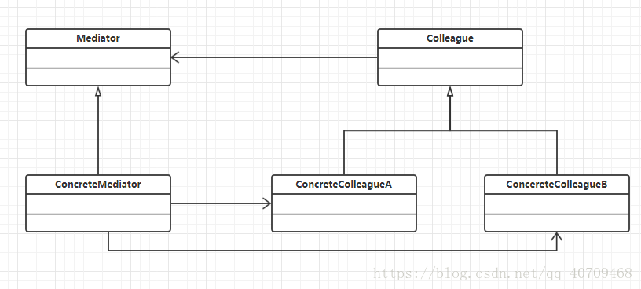

创建型模式

[单例模式（Singleton Pattern）](https://blog.csdn.net/weixx3/article/details/80073206)
[工厂模式（Factory Pattern）](https://blog.csdn.net/weixx3/article/details/80073214)
[抽象工厂模式（Abstract Factory Pattern）](https://blog.csdn.net/weixx3/article/details/80088249)
[建造者模式（Builder Pattern）](https://blog.csdn.net/weixx3/article/details/80113974)
[原型模式（Prototype Pattern）](https://blog.csdn.net/weixx3/article/details/80102328)

结构型模式

[适配器模式（Adapter Pattern）](https://blog.csdn.net/weixx3/article/details/80140766)
[桥接模式（Bridge Pattern）](https://blog.csdn.net/weixx3/article/details/80161454)
[过滤器模式（Filter、Criteria Pattern）](https://blog.csdn.net/weixx3/article/details/80233991)
[组合模式（Composite Pattern）](https://blog.csdn.net/weixx3/article/details/80147046)
[装饰器模式（Decorator Pattern）](https://blog.csdn.net/weixx3/article/details/80153699)
[外观模式（Facade Pattern）](https://blog.csdn.net/weixx3/article/details/80205038)
[享元模式（Flyweight Pattern）](https://blog.csdn.net/weixx3/article/details/80220609)
[代理模式（Proxy Pattern）](https://blog.csdn.net/weixx3/article/details/80114237)

行为型模式

[责任链模式（Chain of Responsibility Pattern）](https://blog.csdn.net/weixx3/article/details/80234006)
[命令模式（Command Pattern）](https://blog.csdn.net/weixx3/article/details/80317511)
[解释器模式（Interpreter Pattern）](https://blog.csdn.net/weixx3/article/details/80331523)
[迭代器模式（Iterator Pattern）](https://blog.csdn.net/weixx3/article/details/80153875)
[中介者模式（Mediator Pattern）](https://blog.csdn.net/weixx3/article/details/80174396)
[备忘录模式（Memento Pattern）](https://blog.csdn.net/weixx3/article/details/80248151)
[观察者模式（Observer Pattern）](https://blog.csdn.net/weixx3/article/details/80202239)
[状态模式（State Pattern）](https://blog.csdn.net/weixx3/article/details/80288267)
[空对象模式（Null Object Pattern）](https://blog.csdn.net/weixx3/article/details/80304813)
[策略模式（Strategy Pattern）](https://blog.csdn.net/weixx3/article/details/80288244)
[模板模式（Template Pattern）](https://blog.csdn.net/weixx3/article/details/80202252)
[访问者模式（Visitor Pattern）](https://blog.csdn.net/weixx3/article/details/80304822)


### 单例模式

#### 懒汉单例模式，需要时加载

**多线程情况下进来会造成创建多个实例，所以要加锁**

```java
public class LazySingleton {
    //使用volatile是防止CPU发生指令重排，造成多线程情况下instance已经被引用赋值了，但是还没开始初始化
    private volatile static LazySingleton instance;
    private LazySingleton(){

    }

    public static LazySingleton getInstance() {
        //外层判断，优化代码速度，每个线程进来如果不为空，直接取出单例对象
        if (instance == null) {
            //加锁，防止多线程情况下，多个线程同时读到install == null这个判断去建立多个对象
            synchronized (LazySingleton.class) {
                if (instance == null) {
                    instance = new LazySingleton();
                    // 字节码层
                    //JIT, CPU
                    //1. 分配空间
                    //2. 引用赋值（2和3的顺序在JIT下可以颠倒）
                    //3. 初始化
                }
            }
        }

        return instance;
    }
}
```

#### 饿汉模式，JVM启动立即创建实例

```java
public class HungrySingleton {
    private static HungrySingleton instance = new HungrySingleton();

    private HungrySingleton() {

    }

    public static HungrySingleton getInstance() {
        return instance;
    }
}
```

#### 内部类的单例模式

```java
/**
 * 这种模式是使用了类加载机制，但内部类被使用到的时候才会进行初始化
 * @author Kermi
 * @version 1.0.0
 * @date 2020-08-18
 */
public class InnerClassSingleton implements Serializable {
    /*
    * ANY-ACCESS-MODIFIER static final long serialVersionUID = 42L;
    * */

    static final long serialVersionUID = 42L;
    private static class InnerClassHolder{
        private static InnerClassSingleton instance = new InnerClassSingleton();
    }

    private InnerClassSingleton(){
        if (InnerClassHolder.instance != null) {
            throw new RuntimeException("单例对象不允许创建多个实例");
        }
    }

    Object readResolve() throws ObjectStreamException{
        return InnerClassSingleton.getInstance();
    }

    public static InnerClassSingleton getInstance() {
        return InnerClassHolder.instance;
    }
}

class InnerClassSingletonTest{
    public static void main(String[] args) throws IOException, ClassNotFoundException {
        InnerClassSingleton instance = InnerClassSingleton.getInstance();

        /*ObjectOutputStream oos = new ObjectOutputStream(new FileOutputStream("testSerialzable"));
        oos.writeObject(instance);
        oos.close();*/

        ObjectInputStream ois = new ObjectInputStream(new FileInputStream("testSerialzable"));
        InnerClassSingleton object =(InnerClassSingleton) ois.readObject();
        System.out.println(instance==object);


        //序列化情况下不会去调用初始化函数

        /*
        * Classes that need to designate a replacement when an instance of it is read from the stream should implement this special method with the exact signature.
        * ANY-ACCESS-MODIFIER Object readResolve() throws ObjectStreamException;
        * */


    }
}
```

### 工厂模式

**模式定义，定义一个用于创建对象的接口，让子类决定实例化哪一个类，Factory Method是的一个类的实例化延迟到子类**

```java
interface Product {
    public void method1();
}

/**
 * 工厂模式
 *
 * @author Kermi
 * @version 1.0.0
 * @date 2020-08-18
 */
public class FactoryMethod {
    public static void main(String[] args) {
        Application application = new ConcreateProductA2();
        Product productA = application.getObject();
        productA.method1();
    }
}

class SimpleFactory {
    public static Product createProduct(String type) {
        if (type.equalsIgnoreCase("0")) {
            return new ProductA1();
        } else if (type.equalsIgnoreCase("1")) {
            return new ProductA2();
        } else {
            return null;
        }
    }
}

class ProductA1 implements Product {
    @Override
    public void method1() {
        System.out.println("ProductA1.method1 executed.");
    }
}

class ProductA2 implements Product {
    @Override
    public void method1() {
        System.out.println("ProductA2.method1 executed.");
    }
}

abstract class Application {
    abstract Product createProduct();

    Product getObject() {
        Product product = createProduct();
        // ...
        return product;
    }
}

class ConcreateProductA1 extends Application {

    @Override
    Product createProduct() {
        return new ProductA1();
    }
}

class ConcreateProductA2 extends Application {

    @Override
    Product createProduct() {
        return new ProductA2();
    }
}

```

>应用场景
>
>1. 单例不知道该使用对象的确切类型的时候
>2. 单例希望为库或框架提供扩展其内部组件的方法时


> 主要优点
>
> 1. 将具体产品和创建者解耦
> 2. 符合单一职责原则
> 3. 符合开闭原则

### 抽象工厂模式(Abstract Factory)

**提供一个创建一系列相关或相互依赖对象的接口，而无需指定他们具体的类**


> 应用场景：
>
> 程序需要处理不同系列的产品，但是你不希望他们依赖于这些产品的具体类时，可以使用抽象工厂


> 优点
>
> 1. 可以确信你从工厂得到的产品是彼此兼容的
> 2. 可以避免具体产品和客户端代码之间的紧密耦合
> 3. 符合单一职责原则
> 4. 符合开闭原则

JDK 中源码的应用

> java.sql.Connection
>
> java.sql.Driver

### 建造者模式

```java
package com.kermi.builder.v2;

/**
 * @author Kermi
 * @version 1.0.0
 * @date 2020-08-20
 */
public class ProductTest2 {
    public static void main(String[] args) {
        Product aaa = Product.builder().companyName("xxx").build();
        System.out.println(aaa);
    }
}

class Product {
    private final String productName;
    private final String companyName;
    private final String part1;
    private final String part2;
    private final String part3;

    public Product(
            String productName, String companyName, String part1, String part2, String part3) {
        this.productName = productName;
        this.companyName = companyName;
        this.part1 = part1;
        this.part2 = part2;
        this.part3 = part3;
    }

    public static Builder builder() {
        return new Builder();
    }

    @Override
    public String toString() {
        return "Product{"
                + "productName='"
                + productName
                + '\''
                + ", companyName='"
                + companyName
                + '\''
                + ", part1='"
                + part1
                + '\''
                + ", part2='"
                + part2
                + '\''
                + ", part3='"
                + part3
                + '\''
                + '}';
    }

    static class Builder {
        private String productName;
        private String companyName;
        private String part1;
        private String part2;
        private String part3;

        public Builder productName(String productName) {
            this.productName = productName;
            return this;
        }

        public Builder companyName(String companyName) {
            this.companyName = companyName;
            return this;
        }

        public Builder part1(String part1) {
            this.part1 = part1;
            return this;
        }

        public Builder part2(String part2) {
            this.part2 = part2;
            return this;
        }

        public Builder part3(String part3) {
            this.part3 = part3;
            return this;
        }

        public Product build() {
            return new Product(
                    this.productName, this.companyName, this.part1, this.part2, this.part3);
        }
    }
}

```

> 应用场景
>
> 1. 需要生成的对象具有复杂的内部结构
> 2. 需要生成的对象内部属性本身相互依赖
> 3. 与不可变对象配合使用

> 优点
>
> 1. 建造者独立，易扩展
> 2. 便于控制细节风险


### 原型模式

**知识点**

1. Cloneable接口/Object类的clone()方法详解
2. 浅拷贝/深拷贝
3. 序列化机制实现深拷贝


> 模式定义
>
> 指原型实例指定创建对象的种类，并且通过拷贝这些原型创建的新对象

```java
package com.kermi.prototype;

import java.io.*;

/**
 * @author Kermi
 * @version 1.0.0
 * @date 2020-08-23
 */
public class PrototypeTest {
    public static void main(String[] args) throws CloneNotSupportedException {
        BaseInfo baseInfo = new BaseInfo("xxx");
        Product product = new Product("part1", "part2", 3, 4, baseInfo);
        System.out.println(product);
        Product clone = product.clone();
        System.out.println(clone);

        product.getBaseInfo().setCompanyName("yyy");
        System.out.println(product);
        System.out.println(clone);
    }
}

class Product implements Cloneable, Serializable {
    static final long serialVersionUID = 42L;

    private String prat1;
    private String prat2;
    private Integer prat3;
    private Integer prat4;
    private Integer prat5;

    private BaseInfo baseInfo;

    public Product() {}

    public Product(String prat1, String prat2, Integer prat3, Integer prat4) {
        this.prat1 = prat1;
        this.prat2 = prat2;
        this.prat3 = prat3;
        this.prat4 = prat4;
    }

    public Product(String prat1, String prat2, Integer prat3, Integer prat4, BaseInfo baseInfo) {
        this.prat1 = prat1;
        this.prat2 = prat2;
        this.prat3 = prat3;
        this.prat4 = prat4;
        this.baseInfo = baseInfo;
    }

    public String getPrat1() {
        return prat1;
    }

    public void setPrat1(String prat1) {
        this.prat1 = prat1;
    }

    public String getPrat2() {
        return prat2;
    }

    public void setPrat2(String prat2) {
        this.prat2 = prat2;
    }

    public Integer getPrat3() {
        return prat3;
    }

    public void setPrat3(Integer prat3) {
        this.prat3 = prat3;
    }

    public Integer getPrat4() {
        return prat4;
    }

    public void setPrat4(Integer prat4) {
        this.prat4 = prat4;
    }

    public Integer getPrat5() {
        return prat5;
    }

    public void setPrat5(Integer prat5) {
        this.prat5 = prat5;
    }

    public BaseInfo getBaseInfo() {
        return baseInfo;
    }

    public void setBaseInfo(BaseInfo baseInfo) {
        this.baseInfo = baseInfo;
    }

    @Override
    protected Product clone() throws CloneNotSupportedException {
        // v1
        /*Product clone = (Product) super.clone();
        BaseInfo clone1 = this.baseInfo.clone();
        clone.setBaseInfo(clone1);
        return clone;*/

        ByteArrayOutputStream byteArrayOutputStream = new ByteArrayOutputStream();

        try (ObjectOutputStream oos = new ObjectOutputStream(byteArrayOutputStream); ) {
            oos.writeObject(this);
        } catch (IOException e) {
            e.printStackTrace();
        }

        ByteArrayInputStream byteArrayInputStream =
                new ByteArrayInputStream(byteArrayOutputStream.toByteArray());

        try (ObjectInputStream ois = new ObjectInputStream(byteArrayInputStream)) {
            Product product = ((Product) ois.readObject());
            return product;
        } catch (IOException e) {
            e.printStackTrace();
        } catch (ClassNotFoundException e) {
            e.printStackTrace();
        }
        return null;
    }

    @Override
    public String toString() {
        return "Product{"
                + "prat1='"
                + prat1
                + '\''
                + ", prat2='"
                + prat2
                + '\''
                + ", prat3="
                + prat3
                + ", prat4="
                + prat4
                + ", prat5="
                + prat5
                + ", baseInfo="
                + baseInfo
                + '}';
    }
}

class BaseInfo implements Cloneable, Serializable {
    static final long serialVersionUID = 42L;

    private String companyName;

    public BaseInfo(String companyName) {
        this.companyName = companyName;
    }

    @Override
    protected BaseInfo clone() throws CloneNotSupportedException {
        return ((BaseInfo) super.clone());
    }

    public String getCompanyName() {
        return companyName;
    }

    public void setCompanyName(String companyName) {
        this.companyName = companyName;
    }

    @Override
    public String toString() {
        return super.hashCode() + "BaseInfo{" + "companyName='" + companyName + '\'' + '}';
    }
}

```

> 应用场景
>
> 但代码不应该依赖于需要复制的对象的具体类时，请使用prototye模式


> 优点
>
> 1. 可以布偶和其他具体类的情况下克隆对象
> 2. 避免重复的初始化代码
> 3. 更方便的构建复杂对象


> spring源码中的应用
>
> 1. org.springframework.beans.factory.support.AbstractBeanDefinition
> 2. java.util.Arrays


### 享元模式

> 模式定义
>
> 运用共享技术有效的支持大量细粒度的对象


> 优点
>
> 如果系统有大量类似的对象，可以节省大量的内存和cpu资源

```java
package com.kermi.designpattern.flyweight;

import java.util.Map;
import java.util.concurrent.ConcurrentHashMap;

/**
 * @author Kermi
 * @version 1.0.0
 * @date 2020-08-23
 */
public class FlywrightTest {

    public static void main(String[] args) {
        TreeNode treeNode1 = new TreeNode(3, 4, TreeFactory.getTree("xxx", "xxxxxxxxxxx"));
        TreeNode treeNode = new TreeNode(5, 4, TreeFactory.getTree("xxx", "xxxxxxxxxxx"));
    }
}

class TreeNode {
    private int x;
    private int y;
    private Tree tree;

    public TreeNode(int x, int y, Tree tree) {
        this.x = x;
        this.y = y;
        this.tree = tree;
    }

    public int getX() {
        return x;
    }

    public void setX(int x) {
        this.x = x;
    }

    public int getY() {
        return y;
    }

    public void setY(int y) {
        this.y = y;
    }

    public Tree getTree() {
        return tree;
    }

    public void setTree(Tree tree) {
        this.tree = tree;
    }
}

class Tree {
    private final String name;
    private final String data;

    public Tree(String name, String data) {
        System.out.println("name:" + name + ",tree created.");
        this.name = name;
        this.data = data;
    }

    public String getName() {
        return name;
    }

    public String getData() {
        return data;
    }

    @Override
    public String toString() {
        return super.hashCode()
                + ",Tree{"
                + "name='"
                + name
                + '\''
                + ", data='"
                + data
                + '\''
                + '}';
    }
}

class TreeFactory {
    private static Map<String, Tree> map = new ConcurrentHashMap<>();

    public static Tree getTree(String name, String data) {
        if (map.containsKey(name)) {
            return map.get(name);
        }
        Tree tree = new Tree(name, data);
        map.put(name, tree);
        return tree;
    }
}

```

### 门面模式（Facade)

> 模式定义
>
> 为子系统中的一组接口提供一个一致的接口，Facade模式定义了一个高层接口，这个接口使得这一子系统更加容易使用


> 应用场景
>
> 1. 当您需要使用复杂子系统的有限但直接的接口时，请使用facade模式
> 2. 当您想要将子系统组织成层时，请使用facade

```java
package com.kermi.facade;

/**
 * @author Kermi
 * @version 1.0.0
 * @date 2020-08-24
 */
public class FacadeTest {
    public static void main(String[] args) {

    }
}

class Facade{
    Subsystem1 subsystem1 = new Subsystem1();
    Subsystem2 subsystem2 = new Subsystem2();
    Subsystem3 subsystem3 = new Subsystem3();

    public void doSomethingFacade(){
        subsystem1.method1();
        subsystem2.method2();
        subsystem3.method3();
    }
}

class Client1{
    Facade facade = new Facade();

    public void doSomething1(){
        facade.doSomethingFacade();
    }
}

class Client2{
    Facade facade = new Facade();

    public void doSomething2(){
        facade.doSomethingFacade();
    }
}

class Subsystem1{
    public void method1(){
        System.out.println("Subsystem1.method1");
    }
}

class Subsystem2{
    public void method2(){
        System.out.println("Subsystem2.method2");
    }
}

class Subsystem3{
    public void method3(){
        System.out.println("Subsystem3.method3");
    }
}

```


> 优点，简化客户端的使用


> spring中源码的应用
>
> RequestFacade


### 适配器模式（Adapter）

> 模式定义
>
> 将一个类的接口转换成客户希望的另一个接口，Adapter模式是的原本由于接口不兼容而不能一起工作的那些类可以一起工作

#### 组合模式

```java
package com.kermi.adapter.v1;

interface Target {
    int output5v();
}

/**
 * 组合模式
 * @author Kermi
 * @version 1.0.0
 * @date 2020-08-24
 */
public class AdapterTest1 {
    public static void main(String[] args) {
        Target adapter = new Adapter(new Adaptee());
        adapter.output5v();
    }
}

class Adaptee {
    public int output220v() {
        return 220;
    }
}

class Adapter implements Target {

    private Adaptee adaptee;

    public Adapter(Adaptee adaptee) {
        this.adaptee = adaptee;
    }

    @Override
    public int output5v() {
        int i = adaptee.output220v();

        System.out.println(String.format("原始电压:%d v -> 输出电压:%d v", i, 5));

        return 5;
    }
}

```

#### 类的适配器模式

```java
package com.kermi.adapter.v2;

/**
 * 类的适配器模式
 * 不符合最小知道原则
 * @author Kermi
 * @version 1.0.0
 * @date 2020-08-24
 */
public class AdapterTest2 {
    public static void main(String[] args) {
        Adapter adapter = new Adapter();
        adapter.output5v();
    }
}

class Adaptee {
    public int output220v() {
        return 220;
    }
}

interface Target{
    int output5v();
}

class Adapter extends Adaptee implements Target{

    @Override
    public int output5v() {
        int i = output220v();

        System.out.println(String.format("原始电压:%d v -> 输出电压:%d v", i, 5));

        return 5;
    }
}
```

> 应用场景
>
> 1. 当你希望使用某些复杂类，但其接口与你其他代码不兼容的时候，请使用适配器模式
> 2. 当你希望重用几个现有的子类，这些子类缺少一些不能添加到超类的公共功能时，请使用该模式


> 优点
>
> 1. 符合单一职责原则
> 2. 符合开闭原则

### 装饰者模式

> 模式定义
>
> 在不改变原有对象的基础上，将功能附加到对象上

```java
package com.kermi.decorator;

/**
 * @author Kermi
 * @version 1.0.0
 * @date 2020-08-24
 */
public class DecoratorTest {
    public static void main(String[] args) {
        Component component = new ConcreateComponent();
        Component component1 = new ConreteDecorator1(component);
        Component component2 = new ConreteDecorator2(component1);
        component2.operation();
    }
}

interface Component{
    void operation();
}

class ConcreateComponent implements Component{

    @Override
    public void operation() {
        System.out.println("operation");
    }
}

abstract class Decorator implements Component{
    Component component;

    public Decorator(Component component) {
        this.component = component;
    }
}

class ConreteDecorator1 extends Decorator{

    public ConreteDecorator1(Component component) {
        super(component);
    }

    @Override
    public void operation() {
        System.out.println("conrete");
        component.operation();
    }
}

class ConreteDecorator2 extends Decorator{

    public ConreteDecorator2(Component component) {
        super(component);
    }

    @Override
    public void operation() {
        System.out.println("conrete2");
        component.operation();
    }
}
```

> 应用场景
>
> 扩展一个类的功能或给一个类添加附加职责


> 优点
>
> 1. 不改变原有对象的情况下给一个对象拓展功能
> 2. 使用不同的组合可以实现不同的效果
> 3. 符合开闭原则


> 经典案例
>
> Servlet Api:
>
> javax.servlet.http.HttpServletRequestWrapper
>
> javax.servlet.http.HttpServletResponseWrapper

### 策略模式（strategy)

> 模式定义
>
> 定义了算法组，分别封装起来，让他们之间可以相互替换，此模式的变化独立于算法的使用者

```java
package com.kermi.strategy.v2;

interface Moveable {
    void move();
}

interface Attackable {
    void attack();
}

/**
 * @author Kermi
 * @version 1.0.0
 * @date 2020-08-24
 */
public class StrategyTest {
    public static void main(String[] args) {
        Zombie zombie = new NormalZombie();
        zombie.display();
        zombie.attack();
        zombie.move();
    }
}

abstract class Zombie {
    Moveable moveable;
    Attackable attackable;

    public Zombie(Moveable moveable, Attackable attackable) {
        this.moveable = moveable;
        this.attackable = attackable;
    }

    public abstract void display();

    abstract void move();

    abstract void attack();

    public Moveable getMoveable() {
        return moveable;
    }

    public void setMoveable(Moveable moveable) {
        this.moveable = moveable;
    }

    public Attackable getAttackable() {
        return attackable;
    }

    public void setAttackable(Attackable attackable) {
        this.attackable = attackable;
    }
}

class StepByStepMove implements Moveable {

    @Override
    public void move() {
        System.out.println("move step by step");
    }
}

class BiteAttack implements Attackable {

    @Override
    public void attack() {
        System.out.println("bite");
    }
}

class HitAttack implements Attackable {

    @Override
    public void attack() {
        System.out.println("hit");
    }
}

class NormalZombie extends Zombie {

    public NormalZombie() {
        super(new StepByStepMove(), new BiteAttack());
    }

    public NormalZombie(Moveable moveable, Attackable attackable) {
        super(moveable, attackable);
    }

    @Override
    public void display() {
        System.out.println("normal");
    }

    @Override
    void move() {
        moveable.move();
    }

    @Override
    void attack() {
        attackable.attack();
    }
}

class FlagZombie extends Zombie {

    public FlagZombie() {
        super(new StepByStepMove(), new BiteAttack());
    }

    public FlagZombie(Moveable moveable, Attackable attackable) {
        super(moveable, attackable);
    }

    @Override
    public void display() {
        System.out.println("flag");
    }

    @Override
    void move() {
        moveable.move();
    }

    @Override
    void attack() {
        attackable.attack();
    }
}

```

### 模板方法模式(Template Method)

> 模式定义
>
> 定义一个操作的算法骨架，而将进一些步骤延迟到子类中，Template Method是的子类可以不改变

```java
package com.kermi.templatemethod;

import sun.misc.Unsafe;

/**
 * @author Kermi
 * @version 1.0.0
 * @date 2020-08-24
 */
public class TemplateMethodTest {
    public static void main(String[] args) {
        AbstactClass abstactClass = new SubClass();
        abstactClass.operation();
    }
}

abstract class AbstactClass{
    public void operation(){
        // open
        System.out.println("---");
        System.out.println("step1");

        System.out.println("step2");
        //sql ...
        //close
        templateMethod();
    }

    abstract protected void templateMethod();

}

class SubClass extends AbstactClass {
    @Override
    protected void templateMethod() {
        System.out.println("subclass executed.");
    }
}

class SubClass1 extends AbstactClass {
    @Override
    protected void templateMethod() {
        System.out.println("subclass1 executed.");
    }
}

```

### 观察者模式（Observer)

> 模式定义
>
> 定义了对象之间的一些依赖，让多个观察者对象同时监听某一个主题对象，当主题对象发生变化时，它的所有依赖着都会受到通知并更新

```java
package com.kermi.observer;

import java.util.ArrayList;
import java.util.List;

/**
 * @author Kermi
 * @version 1.0.0
 * @date 2020-08-25
 */
public class ObserverTest {
    public static void main(String[] args) {
        Subject subject = new Subject();
        subject.addObserver(new Task1());
        subject.addObserver(new Task2());

        subject.notifyObserver("xxxxxx");
    }
}

class Subject{
    private List<Observer> container = new ArrayList<>();

    public void addObserver(Observer observer) {
        container.add(observer);
    }

    public void removeObserver(Observer observer) {
        container.remove(observer);
    }

    public void notifyObserver(Object object) {
        for (Observer item : container) {
            item.update(object);
        }
    }
}

interface Observer{
    void update(Object object);
}

class Task1 implements Observer {
    @Override
    public void update(Object object) {
        System.out.println("receive1:"+object);
    }
}

class Task2 implements Observer {
    @Override
    public void update(Object object) {
        System.out.println("receive2:"+object);
    }
}

```

> 优点
>
> 1. 符合开闭原则
> 2. 可以在运行时简历对象间的关系

### 责任链模式

chain of responsibility

> 应用场景
>
> 一个请求的处理需要多个对象当中的一个或几个协作处理

```java
package com.kermi.chainofresponsibility;

/**
 * @author Kermi
 * @version 1.0.0
 * @date 2020-08-25
 */
public class ChainOfResponsibilityTest {
    public static void main(String[] args) {
        Request build = Request.builder().frequentOk(false).loggedOn(true).build();

        RequestFrequentHandler handler = new RequestFrequentHandler(new LoggingHandler(null));

        if (handler.process(build)) {
            System.out.println("true");
        }else {
            System.out.println("false");
        }
    }
}

class Request {
    private boolean loggedOn;
    private boolean frequentOk;
    private boolean isPermits;
    private boolean containsSernsitiveWords;

    public Request(
            boolean loggedOn,
            boolean frequentOk,
            boolean isPermits,
            boolean containsSernsitiveWords) {
        this.loggedOn = loggedOn;
        this.frequentOk = frequentOk;
        this.isPermits = isPermits;
        this.containsSernsitiveWords = containsSernsitiveWords;
    }

    static RequestBuilder builder(){
        return new RequestBuilder();
    }

    static class RequestBuilder {
        private boolean loggedOn;
        private boolean frequentOk;
        private boolean isPermits;
        private boolean containsSernsitiveWords;

        public RequestBuilder loggedOn(boolean loggedOn) {
            this.loggedOn = loggedOn;
            return this;
        }

        public RequestBuilder frequentOk(boolean frequentOk) {
            this.frequentOk = frequentOk;
            return this;
        }

        public RequestBuilder isPermits(boolean permits) {
            isPermits = permits;
            return this;
        }

        public RequestBuilder containsSernsitiveWords(boolean containsSernsitiveWords) {
            this.containsSernsitiveWords = containsSernsitiveWords;
            return this;
        }

        public Request build() {
            return new Request(
                    this.loggedOn, this.frequentOk, this.isPermits, this.containsSernsitiveWords);
        }
    }

    public boolean isLoggedOn() {
        return loggedOn;
    }

    public boolean isFrequentOk() {
        return frequentOk;
    }

    public boolean isPermits() {
        return isPermits;
    }

    public boolean isContainsSernsitiveWords() {
        return containsSernsitiveWords;
    }
}

abstract class Handler{
    Handler next;

    public Handler(Handler next) {
        this.next = next;
    }

    public Handler getNext() {
        return next;
    }

    public void setNext(Handler next) {
        this.next = next;
    }

    abstract boolean process(Request request);
}

class RequestFrequentHandler extends Handler {
    public RequestFrequentHandler(Handler next) {
        super(next);
    }

    @Override
    boolean process(Request request) {
        System.out.println("frequent");
        if (request.isFrequentOk()){
            Handler next = getNext();
            if (next == null) {
                return true;
            }

            if (!next.process(request)) {
                return false;
            }else {
                return true;
            }
        }
        return false;
    }
}

class LoggingHandler extends Handler {
    public LoggingHandler(Handler next) {
        super(next);
    }

    @Override
    boolean process(Request request) {
        System.out.println("logging");
        if (request.isLoggedOn()){
            Handler next = getNext();
            if (next == null) {
                return true;
            }

            if (!next.process(request)) {
                return false;
            }else {
                return true;
            }
        }
        return false;
    }
}


```


> 优点
>
> 1. 请求的发送者和接收者解耦
> 2. 可以控制执行顺序


### 桥接模式

> **桥梁模式是对象的结构模式。又称为柄体(Handle and Body)模式或接口(Interface)模式。桥梁模式的用意是“将抽象化(Abstraction)与实现化(Implementation)脱耦，使得二者可以独立地变化”。**

> 使用场景
> 考虑这样一个实际的业务功能：发送提示消息。基本上所有带业务流程处理的系统都会有这样的功能，比如OA上有尚未处理完毕的文件，需要发送一条消息提示他。
>
> 从业务上看，消息又分成普通消息、加急消息和特急消息多种，不同的消息类型，业务功能处理是不一样的，比如加急消息是在消息上添加加急，而特急消息除了添加特急外，还会做一条催促的记录，多久不完成会继续催促；从发送消息的手段上看，又有系统内短消息、手机短信息、邮件等。

桥梁模式在Java中的使用

　　桥梁模式在Java应用中的一个非常典型的例子就是JDBC驱动器。JDBC为所有的关系型数据库提供一个通用的界面。一个应用系统动态地选择一个合适的驱动器，然后通过驱动器向数据库引擎发出指令。这个过程就是将抽象角色的行为委派给实现角色的过程。

　　抽象角色可以针对任何数据库引擎发出查询指令，因为抽象角色并不直接与数据库引擎打交道，JDBC驱动器负责这个底层的工作。由于JDBC驱动器的存在，应用系统可以不依赖于数据库引擎的细节而独立地演化；同时数据库引擎也可以独立于应用系统的细节而独立的演化。两个独立的等级结构如下图所示，左边是JDBC API的等级结构，右边是JDBC驱动器的等级结构。应用程序是建立在JDBC API的基础之上的。

![img](data:image/png;base64,iVBORw0KGgoAAAANSUhEUgAAAqgAAAF7CAIAAACRmO4XAAAgAElEQVR4nO2dMajsWJqYNeC9yQz0ZYLxMtN4mUCRe6afmYnWsnm7rDG2GXiKJjEMuGBhYYNmEAzDBA2GihbTGDQ4mkg4cNSUA0+ydrFgGJYVPBwNtUlvVN3RvkDBC+Xg5x5OS6q6UtU9Or/O/338POrW0y3pP+fo/6QjqW7WAwAAgBmy2BsAAAAA64H4AQAADIH4AQAADIH4AQAADIH4AQAADIH4AQAADIH4AQAADIH4AQAADIH4AQAADIH4AQAADIH4AQAADIH4AQAADIH4AQAADIH4AQAADIH4AQAADIH4AQAADIH4AQAADIH4AQAADIH4AQAADIH4AQAADIH4g3M8Hu/59a7rmqYZvHk6nQ6Hw7O/27btPasecDgc6rp+wQ8Uuq678r+XWm/cJgA3wO7pNuaGpmD33CiIPzhFUeR5vnSncntO27ZZlpVl2fd9VVXn87nv+7qu3ZtXyPO8LEsxa9u2u92unaIsy5k16LZcrtA0TZ7np9PpygJFUQzK6Ol0yrJst9u91GaAWdg9haqqbtin2D03CuIPjuyNS39rv98XRXE6naSyyJ6f53lRFH3f73a7LMue3cPd8v1ThSqmmCxSk6csx+Mxy7L9fu+/2bZtVVWDJSXrmbiNnERKkr9SeWe8UoCl2Nw9Jzcmz/PJI4zBBw5g99wiiD84t1WW/qkuuMoitUbOD56Vpf8J8tqvUD6X3pfNHpeh8Zt5no/3czn1Ga/oehG5kkie5+4z5VTphs8BGGBt95SDlQFN08jhxeR8w7On7+yemwPxB+fZKiAlY/z+breTXTHLssPh4CbxZCZtcBVt8vTCrfpwONxWWfwSUNd1nud1XU9OSD47G3mP+P0mkqsD/oHFnOupAJNY2z2Px+Pk4cKl+QbHlRsI2D03B+IPjhwOl5cZ71f7/X6/31dPyMH4breTJff7fZ7new+ZWpQdrG1bt69mWSZrl0N+2bfdSt2LK5XFf0c+4eYL/PPF33XdfsRut5MXeZ6711JxLk1RAjwLu+fpdJJ9auby7J4JgPiDM3Pez6dpGldcpC74+5IUi/GPrjbJCUTbtm420s3muT1wv9/LSYlUovHM/LiyTM7gyVrm7NhyAXKyMI3XLiV1UFwGifuEeNwALMDuKUchk2le+kV2z62D+INzQ2VxDM4MmqY5n8/y2v/8S/fRXLmIuN/v3VnIpVXLwbsUFNkMdyIyOB9yNydfQdY4LiWyijmHDuNiB3AnxndPWdHknIe8P38Kgd1zQyD+sEghuH6D636/Hx/R930vk4dSEeTKnHxUVVXuJOD6/LmrLFVVyXyjX1n8vXT8CYPd2C1/Op2uP6QrF/kmcSVykslGuLJJAHdicPf0kUm4S/vU0kMids8NgfjDIk/05lP33w4u9fmH5F3XFUUhV938UwE5hJf/lXeuzJ/3T9cv8zyv61q2xK00927nkdeD6bjBbiyTeP3XH1y+xGShLMtSKuPN1eFSZWmahhuI4AZs7p6Cu9YQWvzsngpB/GE5n89FUcjVsksMzjlOp1PhfSeGTLvJa7cLyTXF/mmmbvwFOOfzWc4h3Cy6nBO4lYqAJ+/7FaToyGv//GNwEjP/aV2pI4NTmTGTtw5duYgo9zTl3EAEyzG7e0pecrPCeJ9yu9tY/OyeaYD4I3N9MrDrOtn9zuez/+WgdV3LPimn0f6vnE4nufJXPD3UK+8PlnxWwK6yuMuWg3Mgdy4y535gecZJbgh69ox/sqxIKZSVTi7ADUTw4iS5ezrruxXNF3/P7pkEiD8OTdO4r+ocV5bC+9o7/7q4W1KewJG6M57Wk/3fVSV5U5Z0K/Iry6S5/U+uqsrdiiy3H1dVdelcZBL3rNEc8U8i622apixLvgkcgpLw7im3I7irD1f2x0VT/eye2wLxvzyn02nymNc/OpYLeP1TZRnsKu4auT+RWBSFX0TyPJfZwsndbPANYnJacOm2u8nTgvzpquGAyVI4/9tJLxWaZx8KcKc4428IAZiP8d1zsKvuv36JYXCNY7742T23BeIPQl3X14uLcDgc9hcecuufdiG5aij3/vg7rbt4dmUz3K4r3+o1OMkQ2qmvBmuf7lUel4PxKUXx3Hd0+F8tMin+tm0nq5jD/wqU/vKTxwBzYPd0SIKX7mqcuZexe24OxB8ZueA3eYB8OBzk0aD86RZffzF3c9CVD3d1pHi6CXlmZZFK1E99U4f7qrJBlbx0DU8qkTtlmRS//I2vS1m4WubekZulKS4QmuR3z8n9cbB512H33CKIPzIym3dlgePxmD/dNePm96SsuDnJSxNr8otyanLpz4dMVhb5CtLJz7x+u9OAgfX7C4XmSvUZf4L/vn+1EuDFSXv37O8WP7vnRkH8ayN3/MphuBSIS/uwPPOT57kcrXddJ98ZIm/KHiU7WJ7nVVW5p4bkBFrus5Vni92FRilP4zk9v7LIFcdL1Wp+Zdk/3TA8eFMeSvbnJ2UbBo8eSb750+3HYyR3Ob/hfiJ4EezsnsL4ezXcw43Xxc/uuWkQfwSOx6N8I6YUhfE+LAtIAfLfl5OD3W7n3wrn7gny7y2SyUB5069cuff14P5FQb+yyIThpY2fU1nkzuGyLMdPMMvfMctGFEXhL7x/+msf12/6kxW5+nJlSYCZJL97+hSjb92RQx9J/9JBD7vn1kH80fCf3vGRZ94Gyuy6TmrE5JH++XweT6kdDofz+Ty4tpePvqC0bdvB7n19fq9t27Isr8zg7Xa73W43Vv7gQ3z8hU+nU1mWdV3PvzF4//QXTQBeilR3zwGX0izLcvLwgt0zDRA/AACAIRA/AACAIRA/AACAIRA/AACAIRA/AACAIRA/AACAIRA/AACAIRA/AACAIRA/AACAIRA/AACAIRA/AACAIRA/AACAIRA/AACAIRA/AACAIdYT/6tXr8Z/hR0AVuPb3/527E0AMM3HH79azblXWE/8WcbsAkBMsiz76h/fEwQRK5R4EPEDWAHxE0TcUOJBxA9gBcRPEHFDiQcRP4AVED9BxA0lHkT8AFZA/AQRN5R4EPEDWAHxE0TcUOJBxA9gBcRPEHFDiQcRP4AVED9BxA0lHkT8AFZA/AQRN5R4EPEDWAHxE0TcUOJBxA9gBcRPEHFDiQcRP4AVED9BxA0lHkT8AFZA/AQRN5R4EPEDWAHxE0TcUOJBxA9gBcRPEHFDiQcRP4AVED9BxA0lHkT8AFZA/AQRN5R4EPEDWAHxE0TcUOJBxA9gBcRPEHFDiQcRP4AVED9BxA0lHkT8AFZA/AQRN5R4EPEDWAHxE0TcUOJBxA9gBcRPEHFDiQcRP4AVED9BxA0lHkT8AFZA/AQRN5R4EPEDWAHxE0TcUOJBxA9gBcRPEHFDiQcRP4AVED9BxA0lHkT8AFZA/AQRN5R4EPGH4tWrVxlc4NWrV7H7JxT0+2384IcfRy/KBBE6Mh0eRPyhsJbvIhJunIRTC0rGbARhIJTUB8QfCmv5LiLhxkk4taAgfsJCKKkPiD8U1vJdRMKNk3BqQUH8hIVQUh8Qfyis5buIhBsn4dSCgvgJC6GkPiD+UFjLdxEJN07CqQUlGfH/4Icfr3EzZEKYuq8z01EfEH8orOW7iIQbJ+HUgpKlIn4GwFKS6foNDQ/EH4o7822aZu/RdZ17Xde1LHM8Hv1ljsej+/Xz+bzb7cqy9Je/xOFwKMvS/bj/Oufzefx+0zT3ZJfwYBin5nel30dXKMty5pLPIiPHfZqMmTu7LwTJVP+Ex3Ygkun6DQ0PxB+KF8k3z/O2beX1fr+vqqrv+7qui6Louq7v+6qq5M22bfM8l4J+Op2KohBhN01TFMX1tRRFkef55HqPx2Oe5879spb780p4MEymlud513Xn87koiv1+/+yH5Hn+7OHafIqicGOgLMsX6cEXJ5nqn/DYDkQyXb+h4YH4QxFC/M4Zu91ut9sN3iyKQk7cy7L0teGfzU8i4j+dTpPr9V2F+J/lkvjlxfl89g+k1sE/sMvzHPFbqOwbIpmu39DwQPyhCCp+ORHvR+Kv63qpWtq23e/38ruT60X8i7gu/v6pPeu63u/3cvTWNM3g8k1VVe44zF3Q6bpOXvs9Vde1dHr/NKsvM/nn89nN8LsDO5kK8o9CZHm3rrquq6rquk4+1k9BNnhwAUKuYpxOp7qu3X/Jx7qrCX5G8npycCZT/a+P7cmJnMGbg50xHNJxh8NBZg3vZ052Y5Lp+vuHx2og/lAEFb8T8H6/lwv5ckW/X+7m/X4v7vcnBtx6m6Zhqn8RM8V/Op2kbXe7nbyQzu26ThrZ9XvXdW6CRy4WiKfl9eFwOBwO7s22bWXiZ7fbVVUl6y3LsigKObxwb8pvtW0rqxNty2u5w8BfqWxP27a73c4NQplYkjW6993HygUpPyNZpizLySmoZKr/lbE904uHw8GffrvCnTeCuI54dlJwPje4P5muv3N4rAniD8Vq4q+qqm3b4/FYlmXTNEvdLPu8m0Jw6xV/VFXln58h/meZKf6+79u2zbJMavfgJNjv977vj8ejSPR4PLqTs91u5+qpmzzovSs+fd+LP6QfReSHw8GJXz5qcOeB3I7Qe319Pp/dB1ZV5W4XcEkNpp2ctORowy3slrF5xn/b2fAVZILn5l/vX9T3PkszTabr7xkeK4P4Q7Ga+Afz/0vdLEV/v9/7Z/YD8TgQ/7MsEv+lxhy3v8zV73Y7X6vieDmhd0V8fP+gnMHL8v5Kq6qS6SLfyu5//SXrupajB1mXW5FspExauF8vnxh87OSI8tstelEOV9lnurDrOrkb15/vqarqeDzWdS3HbfK+PIkj7/jn/afTSU4GBkvKhE1VVdIjx+NR5mZkxsjfJLlf2H9z/Jn+wvM1f8n9yXT9zcNjfRB/KIKKX67K9xeOBgZF9soFPJnkd+vyyzfiv41nxe/adpH45XzdP0WTqj3+3Unxd10nSnYrdTP5g18Zi99/MMQNPPcJ/uR/700YPJvRgGSq/3gATO6AV07WffH33uM8/dfP0f2dV5CHeN1vuQMCqRJt2/oL9KMzfrneP/gvf77Hn85xnyP3bcxMcPLNZLr+tuERBcQfinDi77rOFf3JowG/pst12UufL+VAXvu/hfhv5rr43ZXvfqH4j8djlmX+OZM/vS9nhPJ6Uvz90yOC/tGhq/LyK+KJsfjldgG3Ujf25HqQnES6uSL/iRL/tkHL4m+aZvzFCXL+PdkUY/G7H6+L31/S3/H9KuEzOdV/Op1kMkB+lPkG91+Tqx4/MCzXH+e82SfU9bcNjygg/lDck69fLuW1yF7uonKV183fupv73C/KXKvMzV5ai1wakOrQdZ3MzcpV5DzPx1VJzjzkv/gCn0uMU6vrWhpNuk/ebJpGGnNwq7ycP002svtuBsegl+Wir0z7u7osI6dpGrlMICsVFcnIcdPyh8NBNlXM7ZaUZwFkjO12O9k2eVMEIEvKtsn7sqQMoSsZDdotelEOV9kXuf8e8ctZu+AfgU0ad1Ac2rZ13xzln+WPf1eOKtyKBpuxyPp9Ql1/8/BYH8QfipvzlSrZe7d03czKz4vPJ+HBEC61S3d639PLM+8eHy8pl5zdj/4k8G2blEz1vzQA5rv/HvH7B5HumstM8buvBfP/yz/j75+GwWCz/Ys7S63fJ9T19wyPlUH8obgnX7lt58oU/dZJeDAknNoAd4Hfn2C4mWSq/5UBMNP9M8XvLti7/5Xr8e6hDP8q4Rzxl2Xpjthkeklwi/mfKfeL9E83JMqbN1i/T6jr7xwea4L4Q2Et30Uk3DgJpxaUZKr/9QEweT/m6XQSW3ddJzPn7l59uXzjvop7cE4vC/taPZ/P8uVL7k2Z82+aZnCjvluRm6pxvytvuisFsl7/MwX5Tif3sV3XjSeQJt8ckEzX3z88VgPxh8JavotIuHESTi0oyVR/BsBSkun6DQ0PxB8Ka/kuIuHGSTi1oCRT/RkAS0mm6zc0PBB/KKzlu4iEGyfh1IKSTPVnACwlma7f0PBA/KGwlu8iEm6chFMLSjLVnwGwlGS6fkPDA/GHwlq+i0i4cRJOLSjJVH8GwFKS6foNDQ/EHwpr+S4i4cZJOLWgJFP9GQBLSabrNzQ8EH8oHh4eMrjAw8ND7P4JBf1+Gw8PD9GLsvLKfjqd2idm/so9f/1vNTLEvzqIPxTW8l3EZOO8e/fuk08+WX9jXhb6/TY2V/3//C/+8vTFV2tWdvnrCYfDQb5u2X+gf5LD4ZBl2fyjhFhsruvvCSX1AfGHwlq+ixg3zrt3716/fv327dso2/OC0O+3sbnq/9d/87d/XPzrsfuDDgD3J5TkD208u/z8r2SOyOa6/p5QUh8Qfyis5buIQeMkY/2efr+VLVb/SfevI/7+6c8tyvy/fLXf+Xx2pvffF7quc5cJ5LV/WCB/tNf/sW1bmVQIPWewxa6/OZTUB8QfCmv5LsJvnJSs39Pvt7LR6j92/2rilz+ZWNe1+zOP8rcT5bq+e98tL3/0S77MXyYMZMnBX1/sn74nWP50p/vjjeGS2mjX3xZK6gPiD4W1fBfhGicx6/f0+61st/oP3L+y+Pu+b9s2yzKxuP/d+3JPgP/rTdPIX9w5nU7ub4CVZem+b9+/dUD+5Le8DnqT4Ha7/oZQUh8Qfyis5bsIaZz0rN/T77ey6ervuz+K+CfPyCffz/P8fD77f2xXZgsEeT34/NBsuuuXhpL6gPhDYS3fRWRZlqT1e/r9VrZe/Z3717zG767Bzxe//A1l/w/y5nneesjfCewRf5hQUh8Qfyis5buILMuStH5Pv99KAtVf3L/+Xf2LxN80TZ7nVVW5d4qicFP9/pUCxB8ilNQHxB8Ka/kuIsuyn/3sZ+7HTz/9dPJLXT799NPNLUO/38alxqx+8StXNKtf/GoTywRqIpH94XCoqqooCrnZ/nQ6icv9k/Ur7/d9n+e5fz//4XDI87xpGncHQN/3bdsWRVFV1QpfA5Ah/tVB/KGwlu8isix7/fr1u3fvYm/Iy0O/30YC1f/0xVdBz/gnv7nPf3Mg/sn3+773n/ETzudz0zT+NwL5k/9BkvFIoOvnh5L6gPhDYS3fRWRZ9vbt2yTdT7/fxtarv1j/r//mbxkAS9l61y8KJcMD8YfCWr6LkMZJ0v30+21suvo76+up7Bti012/NJQMD8QfCmv5LsI1Tnrup99vY7vV37e+nsq+Ibbb9TeEkuGB+ENhLd9F+I2TmPvp99vYaPUfWF9PZd8QG+3620LJ8ED8obCW7yIGjZOS++n329hi9R9bX09l3xBb7PqbQ8nwQPyhsJbvIsaNk4z76ffb2Fz1n7T+V//4/uHhYfIZP7jEw8ND9N5cLTId9QHxh8JavouYbJy3b9++efNm/Y15Wej328i2Jv5/9x9+Mra+nsq+ITbX9feEkuGB+ENhLd9FJNw4CacWlGSqPwNgKcl0/YaGB+IPhbV8F5Fw4yScWlCSqf4MgKUk0/UbGh6IPxTW8l1Ewo2TcGpBSab6MwCWkkzXb2h4IP5QWMt3EQk3TsKpBSWZ6s8AWEoyXb+h4YH4Q8HNvVd4eHiI3T+hoN9vI5lbuzNjhe5+MsS/Oog/FNbyXUTCjZNwakFJpvozAJaSTNdvaHgg/lBYy3cRCTdOwqkFJZnqzwBYSjJdv6HhgfhDYS3fRSTcOAmnFpRkqj8DYCnJdP2GhgfiD4W1fBeRcOMknFpQkqn+DIClJNP1GxoeiD8U1vJdRMKNk3BqQUmm+jMAlpJM129oeCD+UFjLdxEJN07CqQUlmerPAFhKMl2/oeGB+ENhLd9FJNw4CacWlGSqPwNgKcl0/YaGB+IPhbV8F5Fw4yScWlCSqf4MgKUk0/UbGh6IPxTW8l1Ewo2TcGpBSab6MwCWkkzXb2h4IP5QWMt3EQk3TsKpBSWZ6s8AWEoyXb+h4YH4Q2Et30Uk3DgJpxaUZKo/A2ApyXT9hoYH4g+FtXwXkXDjJJxaUJKp/gyApSTT9RsaHog/FNbyXUTCjZNwakFJpvozAJaSTNdvaHgg/lBYy3cRCTdOwqkFJZnqzwBYSjJdv6HhgfhDYS3fRSTcOAmnFpRkqj8DYCnJdP2GhgfiD4W1fBeRcOMknFpQkqn+DIClJNP1GxoeiD8U1vJdRMKNk3BqQUmm+n/wwWOmkm9961uxN2GaDz54jN5rq0Wmoz4g/lBYy3cRCTdOwqkFJUtF/DrjT/70z370ox99/OpfRN8S46GkPiD+UFjLdxEJN07CqQUF8YeL//4/Pv/+97///v37jz766L/81/8WfXssh5L6gPhDYS3fRSTcOAmnFhTEHy6+9+GHx+Ox7/u3b99+73vf+/t/+Cr6JpkNJfUB8YfCWr6LSLhxEk4tKIg/UPzHn/2nn/70p66df/7zn/+bf/vvo2+V2VBSHxB/KB4fld7jo4HHx8fY/RMK+v02TN3htVr8n//7dx9++OGXX37pxuf79++/+93v/s//9b+jb5vNyHR4EPGnz7t3716/fp1l2evXr9+/fx97cyAaGWfVxuKff/TRb37zm8Ew+O1vf/vP/uiPom+bzVDiQcSfOGL9t2/fZln2+eefv3nzJvYWQTQQv6n4z/u/+vGPfzw5En7yk5/8+V/8ZfQtNBhKPIj4U8ZZv39q/88+++yTTz6JvV0QB8RvJ/7+H776p3/4h7///e8nR8KXX375ne985+/+3yn6dloLJR5E/MniW7/32v+TTz757LPP4m0XRAPx24k/+dM/++Uvf3llMPz617/msf71Q4kHEX+aDKzff73937x58/nnn8fYLogJ4jcS7sH96+OBx/rXDyUeRPwJMrZ+//X2f//+/evXr3/3u9+tvmkQE8RvJNyD+9fhsf71Q4kHEX9qTFq/7/tPP/10sNirV6+++OKL1TYMooP4LcTgwf3r8Fj/yqHEg4g/Nd68eTO2/iRffPHF69evQ28P6AHxJx/jB/evw2P9K4cSDyJ+ACsg/uRj8sH96/BY/5qhxIOIH8AKiD/tuPLg/nV4rH+1UOJBxG+FwTV+MAjiTzs+uOPror/5zW9G334LocSDiN8KtD8gfstB72sIJXUY8VuB9gdKv+Wg9zWEkjqM+K1A+wOl33LQ+xpCSR1G/Fag/YHSbznofQ2hpA4jfivQ/kDptxz0voZQUocRvxVof6D0Ww56X0MoqcOI3wq0P1D6LQe9ryGU1GHEbwWe4wdKv+X443/5r6JvA6HEg4gfwAqInyDihhIPIn4AKyB+gogbSjyI+AGsgPgJIm4o8SDitwLX+AHxWw6u8WsIJR5E/Fag/QHxWw56X0MoqcOI3wq0P1D6LQe9ryGU1GHEbwXaHyj9loPe1xBK6jDitwLtD5T+e6L6xa8m/5J99YtfbWKZb3zjG6q2Z9EyH/3gh9EHwItEpqMOI34r0P6QIf7l4TuJiBXJ9IKSOoz4rUD7A+K/rVJH3wYimVBShxG/FWh/wGG3Vero20AkE0rqMOK3As/xAw67rVJH3wYimVDiQcQPYAUcdluljr4NBNf4XxbED2AFHHZbpY6+DUQyvaDEg4gfwArJVM+VK3X0bSCS6QUlHkT8VuAaPyRTPVeu1NG3gUimF5R4EPFbgfaHZKrnmpHM1eVNRzJDV0kdRvxWoP0hmepJWItkhq6SOoz4rUD7QzLVk7AWyQxdJXUY8VuB9odkqidhLZIZukrqMOK3Au0PyVTPNYNr/BoimV5QUocRvxVof0D8t1Xq6NtAJBNK6jDitwLtDzjstkodfRuIZEJJHUb8VuA5fsBht1Xq6NtAJBNKPIj4AayAw26r1NG3geAa/8uC+AGsgMNuq9TRt4FIpheUeBDxA1ghmeq5cqWOvg1EMr2gxIOI3wpc44dkqufKlTr6NhDJ9IISDyJ+K9D+kEz1XDOSubq86Uhm6Cqpw4jfCrQ/JFM9CWuRzNBVUocRvxVof0imehLWIpmhq6QOI34r0P6QTPUkrEUyQ1dJHUb8VqD9IZnquWZwjV9DJNMLSuow4rcC7Q+I/7ZKHX0biGRCSR1G/Fag/QGH3Vapo28DkUwoqcOIPxSvXr3K4AKvXr2K3T8WybbgsB/88OPYw1MvP/jhx/SCBm7uiEyHBxF/KKzluwgaJwrZFsTP2LjCaj1IL1zn5o5Q0rCIPxTW8l0EjRMFxL91EL8SEP/sNelIeDWs5bsIGicKiH/rIH4lIP7Za9KR8GpYy3cRNE4UEP/WQfxKQPyz16Qj4dV42XwPh8MLftr5fF669qW/ch1rg0EJiH/rIH4lIP7Za9KR8Gq8bL77/b4oCvdj13Xuddu2u91uP0VZllVV+Z9zPB53u12e503TDH6rLMvT6TS59rZt8zx3/3v/QYC1waAExL91EL8SEP/sNelIeDXuzPdwOByPx/aJpmnyPJfXdV3nee7s27atf0yQ57l7XRTFfr+X18fjUQTvFi6Komkat4o8z/3jibIs/cMC+Sghz/PB8cRSrA0GJWxa/DKA3bCv63q/3x+Px/ubZb/fy9HwYF1C0zRzPqSqKrevhSOu+I/HY1mWZVm+SLML48afRFuPIP7Za9KR8Grcme9+v6+qqr2Mk/RM8Y8XLoqibdvJX3Q/jtdb17X/W7dhbTAoYdPi7/s+z3M3nvM894f9nciBr/9OURRyfW2325Vl+ewnlGW52+1eansuEVH8x+OxKIqu67quK4ri0uzgDYwbfxJVPYL4Z69JR8Krcb/4fWf7h9jH43Ew1S8Kdyfu7rUv/tPpJDMHRVHUdS0vBmf8/gbIj3JeJcfO7tj8/t3J2mBQQgLil4p/Op2yLAstfneAK5fGXmpd9xBR/FIu5HXTNHPUO5P54tfTI4h/9pp0JLwaLyL+3W4njpdjbfmvoij8vW6m+A+Hg9wN4BYeiN9fRf/1CQDZmLquq6p6kbv8rA0GJSQgfnc8WhSFiN8Nzq7r5LUbxnLY2ratf5lCeVkAAA0mSURBVNzcNI1cMvBvmL0u/qqqiqKQ2eaqqk6nk3/dwa3Xqci9I8fog4P4uq7runb7kfyvXDuTI3INPTjuBf8uH9dclzb+fD7Lfw0mBqTxB1cKJsUvLewvGa5HZKvcps7pEcQ/e006El6NFxG/3IvX931d1+48O89zf39YNNVfFIWbL5VDAcdut/OH+GBXlCMG9+OdE33WBoMSti5+Gb3n81lmcWVAHg4Hd/632+3qupaFy7J0B7tuLyjLUq5VDcbzdfHLPS5d18li8oFytdv9+mBfk0MTd9QuBxnn81leHw4HN1vetq1oTDY+y7Irl9JiiX/QPufz2Z1gjDdesnPnIa5YyVyjtNX1o66qqna7nXSTq3shemSwVTKK5vQI4p+9Jh0Jr8ad+bpqlee5PE0nR9wDzfdP197cj1fELx8iA7qqKrl5UIa47KW+zuX4oHqiLMuiKOS1O9m6GWuDQQlbF78MQpln3nu3qYrO+74f7Aju1F+qvFzekncG+9Ec8buPdfuUP/s1Psh2d+C63/WPS2Q+z712W3v9kFqJ+CU7aZ/xxh8OBzldlgMdaRbx7rgdxh8uZWqyGV+8R/xrFv5mPNsjiH/2mnQkvBp35usOP92pSZ7nMtk+mHqSMepueR2/9peUHeZ8PvvzWvL54/sGBmvxT5vunPC3NhiUkID4xZcD8cvd5qfTyb/7pKoquSfA7S/+r9wj/skz8rFm5HCkaRonOTlilhNT/4Ld/usP614hlvhPp9PgSSL34+TGy6mCX4Lkx8mkBo0vP5ZPuAYP0SOyha5HfPFf7xHEP3tNOhJejfvFL252x6RSvyb3MX98XznjL8vS1buu69x+JUNfphZkSXeJwTG4KnYn1gaDEhIQ//F4zLJMLt77+4LMY40fM5OzfDkBvVn8/n40XzOyav92nMEUt0O/+AeJH4/HK44czM9Ls8gso1vGP3MYi3+yNUL0iLuWPwDxv9yadCS8GveLf/ym3MAyeNO/6aa/LH65e2XyVH7yYGI8r4D4t04C4nfXvAbjVs7v3Y9t27rh6sa8nLbKm/60f39V/P7Zbb9EM733GILgT+8fj0f/vFO/+P2N92+bGG+8fwohzXI8HuWbSORNOetwy1+5jtD3vVsyRI/4RzBd1/kXXxD/C61JR8KrcU++cpdpO0LOeNy9M33fn06nwXM1Mo6d493Ql5Oh6+J3BxDjZ3UQfwJsWvxyL4v8K/f3yY/yv3IjmFt4cM+X85BMQcvFAjfs5bRPJqXleFd8IIu5b7SUw2759ir/sFjuEpdTycE+Mrhhtu97+UDZDLd22Zi99zxC9B6c7IXdE+4seXLj5aDK3W3njgPk9iDJ3b/UOGh8+QRpZ3elJlyPjLdqTo8g/tlr0pHwatyTrxQFmc+8hJwuyKMs/u+6W52LosiybPzkjNzaKtVHhrurRGVZdl3XNI0/ISmlVu4wuDmjAdYGgxI2Lf4ryATA5NfJXfkW6jtvUJ3DJW3cfIvMhr6y91LLz38g6AW/I8hxqUeWrgvxz16TjoRX455854/C63+8ZzwD1nXds1+3ObnAy35dhrXBoIQkxS/fYL3oS6W6rpOzzBf86tl12JD40wbxz16TjoRXw1q+i6BxopCk+E2B+JWA+GevSUfCq2Et30XQOFFA/FsH8SsB8c9ek46EV8NavougcaKA+LcO4lcC4p+9Jh0Jr4a1fBdB40QB8W8dxK8ExD97TToSXg1r+S6CxokC4t86iF8JiH/2mnQkvBrW8l0EjRMFxL91EL8SEP/sNelIeDWs5bsIGicKiH/rIH4lIP7Za9KR8Go8PDxkcIGHh4fY/WORbAviZ8e5wsPDA72ggZs7ItPhQcQfCmv5LoLGiUK2BfEzNq6wWg/SC9e5uSOUNCziD4W1fBdB40QB8W8dxK8ExD97TToSXg1r+S6CxokC4t86iF8JiH/2mnQkvBrW8l0EjRMFxL91EL8SEP/sNelIeDWs5bsIGicKiH/rIH4lIP7Za9KR8GpYy3cRNE4UEP/WQfxKQPyz16Qj4dWwlu8iaJwoIP6tg/iVgPhnr0lHwqthLd9F0DhRQPxbB/ErAfHPXpOOhFfDWr6LoHGigPi3DuJXAuKfvSYdCa+GtXwXQeNEAfFvHcSvBMQ/e006El4Na/kugsaJAuLfOohfCYh/9pp0JLwa1vJdBI0TBcS/dRC/EhD/7DXpSHg1rOW7CBonCoh/6yB+JSD+2WvSkfBqWMt3ETROFBD/1kH8SkD8s9ekI+HVsJbvImicKCD+rYP4lYD4Z69JR8KrYS3fRdA4UUD8WwfxKwHxz16TjoRXw1q+i6BxooD4tw7iVwLin70mHQmvhrV8F0HjRAHxbx3ErwTEP3tNOhJeDWv5LoLGiQLi3zqIXwmIf/aadCS8GtbyXQSNEwXEv3UQvxIQ/+w16Uh4NazluwgaJwqIf+sgfiUg/tlr0pHwajw8PGRwgYeHh9j9Y5FsC+Jnx7nCw8MDvaCBmzsi0+FBxB8Ka/kugsaJQrYF8TM2rrBaD9IL17m5I5Q0LOIPhbV8F0HjRAHxbx3ErwTEP3tNOhJeDWv5LoLGiQLi3zqIXwmIf/aadCS8GtbyXQSNEwXEv3UQvxIQ/+w16Uh4NazluwgaJwqIf+sgfiUg/tlr0pHwaljLdxE0ThQQ/9ZB/EpA/LPXpCPh1bCW7yJonCgg/q2D+JWA+GevSUfCq2Et30XQOFFA/FsH8SsB8c9ek46EV8NavougcaKA+LcO4lcC4p+9Jh0Jr4a1fBdB40QB8W8dxK8ExD97TToSXg1r+S6CxokC4t86iF8JiH/2mnQkvBrW8l0EjRMFxL91EL8SEP/sNelIeDWs5bsIGicKiH/rIH4lIP7Za9KR8GpYy3cRNE4UEP/WQfxKQPyz16Qj4dWwlu8iaJwoIP6tg/iVgPhnr0lHwqthLd9F0DhRQPxbB/ErAfHPXpOOhFfDWr6LoHGigPi3DuJXAuKfvSYdCa+GtXwXQeNEAfFvHcSvBMQ/e006El4Na/kugsaJAuLfOohfCYh/9pp0JLwa1vJdBI0TBcS/dRC/EhD/7DXpSHg1rOW7CBonCoh/6yB+JSD+2WvSkfBqPD4+ZnCBx8fH2P1jkWwL4v/gA3aci3zwwSO9oIGbOyLT4UHED2CFbAviJ4iEQ4kHET+AFRA/QcQNJR5E/ABWQPwEETeUeBDxA1gB8RNE3FDiQcQPYAXETxBxQ4kHET+AFRA/QcQNJR5E/ABWQPwEETeUeBDxA1gB8RNE3FDiQcQPYAXETxBxQ4kHET+AFRA/QcQNJR5E/ABWQPwEETeUeBDxA1gB8RNE3FDiQcQPYAXETxBxQ4kHET+AFRA/QcQNJR5E/ABWQPwEETeUeBDxA1gB8RNE3FDiQcQPYAXETxBxQ4kHET+AFRA/QcQNJR5E/ABWQPwEETeUeBDxA1gB8RNE3FDiQcQPYAXETxBxQ4kHET+AFRA/QcQNJR5E/ABWQPwEETeUeBDxA1gB8RNE3FDiQcQPYAXETxBxQ4kHET+AFRA/QcQNJR5E/ABWQPwEETeUeBDxA1gB8RNE3FDiQcQPYAXETxBxQ4kHET+AFRA/QcQNJR5E/ABWQPwEETeUeBDxA1gB8RNE3FDiQcQPYAXETxBxQ4kHET+AFRA/QcQNJR5E/ABWQPwEETeUeBDxA1gB8RNE3FDiQcQPYAXETxBxQ4kHET+AFRA/QcQNJR5E/ABWQPwEETeUeBDxA1gB8RNE3FDiQcQPYAXETxBxQ4kHET+AFRA/QcQNJR5E/ABWQPwEETeUeBDxA1gB8RNE3FDiQcQPYAXETxBxQ4kHET+AFRA/QcQNJR5E/ABWQPwEETeUeBDxA1gB8RNE3FDiQcQPYAXETxBxQ4kHET+AFRA/QcQNJR5E/ABWQPwEETeUeBDxA1gB8RNE3FDiQcQPYAXETxBxQ4kHET+AFRA/QcQNJR5E/ABWQPwEETeUeBDxA1gB8RNE3FDiQcQPYAXETxBxQ4kHET+AFRA/QcQNJR5E/ABWQPwEETeUeBDxA1gB8RNE3FDiQcQPYAXETxBxQ4kHET+AFRA/QcQNJR5E/ABWQPwEETeUeBDxA1gB8RNE3FDiQcQPYAXETxBxQ4kHET+AFRA/QcQNJR5E/ABWQPwEETeUeBDxA1gB8RNE3FDiQcQPYAXETxBxQ4kHET+AFRA/QcQNJR5E/ABWQPwEETeUeBDxA1gB8RNE3FDiQcQPYAXETxBxQ4kHET+AFRA/QcQNJR5cbyMeHx8zAIjHP/mDP4i9CQCmeXx8XM25V1Bx9AEAAADrgPgBAAAMgfgBAAAMgfgBAAAMgfgBAAAMgfgBAAAMgfgBAAAMgfgBAAAMgfgBAAAMgfgBAAAMgfgBAAAMgfgBAAAMgfgBAAAMgfgBAAAMgfgBAAAMgfgBAAAMgfgBAAAMgfgBAAAMgfgBAAAMgfgBAAAMgfgBAAAMgfgBAAAMgfgBAAAM8f8B+BP/UjYQRL8AAAAASUVORK5CYII=)

　　应用系统作为一个等级结构，与JDBC驱动器这个等级结构是相对独立的，它们之间没有静态的强关联。应用系统通过委派与JDBC驱动器相互作用，这是一个桥梁模式的例子。

　　JDBC的这种架构，把抽象部分和具体部分分离开来，从而使得抽象部分和具体部分都可以独立地扩展。对于应用程序而言，只要选用不同的驱动，就可以让程序操作不同的数据库，而无需更改应用程序，从而实现在不同的数据库上移植；对于驱动程序而言，为数据库实现不同的驱动程序，并不会影响应用程序。


![img](data:image/png;base64,iVBORw0KGgoAAAANSUhEUgAAAosAAAEBCAIAAACfS3hjAAAgAElEQVR4nO2dLYzdxtvFjaL+WeALl1gKXBhgEFhYs8KVTAoLDMqCrMISS4UBBoWRUaFhyUiBlVGYAwsMAucFp/fpk/HYO/fD9qzv+YHVXV9/PHd8Zs58eZxYQgghhMRHsncAhBBCCPFAhyaEEEJihA5NCCGExAgdmhBCCIkROjQhhBASI3RoQgghJEbo0IQQQkiM0KEJIYSQGKFDE0IIITFChyaEEEJihA5NCCGExAgdmhBCCIkROjQhhBASI3RoQgghJEbo0IQQQkiM0KEJIYSQGKFDE0IIITFChyaEEEJihA5NCCGExAgdmhBCCIkROjQhhBASI1s79OPjY0JIkiRJ8vj4uLH8CCHkBbG1QycJW+3kXygGQghZgA5NdoNiIISQBejQZDcoBkIIWYAOTXaDYiCEkAXo0GQ3KAZCCFmADk12g2IghJAF6ND/MgxD3/d6S9u2ewWzzDAMe4dwG6IVAyGExAAd+l+yLCvLUv4tyzLLsh3jWSDLsjzP947iBkQrhgjhQgLkfuBKCQId2lprh2HIskxbsjHmLIfuus4Yc/PAiqKYbmzbtuu6m19re+IUQ5wwrcj9QLULdGhrrW2apqqqNE1ly7kOXRTF1KGv7I5eiGEcx2cPD9lnX+IUQ5wwrcj9QLULdGhrrS2KYhiGNE2lbQp3LMsyz/Msy2SIummaPM+xsaoq2ZKmKTqfm6bBCbMswwnxLUa127bNT2BPCcDZiEukaYrt2Nj3Pc6GSwvok8/zXLbjcJw2y7I4h67jFEOcMK3I/UC1C3Roa62FBRZFIUPRxpg0TdEsrutaPFIatV3XaZvMssxpQxtjkiTBCcuyhEPLOXF+uTpOpTfa+Ta0VA5AWZbyb1EU8Hgdv94hKuIUQ5wwrcj9QLULdOh/B6GrqkJzExu1O2rjTNO0LEtn1redcWhtt6Dve1g72sdyTmnj6pMEOrQ4sbW26zocoo/F5QJSYmsiFEO0MK3I/UC1C3Ro2zSNbndi45xDD8OAEWvHkgMdOs9z9KjLt97dpjFopg49vSgd+mAwrcj9QLULdOh/B6HxWfdCTx0aLWBsrOta2544tB7Jdqy36zpdA9BtaGmUd13njIXLdn2tuTY0BsUtHfpwMK2stZVCT+MIRLqv4hz0IQLVLty7Q4/jmGWZTHuWp6LhoHDuoihknFhmXTVNox+Fwhj2MAyycc6hcS00xLEz5qMNwzAMg37QGZPXhmGo63rBoZumwU9Adz3Mvm1bOvSRYFqBhT6nQDZz6HEc43+eIk6oduHeHRrPWaE+jip2VVXIWsYYDE5Lbb3ve+yf53ld186pyrKESctpgTbXtm3h5X3f13Uty5bB7+VwZ38JYBxH3YyQ3bquk9Nii1xaDonwEerYxBAzTCvwghy6rus11ki4B6h24d4dmuwIxRAO0wo4Dl2faJqm7/uqqoZhQFXbGIOvnFqv16H1nqjUtm2Ls+Hksicq31IVruu6LMtxHHEGbEQAmFXqVI5xuGzBnqhb43OcD0ZuDNUu0KHJblAM4TCtgOPQTdNgsQHYIQaMMHSVZVnbtthB257j0BgbatsWA0OwXqwlUNe1nFy2o2WcZZmeXprnOfqxMG6FHjjsY4yRvm6Mlxlj5MFO7IkBL3TOHWNB3yuh2gU6NNkNiiEcphWYWzMAUzX1vzKEpFfysROHhhPjc1VVsNjp2YwxMg3TTmZ6woOd2JznOzBfRP7V9Qa9BhHb0JZqV9ChyW5QDOEwrUC4Q4s7OjMlHYdGa1sWCoQHe8+GjmvZUzu0NzbHocX+5VupGejHMYil2hV0aLIbFEM4TCtwgUOXZelYo+PQ0/fMzjm0fv2dEO7Qugdb+sktHXoC1S7QocluUAzhMK3ABb3caZrqqV6OQ+umbdd1aNd6HVqvZzCOoxy14NC4Lny973u98JHekw7tQLULdGiyGxRDOEwray1asZgUBvNDDzamg8FrsTaAvEhGL7YvK5bgK5nAhY5rzDKzpzUS5Gxycnt6RQ32xNwxzCaDryM2qQ1g6pmspmBPCwohBlngSGZ9X7AGy1Gh2gU6NNkNiiEcptVZwALPmnUVvvN0Wf6zuPLwe4BqF7ZOiFevXiWEJEmSJK9evdpYfi+XhGVWMHh/TFEUXNLrhUK1C2xDk92gGMJhWpH7gWoX6NBkNyiGcJhW5H6g2gU6NNkNiiEcphW5H6h2IUaHvmZVnWEYIpwSiTdY7B1FdDAfhsO0IvcD1S5E59B4tuGykw/DcP2rbxzGcez7Hg9dXDAJUw7n845TmA/DYVqR+4FqF6JzaHv10wi3dWhwpcVu5tARvmJyAebDcJhW5H6g2oUYHfrKtePDHTq8KhCbQ8/1mevVDS87w5YwH4bDtCL3A9UuxOXQXddh1R7ZgjfP4L1ydV1j0R/pdsYaQ86yuoEObYxJkiSwNqAtVq6e5zlia9t2HEf8W52YOxwgeNkTyxi1bYsViPQKwM6e9vRKWmyRlX77vpc38SEebMdrbvXhSGR5A65O7Y1hPgyHCwmQ+4ErJQj7ODQcSCNOKWvhAnnbOawIb1e133qe4zHhbejwdq1jsbiiBCOxyctqyrLUHc7O4VjqD5+bpsHUNpwEC/TLv9498X5ZbJQYgPNy2WEYZE/92RiT5zkOlJi3J6FDB8O0IvcD1S7E1Ya2Pod2XFD/6+wDNhiH9gajwxCj9R7u7InDvQ7t3VOffNmhpX4jYcipwvvD14P5MBymFbkfqHaBDh3EzR0aM8MFO+/Q0z3Pcmjvt054e/GsGD58+PDu3bsPHz5sEk7UsMwi9wPVLhzBofM818PJ4Q4dPlvqXIeu69p54Z0+3Pl2waG9e4Y4NDY2TaM7sXUbOnKH/vDhw8PDw9PTU9d1T09PDw8PB/Ppp6enn3766c8//wzcn2UWuR+odiF2hy7L0hiDeVjyr1Xvf8W8J32GQIdu2zZN00CT1hbrBCP/yvQuPeI7PRzkeY7+56ZpUL3Ar8bsLavcdLpn27bykzHhS06Lbu1hGKRzW8b467qWjcYY77voN8YrBvHmz58/y8bPnz8fzKc/f/78+++/f//9969fv356evrjjz++fv26sD/LLHI/UO1CXA49DEPf98YYeQ4Kr5DDUiTyr7U2z/NxHNu21U9M6cNDJmk7k8C9YMkRnBPXGsdRByOxoTnbdZ0e+p0eLhhjdAAwe7w3Hh+k9jDdU3enO97fdZ2zBYdLgkwTeS8cMXi9WXM8n7bW/vPPPx8+fPjxxx+/++67H3744cOHD1++fJnuxjKL3A9UuxCXQ4eD97Tf5FS3YvrcF1lGxPCsN2sO6dPg48ePT09P//d///f27dvffvtNpwbLLHI/UO3Ci3RoNDF3bwI6TJuzZJkkSc7yZs2Bfdpa+9dff/38888PDw9v3rz55ZdfPn36xDKL3A9Uu/AiHZocgyRJHh4ezvVmzefPn7/77ru110+IhNslPCFRQ7ULdGiyG0mSXNMOvrj9/SJweryZccj9QLULdGiyGxDDBf3VR/XmhVljzDjkfqDaBTo02Q0thkCfPqQ3hzx5xYxD7geqXaBDk92YimHBp4/nzX///fevv/76+Pj48PDw7OolzDjkfqDaha0Tgq/oIcLcG2wcnz6eN1tr3717J/O0Q/ZPWGaRu4FqF9iGJruxLAb4dJIkB/Pmy2DGIfcD1S7QocluUAzhMK3I/UC1C3To/ZE1RPcOZGsohnCYVuR+oNqFF+DQsa3ueVuapoE3d12nX2N1DzAfhsO0IvcD1S5E59Bd1+k3S7Ztq191FRVZlul3O15A3/f6LZDyHqo7gfkwHKYVuR+odmFnh562GquqcixZG3YIa5icfl2V4LxZ6wKmP815beWxYT4Mh2lF7geqXdjZoXULUrYURaGd7yyHbtv25gO64zhO47ye6Wuk7fnVkRcN82E4TCtyP1DtQnQO3bZtXde69zjP87Zty7J0dm6aBhvxzsdxHJumQc+ztG77vq/rGrbXNE2e52hho3u5LEunm7qua+dCbdvmeV4URdu20pKWazm1AQkJVxnHsSzLruvqusYZnJ29XQj3M2WM+TAcLiRA7oe5lRLukH0cummaqqqqqsrzHB8wHazrumEY+r7XTck0TWUulTQ65RD7bc+w1+FkwLgsS3wr5zfGiB/DTbFRB6D3cU6rr1XXtVi4HI56gLNxIdSqqq4c235BJHToYJhW5H6g2oW42tAwLWNMmqay0XFrfNDtbD3Z22t7+mwAbVxjjG4x6/Fv3c0e6ND68KZpEJ6OJ9ChvWPeh4T5MBymFbkfqHYhLoeW5maWZeKRXoe2p17rPM+1m3ptbzq4K8Ys7muMmZs0HujQ3mb3gkN7T1uW5ZWzz14QzIfhMK2uAQNMzjATiRaqXYjIoYdhkHHZqqrkszY2MVGxsWEY9A4hDt11nVQFtE1qh9bt8pXa0IFbDgzzYTjxp9W+DwoaY+Y6n8qyRHYehkEy/o4sJNT99J8tE7/aNyOi56Fl7Q5rrTFGRpfF+bquE6fUY8/a1WT6la4vTx1aDm/bVuaayTi0tVYPBsuka8f7F8ah9Xj5gkM7fdr3tmgJ82E4kafVMAxJklw2yXEcx77vsyxrmuayDqS+76czSUHbtjpP6Uy6CwsJ5Ux/uWciV/uWxOLQeKJJbBXGiexqjNE+CpqmkY1OnbSua5lN3fe97KYzP6aq4di6ruUrzOWe9obhJJKvxnGU0+oMj4noTdOgzo4fhQICs8enpYOuasRQwd8S5sNwloeHNsbro1eOzkyfjDgLTDidbo+wm2ohoXaPLRJYMgixOPQ9Awu/nyncAsUQzgUOfdZyueE713XttdIre7kDHXouTq9Do23tbCyKIjzUNbruF85JhwYsGQQ6NNkNiiGcZYdGj452KSyXiy3O9EN0CEufkKwZgA/ilPJIpPRmoesoz3O95ICcYfrEBI7Fzji8KAp0cZVl6Xindmjp9Ma1pFsLB8qPml7LCcDbpx2+5EBVVdMf5YBVipEUuAuoQ0zviJ1JKIyOo7ONDg1YMgh0aLIbFEM4SCvxtizL8GEYBr04nf4sEzjGcZTPeZ5LM9SZgykTONDI864ZYOcdzjEevci8NFv14/6OG3nnXcq1sLOenoJVjHRUU4eee6AxfIwgpOte1kFqmgYf5u4IcBJq7o7cMywZBDo02Q2KIZyFNrQzv0GbsWyUz44riwN5HzXE1MWiKC5waH1CmeO5MHHS++zi1KF1JM5DHDdvQweiH9yQS3jvCNAJNQyD/pYODVgyCHRoshsUQzjLDu19Lt/r0HBlMPc0v2yRJfYucOhzlwdYw6GvH4cOBM1o/bDoQtrqhHKWYaBDA5YMAh16LWRh8L0DiZf7EcP1OGmlnyCSNhzwtqFl49zCeY43YBAan+cc2tH2QhsaDzjYmzp03/fOcr87zuUuikIHM3dHwEJC0aEBSwaBDr0KUljoR7ni5KwZv7flTsRwE5bTSgZ9db9umqbQnhikPb3cxVqL5wzlDI6L6IWAMFdLziBd1s5DiY7x4IUx9tt1QvSjjHr81X7r0OM44upYSF/+xRPDOMqZ/jbn0Nc8D43x/pA9nbfa25k7AqYD9vI0R5ZlXLTEsmRQ0KG/YRgGKdcuxsmTu7/yGdN6p9vHccTE2u1DApGLISqeTSssG6D7b2FmMn1JGIZBz8TGgiHGmL7vtWWi29bbXMYyA/Lvwhmct8Fi1X0cYoyRV8DJ4TJpHLthn2EY5F9MLHcqBzgcZ5imjJgl1iRYTkYnocJHrKeXnt6RuYSSX7TvumzxwJJB2Nmh911Cy5sfrn8uebqE2e4rhc39qLkFTbeB+TCcc9NKz98+DM787bMOtHuXNiQclgxCROtyb4xTu78V3rc+Rzu8RId+KZybVmj/HaxNhobyjuMyZBtYMghxOfQwDHjiU3qxsIY26s7Ozhgek9ahLLxgT6+90l1bek90/eGl0dOFF6YtDwzdVaeVRMdxxAredV0jNr2zd6ZouEPnef5sK0EvjIDVT7F9mnr29JoQJwAsR4oBMDr0i4BpRe4Hql3Yx6FluaI8z/EBfiNDtvolGWmayiiUOA2mkFg1qQTAd/UOVy68oAeV5VR6SSPH/LxmrB88XcZZ6HsOqUboX+RNPet7saYE6ey5McyH4TCtyP1AtQsRtaH1jFP73EMjzkZptk5X6cNXxhinFX7Bwgsh75T0OvTNe7mlh0A6BuZSz04ceu7lm9vDfBgO04rcD1S7EJFDn7vwQntCmuDW54VizNssvOA97c0dGn3sXddJ03xhkQTHofVzKXTolwLTitwPVLsQkUOf1Yaem6c6nUc9115cqQ09XcZoujDvTcDKzPLvWW1oOvSLg2lF7geqXYjreWg9kir9t+Iu2m71Egr6UaKpQ+ul9iv1kmmZdL288IIeh5ZTLTj0dItMMQsBA/MhexZF4VQFvKlnfePQ8u/0FUNbwnwYzuvXr5PN+d///rf9RckL5YZqef369d4ZLhbicmjMspbX1QGsD4y3s+mdMd1M9sRT/9iip2XJblhESX+F9TrEPufO0LYtWqjoS8dEaASDieLO3C69iJIx5qwHrKdnm2P6LI039bqukx8lYwFIiqZp+r7fcQ2jZTGQfXn//v3j4+PPP/+8dyDkBfD+/fu3b9/+9NNPewdyNOJyaC/RPky8gDEGzrdjH3L80KGj5e+//358fPznn3/evHnz+fPnvcMhUQO1fP369e3bt3/99dfe4RyK2B0arWeuVXtI6NDR8u7dO2S6jx8//vDDD3uHQ6JG1PLp06e3b99+/fp174iOQ+wOTQ4MxRAnHz58eHp6kn/ZMCILOGr55Zdffv311x3jORh0aLIbFEOEfPny5fHx8cuXL7Ll06dPj4+PO4ZEomWqlq9fv3Jk5IbQocluUAwR8vT09OHDB2fjjz/++Mcff+wRDokar1r+/PPP77//fo9wDggdmuwGxRAbXde9e/duuv3Lly8PDw8cXySaObVYVulux9ZF5C6PdUYInzRN+NRjZHz9+vXx8fHvv//2fsvxRaJZVsuXL1/evHnzzz//bBzV8WAjZgd++eUXPmlKYuP9+/fv37+f+/br168PDw96xJHcM8tqsdb+/vvvfDz6eujQW/PXX3+9ffvWWvv4+Pjp06e9wyHEWvVI68I+LHMJCFGL5VMAt4AOvSm6a0ismpDdkUdal2G1kthgtfDx6OuhQ2+KM5jnnQlJyMY4j7QuwGm6JFwtltMXroYOvR3TRjPnU5DdmT7SuswPP/zw8ePHVUMi0XKuWvh49JXQoTdiburjb7/9xiljZEfO7chh1+U9c0G3H/tdroEOvRELvT0c2yN7sfBI6wI///zzb7/9tkY8JGYuU4vl49FXQIfeguVJYZwyRvbi7du3lz3L/ubNm71jJ1tzsVoomIuhQ6/O8qP9gFPGSIQkXPSNBEO1rAHTdHVCZjNyyhiJEJa5JByqZQ2YpusS3oPNKWMkNljmknColjVgmq5ISP+2hlPGSFSwzCXhUC1rwDRdkXOf1ueUMRIVLHNJOFTLGjBN1+Iyu+WUMRIPLHNJOFTLGjBN14LPsZCXDstcEg7VsgZM032gmkn8UKUkHKplDZim+0A1k/ihSkk4VMsaME33gWom8UOVknColjVgmu4D1Uzihyol4VAta8A03QeqmcQPVUrCoVrWgGm6D1QziR+qlIRDtawB03QfqGYSP1QpCYdqWQOm6T5QzSR+qFISDtWyBkzTfaCaSfxQpSQcqmUNmKb7QDWT+KFKSThUyxowTfeBaibxQ5WScKiWNWCa7gPVTOKHKiXhUC1rwDTdB6qZxA9VSsKhWtaAaboPVDOJH6qUhEO1rAHTdB+oZhI/VCkJh2pZA6bpPlDNJH6oUhIO1bIGTNN9oJpJ/FClJByqZQ2YpvtANZP4oUpJOFTLGjBN94FqJvFDlZJwqJY1YJruA9VM4ocqJeFQLWvANN0HqpnED1VKwqFa1oBpug9UM4kfqpSEQ7WsAdN0H6hmEj9UKQmHalkDpuk+UM0kfqhSEg7VsgZM032gmkn8UKUkHKplDZim+0A1k/ihSkk4VMsabJ2mj4+PCSFJkiTJ4+PjxvILh0IlyTkSpWDIGgXa1g6dsJ5FTsQshphjI5sRLgMKhqyhATo02Y2YxRBzbGQz6NAkHDo0ORQxiyHm2Mhm0KFJOHRocihiFkPMsZHNoEOTcOjQ5FDELIaYYyObQYcm4dChyaGIWQwxx0Y2gw5NwqFD/0elqOs65JC2bbG/bBmGIc/zcRyviaRpmqIo9GnLspR/x3F0vo0KHer2xFyoXRZbVVV5nu+bqs/SdZ3OPhfov6qqoijSNF0jvJvTtm2e55cdu6pDN02T53lRFGVZnnvslmi1NE1z7uFN05RlmaapMWaN8G5F0zT6lw7DcO4Z6ND/YYyRAqIoimdzYF3XRVFYa/M8l51xkr7vrwwmyzJdIqdpquNxqgXP0nXdlfGEnxYFxBqXC+FgDp1lWdu29ltxbky4eBzRnsuWvxGpejFZll0c6noOLcY8jmOWZbu4V7harr/dmzn0OI4XN7okCzdNk6bpuSZNh/4PrZiu655Vj+SBYRguqBw9e3Ip7IwxeZ7reM516Ivr+wv0fR9hq+5IDo3Ws/53+zL3rLv8ghz6yhwBh76sIr6SQztFFno1zovsFoQn7Aty6LquL76QriqlaRrYOyvQof9DKwb1HfkKnRWSIaH+NE3R9yjVxrqu0VknB2LPvu9xBm3kwzBMe3hkoy7scAldIsChcXKn0ooYjDHYXtc1uoN096OOs2kaLRp85ZwTUclu4zhWVZVlWZ7n0+1zP8rZrW1bb/xXciSHTtN0rgMQt0nkhLs8jmNd104RgESW8yzcekeQc3dZzlPXtVMx1aKVu4w467rGmRek6y2ynT3lnF3XtW27EP9c1pPu9On4lPMzsQNapRI/4kTKnFvagpUcuiiKub4rRwMLhZL9Vlo6RyN99C1zSkVvUaOvuHy7vXcWBxpjvHrzOrTeE4fjbM/GLx3R07SaFvVyuLfw1zlLHHocxwtqdXTo/4BijDGwZ7lJyIrGmCzLsHEcR/nXGCNahOi17NDdlOc57lmWZdjeti3unN7Y9z26RHASKT5QLdUlAkRT13XbtmmaikryPG/b1hgjA9V938vvEjVLnEVRyLWGYZDd9Dg3qgtIFgnVGFOWZVmWxhitOSSLLvjQAYBcl2UZck5ZltgN8d+wB+JgDu2tuUNOSGrdB4501iU1PsvNsjO33s4I0nuXh2HAdXGIvvvOrc+yrCiKuq7TNMWN1leHMPRw6dShy7LEnvKjoBycra7rPM+RKabxz2U9UbLOEV6V4ufLr0iSBPvDM5wejnBWcui5DgxMaglJGSl/cCMkEbAzutDlBk1LRW9RY303ETi323tnEaouFXVZ4WSQqTJRpmE4EnEuxK+V+WxRjxISP2o5Z2VZBne/rIeJDv0fUIzjeZh5oXeQ/b0jPdNSRopRa60oTBdtogYpbuy3+Q0BlGUpkeiWui4p0jQVDemRtmnTxBiTJAl+JkLCHDd8i9wix2K3vu9DxsKnxbSuZiJsaZron38TDu/QehIQilTZGbdeFNj3vdx3SXnru/V2RpDWd5dhV/KtLnOntx6FNYJ0/nUitJO8g+JVpwbaN7gEvpJ/vfF7s549uY7+UV6V2lNVGAkr50cuCBkI87KlQztpCFe2MymjK0x5nuv0lIyPjQulopMm3pvoPXDhzkqo6M7RZ9MZxKtM52z41xu/VsVU2PpCuq2if9RczoK74yi2oS9HbpVWKrIo5oI500PCHVqPQ+CznBMDzKIe2VPyG2r3sDQ5sy43UTvDZ+wj+VDwOvR0I6quqArgnE4Zqgl0aG+e1MdeOXjpcHiHdio00m8mt0kSWTePNN5b7xWk9d1ltGkkR+hK27kO7fxGJzDpGJCo0HL1luPe+L1Zz/oces45dOZyfiZKhlVn517v0FMXlA45b6Hk7bOZnnmhVHSk5b2Jc7HNObQc4twOJ2CvMr0O7Y3fcWh9Iaeon/o3agbenKWP1a2sQOjQ/yHpq2vHurXncKVDTycHeh26Os0PQm0UJcKcQwNU1nTYIQ6tK4ZyTqcKrAl3aKk20qHP2t9JmaZp0GjWw58iialDOzV90ducQ3tnq3odem4i9GUOPdeomvqonS/HvfGf5dBTlVpf5kItQY66oPtnJYfW/V7WWoz9T10Q1jJXKOlxVt0KnDr0XKk4dWhvNdFe5NDoMNfXchx6qsw5h57Gf5ZDOxVTyOBZh/ZW+JahQ/+HTl9JdO3WeBBZ9r/GoXWHdnWaraA7MKUdoKUgJYJWmIwZ67JjrhyUo6Zx6qtDSZC70+ep1SbTIhYGI/UvlVDp0CE4Fgsl6D5Y3Vk3dWhdpbNKSN5yxCtI67vLugHRdZ2uLpzr0M4PnAami2DEP1eOe+NfcGhJIhzlVan1Fak6CyxMzlpgJYeWeSQSm1TddL0fHuxNGf1z9FTwaQ5dKBWnRc30JoILermdKpHj0F5leh3aG/+yQ+O6MuQsh+s2zLMOfcGTqHTo/0AXMe4EegihZlRO0UGBnC/TXJ2VQ+Q5+uo0xw9SkDIuTVO5xzjcWVsAG9EdhNZSepqg33UdunFwdXRH624T6AMhYcqY/mno0kFU0zglJKgck10RGIQ7DRXS1Lnamf0reyJU2VNmf4zjiB+VX73Gi3Akh7bfas9pSehbr3WiZSy9KTLw4b31dl6Q07tsTwsA6ABQoOO2VlWF50dFTtlpkg7sTVTqNC8kMCmFJctI/Lg0einx6xDDNP65rAcko+kfpVVqT00l+UXOOcdxRD4992GE9Z6HniaXVZM3ZeNCyjh3di5HW1+pKNt1UTMXldzusiyX76xcXSsT86jT0xRruboTP36pnA2HzJXqKPS6rsOdzdTUBEw9c+bP4oSiYcLiHgQAAA8PSURBVG/OkrljSP9V63NnnPPmZ3zmepsUytcvQjLFO4h11oXCzxA4YDZ39bnDA0978+fF5ziYQ4Nrbujc4V7OusuX3VNpqYRHdX38gTtvo9K1V/30Jtf1pUr4ta4v1jSwwCvv7BxXluprmIIDHZocipjFEHNsm6Gb+PcJ1+UOB31sRVHcqo/txUGHJociZjHEHBvZDDo0CYcOTQ5FzGKIOTayGXRoEg4dmhyKmMUQc2xkM+jQJBw6NDkUMYsh5tjIZtChSTh0aHIoYhZDzLGRzaBDk3Do0ORQxCyGmGMjm0GHJuHQocmhiFkMMcdGNoMOTcI5gkO/evUqISRJkiR59erVxvILh0IlyTkSpWDIGgUa29BkN2IWQ8yxkc0IlwEFQ9bQAB2a7EbMYog5NrIZdGgSDh2aHIqYxRBzbGQz6NAkHDo0ORQxiyHm2Mhm0KFJOHRocihiFkPMsZHNoEOTcOjQ5FDELIaYYyObQYcm4dChyaGIWQwxx0Y2gw5NwqFDk0MRsxhijo1sBh2ahEOHJociZjHEHBvZDDo0CYcOTQ5FzGKIOTayGXRoEg4dmhyKmMUQc2xkM+jQJBw6NDkUMYsh5tjIZtChSTh0aHIoYhZDzLGRzaBDk3Do0ORQxCyGmGMjm0GHJuHQocmhiFkMMcdGNoMOTcKhQ5NDEbMYYo6NbAYdmoRDhyaHImYxxBwb2Qw6NAmHDk0ORcxiiDk2shl0aBIOHZocipjFEHNsZDPo0CQcOjQ5FDGLIebYyGbQoUk4dGhyKGIWQ8yxkc2gQ5NwjuDQr169SghJkiRJXr16tbH8wqFQSXKORCkYskaBxjY02Y2YxRBzbGQzwmVAwZA1NECHJrsRsxhijo1sBh2ahEOHJhvRtq21tuu6Va8Ssxhiji1+ttHPBtChN8AYMwyDPcnm5UKHDgI3+0qcwsU55zAM4zhef5U1uP7nN00jP78oimsDmifmQi3m2MBNdH4xxpg5A95MP4EsJNSzdYgjOfSOghmGoWka71d939d1jc9t28Zs0s8W+wd36L7v0zRFzs/zPORWlWVpjKmqSnYehiFJEmPMNUEaY/I811uyLNPnLIriykusRNM0aZpec4ZhGMqylH/7vq+q6uq4/MRcqMUcG8iy7OJb0/d9WZZlWfZ9f/Hh3qtvqZ8QFgqEaTafchiHvqZk6Pu+aZosy/q+v6BlMgyDMWbu6s4t0OLZhaIovKoYxxF2s3DsAR3ayb1yF4dhyLJs+VR1XSO9+r7XdeHLCh0HfZOGYaiqSodaVdVZDr1GxXChTnrNaYuicOra6zWDYi7UloW6MV79XNkkciR9q8O31E8gCzliJYfeVy1zHQPXlAzGmGcL5GW8Dt00jVOO7V6ls/M569li/44c2s7cUedYb3rdpDNHZ922bYdh0FvOcmi08q8PSTOO41zhEvLzFyrC09NOc9GtuGeHDm+LrKEfG+zQc3HOHX6lftboiV04574OvdJI2VyV6JqSYSWH9qb/szdFuEljbMqC5unQ/97Fuq6luwMlVFVVsmUcx7Zti6Ko67ptW7lPGNLQUuj7PsuypmmqqiqKQrdF0E2nEx0ddFVVNU3j+LG1Vgu0qqq6rp2o7KnYqqpKDm/btixLXFrqtm3b5nlujGmapixL2VlC0udE8Hpj13VVVWVZ5gzbdF1XlqWTkdq2lahktzzPJU6db9F7ab9lJYewL9mhpZu3rmvITyutLMsFpUGleZ7jgwygiM6hQBzr1Q/074y82JP8kCmwG/IIQnLurJbEOI6QU1EUWmz4MNWknXHoK/VTVdWz9fK+72UIrO/7oigk/Z07Yn0Fgp3P5l5u5dDOrbHzaSv5XU4SXlygOzpNU5QM4jTXlwyOQzdNA6nkeV7XNTpOFrKAXceh0zRdrvyhaxrpg+wgmUh+u4yC21NSO7cPOQg/814cWoqMLMvwAWqAtvI81+kuN2wYBl09rGZqNI4UdEEmp8rzXOS7vNGe8pu+PVrWUkYYY/QOcri3hNL5Cj9WOu311buuk5+MXDpNFo2TkXSK6c+yjxObN9SQ4brLiN+h54SqE0Q+a6VJCs+JCmWZPfXQ2G+bPnrPOYdzHFpis6qrWRdAzk10LBbfyrXkX4kKdYW5wxdCPUs/Ia2iuq6RdHr+kfeOAKdAmLsjXs5yaHi/VgtSw3trvGmLyjc26r6HwOJi4UddXzLow40xiMeRjTcLgHCHnlY95whRC6px+KwrPZK2Th+PI2xUbuSre3FoofK1oYuikCRzhKJvc6BDe7OuU1b2fe+MfOtqQVVVyEISib603FH0hE/rdHMOPd0TJY6u9S/U2kLyYVVVelBK24Y3NrahhQWhSvEEZP6IdxxkqjT5PL0o2kBOcyfQofUhUtBroV7m0NN9vIdL/BvoR4acdCnhvSNAFwhz2XyOm7ShvbfGm7b6fumaTWBxoU/lcGXJMHVor04WhgLXaEMHgsj7vpfct1CncYTtNMzo0Kk9dWRhC/Jef0In0DUOjbJSn9ORoOwpTRD04Uwv7dxRTHrU5cWcQzvBo2iexnmlQ3ub3XP50HtajkPbxU4RrxnLxqnSwDSd0SM9/TbQob2HbOzQ3t+1hn7QDpYA5u4I0AXCXDaf4yYO7b01cw7dNE2v8P4iO1NcLPyoK0uGF+3QdV3rzonpJRaErXPZPTq0k3XlLmKUzn7bR2GtvaFDy0Zvs0YP9sjGOYdGbVTXSfVzLFrr0r02DX6ufqCTSF9C9tFdPdPhIj3K8mxN2XIu94kFoTrTBmXEzrvRqzQ7KSMW2nZe/djFNrTI5oYO7eTEOYfeRj8YB5XsMHdHwHTYS++5fKHLHNop1ry3xpu2Tn5fcOiFX6Fzt2y8smS4wKGX74KEcc1c7sCpdpCH0zLWkxUWhK07G+7xaSvNOI5yF5ED8VnaFl3XORNwvE+hTDOk3EgRmdRAh2EQpZZlKWM8WZZ1XedMmcZGq+4iZh/gW90T5fT14SQ62ko9wy0/EydH75bMgBMxNU2jFY9mhDktxwPMZMqljIGhImlP04JkfydUPg8NlmPT1TJJH0y2st+OXXmVZn293CLUuakYjmAch+66DufXd1DnET3+an1tBXuaPST/Qoo4ynl4es6hr9HPdDbTAk42994R757TbL5wlZs8D+29NXNpm+c5QtL5Pby4sKekGIZB/7QrSwbncEcn+t9pFgA3fx4afhH4IKseYLKnGWRyxYV8AXdHSZvn+XJ4B3doPNguojTGSMJhfM6ZdWyMMcY46Y7t8mS99jCcX845DIOWtZwWt1wfIifHFe2p7qan18rVnY1yLadqPA3enqoguLT+yqmaCLKzXEV+vt7NGKP31OngdL2CpmnkcqsuIPByHdqeNOk0izHL2kl/R2lTlQoinmEYnDs7bWrgDM5ubds6LSdRrM5cUwVCEtiID/hbVZVkCufqU6WBi/Wjs9uzTPec3pG5pHay+QK3WrHEe2u8aWtPGVZHe1Zxga/0ta4sGWSMRpIR/2qdyEDPNAvoq08TXNfh9Gp0IYSvM+HVVdd1zuXmkhq/6Nkm+8EdmsQD1+W+IDbdW3MMnPnbZx1ouS73IhenbcxclgUM1+VeOOfNz/jM9SIulMnGxCyGc2NDSyLk8Y8XhDSp9w5kN9Zz6OOl7SGzwFnQocmhiFkMMcdGNuMw63KTDaBDk0MRsxhijo1sBh2ahEOHJociZjHEHBvZDDo0CYcOTTxglq8ze/NFELMYYo6NbAYdmoRDh/4XvZzQxWCW/46u1n/70szL0M/aOw/27cLc6lHTpVFs3IVazLGRzaBDk3AO6NAXO8qVr0KTtWy8znFzvD9Tv6bmMpzFdfVj+LswDEOapnOTOac/NuZC7fXr1wm5e16/fk3BkEDC1RJOXOtyzzF9Tu5Kb1tYnW4NVlrX2ru289q/5WJelkMTQsjuROfQ03WFnCWLAYp7rFbjfDU9XBqa2NlZka46vaHPnF7f6134xtko53Qu5yzDaU+vF7UTjDHTXm69XL6Oedob7239y/qCz+JdzOgspiFNl77Se9KhCSHkLOJyaCxtLevh2dNT8FiC2FlhEX282v+wlqwxRjqxZT1VvNIcy8ZO30ZVVRXWpJVzagvHC8i0r+M9V+b0TnVsx0Wne2Ifx+P70wvn9c8vyxITvvSqzliW3ExesusdRJ+usz0HFiVe3qfv+zRNZbkf8X581ulsT0ntrL6LpMDigtPL0aEJIWSBfRwaplhVFYwWBuk0bRdeyW5nXsM+d0iaprLcsZ2sja5fzKLPiZ11v7Fe4D7LMnEsHDX3drO5oe6Fl6jol8jOvT98zqFv++42/d4O2bhwa856jxAdmhBCFoioDT33ylI749DTz/pdvPrNP07rzel2Fqf0vtw0z3M0351Wr9cI67rGyb1vanPwvv7P+Vcf66SP97W7N5/4JtUm3VGxcNe0Q+s3als6NCGEnMmhHHqu+ehs7/veMWNY3ZxDh5zTnrx8+u1KDj0Mw/TNu/IiuRuC36XH3enQhBCyATs7tLaTkF5u/bLb6bf6zSr6zBcYvFiL86J46fF2zulMZ/M6tPNKwcBe7jmHfvZ3LRP+pr/pU2EX9HJ7p/vRoQkhZIG4Viyp61pmimkzw9QkecEqZnXJ1GsxZozC4rWp8HI90cx5QSwMT9telmW4OsKQnfM8x4tLZeAZF8Vr0mU3eDkOx/i6/grzqnQAmGKmp7/BpPUr6Ou6loZyWZbOPG39alWkUvj07LIsA58p7/veaawjKfBLpVYhM8V0UmOWHPaUt7sLdGhCCFkgLocGVz7RG364s6c8wbXGpVd6TFneeT4MwwZLr2guTmeBDk0IIQvE6NC7gHb5S3znvPQl7B3I2UQrBkIIiQE6NNkNioEQQhagQ5PdoBgIIWQBOjTZDYqBEEIWoEOT3aAYCCFkga2LSL6jjQhrvKyNEEIOAxsxhBBCSIzQoQkhhJAYoUMTQgghMUKHJoQQQmKEDk0IIYTECB2aEEIIiRE6NCGEEBIjdGhCCCEkRujQhBBCSIzQoQkhhJAYoUMTQgghMUKHJoQQQmKEDk0IIYTECB2aEEIIiRE6NCGEEBIjdGhCCCEkRujQhBBCSIzQoQkhhJAYoUMTQgghMUKHJoQQQmKEDk0IIYTEyP8DkgtguiFSAUAAAAAASUVORK5CYII=)

　　可以看出，这个系统含有两个等级结构：

　　一**、由抽象化角色和修正抽象化角色组成的抽象化等级结构。**

　　**二、由实现化角色和两个具体实现化角色所组成的实现化等级结构。**

　　桥梁模式所涉及的角色有：

　　●　　**抽象化(Abstraction)角色：**抽象化给出的定义，并保存一个对实现化对象的引用。

　　●　　**修正抽象化(RefinedAbstraction)角色：**扩展抽象化角色，改变和修正父类对抽象化的定义。

　　●　　**实现化(Implementor)角色：**这个角色给出实现化角色的接口，但不给出具体的实现。必须指出的是，这个接口不一定和抽象化角色的接口定义相同，实际上，这两个接口可以非常不一样。实现化角色应当只给出底层操作，而抽象化角色应当只给出基于底层操作的更高一层的操作。

　　●　　**具体实现化(ConcreteImplementor)角色：**这个角色给出实现化角色接口的具体实现。

```java
public abstract class Abstraction {
    
    protected Implementor impl;
    
    public Abstraction(Implementor impl){
        this.impl = impl;
    }
    //示例方法
    public void operation(){
        
        impl.operationImpl();
    }
}

public class RefinedAbstraction extends Abstraction {
    
    public RefinedAbstraction(Implementor impl) {
        super(impl);
    }
    //其他的操作方法
    public void otherOperation(){
        
    }
}

public abstract class Implementor {
    /**
     * 示例方法，实现抽象部分需要的某些具体功能
     */
    public abstract void operationImpl();
}

public class ConcreteImplementorA extends Implementor {

    @Override
    public void operationImpl() {
        //具体操作
    }

}
public class ConcreteImplementorB extends Implementor {

    @Override
    public void operationImpl() {
        //具体操作
    }

}
```


### 组合模式

组合模式的UML图


component (抽象构件：容器)：它可以是接口或者抽象类，为叶子构建和子容器构建对象声明接口，在该角色中可以包含所有子类共有的行为的实现和声明。在抽象构建中定义了访问及管理它的子构件的方法，如增加子构件，删除子构件，获取子构件等。

leaf(叶子构建)：叶子构建可以说就是各种类型的文件！叶子构建没有子构件。它实现了抽象构建中的定义的行为。对于那些访问子容器，删除子容器，增加子容器的就报错。

compsite(子容器构建)：它在组合模式中表示容器节点对象，容器结点是子节点，可以是子容器，也可以是叶子构建，它提供一个集合来存储子节点。

```java
public abstract class Component{
    //这个是容器类的抽象类，定义好行为，定义创建移除子容器的方法抽象的。
    public abstract void addComposite(Component c); //添加成员
    public abstract void removeComposite(Component c);//移除成员
    public abstract Component getComposite(int i);//获取子容器
    public abstract void operation();//业务方法
 
}

public class Leaf extends Component{
    //首先重写component的方法
    //叶子节点关键点在于业务
    public void Operation(){
        System.out.print("业务方法");
    }
    
    public void addComponent(Component c){
        //提示报错呗 。
        System.out.print("不是子容器");
    }
   public void removeComponent(Component c){
        //提示报错呗 。
        System.out.print("不是子容器");
    }
public Component addComponent(int c){
        //提示报错呗 。
        System.out.print("不是子容器");
        return null;
    }
 
}

public class Composite extends Component{
    //首先来一个存储的集合
    private ArrayList<Component> list = new ArrayList<Component> ;
    public void addComponent(Component c){
            list.add(c);
    }
   public void removeComponent(Component c){
            list.remove(c);
    }
   public Component getComponent(int c){
            Component c1 =list.get(c);
             return c1;
    }
    public void operation(){
        for(Object obj:list){
            ((Component)obj).operation();
        }
    }
 
    
}
```


### 命令模式

> 命令模式就是将一个"请求"封装成一个对象，通过这个对象直接就能找到对应的执行命令。

> 优点:
> 好处是对于需要重复修改或实现的一些固定的操作，可以很方便的去执行，而不用抽丝剥茧的每次都和细分后的环节打交道，只需要和一个接受者打交道就行了。比如客户经常需要频繁的改需求，如果让客户每次都和美工组或者程序猿直接沟通，偶尔还好，要是次数多了就会显得很麻烦，而如果客户直接把他的想法告诉一个固定的人，这个人接收到客户的想法后直接就可以调用相应的对象去执行。



```java
package com.company;
//项目组
public abstract class Group {
//    规定项目组具备的功能,增删改查四个功能
    abstract void find();
    abstract void add();
    abstract void delet();
    abstract void change();
}

class Code extends Group {
    @Override
    void find() {
        System.out.println("查到代码组");
    }
    @Override
    void add() {
        System.out.println("实现一个代码功能");
    }
    @Override
    void delet() {
        System.out.println("删除一个代码功能");
    }
    @Override
    void change() {
        System.out.println("修改一个代码功能");
    }
}

class Require extends Group {
    @Override
    void find() {
        System.out.println("查找到需求组");
    }
    @Override
    void add() {
        System.out.println("增加一个需求");
    }
    @Override
    void delet() {
        System.out.println("删除一个需求");
    }
    @Override
    void change() {
        System.out.println("修改一个需求");
    }
}

class Ui extends Group {
    @Override
    void find() {
        System.out.println("查找到美工组");
    }
    @Override
    void add() {
        System.out.println("增加一个美工页面");
    }
    @Override
    void delet() {
        System.out.println("删除一个美工页面");
    }
    @Override
    void change() {
        System.out.println("修改一个美工页面");
    }
}

public class GroupMan {
    Conmand conmand;
    //    得到客户命令
    public void getConmand(Conmand conmand){
        this.conmand = conmand;
    }

//    执行方法
    public void action(){
        conmand.execute();
    }


}

public abstract class Conmand {

//命令中的执行方法，执行的具体实现由项目组中的分组分别去实现
     abstract void execute();

}

public class AddCode extends Conmand {
    Code code = new Code();//该功能由代码组的人员去实现
    @Override
    void execute() {
        code.find();
        code.add();
    }

}

public class Main {

    public static void main(String[] args) {
        System.out.println("客户给出一个命令:我需要增加一个代码功能");
        //产生命令
        Conmand conmand = new AddCode();
		//叫来项目对接人
        GroupMan groupMan = new GroupMan();
        //告诉项目对接人命令
        groupMan.getConmand(conmand);
        //项目对接人知道命令后去落实这个命令了:在这背后是这个对接人通知了Group组中的Code组去实现了这个功能
        groupMan.action();

    }

}
```


### 访问者模式

> **访问者模式是对象的行为模式。访问者模式的目的是封装一些施加于某种数据结构元素之上的操作。一旦这些操作需要修改的话，接受这个操作的数据结构则可以保持不变。**

> 主要将数据结构与数据操分离，解决数据结构和操作耦合问题

> 访问者模式的基本工作原理是：在被访问的类里面加一个对外提供待访问者的几口


> **Visitor：**接口或者抽象类，定义了对每个 Element 访问的行为，它的参数就是被访问的元素，它的方法个数理论上与元素的个数是一样的，因此，访问者模式要求元素的类型要稳定，如果经常添加、移除元素类，必然会导致频繁地修改 Visitor 接口，如果出现这种情况，则说明不适合使用访问者模式。
>
> **ConcreteVisitor：**具体的访问者，它需要给出对每一个元素类访问时所产生的具体行为。
>
> **Element：**元素接口或者抽象类，它定义了一个接受访问者（accept）的方法，其意义是指每一个元素都要可以被访问者访问。
>
> **ElementA、ElementB：**具体的元素类，它提供接受访问的具体实现，而这个具体的实现，通常情况下是使用访问者提供的访问该元素类的方法。
>
> **ObjectStructure：**定义当中所提到的对象结构，对象结构是一个抽象表述，它内部管理了元素集合，并且可以迭代这些元素提供访问者访问。

```java
package com.kermi.vistor;

import java.util.LinkedList;
import java.util.List;
import java.util.Random;

/**
 * @author Kermi
 * @version 1.0.0
 * @date 2020-08-26
 */
public class VistorTest {
    public static void main(String[] args) {
        BusinessReport businessReport = new BusinessReport();
        businessReport.showReport(new CEOVisitor());
        businessReport.showReport(new CTOVisitor());
    }
}

abstract class Staff{
    public String name;
    public int kpi;

    public Staff(String name) {
        this.name = name;
        this.kpi = new Random().nextInt(10);
    }

    public abstract void accept(Visitor visitor);
}

// 工程师
class Engineer extends Staff {

    public Engineer(String name) {
        super(name);
    }

    @Override
    public void accept(Visitor visitor) {
        visitor.visit(this);
    }
    // 工程师一年的代码数量
    public int getCodeLines() {
        return new Random().nextInt(10 * 10000);
    }
}

// 经理
class Manager extends Staff {

    public Manager(String name) {
        super(name);
    }

    @Override
    public void accept(Visitor visitor) {
        visitor.visit(this);
    }
    // 一年做的产品数量
    public int getProducts() {
        return new Random().nextInt(10);
    }
}

// 员工业务报表类
class BusinessReport {

    private List<Staff> mStaffs = new LinkedList<>();

    public BusinessReport() {
        mStaffs.add(new Manager("经理-A"));
        mStaffs.add(new Engineer("工程师-A"));
        mStaffs.add(new Engineer("工程师-B"));
        mStaffs.add(new Engineer("工程师-C"));
        mStaffs.add(new Manager("经理-B"));
        mStaffs.add(new Engineer("工程师-D"));
    }

    /**
     * 为访问者展示报表
     * @param visitor 公司高层，如CEO、CTO
     */
    public void showReport(Visitor visitor) {
        for (Staff staff : mStaffs) {
            staff.accept(visitor);
        }
    }
}

interface Visitor {

    // 访问工程师类型
    void visit(Engineer engineer);

    // 访问经理类型
    void visit(Manager manager);
}

// CEO访问者
class CEOVisitor implements Visitor {
    @Override
    public void visit(Engineer engineer) {
        System.out.println("工程师: " + engineer.name + ", KPI: " + engineer.kpi);
    }

    @Override
    public void visit(Manager manager) {
        System.out.println("经理: " + manager.name + ", KPI: " + manager.kpi +
                ", 新产品数量: " + manager.getProducts());
    }
}


class CTOVisitor implements Visitor {
    @Override
    public void visit(Engineer engineer) {
        System.out.println("工程师: " + engineer.name + ", 代码行数: " + engineer.getCodeLines());
    }

    @Override
    public void visit(Manager manager) {
        System.out.println("经理: " + manager.name + ", 产品数量: " + manager.getProducts());
    }
}

```


> 访问者模式的优点。
>
> 1. **各角色职责分离，符合单一职责原则**
>     通过UML类图和上面的示例可以看出来，Visitor、ConcreteVisitor、Element 、ObjectStructure，职责单一，各司其责。
> 2. **具有优秀的扩展性**
>     如果需要增加新的访问者，增加实现类 ConcreteVisitor 就可以快速扩展。
> 3. **使得数据结构和作用于结构上的操作解耦，使得操作集合可以独立变化**
>     员工属性（数据结构）和CEO、CTO访问者（数据操作）的解耦。
> 4. **灵活性**


> 访问者模式的缺点。
>
> 1. **具体元素对访问者公布细节，违反了迪米特原则**
>     CEO、CTO需要调用具体员工的方法。
> 2. **具体元素变更时导致修改成本大**
>     变更员工属性时，多个访问者都要修改。
> 3. **违反了依赖倒置原则，为了达到“区别对待”而依赖了具体类，没有以来抽象**
>     访问者 visit 方法中，依赖了具体员工的具体方法。


### 迭代器模式

> 迭代器模式（Iterator Pattern）：提供一种方法来访问聚合对象，而不用暴露这个对象的内部表示，其别名为游标（Cursor）。


***（1）Iterator（抽象迭代器）\***：它定义了访问和遍历元素的接口，声明了用于遍历数据元素的方法，例如：用于获取第一个元素的 first() 方法，用于访问下一个元素的 next() 方法，用于判断是否还有下一个元素的 hasNext() 方法，用于获取当前元素的 currentItem() 方法等，在具体迭代器中将实现这些方法。
***（2）ConcreteIterator（具体迭代器）\***：它实现了抽象迭代器接口，完成对聚合对象的遍历，同时在具体迭代器中通过游标来记录在聚合对象中所处的当前位置，在具体实现时，游标通常是一个表示位置的非负整数。
***（3）Aggregate（抽象聚合类）\***：它用于存储和管理元素对象，声明一个 createIterator() 方法用于创建一个迭代器对象，充当抽象迭代器工厂角色。
**（4）ConcreteAggregate（具体聚合类）**：它实现了在抽象聚合类中声明的 createIterator() 方法，该方法返回一个与该具体聚合类对应的具体迭代器 ConcreteIterator 实例。

```java
package com.kermi.iterator;

import java.util.ArrayList;
import java.util.List;

interface Iterator<T> {
    T first();

    T next();

    boolean hasNext();

    T currentItem();
}

interface Aggregate<T> {
    void add(T t);

    void remove(T t);

    Iterator<T> createIterator();
}

/**
 * @author Kermi
 * @version 1.0.0
 * @date 2020-08-26
 */
public class IteratorTest {
    public static void main(String[] args) {
        ConcreteAggregate<Integer> concreteAggregate = new ConcreteAggregate<>();
        concreteAggregate.add(1);
        concreteAggregate.add(2);
        concreteAggregate.add(3);
        Iterator<Integer> iterator = concreteAggregate.createIterator();
        while (iterator.hasNext()) {
            System.out.println(iterator.next());
        }
    }
}

class ConcreteAggregate<T> implements Aggregate<T> {

    private List<T> lists = new ArrayList<>();

    @Override
    public void add(T t) {
        lists.add(t);
    }

    @Override
    public void remove(T t) {
        lists.remove(t);
    }

    @Override
    public Iterator<T> createIterator() {
        return new ConcreteIterator<>(lists);
    }
}

class ConcreteIterator<T> implements Iterator<T> {
    private List<T> lists;
    private int cursor = 0;

    public ConcreteIterator(List<T> lists) {
        this.lists = lists;
    }

    @Override
    public T first() {
        return lists.get(0);
    }

    @Override
    public T next() {
        T obj = null;
        if (this.hasNext()) {
            obj = this.lists.get(cursor++);
        }
        return obj;
    }

    @Override
    public boolean hasNext() {
        return !(cursor == lists.size());
    }

    @Override
    public T currentItem() {
        return lists.get(cursor);
    }
}

```

> 优点
>
> (1) 它支持以不同的方式遍历一个聚合对象，在同一个聚合对象上可以定义多种遍历方式。在迭代器模式中只需要用一个不同的迭代器来替换原有迭代器即可改变遍历算法，我们也可以自己定义迭代器的子类以支持新的遍历方式。
> (2) 迭代器简化了聚合类。由于引入了迭代器，在原有的聚合对象中不需要再自行提供数据遍历等方法，这样可以简化聚合类的设计。
> (3) 在迭代器模式中，由于引入了抽象层，增加新的聚合类和迭代器类都很方便，无须修改原有代码，满足“开闭原则”的要求。

> 缺点
>
> (1) 由于迭代器模式将存储数据和遍历数据的职责分离，增加新的聚合类需要对应增加新的迭代器类，类的个数成对增加，这在一定程度上增加了系统的复杂性。
> (2) 抽象迭代器的设计难度较大，需要充分考虑到系统将来的扩展，例如 JDK 内置迭代器 Iterator 就无法实现逆向遍历，如果需要实现逆向遍历，只能通过其子类 ListIterator 等来实现，而 ListIterator 迭代器无法用于操作 Set 类型的聚合对象。在自定义迭代器时，创建一个考虑全面的抽象迭代器并不是件很容易的事情。

> 使用场景
>
> 在以下情况下可以考虑使用迭代器模式：
> (1) 访问一个聚合对象的内容而无须暴露它的内部表示。将聚合对象的访问与内部数据的存储分离，使得访问聚合对象时无须了解其内部实现细节。
> (2) 需要为一个聚合对象提供多种遍历方式。
> (3) 为遍历不同的聚合结构提供一个统一的接口，在该接口的实现类中为不同的聚合结构提供不同的遍历方式，而客户端可以一致性地操作该接口。


### 中介者模式

> 中介者模式：定义一个对象来封装一系列对象的交互，中介者模式使各个对象之间不需要相互引用，从而使得其松耦合，而且用户可以独立地改变他们之间的交互。



1、Mediator（抽象中介者）：它定义一个接口用于与各同事对象之间进行通信。

2、ConcreteMediator(具体中介者):它继承了抽象中介者，通过协调各个同时队象来实现协作行为，它维持了对各个同时对象的引用。

3、Colleague(抽象同事类) :它定义各个同时类共有的方法，并声明了一些抽象方法供子类实现，同时他维持了一个对抽象中介者类的引用，其子类可以通过该引用进行通讯。

4、ConcreteColleague(具体同事类)：它是抽象同事类的子类，每一个同事对象在需要和其他同事对象通信时先与中介者通信。

```java
package com.kermi.mediator;

/**
 * @author Kermi
 * @version 1.0.0
 * @date 2020-08-26
 */
public class MediatorTest {
    public static void main(String[] args) {
        Mediator mediator = new BlindDateMediator();
        Person xiaoming = new Man("小明", 1, mediator);
        Person lisi = new Man("李四", 2, mediator);
        Person xiaohong = new Woman("小红", 1, mediator);

        xiaoming.getCompanion(xiaohong);
        lisi.getCompanion(xiaohong);
        xiaoming.getCompanion(lisi);
    }
}

abstract class Person{
    private String name;
    private int condition;
    private Mediator mediator;

    public Person(String name, int condition, Mediator mediator) {
        this.name = name;
        this.condition = condition;
        this.mediator = mediator;
    }

    public String getName() {
        return name;
    }

    public void setName(String name) {
        this.name = name;
    }

    public int getCondition() {
        return condition;
    }

    public void setCondition(int condition) {
        this.condition = condition;
    }

    public Mediator getMediator() {
        return mediator;
    }

    public void setMediator(Mediator mediator) {
        this.mediator = mediator;
    }

    public abstract void getCompanion(Person person);
}

class Man extends Person {

    public Man(String name, int condition, Mediator mediator) {
        super(name, condition, mediator);
    }

    @Override
    public void getCompanion(Person person) {
        this.getMediator().setMan(this);
        this.getMediator().getCompanion(person);
    }
}


class Woman extends Person {

    public Woman(String name, int condition, Mediator mediator) {
        super(name, condition, mediator);
    }

    @Override
    public void getCompanion(Person person) {
        this.getMediator().setWoman(this);
        this.getMediator().getCompanion(person);
    }
}

abstract class Mediator {
    private Man man;
    private Woman woman;

    public Man getMan() {
        return man;
    }

    public void setMan(Man man) {
        this.man = man;
    }

    public Woman getWoman() {
        return woman;
    }

    public void setWoman(Woman woman) {
        this.woman = woman;
    }

    public abstract void getCompanion(Person person);
}

class BlindDateMediator extends Mediator {
    @Override
    public void getCompanion(Person person) {
        if (person instanceof Man) {
            this.setMan((Man) person);
        } else {
            this.setWoman((Woman) person);
        }

        if (this.getMan() == null || this.getWoman() == null) {
            System.out.println("not gay");
        } else {
            if (this.getMan().getCondition() == this.getWoman().getCondition()) {
                System.out.println(
                        this.getMan().getName()
                                + "先生与"
                                + this.getWoman().getName()
                                + "女士"
                                + "非常般配");
            } else {
                System.out.println(
                        this.getMan().getName() + "先生与" + this.getWoman().getName() + "女士" + "不合适");
            }
        }

        this.setMan(null);
        this.setWoman(null);
    }
}

```

> **优点：**
>
> 　　1，将系统按功能分割成更小的对象，符合类的最小设计原则
>
> 　　2，对关联对象的集中控制
>
> 　　3，减小类的耦合程度，明确类之间的相互关系：当类之间的关系过于复杂时，其中任何一个类的修改都会影响到其他类，不符合类的设计的开闭原则 ，而Mediator模式将原来相互依存的多对多的类之间的关系简化为Mediator控制类与其他关联类的一对多的关系，当其中一个类修改时，可以对其他关联
>
> 类不产生影响（即使有修改，也集中在Mediator控制类）。
>
> 　　4，有利于提高类的重用性


> **缺点：**
>
> 　　中介者会膨胀得很大，而且逻辑复杂，原本N个对象直接的相互依赖关系转换为中介者和同事类的依赖关系，同事类越多，中介者的逻辑就越复杂。


### 备忘录模式

> **备忘录模式又叫做快照模式(Snapshot Pattern)或Token模式，是对象的行为模式。**
>
> 　　**备忘录对象是一个用来存储另外一个对象内部状态的快照的对象。备忘录模式的用意是在不破坏封装的条件下，将一个对象的状态捕捉(Capture)住，并外部化，存储起来，从而可以在将来合适的时候把这个对象还原到存储起来的状态。备忘录模式常常与命令模式和迭代子模式一同使用。**


备忘录模式所涉及的角色有三个：**备忘录(Memento)角色、发起人(Originator)角色、负责人(Caretaker)角色**。

- 备忘录(Memento)角色

　　备忘录角色又如下责任：

　　（1）将发起人（Originator）对象的内部状态存储起来。备忘录可以根据发起人对象的判断来决定存储多少发起人（Originator）对象的内部状态。

　　（2）备忘录可以保护其内容不被发起人（Originator）对象之外的任何对象所读取。

　　备忘录有两个等效的接口：

　　●　　**窄接口：**负责人（Caretaker）对象（和其他除发起人对象之外的任何对象）看到的是备忘录的窄接口(narrow interface)，这个窄接口只允许它把备忘录对象传给其他的对象。

　　●　　**宽接口：**与负责人对象看到的窄接口相反的是，发起人对象可以看到一个宽接口(wide interface)，这个宽接口允许它读取所有的数据，以便根据这些数据恢复这个发起人对象的内部状态。

- 发起人（**Originator**）角色

　　发起人角色有如下责任：

　　（1）创建一个含有当前的内部状态的备忘录对象。

　　（2）使用备忘录对象存储其内部状态。

- 负责人（**Caretaker**）角色

　　负责人角色有如下责任：

　　（1）负责保存备忘录对象。

　　（2）不检查备忘录对象的内容。


> ### 优点
>
> 1、它提供了一种状态恢复的实现机制，使得用户可以方便地回到一个特定的历史步骤，当新的状态无效或者存在问题时，可以使用暂时存储起来的备忘录将状态复原。
>
> 2、备忘录实现了对信息的封装，一个备忘录对象是一种原发器对象状态的表示，不会被其他代码所改动。备忘录保存了原发器的状态，采用列表、堆栈等集合来存储备忘录对象可以实现多次撤销操作。
>
> ### 缺点 
>
> 资源消耗过大，如果需要保存的原发器类的成员变量太多，就不可避免需要占用大量的存储空间，每保存一次对象的状态都需要消耗一定的系统资源。
>
> ### 适用场景
>
> 1、保存一个对象在某一个时刻的全部状态或部分状态，这样以后需要时它能够恢复到先前的状态，实现撤销操作。
>
> 2、防止外界对象破坏一个对象历史状态的封装性，避免将对象历史状态的实现细节暴露给外界对象。


#### 白箱备忘录模式

备忘录角色对任何对象都提供一个接口，即宽接口，备忘录角色的内部所存储的状态就对所有对象公开。因此这个实现又叫做“白箱实现”。

　　“白箱”实现将发起人角色的状态存储在一个大家都看得到的地方，因此是破坏封装性的。但是通过程序员自律，同样可以在一定程度上实现模式的大部分用意。因此白箱实现仍然是有意义的。

　　下面给出一个示意性的“白箱实现”。

　　

```java
//发起人角色类，发起人角色利用一个新创建的备忘录对象将自己的内部状态存储起来。
public class Originator {

    private String state;
    /**
     * 工厂方法，返回一个新的备忘录对象
     */
    public Memento createMemento(){
        return new Memento(state);
    }
    /**
     * 将发起人恢复到备忘录对象所记载的状态
     */
    public void restoreMemento(Memento memento){
        this.state = memento.getState();
    }
    
    public String getState() {
        return state;
    }
    
    public void setState(String state) {
        this.state = state;
        System.out.println("当前状态：" + this.state);
    }
    
}

//　备忘录角色类，备忘录对象将发起人对象传入的状态存储起来。
public class Memento {
    
    private String state;
    
    public Memento(String state){
        this.state = state;
    }

    public String getState() {
        return state;
    }

    public void setState(String state) {
        this.state = state;
    }
    
}

//负责人角色类，负责人角色负责保存备忘录对象，但是从不修改（甚至不查看）备忘录对象的内容。
public class Caretaker {

    private Memento memento;
    /**
     * 备忘录的取值方法
     */
    public Memento retrieveMemento(){
        return this.memento;
    }
    /**
     * 备忘录的赋值方法
     */
    public void saveMemento(Memento memento){
        this.memento = memento;
    }
}

//　　客户端角色类
public class Client {

    public static void main(String[] args) {
        
        Originator o = new Originator();
        Caretaker c = new Caretaker();
        //改变负责人对象的状态
        o.setState("On");
        //创建备忘录对象，并将发起人对象的状态储存起来
        c.saveMemento(o.createMemento());
        //修改发起人的状态
        o.setState("Off");
        //恢复发起人对象的状态
        o.restoreMemento(c.retrieveMemento());
        
        System.out.println(o.getState());
    }

}
```

在上面的这个示意性的客户端角色里面，首先将发起人对象的状态设置成“On”，并创建一个备忘录对象将这个状态存储起来；然后将发起人对象的状态改成“Off”；最后又将发起人对象恢复到备忘录对象所存储起来的状态，即“On”状态。

　　系统的时序图更能够反映出系统各个角色被调用的时间顺序。如下图是将发起人对象的状态存储到白箱备忘录对象中去的时序图。

　　![img](data:image/png;base64,iVBORw0KGgoAAAANSUhEUgAAArkAAAFhCAIAAAD7uSU8AAAgAElEQVR4nO3dL4/c3BXA4dEmyyLtSCGFJS4KGPgCg6DAqGatQiqZFBaYb6XI38BSYYDBCyN/An8BS4GvjBLkwAKDQBcc7dWtPeO9s7Zn5t7ze0C063hm7XPunzP29e5uAAAAOG137QMAAAA3jVoBAADMoVYAAABzqBUAAMAcagUAADCHWgEAAMyhVgAAAHOoFQAAwBxqBQAAMIdaAQAAzFlUKxwOhx1OOBwOayXpNpH9GcFnH4Aqi2qF3Y7LEicFH5zgT3AJtcGhgpxBBQl/UStsJfjgBH+CS6gNjtoTd0Fw4C9qha0EH5zgT3AJtcFRe+IuCA78Ra2wleCDE/wJLqE2OGpP3AXBgb+oFbYSfHCCP8El1AZH7Ym7IDjwF7XCVoIPTvAnuITa4Kg9cRcEB/6iVthK8MEJ/gSXUBsctSfuguDAX9QKWwk+OMGf4BJqg6P2xF0QHPiLWmErwQcn+BNcQm1w1J64C4IDf1ErbCX44AR/gkuoDY7aE3dBcOAvaoWtBB+c4E9wCbXBUXviLggO/EWtsJXggxP8CS6hNjhqT9wFwYG/qBW2Enxwgj/BJdQGR+2JuyA48Be1wlaCD07wJ7iE2uCoPXEXBAf+olbYSvDBCf4El1AbHLUn7oLgwF/UClsJPjjBn+ASaoOj9sRdEBz46+ZqhbIs8zzP8zxN07quh2Fo27aqqjiOm6YZ7ZxlWZqmqx/DKoIfF9xPUBJaFIUkdF4cx0VRuLwt2b9BLzvxqqqKoph28K3VdV1V1cV+nNpWgQDcVq1QlqWZJ/q+z/Pc/NfRWkHKiBf/OJep68WCHxccTzDPcxPnNE27rpvfv6qqtm1d3pns36BzT7zve1PwFUXhWCY6vvOz+zRNYw8yW1PbKhCA26oV4ji2v7VngqO1wkKbfioNflxwPEE7p3VdZ1m22RGdh+xv4dwTT5LELh9XbB4uZQe1AuDohmqFtm1HtYJtWitUVZUkyairt22b53mWZabOkJsaZVlmWWZ2lkkrjuOqqja6CBn8uOBygqOcNk0Tx3Hf92VZJkkyDENVVeZmk2yfJrooiizL5EOnmeCn2T+aaPNyu0mcyn7XdaPGI3vmeS7/5V5eBJ/9U8498Zku3zTN6CqUuRQ0aiFd142uRdV1LQ1s+p72njO1wvQ927aVLV3XPXt57Ci1rQIBuKFaQSaSU/979LqC3Ag333ZdZ0Zzc+m7aZokSeSCZJZldv8/OpqsJfhxweUEpzk1MU+SpCiKvu+rqpq52VSWpczcklw7faPsH010URRm4h+le5p903jqujbv3DRNmqbyJu4NJvjsn3LWiZ/q8mVZlmXZNI19IUrqzqZppBw027Msq+ta0iRbuq6Tdzazu7w8y7KmaaSdmAOQRMsPMhXA0feUYlRaVBRFLvc4RtS2CgQgqFohz3Ozj+nn9kcHe4eBWmGZF9QKXdeZb+M4PrpiYJRoO2WjfE1rhVOJNstj7ZeP3q0oirIs7cMwb/uCdhJ89k9ZpVaw02oH3173KlO1VBWypa5r+77DKGv2OphprTC6QHX0Pc1VsWEYHJfUjKhtFQjADdUK596DGI7VClL1C+nk1AobecF6BXtuOBX8UaLl4+BgXWAwXGoFmemlKJm/rnCqbbzslnbw2T9llVpheFrnmOe5vcO0zchdJ7l+YG5sndrZ3KWyC8Esy+QS17PvKTu7n92U2laBANxQrTAMQxRF9rd2B3asFeyPqvIJwKVWeMHlxGcFPy44nqA9ZNvPuTjWCvKk5fTW9eBWK5gPgtOfOMr+zHUFagV3C9crmHs9Ry8mHa0VTi15Hu2cZZnJrz39ywHYSyxPvefyhZBqWwUCcFu1gtyJlK+rqrKnB8f1CuaOtdyYHBxqhb7vt3iwO/hxwfEE7Xv/9tpAx1pBRvM4jqfrWF1qBXsOiOPYXpU2zb69XsG+8kyt4O4Fz0GY+l4Wr9g3qobnagW5VGC+tT8qmJ1l49H3NMlt29ZsPPWe1ArQ7LZqheFpainL0ozpcrM5z/PRqnW5y2AvXhuGoes62WgmAOn5fd/3fT/67CgPTfAcxMu4n6BMvSbyZj1jVVWj60DT7fb0IE9DyNfT7B9NtGkPcrvavlI1zb48iGG/p/yuHtntrItPwWf/lBeceJqmZVna9Zk8GtM0TVEUpkaUe5R1XY+uMMmDKrLzaHtd16bVyQ1KWRqZpqk822I/WWMvhpi+p6xtHK2uPZfaVoEA3FytEIzgg3OZEzQXiobJPaZbFnz2T1nrxM99KPHo/tONZ73tyx6MnKG2VSAAN1QrvH//fndV79+/X/F0gh8XXE7w6jndgks72YWe/VPOOnHfm8e5I8ZOa6tAAG6oVghM8MEJ/gSXUBsctSfuguDAX9QKWwk+OMGf4BJqg6P2xF0QHPiLWmErwQcn+BNcQm1w1J64C4IDf1ErbCX44AR/gkuoDY7aE3dBcOAvaoWtBB+c4E9wCbXBUXviLggO/EWtsJXggxP8CS6hNjhqT9wFwYG/qBW2Enxwgj/BJdQGR+2JuyA48Be1wlaCD07wJ7iE2uCoPXEXBAf+olbYSvDBCf4El1AbHLUn7oLgwF/UClsJPjjBn+ASaoOj9sRdEBz4i1phK8EHJ/gTXEJtcNSeuAuCA39RK2wl+OAEf4JLqA2O2hN3QXDgL2qFrQQfnOBPcAm1wVF74i4IDvxFrbCV4IMT/AkuoTY4ak/cBcGBv6gVthJ8cII/wSXUBkftibsgOPAXtcJWgg9O8Ce4hNrgqD1xFwQH/lrUdvf7/Q4n7Pf7tZJ0m8j+jOCzfwqtYobaVoEABFXn7ijbFSP7GKFJAGsJqi8xNGhG9jFCkwDWElRfYmjQjOxjhCYBrCWovsTQoBnZxwhNAlhLUH2JoUEzso8RmgSwlqD6EkODZmQfIzQJYC1B9aXHx8drHwKuhuxjhCYBrCWoWgEAAKyOWgEAAMyhVgAAAHOCqhW4PakZ2ccITQJYS1C1AsueNSP7GKFJAGsJqi8xNGhG9jFCkwDWElRfYmjQjOxjhCYBrCWovsTQoBnZxwhNAlhLUH2JoUEzso8RmgSwlqD6EkODZmQfIzQJYC1B9SWGBs3IPkZoEsBagupLPE6tGdnHCE0CWEtQtQIAAFgdtQIAAJhDrQAAAOYEVStwe1Izso8RmgSwlqBqBZY9a0b2MUKTANYSVF9iaNCM7GOEJgGsJai+xNCgGdnHCE0CWEtQfYmhQTOyjxGaBLCWoPoSQ4NmZB8jNAlgLUH1JYYGzcg+RmgSwFqC6ksMDZqRfYzQJIC1BNWXeJxaM7KPEZoEsJagagUAALA6agUAADCHWgEAAMwJqlbg9qRmZB8jNAlgLUHVCix71ozsY4QmAawlqL7E0LCisizruq7ruizLax+LE7KPEZoEsJag+lLAQ0PTNF3XXezHVVWVpql8naZpVVUX+9EvFnD28TI0CWAtQfWlIIeGpmmSJMnzPMuyOI6bptn6J/Z9H8dx3/dHv71ZQWYfS9AkgLUE1ZfCGBrMB3oRx7G5opDneV3Xp/ackWXZWQeQ57m9RSoV93e4ijCyjxXRJIC1BNWXAhgamqaJ49jeEkWRfffBfL6f7nmKXBhwP4bRTxyGoeu6KIrc3+EqAsg+1kWTANYSVF+62aEheWLP2WmaykazeFB2iKJIttsbRysGju5pv6fZKFt2u51sbNtWtrdta/a072u0bXu0LIiiyLz2Nt1s9nEtNAlgLUH1pdt8nDrPc7sakC/SNC2KQr62p+GjVwvyPI+iKI5j+wbEdM88z82WOI7N+8uPGL2nWfrQNI39v6cuV0RRdIGlEkvcZvZxRTQJYC1B1Qq3qSiKOI6lXDB3EKIoquu6aRqZm836gJk7C3me73Y7c4Hh6J5N0xRFkaZpFEX2moNRrSCvbZ7YdYC/1xUAABuhVriEuq6TJImiyKwQlLncMBcMphWA/WnevnIw3bOqqiiKpJiw64/hWK0wOgD7MYdpreDFegUAwEaoFTZn5myZcWXutz+mt217dMWiFBB2QVCWpbmLcXRPc7PjVK0glcTo4sFoMUSapqPfv1SWpfszFwCAwARVK9zm7Ul76YB5AFKuEHRd13WdvThR6omu64qiMBWAuRqRJImZ16d7yq9hGIahrusoiuxHH6WMqOvabEmSRKZ/ueZhH3DXdaMrFvZzmzfrNrOPK6JJAGsJqla4zWXPsrYxTdMsy+zFiWbjaBqW35loPtnneS5bRi+f7ik7J0lSFEXbtvZ1hbZt7dWUoigK2Xl6zGVZmgIly7Kj+9ya28w+rogmAawlqL7E0LAiKWK6rrv938IkyD5GaBLAWoLqSwwNmpF9jNAkgLUE1ZcYGjQj+xihSQBrCaovMTRoRvYxQpMA1hJUX2Jo0IzsY4QmAawlqL7E0KAZ2ccITQJYS1B9icepNSP7GKFJAGsJqlYAAACro1YAAABzqBUAAMCcoGoFbk8G5sOHD1+/fnXcmexjhCYBrCWoWoFlz4HZ7XYPDw+Hw+Hbt28uO1/gkOARmgSwlqD6EkNDYHZPHh4ePn369PPnz/mdL3Zg8AJNAlhLUH2JoSEwO8v9/f3bt28fHx9//fp1aucLHx5uHE0CWIuXfelwOOycvXnzxn1n3Lj7+/vXr1+77384HK7dWnE1O2oFYCVe9qWzhgDGC39NC4X9fk/24YjsA2vxsi8xWygxupzw+fPngezDGdkH1uJlX2K2UGK3293d3d3d3X38+NHeeNY7bHBc8APZB9biZV9itlDi1atX7969+/Hjh72R7MMRv18BWIuXIymzhWZkHwAuzMuRlNlCM7IPABfm5UjKbKEZ2QeAC/NyJGW20IzswxHrFYC1eDmSMltoRvbhiOwDa/GyLzFbaEb24YjsA2vxsi8xW2hG9uGI7ANr8bIvMVtoRvbhiOwDa/GyLzFbaEb24YjsA2vxsi8xW2hG9uGI7ANr8bIvMVtoRvbhiOwDa/GyLzFbaEb24YjfrwCsxcuRlNlCM7IPABfm5UjKbKEZ2QeAC/NyJGW20IzsA8CFeTmSMltoRvbhiPUKwFq8HEmZLTQj+3BE9oG1eNmXmC00I/twRPaBtXjZl5gtNCP7cET2gbV42ZeYLTQj+3BE9oG1eNmXmC00I/twRPaBtXjZl5gtNCP7cET2gbV42ZeYLTQj+3BE9oG1eNmXmC00I/twxO9XANbi5UjKbKEZ2QeAC/NyJGW20IzsA8CFeTmSMltoRvYB4MK8HEn3+/3O2X6/v/bxYk1kH45YrwCsxcta4RQ+RGpG9jFCkwDWElRfYmjQjOxjhCYBrCWovsTQoBnZxwhNAlhLUH2JoUEzso8RmgSwlqD6EkPD1XVdZ/69MLKPEZoEsJag+hJDw3U1TZMkyTAMZVmmaXrhn072MUKTANYSVF8Ke2jI87woCvm67/s8z/M8v+4hjcRxbK4oZFlmjvYyws4+XoAmAawlqL7k7+PUdV0/u0+e51EUyddFUex2u6ZpNj2qqqrcd86ybFS7RFF0yZsR/mYfG6FJAGsJqlbwl1y6n5fn+W63a9tW9r9AreByVIapY4xp9QAA8BG1wtmKosjzXD4xm3sBZVl2XZfnuX2FoCiKoijsz9ayT57nMuXLPlmWRVEk2/u+NzvXdW2/oVxXkAv7cRxHUWRqBXnbsiztn1sURVmWbduao50elRx/VVXTn5WmqTmqU6dvH2ocx6NANU0z3QgA8A61whnato3juKqqpmnMBXaZEZMkSdNUZv1hGLqukz2rqorjWCoD+bppGnm5TMxt28q3st38rCzL0jRtmiZNU1knmOe5/JS2bWUil/3N2xZFIXNzWZZRFFVVFUVRlmVZlskVgqNHlWVZHMdSMdgnVZalOVpzVEmSlGUpp2zfoZDaYhQuOa9NMgEAuKCgaoWtb08mSZJlmfnaXBuQWkG+lo1pmpqVfWYerapKXi5ztv15fTSndl1nb5EpXNY2RlFUlqVUAzKLm1lfvjZzuXwrk718e/So8jw3JyUvl6+nVwWkGDKnaf/vLdQK3JzGCE0CWEtQtcLWy57ty/620cQvW6SASJLEriTkI77cTZipFWSWTZ7Iz83z3Gw3lyLktfaestvRWuHoUdl3GewTmdYKdiUhP9fUKLdwD4JF7xihSQBrCaovXaBWsJcjmHv2R2uF6UME5m7C9CXTWmE6y5oiQHa2awV7lYP98mmtMD2qs2oF+zFI+zGH0YUQ887mOsQFMDFghCYBrCWovrT10GBP9rIYUL6e1gr2Nfm6rmWKlTUE9ktM5WHmXTO52tcwzAUAWb4g35odkiSx7yzIAoijtcLRo5qpFczaC9mzKArz8rIsR09JpGlqX3UY/v/XLVwAEwNGaBLAWoLqSxcYGuQCvlktKM8RyPX8Ubkw2nMYBlktKEsU5X6BKR1ktyRJTPUgKxJku8zB8m5lWcoDDvK/w9PSAaljZIsckuwj9UEcx3LtYXr8cmOi73u5j5AkiblKIW9r1wSy4tI+KUMWYZhv5fmOdYLuhokBIzQJYC1B9aWLDQ3uH5ene5p7/C7veWrnJYd01s5H9zz18rqu5cLDaOXjZTAxYIQmAawlqL7E0HB1UtyM1k9cBtnHCE0CWEtQfYmhQTOyjxGaBLCWoPoSj1NrRvYxQpMA1hJUrQAAAFZHrQAAAOZQKwAAgDlB1QrcntSM7GOEJgGsJahagWXPmpF9jNAkgLUE1ZcYGjQj+xihSQBrCaovMTRoRvYxQpMA1hJUX2JoCMyHDx++fv3quDPZxwhNAlhLUH2JoSEwu93u4eHhcDh8+/bNZecLHBI8QpMA1hJUX2JoCMzuycPDw6dPn37+/Dm/88UODF6gSQBrCaovMTQEZme5v79/+/bt4+Pjr1+/Tu184cPDjaNJAGvxsi8dDoedszdv3rjvjBt3d3f38PDgvv/hcLh2a8XV8PsVgLV4WSvszvm4cNbOuCn2rP/69eu7u7u//OUvZB8ALszLkZTZQgmpEu7v71+9evX3v//9x48fA9kHgIvzciRltlDi1atX+/3+8+fP9kayDwAX5uVIymyhGdmHI9YrAGvxciRlttCM7MMR2QfW4mVfYrbQjOzDEdkH1uJlX2K20IzswxHZB9biZV9ittCM7MMR2QfW4mVfYrbQjOzDEdkH1uJlX2K20IzsB6bv+43emewDa/GyLzFbaEb2g9G2bRzHaZomSRLHcZIk5r+qqkqeDMNQlmUURXEcx3EcRVGWZVEUpWk6//5k/7rO+mX82nj36+e97Es7ZgvFyH5I8jyP41guLcRx3DTNMAxd18VxLDsURSHlQpIkeZ43TRNFkez87Jvz+xWui943w7vgeHa4gtlCM7IfkjzP8zyXr+M4lq/zPE/TtGmapmnkisLwVDQURRFFUdu2z15UwNXR+2Z4FxzPDlcwW2hG9kNyqlaQqwjGMAxt28p9hyRJsiwry/Kaxw0H9L4Z3gXHs8MVzBaakf2QHK0VzH0HUVWVfBFFkdQQcqUBN47eN8O74Hh2uILZQjOyH5Isy7Isk69NrTAMQxRFRVEMw1AUhdko9yCapnFZrDCwXuHa6H0zvAuOZ4crmC00I/vB6Pteriv0fV/Xtfl6GIau6+ROhH2voSiKtm3lC5f3J/vXRfxneBcczw5XMFtoRvbhiOxfF/Gf4V1wPDtcwWyhGdmHI7J/XcR/hnfB8exwBbOFZmQfjsj+dRH/Gd4Fx7PDFcwWmpF9OCL710X8Z3gXHM8OVzBbaEb24YjsXxfxn+FdcDw7XMFsoRnZhyOyf13Ef4Z3wfHscAWzhWZkH474/QrXRe+b4V1wPDtcwWyhGdkHvEDvm+FdcDw7XMFsoRnZB7xA75vhXXA8O1zBbKEZ2Qe8sLz39X0vf6ZctG1rf+s174Ymzw5XMFtoRvbhiPUK17VK74uiqOs687X54yAbkV8xfgHeDU2eHa5gttCM7MMR2b+YDx8+fP36dbRxrVpB/iZI13XyV0aXv+cMxz81spx3jdOzwxXMFpqRfTgi+xez2+0eHh4Oh8O3b9/sjcvfOU1T+UukVVVlWWbXCm3bmksO8u3oX6PrutEW+XZ0R6Oua/uPods7j16+nHeN07PDFcwWmp2b/feX8ngpX758qS9lszReAn3/YnZPHh4ePn369PPnz2Gl+MufG5UvhGxP07Rpmrqu7b9pLvVElmX2rC/fNk2TpqlsKcsyTVP5++Zmt67r5M+djyoD83Lzg1bhXeP07HAFtYJm52b/YtPqxWqFf/zjHxcrgHaX8uc//3mLgz+6/WKZ0lPV2am8v79/+/bt4+PjdrVCmqbmikKWZTK1y25N08g+8m1ZlubPmtd1LbcY7Ik/z3P76sLoukKe5ya2dV2veAfEu4nJs8MV1Aqakf0gff/+ffXp81SleLFaIciqztH9/f1upVpBPtlXVWVqhSRJmqaRCwDmxsTRWiHP87IsZc+yLEf7DM/VCvPfLrFKcC7Js8MVZ0XZu5RgHtmHI7J/MdNCYb/fr1Ur1HWdJEnXdXatMN3zVK0wfcySWuEFPDtcwWyhGdmHI7J/MXaV8Pr168+fPw/rrVfoui6O4+HpNsQwDGmamlsDXdfJ/YhT9yDsGwfyKpdaQfbkHoTh2eEKZgvNyD4cPfL7FS5lt9vd3d3d3d19/PjR3rjwbbuuk4UFsizRPBMxDEOSJGVZmiUIwzDEcdx1XVEUWZb1fS/fDsMgNymapjF7FkVh1jlmWWY/Jyn3O8wSh+GpXFi3UBg8HJo8O1zBbKEZ2QduzatXr969e/fjxw974031PvvpyrX2XOKmguPCs8MVzBaakX3AC8t73w2u2dztdu/fv7+F4FyYZ4crzoqydynBPLIPeIHeN8O74Hh2uILZQjOyD0esV7guet8M74Lj2eEKZgvNyD4ckf3rIv4zvAuOZ4crmC00I/twRPavi/jP8C44nh2uYLbQjOzDEdm/LuI/w7vgeHa4gtlCM7IPR2T/uoj/DO+C49nhCmYLzcg+HJH96yL+M7wLjmeHK5gtNCP7cET2r4v4z/AuOJ4drmC20IzswxHZvy7iP8O74Hh2uILZQjOyD0f8foXrovfN8C44nh2uYLbQjOwDXqD3zfAuOJ4drmC20IzsA16g983wLjieHa5gttCM7ANeoPfN8C44nh2uYLbQjOzDEesVroveN8O74Hh2uILZQjOyD0dk/7qI/wzvguPZ4QpmC83IPhyR/esi/jO8C45nhyuYLTQj+3BE9q9rv9/vLu7Nmzeb7r+W/X5/7fycx8u+tGO2UIzswxHZV+jcpNNIHHkZJmYLzcg+HJF9hagVNuJlmJgtNCP7cET2FaJW2IiXYWK20IzswxHZV4haYSNehonZQjOyD0f8fgWFqBU24mWYmC00I/sATqFW2IiXYWK20IzsAziFWmEjXoaJ2UIzsg/gFGqFjXgZJmYLzcg+HLFeQSFqhY14GSZmC83IPhyRfYWoFTbiZZiYLTQj+3BE9hWiVtiIl2FittCM7MMR2VeIWmEjXoaJ2UIzsg9HZF8haoWNeBkmZgvNyD4ckX2FqBU24mWYmC00I/twRPYVolbYiJdhYrbQjOzDEdlXiFphI16GidlCM7IPR/x+BYWoFTbiZZiYLTQj+wBOoVbYiJdhYrbQjOwDOIVaYSNehonZQjOyD+AUaoWNeBkmZgvNyD4csV5BIWqFjXgZJmYLzcg+HJF9hagVNuJlmJgtNCP7cET2FaJW2IiXYWK20IzswxHZV4haYSNehonZQrPl2f/jjz/+9a9/rXdEuFH0fYWoFTbiZZioFTRbmP3ff//9t99++/bt26oHhVtE31eIWmEjXoaJWkGzF2f/169f//znP//2t7/997//3eC4cHPo+wpRK2zEyzBRK2j2suz/8ccfv/3223/+859tDgq3iL6vELXCRrwME7WCZi/IPvcddOL3KyhErbARL8NEraDZudnnvgOgB7XCRrwME7WCZudm/1l/+tOf3h/z5csX8z5fvnwJcp+6rh+Pqes6+H2+f/9eH/P9+/fg9wkYtcJGvAwTtYJm52b/2WUKtzaOX3Kf+sbm70vuc2t12yX3eXx8PFo3P1p3bULaZ8Z+vx/gwMt5dEetoNi52efxB7UeWa+AJzSGhbycR5fXCvw2Hn+9LPssb1SIzwkwaAwLeRm+hbUC04bXXpx9HpvUhukBBo1hIS/D9+LZgsvRAVhSKdIAVGF6gEFjWMjL8L1stuBjZRiW34H6/fff//rXv653RLhRTA8waAwLeRm+F8wW3HcIBitb4Yjsw6AxLORl+M6dLbjsHBJqBTgi+zBoDAt5Gb79fu/++Ozr169dHrE9uv3WnhJmn3Ozz8PTmu2YHvCExrBQUOE7+gQtyxSU4PlpjNAkYNAYFgqqVjiF1e8AALyYilpBsLwRAIAXUFQrDNyPAADgfEHVCi53pLgfESr7zwIBA7eoYaExLBRUreC+0pXfxoO1NE2TJEnf90mSXPtY8H9Y+g6DxrBQUOGjNYSnaZq+7+Xrvu+bpmnb9rqHZOv7Po5jOcK6rikXbgoDAgwaw0JBhY/WEJ44js0EnKZpFEVN02z6E01p4iJN07Is7W+LotjgoPASDAgwaAwLBRU+WkN44jiOoki+jqLIfL2RruvyPHfcuW3b0fF0XRfH8QbHhZdgQIBBY1goqPDRGm5B0zRd13VdZ7Z0XScb7X3MzQX52vxX27b2XQapFeQNR7WCvK39nnKTQv5rdKvC3lN26/t++g5pmmZZNr3TMTp+ked5lmWjjXEcb33lA44YEGDQGBYKKny0hutq2zZJkjzP5WaBbMyyLMsy2Sgza9/3skNd133fR1FkZtwkSWR/8+k8SZI4juu6Lsty9LZpmuZ5bubmJEnkraIokj3l7kBZlnJUcRzLlrquZR8h9zj6vs/zPEkS2dncSmiaJo5j+/iNOI6ndxxk53yMDpQAAAXlSURBVPWDi/MxIMCgMSwUVPhoDdeV57m5eW+m1SiK5DN60zRmppeLBPK1KQvsj+lSMQxW9ZBlWVmW8qq6rs2rqqqSr83LZZ88z2XOjqJILmBIXWJ+qJnm7WsV5lWGXNUwr7KfzBx9azZSK9wIBgQYNIaFggofT9BeV1VV8nndnkH7vs+yTC4P2LOyfMqv69rUB3Ecy6UC+XwvFUCSJFINyPUDUwfIp3+pD6bFgflWXpI/MUsj7TsF9nrJUa1g1zfyv2mamm/laEdBMFcvcHUMCDBoDAsFVSvgFhRFIVO7fGvuBYzm3aIokiRJ09T+1F6WZfNErkYkSSIXIUa1QpqmjWU4XSvIC+09hwW1gv1UZFEUdulg3m26sgEAvEatgNXYE6dMxmVZmqJB5l0zj5oKwH65ucbQdZ1UGDI3y7UBM3Pbbzs83e84WivITzGPQZo6YKZWkHer61qKFfvlSZKMrhmMnnrgVywACBK1AlYjNxGapjHrCWSqrqqqrmtZb2hPpUmS2GsDZec8z2XGlapCJvUkSaTysG8iyM9K07SqquFpiYOsW2zb1lQeslKyrmtTB8gPkh8t9YepAOTlshxStkhd0jTN6AaEGF2HSJKEXzUNIDxB1Qrckbquuq7leoA9X9pb2ra1r8/LcxDTN7E/u8vNCPvpSvM0Y9M0RVGYNzT/K8832ncc2rYtisK8UJ6ZlP+V/UcPbY4uHnRdVxTFqSchzfqM6bpIXBcDAgwaw0JB1QqsdMVVSG3Bb2y8NQwIMGgMCwUVPloDAIMBAQaNYaGgwkdrAGAwIMCgMSwUVPhoDQAMBgQYNIaFggofrUGzf//739c+BNwWBgQYNIaFggofrUEzso8RmgQMGsNCQYWP1qAZ2ccITQIGjWGhoMLHE7SakX2M0CRg0BgWCqpWAAAAq6NWAAAAc6gVAHjjw4cPX79+vfZRAOoEVStwR0ozsq/Bbrd7eHg4HA7fvn17dmeaBAwaw0JB1QqsdNWM7Guwe/Lw8PDp06efP3/O73yxA8ONozEsFFT4aA2akX0Ndpb7+/u3b98+Pj7++vXr1M4XPjzcLBrDQl6G73A47Jy9efPGfWcAfrm/v3/9+vVZLzkcDtcew3BpO2qFZbwM31lZp4koQaI1mBYK+/3+3NTTVBQi6Qt5GT5qBUyRaA1GlxM+f/48nJ96mopCJH0hL8NHrYApEq3Bbre7u7u7u7v7+PGjvfHcN1n7uHDrSPpCXoaPWgFTJFqDV69evXv37sePH/ZGagU8i6Qv5GX4qBUwxfPTalEr4FmMDwt52WeoFQAY1ArA1rzsM9QKAAxqBWBrXvYZagUABrUCsDUv+wy1Aqa4H6kWtQKexfiwkJd9hloBUyRaLWoFPIukL+Rl+KgVMEWi1aJWwLNI+kJeho9aAVMkWi1qBTyLpC/kZfioFTBFotWiVsCzSPpCXoaPWgFTJFotagU8i6Qv5GX4qBUwRaLVolbAs0j6Ql6Gj1oBUyRaLWoFPIukL+Rl+KgVMMXz02pRK+BZjA8LedlnqBUAGNQKwNa87DPUCgAMagVga172GWoFAAa1ArA1L/sMtQKmuB+pFrUCnsX4sJCXfYZaAVMkWi1qBTyLpC/kZfioFTBFotWiVsCzSPpCXoaPWgFTJFotagU8i6Qv5GX4qBUwRaLVolbAs0j6Ql6Gj1oBUyRaLWoFPIukL+Rl+KgVMEWi1aJWwLNI+kJeho9aAVMkWi1qBTyLpC/kZfioFTDF89NqUSvgWYwPC3nZZ6gVABjUCsDWvOwz+/1+52y/31/7eAFsiFoB2Bp9BoDfzvrwwOcH4AWCqhW4I6UZ2ccITQIGjWGhoGoFLi1qRvYxQpOAQWNYKKjw0Ro0I/sYoUnAoDEsFFT4aA2akX2M0CRg0BgWCip8tAbNyD5GaBIwaAwLBRU+WoNmZB8jNAkYNIaFggofrUEzso8RmgQMGsNCQYWP1qAZ2ccITQIGjWGhoMLHE7SakX2M0CRg0BgWCqpWAAAAq/sf+l6HLCaeRnsAAAAASUVORK5CYII=)

　　可以看出系统运行的时序是这样的：

　　（1）将发起人对象的状态设置成“On”。

　　（2）调用发起人角色的createMemento()方法，创建一个备忘录对象将这个状态存储起来。

　　（3）将备忘录对象存储到负责人对象中去。

　　**将发起人对象恢复到备忘录对象所记录的状态的时序图如下所示：**

　　**![img](data:image/png;base64,iVBORw0KGgoAAAANSUhEUgAAAjwAAAFiCAIAAAB9AZXXAAAfXUlEQVR4nO3dsY/byBXHcWHt7QysADf5B5jqCpVXsLjK5SHsErhkkzIFewcw+B8QSHkFiysN/gX8Bwi4PLA6V3SZgoVLpnjwYDKU1rNLaaV57/spgl2ZS3Hm9zRPpKjLbgEAIBG7ax8AAACxaFoAgGTQtAAAyaBpAQCSQdMCACSDpgUASAZNCwCQjDM0rcPhsMMJh8Nh+wzfMtJ/hPr0gZd3hqa123G6dpL6yVE/wC3MTg5vZR7BW5mNaFqXpX5y1A9wC7OTY3bgMZicjWhal6V+ctQPcAuzk2N24DGYnI1oWpelfnLUD3ALs5NjduAxmJyNaFqXpX5y1A9wC7OTY3bgMZicjWhal6V+ctQPcAuzk2N24DGYnI1oWpelfnLUD3ALs5NjduAxmJyNaFqXpX5y1A9wC7OTY3bgMZicjWhal6V+ctQPcAuzk2N24DGYnI1oWpelfnLUD3ALs5NjduAxmJyNaFqXpX5y1A9wC7OTY3bgMZicjWhal6V+ctQPcAuzk2N24DGYnI1oWpelfnLUD3ALs5NjduAxmJyNaFqXpX5y1A9wC7OTY3bgMZicjWhal6V+ctQPcAuzk2N24DGYnI1oWpelfnLUD3ALs5NjduAxmJyNbrRptW1b13Vd12VZ9n2/LMs4jl3X5Xk+DEOwcVVVZVme/RjOQn2Bxg9QAm2aRgJ9XJ7nTdPE7Jb0b9DzBt51XdM06xf4pfV933Xdiz2d2ao4l1tsWm3bugVrnue6rt0/HW1a0s+e/XQxa+izqS/QyAHWde3muSzLaZoe377runEcY/ZM+jfoqQOf59m982iaJvL9SuSef7jNMAz+InNpZqviXG6xaeV57v/qL0lHm9ZGF32frr5AIwfoZ9r3fVVVFzuipyH9S3jqwIui8N/HnLE8YvofTSstN9e0xnEMmpZv3bS6riuKIqi5cRzruq6qyjU8ud7Ytm1VVW5jWT3zPO+67kLXB9QXaMwAg0yHYcjzfJ7ntm2LoliWpes6dx1YHl8H3TRNVVXyNtx1mnX6R4N2f+6XxKn0p2kKike2rOta/im+z6lP/5SnDvyRl/wwDMF5uTs5Dipkmqbg7Lzveymw9T79LR9pWut9juMoj0zT9MMLBkeZrYpzubmmJSvaqX89eqYlH5a4X6dpcsuKuyo1DENRFHKtoKoqvxCPlvW5qC/QmAGuM3VzXhRF0zTzPHdd98h14LZtpYVIuH58QfpHg26axnWgIO51+q54+r53ex6GoSxL2Ul8wahP/5QnDfzUS75t27Zth2HwT83lDdAwDPK+xD1eVVXf9xKTPDJNk+zZtRn586qqhmGQOnEHIEHLE7lWdHSf8q5IKirLspjLjwGzVXEuCptWXdduG1dw/pspf4OFprXNM5rWNE3u1zzPj36qFATtRxbktW5ap4J29/L4fx7srWmatm39w3C7fUadqE//lLM0LT9Wf/L9m3SkZ0h7k0f6vvcvCQap+Z+VrptWcMp+dJ/uOsGyLJEfuwbMVsW53FzTeurlweVY05L3QUKqjaZ1Ic/4TMtfpE5NfhC0vEFevFMuJ6ZpScuR7vj4mdap2njexx7q0z/lLE1r+X5TRl3X/gbrmpELwnJG5a45n9rYXUD235FUVSUn/T/cp2wcP7o1s1VxLjfXtJZlybLM/9WvpMim5b95l/dEMU3rGWf6P6S+QCMH6K8d/t2hkU1LbpRff7yxxDUt99Z4/YxB+o+cadG04m38TMtdhj16en20aZ26PyvYuKoql6/fh+QA/PtBTu1z+10bZqviXG6xacnVavm56zp/nYr8TMt9qiEXr5eIpjXP8yW+IKK+QCMH6H8+5N/IENm0ZFnJ83x9001M0/IXozzP/Y/Q1+n7n2n5F4VoWvGecfege6MpH3D615CXHzUtOXlyv/rvWd3G8uDRfbpwx3F0D57aJ03r6m6xaS3f17i2bd3iIh9I1HUd3OslFwD9T9qXZZmmSR50K5GU4DzP8zwH76blVkPuHnye+AFKD3Az726+6LouODNeP+6vU3IPofy8Tv9o0K4e5CMN/9x9nb7cvujvU758Kps96XRcffqnPGPgZVm2beu/UZAbSodhaJrGvVmRjw/6vg/OueX2Ttk4eLzve1d18tmB3MdRlqXcEerfj+p/YLbep9yIEdwK9FRmq+JcbrRpqaF+cl5mgO7UeVld/r1l6tM/5VwDf+o95Ue3Xz/4pN0+7772R5itinO5uab1yy+/7K7ql19+OeNw1BdozACvnuklxNTJTnv6pzxp4KmXx1NXjJ3VqjiXm2tayqifHPUD3MLs5JgdeAwmZyOa1mWpnxz1A9zC7OSYHXgMJmcjmtZlqZ8c9QPcwuzkmB14DCZnI5rWZamfHPUD3MLs5JgdeAwmZyOa1mWpnxz1A9zC7OSYHXgMJmcjmtZlqZ8c9QPcwuzkmB14DCZnI5rWZamfHPUD3MLs5JgdeAwmZyOa1mWpnxz1A9zC7OSYHXgMJmcjmtZlqZ8c9QPcwuzkmB14DCZnI5rWZamfHPUD3MLs5JgdeAwmZyOa1mWpnxz1A9zC7OSYHXgMJmcjmtZlqZ8c9QPcwuzkmB14DCZnI5rWZamfHPUD3MLs5JgdeAwmZyOa1mWpnxz1A9zC7OSYHXgMJmcjmtZlqZ8c9QPcwuzkmB14DCZnI5rWZamfHPUD3MLs5JgdeAwmZ6MzTN9+v//h/0+aWfv9fvsM3zLSf4T69E+hKh5htirORWHP3/FGxjDSR4CSUEZhnNSoZaSPACWhjMI4qVHLSB8BSkIZhXFSo5aRPgKUhDIK46RGLSN9BCgJZRTGSY1aRvoIUBLKKIzzw4cP1z4EXA3pI0BJKKOwaQEAtKJpAQCSQdMCACRDYdPiErZlpI8AJaGMwqbFzUKWkT4ClIQyCuOkRi0jfQQoCWUUxkmNWkb6CFASyiiMkxq1jPQRoCSUURgnNWoZ6SNASSijME5q1DLSR4CSUEZhnNSoZaSPACWhjMI4+VqGZaSPACWhjMKmBQDQiqYFAEgGTQsAkAyFTYtL2JaRPgKUhDIKmxY3C1lG+ghQEsoojJMatYz0EaAklFEYJzVqGekjQEkoozBOatQy0keAklBGYZzUqGWkjwAloYzCOKlRy0gfAUpCGYVxUqOWkT4ClIQyCuPkaxmWkT4ClIQyCpsWAEArmhYAIBk0LQBAMhQ2LS5hW0b6CFASyihsWtwsZBnpI0BJKKMwTmr0jNq27fu+7/u2ba99LFFIHwFKQhmFcSqu0WEYpml6safruq4sS/m5LMuu617sqZ9Ncfp4HkpCGYVxqqzRYRiKoqjruqqqPM+HYbj0M87znOf5PM9Hf71ZKtPHFpSEMgrj1FGj7hRH5HnuzrHquu77/tSWj6iq6kkHUNe1/4i0zPg9XIWO9HFGlIQyCuNUUKPDMOR57j+SZZl/YdCd8ay3PEVOleKPIXjGZVmmacqyLH4PV6EgfZwXJaGMwjhvtkaL7/zmUZalPOjudJANsiyTx/0Hg0+Vjm7p79M9KI/sdjt5cBxHeXwcR7elf8lxHMej/SnLMve3t+lm08e1UBLKKIzzNr+WUde135bkh7Ism6aRn/1+cPT8qa7rLMvyPPevDa63rOvaPZLnudu/PEWwT/fx2DAM/r+eOoHLsuwFPk7b4jbTxxVREsoobFq3qWmaPM+lb7mLe1mW9X0/DIM0CfcZ0iMX/eq63u127pTr6JbDMDRNU5ZllmX+51JB05K/Hb7zG1K6Z1oAdKNpvZy+74uiyLLM3c4gTcVxp1DrVuSf3/jnUustu67Lsky6mt8Il2NNKzgA/+bAddNK4jMtALrRtF6Iax6y9EsT8k9cxnE8enuFdDK/M7Vt6y4wHt3SXYc81bSkpQWnU8EHZmVZBl8obts2/k5FALgEhU3rNi9h+x8vufvX5ZxpmqZpmvw7KaSxTdPUNI1rRe78rCgK12DWW8rXuZZl6fs+yzL/znXpZ33fu0eKopA+JGeB/gFP0xScw/m33d+s20wfV0RJKKOwad3mzUJyI0ZZllVV+XdSuAeDfiD/NQp3rlPXtTwS/Pl6S9m4KIqmacZx9M+0xnH0b/0QTdPIxutjbtvWdcqqqo5uc2tuM31cESWhjMI4qdEzkm46TdPtf61YkD4ClIQyCuOkRi0jfQQoCWUUxkmNWkb6CFASyiiMkxq1jPQRoCSUURgnNWoZ6SNASSijME5q1DLSR4CSUEZhnHwtwzLSR4CSUEZh0wIAaEXTAgAkg6YFAEiGwqbFJWxl3r179+nTp8iNSR8BSkIZhU2Lm4WU2e12Dw8Ph8Ph8+fPMRu/wCEhIZSEMgrjpEaV2X338PDw/v37r1+/Pr7xix0YkkBJKKMwTmpUmZ3n/v7+7du3Hz58+Pbt26mNX/jwcOMoCWUSjvNwOOyivXnzJn5j3Lj7+/vXr1/Hb384HK5drbiaHU1Ll4TjfFItUrjpWnes/X5P+ohE+sokHCfLlhHBCdbHjx8X0kc00lcm4ThZtozY7XZ3d3d3d3e//vqr/+CT9nCB40IaSF+ZhONk2TLi1atXP/3005cvX/wHSR+R+J6WMgm/mFm2LCN9wKaEX8wsW5aRPmBTwi9mli3LSB+wKeEXM8uWZaSPSHympUzCL2aWLctIH5FIX5mE42TZsoz0EYn0lUk4TpYty0gfkUhfmYTjZNmyjPQRifSVSThOli3LSB+RSF+ZhONk2bKM9BGJ9JVJOE6WLctIH5FIX5mE42TZsoz0EYnvaSmT8IuZZcsy0gdsSvjFzLJlGekDNiX8YmbZsoz0AZsSfjGzbFlG+ojEZ1rKJPxiZtmyjPQRifSVSThOli3LSB+RSF+ZhONk2bKM9BGJ9JVJOE6WLctIH5FIX5mE42TZsoz0EYn0lUk4TpYty0gfkUhfmYTjZNmyjPQRifSVSThOli3LSB+R+J6WMgm/mFm2LCN9wKaEX8wsW5aRPmBTwi9mli3LSB+wKeEX836/30Xb7/fXPl6cE+kjEp9pKZNw0zqFt9WWkT4ClIQyCuOkRi0jfQQoCWUUxkmNWkb6CFASyiiMkxq1jPQRoCSUURgnNWrZv//972sfAm4LC4IyCuOkRnHjiqKY57koimEYrn0s+rEgKKMwTmo0LV3X9X1/rr0NwzCOo//rrTWGoihkvPM853k+z/O1j0g5FgRlFMbJ1zJuQfxanOd5URTnet6qqrIsk5/btt3tdm3bnmvnR03TFL9x0zRlWbpf27b1f8UlsCAoo7Bp4eqmaarrOn7jMz51XddZlsk+y7Lc7XaXPtN6Usd1x+bkeX7eGQB0o2nhx8ZxHIZBTlmmafKvvy3LMgyDv+wOw1CWZVVV7krdPM/DMPR9L6dffheRy3fry4PjOK6v8skjwRW/aZr8X6VpyaHmeR40Lf/n8Ts5+KC3+YOS45/nOXiuYRiapsnzfH0RMrhK6R7M8zx4sKqq+AYPgKaFH2uaRi671XVdlmWWZU3TLMsyjmOe5/KgXOaa57mu66IoiqKo61o26/teeon8U5ZlcnYiG8vj/tMVRVFVVVVVbomXZ5e9FUVRlqX0v6qqyrKs61o6x7Is8hRVVU3TJM8lj7dtK4eU57m0NHlq2bMcsAxhPai+77MsK79zp1Z1Xbtp8Yfgjj84CZNjC+ZWDulMQQH6KWxaXMK+hGEYdrudtI2u6+Q0oiiKrutkgzzP3QlTsIgLWfeXZRnH0f2V/KG/sXQC+VmWfvfnsv+iKOQcqO97t9x3XSc/y1PLwUhbkqaVZZn0uXme5UMvd97jTpXk16ODyvNcxi678qclaDlFUbhP0YKzKH9o/oM0rYtiQVBGYdPiZqFLGIbBX6yFO8kITphONa2jHy8FTSvPczl5kvMS/2RLep57RDaQLd39F3Vdy4mRXJ+UJ5Uf/EP1u1TQtI4Oyp3JBQNZN60sy9yFwWDS2rZd9yc5pTs+6TgHFgRlFMZJjV7CqaY1eNwdgxubVtu2bp+uAYzjKB9WufMYWe79A5AH5VDlaP3+FGz5SNNaD+pJTct9GBZMmgwhGL5/ZoZLYEFQRmGc1OglHG1aeZ67K2numuHiXQfr+949GNm05CYO+XmaJn9Bz/P8kRMX+StpWu4UTZ50miZ3eVC2WU43raODimla7u4P9+frsyj3JS1/UOs5wRmxICijME5q9OzGcWzbVhZr/wtYXde5sx//FgO5QOcelLvv5JH1nYd5nsulPHlEGoxc5XMfX4mmaYIbGeRa4jAMZVlKq6iqqm3bpmncKZf0ErmtQz7okvYmPc+dwMl9gEcHJYckn2n5+xTya1mW7i5E6VvBnLiZ8R88ekqK82JBUEZhnNTo2ckt78E1QCEnQ0fvWXcruzSt4HKfCC7ZOX3fry+azfO8fqJhGJqm8a/IuV25w3a/Nk3jX2+UkzA5Kn/LYFDu+Nf7dBsH37U6OidCGuqyamC4EBYEZRTGSY3ixslJGx9lvQwWBGUUxkmNAnBYEJRRGCdfywDgsCAoo7BpAQC0omkBAJJB0wIAJENh0+IStmWkjwAloYzCpsXNQpaRPgKUhDIK46RGLSN9BCgJZRTGSY1aRvoIUBLKKIyTGrWM9C149+7dp0+fIjemJJRRGCc1ahnpW7Db7R4eHg6Hw+fPn2M2foFDwotRGCc1ahnpW7D77uHh4f3791+/fn184xc7MLwAhXFSo5aRvgU7z/39/du3bz98+PDt27dTG7/w4eGiEo7zcDjsor158yZ+YwBpub+/f3h4eNKfHA6Ha69heI6Em9buKW+gnrQxgFu27lj7/f6pr3HWhEQlHBtNC7DJb1evX7/++PHj8vTXOGtCohKOjaYF2LTb7e7u7u7u7n799Vf/wafu5NzHhZeQcGw0LazxH5qz4NWrVz/99NOXL1/8B2laRiQcG00LawRtFk3LiIRjo2lhjaDNomkZkXBsNC2sEbRZNC0jEo6NpoU1gjaLpmVEwrHRtLBG0GbRtIxIODaaFtYI2iyalhEJx0bTwhpBm0XTMiLh2GhaWON7WmbRtIxIODaaFgCHpmVEwrHRtAA4NC0jEo6NpgXAoWkZkXBsNC2s8ZmWWTQtIxKOjaaFNYI2i6ZlRMKx0bSwRtBm0bSMSDg2mhbWCNosmpYRCcdG08IaQZtF0zIi4dhoWlgjaLNoWkYkHBtNC2sEbRZNy4iEY6NpYY2gzaJpGZFwbDQtrPE9LbNoWkYkHNv2pvXHH3/861//Ot8RAbgampYRCce2sWn9/vvvP//88+fPn896UACug6ZlRMKxPbtpffv27Z///Off//73//73vxc4LgBXQNMyIuHYnte0/vjjj59//vk///nPZQ4KV8ZnWmbRtIxIOLZnNC0uCarHSmQWTcuIhGN7atPikqAFrERm0bSMSDi2/X6/i/b69esfbvOXv/zll2N+++0396S//fabym36vv9wTN/3aW2z2+38bf7888/+mD///FP9NtbQtIxQGNupu9t/+FHWrS06L7lNf+1mc6GmdWtvDl5yG5mNtQ/ex36atol5Y+rb7/cLEmSlaS3cNGjDqfRhFiWhjMI4H69R7sXQjRUKAUpCGYVx/rBGuetdMVYoBCgJZRTG+SHimzpcKtQqJn2YQkkoo7Bpxfv999//9re/XfsoAACxTDctAEBaaFoAgGQobFpcwraM9BGgJJRR2LS4Wcgy0keAklBGYZzUqGWkjwAloYzCOKlRy0gfAUpCGYVxUqOWkT4ClIQyCuOkRi0jfQQoCWUUxkmNWkb6CFASyiiMkxq1jPQRoCSUURgnX8uwjPQRoCSUUdi0AABa0bQAAMmgaQEAkqGwaXEJ2zLSR4CSUEZh0+JmIctIHwFKQhmFcVKjlpE+ApSEMgrjpEYtI30EKAllFMZJjVpG+ghQEsoojJMatYz0EaAklFEYJzVqGekjQEkoozBOatQy0keAklBGYZx8LcMy0keAklBGYdMCAGhF0wIAJIOmBQBIhsKmxSVsy0gfAUpCGYVNi5uFLCN9BCgJZRTGSY1aRvoIUBLKKIyTGrWM9BGgJJRRGCc1ahnpI0BJKKMwTmrUMtJHgJJQRmGc1KhlpI8AJaGMwjipUctIHwFKQhmFcfK1DMtIHwFKQhmFTQsAoBVNCwCQDJoWACAZCpsWl7AtI30EKAllFDYtbhayjPQRoCSUURgnNWoZ6SNASSijME5q1DLSR4CSUEZhnNSoZaSPACWhjMI4qVHLSB8BSkIZhXFSo5aRPgKUhDIK46RGLSN9BCgJZRTGydcyLCN9BCgJZRQ2LQCAVjQtAEAyaFoAgGQobFpcwraM9BGgJJRR2LS4Wcgy0keAklBGYZzUqGWkjwAloYzCOKlRy0gfAUpCGYVxUqOWkT4ClIQyCuOkRi0jfQQoCWUUxkmNWkb6CFASyiiMkxq1jPQRoCSUURgnX8uwjPQRoCSUUdi0AABa0bQAAMmgaQEAkqGwaXEJ+6ZM0+T+9wWQPgKUhDIKmxY3C92Otm3LslyWpSiKYRhe4BlJHwFKQhmFcRqp0b7v67p2ZzBN09R13ff9VQ/q/4zjmOe5/DxNk/v5ooykj3iUhDIK47zlGj1vU8myrK5r9/MLdIUnHX+e5/72dV1XVXX2Qwrccvq4CkpCGYVx3myNjuPoesxZZFlWFIXsebfbXbppPen4+75fH0+WZec+qNDNpo9roSSUURjnJWq0rmt3otA0Tdu27p/kMl1wCtK2rTzYdd2yLPM813Wd53lRFHVdN00T/LnboWwpj0zTFOy5aZqmadwlwSzLpA00TZPnud8k5ADGcXT77LpOLic+fvxN01RVNc+zPJd/VDHH71RVte5wwbnXJbBCIUBJKKMwzkvU6DAMVVXleV6WZdM0u91Obiuoqqosy2EYyrKUOw7kwaZphmGQhd7fQ1VVwzBIL1m+36cwDIN0HbeltIeyLKuqkrYknwl1Xdd1XZ7nsoc8z7Msm6ZJNnZ7yPNcDiDPc2kn7sizLOu6Lssy2cP6+IdhkBO4vu/9QcUfvzuGdSfL8/y855prrFAIUBLKKIzzQjVa13WWZfM8L8siq/Y0Tf71Lukfy/+fT/gnJXIK5X4N/rwoCrfKS9OSn+W5pOW4/bhb8qQ3yAmQtA35VbaUDiQ7HIZB2pj79dTxu2G6P3/q8S80LdwMSkIZhXFe6GsZ/mmTcCclIssyOf1q21Yu1vkda1kt+uuW4JrNenGXHcoTuZYmvaosS79pSXN1Wz7StE4dvzuqx5vWI8e/XO/yIF/KQYCSUEZh07qQo03r6L0PcprS9720DX8Pjy/67lrc0aYlH4/55CLebreT+91d01rfpHeqaR09/mc3LXf8y/+f8K33DADPQ9OKtW5ay7K4s5NlWdwa7S/WR5f1tm3lop//5/5ZyLpp+S2h73s5hyuKQq7RyX19cnh937snnedZ/upo0zp1/I80rcjjd4/4/yEM90VjAHg2mlYUufYlvUROpETbtlmWVVXlf6Ij19xkifdPeqTBBHc3yD7dnwf36fnHIBfx5LmW7/eUy//KvRiubcg9I7LlOI7zPMuzyM0acsyy8/Xxy80a0hTlNhA3rpjj93Vd53epoIcBwDMobFovfwnb3U33wweXY/8VvlNbRv75k45q45ZHD+CRP3f3x5dlub68eQl8gIEAJaGMwqbFzUI3RVrak/riFqSPACWhjMI4qVHLSB8BSkIZhXFSo5aRPgKUhDIK46RGLSN9BCgJZRTGSY1aRvoIUBLKKIyTGrWM9BGgJJRRGCc1ahnpI0BJKKMwTr6WYRnpI0BJKKOwaQEAtKJpAQCSQdPCrXv37t2nT5+ufRQAboLCpsUlbGV2u93Dw8PhcPj8+fMPNyZ9BCgJZRQ2LW4WUmb33cPDw/v3779+/fr4xi92YEgCJaGMwjipUWV2nvv7+7dv33748OHbt2+nNn7hw8ONoySUSTjOw+Gwi/bmzZv4jXHj7u7uXr9+Hb/94XC4drXianY0LV0SjvNJtUjhpstvP69fv767u/vrX/9K+ohE+sokHCfLlhHSru7v71+9evWPf/zjy5cvC+kjGukrk3CcLFtGvHr1ar/ff/z40X+Q9BGJ9JVJOE6WLctIH5FIX5mE42TZsoz0EYnvaSmT8IuZZcsy0gdsSvjFzLJlGekDNiX8YmbZsoz0AZsSfjGzbFlG+ojEZ1rKJPxiZtmyjPQRifSVSThOli3LSB+RSF+ZhONk2bKM9BGJ9JVJOE6WLctIH5FIX5mE42TZsoz0EYn0lUk4TpYty0gfkUhfmYTjZNmyjPQRifSVSThOli3LSB+R+J6WMgm/mFm2LCN9wKaEX8wsW5aRPmBTwi9mli3LSB+wKeEXM8uWZaSPSHympUzCL2aWLctIH5FIX5mE42TZsoz0EYn0lUk4TpYty0gfkUhfmYTjZNmyjPQRifSVSThOli3LSB+RSF+ZhONk2bKM9BGJ9JVJOE6WLctIH5FIX5mE42TZsoz0EYnvaSmT8IuZZcsy0gdsSvjFvN/vd9H2+/21jxfnRPqATQk3LQCANQqbFpewLSN9BCgJZRQ2LT7AsIz0EaAklFEYJzVqGekjQEkoozBOatQy0keAklBGYZzUqGWkjwAloYzCOKlRy0gfAUpCGYVxUqOWkT4ClIQyCuOkRi0jfQQoCWUUxsnXMiwjfQQoCWUUNi0AgFY0LQBAMmhaAIBkKGxaXMK2jPQRoCSUUdi0uFnIMtJHgJJQ5n/nK3T2K6UYvgAAAABJRU5ErkJggg==)**

　　可以看出，将发起人对象恢复到备忘录对象所记录的状态时，系统的运行时序是这样的：

　　（1）将发起人状态设置成“Off”。

　　（2）将备忘录对象从负责人对象中取出。

　　（3）将发起人对象恢复到备忘录对象所存储起来的状态，即“On”状态。


#### “黑箱”备忘录模式

备忘录角色对发起人（Originator）角色对象提供一个宽接口，而为其他对象提供一个窄接口。这样的实现叫做“黑箱实现”。

　　在JAVA语言中，实现双重接口的办法就是将**备忘录角色类**设计成**发起人角色类**的内部成员类。

　　将Memento设成Originator类的内部类，从而将Memento对象封装在Originator里面；在外部提供一个标识接口MementoIF给Caretaker以及其他对象。这样，Originator类看到的是Menmento的所有接口，而Caretaker以及其他对象看到的仅仅是标识接口MementoIF所暴露出来的接口。

　　使用内部类实现备忘录模式的类图如下所示。


```java
//发起人角色类Originator中定义了一个内部的Memento类。由于此Memento类的全部接口都是私有的，因此只有它自己和发起人类可以调用。
package memento.sample2;


/**
 * @author chen_dz
 * @date ：2012-6-2 上午10:11:08
 */
public class Originator {

    private String state;
    
    public String getState() {
        return state;
    }
    public void setState(String state) {
        this.state = state;
        System.out.println("赋值状态：" + state);
    }
    /**
     * 工厂方法，返还一个新的备忘录对象
     */
    public MementoIF createMemento(){
        return new Memento(state);
    }
    /**
     * 发起人恢复到备忘录对象记录的状态
     */
    public void restoreMemento(MementoIF memento){
        this.setState(((Memento)memento).getState());
    }
    
    private class Memento implements MementoIF{
        
        private String state;
        /**
         * 构造方法
         */
        private Memento(String state){
            this.state = state;
        }
        
        private String getState() {
            return state;
        }
        private void setState(String state) {
            this.state = state;
        }
    }
}

//窄接口MementoIF，这是一个标识接口，因此它没有定义出任何的方法。
public interface MementoIF {

}

//负责人角色类Caretaker能够得到的备忘录对象是以MementoIF为接口的，由于这个接口仅仅是一个标识接口，因此负责人角色不可能改变这个备忘录对象的内容。
public class Caretaker {

    private MementoIF memento;
    /**
     * 备忘录取值方法
     */
    public MementoIF retrieveMemento(){
        return memento;
    }
    /**
     * 备忘录赋值方法
     */
    public void saveMemento(MementoIF memento){
        this.memento = memento;
    }
}

//客户端角色类
public class Client {

    public static void main(String[] args) {
        Originator o = new Originator();
        Caretaker c = new Caretaker();
        //改变负责人对象的状态
        o.setState("On");
        //创建备忘录对象，并将发起人对象的状态存储起来
        c.saveMemento(o.createMemento());
        //修改发起人对象的状态
        o.setState("Off");
        //恢复发起人对象的状态
        o.restoreMemento(c.retrieveMemento());
    }

}
```

客户端首先

　　（1）将发起人对象的状态设置为“On”。

　　（2）调用createMemento()方法，创建一个备忘录对象将这个状态存储起来（此时createMemento()方法还回的明显类型是MementoIF接口，真实类型为Originator内部的Memento对象）。

　　（3）将备忘录对象存储到负责人对象中去。由于负责人对象拿到的仅是MementoIF接口，因此无法读出备忘录对象内部的状态。

　　（4）将发起人对象的状态设置为“Off”。

　　（5）调用负责人对象的retrieveMemento()方法将备忘录对象取出。注意此时仅能得到MementoIF接口，因此无法读出此对象的内部状态。

　　（6）调用发起人对象的restoreMemento()方法将发起人对象的状态恢复成备忘录对象所存储的起来的状态，即“On”状态。由于发起人对象的内部类Memento实现了MementoIF接口，这个内部类是传入的备忘录对象的真实类型，因此发起人对象可以利用内部类Memento的私有接口读出此对象的内部状态。


#### 多重检查点

前面所给出的白箱和黑箱的示意性实现都是只存储一个状态的简单实现，也可以叫做只有一个检查点。常见的系统往往需要存储不止一个状态，而是需要存储多个状态，或者叫做有多个检查点。

　　备忘录模式可以将发起人对象的状态存储到备忘录对象里面，备忘录模式可以将发起人对象恢复到备忘录对象所存储的某一个检查点上。下面给出一个示意性的、有多重检查点的备忘录模式的实现。


```java
//发起人角色源代码
public class Originator {

    private List<String> states;
    //检查点指数
    private int index;
    /**
     * 构造函数
     */
    public Originator(){
        states = new ArrayList<String>();
        index = 0;
    }
    /**
     * 工厂方法，返还一个新的备忘录对象
     */
    public Memento createMemento(){
        return new Memento(states , index);
    }
    /**
     * 将发起人恢复到备忘录对象记录的状态上
     */
    public void restoreMemento(Memento memento){
        states = memento.getStates();
        index = memento.getIndex();
    }
    /**
     * 状态的赋值方法
     */
    public void setState(String state){
        states.add(state);
        index++;
    }
    /**
     * 辅助方法，打印所有状态
     */
    public void printStates(){
        
        for(String state : states){
            System.out.println(state);
        }
    }
}

//备忘录角色类，这个实现可以存储任意多的状态，外界可以使用检查点指数index来取出检查点上的状态。　　

public class Memento {

    private List<String> states;
    private int index;
    /**
     * 构造函数
     */
    public Memento(List<String> states , int index){
        this.states = new ArrayList<String>(states);
        this.index = index;
    }
    public List<String> getStates() {
        return states;
    }
    public int getIndex() {
        return index;
    }
    
}

//负责人角色类
public class Caretaker {

    private Originator o;
    private List<Memento> mementos = new ArrayList<Memento>();
    private int current;
    /**
     * 构造函数
     */
    public Caretaker(Originator o){
        this.o = o;
        current = 0;
    }
    /**
     * 创建一个新的检查点
     */
    public int createMemento(){
        Memento memento = o.createMemento();
        mementos.add(memento);
        return current++;
    }
    /**
     * 将发起人恢复到某个检查点
     */
    public void restoreMemento(int index){
        Memento memento = mementos.get(index);
        o.restoreMemento(memento);
    }
    /**
     * 将某个检查点删除
     */
    public void removeMemento(int index){
        mementos.remove(index);
    }
}

//客户端角色源代码
public class Client {

    public static void main(String[] args) {
        
        Originator o = new Originator();
        Caretaker c = new Caretaker(o);
        //改变状态
        o.setState("state 0");
        //建立一个检查点
        c.createMemento();
        //改变状态
        o.setState("state 1");
        //建立一个检查点
        c.createMemento();
        //改变状态
        o.setState("state 2");
        //建立一个检查点
        c.createMemento();
        //改变状态
        o.setState("state 3");
        //建立一个检查点
        c.createMemento();
        //打印出所有检查点
        o.printStates();
        System.out.println("-----------------恢复检查点-----------------");
        //恢复到第二个检查点
        c.restoreMemento(2);
        //打印出所有检查点
        o.printStates();
    }

}
```


###  解释器模式

> 目的：对于一个使用规定格式和语法的代码，可以建立一个解释器来解释该语言中的句子；
> 实现：构件语法树，定义终结符与非终结符。

> 1.对于一些固定文法构建一个解释句子的解释器，也就是翻译成你能懂的东西；
> 2.高效的解释器通常不是通过直接解释抽象语法树来实现的，而是需要将它们转换成其他形式，使用解释器模式的执行效率并不高；
> 3.解释器模式在正则表达式、XML 文档解释等领域还是得到了广泛使用。

```java
/**
 * 全局性作用 存储一些全局性的数据
 */
public class Context {
    private String sql;
    public Context(String sql) {
        this.sql = sql;
    }
    public String getSql() {
        return sql;
    }
    public void setSql(String sql) {
        this.sql = sql;
    }
}

public abstract class AbstractExpression {
    // 入参为 全局性上下文
    public abstract void interpret(Context ctx);
}

/**
 * 特殊符号解释器
 */
public class EspecialExpression extends AbstractExpression {
    private Map<String, String> map = new HashMap<String, String>();
    public EspecialExpression() {
        map.put("*", "所有字段");
        map.put("=", "等于");
    }
    @Override
    public void interpret(Context ctx) {
        String sql = ctx.getSql();
        if (sql.contains("=")) {
            sql = sql.replaceAll("'", "");
        }
        Iterator<String> iterator = map.keySet().iterator();
        while (iterator.hasNext()) {
            String next = iterator.next();
            if (sql.contains(next)) {
                sql = sql.replace(next, map.get(next));
            }
        }
        ctx.setSql(sql);
        AbstractExpression keExp = new KeywordExpression();
        keExp.interpret(ctx);
    }
}

/**
 * 关键字解释器
 */
public class KeywordExpression extends AbstractExpression {
    private Map<String, String> map = new HashMap<String, String>();
    public KeywordExpression() {
        map.put("select", "查询");
        map.put("from", "从表");
        map.put("where", "中，条件是");
    }

    @Override
    public void interpret(Context ctx) {
        String sql = ctx.getSql();
        Iterator<String> iterator = map.keySet().iterator();
        while (iterator.hasNext()) {
            String next = iterator.next();
            if (sql.contains(next)) {
                sql = sql.replace(next, map.get(next));
            }
        }
        ctx.setSql(sql);
        AbstractExpression keExp = new EndExpression();
        keExp.interpret(ctx);
    }

}

/**
 * 终结符解释器
 */
public class EndExpression extends AbstractExpression {

    @Override
    public void interpret(Context ctx) {
        String sql = ctx.getSql();
        sql = sql.replace(";", "");
        ctx.setSql(sql);
    }

}

public class Client {
    public static void main(String[] args) {
        // 要解析的sql
        String sql = "select * from students where name = 'weixx';";
        System.out.println("解析前---->" + sql);
        // 生成上下文
        Context ctx = new Context(sql);
        // 先开始特殊字符解释器
        AbstractExpression eExp = new EspecialExpression();
        eExp.interpret(ctx);
        System.out.println("解析后---->" + ctx.getSql());
    }
}
```


### 迪米特法则

> 1. 一个对象应该对其他对象保持最少的了解
> 2. 类与类关系越密切，耦合度最大


> 通俗的来讲，就是一个类对自己依赖的类知道的越少越好。也就是说，对于被依赖的类来说，无论逻辑多么复杂，都尽量地的将逻辑封装在类的内部，对外除了提供的public方法，不对外泄漏任何信息。迪米特法则还有一个更简单的定义：**只与直接的朋友通信**。首先来解释一下什么是直接的朋友：每个对象都会与其他对象有耦合关系，只要两个对象之间有耦合关系，我们就说这两个对象之间是朋友关系。耦合的方式很多，依赖、关联、组合、聚合等。其中，我们称**当前对象本身（this）、成员变量、以参数形式传入当前对象方法中的对象、方法返回值中的类，当前对象创建的对象**为直接的朋友，而出现在局部变量中的类则不是直接的朋友。也就是说，陌生的类最好不要作为局部变量的形式出现在类的内部。

### 面向对象软件设计SOLID原则

#### **单一责任原则：**

> 一个类只应承担一种责任。换句话说，让一个类只做一件事。如果需要承担更多的工作，那么分解这个类。


> 1. 类依赖过多的其他类，或者代码的直接依赖关系过于复杂时，不符合高内聚低耦合的设计思想时，就可以考虑对代码进行拆分
> 2. 类的名称和实际的功能关系不大或者没有任何关联性的时候，可以更加细粒度的拆分，把无关的功能独立出去
> 3. 类的代码函数过多影响可读性和代码维护时，可以对的代码进行方法级别的拆分

#### 开闭原则

> 软件实体应该对口占开放，对修改关闭，通俗理解就是添加一个功能应该是在已有代码的基础上进行扩展，而不是修改已有代码
>
> 1. 如果时业务驱动的系统，需要在充分了解业务需求的情况下，才能找到对应的扩展点，如果不确定因素过多，需求变化过快，则可以对一些比较确定的，短期内就可能会扩展，通过设计扩展点，能明显提升代码稳定性和开发效率的地方进行设计
> 2. 如果是通用型的技术开发，比如开发通用的框架，组件，类库，你需要考虑该技术框架将如何被用户使用，考虑功能的升级需要预留的扩展点以及版本之间的兼容问题
> 3. 即使对系统的业务或者技术框架有足够的了解，业务一定要设计所有的扩展点，为未来可能发生变化的每个地方都预留扩展点，也会给系统带来极大的复杂度，实现起来也工作量也不小，需要综合开发成本，影响范围，实际收益（包括时间和人员成本）等因素进行考虑

```java
package com.kermi.solid;

import java.math.BigDecimal;
import java.util.Map;
import java.util.concurrent.ConcurrentHashMap;

enum UserTypeEnum {
    NOMAIL(1),
    VIP(2);

    private Integer userType;

    UserTypeEnum(Integer integer) {
        this.userType = integer;
    }

    public Integer getUserType() {
        return userType;
    }

    public void setUserType(Integer userType) {
        this.userType = userType;
    }
}

interface DiscountStrategy {
    BigDecimal calculateDiscount(BigDecimal money);
}

/**
 * @author Kermi
 * @version 1.0.0
 * @date 2020-08-25
 */
public class Test {}

class NormalDiscountStrategy implements DiscountStrategy {

    @Override
    public BigDecimal calculateDiscount(BigDecimal money) {
        return money.multiply(BigDecimal.valueOf(1.0d));
    }
}

class VipDiscountStrategy implements DiscountStrategy {

    @Override
    public BigDecimal calculateDiscount(BigDecimal money) {
        return money.multiply(BigDecimal.valueOf(0.7d));
    }
}

class StrategyContext {
    private static Map<Integer, DiscountStrategy> strategyMap = new ConcurrentHashMap<>();

    static {
        strategyMap.put(UserTypeEnum.NOMAIL.getUserType(), new NormalDiscountStrategy());
        strategyMap.put(UserTypeEnum.VIP.getUserType(), new VipDiscountStrategy());
    }

    public static DiscountStrategy getStrategy(Integer userType) {
        DiscountStrategy discountStrategy = strategyMap.get(userType);
        return discountStrategy;
    }
}

```


#### 里氏替换原则

> 子类对象能够替换程序中父类对象出现的任何地方，并且保证原来程序的逻辑行为不变以及正确性不被破坏


#### 接口隔离原则

> 客户端不应该强迫依赖他不需要的接口
>
> 1. 对于接口来说，如果某个接口承担了与它无关的额接口定义，则说明接口违反了接口隔离原则，可以把无关的接口剥离出去，对胖而杂的接口瘦身
> 2. 对于共通的接口来说，应该细分功能点，按需添加，而不是定义一个大而全的接口，让子类被迫去实现


#### 依赖倒置原则

> 高层模块不要依赖底层模块，高层模块和底层模块应该通过抽象来相互依赖。除此之外，抽象不要依赖具体实现细节，具体实现细节依赖抽象

