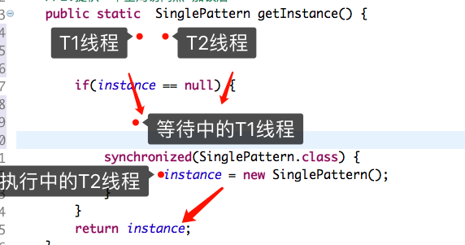

# 单例模式

单例模式最初的定义出现于《设计模式》（艾迪生维斯理, 1994）：“保证一个类仅有一个实例，并提供一个访问它的全局访问点。”

Java中单例模式定义：“一个类有且仅有一个实例，并且自行实例化向整个系统提供。”

特点：

- 1、单例类只能有一个实例。
- 2、单例类必须自己创建自己的唯一实例。
- 3、单例类必须给所有其他对象提供这一实例。

Java中简单的单例模式（不牵扯并发）注：这个是预加载，如果懒加载的话可以直接声明变量的时候创建对象。

```java
/**
 * 单例模式类
 * @author wanghao
 *
 */
class SinglePattern{
    private static SinglePattern instance ;
    //1.构造方法私有化
    private SinglePattern() {
    }
    //2.提供一个全局访问点
    public static SinglePattern getInstance() {
        if(instance == null) {
            instance = new SinglePattern();
        }
        return instance;
    }
}
```

上面的那种方法是线程不安全的，如果并发则会创建多个对象，


多线程有一个锁机制。使用synchronized修饰。我们可以锁住获取对象的方法。代码如下：


```java
/**
 * 加锁后的，单例模式类
 * @author wanghao
 *
 */
class SinglePattern{
    private static SinglePattern instance ;
    //1.构造方法私有化
    private SinglePattern() {
    }
    //2.提供一个全局访问点 加锁后
    public static synchronized SinglePattern getInstance() {
        if(instance == null) {
            instance = new SinglePattern();
        }
        return instance;
    }
}
```

然后下面我们创建的对象就只有一个实例了。每次获取的都是一个实例。

众所周知线程安全就等于效率会相对低点。所有经过改造优化，出现另一种双重判断方式。代码如下：

```java
/**
 * 加锁后的，单例模式类 +优化后
 * @author wanghao
 *
 */
class SinglePattern{
    private static SinglePattern instance ;
    //1.构造方法私有化
    private SinglePattern() {
    }
    //2.提供一个全局访问点 加锁后
    public static  SinglePattern getInstance() {
        if(instance == null) {
            synchronized(SinglePattern.class) {
                if(instance == null) {
                    instance = new SinglePattern();
                }
            }
        }
        return instance;
    }
}
```

单例模式重点就一个对象，这样理论上会是创建次数少获取的次数多。所以，我们只需加锁创建对象的方式，而判断是否为null，可以不加锁。可以提高效率。

如果按前面一种方式，如果高并发10个线程同时访问，则需要耗费10*（等待时间+判断时间），

而如果用第二张方式，如果通用10个线程访问，则只需10*（判断时间），如果没有对象则再加上一次判断时间和创建对象的时间。

有的人会问，上面只是为了优化， 需要两个if判断。我们先用一个判断人后只需上面的代码，验证结果后在说原因吧。为去掉锁里面的判断执行结果为： 


两个实例，这是为什么呢？



这是因为刚开始instance实例肯定是null的，T1和T2线程里面都是空实例，所以都过了if判断，然后到达锁门口，T2跑的快拿到锁了，进去创建了个对象出去了。（注：这时候已经有对象了）然后因为T1线程已经通过判断，到达创建对象锁门口，等T1归还了锁之后，T1线程进入创建对象。然后出去。这时候两个线程就创建了两个对象。

所以才要在锁里面判断对象是否为空。