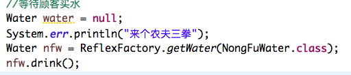

# 工厂模式

工厂模式（Factory Pattern）是 Java 中最常用的设计模式之一。这种类型的设计模式属于创建型模式，它提供了一种创建对象的最佳方式。

把对象比作产品，创建对象的地方叫做工厂，如：Spring中的Bean和容器。

简单工厂模式 ，代码实现：

一个抽象类水，和三个子类，农夫三拳，哇哈哈，百岁山类。

```java
/**
 * 我家卖水的
 * @author wanghao
 *
 */
abstract class Water{
    //卖的是可以喝的水
    public abstract void drink();
}
//农夫三拳 水
class NongFuWater extends Water{
    @Override
    public void drink() {
        System.out.println("农夫三拳有点甜。");
    }
}
//哇哈哈 水
class WaHaWater extends Water{
    @Override
    public void drink() {
        System.out.println("哇哈哈也有点甜。");
    }
}
//百岁山 水
class BaiSuiWater extends Water{
    @Override
    public void drink() {
        System.out.println("百岁山也是甜的。");
    }
}
```

然后创建个工厂存放我的水。进行销售：

```java
class WaterFactory{
    public static Water getWater(String waterName) {
        Water water = null;
        switch (waterName) {
        case "农夫三拳":
            water = new NongFuWater();
            break;
        case "哇哈哈":
            water = new WaHaWater();
            break;
        case "百岁山":
            water = new BaiSuiWater();
            break;
        }
        return water;
    }
}
```

#  利用反射创建工厂对象

还有上面的例子只是把工厂换做基于反射的例子：代码如下：

```java
class  ReflexFactory {
    public static <T extends Water> T getWater(Class<T> clz) {
        T t = null;
        try {
            t = (T) Class.forName(clz.getName()).newInstance();
        } catch (Exception e) {
            e.printStackTrace();
        }
        return t;
        
    }
}
```

然后把Demo的工厂换做反射工厂。代码如下：只写了一个，后面略。




多方法工厂模式，需要什么调什么

```java
//多方法工厂模式,需要什么就调什么
class WaterFactory{
    
    public static NongFuWater getNongFuWater() {
        return new NongFuWater();
    }
    
    public static WaHaWater getWaHaWater() {
        return new WaHaWater();
    }
    
    public static BaiSuiWater getBaiSuiWater() {
        return new BaiSuiWater();
    }
}
```

还有java源码的工厂模式：例如线程池都知道创建线程池子的方法有很多，其中有一种为创建固定数量的线程池方法：

```java
/**创建具一个可重用的，有固定数量的线程池
 * 每次提交一个任务就提交一个线程，直到线程达到线城池大小，就不会创建新线程了
 * 线程池的大小达到最大后达到稳定不变，如果一个线程异常终止，则会创建新的线程
 */
        ExecutorService es=Executors.newFixedThreadPool(2);
        for(int i=0;i<10;i++){
            ThreadChi tc=new ThreadChi();
            es.execute(tc);
        }
        es.shutdown();
```

