## 1. jps-查看Java进程

> jps命令相当于Linux下的ps命令，只不过它只列出Java进程。

- `jps` ：列出Java程序进程ID和Main函数名称
- `jps -q` ：只输出进程ID
- `jps -m` ：输出传递给Java进程（主函数）的参数
- `jps -l` ：输出主函数的完整路径
- `jps -v` ：显示传递给Java虚拟的参数

## 2. jstat-查看虚拟机运行时信息

> jstat可以查看Java程序运行时相关信息，可以通过它查看堆信息的相关情况
>
> jstat -<options> [-t] [-h<lines>] <vmid> [<interval> [<count>]]

- `options`：由以下值构成
  - `-class`：显示ClassLoader的相关信息
  - `-compiler`：显示JIT编译的相关信息
  - `-gc`：显示与GC相关信息
  - `-gccapacity`：显示各个代的容量和使用情况
  - `-gccause`：显示垃圾收集相关信息（同`-gcutil`），同时显示最后一次或当前正在发生的垃圾收集的诱发原因
  - `-gcnew`：显示新生代信息
  - `-gcnewcapacity`：显示新生代大小和使用情况
  - `-gcold`：显示老年代信息
  - `-gcoldcapacity`：显示老年代大小
  - `-gcpermcapacity`：显示永久代大小
  - `-gcutil`：显示垃圾收集信息
  - `-printcompilation`：输出JIT编译的方法信息
- `-t`：在输出信息前加上一个Timestamp列，显示程序的运行时间
- `-h`：可以在周期性数据输出后，输出多少行数据后，跟着一个表头信息
- `interval`：用于指定输出统计数据的周期，单位为毫秒
- `count`：用于指定一个输出多少次数据

**测试：**

`jstat -class -t 6864 1000 2` 输出ClassLoader信息

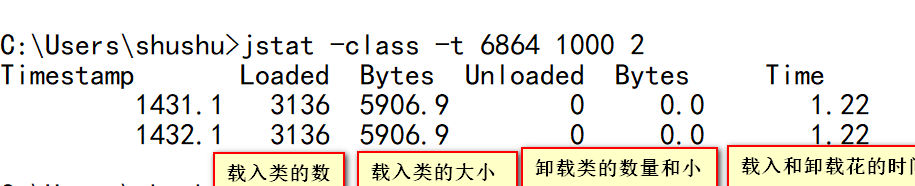

`jstat -compiler -t 6864` 查看JIT编译信息

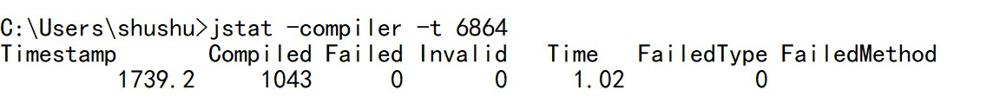

- `Compiled`：编译任务执行次数
- `Failed`：编译失败次数
- `Invalid`：编译不可用次数
- `Time`：编译总耗时
- `FailedType`：最后一次编译失败类型
- `FailedMethod`：最后一次编译失败的类名和方法名

`jstat -gc 6864` GC相关堆信息


- `S0C,S1C`：S0和S1（from区）大小 KB
- `S0U,S1U`：S0和S1（from区）已使用大小 KB
- `EC,OC,PC`：eden，old，perm大小 KB
- `EU,OU,PU`：eden，old，perm已使用大小 KB
- `YGC,FGC`：新生代GC，FullGC次数
- `YGCT,FGCT`：新生代GC，FullGC耗时
- `GCT`：GC总耗时

`jstat -gccapacity 6864` ：查看各个代大小


- `NGCMN,NGC,OGCMN,PGCMN`:新，当前新生代，老，持的最小值 KB
- `NGCMX,OGCMX,PGCMX`:新，老，持的最大值KB

`jstat -gccause 6864`：显示GC原因


- `LGCC`：上次GC原因
- `GCC`：这次GC原因

`jstat -gcnew 6864` ：查看新生代详细参数


- `TT`：新生代晋升到老年代年龄
- `MTT`：新生代晋升到老年代年龄最大值
- `DSS`：所需survivor大小

`jstat -gcnewcapacity 6864`：输出新生代各区大小

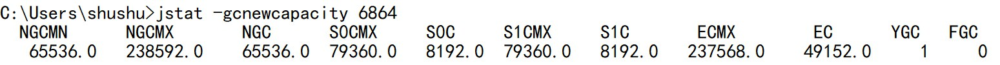

- `S0CMX`：S0最大值KB
- `S1CMX`：S1最大值KB
- `ECMX`：eden区最大值 KB

`jstat -gcutil 6864`： 查看相关百分比
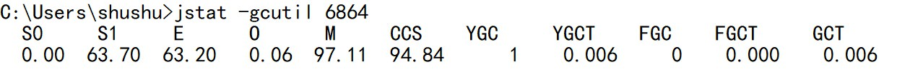

`S0,S1,E,O,P`：s0，s1，eden，old，perm使用的百分比

## 3. jinfo-查看虚拟机参数

> jinfo可以用来查看正在运行的java程序的扩展参数，甚至支持运行时，修改部分参数
>
> jinfo [option] <pid>

- `-flag ` to print the value of the named VM flag
- `-flag [+|-]` to enable or disable the named VM flag
- `-flag =` to set the named VM flag to the given value
- `-flags` to print VM flags
- `-sysprops` to print Java system properties
- `<no option>` to print both of the above
- `-h | -help` to print this help message

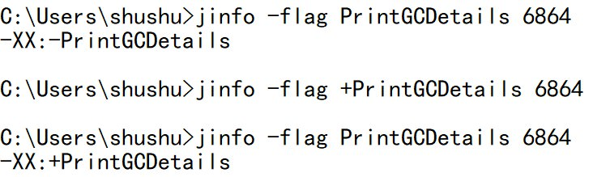

**info不仅可以查看参数，还可以修改参数**

## 4. jmap-导出堆到文件

> jmap可以生成Java程序的堆的Dump文件，也可以查看堆内对象实例的统计信息，查看ClassLoader的信息以及finalizer队列

`jmap -histo 11512 >c:/MyFile/s.txt`：生成PID为11512的Java程序的对象统计信息，并输出到s.txt中


`jmap -dump:format=b,file=c:\MyFile\heap.hprof 11652` ：等到Java程序的当前堆快照。然后可以用各种工具分析该文件。

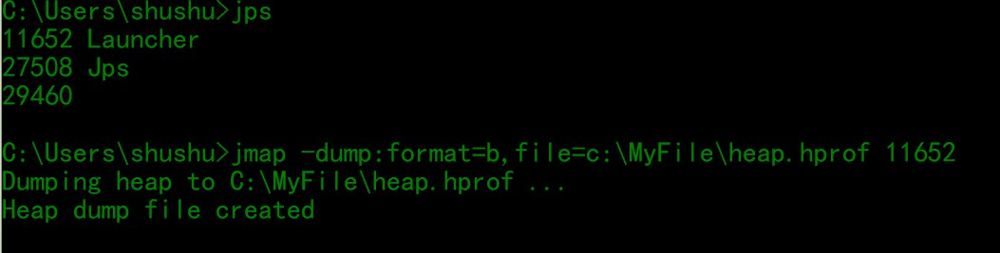

`jmap -finalizerinfo 11652` : 观察系统finalizer队列中的对象，一个不恰当的finalize()方法可能导致对象堆积在finalizer队列中，使用上面的参数可以查看堆积在finalizer队列中的对象。

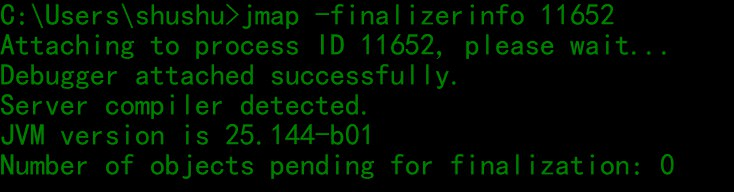

## 5. jhat——JDK自带的堆分析工具

`jhat c:\MyFile\heap.hprof` ：利用jhat分析刚刚jmap输出的堆文件。

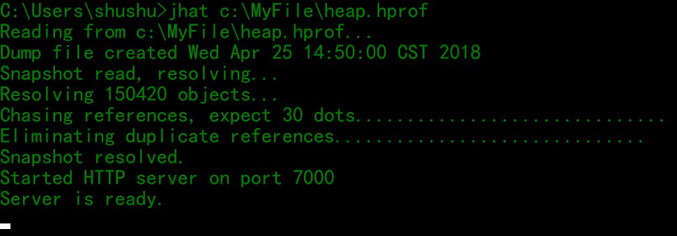

jhat分析完后，使用http服务器展示分析结果，在浏览器中访问：

## 6. jstack——查看线程堆栈

测试下面代码

```java
package com.liuyao;


/**
 * 一个简单的死锁类
 * 当DeadLock类的对象flag==1时（td1），先锁定o1,睡眠500毫秒
 * 而td1在睡眠的时候另一个flag==0的对象（td2）线程启动，先锁定o2,睡眠500毫秒
 * td1睡眠结束后需要锁定o2才能继续执行，而此时o2已被td2锁定；
 * td2睡眠结束后需要锁定o1才能继续执行，而此时o1已被td1锁定；
 * td1、td2相互等待，都需要得到对方锁定的资源才能继续执行，从而死锁。
 */

public class DeadLock implements Runnable {
    public int flag = 1;
    //静态对象是类的所有对象共享的
    private static Object o1 = new Object(), o2 = new Object();

    @Override
    public void run() {
        System.out.println("flag :"+flag);
        if (flag == 1) {
            synchronized (o1) {
                try {
                    Thread.sleep(500);
                } catch (Exception e) {
                    e.printStackTrace();
                }
                synchronized (o2) {
                    System.out.println("1");
                }
            }
        }
        if (flag == 0) {
            synchronized (o2) {
                try {
                    Thread.sleep(500);
                } catch (Exception e) {
                    e.printStackTrace();
                }
                synchronized (o1) {
                    System.out.println("0");
                }
            }
        }
    }

    public static void main(String[] args) {
        DeadLock td1 = new DeadLock();
        DeadLock td2 = new DeadLock();
        td1.flag = 1;
        td2.flag = 0;
        //td1,td2都处于可执行状态，但JVM线程调度先执行哪个线程是不确定的。
        //td2的run()可能在td1的run()之前运行
        new Thread(td1).start();
        new Thread(td2).start();
    }
}

```


通过命令行输入 `jstack` 命令查看:

`jstack -l 23612 >c:\MyFile\deadlock.txt` : -l 会打印锁的附加信息。

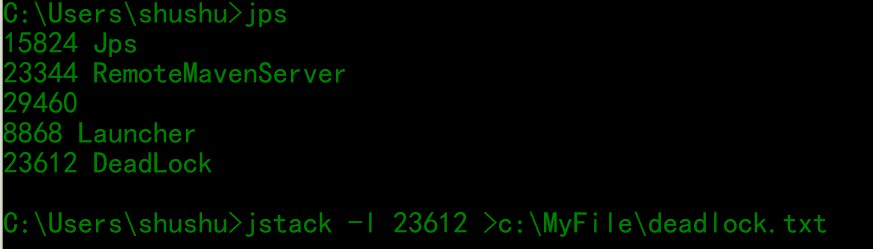

查看输出的deadlock.txt文件，我们会发现：


## 7. jstatd——远程主机信息收集

> `jstatd` 是一个RMI服务端程序，它的作用相当于代理服务器，建立本地计算机与远程监控工具的通信。

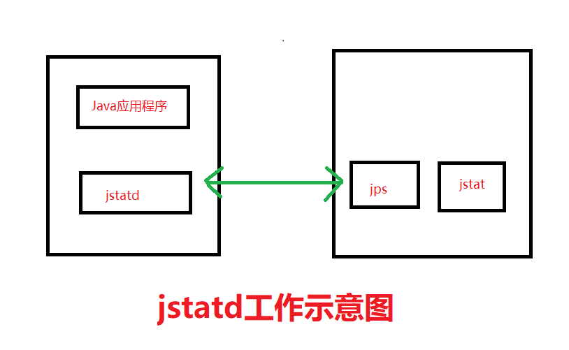

## 8. jcmd——多功能命令行

> 在JDK1.7后新增的一个命令行工具jcmd，它是一个多功能工具，可以用它来导出堆，查看Java进程，导出线程信息，执行GC等。

`jcmd -l` ：列出当前系统中的所有Java虚拟机

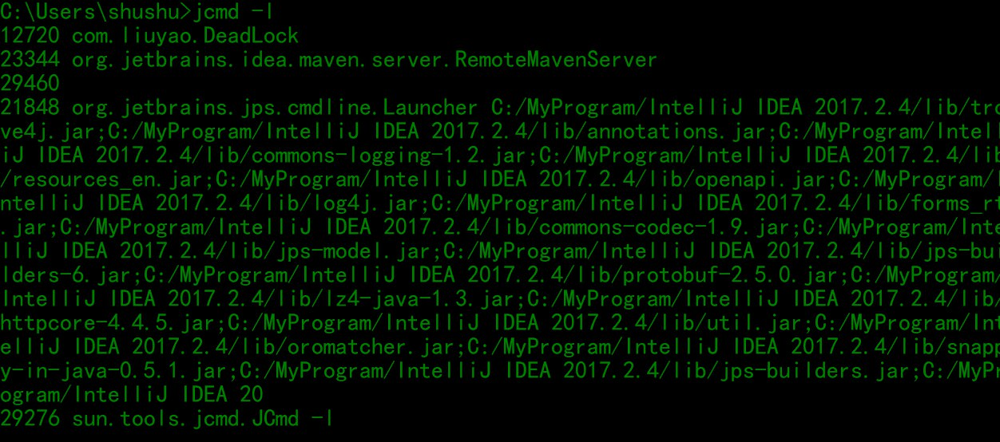

`jcmd 12720 help` ：针对每一个虚拟机，jcmd可以使用help列出它们所支持的命令。

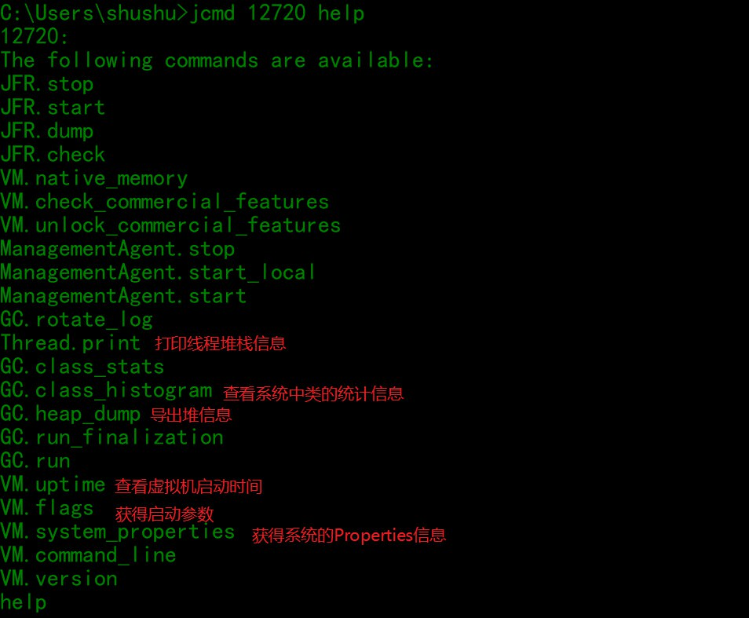

## 9. hprof（Heap/CPU Profiling Tool）

  hprof能够展现CPU使用率，统计堆内存使用情况。