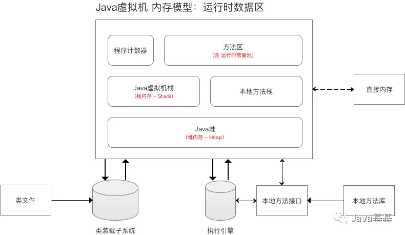
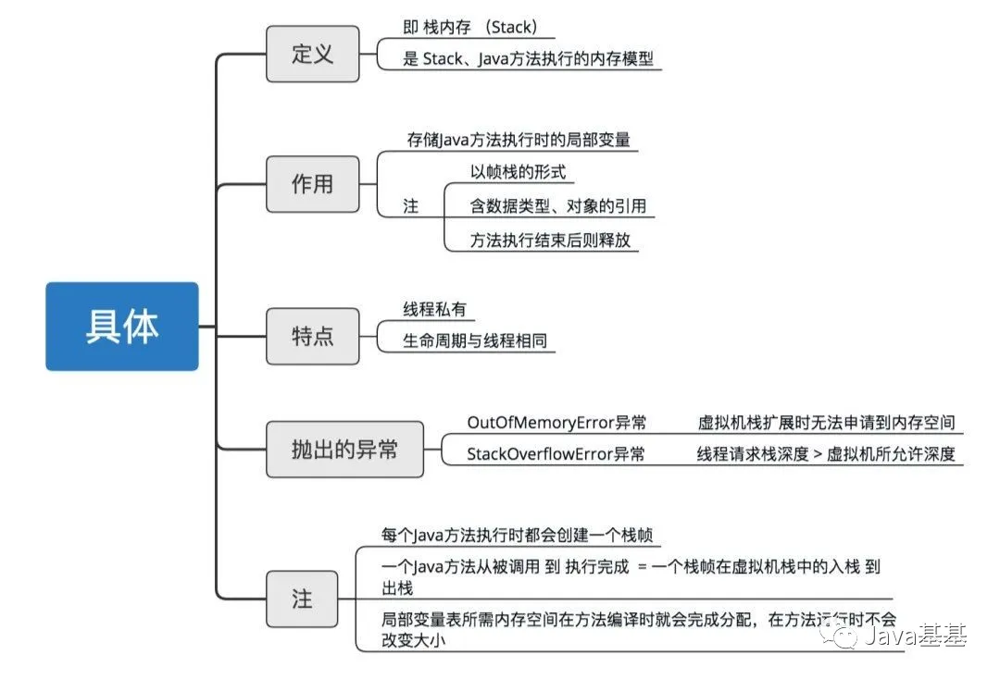
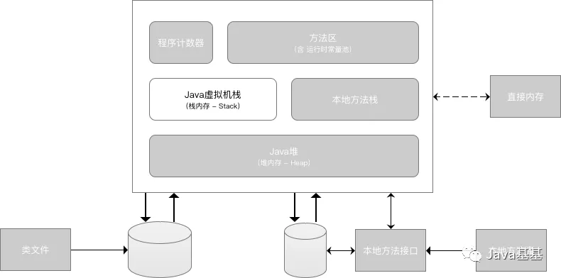
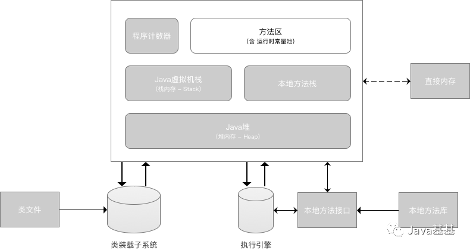
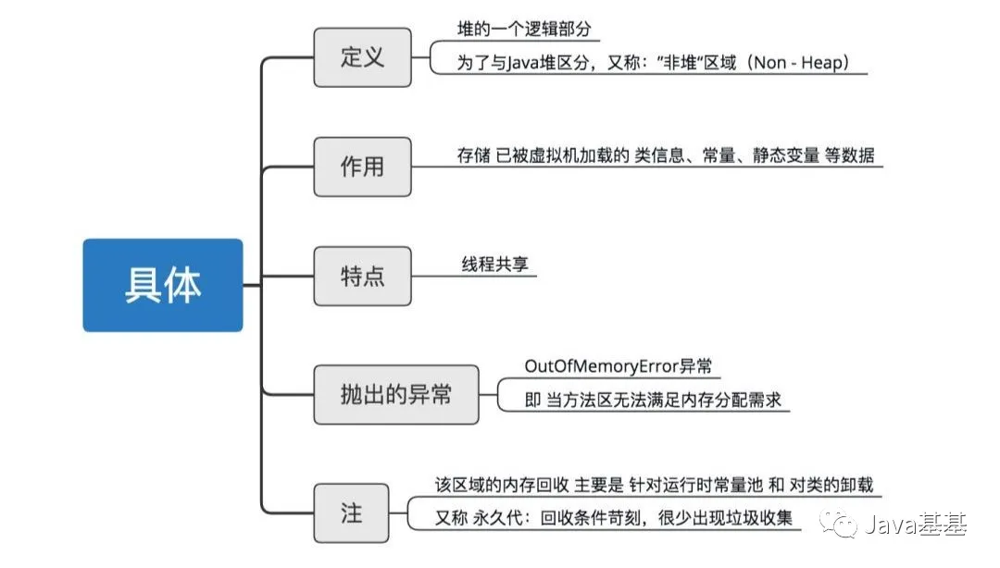
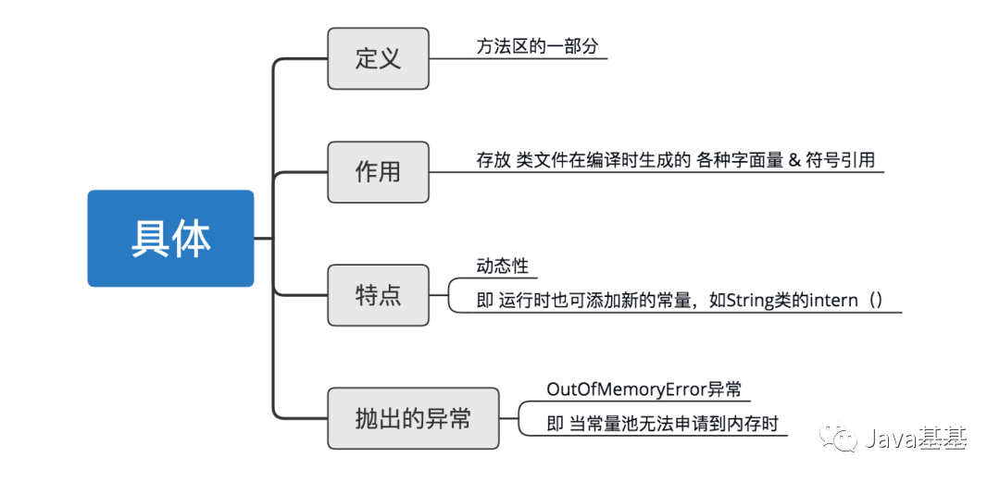
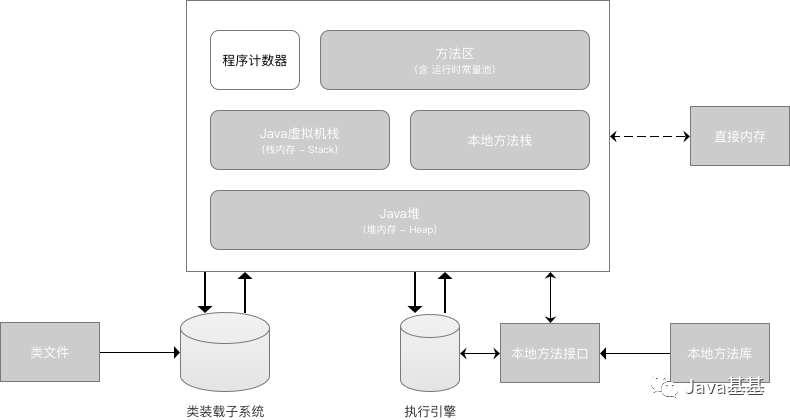
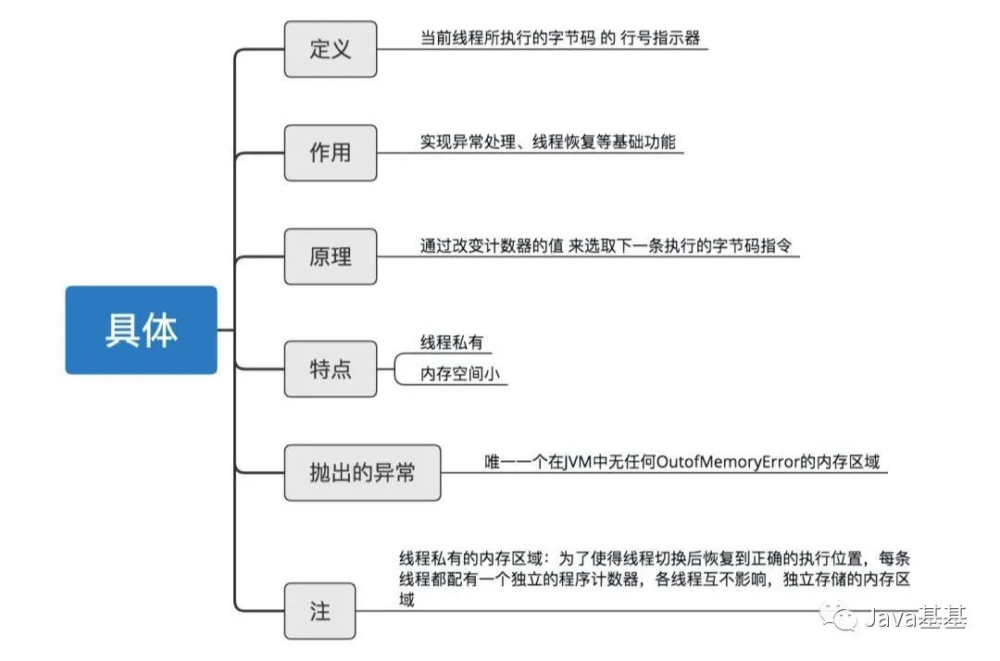

# 1. 内存模型 & 分区

- `Java`虚拟机在运行`Java`程序时，会管理着一块内存区域：

  运行时数据区

- 在运行时数据区里，会根据用途进行划分：

- 

- 1. `Java`虚拟机栈（栈区）
  2. 本地方法栈
  3. `Java`堆（堆区）
  4. 方法区
  5. 程序计数器

- 下面，我将详细介绍每个内存模型分区

# 2. Java 堆

- **示意图**

- **简介**

# 3. Java 虚拟机栈

- **示意图**

- **简介**

# 4. 本地方法栈

- **示意图**

- 简介

  十分类似`Java`虚拟机栈，与Java虚拟机区别在于：服务对象，即Java虚拟机栈为执行  `Java`方法服务；本地方法栈为执行  `Native`方法服务

# 5. 方法区

- **示意图**

- **简介**

- **注**

其内部包含一个运行时常量池，具体介绍如下：

# 6. 程序计数器

- **示意图**

- **简介**

# 7. 额外知识：直接内存

- 定义：`NIO`类（`JDK`1.4引入）中基于通道和缓冲区的`I/O`方式 通过使用`Native`函数库 直接分配 的堆外内存
- 特点：不受堆大小限制
- 应用场景：适用于频繁调用的场景

> 通过一个 存储在`Java`堆中的`DirectByteBuffer`对象 作为这块内存的引用 进行操作，从而避免在`Java` 堆和 `Native`堆之间来回复制数据，提高使用性能

- 抛出的异常：`OutOfMemoryError`，即与其他内存区域的总和 大于 物理内存限制