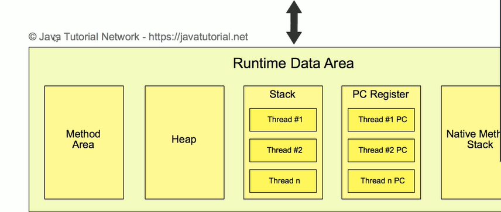
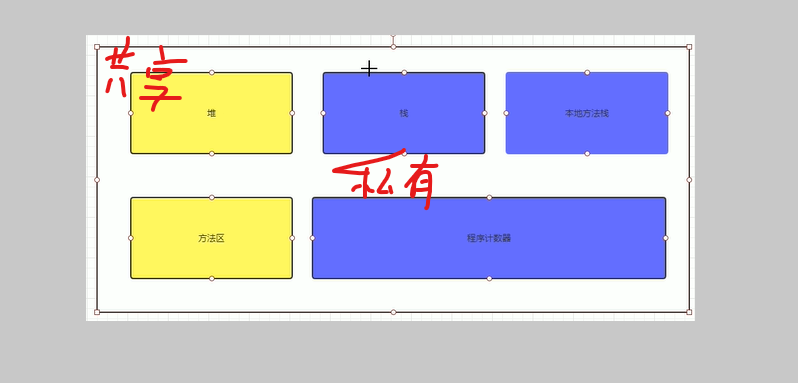

# JVM

java虚拟机(java virtual mechine, JVM)，一种能够运行java字节码的虚拟机，作为一种编程语言的虚拟机，实际上不只是专用于java语言，只要生成的编译文件匹配jvm对价在编译文件格式要求，任何语言都可以由jvm编译运行。比如kotlin，scala等

## JVM的基本结构

JVM主要由三个主要的子系统构成

- 类加载子系统
- 运行时数据区（内存结构）
- 执行引擎

### 运行时数据区(内存结构)

#### 1.方法区 （Method Area)

#### 2. 堆(Heap)

