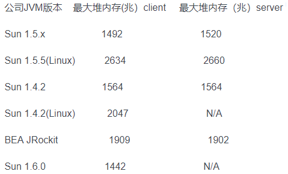
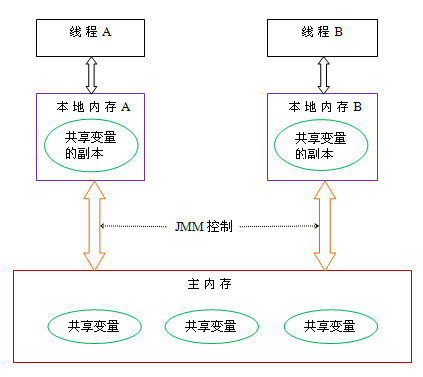
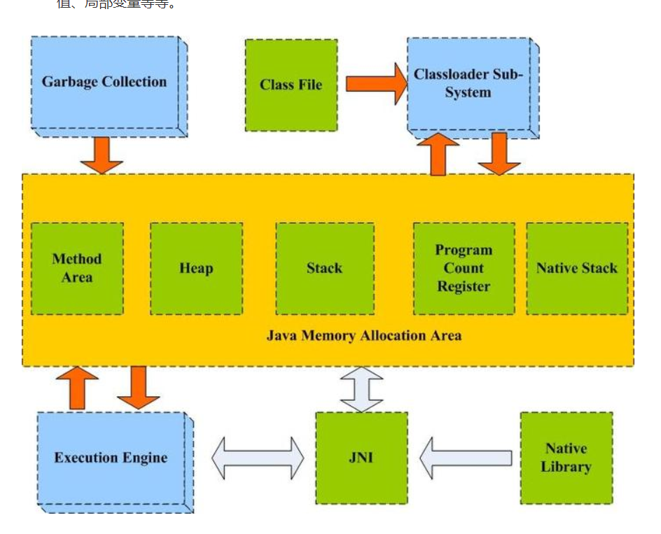
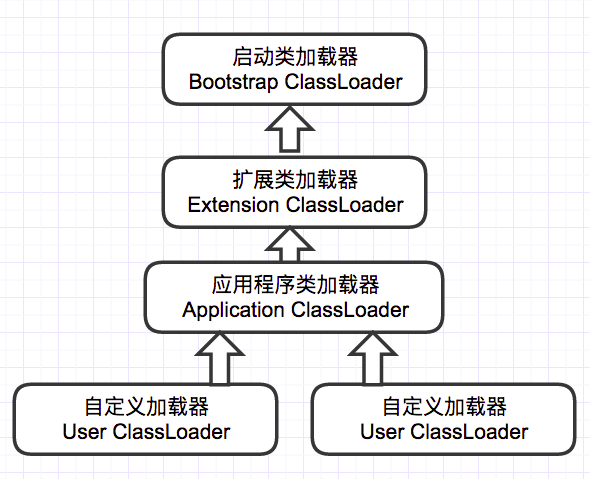

## 127. 请简单描述一下JVM加载class文件的原理是什么?

JVM中类的装载是由ClassLoader和它的子类来实现的,Java ClassLoader 是一个重要的Java运行时系统组件。它负责在运行时查找和装入类文件的类。

Java中的所有类，都需要由类加载器装载到JVM中才能运行。类加载器本身也是一个类，而它的工作就是把class文件从硬盘读取到内存中。在写程序的时候，我们几乎不需要关心类的加载，因为这些都是隐式装载的，除非我们有特殊的用法，像是反射，就需要显式的加载所需要的类。

类装载方式，有两种
（1）隐式装载，程序在运行过程中当碰到通过new 等方式生成对象时，隐式调用类装载器加载对应的类到jvm中，
（2）显式装载，通过class.forname()等方法，显式加载需要的类 ,隐式加载与显式加载的区别：两者本质是一样的。

Java类的加载是动态的，它并不会一次性将所有类全部加载后再运行，而是保证程序运行的基础类(像是基类)完全加载到jvm中，至于其他类，则在需要的时候才加载。这当然就是为了节省内存开销。

## 128. 什么是Java虚拟机？为什么Java被称作是“平台无关的编程语言”？

Java虚拟机是一个可以执行Java字节码的虚拟机进程。Java源文件被编译成能被Java虚拟机执行的字节码文件。
Java被设计成允许应用程序可以运行在任意的平台，而不需要程序员为每一个平台单独重写或者是重新编译。Java虚拟机让这个变为可能，因为它知道底层硬件平台的指令长度和其他特性。

## 129.  jvm最大内存限制多少？

(1)堆内存分配

JVM初始分配的内存由-Xms指定，默认是物理内存的1/64；JVM最大分配的内存由-Xmx指定，默认是物理内存的1/4。默认空余堆内存小 于40%时，JVM就会增大堆直到-Xmx的最大限制；空余堆内存大于70%时，JVM会减少堆直到-Xms的最小限制。因此服务器一般设置-Xms、 -Xmx相等以避免在每次GC后调整堆的大小。

(2)非堆内存分配

JVM使用-XX:PermSize设置非堆内存初始值，默认是物理内存的1/64；由XX:MaxPermSize设置最大非堆内存的大小，默认是物理内存的1/4。

(3)VM最大内存

首先JVM内存限制于实际的最大物理内存，假设物理内存无限大的话，JVM内存的最大值跟操作系统有很大的关系。简单的说就32位处理器虽 然可控内存空间有4GB,但是具体的操作系统会给一个限制，这个限制一般是2GB-3GB（一般来说Windows系统下为1.5G-2G，Linux系 统下为2G-3G），而64bit以上的处理器就不会有限制了。

(3)下面是当前比较流行的几个不同公司不同版本JVM最大堆内存:

## 130.  jvm是如何实现线程的？

线程是比进程更轻量级的调度执行单位。线程可以把一个进程的资源分配和执行调度分开。一个进程里可以启动多条线程，各个线程可共享该进程的资源(内存地址，文件IO等)，又可以独立调度。线程是CPU调度的基本单位。

主流OS都提供线程实现。Java语言提供对线程操作的同一API，每个已经执行start()，且还未结束的java.lang.Thread类的实例，代表了一个线程。

Thread类的关键方法，都声明为Native。这意味着这个方法无法或没有使用平台无关的手段来实现，也可能是为了执行效率。

实现线程的方式

A.使用内核线程实现内核线程(Kernel-Level Thread, KLT)就是直接由操作系统内核支持的线程。

内核来完成线程切换

内核通过调度器Scheduler调度线程，并将线程的任务映射到各个CPU上

程序使用内核线程的高级接口，轻量级进程(Light Weight Process,LWP)

用户态和内核态切换消耗内核资源

使用用户线程实现

系统内核不能感知线程存在的实现

用户线程的建立、同步、销毁和调度完全在用户态中完成

所有线程操作需要用户程序自己处理，复杂度高

用户线程加轻量级进程混合实现

轻量级进程作为用户线程和内核线程之间的桥梁

## 131. 请问什么是JVM内存模型？

Java内存模型(简称JMM)，JMM决定一个线程对共享变量的写入何时对另一个线程可见。从抽象的角度来看，JMM定义了线程和主内存之间的抽象关系：线程之间的共享变量存储在主内存（main memory）中，每个线程都有一个私有的本地内存（local memory），本地内存中存储了该线程以读/写共享变量的副本。

本地内存是JMM的一个抽象概念，并不真实存在。它涵盖了缓存，写缓冲区，寄存器以及其他的硬件和编译器优化。其关系模型图如下图所示：

## 132. 请列举一下，在JAVA虚拟机中，哪些对象可作为ROOT对象？

虚拟机栈中的引用对象

方法区中类静态属性引用的对象

方法区中常量引用对象

本地方法栈中JNI引用对象

## 133. GC中如何判断对象是否需要被回收？

即使在可达性分析算法中不可达的对象,也并非是“非回收不可”的,这时候它们暂时处于“等待”阶段,要真正宣告一个对象回收,至少要经历两次标记过程:如果对象在进行可达性分析后发现没有与GC Roots相连接的引用链,那它将会被第一次标记并且进行一次筛选,筛选的条件是此对象是否有必要执行finalize()方法。当对象没有覆盖finalize()方法,或者finalize()方法已经被虚拟机调用过,虚拟机将这两种情况都视为“没有必要执行”。(即意味着直接回收)

如果这个对象被判定为有必要执行finalize()方法,那么这个对象将会放置在一个叫做F-Queue的队列之中,并在稍后由一个由虚拟机自动建立的、低优先级的Finalizer线程去执行它。这里所谓的“执行”是指虚拟机会触发这个方法,但并不承诺会等待它运行结束,这样做的原因是,如果一个对象在finalize()方法中执行缓慢,或者发生了死循环(更极端的情况),将很可能会导致F-Queue队列中其他对象永久处于等待,甚至导致整个内存回收系统崩溃。

finalize()方法是对象逃脱回收的最后一次机会,稍后GC将对F-Queue中的对象进行第二次小规模的标记,如果对象要在finalize()中跳出回收——只要重新与引用链上的任何一个对象建立关联即可,譬如把自己(this关键字)赋值给某个类变量或者对象的成员变量,那在第二次标记时它将被移除出“即将回收”的集合;如果对象这时候还没有逃脱,那基本上它就真的被回收了。

## 134. 请说明一下JAVA虚拟机的作用是什么?

解释运行字节码程序消除平台相关性。

jvm将java字节码解释为具体平台的具体指令。一般的高级语言如要在不同的平台上运行，至少需要编译成不同的目标代码。而引入JVM后，Java语言在不同平台上运行时不需要重新编译。Java语言使用模式Java虚拟机屏蔽了与具体平台相关的信息，使得Java语言编译程序只需生成在Java虚拟机上运行的目标代码（字节码），就可以在多种平台上不加修改地运行。Java虚拟机在执行字节码时，把字节码解释成具体平台上的机器指令执行。

假设一个场景，要求stop the world时间非常短，你会怎么设计垃圾回收机制？

绝大多数新创建的对象分配在Eden区。

在Eden区发生一次GC后，存活的对象移到其中一个Survivor区。

在Eden区发生一次GC后，对象是存放到Survivor区，这个Survivor区已经存在其他存活的对象。

一旦一个Survivor区已满，存活的对象移动到另外一个Survivor区。然后之前那个空间已满Survivor区将置为空，没有任何数据。

经过重复多次这样的步骤后依旧存活的对象将被移到老年代。

## 135. 请说明一下eden区和survial区的含义以及工作原理？

目前主流的虚拟机实现都采用了分代收集的思想，把整个堆区划分为新生代和老年代；新生代又被划分成Eden 空间、 From Survivor 和 To Survivor 三块区域。

我们把Eden : From Survivor : To Survivor 空间大小设成 8 : 1 : 1 ，对象总是在 Eden 区出生， From Survivor 保存当前的幸存对象， To Survivor 为空。一次 gc 发生后： 1）Eden 区活着的对象 ＋ From Survivor 存储的对象被复制到 To Survivor ；
2) 清空 Eden 和 From Survivor ； 3) 颠倒 From Survivor 和 To Survivor 的逻辑关系： From 变 To ， To 变 From 。可以看出，只有在 Eden 空间快满的时候才会触发 Minor GC 。而 Eden 空间占新生代的绝大部分，所以 Minor GC 的频率得以降低。当然，使用两个 Survivor 这种方式我们也付出了一定的代价，如 10% 的空间浪费、复制对象的开销等。

## 136. 请简单描述一下JVM分区都有哪些？

java内存通常被划分为5个区域：程序计数器（Program Count Register）、本地方法栈（Native Stack）、方法区（Methon Area）、栈（Stack）、堆（Heap）。

## 137. 请简单描述一下类的加载过程

如下图所示，JVM类加载机制分为五个部分：加载，验证，准备，解析，初始化，下面我们就分别来看一下这五个过程。

加载

加载是类加载过程中的一个阶段，这个阶段会在内存中生成一个代表这个类的java.lang.Class对象，作为方法区这个类的各种数据的入口。注意这里不一定非得要从一个Class文件获取，这里既可以从ZIP包中读取（比如从jar包和war包中读取），也可以在运行时计算生成（动态代理），也可以由其它文件生成（比如将JSP文件转换成对应的Class类）。

验证

这一阶段的主要目的是为了确保Class文件的字节流中包含的信息是否符合当前虚拟机的要求，并且不会危害虚拟机自身的安全。

准备

准备阶段是正式为类变量分配内存并设置类变量的初始值阶段，即在方法区中分配这些变量所使用的内存空间。注意这里所说的初始值概念，比如一个类变量定义为：

public static int v = 8080;

实际上变量v在准备阶段过后的初始值为0而不是8080，将v赋值为8080的putstatic指令是程序被编译后，存放于类构造器<client>方法之中，这里我们后面会解释。

但是注意如果声明为：

public static final int v = 8080;

在编译阶段会为v生成ConstantValue属性，在准备阶段虚拟机会根据ConstantValue属性将v赋值为8080。

解析

解析阶段是指虚拟机将常量池中的符号引用替换为直接引用的过程。符号引用就是class文件中的：

CONSTANT_Class_info

CONSTANT_Field_info

CONSTANT_Method_info

等类型的常量。

下面我们解释一下符号引用和直接引用的概念：

符号引用与虚拟机实现的布局无关，引用的目标并不一定要已经加载到内存中。各种虚拟机实现的内存布局可以各不相同，但是它们能接受的符号引用必须是一致的，因为符号引用的字面量形式明确定义在Java虚拟机规范的Class文件格式中。

直接引用可以是指向目标的指针，相对偏移量或是一个能间接定位到目标的句柄。如果有了直接引用，那引用的目标必定已经在内存中存在。

初始化

初始化阶段是类加载最后一个阶段，前面的类加载阶段之后，除了在加载阶段可以自定义类加载器以外，其它操作都由JVM主导。到了初始阶段，才开始真正执行类中定义的Java程序代码。

初始化阶段是执行类构造器<client>方法的过程。<client>方法是由编译器自动收集类中的类变量的赋值操作和静态语句块中的语句合并而成的。虚拟机会保证<client>方法执行之前，父类的<client>方法已经执行完毕。p.s: 如果一个类中没有对静态变量赋值也没有静态语句块，那么编译器可以不为这个类生成<client>()方法。

注意以下几种情况不会执行类初始化：

通过子类引用父类的静态字段，只会触发父类的初始化，而不会触发子类的初始化。

定义对象数组，不会触发该类的初始化。

常量在编译期间会存入调用类的常量池中，本质上并没有直接引用定义常量的类，不会触发定义常量所在的类。

通过类名获取Class对象，不会触发类的初始化。

通过Class.forName加载指定类时，如果指定参数initialize为false时，也不会触发类初始化，其实这个参数是告诉虚拟机，是否要对类进行初始化。

通过ClassLoader默认的loadClass方法，也不会触发初始化动作。

类加载器

虚拟机设计团队把加载动作放到JVM外部实现，以便让应用程序决定如何获取所需的类，JVM提供了3种类加载器：

启动类加载器(Bootstrap ClassLoader)：负责加载 JAVA_HOME\lib 目录中的，或通过-Xbootclasspath参数指定路径中的，且被虚拟机认可（按文件名识别，如rt.jar）的类。

扩展类加载器(Extension ClassLoader)：负责加载 JAVA_HOME\lib\ext 目录中的，或通过java.ext.dirs系统变量指定路径中的类库。

应用程序类加载器(Application ClassLoader)：负责加载用户路径（classpath）上的类库。

JVM通过双亲委派模型进行类的加载，当然我们也可以通过继承java.lang.ClassLoader实现自定义的类加载器。

当一个类加载器收到类加载任务，会先交给其父类加载器去完成，因此最终加载任务都会传递到顶层的启动类加载器，只有当父类加载器无法完成加载任务时，才会尝试执行加载任务。采用双亲委派的一个好处是比如加载位于rt.jar包中的类java.lang.Object，不管是哪个加载器加载这个类，最终都是委托给顶层的启动类加载器进行加载，这样就保证了使用不同的类加载器最终得到的都是同样一个Object对象。

## 138. 请简单说明一下JVM的回收算法以及它的回收器是什么？还有CMS采用哪种回收算法？使用CMS怎样解决内存碎片的问题呢？

垃圾回收算法

标记清除

标记-清除算法将垃圾回收分为两个阶段：标记阶段和清除阶段。在标记阶段首先通过根节点，标记所有从根节点开始的对象，未被标记的对象就是未被引用的垃圾对象。然后，在清除阶段，清除所有未被标记的对象。标记清除算法带来的一个问题是会存在大量的空间碎片，因为回收后的空间是不连续的，这样给大对象分配内存的时候可能会提前触发full gc。

复制算法

将现有的内存空间分为两快，每次只使用其中一块，在垃圾回收时将正在使用的内存中的存活对象复制到未被使用的内存块中，之后，清除正在使用的内存块中的所有对象，交换两个内存的角色，完成垃圾回收。

现在的商业虚拟机都采用这种收集算法来回收新生代，IBM研究表明新生代中的对象98%是朝夕生死的，所以并不需要按照1:1的比例划分内存空间，而是将内存分为一块较大的Eden空间和两块较小的Survivor空间，每次使用Eden和其中的一块Survivor。当回收时，将Eden和Survivor中还存活着的对象一次性地拷贝到另外一个Survivor空间上，最后清理掉Eden和刚才用过的Survivor的空间。HotSpot虚拟机默认Eden和Survivor的大小比例是8:1(可以通过-SurvivorRattio来配置)，也就是每次新生代中可用内存空间为整个新生代容量的90%，只有10%的内存会被“浪费”。当然，98%的对象可回收只是一般场景下的数据，我们没有办法保证回收都只有不多于10%的对象存活，当Survivor空间不够用时，需要依赖其他内存（这里指老年代）进行分配担保。

标记整理

复制算法的高效性是建立在存活对象少、垃圾对象多的前提下的。这种情况在新生代经常发生，但是在老年代更常见的情况是大部分对象都是存活对象。如果依然使用复制算法，由于存活的对象较多，复制的成本也将很高。

标记-压缩算法是一种老年代的回收算法，它在标记-清除算法的基础上做了一些优化。首先也需要从根节点开始对所有可达对象做一次标记，但之后，它并不简单地清理未标记的对象，而是将所有的存活对象压缩到内存的一端。之后，清理边界外所有的空间。这种方法既避免了碎片的产生，又不需要两块相同的内存空间，因此，其性价比比较高。

增量算法

增量算法的基本思想是，如果一次性将所有的垃圾进行处理，需要造成系统长时间的停顿，那么就可以让垃圾收集线程和应用程序线程交替执行。每次，垃圾收集线程只收集一小片区域的内存空间，接着切换到应用程序线程。依次反复，直到垃圾收集完成。使用这种方式，由于在垃圾回收过程中，间断性地还执行了应用程序代码，所以能减少系统的停顿时间。但是，因为线程切换和上下文转换的消耗，会使得垃圾回收的总体成本上升，造成系统吞吐量的下降。

垃圾回收器

Serial收集器

Serial收集器是最古老的收集器，它的缺点是当Serial收集器想进行垃圾回收的时候，必须暂停用户的所有进程，即stop the world。到现在为止，它依然是虚拟机运行在client模式下的默认新生代收集器，与其他收集器相比，对于限定在单个CPU的运行环境来说，Serial收集器由于没有线程交互的开销，专心做垃圾回收自然可以获得最高的单线程收集效率。

Serial Old是Serial收集器的老年代版本，它同样是一个单线程收集器，使用”标记－整理“算法。这个收集器的主要意义也是被Client模式下的虚拟机使用。在Server模式下，它主要还有两大用途：一个是在JDK1.5及以前的版本中与Parallel Scanvenge收集器搭配使用，另外一个就是作为CMS收集器的后备预案，在并发收集发生Concurrent Mode Failure的时候使用。

通过指定-UseSerialGC参数，使用Serial + Serial Old的串行收集器组合进行内存回收。

ParNew收集器

ParNew收集器是Serial收集器新生代的多线程实现，注意在进行垃圾回收的时候依然会stop the world，只是相比较Serial收集器而言它会运行多条进程进行垃圾回收。

ParNew收集器在单CPU的环境中绝对不会有比Serial收集器更好的效果，甚至由于存在线程交互的开销，该收集器在通过超线程技术实现的两个CPU的环境中都不能百分之百的保证能超越Serial收集器。当然，随着可以使用的CPU的数量增加，它对于GC时系统资源的利用还是很有好处的。它默认开启的收集线程数与CPU的数量相同，在CPU非常多（譬如32个，现在CPU动辄4核加超线程，服务器超过32个逻辑CPU的情况越来越多了）的环境下，可以使用-XX:ParallelGCThreads参数来限制垃圾收集的线程数。

-UseParNewGC: 打开此开关后，使用ParNew + Serial Old的收集器组合进行内存回收，这样新生代使用并行收集器，老年代使用串行收集器。

Parallel Scavenge收集器

Parallel是采用复制算法的多线程新生代垃圾回收器，似乎和ParNew收集器有很多的相似的地方。但是Parallel Scanvenge收集器的一个特点是它所关注的目标是吞吐量(Throughput)。所谓吞吐量就是CPU用于运行用户代码的时间与CPU总消耗时间的比值，即吞吐量=运行用户代码时间 / (运行用户代码时间 + 垃圾收集时间)。停顿时间越短就越适合需要与用户交互的程序，良好的响应速度能够提升用户的体验；而高吞吐量则可以最高效率地利用CPU时间，尽快地完成程序的运算任务，主要适合在后台运算而不需要太多交互的任务。

Parallel Old收集器是Parallel Scavenge收集器的老年代版本，采用多线程和”标记－整理”算法。这个收集器是在jdk1.6中才开始提供的，在此之前，新生代的Parallel Scavenge收集器一直处于比较尴尬的状态。原因是如果新生代Parallel Scavenge收集器，那么老年代除了Serial Old(PS MarkSweep)收集器外别无选择。由于单线程的老年代Serial Old收集器在服务端应用性能上的”拖累“，即使使用了Parallel Scavenge收集器也未必能在整体应用上获得吞吐量最大化的效果，又因为老年代收集中无法充分利用服务器多CPU的处理能力，在老年代很大而且硬件比较高级的环境中，这种组合的吞吐量甚至还不一定有ParNew加CMS的组合”给力“。直到Parallel Old收集器出现后，”吞吐量优先“收集器终于有了比较名副其实的应用祝贺，在注重吞吐量及CPU资源敏感的场合，都可以优先考虑Parallel Scavenge加Parallel Old收集器。

-UseParallelGC: 虚拟机运行在Server模式下的默认值，打开此开关后，使用Parallel Scavenge + Serial Old的收集器组合进行内存回收。-UseParallelOldGC: 打开此开关后，使用Parallel Scavenge + Parallel Old的收集器组合进行垃圾回收

CMS收集器

CMS(Concurrent Mark Swep)收集器是一个比较重要的回收器，现在应用非常广泛，我们重点来看一下，CMS一种获取最短回收停顿时间为目标的收集器，这使得它很适合用于和用户交互的业务。从名字(Mark Swep)就可以看出，CMS收集器是基于标记清除算法实现的。它的收集过程分为四个步骤：

初始标记(initial mark)

并发标记(concurrent mark)

重新标记(remark)

并发清除(concurrent sweep)

注意初始标记和重新标记还是会stop the world，但是在耗费时间更长的并发标记和并发清除两个阶段都可以和用户进程同时工作。

G1收集器

G1收集器是一款面向服务端应用的垃圾收集器。HotSpot团队赋予它的使命是在未来替换掉JDK1.5中发布的CMS收集器。与其他GC收集器相比，G1具备如下特点：

并行与并发：G1能更充分的利用CPU，多核环境下的硬件优势来缩短stop the world的停顿时间。

分代收集：和其他收集器一样，分代的概念在G1中依然存在，不过G1不需要其他的垃圾回收器的配合就可以独自管理整个GC堆。

空间整合：G1收集器有利于程序长时间运行，分配大对象时不会无法得到连续的空间而提前触发一次GC。

可预测的非停顿：这是G1相对于CMS的另一大优势，降低停顿时间是G1和CMS共同的关注点，能让使用者明确指定在一个长度为M毫秒的时间片段内，消耗在垃圾收集上的时间不得超过N毫秒。

CMS：采用标记清除算法

解决这个问题的办法就是可以让CMS在进行一定次数的Full GC（标记清除）的时候进行一次标记整理算法，CMS提供了以下参数来控制：

-XX:UseCMSCompactAtFullCollection -XX:CMSFullGCBeforeCompaction=5

也就是CMS在进行5次Full GC（标记清除）之后进行一次标记整理算法，从而可以控制老年带的碎片在一定的数量以内，甚至可以配置CMS在每次Full GC的时候都进行内存的整理。

> JVM内存结构，和Java虚拟机的运行时区域有关。
> Java内存模型，和Java的并发编程有关。
> Java对象模型，和Java对象在虚拟机中的表现形式有关。