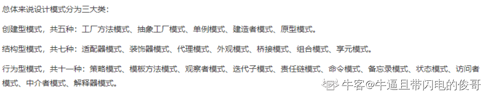

## 谈一谈，你了解的 Java设计模式。

所谓设计模式，就是一套被反复使用的代码设计经验的总结（情境中一个问题经过证实的一个解决方案）。使用设计模式是为了可重用代码、让代码更容易被他人理解、保证代码可靠性。设计模式使人们可以更加简单方便的复用成功的设计和体系结构。将已证实的技术表述成设计模式也会使新系统开发者更加容易理解其设计思路。
在GoF的《Design Patterns: Elements of Reusable Object-Oriented Software》中给出了三类（创建型[对类的实例化过程的抽象化]、结构型[描述如何将类或对象结合在一起形成更大的结构]、行为型[对在不同的对象之间划分责任和算法的抽象化]）共23种设计模式，包括：Abstract Factory（抽象工厂模式），Builder（建造者模式），Factory Method（工厂方法模式），Prototype（原始模型模式），Singleton（单例模式）；Facade（门面模式），Adapter（适配器模式），Bridge（桥梁模式），Composite（合成模式），Decorator（装饰模式），Flyweight（享元模式），Proxy（代理模式）；Command（命令模式），Interpreter（解释器模式），Visitor（访问者模式），Iterator（迭代子模式），Mediator（调停者模式），Memento（备忘录模式），Observer（观察者模式），State（状态模式），Strategy（策略模式），Template Method（模板方法模式）， Chain Of Responsibility（责任链模式）。

## 谈一谈，开发中都用到了 哪些设计模式? 用在什么场合? 

每个模式都描述了一个在我们的环境中不断出现的问题，然后描述了该问题的解决方案的核心。通过这种方式，你可以无数次地使用那些已有的解决方案，无需在重复相同的工作。主要用到了MVC的设计模式。用来开发JSP/Servlet或者J2EE的相关应用。简单工厂模式等。

## 谈一谈 J2EE 的常用 设计模式有哪些？再详细说说工厂模式。

Java中的23种设计模式：
Factory（工厂模式）， Builder（建造模式）， Factory Method（工厂方法模式），Prototype（原始模型模式），Singleton（单例模式）， Facade（门面模式），Adapter（适配器模式）， Bridge（桥梁模式）， Composite（合成模式），Decorator（装饰模式）， Flyweight（享元模式）， Proxy（代理模式），Command（命令模式）， Interpreter（解释器模式）， Visitor（访问者模式），Iterator（迭代子模式）， Mediator（调停者模式）， Memento（备忘录模式），Observer（观察者模式）， State（状态模式）， Strategy（策略模式），Template Method（模板方法模式）， Chain Of Responsibleity（责任链模式）工厂模式：工厂模式是一种经常被使用到的模式，根据工厂模式实现的类可以根据提供的数据生成一组类中某一个类的实例，通常这一组类有一个公共的抽象父类并且实现了相同的方法，但是这些方法针对不同的数据进行了不同的操作。首先需要定义一个基类，该类的子类通过不同的方法实现了基类中的方法。然后需要定义一个工厂类，工厂类可以根据条件生成不同的子类实例。当得到子类的实例后，开发人员可以调用基类中的方法而不必考虑到底返回的是哪一个子类的实例。

## 说说你所熟悉 或听说过的，J2EE中的几种常用模式。再讲讲你对设计模式的一些看法

Session Facade Pattern：使用SessionBean访问EntityBean Message Facade Pattern：实现异步调用EJB Command Pattern：使用Command JavaBeans取代SessionBean，实现轻量级访问Data Transfer Object Factory：通过DTO Factory简化EntityBean数据提供特性Generic Attribute Access：通过AttibuteAccess接口简化EntityBean数据提供特性Business Interface：通过远程（本地）接口和Bean类实现相同接口规范业务逻辑一致性ＥＪＢ架构的设计好坏将直接影响系统的性能、可扩展性、可维护性、组件可重用性及开发效率。项目越复杂，项目队伍越庞大则越能体现良好设计的重要性。

