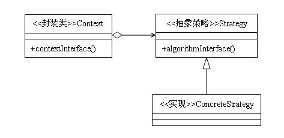
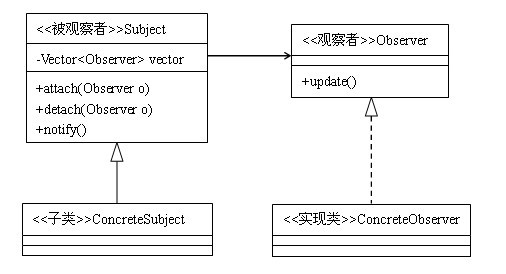

## 请你介绍一下策略模式？

策略模式也叫政策模式，是一种行为型设计模式，是一种比较简单的设计模式。策略模式采用了面向对象的继承和多态机制。略模式适合使用在：1.多个类只有在算法或行为上稍有不同的场景。2.算法需要自由切换的场景。3.需要屏蔽算法规则的场景。 使用策略模式当然也有需要注意的地方，那么就是策略类不要太多，如果一个策略家族的具体策略数量超过4个，则需要考虑混合模式，解决策略类膨胀和对外暴露问题。在实际项目中，我们一般通过工厂方法模式来实现策略类的声明。

优点：算法可以自由切换。2.避免使用多重条件判断。3.扩展性良好。

## 对于设计模式，你了解哪些？请手写一下观察者模式

观察者模式优点：

观察者模式在被观察者和观察者之间建立一个抽象的耦合。被观察者角色所知道的只是一个具体观察者列表，每一个具体观察者都符合一个抽象观察者的接口。被观察者并不认识任何一个具体观察者，它只知道它们都有一个共同的接口。由于被观察者和观察者没有紧密地耦合在一起，因此它们可以属于不同的抽象化层次。如果被观察者和观察者都被扔到一起，那么这个对象必然跨越抽象化和具体化层次。

观察者模式缺点：

如果一个被观察者对象有很多的直接和间接的观察者的话，将所有的观察者都通知到会花费很多时间。

如果在被观察者之间有循环依赖的话，被观察者会触发它们之间进行循环调用，导致系统崩溃。在使用观察者模式是要特别注意这一点。

如果对观察者的通知是通过另外的线程进行异步投递的话，系统必须保证投递是以自恰的方式进行的。

虽然观察者模式可以随时使观察者知道所观察的对象发生了变化，但是观察者模式没有相应的机制使观察者知道所观察的对象是怎么发生变化的。