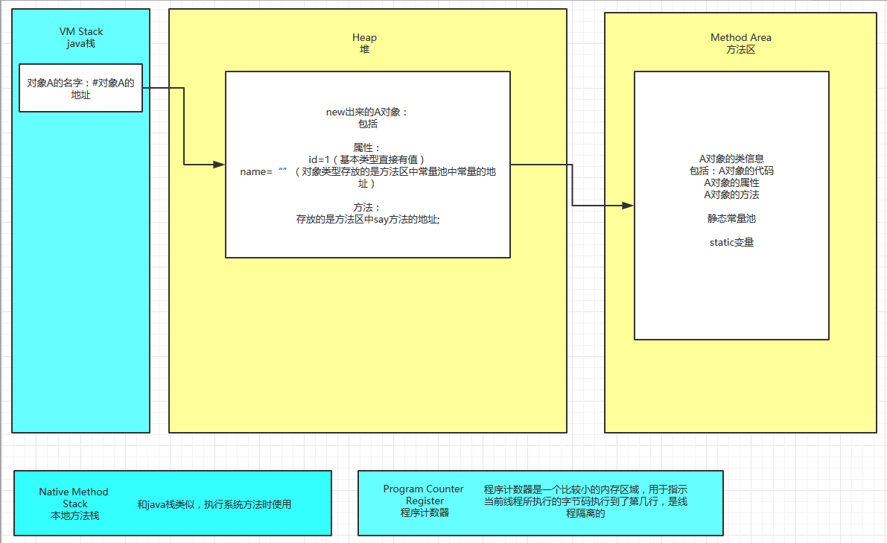
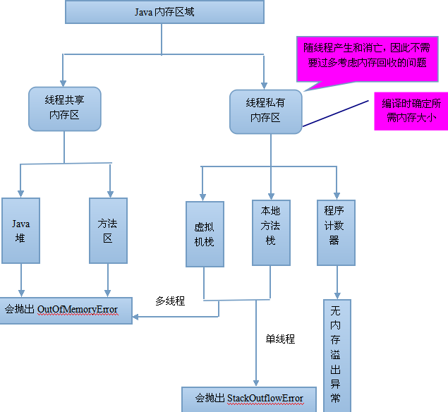
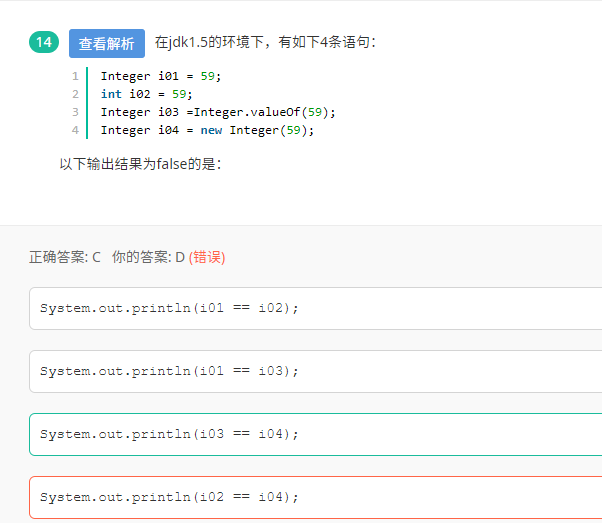
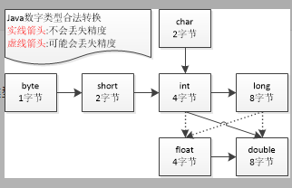
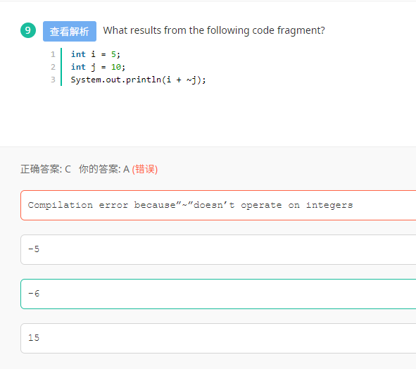

## 1. 关于JVM内存



> 方法区域存放了所加载的类的信息（名称、修饰符等）、类中的静态变量、类中定义为final类型的常量、类中的Field信息、类中的方法信息，当开发人员在程序中通过Class对象中的getName、isInterface等方法来获取信息时，这些数据都来源于方法区域，同时方法区域也是全局共享的，在一定的条件下它也会被GC，当方法区域需要使用的内存超过其允许的大小时，会抛出OutOfMemory的错误信息



> 大多数 JVM 将内存区域划分为 Method Area（Non-Heap）（方法区） ,Heap（堆） , Program Counter Register（程序计数器） ,   VM Stack（虚拟机栈，也有翻译成JAVA 方法栈的）,Native Method Stack  （ 本地方法栈 ），其中Method Area 和  Heap 是线程共享的  ，VM Stack，Native Method Stack  和Program Counter Register  是非线程共享的。为什么分为 线程共享和非线程共享的呢?请继续往下看。
>
> 首先我们熟悉一下一个一般性的 Java 程序的工作过程。一个 Java 源程序文件，会被编译为字节码文件（以 class 为扩展名），每个java程序都需要运行在自己的JVM上，然后告知 JVM 程序的运行入口，再被 JVM 通过字节码解释器加载运行。那么程序开始运行后，都是如何涉及到各内存区域的呢？
>
> 概括地说来，JVM初始运行的时候都会分配好 Method Area（方法区） 和Heap（堆） ，而JVM 每遇到一个线程，就为其分配一个 Program Counter Register（程序计数器） ,   VM Stack（虚拟机栈）和Native Method Stack  （本地方法栈）， 当线程终止时，三者（虚拟机栈，本地方法栈和程序计数器）所占用的内存空间也会被释放掉。这也是为什么我把内存区域分为线程共享和非线程共享的原因，非线程共享的那三个区域的生命周期与所属线程相同，而线程共享的区域与JAVA程序运行的生命周期相同，所以这也是系统垃圾回收的场所只发生在线程共享的区域（实际上对大部分虚拟机来说知发生在Heap上）的原因。

## 2. JDBC statement

> 1. Statement、PreparedStatement和CallableStatement都是接口(interface)。 
> 2. Statement继承自Wrapper、PreparedStatement继承自Statement、CallableStatement继承自PreparedStatement。 
> 3. Statement接口提供了执行语句和获取结果的基本方法； 
>    PreparedStatement接口添加了处理 IN 参数的方法； 
>    CallableStatement接口添加了处理 OUT 参数的方法。 
> 4. a.Statement: 
>    普通的不带参的查询SQL；支持批量更新,批量删除; 
>    b.PreparedStatement: 
>    可变参数的SQL,编译一次,执行多次,效率高; 
>    安全性好，有效防止Sql注入等问题; 
>    支持批量更新,批量删除; 
>    c.CallableStatement: 
>    继承自PreparedStatement,支持带参数的SQL操作; 
>    支持调用存储过程,提供了对输出和输入/输出参数(INOUT)的支持; 
>
> Statement每次执行sql语句，数据库都要执行sql语句的编译 ， 
> 最好用于仅执行一次查询并返回结果的情形，效率高于PreparedStatement。 
>
> PreparedStatement是预编译的，使用PreparedStatement有几个好处 
>
> 1. 在执行可变参数的一条SQL时，PreparedStatement比Statement的效率高，因为DBMS预编译一条SQL当然会比多次编译一条SQL的效率要高。 
> 2. 安全性好，有效防止Sql注入等问题。 
> 3. 对于多次重复执行的语句，使用PreparedStament效率会更高一点，并且在这种情况下也比较适合使用batch； 
> 4. 代码的可读性和可维护性。

## 3. Spring事务

 **事务属性的种类：**  **传播行为、隔离级别、只读和事务超时**

 

**a)**  **传播行为定义了被调用方法的事务边界。**

 

| **传播行为**                  | **意义**                                                     |
| ----------------------------- | ------------------------------------------------------------ |
| **PROPERGATION_MANDATORY**    | **表示方法必须运行在一个事务中，如果当前事务不存在，就抛出异常** |
| **PROPAGATION_NESTED**        | **表示如果当前事务存在，则方法应该运行在一个嵌套事务中。否则，它看起来和 PROPAGATION_REQUIRED** **看起来没什么俩样** |
| **PROPAGATION_NEVER**         | **表示方法不能运行在一个事务中，否则抛出异常**               |
| **PROPAGATION_NOT_SUPPORTED** | **表示方法不能运行在一个事务中，如果当前存在一个事务，则该方法将被挂起** |
| **PROPAGATION_REQUIRED**      | **表示当前方法必须运行在一个事务中，如果当前存在一个事务，那么该方法运行在这个事务中，否则，将创建一个新的事务** |
| **PROPAGATION_REQUIRES_NEW**  | **表示当前方法必须运行在自己的事务中，如果当前存在一个事务，那么这个事务将在该方法运行期间被挂起** |
| **PROPAGATION_SUPPORTS**      | **表示当前方法不需要运行在一个是事务中，但如果有一个事务已经存在，该方法也可以运行在这个事务中** |

 

 

 

 

**b)**  **隔离级别**

**在操作数据时可能带来 3** **个副作用，分别是脏读、不可重复读、幻读。为了避免这 3** **中副作用的发生，在标准的 SQL** **语句中定义了 4** **种隔离级别，分别是未提交读、已提交读、可重复读、可序列化。而在 spring** **事务中提供了 5** **种隔离级别来对应在 SQL** **中定义的 4** **种隔离级别，如下：**

| **隔离级别**                   | **意义**                                                     |
| ------------------------------ | ------------------------------------------------------------ |
| **ISOLATION_DEFAULT**          | **使用后端数据库默认的隔离级别**                             |
| **ISOLATION_READ_UNCOMMITTED** | **允许读取未提交的数据（对应未提交读），可能导致脏读、不可重复读、幻读** |
| **ISOLATION_READ_COMMITTED**   | **允许在一个事务中读取另一个已经提交的事务中的数据（对应已提交读）。可以避免脏读，但是无法避免不可重复读和幻读** |
| **ISOLATION_REPEATABLE_READ**  | **一个事务不可能更新由另一个事务修改但尚未提交（回滚）的数据（对应可重复读）。可以避免脏读和不可重复读，但无法避免幻读** |
| **ISOLATION_SERIALIZABLE**     | **这种隔离级别是所有的事务都在一个执行队列中，依次顺序执行，而不是并行（对应可序列化）。可以避免脏读、不可重复读、幻读。但是这种隔离级别效率很低，因此，除非必须，否则不建议使用。** |

 

 

 

 

**c)**  **只读**

**如果在一个事务中所有关于数据库的操作都是只读的，也就是说，这些操作只读取数据库中的数据，而并不更新数据，那么应将事务设为只读模式（ READ_ONLY_MARKER** **） ,** **这样更有利于数据库进行优化** **。**

**因为只读的优化措施是事务启动后由数据库实施的，因此，只有将那些具有可能启动新事务的传播行为 (PROPAGATION_NESTED** **、 PROPAGATION_REQUIRED** **、 PROPAGATION_REQUIRED_NEW)** **的方法的事务标记成只读才有意义。**

**如果使用 Hibernate** **作为持久化机制，那么将事务标记为只读后，会将 Hibernate** **的 flush** **模式设置为 FULSH_NEVER,** **以告诉 Hibernate** **避免和数据库之间进行不必要的同步，并将所有更新延迟到事务结束。**

**d)**  **事务超时**

**如果一个事务长时间运行，这时为了尽量避免浪费系统资源，应为这个事务设置一个有效时间，使其等待数秒后自动回滚。与设**

**置“只读”属性一样，事务有效属性也需要给那些具有可能启动新事物的传播行为的方法的事务标记成只读才有意义。**

## 3. 关于servlet和gci

> Servlet 与 CGI 的比较
>
> 和CGI程序一样，Servlet可以响应用户的指令(提交一个FORM等等)，也可以象CGI程序一样，收集用户表单的信息并给予动态反馈(简单的注册信息录入和检查错误)。
> 然而，Servlet的机制并不仅仅是这样简单的与用户表单进行交互。传统技术中，动态的网页建立和显示都是通过CGI来实现的，但是，有了Servlet,您可以大胆的放弃所有CGI(perl?php?甚至asp!)，利用Servlet代替CGI,进行程序编写。
>   对比一：当用户浏览器发出一个Http/CGI的请求，或者说 ***调用一个CGI程序的时候，服务器端就要新启用一个进程\*** (而且是每次都要调用)，调用CGI程序越多(特别是访问量高的时候)，就要消耗系统越多的处理时间，只剩下越来越少的系统资源，对于用户来说，只能是漫长的等待服务器端的返回页面了，这对于电子商务激烈发展的今天来说，不能不说是一种技术上的遗憾。
> ***而Servlet充分发挥了服务器端的资源并高效的利用。每次调用Servlet时并不是新启用一个进程\*** ，而是在一个Web服务器的进程敏感词享和分离线程，而线程最大的好处在于可以共享一个数据源，使系统资源被有效利用。
>   对比二：传统的CGI程序，不具备平台无关性特征，系统环境发生变化，CGI程序就要瘫痪，而Servlet具备Java的平台无关性，在系统开发过程中保持了系统的可扩展性、高效性。
>   对比三：传统技术中，一般大都为二层的系统架构，即Web服务器+数据库服务器，导致网站访问量大的时候，无法克服CGI程序与数据库建立连接时速度慢的瓶颈，从而死机、数据库死锁现象频繁发生。而我们的Servlet有连接池的概念，它可以利用多线程的优点，在系统缓存中事先建立好若干与数据库的连接，到时候若想和数据库打交道可以随时跟系统"要"一个连接即可，反应速度可想而知。

## 4. Servlet生命周期

> Servlet的生命周期
>
> 1.加载：容器通过类加载器使用Servlet类对应的文件来加载Servlet
>
> 2.创建：通过**调用Servlet的构造函数来创建一个Servlet实例**
>
> 3.初始化：通过调用Servlet的init()方法来完成初始化工作，**这个方法是在Servlet已经被创建，但在向客户端提供服务之前调用。**
>
> 4.处理客户请求：Servlet创建后就可以处理请求，当有新的客户端请求时，Web容器都会**创建一个新的线程**来处理该请求。接着调用Servlet的
>
> Service()方法来响应客户端请求（Service方***根据请求的method属性来调用doGet（）和doPost（））
>
> 5.卸载：**容器在卸载Servlet之前**需要调用destroy()方法，让Servlet释放其占用的资源。

> init方法： 是在servlet实例创建时调用的方法，用于创建或打开任何与servlet相的资源和初始 化servlet的状态，Servlet规范保证调用init方法前不会处理任何请求 
>
>  service方法：是servlet真正处理客户端传过来的请求的方法，由web容器调用， 根据HTTP请求方法（GET、POST等），将请求分发到doGet、doPost等方法 
>
> destory方法：是在servlet实例被销毁时由web容器调用。Servlet规范确保在destroy方法调用之 前所有请求的处理均完成，需要覆盖destroy方法的情况：释放任何在init方法中 打开的与servlet相关的资源存储servlet的状态

> Servlet是线程不安全的，在Servlet类中可能会定义共享的类变量，这样在并发的多线程访问的情况下，不同的线程对成员变量的修改会引发错误。

## 5. Swing和AWT

> AWT和Swing都是java中的包。
>
> AWT(Abstract Window Toolkit)：抽象窗口工具包，早期编写图形界面应用程序的包。
>
> Swing ：为解决 AWT 存在的问题而新开发的图形界面包。Swing是对AWT的改良和扩展。  
>
> AWT和Swing的实现原理不同：
>     AWT的图形函数与操作系统提供的图形函数有着一一对应的关系。也就是说，当我们利用 AWT构件图形用户界面的时候，实际上是在利用操作系统的图形库。
>     不同的操作系统其图形库的功能可能不一样，在一个平台上存在的功能在另外一个平台上则可能不存在。为了实现Java语言所宣称的"一次编译，到处运行"的概念，AWT不得不通过牺牲功能来实现平台无关性。因此，AWT 的图形功能是各操作系统图形功能的“交集”。
>     因为AWT是依靠本地方法来实现功能的，所以AWT控件称为“重量级控件”。 
>
> ​    而Swing ，不仅提供了AWT 的所有功能，还用纯粹的Java代码对AWT的功能进行了大幅度的扩充。
> ​    例如：并不是所有的操作系统都提供了对树形控件的支持， Swing则利用了AWT中所提供的基本作图方法模拟了一个树形控件。
> ​    由于 Swing是用纯粹的Java代码来实现的，因此Swing控件在各平台通用。
> ​    因为Swing不使用本地方法，故Swing控件称为“轻量级控件”。 
>
> ​    AWT和Swing之间的区别：
> ​    1)AWT 是基于本地方法的C/C++程序，其运行速度比较快；Swing是基于AWT的Java程序，其运行速度比较慢。
> ​    2)AWT的控件在不同的平台可能表现不同，而Swing在所有平台表现一致。
>
> ​    在实际应用中，应该使用AWT还是Swing取决于应用程序所部署的平台类型。例如：
> ​    1)对于一个嵌入式应用，目标平台的硬件资源往往非常有限，而应用程序的运行速度又是项目中至关重要的因素。在这种矛盾的情况下，简单而高效的AWT当然成了嵌入式Java的第一选择。
> ​    2)在普通的基于PC或者是工作站的标准Java应用中，硬件资源对应用程序所造成的限制往往不是项目中的关键因素。所以在标准版的Java中则提倡使用Swing， 也就是通过牺牲速度来实现应用程序的功能。

## 6. Java加载驱动

> 加载驱动方法
>
> 1. Class.forName("com.microsoft.sqlserver.jdbc.SQLServerDriver");
>
> 2. DriverManager.registerDriver(new com.mysql.jdbc.Driver());
>
> 3. System.setProperty("jdbc.drivers", "com.mysql.jdbc.Driver");

## 7. Java自动装箱和拆箱



Integer i01=59 的时候，会调用 Integer 的 valueOf 方法，

```java
  public static Integer valueOf(int i) {
     assert IntegerCache.high>= 127;
     if (i >= IntegerCache.low&& i <= IntegerCache.high)
     return IntegerCache.***[i+ (-IntegerCache.low)];
     return new Integer(i); }
```

这个方法就是返回一个 Integer 对象，只是在返回之前，看作了一个判断，判断当前 i 的值是否在 [-128,127] 区别，且 IntegerCache 中是否存在此对象，如果存在，则直接返回引用，否则，创建一个新的对象。

在这里的话，因为程序初次运行，没有 59 ，所以，直接创建了一个新的对象。

int i02=59 ，这是一个基本类型，存储在栈中。

Integer i03 =Integer.*valueOf*(59); 因为 IntegerCache 中已经存在此对象，所以，直接返回引用。

Integer i04 = **new** Integer(59) ；直接创建一个新的对象。

System. *out* .println(i01== i02); i01 是 Integer 对象， i02 是 int ，这里比较的不是地址，而是值。 Integer 会自动拆箱成 int ，然后进行值的比较。所以，为真。

System. *out* .println(i01== i03); 因为 i03 返回的是 i01 的引用，所以，为真。

System. *out* .println(i03==i04); 因为 i04 是重新创建的对象，所以 i03,i04 是指向不同的对象，因此比较结果为假。

System. *out* .println(i02== i04); 因为 i02 是基本类型，所以此时 i04 会自动拆箱，进行值比较，所以，结果为真。

## 8. Jsp中的静态include和动态include

> 静态的include：是jsp的指令来实现的，<% @ include file="xx.html"%> 特点是 共享request请求域，先包含再编译，不检查包含页面的变化。
>
> 动态的include：是jsp动作来实现的，<jsp:include page="xx.jsp" flush="true"/>  这个是不共享request请求域，先编译在包含，是要检查包含页面的变化的。

## 9. JVM 参数调优

-Xmx10240m：代表最大堆

 -Xms10240m：代表最小堆

 -Xmn5120m：代表新生代

 -XXSurvivorRatio=3：代表Eden:Survivor = 3  根据Generation-Collection算法(目前大部分JVM采用的算法)，一般根据对象的生存周期将堆内存分为若干不同的区域，一般情况将新生代分为Eden ，两块Survivor；   计算Survivor大小， Eden:Survivor = 3，总大小为5120,3x+x+x=5120  x=1024

新生代大部分要回收，采用Copying算法，快！

老年代 大部分不需要回收，采用Mark-Compact算法


## 10. Java String

String有两种实例化方式：

 1. 直接赋值
 2. 使用new关键字

两种实例化方式比较：

- 直接赋值只会开辟一块堆内存空间，并且会自动保存在常量池之***享
- 构造方***开辟两块堆内存空间，不会自动入池，其中一块将成为垃圾，可以用 intern（）方法手动入池

字符串常量是String类的匿名对象


## 11. java concurrent包

A、Semaphore：类，控制某个资源可被同时访问的个数;

B、ReentrantLock：类，具有与使用synchronized方法和语句所访问的隐式监视器锁相同的一些基本行为和语义，但功能更强大；

C、 Future：接口，表示异步计算的结果；

D、 CountDownLatch： 类，可以用来在一个线程中等待多个线程完成任务的类。


## 12. Java Exception

#### **try-catch-finally 规则(** [**异常处理语句的语法规则** ](http://book.51cto.com/art/201009/227791.htm)**）**

1)  必须在 try 之后添加 catch 或 finally 块。try 块后可同时接 catch 和 finally 块，但至少有一个块。

2) 必须遵循块顺序：若代码同时使用 catch 和 finally 块，则必须将 catch 块放在 try 块之后。
3) catch 块与相应的异常类的类型相关。
4) 一个 try 块可能有多个 catch 块。若如此，则执行第一个匹配块。即Java虚拟机会把实际抛出的异常对象依次和各个catch代码块声明的异常类型匹配，如果异常对象为某个异常类型或 其子类的实例，就执行这个catch代码块，不会再执行其他的 catch代码块
5) 可嵌套 try-catch-finally 结构。
6) 在 try-catch-finally 结构中，可重新抛出异常。

7) 除了下列情况，总将执行 finally 做为结束： JVM 过早终止（调用 System.exit(int)）；在 finally 块中抛出一个未处理的异常；计算机断电、失火、或遭遇病毒攻击

由此可以看出，catch只会匹配一个，因为只要匹配了一个，虚拟机就会使整个语句退出


## 13. Java字符写入数量

java采用的uincode编码，两个字节表示一个字符，因此 char型在java中占两个字节，而int型占四个字节，故总共占四个字节


## 14. Java中静态代码块

java初始化的加载顺序为：

父类静态成员变量 父类静态代码块 子类静态成员变量 子类静态代码块 父类非静态成员变量，父类非静态代码块，父类构造函数，子类非静态成员变量，子类非静态代码块，子类构造函数


## 15. Java中数据类型的转型




## 16.Java中的一些概念

- Java中所有错误和异常的父类是java.lang.Throwable

- 基本数据类型不是对象，不能用new的方法获取，但是每个基本数据类型都对应着封装类型，这些封装类型为了解决基本数据类型面向对象用的。

- Java垃圾回收器负责回收无用对象占据的内存资源,但对象没有使用new获取了一块特殊区域，这块特殊区域的回收使用finallize（）


## 17. Java中对象在堆内存中的引用

java中引用类型的实参向形参的传递，只是传递的引用，而不是传递的对象本身。

自己画的图，而且没有visio！直接画图画的！


## 18. Java中的继承


  public和protected都可以作用于子类，但在多态情况下，静态函数调用时编译和运行看左边，所以子父类存在同名静态函数访问的是父类，子类并不能覆盖父类的方法，所以选C


## 19. Java特殊运算符



10原码：0000000000000000,0000000000001010；

~10： 1111111111111111,1111111111110101  变为负数，计算机用补码存储

~10反码：10000000000000000,0000000000001010

~10补码：10000000000000000,0000000000001011，等于 -11