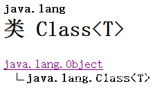
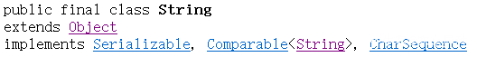
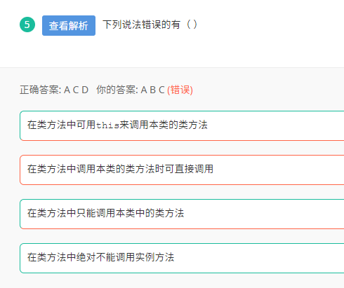

## 1. Java try catch执行顺序

> 在try的括号里面有return一个值，那在哪里执行finally里的代码？
>
> return前执行

> 假设利用 return 语句从 try 语句块中退出。在方法返回前，finally子句的内容将被执行。如果 finally 子句中也有一个 return 语句，这个返回值将会覆盖原始的返回值。

> 1、不管有木有出现异常，finally块中代码都会执行；
>
> 2、当try和catch中有return时，finally仍然会执行；
>
> 3、finally是在return后面的表达式运算后执行的（此时并没有返回运算后的值，而是先把要返回的值保存起来，不管finally中的代码怎么样，返回的值都不会改变，仍然是之前保存的值），所以函数返回值是在finally执行前确定的；
>
> 4、finally中最好不要包含return，否则程序会提前退出，返回值不是try或catch中保存的返回值。

## 2. Java中Integer new和直接引用

> 使用Integer a = 1;或Integer a = Integer.valueOf(1); 在值介于-128至127直接时，作为基本类型。
>
> 使用Integer a = new Integer(1); 时，无论值是多少，都作为对象。

## 3. Java中超类的描述

A.class类是Object的派生类

B.每个类都使用Object类作为超类，而final修饰的类不能被继承

C.

D.Class类中的forName()方法返回与带有给定字符串名的类或接口相关联的Class对象（装载其他类）

## 4. 关于类方法的描述

## 5.Java 提供的事件处理模型是一种人机交互模型。它有三个基本要素

> Java  提供的事件处理模型是一种人机交互模型。它有三个基本要素：
>
> 1) 事件源（Event Source）：即事件发生的场所，就是指各个组件，如按钮等，点击按钮其实就是组件上发生的一个事件；
>
> 2) 事件（Event）：事件封装了组件上发生的事情，比如按钮单击、按钮松开等等；
>
> 3) 事件（Event Listener）：负责监听事件源上发生的特定类型的事件，当事件到来时还必须负责处理相应的事件；

## 6.Java7特性中，abstract class和interface有什么区别

> 针对本题：
>
> 1、抽象类可以有构造，只不过不能new。
>
> 2、接口中可以有变量，但是无论你怎么写，最后都是public static final的。
>
> 3、抽象类中可以有静态方法，接口中也可以有。
>
> 扩展：
>
> 1、接口中可以有非抽象的方法，比如default方法（Java 1.8）。
>
> 2、接口中可以有带方法体的方法。（Java 1.8）
>
> 3、接口中的方法默认是public的。