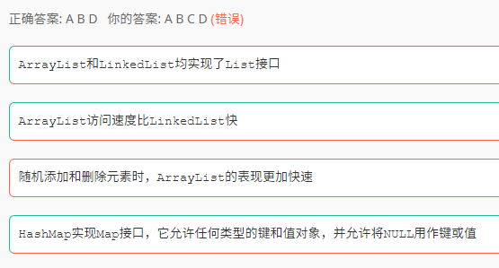
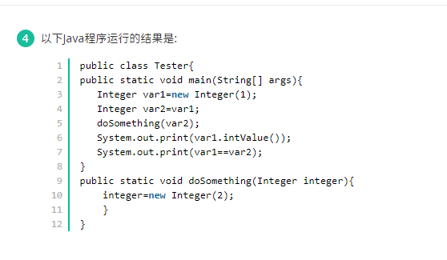
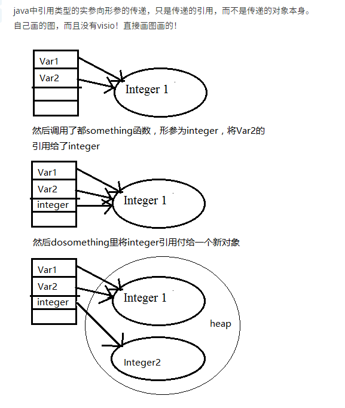
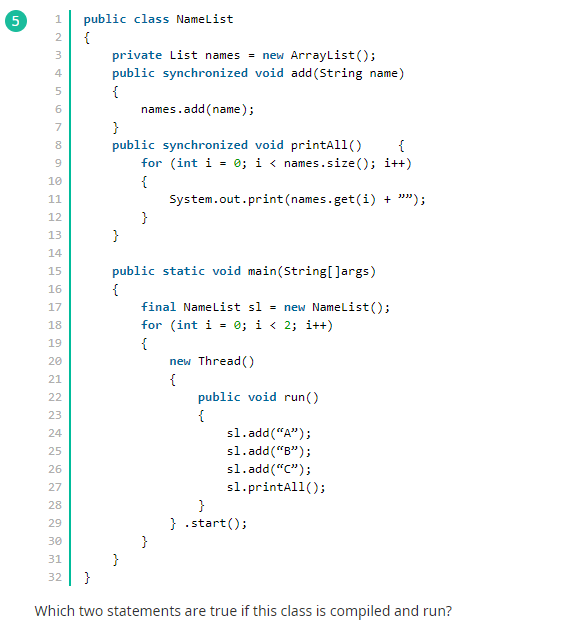
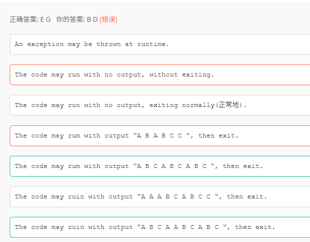

## 1. Java Servlet

> init方法： 是在servlet实例创建时调用的方法，用于创建或打开任何与servlet相的资源和初始 化servlet的状态，Servlet规范保证调用init方法前不会处理任何请求 
>
>  service方法：是servlet真正处理客户端传过来的请求的方法，由web容器调用， 根据HTTP请求方法（GET、POST等），将请求分发到doGet、doPost等方法 
>
> destory方法：是在servlet实例被销毁时由web容器调用。Servlet规范确保在destroy方法调用之 前所有请求的处理均完成，需要覆盖destroy方法的情况：释放任何在init方法中 打开的与servlet相关的资源存储servlet的状态

> Servlet是线程不安全的，在Servlet类中可能会定义共享的类变量，这样在并发的多线程访问的情况下，不同的线程对成员变量的修改会引发错误。

## 2. Java命令行工具

> java,exe是java虚拟机
>
> javadoc.exe用来制作java文档
>
> jdb.exe是java的调试器
>
> javaprof,exe是剖析工具

## 3. JVM

java中的常量池不属于堆内存中的区域，存在于方法区内

>  jvm堆分为：新生代（一般是一个Eden区，两个Survivor区），老年代（old区）

## 4. JVM堆内存溢出


## 5. ArrayList 、 LinkedList 、 HashMap 



- ArrayList和LinkedList均实现了List接口
- ArrayList访问速度比LinkedList快
- HashMap实现Map接口，它允许任何类型的键和值对象，并允许将NULL用作键或值

## 6. Java JVM垃圾回收机制

> 方法调用时，会创建栈帧在栈中，调用完是程序自动出栈释放，而不是gc释放

> JVM 内存可简单分为三个区：
>
> 1、**堆区（heap）**：用于存放所有对象，是线程共享的（注：数组也属于对象）
>
> 2、**栈区（stack）**：用于存放基本数据类型的数据和对象的引用，是线程私有的（分为：虚拟机栈和本地方法栈）
>
> 3、**方法区（method）**：用于存放类信息、常量、静态变量、编译后的字节码等，是线程共享的（也被称为非堆，即 None-Heap）
>
> **Java 的垃圾回收器（GC）主要针对堆区**

## 7. Java中的数据类型

```java
int i = 1000;
float f = 45f;
char s = '\u0639';
Object o = 'f';
String str = "hello";
Double d = 45.0;
```

## 8. Java编译和运行子类和父类之间的关系

编译看左边，运行看右边。 父类型引用指向子类型对象，无法调用只在子类型里定义的方法


## 9. 内部类

```java
public class Enclosingone {
    //非静态内部类
    public class InsideOne {}
    //静态内部类
    public static class InsideTwo{}
}
 
class Mytest02{
    public static void main(String args []){
        Enclosingone.InsideOne obj1 = new Enclosingone().new InsideOne();//非静态内部类对象
        Enclosingone.InsideTwo obj2 = new Enclosingone.InsideTwo();//静态内部类对象
    }
}
```

## 10. Java垃圾回收机制

> Java的垃圾收集机制主要针对新生代和老年代的内存进行回收，不同的垃圾收集算法针对不同的区域。所以java的垃圾收集算法使用的是分代回收。一般java的对象首先进入新生代的Eden区域，当进行GC的时候会回收新生代的区域，新生代一般采用复制收集算法，将活着的对象复制到survivor区域中，如果survivor区域装在不下，就查看老年代是否有足够的空间装下新生代中的对象，如果能装下就装下，否则老年代就执行FULL GC回收自己，老年代还是装不下，就会抛出OUtOfMemory的异常

## 11. 执行语句的循环次数

```java
for(i=0;i<n-1;i++)
    for(j=n;j>i;j--)
        state;
```

n(n+1)/2次

## 12.super.getClass().getName()

返回包名+类名


## 12. 引用传递和值传递

> 引用数据类型是引用传递（call by reference），基本数据类型是值传递（call by value）
>
> 值传递不可以改变原变量的内容和地址---》原因是java方法的形参传递都是传递原变量的副本，在方法中改变的是副本的值，而不适合原变量的
>
> 引用传递不可以改变原变量的地址，但可以改变原变量的内容---》原因是当副本的引用改变时，原变量 的引用并没有发生变化，当副本改变内容时，由于副本引用指向的是原变量的地址空间，所以，原变量的内容发生变化。
>
> 结论：1.值传递不可以改变原变量的内容和地址；
>
> ​      2.引用传递不可以改变原变量的地址，但可以改变原变量的内容；


## 13. 实现了Conllection接口的有

- List
- Vector
- Set

## 14. String.split()

String split 这个方法默认返回一个数组， * 如果没有找到分隔符， * 会把整个字符串当成一个长度为1的字符串数组 * 返回到结果， 所以此处结果就是1 */

## 15. 引用传递和值传递





## 16.多线程问题





> 在每个线程中都是顺序执行的，所以sl.printAll();必须在前三句执行之后执行，也就是输出的内容必有（连续或非连续的）ABC。
>
> 而线程之间是穿插执行的，所以一个线程执行 sl.printAll();之前可能有另一个线程执行了前三句的前几句。
>
> E答案相当于线程1顺序执行完然后线程2顺序执行完。
>
> G答案则是线程1执行完前三句add之后线程2插一脚执行了一句add然后线程1再执行 sl.printAll();输出ABCA。接着线程2顺序执行完输出ABCABC
>
> 输出加起来即为ABCAABCABC。