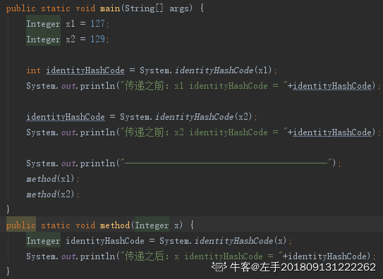
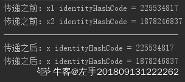
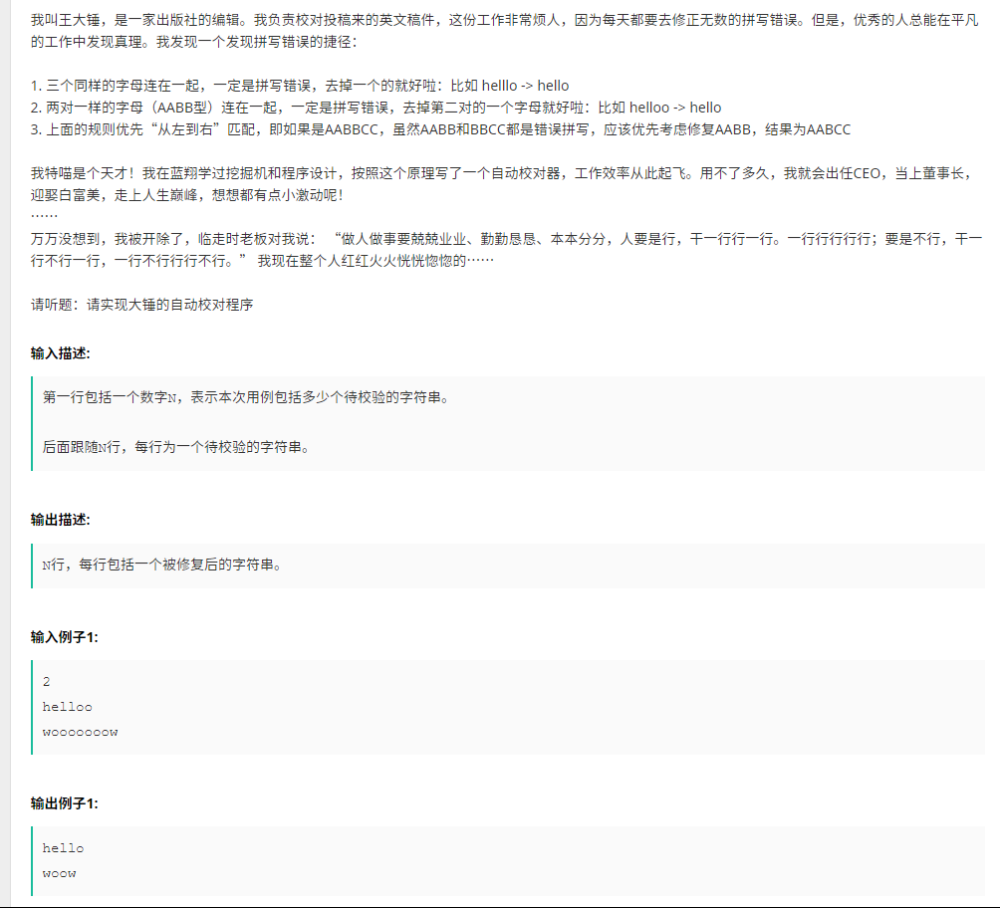
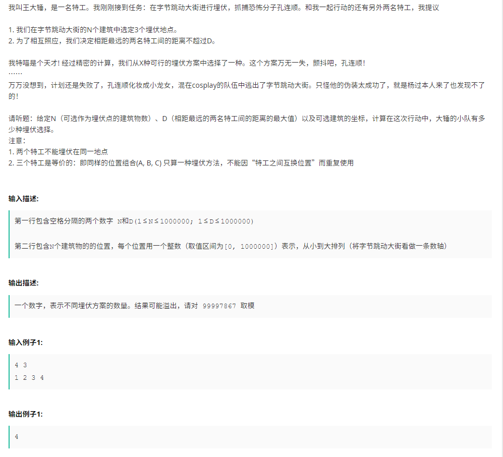
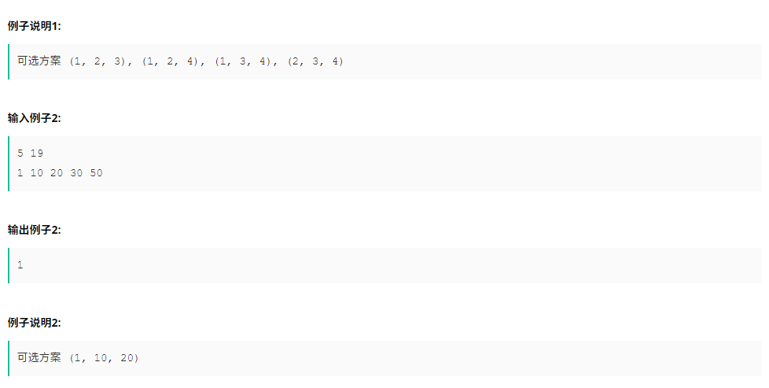

## 1. JVM垃圾回收机制

垃圾收集机制：新生代、老年代、持久代


1，新生代：（1）所有对象创建在新生代的Eden区，当Eden区满后触发新生代的Minor GC，将Eden区和非空闲Survivor区存活的对象复制到另外一个空闲的Survivor区中。（2）保证一个Survivor区是空的，新生代Minor GC就是在两个Survivor区之间相互复制存活对象，直到Survivor区满为止。

2，老年代：当Survivor区也满了之后就通过Minor GC将对象复制到老年代。老年代也满了的话，就将触发Full GC，针对整个堆（包括新生代、老年代、持久代）进行垃圾回收。

3，持久代：持久代如果满了，将触发Full GC。


> full GC触发的条件
> 除直接调用System.gc外，触发Full GC执行的情况有如下四种。
>
> 1. 旧生代空间不足
>    旧生代空间只有在新生代对象转入及创建为大对象、大数组时才会出现不足的现象，当执行Full GC后空间仍然不足，则抛出如下错误：
>    java.lang.OutOfMemoryError: Java heap space
>    为避免以上两种状况引起的FullGC，调优时应尽量做到让对象在Minor GC阶段被回收、让对象在新生代多存活一段时间及不要创建过大的对象及数组。
>  2. Permanet Generation空间满
>       PermanetGeneration中存放的为一些class的信息等，当系统中要加载的类、反射的类和调用的方法较多时，Permanet Generation可能会被占满，在未配置为采用CMS GC的情况下会执行Full GC。如果经过Full GC仍然回收不了，那么JVM会抛出如下错误信息：
>       java.lang.OutOfMemoryError: PermGen space
>       为避免Perm Gen占满造成Full GC现象，可采用的方法为增大Perm Gen空间或转为使用CMS GC。
>  3. CMS GC时出现promotion failed和concurrent mode failure
>       对于采用CMS进行旧生代GC的程序而言，尤其要注意GC日志中是否有promotion failed和concurrent mode failure两种状况，当这两种状况出现时可能会触发Full GC。
>       promotionfailed是在进行Minor GC时，survivor space放不下、对象只能放入旧生代，而此时旧生代也放不下造成的；concurrent mode failure是在执行CMS GC的过程中同时有对象要放入旧生代，而此时旧生代空间不足造成的。
>       应对措施为：增大survivorspace、旧生代空间或调低触发并发GC的比率，但在JDK 5.0+、6.0+的版本中有可能会由于JDK的bug29导致CMS在remark完毕后很久才触发sweeping动作。对于这种状况，可通过设置-XX:CMSMaxAbortablePrecleanTime=5（单位为ms）来避免。
>   4. 统计得到的Minor GC晋升到旧生代的平均大小大于旧生代的剩余空间
>       这是一个较为复杂的触发情况，Hotspot为了避免由于新生代对象晋升到旧生代导致旧生代空间不足的现象，在进行Minor GC时，做了一个判断，如果之前统计所得到的Minor GC晋升到旧生代的平均大小大于旧生代的剩余空间，那么就直接触发Full GC。
>       例如程序第一次触发MinorGC后，有6MB的对象晋升到旧生代，那么当下一次Minor GC发生时，首先检查旧生代的剩余空间是否大于6MB，如果小于6MB，则执行Full GC。
>       当新生代采用PSGC时，方式稍有不同，PS GC是在Minor GC后也会检查，例如上面的例子中第一次Minor GC后，PS GC会检查此时旧生代的剩余空间是否大于6MB，如小于，则触发对旧生代的回收。
>       除了以上4种状况外，对于使用RMI来进行RPC或管理的Sun JDK应用而言，默认情况下会一小时执行一次Full GC。可通过在启动时通过- java-Dsun.rmi.dgc.client.gcInterval=3600000来设置Full GC执行的间隔时间或通过-XX:+ DisableExplicitGC来禁止RMI调用System.gc。

## 2. 修饰符作用域


## 3. JVM垃圾回收机制2


1、在java中，对象的内存在哪个时刻回收，取决于垃圾回收器何时运行。

 2、一旦垃圾回收器准备好释放对象占用的存储空间，将首先调用其finalize()方法， 并且在**下一次**垃圾回收动作发生时，才会**真正的**回收对象占用的内存（《java 编程思想》） 

 3、在C++中，对象的内存在哪个时刻被回收，是可以确定的，在C++中，析构函数和资源的释放息息相关，能不能正确处理析构函数，关乎能否正确回收对象内存资源。

  在java中，对象的内存在哪个时刻回收，取决于垃圾回收器何时运行，在java中，所有的对象，包括对象中包含的其他对象，它们所占的内存的回收都依靠垃圾回收器，因此不需要一个函数如C++析构函数那样来做必要的垃圾回收工作。当然存在本地方法时需要finalize()方法来清理本地对象。在《java编程思想》中提及，finalize()方法的一个作用是用来回收“本地方法”中的本地对象

### finalize()方法

> finalize()是Object的protected方法，子类可以覆盖该方法以实现资源清理工作，GC在回收对象之前调用该方法。    
>   finalize()与C++中的析构函数不是对应的。C++中的析构函数调用的时机是确定的（对象离开作用域或delete掉），但Java中的finalize的调用具有不确定性    
>   不建议用finalize方法完成“非内存资源”的清理工作，但建议用于：① 清理本地对象(通过JNI创建的对象)；② 作为确保某些非内存资源(如Socket、文件等)释放的一个补充：在finalize方法中显式调用其他资源释放方法。

## 4. Java程序的种类

> Application
> ―Java应用程序”是可以独立运行的Java程序。
> 由Java解释器控制执行。
> Applet
>  ―Java小程序”不能独立运行（嵌入到Web页中）。
>  由Java兼容浏览器控制执行。
>
> Serverlets
> 是Java技术对CGI 编程的解决方案。
> 是运行于Web server上的、作为来自于Web browser 或其他HTTP client端的请求和在server上的数据库及其他应用程序之间的中间层程序。
> Serverlets的工作是：
> 读入用户发来的数据（通常在web页的form中）
> 找出隐含在HTTP请求中的其他请求信息（如浏览器功能细节、请求端主机名等。
> 产生结果(调用其他程序、访问数据库、直接计算)
> 格式化结果（网页）
> 设置HTTP response参数(如告诉浏览器返回文档格式)
> 将文档返回给客户端。

## 5. 值类型传递和引用类型的传递

```code
下面这段代码，当 T 分别是引用类型和值类型的时候，分别产生了多少个 T 对象（）
T t = new T();
Func(t);
Func 定义如下：
public void Func(T t) {  }
```



输出的结果是：



与第一种情况不同，参数传递前后使用的是同一个内存地址，所以是引用传递。而且只创建了一个对象。

> 引用类型作为函数的参数时，复制的是引用的地址，不会产生一个新的T；而如果T是值类型，其作为函数实参时会复制其值，也就是产生了一个新的T。

## 6.Java构造函数不能被继承，只能被调用

## 7. String.replaceAll()

由于replaceAll方法的第一个参数是一个正则表达式，而"."在正则表达式中表示任何字符，所以会把前面字符串的所有字符都替换成"/"。如果想替换的只是"."，那么久要写成"\\.".

## 8. Java多线程中的start()和run()

> A. start()方法来启动线程，真正实现了多线程运行，调用了run()方法；run()方法当作普通方法的方式调用。
>
> B. CyclicBarrier让一组线程等待其他线程；CountDownLatch让一组线程等待某个事件发生。
>
> C. Callable能够抛出checked exception。
>
> D. start()方法让thread进去可运行状态（runnable），等待获取CPU的使用权。

# 编程题


## 1.



```java
import java.util.Scanner;

public class StrFix {
    public static void main(String[] args) {
        Scanner sc = new Scanner(System.in);
        int line = sc.nextInt();
        for (int i = 0; i < line; i++) {
            String s = sc.next();
            StringBuilder sb = new StringBuilder();
            for (int j = 0; j < s.length(); j++) {
                if (sb.length() < 2) {
                    sb.append(s.charAt(j));
                    continue;
                }
                if (sb.length() >= 2) {
                    if (s.charAt(j) == sb.charAt(sb.length() - 1) && s.charAt(j)==sb.charAt(sb.length()-2)) {
                        continue;
                    }
                }
                if (sb.length() >= 3) {
                    if (s.charAt(j) == sb.charAt(sb.length() - 1) && sb.charAt(sb.length() - 3) == sb.charAt(sb.length() - 2)) {
                        continue;
                    }
                }
                sb.append(s.charAt(j));
            }
            System.out.println(sb.toString());
        }
    }
}

```

## 2.





```java
import java.util.Scanner;

public class Agents {

    private int mod = 99997867;

    private void sln() {
        Scanner sc = new Scanner(System.in);
        int N = sc.nextInt(), D = sc.nextInt();
        long cnt = 0;
        if (N <= 2) {
            System.out.println(-1);
            return;
        }
        int[] locs = new int[N];
        for (int i = 0; i < N; i++) {
            locs[i] = sc.nextInt();
        }
        sc.close();
        int left = 0, right = 2;
        while (right < N) {
            if (locs[right] - locs[left] > D) left++;
            else if (right - left < 2) right++;
            else {
                cnt += calC(right - left);
                right++;
            }
        }
        cnt %= mod;
        System.out.println(cnt);
    }

    private long calC(long num) {
        return num * (num - 1) / 2;
    }


    public static void main(String[] args) {
        new Agents().sln();
    }
}

```

