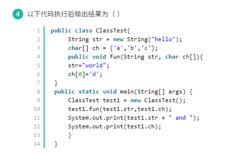

## 1. java常量池和堆



> char[] ch = {'a','b','c'};是数组，数组存放在堆中，所以当方法通过形参修改值时会去堆中修改。当成员变量ch再去访问时，堆中的值已经修改，所以输出dbc。
>
> 
>
> 而String str = new String("hello");会进行两步操作：
>
> 1、JVM先在堆中创建一个指定的String对象"hello"，并让str引用指向该对象。
>
> 2、JVM会在常量池中 **寻找或新建** 一个”hello”，并让堆中对象与之关联。
>
> 所以当方法为形参赋值时（str="world";），只是为形参在常量池中新建一个”world”并引用，也只修改了形参，成员变量str本身未被修改。
>
> 所以，当new了除封装类型以外的对象时，即便通过形参修改对象内部的值也会去堆中修改。
>
> 所以，当String str = new String("hello");时产生了一个String对象，如果常量池没有"hello"常量还会产生一个"hello"常量。
>
> 
>
> Java的栈、堆、常量池和方法区。

## 2. File类和数据流


- File类能够存储文件属性
- File类能够建立文件
- File类能够获取文件目录信息


能够读写文件的是数据流(OutPutStream和InputStream)


> ### File类的一下常用方法和说明
>
> 1.访问文件名相关方法：
>
> - String getName(); 返回此File对象所表示的文件名和路径名（如果是路径，则返回最后一级子路径名）。
>
> - String getPath(); 返回此File对象所对应的路径名。
>
> - File getAbsolutePath(); 返回此File对象所对应的绝对路径名。
>
> - String getParent(); 返回此File对象所对应目录（最后一级子目录）的父路径名。
> - boolean renameTo(File newName); 重命名此File对象所对应的文件或目录，如果重命名成功，则返回true:否则返回false.**（A）**
>
> 2.文件检测相关方法
>
> - boolean exists(); 判断File对象所对应的文件或目录是否存在。
> - boolean canWrite(); 判断File对象所对应的目录或文件是否可写。
> - boolean canRead(); 判断File对象所对应的目录或文件是否可读。
> - boolean isFile(); 判断File对象所对应的是否是文件，而不是目录。
> - boolean isDirectory(); 判断File对象所对应的是否是目录，而不是文件。
> - boolean isAbsolute(); 判断File对象所对应的文件或目录是否是绝对路径。该方法消除了不同平台的差异，可以直接判断File对象是否为绝对路径。在UNIX/Linux/BSD等系统上，如果路径名开头是一条斜线（/）,则表明该File对象对应一个绝对路径；在Windows等系统上，如果路径开头是盘符，则说明它是绝对路径。
>
> 3.获取常规文件信息
>
> - long lastModified(); 返回文件最后修改时间。
> - long length(); 返回文件内容的长度。
>
> 4.文件操作相关的方法
>
> - boolean createNewFile(); 当此File对象所对应的文件不存在时，该方法将新建的一个该File对象所指定的新文件，如果创建成功则返回true；否则返回false.**(C)**
> - boolean delete(); 删除File对象所对应的文件或路径。
> - static File CreateTempFile(String prefix,String suffix);在默认的临时文件目录创建一个临时空文件，使用给定前缀、系统生成的随机数和给定后缀作为文件名。这是一个静态方法，可以直接通过File来调用。preFix参数必须至少是3个字节长。建议前缀使用一个短的、有意义的字符串。建议前缀使用一个短的、有意义的字符串，比如”hjb“ 或”main”. suffix参数可以为null,在这种情况下，将使用默认的后缀”.tmp”.
> - static File CreateTempFile(String prefix,String suffix,File directory);在directory所指定的目录中创建一个临时空文件，使用给定前缀、系统生成的随机数和给定后缀作为文件名。这是一个静态方法，可以直接通过File来调用。
> - void deleteOnExit(); 注册一个删除钩子，指定当Java虚拟机退出时，删除File对象随对应的文件和目录。
>
> 5.目录操作相关方法**（D）**
>
> - boolean mkdir(); 试图创建一个File对象所对应的目录，如果创建成功，则返回true;否则返回false. 调用该方法时File对象必须对应一个路径，而不是一个文件。
> - String[] list(); 列出File对象的所有子文件名和路径名，返回String数组。
> - File[] listFiles(); 列出File对象的所有子文件和路径，返回File数组。
> - static File[] listRoots(); 列出系统所有的根路径。这是一个静态方法，可以直接通过File类来调用。

File类能够操作文件本身，但是不能对文件内容进行修改

## 3. Resultset中记录行的第一列索引为1

## 4. 三元操作符


> 链接：https://www.nowcoder.com/questionTerminal/701d348fec8f4c1893740e253217a65f
> 来源：牛客网
>
> 
>
> 三元操作符如果遇到可以转换为数字的类型，会做自动类型提升。 
>
>   比如 
>
> ```java
> Object o1 = (false) ? new Double(1.0) : new Integer(2); System.out.println(o1);
> ```
>
>  会打印2.0

## 5. ArrayList和Vector主要区别是什么

> Vector与ArrayList一样，也是通过数组实现的，不同的是Vector支持线程的同步

## 6. java静态属性

> 1如果是本类使用，可以直接就用静态变量名。2如果是其他类使用，可以使用类名来调用，也可以创建一个实例对象来调用。3如果静态变量所在的类是静态类，那么不管在本类里或者在其他外部类，都可以直接使用静态变量名。

## 7. Java 的屏幕坐标是以像素为单位，容器的左上角被确定为坐标的起点。

## 8. 设三个整型变量 x = 1 , y = 2 , z = 3，则表达式 y＋＝z－－/＋＋x 的值是(   )。

> y是2，返回的结果是2+（z--/++x），再来看z--/++x，结果应该是3/2，但是因为x,y,z都是int型的，所以最后的返回值只能是int，这时候z--/++x的值就是1，那么最终的结果就是2+1=3

## 9. Servlet周期包括哪些

- 初始化
- 处理请求
- 销毁

## 10.处理流

- DataInputStream
- BufferedInputStream

> 按照流是否直接与特定的地方（如磁盘、内存、设备等）相连，分为节点流和处理流两类。
>
> - 节点流：可以从或向一个特定的地方（节点）读写数据。如FileReader.
> - 处理流：是对一个已存在的流的连接和封装，通过所封装的流的功能调用实现数据读写。如BufferedReader.处理流的构造方法总是要带一个其他的流对象做参数。一个流对象经过其他流的多次包装，称为流的链接。
>
> **JAVA常用的节点流：**
>
> - 文 件 FileInputStream FileOutputStrean FileReader FileWriter 文件进行处理的节点流。
> - 字符串 StringReader StringWriter 对字符串进行处理的节点流。
> - 数 组 ByteArrayInputStream ByteArrayOutputStreamCharArrayReader CharArrayWriter 对数组进行处理的节点流（对应的不再是文件，而是内存中的一个数组）。
> - 管 道 PipedInputStream PipedOutputStream PipedReaderPipedWriter对管道进行处理的节点流。
>
> **常用处理流（关闭处理流使用关闭里面的节点流）**
>
> - 缓冲流：BufferedInputStrean BufferedOutputStream BufferedReader BufferedWriter 增加缓冲功能，避免频繁读写硬盘。
>
> - 转换流：InputStreamReader OutputStreamReader 实现字节流和字符流之间的转换。
> - 数据流 DataInputStream DataOutputStream 等-提供将基础数据类型写入到文件中，或者读取出来.
>
> ### 流的关闭顺序
>
> 1. 一般情况下是：先打开的后关闭，后打开的先关闭
> 2. 另一种情况：看依赖关系，如果流a依赖流b，应该先关闭流a，再关闭流b。例如，处理流a依赖节点流b，应该先关闭处理流a，再关闭节点流b
> 3. 可以只关闭处理流，不用关闭节点流。处理流关闭的时候，会调用其处理的节点流的关闭方法。

## 11. Java基本数据类型

- 四种证书类型
  - byte
  - short
  - int
  - long
- 两种浮点数类型
  - float
  - double
- 一种字符类型
  - char
- 一种布尔类型
  - boolean

> 类型转换：    char-->   自动转换：byte-->short-->int-->long-->float-->double          强制转换：①会损失精度，产生误差，小数点以后的数字全部舍弃。②容易超过取值范围。

> 记忆：8位：Byte（字节型）      16位：short（短整型）、char（字符型）      32位：int（整型）、float（单精度型/浮点型）      64位：long（长整型）、double（双精度型）      最后一个：boolean(布尔类型

## 12.创建方法中会调用构造方法

- new语句创建对象
- java反射机制使用java.lang.Class或java.lang.reflect.Constructor的newInstance()方法

不会调用构造方法的有

- 调用Java.io.ObjectInputStream中的readObject方法
- 调用对象的clone()方法

## 13. Java的main方法

- java是强类型语言，所有的方法必须放在类里面，包括main
- java中可以有多个重载的main方法，只有public static void main(String[] args){}是函数入口
- 内部类的类名一般与文件名不同
- 函数都必须用{}括起来，不管是一条语句还是多条语句