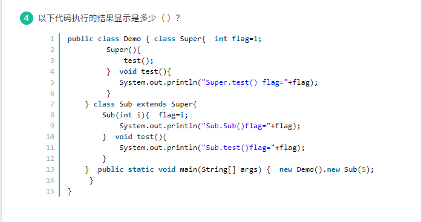

## 1. java类中调用方法

- 在类方法中调用奔雷的类方法时可直接调用

## 2. JDK提供的用于并发编程的同步器有哪些

- Semaphore
- CyclicBarrier
- CountDownLatch

## 3, 在运行时，由于java解释器自动引入，而不用import语句引入的包是

java.lang

## 4. 关于抽象类与最终类

抽象类和最终类被继承时，方法可以被子类覆盖

## 5. Java反射

正确:

- 通过反射可以动态的实现一个接口，形成一个新的类，并可以用这个类创建对象，调用对象方法
- 通过反射，可以突破Java语言提供的对象成员、类成员的保护机制，访问一般方式不能访问的成员
- Java的反射机制会给内存带来额外的开销。例如对永生堆的要求比不通过反射要求的更多

错误:

- Java反射主要涉及的类如Class, Method, Filed,等，他们都在java.lang.reflet包下==(lang包下边)==
- Java反射机制提供了字节码修改的技术，可以动态的修剪一个类==（反射的本质就是从字节码中查找，动态获取类的整容结构，包括属性，构造器，动态调用对象的方法，而不是修剪类）==
- Java反射机制一般会带来效率问题，效率问题主要发生在查找类的方法和字段对象，因此通过缓存需要反射类的字段和方法就能达到与之间调用类的方法和访问类的字段一样的效率==（使用了反射的效率都会降低，就算加了缓存）==

## 6. volatile和synchronized

Volatile能保证数据的可见性，但不能完全保证数据的原子性，synchronized既保证了数据的可见性，也保证了数的原子性

## 7. 正则表达式中，表示匹配非数字字符的字符是 \D

## 8. JMX是在JDK1.3版本开始支持

## 9. Volatile 有序性，可见性

## 10. 类之间存在以下常见的关系

- USERS-A
- HAS-A
- IS-A

> **USES-A：**依赖关系，A类会用到B类，这种关系具有偶然性，临时性。但B类的变化会影响A类。这种在代码中的体现为：A类方法中的参数包含了B类。
>
> **关联关系：**A类会用到B类，这是一种强依赖关系，是长期的并非偶然。在代码中的表现为：A类的成员变量中含有B类。
>
> **HAS-A：**聚合关系，拥有关系，是**关联关系**的一种特例，是整体和部分的关系。比如鸟群和鸟的关系是聚合关系，鸟群中每个部分都是鸟。
>
> **IS-A：**表示继承。父类与子类，这个就不解释了。
>
> 要注意：还有一种关系：**组合关系**也是关联关系的一种特例，它体现一种contains-a的关系，这种关系比聚合更强，也称为强聚合。它同样体现整体与部分的关系，但这种整体和部分是不可分割的。

## 11. 在Java语言中，下列关于字符集编码（Character set encoding）和国际化（i18n）的问题

> Java默认使用Unioncode编码，即不论什么语言都是一个字符占两个字节
>
> Java的class文件编码为UTF-8，而虚拟机JVM编码为UTF-16
>
> UTF-8编码下，一个中文占3个字节，一个英文占1个字节
>
> Java中的char默认采用Unicode编码，所以Java中char占2个字节
>
> 1(byte)字节=8(bit)位

## 12. 关于Java的一些概念

- java异常和错误的基类Throwable,包括Exception和Error
- try...catch...finally finally不管什么异常都会执行
- java是面向对象的，但是不是所有的都是对象，基本数据类型就不是对象，所以才会有封装类的；
- 如果是等待清理队列中如果又被调用，则不会执行finallize方法
- JAVA跨平台性  实现在任意平台的java程序都可以在其他平台运行
- synchronized实现方式：三种

## 13. What might cause the current thread to stop or pause executing（可能导致当前线程停止或暂停执行的原因）

> 一个InterruptedException 异常被捕获  大家都知道的嘛 （一般通过interrupt方法 中断线程）  如果抓到一个线程  都会关紧catch里面 然后中断当前操作
>
> 线程执行了wait()方法。  线程使用了wait方法，会强行打断当前操作，（暂停状态，不会中断线程） 进入阻塞（暂停）状态，然后需要notify方法或notifyAll方法才能进入就绪状态
>
> 当前线程创建了一个新的线程。  新创建的线程不会抢占时间片，只有等当前线程把时间片用完，其他线程才有资格拿到时间片去执行。
>
> 一个高优先级别的线程就绪。  如C相同，你优先级别再高 也待等我现在弄完才会给你
>
> 线程在MediaTracker上执行了waitforID（）调用。  

## 14. 如果一个接口Glass有个方法setColor()，有个类BlueGlass实现接口Glass

> JAVA 子类重写继承的方法时,不可以降低方法的访问权限，子类继承父类的访问修饰符要比父类的更大，也就是更加开放，假如我父类是protected修饰的，其子类只能是protected或者public，绝对不能是friendly(默认的访问范围)或者private，当然使用private就不是继承了。还要注意的是，继承当中子类抛出的异常必须是父类抛出的异常的子异常，或者子类抛出的异常要比父类抛出的异常要少。

## 15. 下面有关java threadlocal说法正确的有

- ThreadLocal存放的值是线程封闭，线程间互斥的，主要用于线程内共享一些数据，避免通过参数来传递
- 从线程的角度看，每个线程都保持一个对其线程局部变量副本的隐式引用，只要线程是活动的并且 ThreadLocal 实例是可访问的；在线程消失之后，其线程局部实例的所有副本都会被垃圾回收
- 在Thread类中有一个Map，用于存储每一个线程的变量的副本
- 对于多线程资源共享的问题，同步机制采用了“以时间换空间”的方式，而ThreadLocal采用了“以空间换时间”的方式

## 16. Math.round()

> round函数是取最接近整数，如果遇到一样近，则取最大值。

## 17. Java继承

> 在继承中代码的执行顺序为：1.父类静态对象，父类静态代码块
>
> ​                        2.子类静态对象，子类静态代码块
>
> ​                        3.父类非静态对象，父类非静态代码块
>
> ​                        4.父类构造函数
>
> ​                        5.子类非静态对象，子类非静态代码块
>
> ​                        6.子类构造函数
>
> 对于本题来说：在只想**new** Sub(5)的时候，父类先初始化了 int flag = 1，然后执行父类的构造函数Super（），父类构造函数中执行的test（）方法，因子类是重写了test（）方法的，因此父类构造函数中的test（）方法实际执行的是子类的test（）方法，所以输出为Sub.test() flag=1，接着执行子类构造函数Sub(5) 将flag赋值为5，因此输出结果Sub.Sub() flag=5。

## 18. 关于变量及其范围的陈述

> 类的成员变量包括实例变量和类变量（静态变量）,成员方法包括实例方法和类方法（静态方法）
>
> 类变量（静态变量）用关键字static声明
>
> 方法中的局部变量在方法被调用加载时开始入栈时创建，方法入栈创建栈帧包括局部变量表操作数栈，局部变量表存放局部变量，并非在执行该方法时被创建
>
> 局部变量被使用前必须初始化，否则程序报错。