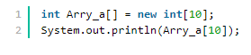
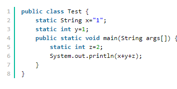
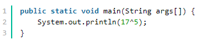

## 1. 截止JDK1.8版本，java并发框架支持锁包括

>1、自旋锁 ,自旋，jvm默认是10次吧，有jvm自己控制。for去争取锁
>
>2、阻塞锁 被阻塞的线程，不会争夺锁。
>
>3、可重入锁 多次进入改锁的域
>
>4、读写锁
>
>5、互斥锁 锁本身就是互斥的
>
>6、悲观锁 不相信，这里会是安全的，必须全部上锁
>
>7、乐观锁 相信，这里是安全的。
>
>8、公平锁 有优先级的锁
>
>9、非公平锁 无优先级的锁
>
>10、偏向锁 无竞争不锁，有竞争挂起，转为轻量锁
>
>11、对象锁 锁住对象
>
>12、线程锁
>
>13、锁粗化 多锁变成一个，自己处理
>
>14、轻量级锁 CAS 实现
>
>15、锁消除 偏向锁就是锁消除的一种
>
>16、锁膨胀 jvm实现，锁粗化
>
>17、信号量 使用阻塞锁 实现的一种策略
>
>18、排它锁：X锁，若事务T对数据对象A加上X锁，则只允许T读取和修改A，其他任何事务都不能再对A加任何类型的锁，直到T释放A上的锁。这就保证了其他事务在T释放A上的锁之前不能再读取和修改A。

## 2.  数组下标问题

下面所示的java代码，运行时，会产生（）类型的异常



```
ArrayIndexOutOfBoundsException
```

定义的数组长度为10，角标即为0-9

访问数组角标10会出现数组角标越界异常

## 3. 关于抽象类和接口

> ### 抽象类
>
> 特点:
> 1.抽象类中可以构造方法
> 2.抽象类中可以存在普通属性，方法，静态属性和方法。
> 3.抽象类中可以存在抽象方法。
> 4.**如果一个类中有一个抽象方法，那么当前类一定是抽象类；抽象类中不一定有抽象方法。**
> 5.抽象类中的抽象方法，需要有子类实现，**如果子类不实现，则子类也需要定义为抽象的。**
> 6,**抽象类不能被实例化，抽象类和抽象方法必须被abstract修饰**
>
> 关键字使用注意：
> 抽象类中的抽象方法（其前有abstract修饰）不能用private、static、synchronized、native访问修饰符修饰。
>
> ### 接口
>
> 1.在接口中只有方法的声明，没有方法体。
> 2.**在接口中只有常量，因为定义的变量，在编译的时候都会默认加上public static final**
> 3.**在接口中的方法，永远都被public来修饰**。
> 4.**接口中没有构造方法，也不能实例化接口的对象**。（所以接口不能继承类）
> 5.接口可以实现多继承
> 6.**接口中定义的方法都需要有实现类来实现，如果实现类不能实现接口中的所有方法则实现类定义为抽象类。**
> 7，接口可以继承接口，用extends

> 1、抽象类和方法都不能被实例化
>
> 2、抽象类可以实现接口
>
> 3、抽象类方法默认访问权限都是default
>
> 4、接口就是访问的，默认访问权限都是public

## 4. char类型和int，String之间的转化

```java
public static String toString(char c) { return String.valueOf(c); }
 public static String valueOf(char c) { char data[] = {c};  return new String(data, true); }
```

返回的都是字符串,只有char变成 int 的时候才会变为对应的assic码

## 5.Java中的静态变量

被static修饰的变量称为静态变量，静态变量属于整个类，而局部变量属于方法，只在该方法内有效，所以static不能修饰局部变量



会出现编译错误

## 6. Java中的^



> 位异运算符号。
>
> 运算规则是：两个数转为二进制，然后从高位开始比较，如果相同则为0，不相同则为1。
>
> 17：0001 0001
>
> 5： 0000 0101结果：0001 0100 转10进制：20

## 7. 关于Maven和Ant

> Ant和Maven都是基于Java的构建(build)工具。理论上来说，有些类似于（Unix）C中的make ，但没有make的缺陷。Ant是软件构建工具，Maven的定位是软件项目管理和理解工具。
> Ant特点
>
>  ›没有一个约定的目录结构 
>
> ›必须明确让ant做什么，什么时候做，然后编译，打包 
>
> ›==没有生命周期==，必须定义目标及其实现的任务序列 
>
> ›没有集成依赖管理
>
> Maven特点
> ›拥有约定，知道你的代码在哪里，放到哪里去 
>
> ›拥有一个生命周期，例如执行 mvn install 就可以自动执行编译，测试，打包等构建过程 
>
> ›只需要定义一个pom.xml,然后把源码放到默认的目录，Maven帮你处理其他事情 
>
> ›拥有依赖管理，仓库管理

## 8.Servlet service

doget/dopost与Http协议有关，是在 javax.servlet.http.HttpServlet 中实现的


> GenericServlet 抽象类 给出了设计 servlet 的一些骨架，定义了 servlet 生命周期，还有一些得到名字、配置、初始化参数的方法，其设计的是和应用层协议无关的

## 9. Java内部类，匿名内部类，局部内部类

> 在Java中，可以将一个类定义在另一个类里面或者一个方法里边，这样的类称为内部类，广泛意义上的内部类一般包括四种：成员内部类，局部内部类，匿名内部类，静态内部类 。
>
> 1.成员内部类
>
> （1）该类像是外部类的一个成员，可以无条件的访问外部类的所有成员属性和成员方法（包括private成员和静态成员）；
>
> （2）成员内部类拥有与外部类同名的成员变量时，会发生隐藏现象，即默认情况下访问的是成员内部类中的成员。如果要访问外部类中的成员，需要以下形式访问：【外部类.this.成员变量  或  外部类.this.成员方法】；
>
> （3）在外部类中如果要访问成员内部类的成员，必须先创建一个成员内部类的对象，再通过指向这个对象的引用来访问；
>
> （4）成员内部类是依附外部类而存在的，也就是说，如果要创建成员内部类的对象，前提是必须存在一个外部类的对象；
>
> （5）内部类可以拥有private访问权限、protected访问权限、public访问权限及包访问权限。如果成员内部类用private修饰，则只能在外部类的内部访问；如果用public修饰，则任何地方都能访问；如果用protected修饰，则只能在同一个包下或者继承外部类的情况下访问；如果是默认访问权限，则只能在同一个包下访问。外部类只能被public和包访问两种权限修饰。
>
> 2.局部内部类
>
> （1）局部内部类是定义在一个方法或者一个作用域里面的类，它和成员内部类的区别在于局部内部类的访问仅限于方法内或者该作用域内；
>
> （2）局部内部类就像是方法里面的一个局部变量一样，是不能有public、protected、private以及static修饰符的。
>
> 3.匿名内部类
>
> （1）一般使用匿名内部类的方法来编写事件监听代码；
>
> （2）匿名内部类是不能有访问修饰符和static修饰符的；
>
> （3）匿名内部类是唯一一种没有构造器的类；
>
> （4）匿名内部类用于继承其他类或是实现接口，并不需要增加额外的方法，只是对继承方法的实现或是重写。
>
> 4.内部静态类
>
> （1）静态内部类是不需要依赖于外部类的，这点和类的静态成员属性有点类似；
>
> （2）不能使用外部类的非static成员变量或者方法。

## 10. Java多线程

> 抛InterruptedException的代表方法有：
>
> - java.lang.Object 类的 wait 方法
> - java.lang.Thread 类的 sleep 方法
> - java.lang.Thread 类的 join 方法

> 当线程在活动之前或活动期间处于正在等待、休眠或占用状态且该线程被中断时，抛出该异常。

## 11. Java HashMap和Hashtable

> 1、继承不同。public class Hashtable extends Dictionary implements Map
>
>  public class HashMap extends AbstractMap implements Map
>
> 2、Hashtable 中的方法是同步的，而HashMap中的方法在缺省情况下是非同步的。在多线程并发的环境下，可以直接使用Hashtable，但是要使用HashMap的话就要自己增加同步处理了。
>
> 3、Hashtable中，key和value都不允许出现null值。
>
> 在HashMap中，null可以作为键，这样的键只有一个；可以有一个或多个键所对应的值为null。当get()方法返回null值时，即可以表示 HashMap中没有该键，也可以表示该键所对应的值为null。因此，在HashMap中不能由get()方法来判断HashMap中是否存在某个键， 而应该用containsKey()方法来判断。
>
> 4、两个遍历方式的内部实现上不同。
>
> Hashtable、HashMap都使用了 Iterator。而由于历史原因，Hashtable还使用了Enumeration的方式 。
>
> 5、哈希值的使用不同，HashTable直接使用对象的hashCode。而HashMap重新计算hash值。
>
> 6、Hashtable和HashMap它们两个内部实现方式的数组的初始大小和扩容的方式。HashTable中hash数组默认大小是11，增加的方式是 old*2+1。HashMap中hash数组的默认大小是16，而且一定是2的指数 

> collection
>
>   -----List
>
> ​        -----LinkedList   非同步
>
> ​        ----ArrayList    非同步，实现了可变大小的元素数组
>
> ​        ----Vector      同步      
>
>   -----Set  不允许有相同的元素
>
>  Map
>
>   -----HashTable    同步，实现一个key--value映射的哈希表，key和value都不允许出现null值
>
>   -----HashMap      非同步，
>
>   -----WeakHashMap  改进的HashMap，实现了“弱引用”，如果一个key不被引用，则被GC回收
>
> 注：
>
> List接口中的对象按一定顺序排列，允许重复 
> Set接口中的对象没有顺序，但是不允许重复 
> Map接口中的对象是key、value的映射关系，key不允许重复

> 总结一下HashMap和Hashtable的区别：
>
>   （1）HashMap是Hashtable的轻量级实现，它们都实现了Map接口，主要区别在于**HashMap允许空（null）键值（key）**，而**Hashtalbe不允许**。
>
>   （2）HashMap没有contains方法，而是**containsValue和containsKey**。
>
>   （3）**Hashtable的方法是线程安全的，而HashMap不是线程安全的。**
>
>   （4）HashMap使用Iterator，Hashtable使用Enumeration。
>
>   （5）HashMap和Hashtable采用的hash/rehash算法都几乎一样，所以性能不会有很大的差异。
>
>   （6）在Hashtable中，hash数组默认大小是11，增加的方式是old*2+1。在Has和Map中，hash数组的默认大小是16，而且一定是2的倍数。
>
>   （7）hash值的使用不同，Hashtable直接使用对象的hashCode。

## 12. 如果Child extends Parent

- 如果Child是interface，那么parent必然是interface
- 如果Child是interface， 那么Child可以同时extends Parent1, Parent2
- 如果Child是class，并且没有显示声明任何构造函数，那么此时仍然会调用Parent的构造函数

> A 可以调用父类无参的构造函数，子类的有参构造函数和是否调用父类的有参数的构造函数无必然联系。
>
> B 接口继承的时候只能继承接口不能继承类，因为如果类可以存在非抽象的成员，如果接口继承了该类，那么接口必定从类中也继承了这些非抽象成员，这就和接口的定义相互矛盾，所以接口继承时只能继承接口。
>
> C 接口可以多继承可以被多实现，因为接口中的方法都是抽象的，这些方法都被实现的类所实现，即使多个父接口中有同名的方法，在调用这些方法时调用的时子类的中被实现的方法，不存在歧义；同时，接口的中只有静态的常量，但是由于静态变量是在编译期决定调用关系的，即使存在一定的冲突也会在编译时提示出错；而引用静态变量一般直接使用类名或接口名，从而避免产生歧义，因此也不存在多继承的第一个缺点。 对于一个接口继承多个父接口的情况也一样不存在这些缺点。所以接口可以多继承。
>
> D 子类即使没有显示构造函数，也会有个无参数的默认构造函数，仍然会调用父类的构造函数。

## 13. Java中Final类型

> StringBuilder , StringBuffer ,String 都是 final 的

## 14. JDK提供的用于并发编程的同步器

> 同步器是一些使线程能够等待另一个线程的对象，允许它们协调动作。最常用的同步器是CountDownLatch和Semaphore，不常用的是Barrier 和Exchanger

> A.  semaphore:信号量。用于表示共享资源数量。用acquire()获取资源，用release()释放资源。
>
> B.  CyclicBarrier  线程到达屏障后等待，当一组线程都到达屏障后才一起恢复执行
>
> C. CountDownLatch  初始时给定一个值，每次调用countDown值减1，当值为0时阻塞的线程恢复执行
>
> D. Counter，反正不是同步器