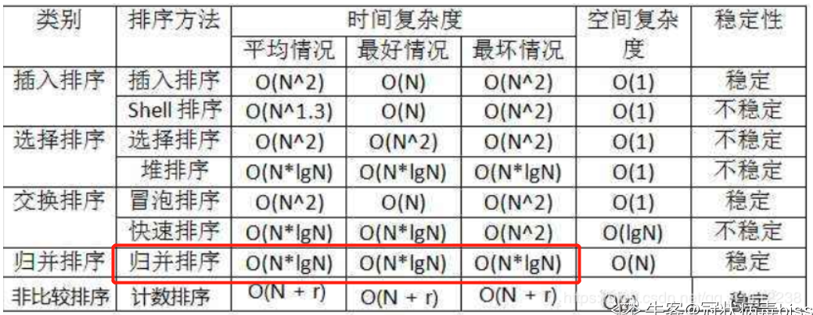
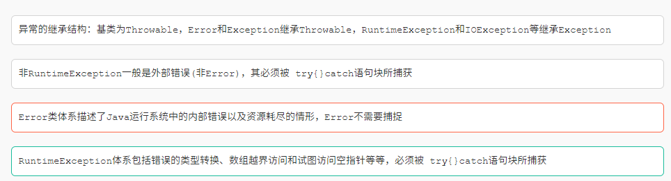
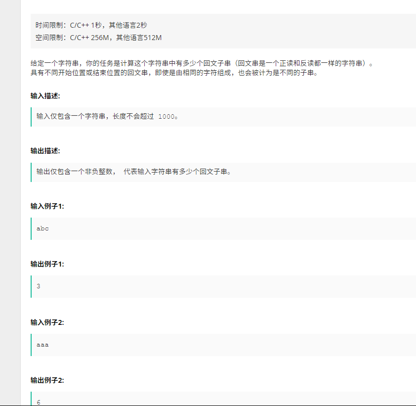
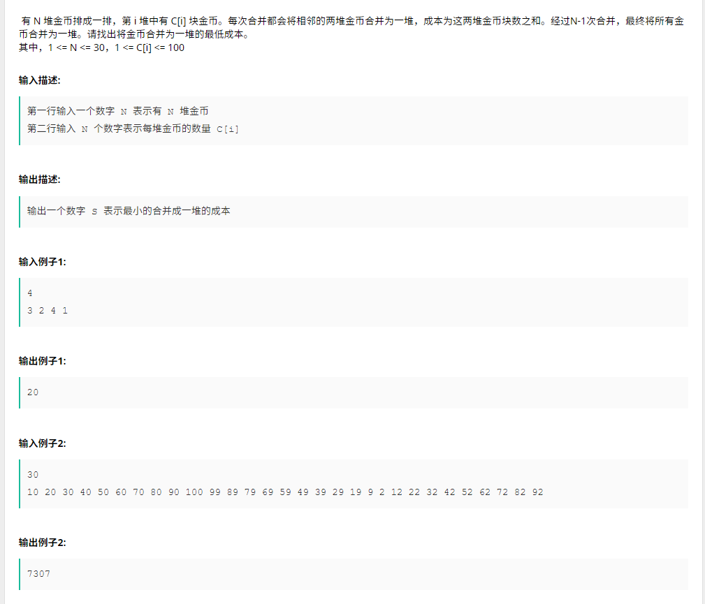
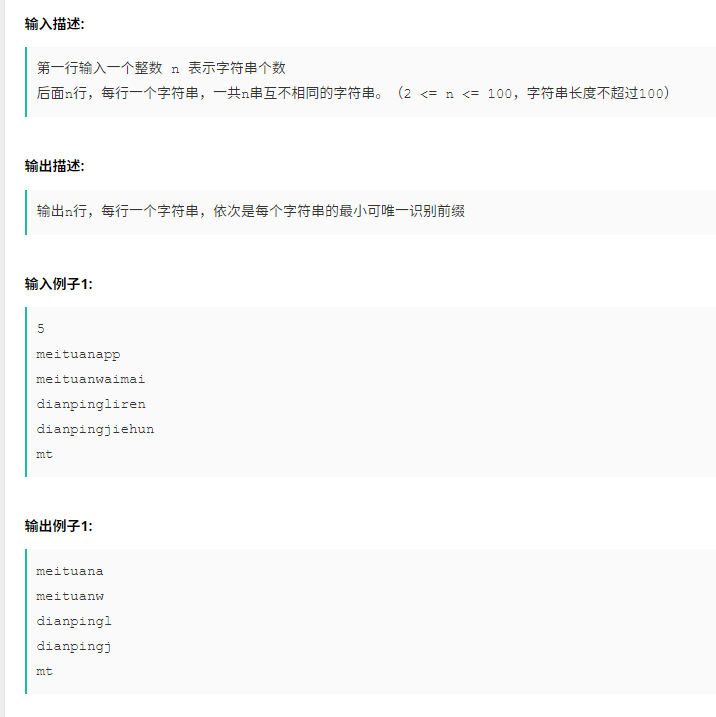

## 1. 类方法中不可以直接调用对象变量

> 静态方法中不能调用对象的变量，因为静态方法在类加载时就初始化，对象变量需要在新建对象后才能使用

## 2. 常用排序算法的时间复杂度和空间复杂度以及不稳定性



## 3. 数据结构

- 直接选择排序是一种不稳定的排序方法
- 哈夫曼树带权路径长短最短的树，路劲上权值较大的节点离根较近
- 当从一个最小堆中删除一个元素时，需要把堆尾元素填补到堆顶位置，然后再按条件把它逐层向下调整到合适位置
- 拓扑排序是指结点值得有序排序（==错误==）

## 4. 在公司局域网上ping www.iwhalecloud.com没有涉及到的网络协议是：（  ）

- DNS
- ICMP(**ping使用了icmp**)
- ARP

## 5.在支持多线程的系统中，进程P创建的若干个线程不能共享的是

进程P中某线程的栈指针(栈中的东西都不共享)

## 6.降低进程优先级的合理时机是:进程的时间片用完

## 7. 有关JAVA异常类的描述



D错误，空指针不用捕获

## 8. final, finally, finalize的区别

> final 用于声明属性，方法和类，分别表示属性不可变，方法不可覆盖，类不可继承 finally是异常处理语句结构的一部分，表示总是执行 finalize是Object类的一个方法，在垃圾收集器执行的时候会调用被回收对象的此方法，可以覆盖此方法提供垃圾收集时的其他资源回收，例如关闭文件等

## 9. sleep() 和 wait() 有什么区别?

> sleep是线程类（Thread）的方法，导致此线程暂停执行指定时间，给执行机会给其他线程，但是监控状态依然保持，到时后会自动恢复。调用sleep不会释放对象锁。 wait是Object类的方法，对此对象调用wait方法导致本线程放弃对象锁，进入等待此对象的等待锁定池，只有针对此对象发出notify方法（或notifyAll）后本线程才进入对象锁定池准备获得对象锁进入运行状态。

## 10. 请阐述数据库事务的几大特性，针对数据库事务，以mysql为例，该数据库有几种隔离级别，请阐述每种隔离级别所产生的效果。

(1)原子性（Atomicity） 　　原子性是指事务包含的所有操作要么全部成功，要么全部失败回滚，这和前面两篇博客介绍事务的功能是一样的概念，因此事务的操作如果成功就必须要完全应用到数据库，如果操作失败则不能对数据库有任何影响。 

⑵ 一致性（Consistency） 　　一致性是指事务必须使数据库从一个一致性状态变换到另一个一致性状态，也就是说一个事务执行之前和执行之后都必须处于一致性状态。 　　拿转账来说，假设用户A和用户B两者的钱加起来一共是5000，那么不管A和B之间如何转账，转几次账，事务结束后两个用户的钱相加起来应该还得是5000，这就是事务的一致性。 ⑶ 隔离性（Isolation） 　　隔离性是当多个用户并发访问数据库时，比如操作同一张表时，数据库为每一个用户开启的事务，不能被其他事务的操作所干扰，多个并发事务之间要相互隔离。 　　即要达到这么一种效果：对于任意两个并发的事务T1和T2，在事务T1看来，T2要么在T1开始之前就已经结束，要么在T1结束之后才开始，这样每个事务都感觉不到有其他事务在并发地执行。 　　关于事务的隔离性数据库提供了多种隔离级别，稍后会介绍到。

⑷ 持久性（Durability） 　　持久性是指一个事务一旦被提交了，那么对数据库中的数据的改变就是永久性的，即便是在数据库系统遇到故障的情况下也不会丢失提交事务的操作。 例如我们在使用JDBC操作数据库时，在提交事务方法后，提示用户事务操作完成，当我们程序执行完成直到看到提示后，就可以认定事务以及正确提交，即使这时候数据库出现了问题，也必须要将我们的事务完全执行完成，否则就会造成我们看到提示事务处理完毕，但是数据库因为故障而没有执行事务的重大错误。 

隔离级别 :

① Serializable (串行化)：可避免脏读、不可重复读、幻读的发生。

② Repeatable read (可重复读)：可避免脏读、不可重复读的发生。

③ Read committed (读已提交)：可避免脏读的发生。

④ Read uncommitted (读未提交)：最低级别，任何情况都无法保证。

## 11. 输入一个int型整数，按照从右向左的阅读顺序，返回一个不含重复数字的新的整数。

```java
import java.util.*;
public class Main{
    public static void main(String[] arsg){
        Scanner s = new Scanner(System.in);
        int a = s.nextInt();
        StringBuilder sb = new StringBuilder();
        int[] used = new int[10];
        while(a != 0){
            int t = a % 10;
            a = a / 10;
            if(used[t] != 1){
                sb.append(t);
                used[t] = 1;
            }
        }
        System.out.println(sb);
    }
}
```

## 12. 有n个学生站成一排，每个学生有一个能力值，牛牛想从这n个学生中按照顺序选取k名学生，要求相邻两个学生的位置编号的差不超过d，使得这k个学生的能力值的乘积最大，你能返回最大的乘积吗？

```java
import java.util.*;
 
public class Test {
        //判断正负
    public static boolean zf = true;
 
    public static void main(String[] args) {
         
        Scanner scanner = new Scanner(System.in);
        int n = scanner.nextInt();
        List<Integer> a = new ArrayList<Integer>();
        for(int i = 0; i < n; i++) {
            a.add(scanner.nextInt());
        }
        int k = scanner.nextInt();
        int d = scanner.nextInt();
         
        System.out.println(max(a, k, d));
         
    }
     
        //取最大的值
    public static int max(List<Integer> a) {
        int max = a.get(0);
        int min = a.get(0);
        for(int i = 0; i < a.size(); i++) {
            if(a.get(i) > max) {
                max = a.get(i);
            }
            if(a.get(i) < min) {
                min = a.get(i);
            }
        }
                //如果是正数取最大值，负数取最小值
        if(zf){
            return max;
        } else {
            return min;
        }
    }
     
     
    public static int max(List<Integer> a, int k, int d){
         
        if(k == 1) {
            return max(a);
        }
         
        int max = 0;
         
        for(int i = 0; i < a.size(); i++){
                        //根据d取下一个值的范围
            int begin = i - d >= 0 ? i - d : 0;
            int end = i + d + 1 <= a.size() ? i + d + 1 : a.size();
            List<Integer> b = new ArrayList<Integer>();
            for(int j = begin; j < end; j++) {
                if(j != i) {
                    b.add(a.get(j));
                }
            }
            if(a.get(i) >= 0) {
                zf = true;
            } else {
                zf = false;
            }
            int tmp = a.get(i) * max(b, k - 1, d);
            if(i == 0) max = tmp;
            if(tmp > max) {
                max = tmp;
            }
        }
         
        return max;
    }
     
}
```

## 13. 大数加法


```java
import java.math.BigInteger;
import java.util.*;
public class Main {
 
    public static void main(String[] args) {
        Scanner input=new Scanner(System.in);
        String num1 = input.nextLine();
        num1=num1.substring(1,num1.length()-1);
        String num2 = input.nextLine();
        num2=num2.substring(1,num2.length()-1);
        BigInteger add=new BigInteger(num1).add(new BigInteger(num2));
        System.out.println("\""+add+"\"");
    }
}
```


## 14. 回文子串



```java
import java.util.ArrayList;
import java.util.Scanner;
 
public class Main {
    public static void main(String[] args) {
        Scanner in = new Scanner(System.in);
        String s = in.nextLine();
        ArrayList<String> list = new ArrayList<>();
        //longestPalindrome(s);
        for (int i = 0; i < s.length(); i++) {
            for (int j = i; j < s.length(); j++) {
                list.add(s.substring(i,j+1));
            }
        }
        int cnt = 0;
        for(String temp : list) {
            if(isPalindrome(temp))cnt++;
        }
        System.out.println(cnt);
    }
    public static boolean isPalindrome(String s) {
        if(s.length() ==  1)
            return true;
 
        StringBuilder sb = new StringBuilder(s);
 
        return sb.toString().equals(sb.reverse().toString());
    }
}
```


## 15. 合并金币




## 16. 最小唯一前缀




## 17. 如果线上某台虚机CPU Load过高，该如何快速排查原因？只介绍思路和涉及的Linux命令即可 。

> 造成cpu load过高的原因： Full gc次数的增大、代码中存在Bug（例如死循环、正则的不恰当使用等）都有可能造成cpu load 增高。
> \1. jps -v：查看java进程号
> \2. top -Hp [java进程号]：查看当前进程下最耗费CPU的线程
> \3. printf "%x\n" [步骤2中的线程号]：得到线程的16进制表示
> \4. jstack [java进程号] | grep -A100 [步骤3的结果]：查看线程堆栈，定位代码行。参考：如何使用JStack分析线程状态

## 18. 请简要描述MySQL数据库联合索引的命中规则，可举例说明。

> 1) MySQL联合索引遵循最左前缀匹配规则，即从联合索引的最左列开始向右匹配，直到遇到匹配终止条件。例如联合索引(col1, col2, col3), where条件为col1=`a` AND col2=`b`可命中该联合索引的(col1,col2)前缀部分, where条件为col2=`b` AND col3=`c`不符合最左前缀匹配，不能命中该联合索引。
>
> 2) 匹配终止条件为范围操作符(如>, <, between, like等)或函数等不能应用索引的情况。例如联合索引(col1, col2, col3), where条件为col1=`a` AND col2>1 AND col3=`c`, 在col2列上为范围查询，匹配即终止，只会匹配到col1，不能匹配到(col1, col2, col3).
>
> 3) where条件中的顺序不影响索引命中。例如联合索引(col1, col2, col3), where条件为col3=`c` AND col2=b AND col1=`a`, MySQL优化器会自行进行优化，可命中联合索引(col1, col2, col3).

## 19. 什么是分布式事务，分布式事务产生的原因是什么？分布式事务的解决方案有哪些？分别有哪些优缺点？

> 答案参考InfoQ的相关文章：
>
> 分布式系统事务一致性
>
> [https://mp.weixin.qq.com/s?__biz=MzI5ODQ2MzI3NQ==&mid=2247486113&idx=1&sn=bde545f4f5efacb6a68df3ae9a8f1ec1&chksm=eca433e5dbd3baf344af2dd70e46233dd64047a4dd6ac487ba353fb5546da3aa68c65580c3e4&scene=27#wechat_redirect](https://www.nowcoder.com/test/question/done?tid=31215529&qid=894499#wechat_redirect)
>
> 5种分布式事务解决方案优缺点对比
>
> [https://mp.weixin.qq.com/s?__biz=MzI5ODQ2MzI3NQ==&mid=2247487531&idx=1&sn=b3fbc4dee7cea4a78db062a4a656afdf&chksm=eca4296fdbd3a079a8e328ec7946ced7d1f94c0f105463743a8bee569bae6da00bf2133c3e1a&scene=27#wechat_redirect](https://www.nowcoder.com/test/question/done?tid=31215529&qid=894499#wechat_redirect)

## 20. 请描述https的请求过程。

> 1) 客户端向服务器发起HTTPS请求，连接到服务器的443端口；
>
> 2) 服务器端有一个密钥对，即公钥（即数字证书）和私钥，是用来进行非对称加密使用的，服务器端保存着私钥，不能将其泄露，公钥可以发送给任何人；
>
> 3) 服务器将自己的公钥发送给客户端；
>
> 4) 客户端收到服务器端的公钥之后，检查其合法性，如果发现发现公钥有问题，那么HTTPS传输就无法继续，如果公钥合格，则客户端会生成一个客户端密钥，然后用服务器的公钥对客户端密钥进行非对称加密成密文，至此，HTTPS中的第一次HTTP请求结束；
>
> 5) 客户端发起HTTPS中的第二个HTTP请求，将加密之后的客户端密钥发送给服务器；
>
> 6) 服务器接收到客户端发来的密文之后，会用自己的私钥对其进行非对称解密，解密之后的明文就是客户端密钥，然后用客户端密钥对数据进行对称加密，这样数据就变成了密文；
>
> 7) 然后服务器将加密后的密文发送给客户端；
>
> 8) 客户端收到服务器发送来的密文，用客户端密钥对其进行对称解密，得到服务器发送的数据。这样HTTPS中的第二个HTTP请求结束，整个HTTPS传输完成。

## 21.什么是事务传播行为？你知道Spring事务中都有哪些传播类型吗？如何使用/指定传播类型？

> 1） 事务传播用于描述当一个由事务传播行为修饰的方法被嵌套入另外一个方法时，事务如何传播。常用于定义发生事务嵌套时，如何继续执行。
>
> 2） Spring 中共定义了7中事务传播类型，明细如下表， 需答出3~4种常见类型即可：
>
>   a) PROPAGATION_REQUIRED： 当前没有事务时开启新事务，如果有则加入；
>
>   b) PROPAGATION_REQUIRES_NEW： 强制开启新事务，挂起已有事务（如有）；
>
>   c) PROPAGATION_SUPPORTS： 当前有事务时加入， 没有则以非事务方式执行；
>
>   d) PROPAGATION_NOT_SUPPORTED： 以非事务方式执行， 挂起当前事务（如有）；
>
> 3） 可以在注解或者XML中指定传播类型， 如 “@Transactional(Propagation=xxx)”

## 21.  IO设计中Reactor 和 Proactor 区别。

> 1、 Reactor被动的等待指示事件的到来并作出反应，有一个等待的过程，做什么都要先放入到监听事件集合中等待handler可用时再进行操作，实现相对简单，对于耗时短的处理场景比较高效，但Reactor处理耗时长的操作会造成事件分发的阻塞，影响到后续事件的处理。
>
> 2、Proactor直接调用异步读写操作，调用完后立刻返回，实现了一个主动的事件分离和分发模型；这种设计允许多个任务并发的执行，从而提高吞吐量；并可执行耗时长的任务（各个任务间互不影响），Proactor性能更高，能够处理耗时长的并发场景，但Proactor实现逻辑复杂；依赖操作系统对异步的支持，目前实现了纯异步操作的操作系统少，实现优秀的如windows IOCP，但由于其windows系统用于服务器的局限性，目前应用范围较小；而Unix/Linux系统对纯异步的支持有限，应用事件驱动的主流还是通过select/epoll来实现。