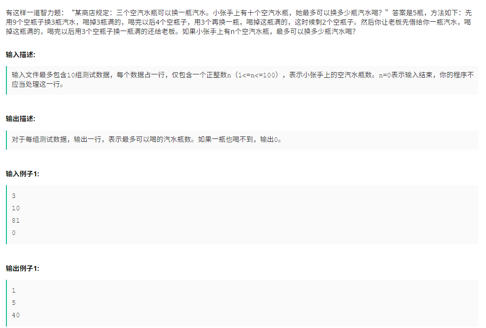
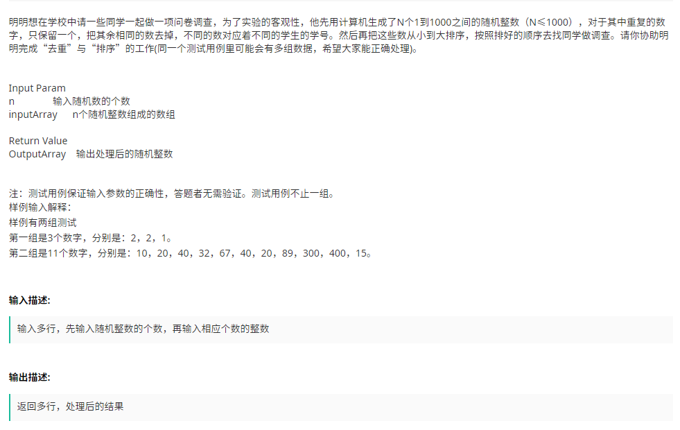
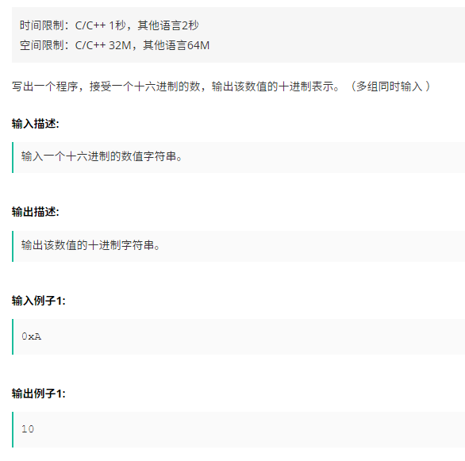

## 1. 汽水瓶



```java
import java.util.Scanner;

public class Bottle{
    public static void main(String[] args) {
        Scanner scanner = new Scanner(System.in);
        while (scanner.hasNext()) {
            int num = scanner.nextInt();
            if(num == 0 || num < 1 || num > 100)
                break;
            System.out.println(calculate(num));
        }
    }


    public static Integer calculate(int bottle) {
        int changed = 0;
        while (bottle >= 3) {
            changed += (bottle - bottle % 3) / 3;
            bottle = bottle%3+(bottle-bottle%3)/3;
        }
        if (bottle == 2) {
            changed += 1;
        }

        return changed;
    }
}
```

## 2. 随机数



```java
import java.util.Scanner;
import java.util.TreeSet;

public class RandomNumSort {
    public static void main(String[] args) {
        Scanner sc = new Scanner(System.in);
        while (sc.hasNext()) {
            TreeSet<Integer> set = new TreeSet<>();
            int n = sc.nextInt();
            if (n > 0) {
                for (int i = 0; i < n; i++) {
                    set.add(sc.nextInt());
                }
            }
            for (Integer i : set) {
                System.out.println(i);
            }
        }
    }
}

```

## 3. 进制转换



```java
import java.util.Scanner;

public class DecodeStr {
    public static void main(String[] args) {
        Scanner sc = new Scanner(System.in);
        while (sc.hasNext()) {
            String str = sc.next();
            System.out.println(Integer.decode(str));
        }
    }

    public void test1() {
        Scanner sc = new Scanner(System.in);
        while (sc.hasNext()){
            StringBuffer sb=new StringBuffer();
            sb.append(sc.next());
            String str=sb.reverse().substring(0,sb.length()-2);
            char ch[]=str.toCharArray();
            int sum=0;
            for(int i=0;i<ch.length;i++){
                if(ch[i]>='A'&&ch[i]<='F'){
                    sum+=(Integer.valueOf(ch[i])-55)*Math.pow(16,i);
                }else {
                    sum+=(Integer.valueOf(ch[i])-48)*Math.pow(16,i);
                }
            }
            System.out.println(sum);
        }
    }
}

```

