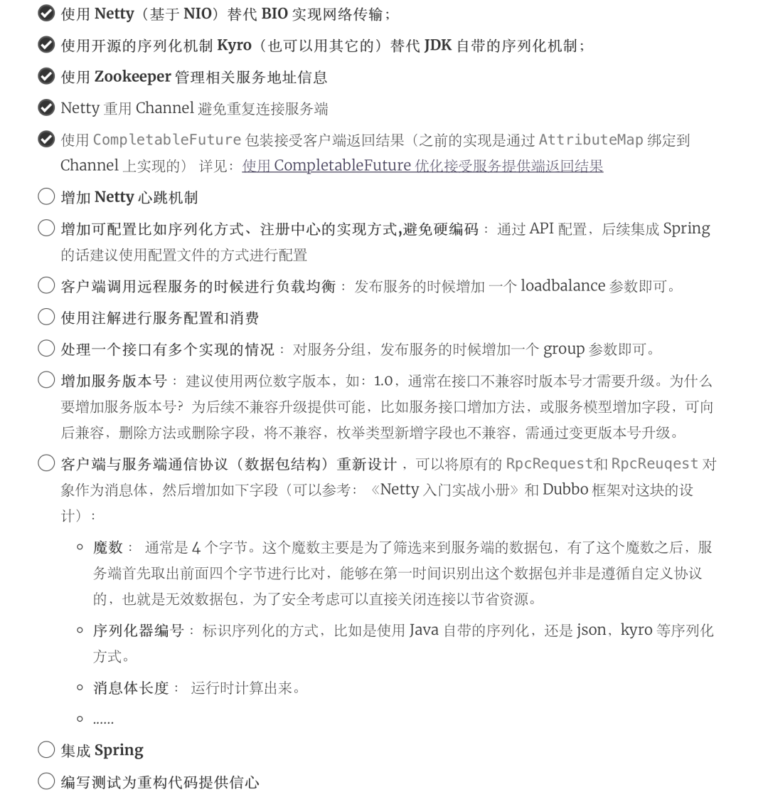

### 一个基本的 RPC 框架设计思路

一个典型的使用 RPC 的场景如下，一般情况下 RPC 框架不仅要提供服务发现功能，还要提供负载均衡、容错等功能，这个的 RPC 框架才算真正合格。

一个完整的RPC框架使用示意图

简单说一下设计一个最基本的 RPC 框架的思路：

1. **注册中心** ：注册中心首先是要有的，推荐使用 Zookeeper。注册中心主要用来保存相关的信息比如远程方法的地址。
2. **网络传输** ：既然要调用远程的方法就要发请求，请求中至少要包含你调用的类名、方法名以及相关参数吧！推荐基于 NIO 的 Netty 框架。
3. **序列化** ：既然涉及到网络传输就一定涉及到序列化，你不可能直接使用 JDK 自带的序列化吧！JDK 自带的序列化效率低并且有安全漏洞。所以，你还要考虑使用哪种序列化协议，比较常用的有 hession2、kyro、protostuff。
4. **动态代理** ：另外，动态代理也是需要的。因为 RPC 的主要目的就是让我们调用远程方法像调用本地方法一样简单，使用动态代理屏蔽远程接口调用的细节比如网络传输。
5. **负载均衡** ：负载均衡也是需要的。为啥？举个例子我们的系统中的某个服务的访问量特别大，我们将这个服务部署在了多台服务器上，当客户端发起请求的时候，多台服务器都可以处理这个请求。那么，如何正确选择处理该请求的服务器就很关键。假如，你就要一台服务器来处理该服务的请求，那该服务部署在多台服务器的意义就不复存在了。负载均衡就是为了避免单个服务器响应同一请求，容易造成服务器宕机、崩溃等问题，我们从负载均衡的这四个字就能明显感受到它的意义。
6. ......

### 项目基本情况和可优化点

最初的是时候，我是基于传统的 **BIO** 的方式 **Socket** 进行网络传输，然后利用 **JDK 自带的序列化机制** 以及内存直接存储相关服务相关信息来实现这个 RPC 框架的。

后面，我对原始版本进行了优化，已完成的优化点和可以完成的优化点如下。

**为什么要把可优化点列出来？** 主要是想给那些希望优化这个 RPC 框架的小伙伴一点思路。欢迎大家 Clone 本仓库，然后自己进行优化。



**项目模块概览**


## 运行项目

### 1.导入项目

克隆项目到自己的本地：`git clone git@github.com:Snailclimb/guide-rpc-framework.git`

然后使用 IDEA 打开，等待项目初始化完成。

### 2.初始化 git hooks

> “
>
> 以下演示的是 Mac/Linux 对应的操作，Window 用户需要手动将 `config/git-hooks` 目录下的`pre-commit` 文件拷贝到 项目下的 `.git/hooks/` 目录。

你需要执行下面这些命令：

```
➜  guide-rpc-framework git:(master) ✗ chmod +x ./init.sh
➜  guide-rpc-framework git:(master) ✗ ./init.sh
```

`init.sh` 这个脚本的主要作用是将 git commit 钩子拷贝到项目下的 `.git/hooks/` 目录，这样你每次 commit 的时候就会执行了。

```
cp config/git-hooks/pre-commit .git/hooks/
chmod +x .git/hooks/pre-commit
```

> “
>
> 抱怨：项目上一直用的 Gradle，很久没用 Maven 了，感觉 Gradle 很多方面都比 Maven 要更好用!比如 Gradle 的项目依赖文件`build.gradle` 比 Maven 的`pom.xml`更加清晰简洁（Maven 是因为 xml 的锅）、Gradel 还可以使用 groovy 语言......

`pre-commit` 的内容如下，主要作用是在提交代码前运行 `Check Style`检查代码格式问题。

```
#!/bin/sh
#set -x

echo "begin to execute hook"
mvn checkstyle:check

RESULT=$?

exit $RESULT
```

### 3.CheckStyle 插件下载和配置

IntelliJ IDEA-> Preferences->Plugins->搜索下载 CheckStyle 插件，然后按照如下方式进行配置。


CheckStyle 插件下载和配置

配置完成之后，按照如下方式使用这个插件！


插件使用方式

### 4.下载运行 zookeeper

这里使用 Docker 来下载安装。

下载：

```
docker pull zookeeper:3.4.14
```

运行：

```
docker run -d --name zookeeper -p 2181:2181 zookeeper:3.4.14
```

## 使用

### 服务提供端

实现接口：

```
public class HelloServiceImpl implements HelloService {
   @Override
    public String hello(Hello hello) {
      ......
    }
}
```

发布服务(使用 Netty 进行传输)：

```
HelloService helloService = new HelloServiceImpl();
NettyServer nettyServer = new NettyServer("127.0.0.1", 9999);
nettyServer.publishService(helloService, HelloService.class);
```

### 服务消费端

```
ClientTransport rpcClient = new NettyClientTransport();
RpcClientProxy rpcClientProxy = new RpcClientProxy(rpcClient);
HelloService helloService = rpcClientProxy.getProxy(HelloService.class);
String hello = helloService.hello(new Hello("111", "222"));
```

## 相关问题

### 为什么要造这个轮子？Dubbo 不香么？

写这个 RPC 框架主要是为了通过造轮子的方式来学习，检验自己对于自己所掌握的知识的运用。

实现一个简单的 RPC 框架实际是比较容易的，不过，相比于手写 AOP 和 IoC 还是要难一点点，前提是你搞懂了 RPC 的基本原理。

**我之前从理论层面在我的知识星球分享过如何实现一个 RPC。不过理论层面的东西只是支撑，你看懂了理论可能只能糊弄住面试官。咱程序员这一行还是最需要动手能力，即使你是架构师级别的人物。当你动手去实践某个东西，将理论付诸实践的时候，你就会发现有很多坑等着你。**

大家在实际项目上还是要尽量少造轮子，有优秀的框架之后尽量就去用，Dubbo 在各个方面做的都比较好和完善。

### 如果我要自己写的话，需要提前了解哪些知识

下面这些是最基本的：

**Java** ：

1. 动态代理机制；
2. 序列化机制以及各种序列化框架的对比，比如hession2、kyro、protostuff。
3. 线程池的使用；
4. `CompletableFuture` 的使用
5. ......

**Netty** ：

1. 使用 Netty 进行网络传输；
2. `ByteBuf` 理解和使用
3. Netty 粘包拆包
4. Netty 长连接和心跳机制

**Zookeeper** :

1. 基本概念；
2. 数据结构；
3. 如何使用Netflix公司开源的zookeeper客户端框架Curator进行增删改查；