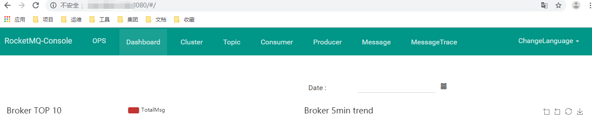

一、rocketMQ安装

　　（一）安装NameSrv

　　1、创建nameSrv数据挂载文件夹

```
　　mkdir -p /usr/data/rocketMQ/data/namesrv/logs

　　mkdir -p /usr/data/rocketMQ/data/namesrv/store
```

　　2、拉取镜像

```
docker pull rocketmqinc/rocketmq:4.4.0
```

　　3、运行NameSrv新容器

```
docker run -d -p 9876:9876 -v /usr/data/rocketMQ/data/namesrv/logs:/root/logs -v /usr/data/rocketMQ/data/namesrv/store:/root/store --name rmqnamesrv -e "MAX_POSSIBLE_HEAP=100000000" rocketmqinc/rocketmq:4.4.0 sh mqnamesrv
```

　　（二）安装broker

　　1、创建broker配置文件挂载文件夹

```
mkdir -p /usr/data/rocketMQ/data/broker/logs
mkdir -p /usr/data/rocketMQ/data/broker/store
mkdir -p /usr/data/rocketMQ/data/broker/conf/broker.conf
```

　　2、新增broker配置文件

　　在conf文件夹下新增broker.conf文件，文件内容如下，其中brokerIP1为宿主机IP

```
brokerClusterName = DefaultCluster
brokerName = broker-a
brokerId = 0
deleteWhen = 04
fileReservedTime = 48
brokerRole = ASYNC_MASTER
flushDiskType = ASYNC_FLUSH
brokerIP1 = {本地外网 IP}
```

　　3、运行broker容器

```
docker run -d -p 10911:10911 -p 10909:10909 -v  /usr/data/rocketMQ/data/broker/logs:/root/logs -v  /usr/data/rocketMQ/data/broker/store:/root/store -v  
/usr/data/rocketMQ/data/broker/conf/broker.conf:/opt/rocketmq-4.4.0/conf/broker.conf --name rmqbroker --link rmqnamesrv:namesrv -e "NAMESRV_ADDR=namesrv:9876" -e "MAX_POSSIBLE_HEAP=200000000" rocketmqinc/rocketmq:4.4.0 sh mqbroker -c /opt/rocketmq-4.4.0/conf/broker.conf
```

　（三）安装控制台

　　1、拉取镜像

```
docker pull pangliang/rocketmq-console-ng
```

　　2、启动新容器

```
docker run -e "JAVA_OPTS=-Drocketmq.namesrv.addr={本地外网 IP}:9876 -Dcom.rocketmq.sendMessageWithVIPChannel=false" -p 8080:8080 -t pangliang/rocketmq-console-ng
```

　　3、访问

