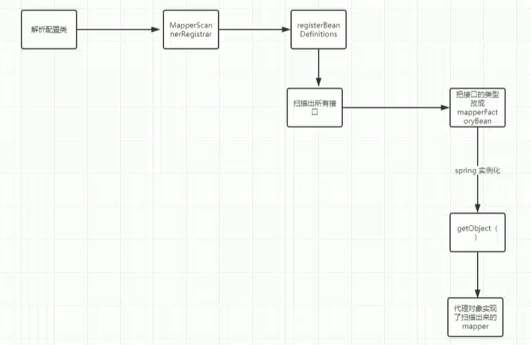

mybatis单独使用时，即使业务里面执行了多次相同的数据查询操作，mybatis也只会发起一次查询，因为mybatis中存在一级缓存，缓存中存在数据，那么直接获取缓存中的值

但是`Mybatis`和`Spring`整合以后就会出现缓存失效的问题，会发起多次查询

分析得知`mybatis`和`spring`整合的情况下，主要提供两处关联

- `@MapperScan`

- `@Bean`= = =  > `SqlSerssionFactoryBean`

  通过源码得知`MapperScan`其实主要利用`spring`的`import`技术和`spring`扩展点`ImportBeanDefintionRegistrar`而`@Bean`仅仅是利用了`javaconfig`技术配置了一个镜像。spring最先处理的import特就`MapperScan`

#### @MapperScan

Spring的初始化大概可以分为两个大部分

1. springBean实例化之前的工作
2. spring实例化之中和之后的工作

##### SpringBean实例化之前的工作

@MapperScan主要做了三个事情

1. 扫描出所有的mapper所对应的`BeanDefinition`
2. 把`mapper`变成`FactoryBean`，`MapperFactoryBean`的`BeanDefinition`
3. 为`BeanDefinition`添加一个构造方法的值，因为mybatis的`MapperFactoryBean`有一个有参构造方法，Spring在实例化这个对象的时候需要一个构造方法的值，这个值是一个class，后面spring在实例化过程中根据这个class返回我们的代理对象

##### Spring实例化之中和之后的工作

mybatis主要利用spring的初始化方法扩展点来完成对mapper信息的初始化，比如sql语句的初始化，这里的spring扩展点主要就是`afterPropertiesSet`。利用`MapperFactoryBean`去实现`InitializingBean`，由于`MapperFactoryBean`是一个factoryBean，我们理解为就是一个mapper，所以又可以理解他就是获得自己的信息，然后把信息缓存起来，缓存到一个map中

> JDK动态代理
>
> Spring源码
>
> Spring中的BeanFactory和FactoryBean的区别