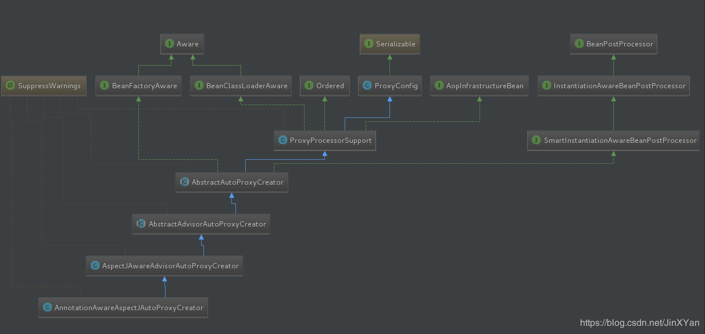
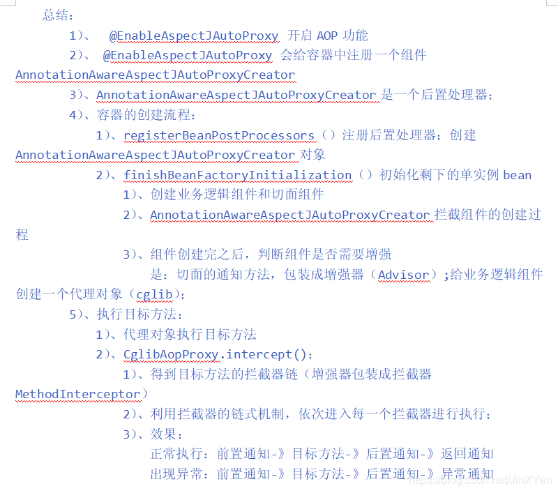

[原文](https://blog.csdn.net/JinXYan/article/details/89302126?depth_1-utm_source=distribute.pc_relevant.none-task-blog-BlogCommendFromBaidu-1)

## **什么是AOP**

​    AOP（Aspect-OrientedProgramming，面向切面编程），可以说是OOP（Object-Oriented Programing，面向对象编程）的补充和完善。OOP引入封装、继承和多态性等概念来建立一种对象层次结构，用以模拟公共行为的一个集合。当我们需要为分散的对象引入公共行为的时候，OOP则显得无能为力。也就是说，OOP允许你定义从上到下的关系，但并不适合定义从左到右的关系。例如日志功能。日志代码往往水平地散布在所有对象层次中，而与它所散布到的对象的核心功能毫无关系。对于其他类型的代码，如安全性、异常处理和透明的持续性也是如此。这种散布在各处的无关的代码被称为横切（cross-cutting）代码，在OOP设计中，它导致了大量代码的重复，而不利于各个模块的重用。

​    而AOP技术则恰恰相反，它利用一种称为“横切”的技术，剖解开封装的对象内部，并将那些影响了多个类的公共行为封装到一个可重用模块，并将其名为“Aspect”，即方面。所谓“方面”，简单地说，就是将那些与业务无关，却为业务模块所共同调用的逻辑或责任封装起来，便于减少系统的重复代码，降低模块间的耦合度，并有利于未来的可操作性和可维护性。AOP代表的是一个横向的关系，如果说“对象”是一个空心的圆柱体，其中封装的是对象的属性和行为；那么面向方面编程的方法，就仿佛一把利刃，将这些空心圆柱体剖开，以获得其内部的消息。而剖开的切面，也就是所谓的“方面”了。然后它又以巧夺天功的妙手将这些剖开的切面复原，不留痕迹。

## **一 AOP的基本概念**

- (1)Aspect(切面):通常是一个类，里面可以定义切入点和通知
- (2)JointPoint(连接点):程序执行过程中明确的点，一般是方法的调用
- (3)Advice(通知):AOP在特定的切入点上执行的增强处理，有before,after,afterReturning,afterThrowing,around
- (4)Pointcut(切入点):就是带有通知的连接点，在程序中主要体现为书写切入点表达式
- (5)AOP代理：AOP框架创建的对象，代理就是目标对象的加强。Spring中的AOP代理可以使JDK动态代理，也可以是CGLIB代理，前者基于接口，后者基于子类

**通知方法:**

1. 前置通知:在我们执行目标方法之前运行(**@Before**)
2. 后置通知:在我们目标方法运行结束之后 ,不管有没有异常***\*(@After)\****
3. 返回通知:在我们的目标方法正常返回值后运行***\*(@AfterReturning)\****
4. 异常通知:在我们的目标方法出现异常后运行***\*(@AfterThrowing)\****
5. 环绕通知:动态代理, 需要手动执行joinPoint.procced()(其实就是执行我们的目标方法执行之前相当于前置通知, 执行之后就相当于我们后置通知**(@Around)**

## **二 Spring AOP**

​    Spring中的AOP代理还是离不开Spring的IOC容器，代理的生成，管理及其依赖关系都是由IOC容器负责，Spring默认使用JDK动态代理，在需要代理类而不是代理接口的时候，Spring会自动切换为使用CGLIB代理，不过现在的项目都是面向接口编程，所以JDK动态代理相对来说用的还是多一些。

## **三 基于注解的AOP配置方式**

**切面类：**

```java
package com.enjoy.cap10.aop;
 
import org.aspectj.lang.ProceedingJoinPoint;
import org.aspectj.lang.annotation.After;
import org.aspectj.lang.annotation.AfterReturning;
import org.aspectj.lang.annotation.AfterThrowing;
import org.aspectj.lang.annotation.Before;
import org.aspectj.lang.annotation.Pointcut;
import org.aspectj.lang.annotation.Around;
import org.aspectj.lang.annotation.Aspect;
 
//日志切面类
@Aspect
public class LogAspects {
	@Pointcut("execution(public int com.enjoy.cap10.aop.Calculator.*(..))")
	public void pointCut(){};
	
	//@before代表在目标方法执行前切入, 并指定在哪个方法前切入
	@Before("pointCut()")
	public void logStart(){
		System.out.println("除法运行....参数列表是:{}");
	}
	@After("pointCut()")
	public void logEnd(){
		System.out.println("除法结束......");
	}
	@AfterReturning("pointCut()")
	public void logReturn(){
		System.out.println("除法正常返回......运行结果是:{}");
	}
	@AfterThrowing("pointCut()")
	public void logException(){
		System.out.println("运行异常......异常信息是:{}");
	}
	@Around("pointCut()")
	public Object Around(ProceedingJoinPoint proceedingJoinPoint) throws Throwable{
		System.out.println("@Arount:执行目标方法之前...");
		Object obj = proceedingJoinPoint.proceed();//相当于开始调div地
		System.out.println("@Arount:执行目标方法之后...");
		return obj;
	}
}
```

**目标方法：**

```java
package com.enjoy.cap10.aop;
 
public class Calculator {
	//业务逻辑方法
	public int div(int i, int j){
		System.out.println("--------");
		return i/j;
	}
}
```

**配置类：**

```java
package com.enjoy.cap10.config;
 
import org.springframework.context.annotation.Bean;
import org.springframework.context.annotation.Configuration;
import org.springframework.context.annotation.EnableAspectJAutoProxy;
 
import com.enjoy.cap10.aop.Calculator;
import com.enjoy.cap10.aop.LogAspects;
 
@Configuration
@EnableAspectJAutoProxy
public class Cap10MainConfig {
	@Bean
	public Calculator calculator(){
		return new Calculator();
	}
 
	@Bean
	public LogAspects logAspects(){
		return new LogAspects();
	}
}
```

**测试类：**

```java
public class Cap10Test {
	@Test
	public void test01(){
		AnnotationConfigApplicationContext app = new AnnotationConfigApplicationContext(Cap10MainConfig.class);	
		Calculator c = app.getBean(Calculator.class);
		int result = c.div(4, 3);
		System.out.println(result);
		app.close();
 
	}
}
```

**结果：**

```console
@Arount:执行目标方法之前...
除法运行....参数列表是:{}
--------
@Arount:执行目标方法之后...
除法结束......
除法正常返回......运行结果是:{}
1
```

## **[AOP源码赏析](https://www.cnblogs.com/foreveravalon/p/8653832.html)**

在这个注解比较流行的年代里,当我们想要使用spring 的某些功能时只需要加上一行代码就可以了,比如:

- @EnableAspectJAutoProxy开启AOP
- @EnableTransactionManagement开启spring事务管理,
- @EnableCaching开启spring缓存
- @EnableWebMvc 开启webMvc

​    对于我们使用者而言十分简单便利,然而,其背后所做的事,却远远比一个注解复杂的多了,本篇只是简略的介绍一下@EnableAspectJAutoProxy背后所发生的那些事,了解其工作原理,才能更好的运用,并从中领略大师的智慧.

```java
@Target(ElementType.TYPE)
@Retention(RetentionPolicy.RUNTIME)
@Documented
@Import(AspectJAutoProxyRegistrar.class)
public @interface EnableAspectJAutoProxy {
 
    /**
     * Indicate whether subclass-based (CGLIB) proxies are to be created as opposed
     * to standard Java interface-based proxies. The default is {@code false}.
     */
    boolean proxyTargetClass() default false;
 
    /**
     * Indicate that the proxy should be exposed by the AOP framework as a {@code ThreadLocal}
     * for retrieval via the {@link org.springframework.aop.framework.AopContext} class.
     * Off by default, i.e. no guarantees that {@code AopContext} access will work.
     * @since 4.3.1
     */
    boolean exposeProxy() default false;
 
}
```

 英文注解已经很详细了,这里简单介绍一下两个参数,一个是控制aop的具体实现方式,为true 的话使用cglib,为false的话使用java的Proxy,默认为false,第二个参数控制代理的暴露方式,解决内部调用不能使用代理的场景，默认为false.

这里核心是@Import(AspectJAutoProxyRegistrar.class);在AspectJAutoProxyRegistrar里,核心的地方是

```java
AopConfigUtils.registerAspectJAnnotationAutoProxyCreatorIfNecessary(registry);
```

​    一个AOP的工具类,这个工具类的主要作用是把AnnotationAwareAspectJAutoProxyCreator这个类定义为BeanDefinition放到spring容器中,这是通过实现ImportBeanDefinitionRegistrar接口来装载的,具体装载过程不是本篇的重点,这里就不赘述,我们重点看AnnotationAwareAspectJAutoProxyCreator这个类.

首先看看这个类图:



​    **从类图是可以大致了解AnnotationAwareAspectJAutoProxyCreator这个类的功能.它实现了一系列Aware的接口,在Bean装载的时候获取BeanFactory(Bean容器),Bean的ClassLoader,还实现了order接口,继承了PorxyConfig,ProxyConfig中主要封装了代理的通用处理逻辑,比如设置目标类,设置使用cglib还是java proxy等一些基础配置.**

​    而能够让这个类参与到bean初始化功能,并为bean添加代理功能的还是因为它实现了BeanPostProcessor这个接口.这个接口的postProcessAfterInitialization方法会在bean初始化结束后(赋值完成)被调用*。*

这里先看一下最顶部的抽象类:AbstractAutoProxyCreator,这个抽象类主要抽象了实现代理的逻辑:

```java
@Override
	public Object postProcessBeforeInitialization(Object bean, String beanName) {
		return bean;
	}
 
    // 主要看这个方法，在bean初始化之后对生产出的bean进行包装
	@Override
	public Object postProcessAfterInitialization(Object bean, String beanName) throws BeansException {
		if (bean != null) {
			Object cacheKey = getCacheKey(bean.getClass(), beanName);
			if (!this.earlyProxyReferences.contains(cacheKey)) {
				return wrapIfNecessary(bean, beanName, cacheKey);
			}
		}
		return bean;
	}
 
    // wrapIfNecessary
	protected Object wrapIfNecessary(Object bean, String beanName, Object cacheKey) {
		if (beanName != null && this.targetSourcedBeans.contains(beanName)) {
			return bean;
		}
		if (Boolean.FALSE.equals(this.advisedBeans.get(cacheKey))) {
			return bean;
		}
		if (isInfrastructureClass(bean.getClass()) || shouldSkip(bean.getClass(), beanName)) {
			this.advisedBeans.put(cacheKey, Boolean.FALSE);
			return bean;
		}
 
		// Create proxy if we have advice.
        // 意思就是如果该类有advice则创建proxy，
		Object[] specificInterceptors = getAdvicesAndAdvisorsForBean(bean.getClass(), beanName, null);
		if (specificInterceptors != DO_NOT_PROXY) {
			this.advisedBeans.put(cacheKey, Boolean.TRUE);
            // 1.通过方法名也能简单猜测到，这个方法就是把bean包装为proxy的主要方法，
			Object proxy = createProxy(
					bean.getClass(), beanName, specificInterceptors, new SingletonTargetSource(bean));
			this.proxyTypes.put(cacheKey, proxy.getClass());
            
            // 2.返回该proxy代替原来的bean
			return proxy;
		}
 
		this.advisedBeans.put(cacheKey, Boolean.FALSE);
		return bean;
	}
```

###  总结：

- **1）将AnnotationAwareAspectJAutoProxyCreator注册到Spring容器中**
- **2）AnnotationAwareAspectJAutoProxyCreator类的postProcessAfterInitialization()方法将所有有advice的bean重新包装成proxy**
   

## **创建proxy过程分析**

​    通过之前的代码结构分析，我们知道，所有的bean在返回给用户使用之前都需要经过AnnotationAwareAspectJAutoProxyCreator类的postProcessAfterInitialization()方法，而该方法的主要作用也就是将所有拥有advice的bean重新包装为proxy，那么我们接下来直接分析这个包装为proxy的方法即可，看一下bean如何被包装为proxy，proxy在被调用方法时，是具体如何执行的

 **以下是AbstractAutoProxyCreator.wrapIfNecessary(Object bean, String beanName, Object cacheKey)中的createProxy()代码片段分析**

```java
protected Object createProxy(
			Class<?> beanClass, String beanName, Object[] specificInterceptors, TargetSource targetSource) {
 
		if (this.beanFactory instanceof ConfigurableListableBeanFactory) {
			AutoProxyUtils.exposeTargetClass((ConfigurableListableBeanFactory) this.beanFactory, beanName, beanClass);
		}
 
        // 1.创建proxyFactory，proxy的生产主要就是在proxyFactory做的
		ProxyFactory proxyFactory = new ProxyFactory();
		proxyFactory.copyFrom(this);
 
		if (!proxyFactory.isProxyTargetClass()) {
			if (shouldProxyTargetClass(beanClass, beanName)) {
				proxyFactory.setProxyTargetClass(true);
			}
			else {
				evaluateProxyInterfaces(beanClass, proxyFactory);
			}
		}
 
        // 2.将当前bean适合的advice，重新封装下，封装为Advisor类，然后添加到ProxyFactory中
		Advisor[] advisors = buildAdvisors(beanName, specificInterceptors);
		for (Advisor advisor : advisors) {
			proxyFactory.addAdvisor(advisor);
		}
 
		proxyFactory.setTargetSource(targetSource);
		customizeProxyFactory(proxyFactory);
 
		proxyFactory.setFrozen(this.freezeProxy);
		if (advisorsPreFiltered()) {
			proxyFactory.setPreFiltered(true);
		}
 
        // 3.调用getProxy获取bean对应的proxy
		return proxyFactory.getProxy(getProxyClassLoader());
	}
```

TargetSource中存放被代理的对象,这段代码主要是为了构建ProxyFactory,将配置信息(是否使用java proxy,是否threadlocal等),目标类,切面,传入ProxyFactory中

### **1）创建何种类型的Proxy？JDKProxy还是CGLIBProxy？**

```java
// getProxy()方法
	public Object getProxy(ClassLoader classLoader) {
		return createAopProxy().getProxy(classLoader);
	}
 
    
    // createAopProxy()方法就是决定究竟创建何种类型的proxy
	protected final synchronized AopProxy createAopProxy() {
		if (!this.active) {
			activate();
		}
        // 关键方法createAopProxy()
		return getAopProxyFactory().createAopProxy(this);
	}
 
    // createAopProxy()
	public AopProxy createAopProxy(AdvisedSupport config) throws AopConfigException {
        // 1.config.isOptimize()是否使用优化的代理策略，目前使用与CGLIB
        // config.isProxyTargetClass() 是否目标类本身被代理而不是目标类的接口
        // hasNoUserSuppliedProxyInterfaces()是否存在代理接口
		if (config.isOptimize() || config.isProxyTargetClass() || hasNoUserSuppliedProxyInterfaces(config)) {
			Class<?> targetClass = config.getTargetClass();
			if (targetClass == null) {
				throw new AopConfigException("TargetSource cannot determine target class: " +
						"Either an interface or a target is required for proxy creation.");
			}
            
            // 2.如果目标类是接口或者是代理类，则直接使用JDKproxy
			if (targetClass.isInterface() || Proxy.isProxyClass(targetClass)) {
				return new JdkDynamicAopProxy(config);
			}
            
            // 3.其他情况则使用CGLIBproxy
			return new ObjenesisCglibAopProxy(config);
		}
		else {
			return new JdkDynamicAopProxy(config);
		}
	}
```

### **2）getProxy()方法**

由1）可知，通过createAopProxy()方法来确定具体使用何种类型的Proxy，针对于该示例，我们具体使用的为JdkDynamicAopProxy，下面来看下JdkDynamicAopProxy.getProxy()方法

```java
final class JdkDynamicAopProxy implements AopProxy, InvocationHandler, Serializable// JdkDynamicAopProxy类结构，由此可知，其实现了InvocationHandler，则必定有invoke方法，来被调用，也就是用户调用bean相关方法时，此invoke()被真正调用
    // getProxy()
    public Object getProxy(ClassLoader classLoader) {
		if (logger.isDebugEnabled()) {
			logger.debug("Creating JDK dynamic proxy: target source is " + this.advised.getTargetSource());
		}
		Class<?>[] proxiedInterfaces = AopProxyUtils.completeProxiedInterfaces(this.advised, true);
		findDefinedEqualsAndHashCodeMethods(proxiedInterfaces);
        
        // JDK proxy 动态代理的标准用法
		return Proxy.newProxyInstance(classLoader, proxiedInterfaces, this);
	}
```

### **3）invoke()方法**

  以上的代码模式可以很明确的看出来，使用了JDK动态代理模式，真正的方法执行在invoke()方法里，下面我们来看下该方法，来看下bean方法如何被代理执行的

```java
	public Object invoke(Object proxy, Method method, Object[] args) throws Throwable {
		MethodInvocation invocation;
		Object oldProxy = null;
		boolean setProxyContext = false;
 
		TargetSource targetSource = this.advised.targetSource;
		Class<?> targetClass = null;
		Object target = null;
 
		try {
            // 1.以下的几个判断，主要是为了判断method是否为equals、hashCode等Object的方法
			if (!this.equalsDefined && AopUtils.isEqualsMethod(method)) {
				// The target does not implement the equals(Object) method itself.
				return equals(args[0]);
			}
			else if (!this.hashCodeDefined && AopUtils.isHashCodeMethod(method)) {
				// The target does not implement the hashCode() method itself.
				return hashCode();
			}
			else if (method.getDeclaringClass() == DecoratingProxy.class) {
				// There is only getDecoratedClass() declared -> dispatch to proxy config.
				return AopProxyUtils.ultimateTargetClass(this.advised);
			}
			else if (!this.advised.opaque && method.getDeclaringClass().isInterface() &&
					method.getDeclaringClass().isAssignableFrom(Advised.class)) {
				// Service invocations on ProxyConfig with the proxy config...
				return AopUtils.invokeJoinpointUsingReflection(this.advised, method, args);
			}
 
			Object retVal;
 
			if (this.advised.exposeProxy) {
				// Make invocation available if necessary.
				oldProxy = AopContext.setCurrentProxy(proxy);
				setProxyContext = true;
			}
 
			// May be null. Get as late as possible to minimize the time we "own" the target,
			// in case it comes from a pool.
			target = targetSource.getTarget();
			if (target != null) {
				targetClass = target.getClass();
			}
 
			// 2.获取当前bean被拦截方法链表
			List<Object> chain = this.advised.getInterceptorsAndDynamicInterceptionAdvice(method, targetClass);
 
			// 3.如果为空，则直接调用target的method
			if (chain.isEmpty()) {
				Object[] argsToUse = AopProxyUtils.adaptArgumentsIfNecessary(method, args);
				retVal = AopUtils.invokeJoinpointUsingReflection(target, method, argsToUse);
			}
            // 4.不为空，则逐一调用chain中的每一个拦截方法的proceed
			else {
				// We need to create a method invocation...
				invocation = new ReflectiveMethodInvocation(proxy, target, method, args, targetClass, chain);
				// Proceed to the joinpoint through the interceptor chain.
				retVal = invocation.proceed();
			}
 
			...
			return retVal;
		}
		...
	}
```

### **4）拦截方法真正被执行调用invocation.proceed()** 

```java
	public Object proceed() throws Throwable {
		//	We start with an index of -1 and increment early.
		if (this.currentInterceptorIndex == this.interceptorsAndDynamicMethodMatchers.size() - 1) {
			return invokeJoinpoint();
		}
 
		Object interceptorOrInterceptionAdvice =
				this.interceptorsAndDynamicMethodMatchers.get(++this.currentInterceptorIndex);
		if (interceptorOrInterceptionAdvice instanceof InterceptorAndDynamicMethodMatcher) {
			// Evaluate dynamic method matcher here: static part will already have
			// been evaluated and found to match.
			InterceptorAndDynamicMethodMatcher dm =
					(InterceptorAndDynamicMethodMatcher) interceptorOrInterceptionAdvice;
			if (dm.methodMatcher.matches(this.method, this.targetClass, this.arguments)) {
				return dm.interceptor.invoke(this);
			}
			else {
				// Dynamic matching failed.
				// Skip this interceptor and invoke the next in the chain.
				return proceed();
			}
		}
		else {
			// It's an interceptor, so we just invoke it: The pointcut will have
			// been evaluated statically before this object was constructed.
			return ((MethodInterceptor) interceptorOrInterceptionAdvice).invoke(this);
		}
	}
```

总结4：依次遍历拦截器链的每个元素，然后调用其实现，将真正调用工作委托给各个增强器

### **总结：**

  纵观以上过程可知：实际就是为bean创建一个proxy，JDKproxy或者CGLIBproxy，然后在调用bean的方法时，会通过proxy来调用bean方法

  重点过程可分为：

  **1）将AnnotationAwareAspectJAutoProxyCreator注册到Spring容器中**

  **2）AnnotationAwareAspectJAutoProxyCreator类的postProcessAfterInitialization()方法将所有有advice的bean重新包装成proxy**

  **3）调用bean方法时通过proxy来调用，proxy依次调用增强器的相关方法，来实现方法切**

