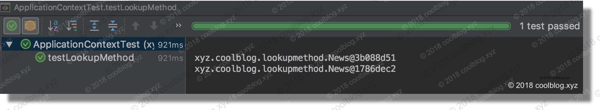
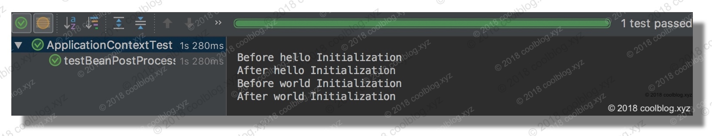

##  1. 简介

Spring 是一个轻量级的企业级应用开发框架，于 2004 年由 [Rod Johnson](https://en.wikipedia.org/wiki/Rod_Johnson_(programmer)) 发布了 1.0 版本。经过十几年的迭代，现在的 Spring 框架已经非常成熟了。Spring 包含了众多模块，包括但不限于 Core、Bean、Context、AOP 和 Web 等。在今天，我们完全可以使用 Spring 所提供的一站式解决方案开发出我们所需要的应用。作为 Java 程序员，我们会经常和 Spring 框架打交道，所以还是很有必要弄懂 Spring 的原理。

本文是 Spring IOC 容器源码分析系列文章的第一篇文章，将会着重介绍 Spring 的一些使用方法和特性，为后续的源码分析文章做铺垫。另外需要特别说明一下，本系列的源码分析文章是基于`Spring 4.3.17.RELEASE`版本编写的，而非最新的`5.0.6.RELEASE`版本。好了，关于简介先说到这里，继续来说说下面的内容。

##  2. 文章编排

写 Spring IOC 这一块的文章，挺让我纠结的。我原本是打算在一篇文章中分析所有的源码，但是后来发现文章实在太长。主要是因为 Spring IOC 部分的源码实在太长，将这一部分的源码贴在一篇文章中还是很壮观的。当然估计大家也没兴趣读下去，所以决定对文章进行拆分。这里先贴一张文章切分前的目录结构：


如上图，由目录可以看出，假使在一篇文章中写完所有内容，文章的长度将会非常长。所以在经过思考后，我会将文章拆分成一系列的文章，如下：

1. [Spring IOC 容器源码分析 - 获取单例 bean](http://www.coolblog.xyz/2018/06/01/Spring-IOC-容器源码分析-获取单例-bean/) - ✅ 已更新
2. [Spring IOC 容器源码分析 - 创建单例 bean 的过程](http://www.coolblog.xyz/2018/06/04/Spring-IOC-容器源码分析-创建单例-bean/) - ✅ 已更新
3. [Spring IOC 容器源码分析 - 创建原始 bean 对象](http://www.coolblog.xyz/2018/06/06/Spring-IOC-容器源码分析-创建原始-bean-对象/) - ✅ 已更新
4. [Spring IOC 容器源码分析 - 循环依赖的解决办法](http://www.coolblog.xyz/2018/06/08/Spring-IOC-容器源码分析-循环依赖的解决办法/) - ✅ 已更新
5. [Spring IOC 容器源码分析 - 填充属性到原始 bean 对象中](http://www.coolblog.xyz/2018/06/11/Spring-IOC-容器源码分析-填充属性到-bean-原始对象/) - ✅ 已更新
6. [Spring IOC 容器源码分析 - 余下的初始化工作](http://www.coolblog.xyz/2018/06/11/Spring-IOC-容器源码分析-余下的初始化工作/) - ✅ 已更新

上面文章对应的源码分析工作均已经完成，所有的文章将会在近期内进行更新。

##  3. Spring 模块结构

Spring 是分模块开发的，Spring 包含了很多模块，其中最为核心的是 bean 容器相关模块。像 AOP、MVC、Data 等模块都要依赖 bean 容器。这里先看一下 Spring 框架的结构图：


图片来源：Spring 官方文档

从上图中可以看出`Core Container`处于整个框架的最底层（忽略 Test 模块），在其之上有 AOP、Data、Web 等模块。既然 Spring 容器是最核心的部分，那么大家如果要读 Spring 的源码，容器部分必须先弄懂。本篇文章作为 Spring IOC 容器的开篇文章，就来简单介绍一下容器方面的知识。请继续往下看。

##  4. Spring IOC 部分特性介绍

本章将会介绍 IOC 中的部分特性，这些特性均会在后面的源码分析中悉数到场。如果大家不是很熟悉这些特性，这里可以看一下。

###  4.1 alias

alias 的中文意思是“别名”，在 Spring 中，我们可以使用 alias 标签给 bean 起个别名。比如下面的配置：

```xml
<bean id="hello" class="xyz.coolblog.service.Hello">
    <property name="content" value="hello"/>
</bean>
<alias name="hello" alias="alias-hello"/>
<alias name="alias-hello" alias="double-alias-hello"/>
```

这里我们给`hello`这个 beanName 起了一个别名`alias-hello`，然后又给别名`alias-hello`起了一个别名`double-alias-hello`。我们可以通过这两个别名获取到`hello`这个 bean 实例，比如下面的测试代码：

```java
public class ApplicationContextTest {

    @Test
    public void testAlias() {
        String configLocation = "application-alias.xml";
        ApplicationContext applicationContext = new ClassPathXmlApplicationContext(configLocation);
        System.out.println("    alias-hello -> " + applicationContext.getBean("alias-hello"));
        System.out.println("double-alias-hello -> " + applicationContext.getBean("double-alias-hello"));
    }
}
```

测试结果如下：


###  4.2 autowire

本小节，我们来了解一下 autowire 这个特性。autowire 即自动注入的意思，通过使用 autowire 特性，我们就不用再显示的配置 bean 之间的依赖了。把依赖的发现和注入都交给 Spring 去处理，省时又省力。autowire 几个可选项，比如 byName、byType 和 constructor 等。autowire 是一个常用特性，相信大家都比较熟悉了，所以本节我们就 byName 为例，快速结束 autowire 特性的介绍。

当 bean 配置中的 autowire = byName 时，Spring 会首先通过反射获取该 bean 所依赖 bean 的名字（beanName），然后再通过调用 BeanFactory.getName(beanName) 方法即可获取对应的依赖实例。autowire = byName 原理大致就是这样，接下来我们来演示一下。

```java
public class Service {

    private Dao mysqlDao;

    private Dao mongoDao;

    // 忽略 getter/setter

    @Override
    public String toString() {
        return super.toString() + "\n\t\t\t\t\t{" +
            "mysqlDao=" + mysqlDao +
            ", mongoDao=" + mongoDao +
            '}';
    }
}

public interface Dao {}
public class MySqlDao implements Dao {}
public class MongoDao implements Dao {}
```

配置如下：

```xml
<bean name="mongoDao" class="xyz.coolblog.autowire.MongoDao"/>
<bean name="mysqlDao" class="xyz.coolblog.autowire.MySqlDao"/>

<!-- 非自动注入，手动配置依赖 -->
<bean name="service-without-autowire" class="xyz.coolblog.autowire.Service" autowire="no">
    <property name="mysqlDao" ref="mysqlDao"/>
    <property name="mongoDao" ref="mongoDao"/>
</bean>

<!-- 通过设置 autowire 属性，我们就不需要像上面那样显式配置依赖了 -->
<bean name="service-with-autowire" class="xyz.coolblog.autowire.Service" autowire="byName"/>
```

测试代码如下：

```java
String configLocation = "application-autowire.xml";
ApplicationContext applicationContext = new ClassPathXmlApplicationContext(configLocation);
System.out.println("service-without-autowire -> " + applicationContext.getBean("service-without-autowire"));
System.out.println("service-with-autowire -> " + applicationContext.getBean("service-with-autowire"));
```

测试结果如下：


从测试结果可以看出，两种方式配置方式都能完成解决 bean 之间的依赖问题。只不过使用 autowire 会更加省力一些，配置文件也不会冗长。这里举的例子比较简单，假使一个 bean 依赖了十几二十个 bean，再手动去配置，恐怕就很难受了。

###  4.3 FactoryBean

FactoryBean？看起来是不是很像 BeanFactory 孪生兄弟。不错，他们看起来很像，但是他们是不一样的。FactoryBean 是一种工厂 bean，与普通的 bean 不一样，FactoryBean 是一种可以产生 bean 的 bean，好吧说起来很绕嘴。FactoryBean 是一个接口，我们可以实现这个接口。下面演示一下：

```java
public class HelloFactoryBean implements FactoryBean<Hello> {

    @Override
    public Hello getObject() throws Exception {
        Hello hello = new Hello();
        hello.setContent("hello");
        return hello;
    }

    @Override
    public Class<?> getObjectType() {
        return Hello.class;
    }

    @Override
    public boolean isSingleton() {
        return true;
    }
}
```

配置如下：

```xml
<bean id="helloFactory" class="xyz.coolblog.service.HelloFactoryBean"/>
```

测试代码如下：

```java
public class ApplicationContextTest {

    @Test
    public void testFactoryBean() {
        String configLocation = "application-factory-bean.xml";
        ApplicationContext applicationContext = new ClassPathXmlApplicationContext(configLocation);
        System.out.println("helloFactory -> " + applicationContext.getBean("helloFactory"));
        System.out.println("&helloFactory -> " + applicationContext.getBean("&helloFactory"));
    }
}
```

测试结果如下：


由测试结果可以看到，当我们调用 getBean(“helloFactory”) 时，ApplicationContext 会返回一个 Hello 对象，该对象是 HelloFactoryBean 的 getObject 方法所创建的。如果我们想获取 HelloFactoryBean 本身，则可以在 helloFactory 前加上一个前缀`&`，即`&helloFactory`。

###  4.4 factory-method

介绍完 FactoryBean，本节再来看看了一个和工厂相关的特性 – factory-method。factory-method 可用于标识静态工厂的工厂方法（工厂方法是静态的），直接举例说明吧：

```java
public class StaticHelloFactory {

    public static Hello getHello() {
        Hello hello = new Hello();
        hello.setContent("created by StaticHelloFactory");
        return hello;
    }
}
```

配置如下：

```xml
<bean id="staticHelloFactory" class="xyz.coolblog.service.StaticHelloFactory" factory-method="getHello"/>
```

测试代码如下：

```java
public class ApplicationContextTest {

    @Test
    public void testFactoryMethod() {
        String configLocation = "application-factory-method.xml";
        ApplicationContext applicationContext = new ClassPathXmlApplicationContext(configLocation);
        System.out.println("staticHelloFactory -> " + applicationContext.getBean("staticHelloFactory"));
    }
}
```

测试结果如下：


对于非静态工厂，需要使用 factory-bean 和 factory-method 两个属性配合。关于 factory-bean 这里就不继续说了，留给大家自己去探索吧。

###  4.5 lookup-method

lookup-method 特性可能大家用的不多（我也没用过），不过它也是个有用的特性。在介绍这个特性前，先介绍一下背景。我们通过 BeanFactory getBean 方法获取 bean 实例时，对于 singleton 类型的 bean，BeanFactory 每次返回的都是同一个 bean。对于 prototype 类型的 bean，BeanFactory 则会返回一个新的 bean。现在考虑这样一种情况，一个 singleton 类型的 bean 中有一个 prototype 类型的成员变量。BeanFactory 在实例化 singleton 类型的 bean 时，会向其注入一个 prototype 类型的实例。但是 singleton 类型的 bean 只会实例化一次，那么它内部的 prototype 类型的成员变量也就不会再被改变。但如果我们每次从 singleton bean 中获取这个 prototype 成员变量时，都想获取一个新的对象。这个时候怎么办？举个例子（该例子源于《Spring 揭秘》一书），我们有一个新闻提供类（NewsProvider），这个类中有一个新闻类（News）成员变量。我们每次调用 getNews 方法都想获取一条新的新闻。这里我们有两种方式实现这个需求，一种方式是让 NewsProvider 类实现 ApplicationContextAware 接口（实现 BeanFactoryAware 接口也是可以的），每次调用 NewsProvider 的 getNews 方法时，都从 ApplicationContext 中获取一个新的 News 实例，返回给调用者。第二种方式就是这里的 lookup-method 了，Spring 会在运行时对 NewsProvider 进行增强，使其 getNews 可以每次都返回一个新的实例。说完了背景和解决方案，接下来就来写点测试代码验证一下。

在演示两种处理方式前，我们先来看看不使用任何处理方式，BeanFactory 所返回的 bean 实例情况。相关类定义如下：

```java
public class News {
    // 仅演示使用，News 类中无成员变量
}

public class NewsProvider {

    private News news;

    public News getNews() {
        return news;
    }

    public void setNews(News news) {
        this.news = news;
    }
}
```

配置信息如下：

```xml
<bean id="news" class="xyz.coolblog.lookupmethod.News" scope="prototype"/>
<bean id="newsProvider" class="xyz.coolblog.lookupmethod.NewsProvider">
    <property name="news" ref="news"/>
</bean>
```

测试代码如下：

```java
String configLocation = "application-lookup-method.xml";
ApplicationContext applicationContext = new ClassPathXmlApplicationContext(configLocation);
NewsProvider newsProvider = (NewsProvider) applicationContext.getBean("newsProvider");
System.out.println(newsProvider.getNews());
System.out.println(newsProvider.getNews());
```

测试结果如下：


从测试结果中可以看出，newsProvider.getNews() 方法两次返回的结果都是一样的，这个是不满足要求的。

####  4.5.1 实现 ApplicationContextAware 接口

我们让 NewsProvider 实现 ApplicationContextAware 接口，实现代码如下：

```java
public class NewsProvider implements ApplicationContextAware {

    private ApplicationContext applicationContext;

    private News news;

    /** 每次都从 applicationContext 中获取一个新的 bean */
    public News getNews() {
        return applicationContext.getBean("news", News.class);
    }

    public void setNews(News news) {
        this.news = news;
    }

    @Override
    public void setApplicationContext(ApplicationContext applicationContext) throws BeansException {
        this.applicationContext = applicationContext;
    }
}
```

配置和测试代码同上，测试结果如下：


这里两次获取的 news 并就不是同一个 bean 了，满足了我们的需求。

####  4.5.2 使用 lookup-method 特性

使用 lookup-method 特性，配置文件需要改一下。如下：

```xml
<bean id="news" class="xyz.coolblog.lookupmethod.News" scope="prototype"/>
<bean id="newsProvider" class="xyz.coolblog.lookupmethod.NewsProvider">
    <lookup-method name="getNews" bean="news"/>
</bean>
```

NewsProvider 的代码沿用 4.5.1 小节之前贴的代码。测试代码稍微变一下，如下：

```java
String configLocation = "application-lookup-method.xml";
ApplicationContext applicationContext = new ClassPathXmlApplicationContext(configLocation);
NewsProvider newsProvider = (NewsProvider) applicationContext.getBean("newsProvider");
System.out.println("newsProvider -> " + newsProvider);
System.out.println("news 1 -> " + newsProvider.getNews());
System.out.println("news 2 -> " + newsProvider.getNews());
```

测试结果如下：


从上面的结果可以看出，new1 和 new2 指向了不同的对象。同时，大家注意看 newsProvider，似乎变的很复杂。由此可看出，NewsProvider 被 CGLIB 增强了。

###  4.6 depends-on

当一个 bean 直接依赖另一个 bean，可以使用 `` 标签进行配置。不过如某个 bean 并不直接依赖于其他 bean，但又需要其他 bean 先实例化好，这个时候就需要使用 depends-on 特性了。depends-on 特性比较简单，就不演示了。仅贴一下配置文件的内容，如下：

这里有两个简单的类，其中 Hello 需要 World 在其之前完成实例化。相关配置如下：

```xml
<bean id="hello" class="xyz.coolblog.depnedson.Hello" depends-on="world"/>
<bean id="world" class="xyz.coolblog.depnedson.World" />
```

###  4.7 BeanPostProcessor

BeanPostProcessor 是 bean 实例化时的后置处理器，包含两个方法，其源码如下：

```java
public interface BeanPostProcessor {
    // bean 初始化前的回调方法
    Object postProcessBeforeInitialization(Object bean, String beanName) throws BeansException;

    // bean 初始化后的回调方法    
    Object postProcessAfterInitialization(Object bean, String beanName) throws BeansException;

}
```

BeanPostProcessor 是 Spring 框架的一个扩展点，通过实现 BeanPostProcessor 接口，我们就可插手 bean 实例化的过程。比如大家熟悉的 AOP 就是在 bean 实例后期间将切面逻辑织入 bean 实例中的，AOP 也正是通过 BeanPostProcessor 和 IOC 容器建立起了联系。这里我来演示一下 BeanPostProcessor 的使用方式，如下：

```java
/**
 * 日志后置处理器，将会在 bean 创建前、后打印日志
 */
public class LoggerBeanPostProcessor implements BeanPostProcessor {

    @Override
    public Object postProcessBeforeInitialization(Object bean, String beanName) throws BeansException {
        System.out.println("Before " + beanName + " Initialization");
        return bean;
    }

    @Override
    public Object postProcessAfterInitialization(Object bean, String beanName) throws BeansException {
        System.out.println("After " + beanName + " Initialization");
        return bean;
    }
}
```

配置如下：

```xml
<bean class="xyz.coolblog.beanpostprocessor.LoggerBeanPostProcessor"/>
    
<bean id="hello" class="xyz.coolblog.service.Hello"/>
<bean id="world" class="xyz.coolblog.service.World"/>
```

测试代码如下：

```java
public class ApplicationContextTest {

    @Test
    public void testBeanPostProcessor() {
        String configLocation = "application-bean-post-processor.xml";
        ApplicationContext applicationContext = new ClassPathXmlApplicationContext(configLocation);
    }
}
```

测试结果如下：


与 BeanPostProcessor 类似的还有一个叫 BeanFactoryPostProcessor 拓展点，顾名思义，用户可以通过这个拓展点插手容器启动的过程。不过这个不属于本系列文章范畴，暂时先不细说了。

###  4.8 BeanFactoryAware

Spring 中定义了一些列的 Aware 接口，比如这里的 BeanFactoryAware，以及 BeanNameAware 和 BeanClassLoaderAware 等等。通过实现这些 Aware 接口，我们可以在运行时获取一些配置信息或者其他一些信息。比如实现 BeanNameAware 接口，我们可以获取 bean 的配置名称（beanName）。通过实现 BeanFactoryAware 接口，我们可以在运行时获取 BeanFactory 实例。关于 Aware 类型接口的使用，可以参考`4.5.1 实现 ApplicationContextAware 接口`一节中的叙述，这里就不演示了。

##  5. 阅读源码的一些建议

我在去年八月份的时候，尝试过阅读 Spring 源码。不过 Spring 源码太多了，调用复杂，看着看着就迷失在了代码的海洋里。不过好在当时找到了一个经过简化后的类 Spring 框架，该框架黄亿华前辈在学习 Spring 源码时所写的 [tiny-spring](https://github.com/code4craft/tiny-spring)。如果大家觉得看 Spring 源码比较困难，可以先学习一下 tiny-spring 的源码，先对 Spring 代码结构有个大概的了解。

另外也建议大家自己动手实现一个简单的 IOC 容器，通过实践，才会有更多的感悟。我在去年八月份的时候，实现过一个简单的 IOC 和 AOP（可以参考我去年发的文章：[仿照 Spring 实现简单的 IOC 和 AOP - 上篇](https://segmentfault.com/a/1190000010745705)），并在最后将两者整合到了一起。正是有了之前的实践，才使得我对 Spring 的原理有了更进一步的认识。当做完一些准备工作后，再次阅读 Spring 源码，就没以前那么痛苦了。当然，Spring 的代码经过十几年的迭代，代码量很大。我在分析的过程中也只是尽量保证搞懂重要的逻辑，无法做到面面俱到。不过，如果大家愿意去读 Spring 源码，我相信会比我理解的更透彻。

除了上面说的动手实践外，在阅读源码的过程中，如果实在看不懂，不妨调试一下。比如某个变量你不知道有什么用，但是它又比较关键，在多个地方都出现了，显然你必须要搞懂它。那么此时写点测试代码调试一下，立马就能知道它有什么用了。

以上是我在阅读源码时所使用过的一些方法，当然仅有上面那些可能还不够。本节的最后再推荐两本书，如下：

- [《Spring 揭秘》- 王福强著](https://book.douban.com/subject/3897837/)
- [《Spring源码深度解析》- 郝佳著](https://book.douban.com/subject/25866350/)

第二本书在豆瓣上的评分不太好，不过我觉得还好。这本书我仅看了容器部分的代码分析，总的来说还行。我在看循环依赖那一块的代码时，这本书还是给了我一些帮助的。好了，本节就到这里。

##  6. 写在最后

在本文的最后一章，我来说说我为什么阅读 Spring 的源码吧。对我个人而言，有两个原因。第一，作为 Java Web 开发人员，我们基本上绕不过 Spring 技术栈。当然除了 Spring，还有很多其他的选择（比如有些公司自己封装框架）。但不可否认，Spring 现在仍是主流。对于这样一个经常打交道的框架，弄懂实现原理，还有很有必要的。起码在它出错输出一大堆异常时，你不会很心慌，可以从容的 debug。第二，我去年的这个时候，工作差不多快满一年。我在写第一年的工作总结时，觉得很心慌。感觉第一年好像只学到了一点开发的皮毛，技术方面，没什么积累。加上后来想换工作，心里想着就自己现在的水平恐怕要失业了。所以为了平复自己焦虑的情绪，于是在去年的八月份的时候，我开始写博客了。到现在写了近30篇博客（比较少），其中有两篇文章被博客平台作为优秀文章推荐过。现在，又快到7月份了，工龄马上又要+1了。所以我现在在抓紧写 Spring 相关的文章，希望在六月份多写几篇。算是对自己工作满两年的一个阶段性技术总结，也是一个纪念吧。

当然，看懂源码并不是什么很了不起的事情，毕竟写这些源码的人才是真正的大神。我在大学的时候，自学 MFC（没错，就是微软早已淘汰的东西）。并读过侯捷老师著的[《深入浅出MFC》](https://book.douban.com/subject/1094852/)一书，这本书中的一句话对我影响至深 - “**勿在浮沙筑高台**”。勿在浮沙筑高台，对于一个程序员来说，基础很重要。所以我现在也在不断的学习，希望能把基础打好，这样以后才能进入更高的层次。

好了，感谢大家耐心看完我的唠叨。本文先到这里，我要去写后续的文章了，后面再见。bye~

##  附录：Spring 源码分析文章列表

###  Ⅰ. IOC

| 更新时间   | 标题                                                         |
| :--------- | :----------------------------------------------------------- |
| 2018-05-30 | [Spring IOC 容器源码分析系列文章导读](http://www.coolblog.xyz/2018/05/30/Spring-IOC-容器源码分析系列文章导读/) |
| 2018-06-01 | [Spring IOC 容器源码分析 - 获取单例 bean](http://www.coolblog.xyz/2018/06/01/Spring-IOC-容器源码分析-获取单例-bean/) |
| 2018-06-04 | [Spring IOC 容器源码分析 - 创建单例 bean 的过程](http://www.coolblog.xyz/2018/06/04/Spring-IOC-容器源码分析-创建单例-bean/) |
| 2018-06-06 | [Spring IOC 容器源码分析 - 创建原始 bean 对象](http://www.coolblog.xyz/2018/06/06/Spring-IOC-容器源码分析-创建原始-bean-对象/) |
| 2018-06-08 | [Spring IOC 容器源码分析 - 循环依赖的解决办法](http://www.coolblog.xyz/2018/06/08/Spring-IOC-容器源码分析-循环依赖的解决办法/) |
| 2018-06-11 | [Spring IOC 容器源码分析 - 填充属性到 bean 原始对象](http://www.coolblog.xyz/2018/06/11/Spring-IOC-容器源码分析-填充属性到-bean-原始对象/) |
| 2018-06-11 | [Spring IOC 容器源码分析 - 余下的初始化工作](http://www.coolblog.xyz/2018/06/11/Spring-IOC-容器源码分析-余下的初始化工作/) |

###  Ⅱ. AOP

| 更新时间   | 标题                                                         |
| :--------- | :----------------------------------------------------------- |
| 2018-06-17 | [Spring AOP 源码分析系列文章导读](http://www.coolblog.xyz/2018/06/17/Spring-AOP-源码分析系列文章导读/) |
| 2018-06-20 | [Spring AOP 源码分析 - 筛选合适的通知器](http://www.coolblog.xyz/2018/06/20/Spring-AOP-源码分析-筛选合适的通知器/) |
| 2018-06-20 | [Spring AOP 源码分析 - 创建代理对象](http://www.coolblog.xyz/2018/06/20/Spring-AOP-源码分析-筛选合适的通知器/) |
| 2018-06-22 | [Spring AOP 源码分析 - 拦截器链的执行过程](http://www.coolblog.xyz/2018/06/22/Spring-AOP-源码分析-拦截器链的执行过程/) |

###  Ⅲ. MVC

| 更新时间   | 标题                                                         |
| :--------- | :----------------------------------------------------------- |
| 2018-06-29 | [Spring MVC 原理探秘 - 一个请求的旅行过程](http://www.coolblog.xyz/2018/06/29/Spring-MVC-原理探秘-一个请求的旅行过程/) |
| 2018-06-30 | [Spring MVC 原理探秘 - 容器的创建过程](http://www.coolblog.xyz/2018/06/30/Spring-MVC-原理探秘-容器的创建过程/) |