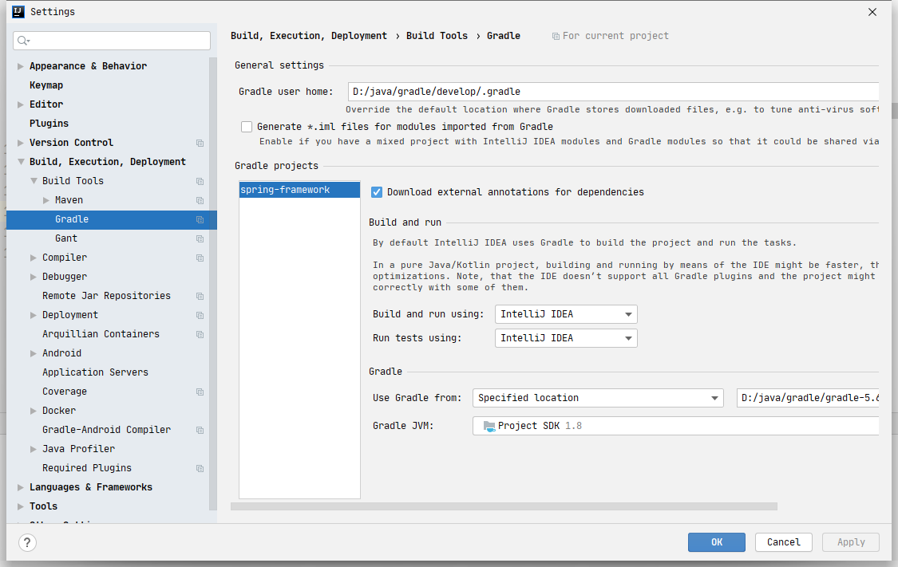
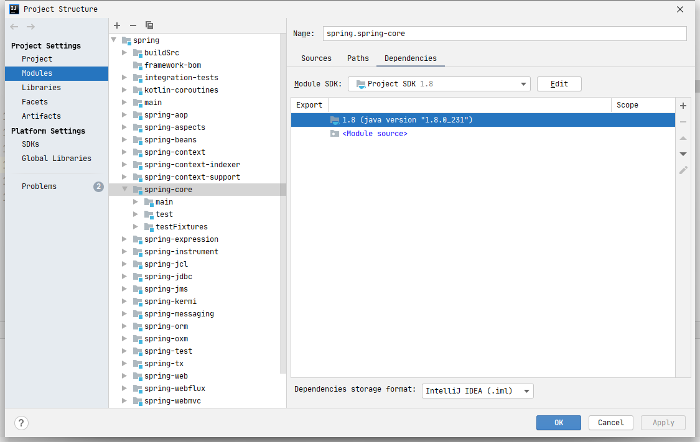
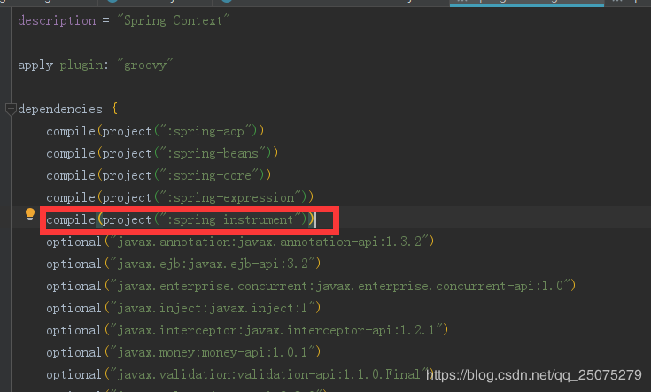

## 1.第一次build时间很长

修改build.gradle

```groovy
repositories {
			mavenCentral()
			maven { url "https://maven.aliyun.com/repository/central"}
			maven { url "https://maven.aliyun.com/nexus/content/groups/public/" }
			// maven { url "https://repo.spring.io/libs-spring-framework-build" }
		}
```


## 2. 每次run的时间很长



修改Build and run using和Run tests using为Idea


### 2.1 修改之后出现问题

```console
Error:(354, 51) java: 找不到符号
符号: 变量 CoroutinesUtils
位置: 类 org.springframework.core.ReactiveAdapterRegistry.CoroutinesRegistrar
```

解决方法：
点击File -> Project Structure -> Libraries -> + -> Java，然后选择spring-framework/spring-core/kotlin-coroutines/build/libs/kotlin-coroutines-5.2.4.BUILD-SNAPSHOT.jar，在弹出的对话框中选择spring-core.main，在重新build项目即可。




add jar-> spring-framework/spring-core-coroutines/build/libs/spring-core-coroutines-5.2.0.BUILD-SNAPSHOT.jar ->spring-core -> spring-core.main


### 2.2 修改上一步之后出现找不到InstrumentationSavingAgent

修改spring-context.gradle



修改optional为 compile 问题解决

### 2.3重新Build的时候出现找不到符号符号:类 xxx位置:程序包 xxx.xxx

gradle->tasks->build->clear->build