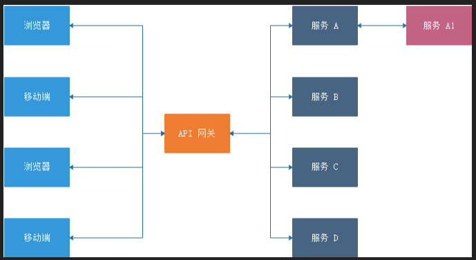
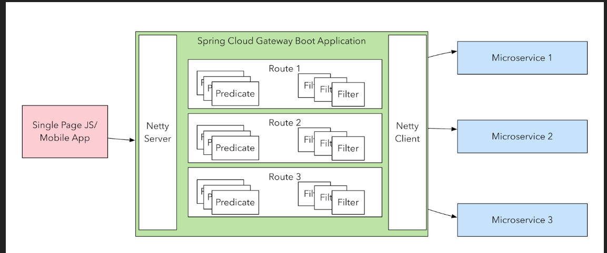
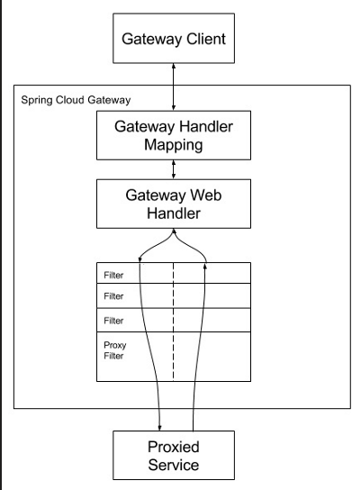
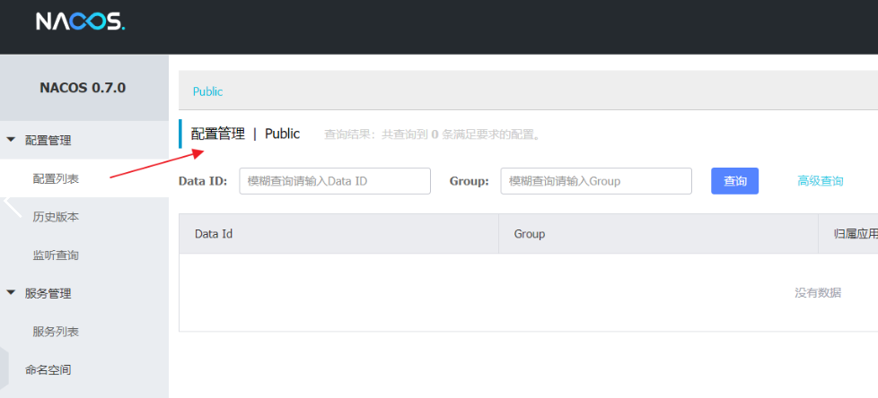

## 创建SpringCloudalibaba

### 创建依赖管理项目

```xml
<project xmlns="http://maven.apache.org/POM/4.0.0" xmlns:xsi="http://www.w3.org/2001/XMLSchema-instance"
         xsi:schemaLocation="http://maven.apache.org/POM/4.0.0 http://maven.apache.org/xsd/maven-4.0.0.xsd">
    <modelVersion>4.0.0</modelVersion>
<parent>
        <groupId>org.springframework.boot</groupId>
        <artifactId>spring-boot-starter-parent</artifactId>
        <version>2.0.6.RELEASE</version>
    </parent>
<groupId>com.funtl</groupId>
    <artifactId>hello-spring-cloud-alibaba-dependencies</artifactId>
    <version>1.0.0-SNAPSHOT</version>
    <packaging>pom</packaging>
<name>hello-spring-cloud-alibaba-dependencies</name>
    <url>http://www.funtl.com</url>
    <inceptionYear>2018-Now</inceptionYear>
<properties>
        <!-- Environment Settings -->
        <java.version>1.8</java.version>
        <project.build.sourceEncoding>UTF-8</project.build.sourceEncoding>
        <project.reporting.outputEncoding>UTF-8</project.reporting.outputEncoding>
<!-- Spring Settings -->
        <spring-cloud.version>Finchley.SR2</spring-cloud.version>
        <spring-cloud-alibaba.version>0.2.1.RELEASE</spring-cloud-alibaba.version>
    </properties>
<dependencyManagement>
        <dependencies>
            <dependency>
                <groupId>org.springframework.cloud</groupId>
                <artifactId>spring-cloud-dependencies</artifactId>
                <version>${spring-cloud.version}</version>
                <type>pom</type>
                <scope>import</scope>
            </dependency>
            <dependency>
                <groupId>org.springframework.cloud</groupId>
                <artifactId>spring-cloud-alibaba-dependencies</artifactId>
                <version>${spring-cloud-alibaba.version}</version>
                <type>pom</type>
                <scope>import</scope>
            </dependency>
        </dependencies>
    </dependencyManagement>
<build>
        <plugins>
            <!-- Compiler 插件, 设定 JDK 版本 -->
            <plugin>
                <groupId>org.apache.maven.plugins</groupId>
                <artifactId>maven-compiler-plugin</artifactId>
                <configuration>
                    <showWarnings>true</showWarnings>
                </configuration>
            </plugin>
<!-- 打包 jar 文件时，配置 manifest 文件，加入 lib 包的 jar 依赖 -->
            <plugin>
                <groupId>org.apache.maven.plugins</groupId>
                <artifactId>maven-jar-plugin</artifactId>
                <configuration>
                    <archive>
                        <addMavenDescriptor>false</addMavenDescriptor>
                    </archive>
                </configuration>
                <executions>
                    <execution>
                        <configuration>
                            <archive>
                                <manifest>
                                    <!-- Add directory entries -->
                                    <addDefaultImplementationEntries>true</addDefaultImplementationEntries>
                                    <addDefaultSpecificationEntries>true</addDefaultSpecificationEntries>
                                    <addClasspath>true</addClasspath>
                                </manifest>
                            </archive>
                        </configuration>
                    </execution>
                </executions>
            </plugin>
<!-- resource -->
            <plugin>
                <groupId>org.apache.maven.plugins</groupId>
                <artifactId>maven-resources-plugin</artifactId>
            </plugin>
<!-- install -->
            <plugin>
                <groupId>org.apache.maven.plugins</groupId>
                <artifactId>maven-install-plugin</artifactId>
            </plugin>
<!-- clean -->
            <plugin>
                <groupId>org.apache.maven.plugins</groupId>
                <artifactId>maven-clean-plugin</artifactId>
            </plugin>
<!-- ant -->
            <plugin>
                <groupId>org.apache.maven.plugins</groupId>
                <artifactId>maven-antrun-plugin</artifactId>
            </plugin>
<!-- dependency -->
            <plugin>
                <groupId>org.apache.maven.plugins</groupId>
                <artifactId>maven-dependency-plugin</artifactId>
            </plugin>
        </plugins>
<pluginManagement>
            <plugins>
                <!-- Java Document Generate -->
                <plugin>
                    <groupId>org.apache.maven.plugins</groupId>
                    <artifactId>maven-javadoc-plugin</artifactId>
                    <executions>
                        <execution>
                            <phase>prepare-package</phase>
                            <goals>
                                <goal>jar</goal>
                            </goals>
                        </execution>
                    </executions>
                </plugin>
<!-- YUI Compressor (CSS/JS压缩) -->
                <plugin>
                    <groupId>net.alchim31.maven</groupId>
                    <artifactId>yuicompressor-maven-plugin</artifactId>
                    <version>1.5.1</version>
                    <executions>
                        <execution>
                            <phase>prepare-package</phase>
                            <goals>
                                <goal>compress</goal>
                            </goals>
                        </execution>
                    </executions>
                    <configuration>
                        <encoding>UTF-8</encoding>
                        <jswarn>false</jswarn>
                        <nosuffix>true</nosuffix>
                        <linebreakpos>30000</linebreakpos>
                        <force>true</force>
                        <includes>
                            <include>**/*.js</include>
                            <include>**/*.css</include>
                        </includes>
                        <excludes>
                            <exclude>**/*.min.js</exclude>
                            <exclude>**/*.min.css</exclude>
                        </excludes>
                    </configuration>
                </plugin>
            </plugins>
        </pluginManagement>
<!-- 资源文件配置 -->
        <resources>
            <resource>
                <directory>src/main/java</directory>
                <excludes>
                    <exclude>**/*.java</exclude>
                </excludes>
            </resource>
            <resource>
                <directory>src/main/resources</directory>
            </resource>
        </resources>
    </build>
<repositories>
        <repository>
            <id>aliyun-repos</id>
            <name>Aliyun Repository</name>
            <url>http://maven.aliyun.com/nexus/content/groups/public</url>
            <releases>
                <enabled>true</enabled>
            </releases>
            <snapshots>
                <enabled>false</enabled>
            </snapshots>
        </repository>
<repository>
            <id>sonatype-repos</id>
            <name>Sonatype Repository</name>
            <url>https://oss.sonatype.org/content/groups/public</url>
            <releases>
                <enabled>true</enabled>
            </releases>
            <snapshots>
                <enabled>false</enabled>
            </snapshots>
        </repository>
        <repository>
            <id>sonatype-repos-s</id>
            <name>Sonatype Repository</name>
            <url>https://oss.sonatype.org/content/repositories/snapshots</url>
            <releases>
                <enabled>false</enabled>
            </releases>
            <snapshots>
                <enabled>true</enabled>
            </snapshots>
        </repository>
<repository>
            <id>spring-snapshots</id>
            <name>Spring Snapshots</name>
            <url>https://repo.spring.io/snapshot</url>
            <snapshots>
                <enabled>true</enabled>
            </snapshots>
        </repository>
        <repository>
            <id>spring-milestones</id>
            <name>Spring Milestones</name>
            <url>https://repo.spring.io/milestone</url>
            <snapshots>
                <enabled>false</enabled>
            </snapshots>
        </repository>
    </repositories>
<pluginRepositories>
        <pluginRepository>
            <id>aliyun-repos</id>
            <name>Aliyun Repository</name>
            <url>http://maven.aliyun.com/nexus/content/groups/public</url>
            <releases>
                <enabled>true</enabled>
            </releases>
            <snapshots>
                <enabled>false</enabled>
            </snapshots>
        </pluginRepository>
    </pluginRepositories>
</project>

```

- parent：继承了      Spring Boot 的 Parent，表示我们是一个 Spring Boot 工程
- package：pom，表示该项目仅当做依赖项目，没有具体的实现代码

- spring-cloud-alibaba-dependencies：在 properties 配置中预定义了版本号为 0.2.1.RELEASE ，表示我们的 Spring Cloud Alibaba 对应的是 Spring Cloud      Finchley 版本

- build：配置了项目所需的各种插件
- repositories：配置项目下载依赖时的第三方库

### 创建服务提供者

#### **pom.xml**

**创建一个工程名为 hello-spring-cloud-alibaba-nacos-provider 的服务提供者项目，pom.xml 配置如下：**

```xml
<?xml version="1.0" encoding="UTF-8"?>
<project xmlns="http://maven.apache.org/POM/4.0.0" xmlns:xsi="http://www.w3.org/2001/XMLSchema-instance"
         xsi:schemaLocation="http://maven.apache.org/POM/4.0.0 http://maven.apache.org/xsd/maven-4.0.0.xsd">
    <modelVersion>4.0.0</modelVersion>
<parent>
        <groupId>com.funtl</groupId>
        <artifactId>hello-spring-cloud-alibaba-dependencies</artifactId>
        <version>1.0.0-SNAPSHOT</version>
        <relativePath>../hello-spring-cloud-alibaba-dependencies/pom.xml</relativePath>
    </parent>
<artifactId>hello-spring-cloud-alibaba-nacos-provider</artifactId>
    <packaging>jar</packaging>
<name>hello-spring-cloud-alibaba-nacos-provider</name>
    <url>http://www.funtl.com</url>
    <inceptionYear>2018-Now</inceptionYear>
<dependencies>
        <!-- Spring Boot Begin -->
        <dependency>
            <groupId>org.springframework.boot</groupId>
            <artifactId>spring-boot-starter-web</artifactId>
        </dependency>
        <dependency>
            <groupId>org.springframework.boot</groupId>
            <artifactId>spring-boot-starter-actuator</artifactId>
        </dependency>
        <dependency>
            <groupId>org.springframework.boot</groupId>
            <artifactId>spring-boot-starter-test</artifactId>
            <scope>test</scope>
        </dependency>
        <!-- Spring Boot End -->
	   <!-- Spring Cloud Begin -->
        <dependency>
            <groupId>org.springframework.cloud</groupId>
            <artifactId>spring-cloud-starter-alibaba-nacos-discovery</artifactId>
        </dependency>
        <!-- Spring Cloud End -->
    </dependencies>
<build>
        <plugins>
            <plugin>
                <groupId>org.springframework.boot</groupId>
                <artifactId>spring-boot-maven-plugin</artifactId>
                <configuration>
                    <mainClass>com.funtl.hello.spring.cloud.alibaba.nacos.provider.NacosProviderApplication</mainClass>
                </configuration>
            </plugin>
        </plugins>
    </build>
</project>

```

#### application.yaml

```yaml
spring:
  application:
    name: nacos-provider
  cloud:
    nacos:
      discovery:
        server-addr: 127.0.0.1:8848
server:
  port: 8081
management:
  endpoints:
    web:
      exposure:
        include: "*"
```

#### Application.class

**通过 @EnableDiscoveryClient 注解表明是一个 Nacos 客户端，该注解是 SpringCloud 提供的原生注解**

```java
import org.springframework.boot.SpringApplication;
import org.springframework.boot.autoconfigure.SpringBootApplication;
import org.springframework.cloud.client.discovery.EnableDiscoveryClient;
import org.springframework.web.bind.annotation.GetMapping;
import org.springframework.web.bind.annotation.PathVariable;
import org.springframework.web.bind.annotation.RestController;

@SpringBootApplication
@EnableDiscoveryClient
public class NacosProviderApplication {
    public static void main(String[] args) {
        SpringApplication.run(NacosProviderApplication.class, args);
    }
    
	@RestController
    public class EchoController {
        @GetMapping(value = "/echo/{message}")
        public String echo(@PathVariable String message) {
            return "Hello Nacos Discovery " + message;
        }
    }
}

```

#### 服务的端点检查

spring-cloud-starter-alibaba-nacos-discovery 在实现的时候提供了一个 EndPoint, EndPoint 的访问地址为 <http://ip:port/actuator/nacos-discovery>。 EndPoint 的信息主要提供了两类:

1. subscribe: 显示了当前有哪些服务订阅者
2. NacosDiscoveryProperties: 显示了当前服务实例关于 Nacos 的基础配置

通过浏览器访问 <http://localhost:8081/actuator/nacos-discovery> 


### 创建服务消费者

**服务消费者的创建与服务提供者大同小异，这里采用最原始的一种方式，即显示的使用LoadBalanceClient 和 RestTemplate 结合的方式来访问**

#### Pom.xml

**创建一个工程名为 hello-spring-cloud-alibaba-nacos-provider 的服务提供者项目，pom.xml 配置如下：**

```xml
<?xml version="1.0" encoding="UTF-8"?>
<project xmlns="http://maven.apache.org/POM/4.0.0" xmlns:xsi="http://www.w3.org/2001/XMLSchema-instance"
         xsi:schemaLocation="http://maven.apache.org/POM/4.0.0 http://maven.apache.org/xsd/maven-4.0.0.xsd">
    <modelVersion>4.0.0</modelVersion>
<parent>
        <groupId>com.funtl</groupId>
        <artifactId>hello-spring-cloud-alibaba-dependencies</artifactId>
        <version>1.0.0-SNAPSHOT</version>
        <relativePath>../hello-spring-cloud-alibaba-dependencies/pom.xml</relativePath>
    </parent>
<artifactId>hello-spring-cloud-alibaba-nacos-provider</artifactId>
    <packaging>jar</packaging>
<name>hello-spring-cloud-alibaba-nacos-provider</name>
    <url>http://www.funtl.com</url>
    <inceptionYear>2018-Now</inceptionYear>
<dependencies>
        <!-- Spring Boot Begin -->
        <dependency>
            <groupId>org.springframework.boot</groupId>
            <artifactId>spring-boot-starter-web</artifactId>
        </dependency>
        <dependency>
            <groupId>org.springframework.boot</groupId>
            <artifactId>spring-boot-starter-actuator</artifactId>
        </dependency>
        <dependency>
            <groupId>org.springframework.boot</groupId>
            <artifactId>spring-boot-starter-test</artifactId>
            <scope>test</scope>
        </dependency>
        <!-- Spring Boot End -->
<!-- Spring Cloud Begin -->
        <dependency>
            <groupId>org.springframework.cloud</groupId>
            <artifactId>spring-cloud-starter-alibaba-nacos-discovery</artifactId>
        </dependency>
        <!-- Spring Cloud End -->
    </dependencies>
<build>
        <plugins>
            <plugin>
                <groupId>org.springframework.boot</groupId>
                <artifactId>spring-boot-maven-plugin</artifactId>
                <configuration>
                    <mainClass>com.funtl.hello.spring.cloud.alibaba.nacos.provider.NacosProviderApplication</mainClass>
                </configuration>
            </plugin>
        </plugins>
    </build>
</project>

```

#### Application.class

```java
import org.springframework.boot.SpringApplication;
import org.springframework.boot.autoconfigure.SpringBootApplication;
import org.springframework.cloud.client.discovery.EnableDiscoveryClient;

@SpringBootApplication
@EnableDiscoveryClient
public class NacosConsumerApplication {
    public static void main(String[] args) {
        SpringApplication.run(NacosConsumerApplication.class, args);
    }
}

```

#### NacosConsumerConfiguration.class

**创建一个名为 NacosConsumerConfiguration 的 Java配置类，主要作用是为了注入 RestTemplate**

```java
import org.springframework.context.annotation.Bean;
import org.springframework.context.annotation.Configuration;
import org.springframework.web.client.RestTemplate;

@Configuration
public class NacosConsumerConfiguration {
@Bean
    public RestTemplate restTemplate() {
        return new RestTemplate();
    }
}

```

#### NacosConsumerController.class

```java
import org.springframework.beans.factory.annotation.Autowired;
import org.springframework.beans.factory.annotation.Value;
import org.springframework.cloud.client.ServiceInstance;
import org.springframework.cloud.client.loadbalancer.LoadBalancerClient;
import org.springframework.web.bind.annotation.GetMapping;
import org.springframework.web.bind.annotation.RestController;
import org.springframework.web.client.RestTemplate;
@RestController
public class NacosConsumerController {
@Autowired
    private LoadBalancerClient loadBalancerClient;
@Autowired
    private RestTemplate restTemplate;
@Value("${spring.application.name}")
    private String appName;
@GetMapping(value = "/echo/app/name")
    public String echo() {
        //使用 LoadBalanceClient 和 RestTemplate 结合的方式来访问
        ServiceInstance serviceInstance = loadBalancerClient.choose("nacos-provider");
        String url = String.format("http://%s:%s/echo/%s", serviceInstance.getHost(), serviceInstance.getPort(), appName);
        return restTemplate.getForObject(url, String.class);
    }
}
```

### 创建服务消费者（Feign）

#### 概述

**Feign 是一个声明式的伪 Http 客户端，它使得写 Http 客户端变得更简单。使用Feign，只需要创建一个接口并注解。它具有可插拔的注解特性，可使用 Feign 注解和 JAX-RS 注解。Feign支持可插拔的编码器和解码器。Feign 默认集成了 Ribbon，Nacos 也很好的兼容了 Feign，默认实现了负载均衡的效果**

- **Feign      采用的是基于接口的注解**
- **Feign      整合了 ribbon**

#### pom.xml

**创建一个工程名为 hello-spring-cloud-alibaba-nacos-consumer-feign 的服务消费者项目，pom.xml 配置如下：**

```xml
<?xml version="1.0" encoding="UTF-8"?>
<project xmlns="http://maven.apache.org/POM/4.0.0" xmlns:xsi="http://www.w3.org/2001/XMLSchema-instance"
         xsi:schemaLocation="http://maven.apache.org/POM/4.0.0 http://maven.apache.org/xsd/maven-4.0.0.xsd">
    <modelVersion>4.0.0</modelVersion>
<parent>
        <groupId>com.funtl</groupId>
        <artifactId>hello-spring-cloud-alibaba-dependencies</artifactId>
        <version>1.0.0-SNAPSHOT</version>
        <relativePath>../hello-spring-cloud-alibaba-dependencies/pom.xml</relativePath>
    </parent>
<artifactId>hello-spring-cloud-alibaba-nacos-consumer-feign</artifactId>
    <packaging>jar</packaging>
<name>hello-spring-cloud-alibaba-nacos-consumer-feign</name>
    <url>http://www.funtl.com</url>
    <inceptionYear>2018-Now</inceptionYear>
<dependencies>
        <!-- Spring Boot Begin -->
        <dependency>
            <groupId>org.springframework.boot</groupId>
            <artifactId>spring-boot-starter-web</artifactId>
        </dependency>
        <dependency>
            <groupId>org.springframework.boot</groupId>
            <artifactId>spring-boot-starter-actuator</artifactId>
        </dependency>
        <dependency>
            <groupId>org.springframework.boot</groupId>
            <artifactId>spring-boot-starter-test</artifactId>
            <scope>test</scope>
        </dependency>
        <!-- Spring Boot End -->
<!-- Spring Cloud Begin -->
        <dependency>
            <groupId>org.springframework.cloud</groupId>
            <artifactId>spring-cloud-starter-alibaba-nacos-discovery</artifactId>
        </dependency>
        <dependency>
            <groupId>org.springframework.cloud</groupId>
            <artifactId>spring-cloud-starter-openfeign</artifactId>
        </dependency>
        <!-- Spring Cloud End -->
    </dependencies>
<build>
        <plugins>
            <plugin>
                <groupId>org.springframework.boot</groupId>
                <artifactId>spring-boot-maven-plugin</artifactId>
                <configuration>
                    <mainClass>com.funtl.hello.spring.cloud.alibaba.nacos.consumer.feign.NacosConsumerFeignApplication</mainClass>
                </configuration>
            </plugin>
        </plugins>
    </build>
</project>

```

**主要增加了 org.springframework.cloud:spring-cloud-starter-openfeign 依赖**

#### application.yaml

```yaml
spring:
  application:
    name: nacos-consumer-feign
  cloud:
    nacos:
      discovery:
        server-addr: 127.0.0.1:8848
server:
  port: 9092
management:
  endpoints:
    web:
      exposure:
        include: "*"

```


#### Application.class

**通过 @EnableFeignClients 注解开启 Feign 功能**

```java
import org.springframework.boot.SpringApplication;
import org.springframework.boot.autoconfigure.SpringBootApplication;
import org.springframework.cloud.client.discovery.EnableDiscoveryClient;
import org.springframework.cloud.openfeign.EnableFeignClients;
@SpringBootApplication
@EnableDiscoveryClient
@EnableFeignClients
public class NacosConsumerFeignApplication {
    public static void main(String[] args) {
        SpringApplication.run(NacosConsumerFeignApplication.class, args);
    }
}
```

#### 创建 Feign 接口

**通过 @FeignClient("服务名") 注解来指定调用哪个服务。代码如下：**

```java
import org.springframework.cloud.openfeign.FeignClient;
import org.springframework.web.bind.annotation.GetMapping;
import org.springframework.web.bind.annotation.PathVariable;
@FeignClient(value = "nacos-provider")
public interface EchoService {
@GetMapping(value = "/echo/{message}")
    String echo(@PathVariable("message") String message);
}


import com.funtl.hello.spring.cloud.alibaba.nacos.consumer.feign.service.EchoService;
import org.springframework.beans.factory.annotation.Autowired;
import org.springframework.web.bind.annotation.GetMapping;
import org.springframework.web.bind.annotation.RestController;
@RestController
public class NacosConsumerFeignController {
@Autowired
    private EchoService echoService;
@GetMapping(value = "/echo/hi")
    public String echo() {
        return echoService.echo("Hi Feign");
    }
}

```

#### 修改 consumer-provider 项目中的 Controller 代码，用于确定负载均衡生效

```java
import org.springframework.beans.factory.annotation.Value;
import org.springframework.boot.SpringApplication;
import org.springframework.boot.autoconfigure.SpringBootApplication;
import org.springframework.cloud.client.discovery.EnableDiscoveryClient;
import org.springframework.web.bind.annotation.GetMapping;
import org.springframework.web.bind.annotation.PathVariable;
import org.springframework.web.bind.annotation.RestController;
@SpringBootApplication
@EnableDiscoveryClient
public class NacosProviderApplication {
    public static void main(String[] args) {
        SpringApplication.run(NacosProviderApplication.class, args);
    }
@Value("${server.port}")
    private String port;
@RestController
    public class EchoController {
        @GetMapping(value = "/echo/{message}")
        public String echo(@PathVariable String message) {
            return "Hello Nacos Discovery " + message + " i am from port " + port;
        }
    }
}

```

### 熔断器

在微服务架构中，根据业务来拆分成一个个的服务，服务与服务之间可以通过 RPC 相互调用，在 Spring Cloud 中可以用 RestTemplate + LoadBalanceClient 和 Feign 来调用。为了保证其高可用，单个服务通常会集群部署。由于网络原因或者自身的原因，服务并不能保证 100% 可用，如果单个服务出现问题，调用这个服务就会出现线程阻塞，此时若有大量的请求涌入，Servlet 容器的线程资源会被消耗完毕，导致服务瘫痪。服务与服务之间的依赖性，故障会传播，会对整个微服务系统造成灾难性的严重后果，这就是服务故障的 “雪崩” 效应。

为了解决这个问题，业界提出了熔断器模型。

阿里巴巴开源了 Sentinel 组件，实现了熔断器模式，Spring Cloud 对这一组件进行了整合。在微服务架构中，一个请求需要调用多个服务是非常常见的，如下图：



较底层的服务如果出现故障，会导致连锁故障。当对特定的服务的调用的不可用达到一个阀值熔断器将会被打开。


熔断器打开后，为了避免连锁故障，通过 fallback 方法可以直接返回一个固定值。

#### Sentinel

**随着微服务的流行，服务和服务之间的稳定性变得越来越重要。 Sentinel
以流量为切入点，从流量控制、熔断降级、系统负载保护等多个维度保护服务的稳定性。**

Sentinel 的特征

- **丰富的应用场景： Sentinel      承接了阿里巴巴近 10      年的 双十一大促流量 的核心场景，例如秒杀（即突发流量控制在系统容量可以承受的范围）、消息削峰填谷、实时熔断下游不可用应用等。**
- **完备的实时监控： Sentinel      同时提供实时的监控功能。您可以在控制台中看到接入应用的单台机器秒级数据，甚至 500 台以下规模的集群的汇总运行情况。**
- **广泛的开源生态： Sentinel      提供开箱即用的与其它开源框架/库的整合模块，例如与 Spring Cloud、Dubbo、gRPC      的整合。您只需要引入相应的依赖并进行简单的配置即可快速地接入 Sentinel。**
- **完善的      SPI 扩展点： Sentinel 提供简单易用、完善的 SPI      扩展点。您可以通过实现扩展点，快速的定制逻辑。例如定制规则管理、适配数据源等。**

##### Feign 中使用 Sentinel

**如果要在您的项目中引入 Sentinel，使用 group ID 为 org.springframework.cloud 和 artifact ID 为 spring-cloud-starter-alibaba-sentinel 的 starter。**

```xml
<dependency>
    <groupId>org.springframework.cloud</groupId>
    <artifactId>spring-cloud-starter-alibaba-sentinel</artifactId>
</dependency>

```

##### application.yaml

**Sentinel适配了 Feign 组件。但默认是关闭的。需要在配置文件中配置打开它，在配置文件增加以下代码：**

```yaml
feign:
  sentinel:
    enabled: true
```

##### 在 Service 中增加 fallback 指定类

```java
import com.funtl.hello.spring.cloud.alibaba.nacos.consumer.feign.service.fallback.EchoServiceFallback;
import org.springframework.cloud.openfeign.FeignClient;
import org.springframework.web.bind.annotation.GetMapping;
import org.springframework.web.bind.annotation.PathVariable;

@FeignClient(value = "nacos-provider", fallback = EchoServiceFallback.class)
public interface EchoService {
@GetMapping(value = "/echo/{message}")
    String echo(@PathVariable("message") String message);
}
```

##### 创建熔断器类并实现对应的 Feign 接口

```java
import com.funtl.hello.spring.cloud.alibaba.nacos.consumer.feign.service.EchoService;
import org.springframework.stereotype.Component;
@Component
public class EchoServiceFallback implements EchoService {
    @Override
    public String echo(String message) {
        return "echo fallback";
    }
}
```

#### Sentinel 控制台

Sentinel 控制台提供一个轻量级的控制台，它提供机器发现、单机资源实时监控、集群资源汇总，以及规则管理的功能。您只需要对应用进行简单的配置，就可以使用这些功能。

注意: 集群资源汇总仅支持 500 台以下的应用集群，有大概 1 - 2 秒的延时。

##### 下载并打包

```bash
# 下载源码
git clone https://github.com/alibaba/Sentinel.git
# 编译打包
mvn clean package
```

##### 启动控制台

**Sentinel 控制台是一个标准的 SpringBoot 应用，以 SpringBoot 的方式运行jar 包即可。**

```bash
cd sentinel-dashboard\target
java -Dserver.port=8080 -Dcsp.sentinel.dashboard.server=localhost:8080 -Dproject.name=sentinel-dashboard -jar sentinel-dashboard.jar
```

**如若 8080端口冲突，可使用 -Dserver.port=新端口 进行设置。**

##### 配置控制台信息

###### application.yaml

```yaml
# application.yml 配置文件中增加如下配置：
spring:
  cloud:
    sentinel:
      transport:
        port: 8719
        dashboard: localhost:8080

```

**这里的 spring.cloud.sentinel.transport.port 端口配置会在应用对应的机器上启动一个 Http Server，该 Server 会与 Sentinel 控制台做交互。比如 Sentinel 控制台添加了 1 个限流规则，会把规则数据 push 给这个 Http Server 接收，Http Server 再将规则注册到 Sentinel 中。**

##### 测试 Sentinel

##### application.yaml

使用之前的 Feign 客户端，application.yml 完整配置如下：

```yaml
spring:
  application:
    name: nacos-consumer-feign
  cloud:
    nacos:
      discovery:
        server-addr: 127.0.0.1:8848
    sentinel:
      transport:
        port: 8720
        dashboard: localhost:8080
server:
  port: 9092
feign:
  sentinel:
    enabled: true
management:
  endpoints:
    web:
      exposure:
        include: "*"
```

> 注：由于 8719 端口已被 sentinel-dashboard 占用，故这里修改端口号为8720；不修改也能注册，会自动帮你在端口号上 + 1；

### Spring Cloud Gateway

#### 什么是 Spring Cloud Gateway

**Spring Cloud Gateway 是 Spring 官方基于 Spring 5.0，SpringBoot 2.0 和 Project Reactor 等技术开发的网关，Spring Cloud Gateway 旨在为微服务架构提供一种简单而有效的统一的API 路由管理方式。Spring Cloud Gateway 作为 Spring Cloud 生态系中的网关，目标是替代 Netflix ZUUL，其不仅提供统一的路由方式，并且基于 Filter 链的方式提供了网关基本的功能，例如：安全，监控/埋点，和限流等。**



#### Spring Cloud Gateway 功能特征

- 基于      Spring Framework 5，Project Reactor 和 Spring Boot 2.0
- 动态路由
- Predicates      和 Filters 作用于特定路由
- 集成      Hystrix 断路器
- 集成      Spring Cloud DiscoveryClient
- 易于编写的      Predicates 和 Filters
- 限流
- 路径重写

#### Spring Cloud Gateway 工程流程



客户端向 Spring Cloud Gateway 发出请求。然后在 Gateway Handler Mapping 中找到与请求相匹配的路由，将其发送到 Gateway Web Handler。Handler 再通过指定的过滤器链来将请求发送到我们实际的服务执行业务逻辑，然后返回。

过滤器之间用虚线分开是因为过滤器可能会在发送代理请求之前（pre）或之后（post）执行业务逻辑。

#### 使用

##### pom.xml

```xml
<?xml version="1.0" encoding="UTF-8"?>
<project xmlns="http://maven.apache.org/POM/4.0.0" xmlns:xsi="http://www.w3.org/2001/XMLSchema-instance"
         xsi:schemaLocation="http://maven.apache.org/POM/4.0.0 http://maven.apache.org/xsd/maven-4.0.0.xsd">
    <modelVersion>4.0.0</modelVersion>
<parent>
        <groupId>com.funtl</groupId>
        <artifactId>hello-spring-cloud-alibaba-dependencies</artifactId>
        <version>1.0.0-SNAPSHOT</version>
        <relativePath>../hello-spring-cloud-alibaba-dependencies/pom.xml</relativePath>
    </parent>
<artifactId>hello-spring-cloud-gateway</artifactId>
    <packaging>jar</packaging>
<name>hello-spring-cloud-gateway</name>
    <url>http://www.funtl.com</url>
    <inceptionYear>2018-Now</inceptionYear>
<dependencies>
        <!-- Spring Boot Begin -->
        <dependency>
            <groupId>org.springframework.boot</groupId>
            <artifactId>spring-boot-starter-actuator</artifactId>
        </dependency>
        <dependency>
            <groupId>org.springframework.boot</groupId>
            <artifactId>spring-boot-starter-test</artifactId>
            <scope>test</scope>
        </dependency>
        <!-- Spring Boot End -->
<!-- Spring Cloud Begin -->
        <dependency>
            <groupId>org.springframework.cloud</groupId>
            <artifactId>spring-cloud-starter-alibaba-nacos-discovery</artifactId>
        </dependency>
        <dependency>
            <groupId>org.springframework.cloud</groupId>
            <artifactId>spring-cloud-starter-alibaba-sentinel</artifactId>
        </dependency>
        <dependency>
            <groupId>org.springframework.cloud</groupId>
            <artifactId>spring-cloud-starter-openfeign</artifactId>
        </dependency>
        <dependency>
            <groupId>org.springframework.cloud</groupId>
            <artifactId>spring-cloud-starter-gateway</artifactId>
        </dependency>
        <!-- Spring Cloud End -->
<!-- Commons Begin -->
        <dependency>
            <groupId>javax.servlet</groupId>
            <artifactId>javax.servlet-api</artifactId>
        </dependency>
        <!-- Commons Begin -->
    </dependencies>
<build>
        <plugins>
            <plugin>
                <groupId>org.springframework.boot</groupId>
                <artifactId>spring-boot-maven-plugin</artifactId>
                <configuration>
                    <mainClass>com.funtl.hello.spring.cloud.gateway.GatewayApplication</mainClass>
                </configuration>
            </plugin>
        </plugins>
    </build>
</project>

```

主要增加了 org.springframework.cloud:spring-cloud-starter-gateway 依赖

> 特别注意
>
> - Spring Cloud Gateway 不使用 Web 作为服务器，而是 使用 WebFlux      作为服务器，Gateway 项目已经依赖了 starter-webflux，所以这里 千万不要依赖 starter-web
> - 由于过滤器等功能依然需要 Servlet 支持，故这里还需要依赖 javax.servlet:javax.servlet-api

##### application.yaml

```yaml
spring:
  application:
    # 应用名称
    name: spring-gateway
  cloud:
    # 使用 Naoos 作为服务注册发现
    nacos:
      discovery:
        server-addr: 127.0.0.1:8848
    # 使用 Sentinel 作为熔断器
    sentinel:
      transport:
        port: 8721
        dashboard: localhost:8080
    # 路由网关配置
    gateway:
      # 设置与服务注册发现组件结合，这样可以采用服务名的路由策略
      discovery:
        locator:
          enabled: true
      # 配置路由规则
      routes:
        # 采用自定义路由 ID（有固定用法，不同的 id 有不同的功能，详见：https://cloud.spring.io/spring-cloud-gateway/2.0.x/single/spring-cloud-gateway.html#gateway-route-filters）
        - id: NACOS-CONSUMER
          # 采用 LoadBalanceClient 方式请求，以 lb:// 开头，后面的是注册在 Nacos 上的服务名
          uri: lb://nacos-consumer
          # Predicate 翻译过来是“谓词”的意思，必须，主要作用是匹配用户的请求，有很多种用法
          predicates:
            # Method 方法谓词，这里是匹配 GET 和 POST 请求
            - Method=GET,POST
        - id: NACOS-CONSUMER-FEIGN
          uri: lb://nacos-consumer-feign
          predicates:
            - Method=GET,POST
server:
  port: 9000
# 目前无效
feign:
  sentinel:
    enabled: true
# 目前无效
management:
  endpoints:
    web:
      exposure:
        include: "*"
# 配置日志级别，方别调试
logging:
  level:
    org.springframework.cloud.gateway: debug

```


##### Application.class

```java
import org.springframework.boot.SpringApplication;
import org.springframework.boot.autoconfigure.SpringBootApplication;
import org.springframework.cloud.client.discovery.EnableDiscoveryClient;
import org.springframework.cloud.openfeign.EnableFeignClients;
@SpringBootApplication
@EnableDiscoveryClient
@EnableFeignClients
public class GatewayApplication {
    public static void main(String[] args) {
        SpringApplication.run(GatewayApplication.class, args);
    }
}

```

#### Gateway中的过滤器

##### 概述

**全局过滤器作用于所有的路由，不需要单独配置，我们可以用它来实现很多统一化处理的业务需求，比如权限认证，IP 访问限制等等。**

**Spring Cloud Gateway 基于 Project Reactor 和 WebFlux，采用响应式编程风格，打开它的 Filter 的接口 GlobalFilter 你会发现它只有一个方法 filter。**

##### 创建全局过滤器

**实现 GlobalFilter, Ordered 接口并在类上增加 @Component 注解就可以使用过滤功能了，非常简单方便**

```java
import com.fasterxml.jackson.core.JsonProcessingException;
import com.fasterxml.jackson.databind.ObjectMapper;
import com.google.common.collect.Maps;
import org.springframework.cloud.gateway.filter.GatewayFilterChain;
import org.springframework.cloud.gateway.filter.GlobalFilter;
import org.springframework.core.Ordered;
import org.springframework.core.io.buffer.DataBuffer;
import org.springframework.http.HttpStatus;
import org.springframework.http.server.reactive.ServerHttpResponse;
import org.springframework.stereotype.Component;
import org.springframework.web.server.ServerWebExchange;
import reactor.core.publisher.Mono;
import java.util.Map;
/**
 * 鉴权过滤器
 */
@Component
public class AuthFilter implements GlobalFilter, Ordered {
    @Override
    public Mono<Void> filter(ServerWebExchange exchange, GatewayFilterChain chain) {
        String token = exchange.getRequest().getQueryParams().getFirst("token");
if (token == null || token.isEmpty()) {
            ServerHttpResponse response = exchange.getResponse();
// 封装错误信息
            Map<String, Object> responseData = Maps.newHashMap();
            responseData.put("code", 401);
            responseData.put("message", "非法请求");
            responseData.put("cause", "Token is empty");
try {
                // 将信息转换为 JSON
                ObjectMapper objectMapper = new ObjectMapper();
                byte[] data = objectMapper.writeValueAsBytes(responseData);
// 输出错误信息到页面
                DataBuffer buffer = response.bufferFactory().wrap(data);
                response.setStatusCode(HttpStatus.UNAUTHORIZED);
                response.getHeaders().add("Content-Type", "application/json;charset=UTF-8");
                return response.writeWith(Mono.just(buffer));
            } catch (JsonProcessingException e) {
                e.printStackTrace();
            }
        }
return chain.filter(exchange);
    }
/**
    * 设置过滤器的执行顺序
    * @return 
    */
    @Override
    public int getOrder() {
        return Ordered.LOWEST_PRECEDENCE;
    }
}
```

## Spring Cloud Alibaba 服务配置

### 分布式配置中心(Nacos Config)

**在分布式系统中，由于服务数量巨多，为了方便服务配置文件统一管理，实时更新，所以需要分布式配置中心组件。**

#### 概述

**Nacos 提供用于存储配置和其他元数据的 key/value 存储，为分布式系统中的外部化配置提供服务器端和客户端支持。使用 Spring Cloud Alibaba Nacos Config，您可以在 Nacos Server 集中管理你 Spring Cloud 应用的外部属性配置。**

**Spring Cloud Alibaba Nacos Config 是 Spring Cloud Config Server 和 Client 的替代方案，客户端和服务器上的概念与 Spring Environment 和 PropertySource 有着一致的抽象，在特殊的 bootstrap 阶段，配置被加载到 Spring 环境中。当应用程序通过部署管道从开发到测试再到生产时，您可以管理这些环境之间的配置，并确保应用程序具有迁移时需要运行的所有内容。**

#### 创建配置文件

需要在 Nacos Server 中创建配置文件，我们依然采用 YAML 的方式部署配置文件

- 浏览器打开http://localhost:8848/nacos>，访问 Nacos Server



- 新建配置文件，此处我们以之前创建的 [服务提供者](https://www.funtl.com/zh/spring-cloud-alibaba/%E5%88%9B%E5%BB%BA%E6%9C%8D%E5%8A%A1%E6%8F%90%E4%BE%9B%E8%80%85.html#%E5%88%9B%E5%BB%BA%E6%9C%8D%E5%8A%A1%E6%8F%90%E4%BE%9B%E8%80%85) 项目为例


> 注意：Data ID 的默认扩展名为 .properties ，希望使用YAML 配置，此处必须指明是 .yaml

- 发布成功后在 “配置列表”      一栏即可看到刚才创建的配置项


#### 使用

此处我们以之前创建的 [服务提供者](https://www.funtl.com/zh/spring-cloud-alibaba/%E5%88%9B%E5%BB%BA%E6%9C%8D%E5%8A%A1%E6%8F%90%E4%BE%9B%E8%80%85.html#%E5%88%9B%E5%BB%BA%E6%9C%8D%E5%8A%A1%E6%8F%90%E4%BE%9B%E8%80%85) 项目为例

##### pom.xml

**在 pom.xml 中增加 org.springframework.cloud:spring-cloud-starter-alibaba-nacos-config 依赖**

```xml
<dependency>
    <groupId>org.springframework.cloud</groupId>
    <artifactId>spring-cloud-starter-alibaba-nacos-config</artifactId>
</dependency>
```

完整的 pom.xml 如下

```xml
<?xml version="1.0" encoding="UTF-8"?>
<project xmlns="http://maven.apache.org/POM/4.0.0" xmlns:xsi="http://www.w3.org/2001/XMLSchema-instance"
         xsi:schemaLocation="http://maven.apache.org/POM/4.0.0 http://maven.apache.org/xsd/maven-4.0.0.xsd">
    <modelVersion>4.0.0</modelVersion>
<parent>
        <groupId>com.funtl</groupId>
        <artifactId>hello-spring-cloud-alibaba-dependencies</artifactId>
        <version>1.0.0-SNAPSHOT</version>
        <relativePath>../hello-spring-cloud-alibaba-dependencies/pom.xml</relativePath>
    </parent>
<artifactId>hello-spring-cloud-alibaba-nacos-provider</artifactId>
    <packaging>jar</packaging>
<name>hello-spring-cloud-alibaba-nacos-provider</name>
    <url>http://www.funtl.com</url>
    <inceptionYear>2018-Now</inceptionYear>
<dependencies>
        <!-- Spring Boot Begin -->
        <dependency>
            <groupId>org.springframework.boot</groupId>
            <artifactId>spring-boot-starter-web</artifactId>
        </dependency>
        <dependency>
            <groupId>org.springframework.boot</groupId>
            <artifactId>spring-boot-starter-actuator</artifactId>
        </dependency>
        <dependency>
            <groupId>org.springframework.boot</groupId>
            <artifactId>spring-boot-starter-test</artifactId>
            <scope>test</scope>
        </dependency>
        <!-- Spring Boot End -->
<!-- Spring Cloud Begin -->
        <dependency>
            <groupId>org.springframework.cloud</groupId>
            <artifactId>spring-cloud-starter-alibaba-nacos-discovery</artifactId>
        </dependency>
        <dependency>
            <groupId>org.springframework.cloud</groupId>
            <artifactId>spring-cloud-starter-alibaba-nacos-config</artifactId>
        </dependency>
        <!-- Spring Cloud End -->
    </dependencies>
<build>
        <plugins>
            <plugin>
                <groupId>org.springframework.boot</groupId>
                <artifactId>spring-boot-maven-plugin</artifactId>
                <configuration>
                    <mainClass>com.funtl.hello.spring.cloud.alibaba.nacos.provider.NacosProviderApplication</mainClass>
                </configuration>
            </plugin>
        </plugins>
    </build>
</project>

```

##### bootstrap.properties

创建名为 bootstrap.properties 的配置文件并删除之前创建的 application.yml 配置文件

```properties
# 这里的应用名对应 Nacos Config 中的 Data ID，实际应用名称以配置中心的配置为准
spring.application.name=nacos-provider-config
# 指定查找名为 nacos-provider-config.yaml 的配置文件
spring.cloud.nacos.config.file-extension=yaml
# Nacos Server 的地址
spring.cloud.nacos.config.server-addr=127.0.0.1:8848

```

在之前的 Spring Cloud Netflix 课程中有提到过 Spring Boot 配置文件的加载顺序，依次为 `bootstrap.properties -> bootstrap.yml -> application.properties -> application.yml` ，其中 `bootstrap.properties`配置为最高优先级

#####  启动应用程序

启动应用后我们可以通过日志看到，已经成功加载到了配置文件


#### 配置的动态更新

Nacos Config 也支持配置的动态更新，操作流程如下：

- 修改服务端配置，增加一个 `user.name` 的属性


- 修改 Controller ，增加一个请求方法，测试配置更新效果

```java
// 注入配置文件上下文
@Autowired
private ConfigurableApplicationContext applicationContext;

// 从上下文中读取配置
@GetMapping(value = "/hi")
public String sayHi() {
    return "Hello " + applicationContext.getEnvironment().getProperty("user.name");
}
```

- 通过浏览器访问该接口，浏览器显示

```html
Hello Lusifer
```

- 修改服务端配置


此时观察控制台日志，你会发现我们已经成功刷新了配置


- 刷新浏览器，浏览器显示

```html
Hello LusiferLee
```

> **注意：你可以使用 spring.cloud.nacos.config.refresh.enabled=false 来关闭动态刷新**

### Nacos Config 多环境的配置

#### Spring Boot Profile

我们在做项目开发的时候，生产环境和测试环境的一些配置可能会不一样，有时候一些功能也可能会不一样，所以我们可能会在上线的时候手工修改这些配置信息。但是 Spring 中为我们提供了 Profile 这个功能。我们只需要在启动的时候添加一个虚拟机参数，激活自己环境所要用的 Profile 就可以了。

操作起来很简单，只需要为不同的环境编写专门的配置文件，如：`application-dev.yml`、`application-prod.yml`， 启动项目时只需要增加一个命令参数 `--spring.profiles.active=环境配置` 即可，启动命令如下：

```bash
java -jar hello-spring-cloud-alibaba-nacos-provider-1.0.0-SNAPSHOT.jar --spring.profiles.active=prod
```

#### Nacos Config Profile

spring-cloud-starter-alibaba-nacos-config 在加载配置的时候，不仅仅加载了以 dataid 为 `${spring.application.name}.${file-extension:properties}` 为前缀的基础配置，还加载了 dataid 为 `${spring.application.name}-${profile}.${file-extension:properties}` 的基础配置。在日常开发中如果遇到多套环境下的不同配置，可以通过 Spring 提供的 `${spring.profiles.active}` 这个配置项来配置。

此处我们以之前创建的 [**服务提供者**](https://www.funtl.com/zh/spring-cloud-alibaba/%E5%88%9B%E5%BB%BA%E6%9C%8D%E5%8A%A1%E6%8F%90%E4%BE%9B%E8%80%85.html#%E5%88%9B%E5%BB%BA%E6%9C%8D%E5%8A%A1%E6%8F%90%E4%BE%9B%E8%80%85) 项目为例

在 Nacos Server 中增加配置

增加一个名为 `nacos-provider-config-prod.yaml` 的配置


**注意：此时，我将配置文件中的端口由 8081 -> 8082**

##### 在项目中增加配置

增加一个名为 `bootstrap-prod.properties` 的配置文件，内容如下：

```properties
spring.profiles.active=prod
spring.application.name=nacos-provider-config
spring.cloud.nacos.config.file-extension=yaml
spring.cloud.nacos.config.server-addr=127.0.0.1:8848
```

主要增加了 `spring.profiles.active=prod` 配置，用于指定访问 Nacos Server 中的 `nacos-provider-config-prod.yaml` 配置

##### 启动应用程序

此时我们有两个配置文件，分别为 `bootstrap.properties` 和 `bootstrap-prod.properties` ，我们需要指定启动时加载哪一个配置文件，操作流程如下：

- `Run` -> `Edit Configurations..`


- 设置需要激活的配置


- 观察日志，判断是否成功加载配置


## Spring Cloud Alibaba 链路追踪

### 为什么需要链路追踪

##### 什么是链路追踪

微服务架构是通过业务来划分服务的，使用 REST 调用。对外暴露的一个接口，可能需要很多个服务协同才能完成这个接口功能，如果链路上任何一个服务出现问题或者网络超时，都会形成导致接口调用失败。随着业务的不断扩张，服务之间互相调用会越来越复杂。


随着服务的越来越多，对调用链的分析会越来越复杂。它们之间的调用关系也许如下：


面对以上情况，我们就需要一些可以帮助理解系统行为、用于分析性能问题的工具，以便发生故障的时候，能够快速定位和解决问题，这就是所谓的 APM（应用性能管理）。

### 什么是 SkyWalking

目前主要的一些 APM 工具有: Cat、Zipkin、Pinpoint、SkyWalking；Apache SkyWalking 是观察性分析平台和应用性能管理系统。提供分布式追踪、服务网格遥测分析、度量聚合和可视化一体化解决方案。


- **Skywalking Agent：** 使用 JavaAgent 做字节码植入，无侵入式的收集，并通过 HTTP 或者 gRPC 方式发送数据到 SkyWalking Collector。
- **SkyWalking Collector：** 链路数据收集器，对 agent 传过来的数据进行整合分析处理并落入相关的数据存储中。
- **Storage：** SkyWalking 的存储，时间更迭，SW 已经开发迭代到了 6.x 版本，在 6.x 版本中支持以 ElasticSearch(支持 6.x)、Mysql、TiDB、H2、作为存储介质进行数据存储。
- **UI：** Web 可视化平台，用来展示落地的数据。

#### SkyWalking 功能特性

- 多种监控手段，语言探针和服务网格(Service Mesh)
- 多语言自动探针，Java，.NET Core 和 Node.JS
- 轻量高效，不需要大数据
- 模块化，UI、存储、集群管理多种机制可选
- 支持告警
- 优秀的可视化方案

### SkyWalking 服务端配置

#### 基于 Docker 安装 ElasticSearch

在 [**为什么需要链路追踪**](https://www.funtl.com/zh/spring-cloud-alibaba/%E4%B8%BA%E4%BB%80%E4%B9%88%E9%9C%80%E8%A6%81%E9%93%BE%E8%B7%AF%E8%BF%BD%E8%B8%AA.html#%E4%B8%BA%E4%BB%80%E4%B9%88%E9%9C%80%E8%A6%81%E9%93%BE%E8%B7%AF%E8%BF%BD%E8%B8%AA) 章节中介绍过 SkyWalking 存储方案有多种，官方推荐的方案是 ElasticSearch ，所以我们需要先安装 ElasticSearch。

#### docker-compose.yml

```yaml
version: '3.3'
services:
  elasticsearch:
    image: wutang/elasticsearch-shanghai-zone:6.3.2
    container_name: elasticsearch
    restart: always
    ports:
      - 9200:9200
      - 9300:9300
    environment:
      cluster.name: elasticsearch
```

其中，`9200` 端口号为 SkyWalking 配置 ElasticSearch 所需端口号，`cluster.name` 为 SkyWalking 配置 ElasticSearch 集群的名称

#### 测试是否启动成功

浏览器访问 http://elasticsearchIP:9200/ ，浏览器返回如下信息即表示成功启动


下载并启动 SkyWalking

官方已经为我们准备好了编译过的服务端版本，下载地址为 <http://skywalking.apache.org/downloads/>，这里我们需要下载 6.x releases 版本


#### 配置 SkyWalking

下载完成后解压缩，进入 `apache-skywalking-apm-incubating/config` 目录并修改 `application.yml` 配置文件


这里需要做三件事：

- 注释 H2 存储方案
- 启用 ElasticSearch 存储方案
- 修改 ElasticSearch 服务器地址

#### 启动 SkyWalking

修改完配置后，进入 `apache-skywalking-apm-incubating\bin` 目录，运行 `startup.bat` 启动服务端


通过浏览器访问 http://localhost:8080 出现如下界面即表示启动成功


默认的用户名密码为：admin/admin，登录成功后，效果如下图


### SkyWalking 客户端配置

#### Java Agent 服务器探针

参考官网给出的帮助 [Setup java agent](https://github.com/apache/incubator-skywalking/blob/master/docs/en/setup/service-agent/java-agent/README.md)，我们需要使用官方提供的探针为我们达到监控的目的，按照实际情况我们需要实现三种部署方式

- IDEA 部署探针
- Java 启动方式部署探针（我们是 Spring Boot 应用程序，需要使用 `java -jar` 的方式启动应用）
- Docker 启动方式部署探针（需要做到一次构建到处运行的持续集成效果，本章节暂不提供解决方案，到后面的实战环节再实现）

探针文件在 `apache-skywalking-apm-incubating/agent` 目录下


#### IDEA 部署探针

继续之前的案例项目，创建一个名为 `hello-spring-cloud-external-skywalking` 的目录，并将 `agent` 整个目录拷贝进来


修改项目的 VM 运行参数，点击菜单栏中的 `Run` -> `EditConfigurations...`，此处我们以 `nacos-provider` 项目为例，修改参数如下

```bash
-javaagent:D:\Workspace\Others\hello-spring-cloud-alibaba\hello-spring-cloud-external-skywalking\agent\skywalking-agent.jar
-Dskywalking.agent.service_name=nacos-provider
-Dskywalking.collector.backend_service=localhost:11800
```


- `-javaagent`：用于指定探针路径
- `-Dskywalking.agent.service_name`：用于重写 `agent/config/agent.config` 配置文件中的服务名
- `-Dskywalking.collector.backend_service`：用于重写 `agent/config/agent.config` 配置文件中的服务地址

#### Java 启动方式

```bash
java -javaagent:/path/to/skywalking-agent/skywalking-agent.jar -Dskywalking.agent.service_name=nacos-provider -Dskywalking.collector.backend_service=localhost:11800 -jar yourApp.jar
```

#### 测试监控

启动 `nacos-provider` 项目，通过观察日志可以发现，已经成功加载探针


访问之前写好的接口 http://localhost:8081/echo/hi 之后再刷新 SkyWalking Web UI，你会发现 Service 与 Endpoint 已经成功检测到了


至此，表示 SkyWalking 链路追踪配置成功

#### SkyWalking Trace 监控

点击 `Trace` 菜单，进入追踪页


点击 `Trace ID` 展开详细信息


上图展示了一次正常的响应，总响应时间为 `185ms` 共有一个 Span（基本工作单元，表示一次完整的请求，包含响应，即请求并响应）

Span `/echo/{message}` 说明如下：

- Duration：响应时间 185 毫秒
- component：组件类型为 SpringMVC
- url：请求地址
- http.method：请求类型

#### 服务性能指标监控

点击 `Service` 菜单，进入服务性能指标监控页


选择希望监控的服务


- **Avg SLA：** 服务可用性（主要是通过请求成功与失败次数来计算）
- **CPM：** 每分钟调用次数
- **Avg Response Time：** 平均响应时间

点击 `More Server Details...` 还可以查看详细信息


上图中展示了服务在一定时间范围内的相关数据，包括：

- 服务可用性指标 SLA
- 每分钟平均响应数
- 平均响应时间
- 服务进程 PID
- 服务所在物理机的 IP、Host、OS
- 运行时 CPU 使用率
- 运行时堆内存使用率
- 运行时非堆内存使用率
- GC 情况

### Maven Assembly 插件

#### 什么是 Assembly Plugin

Assembly 插件目的是提供一个把工程依赖元素、模块、网站文档等其他文件存放到单个归档文件里。

#### Assembly 支持的归档文件类型

- zip
- tar.gz
- tar.bz2
- jar
- dir
- war

#### 使用步骤

此处以将 SkyWalking 探针打包为 `tar.gz` 为例，为后期持续集成时构建 Docker 镜像做好准备

#### POM

在 `pom.xml` 中增加插件配置

```xml
<build>
    <plugins>
        <plugin>
            <groupId>org.apache.maven.plugins</groupId>
            <artifactId>maven-assembly-plugin</artifactId>
            <executions>
                <!-- 配置执行器 -->
                <execution>
                    <id>make-assembly</id>
                    <!-- 绑定到 package 生命周期阶段上 -->
                    <phase>package</phase>
                    <goals>
                        <!-- 只运行一次 -->
                        <goal>single</goal>
                    </goals>
                    <configuration>
                        <finalName>skywalking</finalName>
                        <descriptors>
                            <!-- 配置描述文件路径 -->
                            <descriptor>src/main/resources/assembly.xml</descriptor>
                        </descriptors>
                    </configuration>
                </execution>
            </executions>
        </plugin>
    </plugins>
</build>
```

#### assembly.xml

创建 `src/main/resources/assembly.xml` 配置文件

```xml
<assembly>
    <id>6.0.0-Beta</id>
    <formats>
        <!-- 打包的文件格式，支持 zip、tar.gz、tar.bz2、jar、dir、war -->
        <format>tar.gz</format>
    </formats>
    <!-- tar.gz 压缩包下是否生成和项目名相同的根目录，有需要请设置成 true -->
    <includeBaseDirectory>false</includeBaseDirectory>
    <dependencySets>
        <dependencySet>
            <!-- 是否把本项目添加到依赖文件夹下，有需要请设置成 true -->
            <useProjectArtifact>false</useProjectArtifact>
            <outputDirectory>lib</outputDirectory>
            <!-- 将 scope 为 runtime 的依赖包打包 -->
            <scope>runtime</scope>
        </dependencySet>
    </dependencySets>
    <fileSets>
        <fileSet>
            <!-- 设置需要打包的文件路径 -->
            <directory>agent</directory>
            <!-- 打包后的输出路径 -->
            <outputDirectory></outputDirectory>
        </fileSet>
    </fileSets>
</assembly>
```

#### 打包

```bash
mvn clean package
mvn clean install
```

- package：会在 target 目录下创建名为 `skywalking-6.0.0-Beta.tar.gz` 的压缩包
- install：会在本地仓库目录下创建名为 `hello-spring-cloud-external-skywalking-1.0.0-SNAPSHOT-6.0.0-Beta.tar.gz` 的压缩包

## Spring Cloud Alibaba 异步通信

### 消息队列的流派

#### 什么是 MQ

Message Queue（MQ），消息队列中间件。很多人都说：MQ 通过将消息的发送和接收分离来实现应用程序的异步和解偶，这个给人的直觉是——MQ 是异步的，用来解耦的，但是这个只是 MQ 的效果而不是目的。MQ 真正的目的是为了通讯，屏蔽底层复杂的通讯协议，定义了一套应用层的、更加简单的通讯协议。一个分布式系统中两个模块之间通讯要么是 HTTP，要么是自己开发的 TCP，但是这两种协议其实都是原始的协议。HTTP 协议很难实现两端通讯——模块 A 可以调用 B，B 也可以主动调用 A，如果要做到这个两端都要背上 WebServer，而且还不支持长连接（HTTP 2.0 的库根本找不到）。TCP 就更加原始了，粘包、心跳、私有的协议，想一想头皮就发麻。MQ 所要做的就是在这些协议之上构建一个简单的“协议”——生产者/消费者模型。MQ 带给我的“协议”不是具体的通讯协议，而是更高层次通讯模型。它定义了两个对象——发送数据的叫生产者；接收数据的叫消费者， 提供一个 SDK 让我们可以定义自己的生产者和消费者实现消息通讯而无视底层通讯协议

#### 有 Broker 的 MQ

这个流派通常有一台服务器作为 Broker，所有的消息都通过它中转。生产者把消息发送给它就结束自己的任务了，Broker 则把消息主动推送给消费者（或者消费者主动轮询）

#### 重 Topic

kafka、JMS（ActiveMQ）就属于这个流派，生产者会发送 key 和数据到 Broker，由 Broker 比较 key 之后决定给哪个消费者。这种模式是我们最常见的模式，是我们对 MQ 最多的印象。在这种模式下一个 topic 往往是一个比较大的概念，甚至一个系统中就可能只有一个 topic，topic 某种意义上就是 queue，生产者发送 key 相当于说：“hi，把数据放到 key 的队列中”


如上图所示，Broker 定义了三个队列，key1，key2，key3，生产者发送数据的时候会发送 key1 和 data，Broker 在推送数据的时候则推送 data（也可能把 key 带上）。

虽然架构一样但是 kafka 的性能要比 jms 的性能不知道高到多少倍，所以基本这种类型的 MQ 只有 kafka 一种备选方案。如果你需要一条暴力的数据流（在乎性能而非灵活性）那么 kafka 是最好的选择

#### 轻 Topic

这种的代表是 RabbitMQ（或者说是 AMQP）。生产者发送 key 和数据，消费者定义订阅的队列，Broker 收到数据之后会通过一定的逻辑计算出 key 对应的队列，然后把数据交给队列


这种模式下解耦了 key 和 queue，在这种架构中 queue 是非常轻量级的（在 RabbitMQ 中它的上限取决于你的内存），消费者关心的只是自己的 queue；生产者不必关心数据最终给谁只要指定 key 就行了，中间的那层映射在 AMQP 中叫 exchange（交换机）。

AMQP 中有四种 exchange

- Direct exchange：key 就等于 queue
- Fanout exchange：无视 key，给所有的 queue 都来一份
- Topic exchange：key 可以用“宽字符”模糊匹配 queue
- Headers exchange：无视 key，通过查看消息的头部元数据来决定发给那个 queue（AMQP 头部元数据非常丰富而且可以自定义）

这种结构的架构给通讯带来了很大的灵活性，我们能想到的通讯方式都可以用这四种 exchange 表达出来。如果你需要一个企业数据总线（在乎灵活性）那么 RabbitMQ 绝对的值得一用

####  无 Broker 的 MQ

无 Broker 的 MQ 的代表是 ZeroMQ。该作者非常睿智，他非常敏锐的意识到——MQ 是更高级的 Socket，它是解决通讯问题的。所以 ZeroMQ 被设计成了一个“库”而不是一个中间件，这种实现也可以达到——没有 Broker 的目的


节点之间通讯的消息都是发送到彼此的队列中，每个节点都既是生产者又是消费者。ZeroMQ 做的事情就是封装出一套类似于 Socket 的 API 可以完成发送数据，读取数据

ZeroMQ 其实就是一个跨语言的、重量级的 Actor 模型邮箱库。你可以把自己的程序想象成一个 Actor，ZeroMQ 就是提供邮箱功能的库；ZeroMQ 可以实现同一台机器的 RPC 通讯也可以实现不同机器的 TCP、UDP 通讯，如果你需要一个强大的、灵活、野蛮的通讯能力，别犹豫 ZeroMQ

#### Queue 和 Topic 的区别

- **Queue：** 一个发布者发布消息，下面的接收者按队列顺序接收，比如发布了 10 个消息，两个接收者 A,B 那就是 A,B **总共** 会收到 10 条消息，不重复。
- **Topic：** 一个发布者发布消息，有两个接收者 A,B 来订阅，那么发布了 10 条消息，A,B **各收到** 10 条消息。

| 类型             | Topic                                                        | Queue                                                        |
| ---------------- | ------------------------------------------------------------ | ------------------------------------------------------------ |
| 概要             | Publish Subscribe Messaging 发布订阅消息                     | Point-to-Point 点对点                                        |
| 有无状态         | Topic 数据默认不落地，是无状态的。                           | Queue 数据默认会在 MQ 服务器上以文件形式保存，比如 ActiveMQ 一般保存在 `$AMQ_HOME\data\kr-store\data` 下面。也可以配置成 DB 存储。 |
| 完整性保障       | 并不保证 Publisher 发布的每条数据，Subscriber 都能接受到。   | Queue 保证每条数据都能被 Receiver 接收。                     |
| 消息是否会丢失   | 一般来说 Publisher 发布消息到某一个 Topic 时，只有正在监听该 Topic 地址的 Sub 能够接收到消息；如果没有 Sub 在监听，该 Topic 就丢失了。 | Sender 发送消息到目标 Queue，Receiver 可以异步接收这个 Queue 上的消息。Queue 上的消息如果暂时没有 Receiver 来取，也不会丢失。 |
| 消息发布接收策略 | 一对多的消息发布接收策略，监听同一个 Topic 地址的多个 Sub 都能收到 Publisher 发送的消息。Sub 接收完通知 MQ 服务器 | 一对一的消息发布接收策略，一个 Sender 发送的消息，只能有一个 Receiver 接收。Receiver 接收完后，通知 MQ 服务器已接收，MQ 服务器对 Queue 里的消息采取删除或其他操作。 |

### RocketMQ 简介

#### 概述

消息队列作为高并发系统的核心组件之一，能够帮助业务系统解构提升开发效率和系统稳定性。主要具有以下优势：

- **削峰填谷：** 主要解决瞬时写压力大于应用服务能力导致消息丢失、系统奔溃等问题
- **系统解耦：** 解决不同重要程度、不同能力级别系统之间依赖导致一死全死
- **提升性能：** 当存在一对多调用时，可以发一条消息给消息系统，让消息系统通知相关系统
- **蓄流压测：** 线上有些链路不好压测，可以通过堆积一定量消息再放开来压测

#### RocketMQ

Apache Alibaba RocketMQ 是一个消息中间件。消息中间件中有两个角色：消息生产者和消息消费者。RocketMQ 里同样有这两个概念，消息生产者负责创建消息并发送到 RocketMQ 服务器，RocketMQ 服务器会将消息持久化到磁盘，消息消费者从 RocketMQ 服务器拉取消息并提交给应用消费。

#### RocketMQ 特点

RocketMQ 是一款分布式、队列模型的消息中间件，具有以下特点：

- 支持严格的消息顺序
- 支持 Topic 与 Queue 两种模式
- 亿级消息堆积能力
- 比较友好的分布式特性
- 同时支持 Push 与 Pull 方式消费消息
- **历经多次天猫双十一海量消息考验**

#### RocketMQ 优势

目前主流的 MQ 主要是 RocketMQ、kafka、RabbitMQ，其主要优势有：

- 支持事务型消息（消息发送和 DB 操作保持两方的最终一致性，RabbitMQ 和 Kafka 不支持）
- 支持结合 RocketMQ 的多个系统之间数据最终一致性（多方事务，二方事务是前提）
- 支持 18 个级别的延迟消息（RabbitMQ 和 Kafka 不支持）
- 支持指定次数和时间间隔的失败消息重发（Kafka 不支持，RabbitMQ 需要手动确认）
- 支持 Consumer 端 Tag 过滤，减少不必要的网络传输（RabbitMQ 和 Kafka 不支持）
- 支持重复消费（RabbitMQ 不支持，Kafka 支持）

#### 消息队列对比参照表


### 基于 Docker 安装 RocketMQ

#### docker-compose.yml

**注意：启动 RocketMQ Server + Broker + Console 至少需要 2G 内存**

```yaml
version: '3.5'
services:
  rmqnamesrv:
    image: foxiswho/rocketmq:server
    container_name: rmqnamesrv
    ports:
      - 9876:9876
    volumes:
      - ./data/logs:/opt/logs
      - ./data/store:/opt/store
    networks:
        rmq:
          aliases:
            - rmqnamesrv

  rmqbroker:
    image: foxiswho/rocketmq:broker
    container_name: rmqbroker
    ports:
      - 10909:10909
      - 10911:10911
    volumes:
      - ./data/logs:/opt/logs
      - ./data/store:/opt/store
      - ./data/brokerconf/broker.conf:/etc/rocketmq/broker.conf
    environment:
        NAMESRV_ADDR: "rmqnamesrv:9876"
        JAVA_OPTS: " -Duser.home=/opt"
        JAVA_OPT_EXT: "-server -Xms128m -Xmx128m -Xmn128m"
    command: mqbroker -c /etc/rocketmq/broker.conf
    depends_on:
      - rmqnamesrv
    networks:
      rmq:
        aliases:
          - rmqbroker

  rmqconsole:
    image: styletang/rocketmq-console-ng
    container_name: rmqconsole
    ports:
      - 8080:8080
    environment:
        JAVA_OPTS: "-Drocketmq.namesrv.addr=rmqnamesrv:9876 -Dcom.rocketmq.sendMessageWithVIPChannel=false"
    depends_on:
      - rmqnamesrv
    networks:
      rmq:
        aliases:
          - rmqconsole

networks:
  rmq:
    name: rmq
    driver: bridge
```

#### broker.conf

RocketMQ Broker 需要一个配置文件，按照上面的 Compose 配置，我们需要在 `./data/brokerconf/` 目录下创建一个名为 `broker.conf` 的配置文件，内容如下：

```text
# Licensed to the Apache Software Foundation (ASF) under one or more
# contributor license agreements.  See the NOTICE file distributed with
# this work for additional information regarding copyright ownership.
# The ASF licenses this file to You under the Apache License, Version 2.0
# (the "License"); you may not use this file except in compliance with
# the License.  You may obtain a copy of the License at
#
#     http://www.apache.org/licenses/LICENSE-2.0
#
#  Unless required by applicable law or agreed to in writing, software
#  distributed under the License is distributed on an "AS IS" BASIS,
#  WITHOUT WARRANTIES OR CONDITIONS OF ANY KIND, either express or implied.
#  See the License for the specific language governing permissions and
#  limitations under the License.


# 所属集群名字
brokerClusterName=DefaultCluster

# broker 名字，注意此处不同的配置文件填写的不一样，如果在 broker-a.properties 使用: broker-a,
# 在 broker-b.properties 使用: broker-b
brokerName=broker-a

# 0 表示 Master，> 0 表示 Slave
brokerId=0

# nameServer地址，分号分割
# namesrvAddr=rocketmq-nameserver1:9876;rocketmq-nameserver2:9876

# 启动IP,如果 docker 报 com.alibaba.rocketmq.remoting.exception.RemotingConnectException: connect to <192.168.0.120:10909> failed
# 解决方式1 加上一句 producer.setVipChannelEnabled(false);，解决方式2 brokerIP1 设置宿主机IP，不要使用docker 内部IP
# brokerIP1=192.168.0.253

# 在发送消息时，自动创建服务器不存在的topic，默认创建的队列数
defaultTopicQueueNums=4

# 是否允许 Broker 自动创建 Topic，建议线下开启，线上关闭 ！！！这里仔细看是 false，false，false
autoCreateTopicEnable=true

# 是否允许 Broker 自动创建订阅组，建议线下开启，线上关闭
autoCreateSubscriptionGroup=true

# Broker 对外服务的监听端口
listenPort=10911

# 删除文件时间点，默认凌晨4点
deleteWhen=04

# 文件保留时间，默认48小时
fileReservedTime=120

# commitLog 每个文件的大小默认1G
mapedFileSizeCommitLog=1073741824

# ConsumeQueue 每个文件默认存 30W 条，根据业务情况调整
mapedFileSizeConsumeQueue=300000

# destroyMapedFileIntervalForcibly=120000
# redeleteHangedFileInterval=120000
# 检测物理文件磁盘空间
diskMaxUsedSpaceRatio=88
# 存储路径
# storePathRootDir=/home/ztztdata/rocketmq-all-4.1.0-incubating/store
# commitLog 存储路径
# storePathCommitLog=/home/ztztdata/rocketmq-all-4.1.0-incubating/store/commitlog
# 消费队列存储
# storePathConsumeQueue=/home/ztztdata/rocketmq-all-4.1.0-incubating/store/consumequeue
# 消息索引存储路径
# storePathIndex=/home/ztztdata/rocketmq-all-4.1.0-incubating/store/index
# checkpoint 文件存储路径
# storeCheckpoint=/home/ztztdata/rocketmq-all-4.1.0-incubating/store/checkpoint
# abort 文件存储路径
# abortFile=/home/ztztdata/rocketmq-all-4.1.0-incubating/store/abort
# 限制的消息大小
maxMessageSize=65536

# flushCommitLogLeastPages=4
# flushConsumeQueueLeastPages=2
# flushCommitLogThoroughInterval=10000
# flushConsumeQueueThoroughInterval=60000

# Broker 的角色
# - ASYNC_MASTER 异步复制Master
# - SYNC_MASTER 同步双写Master
# - SLAVE
brokerRole=ASYNC_MASTER

# 刷盘方式
# - ASYNC_FLUSH 异步刷盘
# - SYNC_FLUSH 同步刷盘
flushDiskType=ASYNC_FLUSH

# 发消息线程池数量
# sendMessageThreadPoolNums=128
# 拉消息线程池数量
# pullMessageThreadPoolNums=128
```

#### RocketMQ 控制台

访问 http://rmqIP:8080 登入控制台


### RocketMQ 生产者

#### 概述

RocketMQ 是一款开源的分布式消息系统，基于高可用分布式集群技术，提供低延时的、高可靠的消息发布与订阅服务。

由于本教程整个案例基于 Spring Cloud，故我们采用 Spring Cloud Stream 完成一次发布和订阅

[官方教程](https://github.com/spring-cloud-incubator/spring-cloud-alibaba/blob/master/spring-cloud-alibaba-examples/rocketmq-example/readme-zh.md)

Spring Cloud Stream

Spring Cloud Stream 是一个用于构建基于消息的微服务应用框架。它基于 Spring Boot 来创建具有生产级别的单机 Spring 应用，并且使用 `Spring Integration` 与 Broker 进行连接。

Spring Cloud Stream 提供了消息中间件配置的统一抽象，推出了 `publish-subscribe`、`consumer groups`、`partition` 这些统一的概念。

Spring Cloud Stream 内部有两个概念：

- **Binder：** 跟外部消息中间件集成的组件，用来创建 Binding，各消息中间件都有自己的 Binder 实现。
- **Binding：** 包括 Input Binding 和 Output Binding。

Binding 在消息中间件与应用程序提供的 Provider 和 Consumer 之间提供了一个桥梁，实现了开发者只需使用应用程序的 Provider 或 Consumer 生产或消费数据即可，屏蔽了开发者与底层消息中间件的接触。


#### 解决连接超时问题

在之前的 [基于 Docker 安装 RocketMQ](https://www.funtl.com/zh/spring-cloud-alibaba/%E5%9F%BA%E4%BA%8E-Docker-%E5%AE%89%E8%A3%85-RocketMQ.html#%E5%9F%BA%E4%BA%8E-docker-%E5%AE%89%E8%A3%85-rocketmq) 章节中，我们采用 Docker 部署了 RocketMQ 服务，此时 RocketMQ Broker 暴露的地址和端口(10909，10911)是基于容器的，会导致我们开发机无法连接，从而引发 `org.apache.rocketmq.remoting.exception.RemotingTooMuchRequestException: sendDefaultImpl call timeout` 异常

注意下图中的 IP 地址，这个是容器的 IP，开发机与容器不在一个局域网所以无法连接。


解决方案是在 `broker.conf` 配置文件中增加 `brokerIP1=宿主机IP` 即可

POM

主要增加了 `org.springframework.cloud:spring-cloud-starter-stream-rocketmq` 依赖

```xml
<?xml version="1.0" encoding="UTF-8"?>
<project xmlns="http://maven.apache.org/POM/4.0.0" xmlns:xsi="http://www.w3.org/2001/XMLSchema-instance"
         xsi:schemaLocation="http://maven.apache.org/POM/4.0.0 http://maven.apache.org/xsd/maven-4.0.0.xsd">
    <modelVersion>4.0.0</modelVersion>

    <parent>
        <groupId>com.funtl</groupId>
        <artifactId>hello-spring-cloud-alibaba-dependencies</artifactId>
        <version>1.0.0-SNAPSHOT</version>
        <relativePath>../hello-spring-cloud-alibaba-dependencies/pom.xml</relativePath>
    </parent>

    <artifactId>hello-spring-cloud-alibaba-rocketmq-provider</artifactId>
    <packaging>jar</packaging>

    <name>hello-spring-cloud-alibaba-rocketmq-provider</name>
    <url>http://www.funtl.com</url>
    <inceptionYear>2018-Now</inceptionYear>

    <dependencies>
        <!-- Spring Boot Begin -->
        <dependency>
            <groupId>org.springframework.boot</groupId>
            <artifactId>spring-boot-starter-web</artifactId>
        </dependency>
        <dependency>
            <groupId>org.springframework.boot</groupId>
            <artifactId>spring-boot-starter-actuator</artifactId>
        </dependency>
        <dependency>
            <groupId>org.springframework.boot</groupId>
            <artifactId>spring-boot-starter-test</artifactId>
            <scope>test</scope>
        </dependency>
        <!-- Spring Boot End -->

        <!-- Spring Cloud Begin -->
        <dependency>
            <groupId>org.springframework.cloud</groupId>
            <artifactId>spring-cloud-starter-stream-rocketmq</artifactId>
        </dependency>
        <!-- Spring Cloud End -->
    </dependencies>

    <build>
        <plugins>
            <plugin>
                <groupId>org.springframework.boot</groupId>
                <artifactId>spring-boot-maven-plugin</artifactId>
                <configuration>
                    <mainClass>com.funtl.hello.spring.cloud.alibaba.rocketmq.provider.RocketMQProviderApplication</mainClass>
                </configuration>
            </plugin>
        </plugins>
    </build>
</project>
```

#### 消息生产者服务

```java
package com.funtl.hello.spring.cloud.alibaba.rocketmq.provider.service;

import org.springframework.beans.factory.annotation.Autowired;
import org.springframework.messaging.MessageChannel;
import org.springframework.messaging.support.MessageBuilder;
import org.springframework.stereotype.Service;

@Service
public class ProviderService {
    @Autowired
    private MessageChannel output;

    public void send(String message) {
        output.send(MessageBuilder.withPayload(message).build());
    }
}
```

#### Application

配置 Output(`Source.class`) 的 Binding 信息并配合 `@EnableBinding` 注解使其生效

```java
package com.funtl.hello.spring.cloud.alibaba.rocketmq.provider;

import com.funtl.hello.spring.cloud.alibaba.rocketmq.provider.service.ProviderService;
import org.springframework.beans.factory.annotation.Autowired;
import org.springframework.boot.CommandLineRunner;
import org.springframework.boot.SpringApplication;
import org.springframework.boot.autoconfigure.SpringBootApplication;
import org.springframework.cloud.stream.annotation.EnableBinding;
import org.springframework.cloud.stream.messaging.Source;

@SpringBootApplication
@EnableBinding({Source.class})
public class RocketMQProviderApplication implements CommandLineRunner {

    @Autowired
    private ProviderService providerService;

    public static void main(String[] args) {
        SpringApplication.run(RocketMQProviderApplication.class, args);
    }

    /**
     * 实现了 CommandLineRunner 接口，只是为了 Spring Boot 启动时执行任务，不必特别在意
     * @param args
     * @throws Exception
     */
    @Override
    public void run(String... args) throws Exception {
        providerService.send("Hello RocketMQ");
    }
}
```

#### application.yml

```yaml
spring:
  application:
    name: rocketmq-provider
  cloud:
    stream:
      rocketmq:
        binder:
          # RocketMQ 服务器地址
          namesrv-addr: 192.168.10.149:9876
      bindings:
        # 这里是个 Map 类型参数，{} 为 YAML 中 Map 的行内写法
        output: {destination: test-topic, content-type: application/json}

server:
  port: 9093

management:
  endpoints:
    web:
      exposure:
        include: '*'
```

运行成功后即可在 RocketMQ 控制台的 `消息` 列表中选择 `test-topic` 主题即可看到发送的消息

### RocketMQ 消费者

#### POM

主要增加了 `org.springframework.cloud:spring-cloud-starter-stream-rocketmq` 依赖

```xml
<?xml version="1.0" encoding="UTF-8"?>
<project xmlns="http://maven.apache.org/POM/4.0.0" xmlns:xsi="http://www.w3.org/2001/XMLSchema-instance"
         xsi:schemaLocation="http://maven.apache.org/POM/4.0.0 http://maven.apache.org/xsd/maven-4.0.0.xsd">
    <modelVersion>4.0.0</modelVersion>

    <parent>
        <groupId>com.funtl</groupId>
        <artifactId>hello-spring-cloud-alibaba-dependencies</artifactId>
        <version>1.0.0-SNAPSHOT</version>
        <relativePath>../hello-spring-cloud-alibaba-dependencies/pom.xml</relativePath>
    </parent>

    <artifactId>hello-spring-cloud-alibaba-rocketmq-consumer</artifactId>
    <packaging>jar</packaging>

    <name>hello-spring-cloud-alibaba-rocketmq-consumer</name>
    <url>http://www.funtl.com</url>
    <inceptionYear>2018-Now</inceptionYear>

    <dependencies>
        <!-- Spring Boot Begin -->
        <dependency>
            <groupId>org.springframework.boot</groupId>
            <artifactId>spring-boot-starter-web</artifactId>
        </dependency>
        <dependency>
            <groupId>org.springframework.boot</groupId>
            <artifactId>spring-boot-starter-actuator</artifactId>
        </dependency>
        <dependency>
            <groupId>org.springframework.boot</groupId>
            <artifactId>spring-boot-starter-test</artifactId>
            <scope>test</scope>
        </dependency>
        <!-- Spring Boot End -->

        <!-- Spring Cloud Begin -->
        <dependency>
            <groupId>org.springframework.cloud</groupId>
            <artifactId>spring-cloud-starter-stream-rocketmq</artifactId>
        </dependency>
        <!-- Spring Cloud End -->
    </dependencies>

    <build>
        <plugins>
            <plugin>
                <groupId>org.springframework.boot</groupId>
                <artifactId>spring-boot-maven-plugin</artifactId>
                <configuration>
                    <mainClass>com.funtl.hello.spring.cloud.alibaba.rocketmq.consumer.RocketMQConsumerApplication</mainClass>
                </configuration>
            </plugin>
        </plugins>
    </build>
</project>
```

#### 消息消费者服务

主要使用 `@StreamListener("input")` 注解来订阅从名为 `input` 的 Binding 中接收的消息

```java
package com.funtl.hello.spring.cloud.alibaba.rocketmq.consumer.receive;

import org.springframework.cloud.stream.annotation.StreamListener;
import org.springframework.stereotype.Service;

@Service
public class ConsumerReceive {

    @StreamListener("input")
    public void receiveInput(String message) {
        System.out.println("Receive input: " + message);
    }
}
```

#### Application

配置 Input(`Sink.class`) 的 Binding 信息并配合 `@EnableBinding` 注解使其生效

```java
package com.funtl.hello.spring.cloud.alibaba.rocketmq.consumer;

import org.springframework.boot.SpringApplication;
import org.springframework.boot.autoconfigure.SpringBootApplication;
import org.springframework.cloud.stream.annotation.EnableBinding;
import org.springframework.cloud.stream.messaging.Sink;

@SpringBootApplication
@EnableBinding({Sink.class})
public class RocketMQConsumerApplication {
    public static void main(String[] args) {
        SpringApplication.run(RocketMQConsumerApplication.class, args);
    }
}
```

#### application.yml

```yaml
spring:
  application:
    name: rocketmq-consumer
  cloud:
    stream:
      rocketmq:
        binder:
          namesrv-addr: 192.168.10.149:9876
        bindings:
          input: {consumer.orderly: true}
      bindings:
        input: {destination: test-topic, content-type: text/plain, group: test-group, consumer.maxAttempts: 1}

server:
  port: 9094

management:
  endpoints:
    web:
      exposure:
        include: '*'
```

运行成功后即可在控制台接收到消息：`Receive input: Hello RocketMQ`

### RocketMQ 自定义 Binding

#### 概述

在实际生产中，我们需要发布和订阅的消息可能不止一种 Topic ，故此时就需要使用自定义 Binding 来帮我们实现多 Topic 的发布和订阅功能

生产者

自定义 Output 接口，代码如下：

```java
public interface MySource {
    @Output("output1")
    MessageChannel output1();

    @Output("output2")
    MessageChannel output2();
}
```

发布消息的案例代码如下：

```java
@Autowired
private MySource source;

public void send(String msg) throws Exception {
    source.output1().send(MessageBuilder.withPayload(msg).build());
}
```

#### 消费者

自定义 Input 接口，代码如下：

```java
public interface MySink {
    @Input("input1")
    SubscribableChannel input1();

    @Input("input2")
    SubscribableChannel input2();

    @Input("input3")
    SubscribableChannel input3();

    @Input("input4")
    SubscribableChannel input4();
}
```

接收消息的案例代码如下：

```java
@StreamListener("input1")
public void receiveInput1(String receiveMsg) {
    System.out.println("input1 receive: " + receiveMsg);
}
```

#### Application

配置 Input 和 Output 的 Binding 信息并配合 `@EnableBinding` 注解使其生效，代码如下：

```java
@SpringBootApplication
@EnableBinding({ MySource.class, MySink.class })
public class RocketMQApplication {
	public static void main(String[] args) {
		SpringApplication.run(RocketMQApplication.class, args);
	}
}
```

#### application.yml

##### 生产者

```yaml
spring:
  application:
    name: rocketmq-provider
  cloud:
    stream:
      rocketmq:
        binder:
          namesrv-addr: 192.168.10.149:9876
      bindings:
        output1: {destination: test-topic1, content-type: application/json}
        output2: {destination: test-topic2, content-type: application/json}
```

##### 消费者

```yaml
spring:
  application:
    name: rocketmq-consumer
  cloud:
    stream:
      rocketmq:
        binder:
          namesrv-addr: 192.168.10.149:9876
        bindings:
          input: {consumer.orderly: true}
      bindings:
        input1: {destination: test-topic1, content-type: text/plain, group: test-group, consumer.maxAttempts: 1}
        input2: {destination: test-topic1, content-type: text/plain, group: test-group, consumer.maxAttempts: 1}
        input3: {destination: test-topic2, content-type: text/plain, group: test-group, consumer.maxAttempts: 1}
        input4: {destination: test-topic2, content-type: text/plain, group: test-group, consumer.maxAttempts: 1}
```