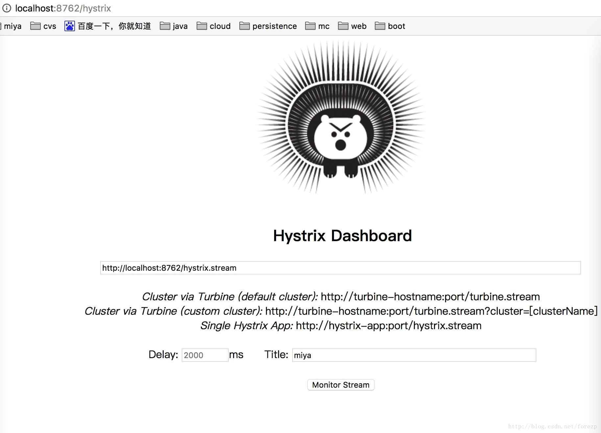

## 一、Hystrix Dashboard简介

在微服务架构中为例保证程序的可用性，防止程序出错导致网络阻塞，出现了断路器模型。断路器的状况反应了一个程序的可用性和健壮性，它是一个重要指标。Hystrix Dashboard是作为断路器状态的一个组件，提供了数据监控和友好的图形化界面。

## 二、准备工作

本文的的工程栗子，来源于[第一篇文章](http://blog.csdn.net/forezp/article/details/69696915)的栗子，在它的基础上进行改造。

## 三、开始改造service-hi

在pom的工程文件引入相应的依赖：

```
<dependency>
			<groupId>org.springframework.boot</groupId>
			<artifactId>spring-boot-starter-actuator</artifactId>
		</dependency>

		<dependency>
			<groupId>org.springframework.cloud</groupId>
			<artifactId>spring-cloud-starter-hystrix-dashboard</artifactId>
		</dependency>
		<dependency>
			<groupId>org.springframework.cloud</groupId>
			<artifactId>spring-cloud-starter-hystrix</artifactId>
		</dependency>
```

其中，这三个依赖是必须的，缺一不可。

在程序的入口ServiceHiApplication类，加上@EnableHystrix注解开启断路器，这个是必须的，并且需要在程序中声明断路点HystrixCommand；加上@EnableHystrixDashboard注解，开启HystrixDashboard

```
@SpringBootApplication
@EnableEurekaClient
@RestController
@EnableHystrix
@EnableHystrixDashboard
public class ServiceHiApplication {

	public static void main(String[] args) {
		SpringApplication.run(ServiceHiApplication.class, args);
	}

	@Value("${server.port}")
	String port;
	@RequestMapping("/hi")
	@HystrixCommand(fallbackMethod = "hiError")
	public String home(@RequestParam String name) {
		return "hi "+name+",i am from port:" +port;
	}

	public String hiError(String name) {
		return "hi,"+name+",sorry,error!";
	}
}
```

运行程序： 依次开启eureka-server 和service-hi.

## 四、Hystrix Dashboard图形展示

打开http://localhost:8762/hystrix.stream，可以看到一些具体的数据：


打开locahost:8762/hystrix 可以看见以下界面：



在界面依次输入：locahost:8762/hystrix.stream 、2000 、miya ；点确定。

在另一个窗口输入： http://localhost:8762/hi?name=forezp

重新刷新hystrix.stream网页，你会看到良好的图形化界面：

