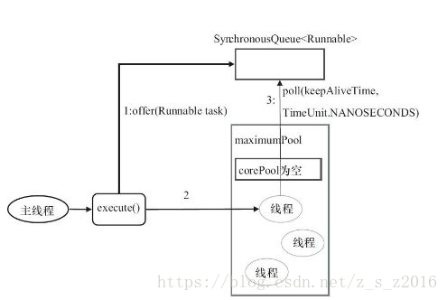
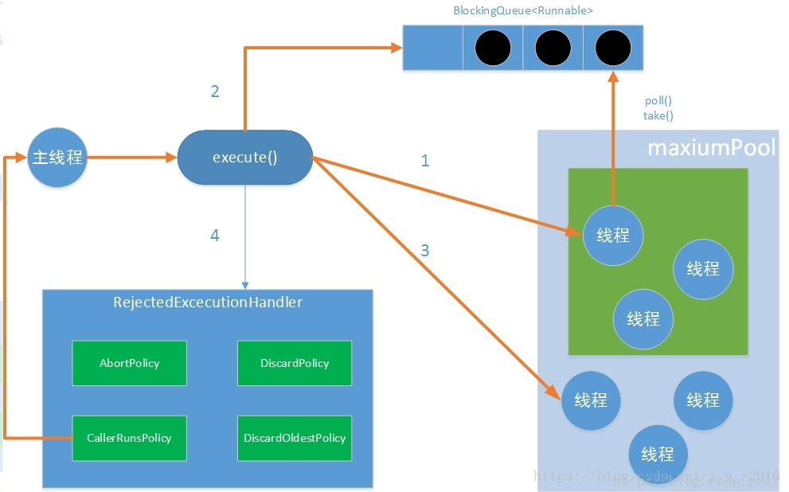

https://blog.csdn.net/z_s_z2016/article/details/81674893

ava通过Executors提供四种线程池，分别为： 

1、newSingleThreadExecutor 

创建一个单线程化的线程池，它只会用唯一的工作线程来执行任务，保证所有任务按照指定顺序(FIFO, LIFO, 优先级)执行。

2、newFixedThreadPool 

创建一个定长线程池，可控制线程最大并发数，超出的线程会在队列中等待。

3、newScheduledThreadPool 

创建一个可定期或者延时执行任务的定长线程池，支持定时及周期性任务执行。 

4、newCachedThreadPoo 

创建一个可缓存线程池，如果线程池长度超过处理需要，可灵活回收空闲线程，若无可回收，则新建线程。 

# 1. 为什么要用线程池

- 减少资源的开销 
- 减少了每次创建线程、销毁线程的开销。
- 提高响应速度 ,每次请求到来时，由于线程的创建已经完成，故可以直接执行任务，因此提高了响应速度。
- 提高线程的可管理性 ,线程是一种稀缺资源，若不加以限制，不仅会占用大量资源，而且会影响系统的稳定性。 因此，线程池可以对线程的创建与停止、线程数量等等因素加以控制，使得线程在一种可控的范围内运行，不仅能保证系统稳定运行，而且方便性能调优。

# 2. Executor接口

   

由上可知,ThreadPoolExecutor是线程池的真正实现,通过构造方法的一系列参数,来构成不同配置的线程池

## 1) Executor两级调度模型

 

在HotSpot虚拟机中，Java中的线程将会被一一映射为操作系统的线程 在Java虚拟机层面，用户将多个任务提交给Executor框架,Executor负责分配线程执行它们； 在操作系统层面，操作系统再将这些线程分配给处理器执行 

##  2) Executor结构

   

Executor框架中的所有类可以分成三类：

1. 任务 
   任务有两种类型：Runnable和Callable。
2. 任务执行器 
   Executor框架最核心的接口是Executor，它表示任务的执行器。 
   Executor的子接口为ExecutorService。 
   ExecutorService有两大实现类：ThreadPoolExecutor和ScheduledThreadPoolExecutor。
3. 执行结果 
   Future接口表示异步的执行结果，它的实现类为FutureTask。  

##  3) 四种类型的线程池

 **1. FixedThreadPool 定长线程池**

```java
public static ExecutorService newFixedThreadPool(int nThreads) { 
 
return new ThreadPoolExecutor(nThreads, nThreads, 0L, TimeUnit.MILLISECONDS, new LinkedBlockingQueue<Runnable>()); 
 
}
 
```

 

- 它是一种固定大小的线程池；
- corePoolSize和maximunPoolSize都为用户设定的线程数量nThreads；
- keepAliveTime为0，意味着一旦有多余的空闲线程，就会被立即停止掉；但这里keepAliveTime无效；
- 阻塞队列采用了LinkedBlockingQueue，它是一个无界队列；
- 由于阻塞队列是一个无界队列，因此永远不可能拒绝任务；
- 由于采用了无界队列，实际线程数量将永远维持在nThreads，因此maximumPoolSize和keepAliveTime将无效。

**2. CachedThreadPool 可缓存线程池**

```java
public static ExecutorService newCachedThreadPool(){
    return new ThreadPoolExecutor(0,Integer.MAX_VALUE,60L,TimeUnit.MILLISECONDS,new SynchronousQueue<Runnable>());
}
```

 

- 它是一个可以无限扩大的线程池；
- 它比较适合处理执行时间比较小的任务；
- corePoolSize为0，maximumPoolSize为无限大，意味着线程数量可以无限大；
- keepAliveTime为60S，意味着线程空闲时间超过60S就会被杀死；
- 采用SynchronousQueue装等待的任务，这个阻塞队列没有存储空间，这意味着只要有请求到来，就必须要找到一条工作线程处理他，如果当前没有空闲的线程，那么就会再创建一条新的线程。


**3. SingleThreadExecutor 单一线程池**

```java
public static ExecutorService newSingleThreadExecutor(){
    return new ThreadPoolExecutor(1,1,0L,TimeUnit.MILLISECONDS,new LinkedBlockingQueue<Runnable>());
}
```

 

- 它只会创建一条工作线程处理任务；
- 采用的阻塞队列为LinkedBlockingQueue；


**4. ScheduledThreadPool 可调度的线程池**

它用来处理延时任务或定时任务。


- 它接收SchduledFutureTask类型的任务，有两种提交任务的方式：
1. scheduledAtFixedRate
2.  scheduledWithFixedDelay
3.  SchduledFutureTask接收的参数：
-  time：任务开始的时间
1.  sequenceNumber：任务的序号
2.  period：任务执行的时间间隔
-  它采用DelayQueue存储等待的任务
-  DelayQueue内部封装了一个PriorityQueue，它会根据time的先后时间排序，若time相同则根据sequenceNumber排序；
- DelayQueue也是一个无界队列；
- 工作线程的执行过程：
- 工作线程会从DelayQueue取已经到期的任务去执行；
- 执行结束后重新设置任务的到期时间，再次放回DelayQueue

# 3. 线程池的处理流程

  

一个线程从被提交（submit）到执行共经历以下流程：

- 线程池判断核心线程池里是的线程是否都在执行任务，如果不是，则创建一个新的工作线程来执行任务。如果核心线程池里的线程都在执行任务，则进入下一个流程
- 线程池判断工作队列是否已满。如果工作队列没有满，则将新提交的任务储存在这个工作队列里。如果工作队列满了，则进入下一个流程。
- 线程池判断其内部线程是否都处于工作状态。如果没有，则创建一个新的工作线程来执行任务。如果已满了，则交给饱和策略来处理这个任务。


线程池在执行execute方法时,主要有以下四种情况

  

- 如果当前运行的线程少于corePoolSize，则创建新线程来执行任务（需要获得全局锁）
- 如果运行的线程等于或多于corePoolSize ,则将任务加入BlockingQueue
- 如果无法将任务加入BlockingQueue(队列已满)，则创建新的线程来处理任务（需要获得全局锁）
- 如果创建新线程将使当前运行的线程超出maxiumPoolSize，任务将被拒绝，并调用RejectedExecutionHandler.rejectedExecution()方法。

线程池采取上述的流程进行设计是为了减少获取全局锁的次数。在线程池完成预热（当前运行的线程数大于或等于corePoolSize）之后，几乎所有的excute方法调用都执行步骤2。


# 4. ThreeadPoolExecutor

##    1) ThreadPoolExecutor提供的构造函数

```java
//五个参数的构造函数
public ThreadPoolExecutor(int corePoolSize,
                          int maximumPoolSize,
                          long keepAliveTime,
                          TimeUnit unit,
                          BlockingQueue<Runnable> workQueue)
 
//六个参数的构造函数-1
public ThreadPoolExecutor(int corePoolSize,
                          int maximumPoolSize,
                          long keepAliveTime,
                          TimeUnit unit,
                          BlockingQueue<Runnable> workQueue,
                          ThreadFactory threadFactory)
 
//六个参数的构造函数-2
public ThreadPoolExecutor(int corePoolSize,
                          int maximumPoolSize,
                          long keepAliveTime,
                          TimeUnit unit,
                          BlockingQueue<Runnable> workQueue,
                          RejectedExecutionHandler handler)
 
//七个参数的构造函数
public ThreadPoolExecutor(int corePoolSize,
                          int maximumPoolSize,
                          long keepAliveTime,
                          TimeUnit unit,
                          BlockingQueue<Runnable> workQueue,
                          ThreadFactory threadFactory,
                          RejectedExecutionHandler handler)
 
```

##  2) 参数解释

-  int corePoolSize：该线程池中核心线程数最大值
  核心线程：线程池新建线程的时候，如果当前线程总数小于corePoolSize，则新建的是核心线程，如果超过corePoolSize，则新建的是非核心线程核心线程默认情况下会一直存活在线程池中，即使这个核心线程啥也不干(闲置状态)。
  如果指定ThreadPoolExecutor的allowCoreThreadTimeOut这个属性为true，那么核心线程如果不干活(闲置状态)的话，超过一定时间(时长下面参数决定)，就会被销毁掉。

- int maximumPoolSize： 该线程池中线程总数最大值
       线程总数 = 核心线程数 + 非核心线程数。

- long keepAliveTime：该线程池中非核心线程闲置超时时长
  一个非核心线程，如果不干活(闲置状态)的时长超过这个参数所设定的时长，就会被销毁掉，如果设置allowCoreThreadTimeOut = true，则会作用于核心线程。

- BlockingQueue workQueue：该线程池中的任务队列：维护着等待执行的Runnable对象
当所有的核心线程都在干活时，新添加的任务会被添加到这个队列中等待处理，如果队列满了，则新建非核心线程执行任务。
常用的workQueue类型：

- SynchronousQueue：这个队列接收到任务的时候，会直接提交给线程处理，而不保留它，如果所有线程都在工作怎么办？那就新建一个线程来处理这个任务！所以为了保证不出现<线程数达到了maximumPoolSize而不能新建线程>的错误，使用这个类型队列的时候，maximumPoolSize一般指定成Integer.MAX_VALUE，即无限大
- LinkedBlockingQueue：这个队列接收到任务的时候，如果当前线程数小于核心线程数，则新建线程(核心线程)处理任务；如果当前线程数等于核心线程数，则进入队列等待。由于这个队列没有最大值限制，即所有超过核心线程数的任务都将被添加到队列中，这也就导致了maximumPoolSize的设定失效，因为总线程数永远不会超过corePoolSize
- ArrayBlockingQueue：可以限定队列的长度，接收到任务的时候，如果没有达到corePoolSize的值，则新建线程(核心线程)执行任务，如果达到了，则入队等候，如果队列已满，则新建线程(非核心线程)执行任务，又如果总线程数到了maximumPoolSize，并且队列也满了，则发生错误
- DelayQueue：队列内元素必须实现Delayed接口，这就意味着你传进去的任务必须先实现Delayed接口。这个队列接收到任务时，首先先入队，只有达到了指定的延时时间，才会执行任务
- ThreadFactory threadFactory：创建线程的方式，这是一个接口，你new他的时候需要实现他的Thread newThread(Runnable r)方法，
- RejectedExecutionHandler handler： 当提交任务数超过maxmumPoolSize+workQueue之和时，任务会交给RejectedExecutionHandler来处理;jdk1.5提供了四种饱和策略 ：
1. AbortPolicy 
默认。直接抛异常。
2. CallerRunsPolicy 
只用调用者所在的线程执行任务,重试添加当前的任务，它会自动重复调用execute()方法
3. DiscardOldestPolicy 
丢弃任务队列中最久的任务。
4. DiscardPolicy 
丢弃当前任务。

## 3) 提交任务

​    可以向ThreadPoolExecutor提交两种任务：Callable和Runnable。

1.  Callable 
   该类任务有返回结果，可以抛出异常。 
   通过submit函数提交，返回Future对象。 
   可通过get获取执行结果。
2. Runnable 
   该类任务只执行，无法获取返回结果，并在执行过程中无法抛异常。 
   通过execute提交。

## 4) 关闭线程池

 关闭线程池有两种方式：shutdown和shutdownNow，关闭时，会遍历所有的线程，调用它们的interrupt函数中断线程。但这两种方式对于正在执行的线程处理方式不同。

1. shutdown() 
   仅停止阻塞队列中等待的线程，那些正在执行的线程就会让他们执行结束。
2. shutdownNow() 
   不仅会停止阻塞队列中的线程，而且会停止正在执行的线程。

## 5) 设置合理的线程池大小

  任务一般可分为：CPU密集型、IO密集型、混合型，对于不同类型的任务需要分配不同大小的线程池。

- CPU密集型任务 
尽量使用较小的线程池，一般为CPU核心数+1。 
因为CPU密集型任务使得CPU使用率很高，若开过多的线程数，只能增加上下文切换的次数，因此会带来额外的开销。
- IO密集型任务 
可以使用稍大的线程池，一般为2*CPU核心数。 
IO密集型任务CPU使用率并不高，因此可以让CPU在等待IO的时候去处理别的任务，充分利用CPU时间。
- 混合型任务 
可以将任务分成IO密集型和CPU密集型任务，然后分别用不同的线程池去处理。 
只要分完之后两个任务的执行时间相差不大，那么就会比串行执行来的高效。 
因为如果划分之后两个任务执行时间相差甚远，那么先执行完的任务就要等后执行完的任务，最终的时间仍然取决于后执行完的任务，而且还要加上任务拆分与合并的开销，得不偿失。


# 5. ThreadPoolExecutor实战

 1) 自主定制非阻塞线程池

```java
package com.zach.concurrency.threadpool;
 
import java.util.concurrent.*;
import java.util.concurrent.atomic.AtomicInteger;
 
/**
 * @Author:Zach
 * @Description: 定制属于自己的非阻塞线程池
 * @Date:Created in 15:26 2018/8/14
 * @Modified By:
 */
public class CustomThreadPoolExecutor {
    private ThreadPoolExecutor pool = null;
 
    /**
     * 线程池初始化方法
     *
     * corePoolSize 核心线程池大小----10
     * maximumPoolSize 最大线程池大小----30
     * keepAliveTime 线程池中超过corePoolSize数目的空闲线程最大存活时间----30+单位TimeUnit
     * TimeUnit keepAliveTime时间单位----TimeUnit.MINUTES
     * workQueue 阻塞队列----new ArrayBlockingQueue<Runnable>(10)====10容量的阻塞队列
     * threadFactory 新建线程工厂----new CustomThreadFactory()====定制的线程工厂
     * rejectedExecutionHandler 当提交任务数超过maxmumPoolSize+workQueue之和时,
     * 							即当提交第41个任务时(前面线程都没有执行完,此测试方法中用sleep(100)),
     * 						          任务会交给RejectedExecutionHandler来处理
     */
 
    public void init() {
 
        pool = new ThreadPoolExecutor(10,30,30,
                TimeUnit.MINUTES,new ArrayBlockingQueue<Runnable>(10),new CustomThreadFactory(), new CustomRejectedExecutionHandler());
    }
 
    public void destory() {
        if(pool !=null) {
            pool.shutdownNow();
        }
    }
 
    public ExecutorService getCustomThreadPoolExecutor() {
        return this.pool;
    }
 
 
    private class CustomRejectedExecutionHandler implements  RejectedExecutionHandler {
        @Override
        public void rejectedExecution(Runnable r, ThreadPoolExecutor executor) {
            //记录异常
            System.out.println("error...................");
        }
    }
 
    private class CustomThreadFactory implements ThreadFactory {
 
        private AtomicInteger count = new AtomicInteger(0);
 
        @Override
        public Thread newThread(Runnable r) {
            Thread t = new Thread(r);
           String threadName =  CustomThreadPoolExecutor.class.getSimpleName()+count.addAndGet(1);
 
            System.out.println(threadName);
            t.setName(threadName);
            return t;
        }
    }
 
    public static void main(String[] args){
        CustomThreadPoolExecutor exec = new CustomThreadPoolExecutor();
 
        //1. 初始化
        exec.init();
 
        ExecutorService pool = exec.getCustomThreadPoolExecutor();
 
        for(int i=1;i<100;i++) {
            System.out.println("提交第"+i+"个任务");
            pool.execute(new Runnable() {
                @Override
                public void run() {
                    try {
                        System.out.println(">>>task is running========");
                       Thread.sleep(3000);
                    }catch (InterruptedException e){
                        e.printStackTrace();
                    }
                }
            });
        }
 
        //2. 销毁----此处不能销毁,因为任务没有提交执行完,如果销毁线程池,任务也就无法执行
        //exec.destory();
 
        try {
            Thread.sleep(10000);
        }catch (InterruptedException e) {
            e.printStackTrace();
        }
    }
 
    /**
     * 方法中建立一个核心线程数为30个，缓冲队列有10个的线程池。每个线程任务，执行时会先睡眠3秒，保证提交10任务时，线程数目被占用完，再提交30任务时，阻塞队列被占用完，，这样提交第41个任务是，会交给CustomRejectedExecutionHandler 异常处理类来处理。
     提交任务的代码如下：
     
     /*
     * Proceed in 3 steps:
     *
     * 1. If fewer than corePoolSize threads are running, try to
     * start a new thread with the given command as its first
     * task.  The call to addWorker atomically checks runState and
     * workerCount, and so prevents false alarms that would add
     * threads when it shouldn't, by returning false.
     *
     * 2. If a task can be successfully queued, then we still need
     * to double-check whether we should have added a thread
     * (because existing ones died since last checking) or that
     * the pool shut down since entry into this method. So we
     * recheck state and if necessary roll back the enqueuing if
     * stopped, or start a new thread if there are none.
     *
     * 3. If we cannot queue task, then we try to add a new
     * thread.  If it fails, we know we are shut down or saturated
     * and so reject the task.
     */
    /**
     public void execute(Runnable command) {
     if (command == null)
     throw new NullPointerException();
     int c = ctl.get();
     if (workerCountOf(c) < corePoolSize) {
     if (addWorker(command, true))
     return;
     c = ctl.get();
     }
     if (isRunning(c) && workQueue.offer(command)) {
     int recheck = ctl.get();
     if (! isRunning(recheck) && remove(command))
     reject(command);
     else if (workerCountOf(recheck) == 0)
     addWorker(null, false);
     }
     else if (!addWorker(command, false))
     reject(command);
     }
        注意：41以后提交的任务就不能正常处理了，因为，execute中提交到任务队列是用的offer方法，如上面代码，
        这个方法是非阻塞的，所以就会交给CustomRejectedExecutionHandler 来处理，
         所以对于大数据量的任务来说，这种线程池，如果不设置队列长度会OOM，设置队列长度，会有任务得不到处理，接下来我们构建一个阻塞的自定义线程池
     */
}
```

2) 自主定制阻塞线程池

```java
package com.zach.concurrency.threadpool;
 
import java.util.concurrent.*;
import java.util.concurrent.atomic.AtomicInteger;
 
/**
 * @Author:Zach
 * @Description: 定制属于自己的阻塞线程池
 * @Date:Created in 15:26 2018/8/14
 * @Modified By:
 */
public class CustomUnblockThreadPoolExecutor {
    private ThreadPoolExecutor pool = null;
 
    /**
     * 线程池初始化方法
     *
     * corePoolSize 核心线程池大小----1
     * maximumPoolSize 最大线程池大小----3
     * keepAliveTime 线程池中超过corePoolSize数目的空闲线程最大存活时间----30+单位TimeUnit
     * TimeUnit keepAliveTime时间单位----TimeUnit.MINUTES
     * workQueue 阻塞队列----new ArrayBlockingQueue<Runnable>(5)==== 5容量的阻塞队列
     * threadFactory 新建线程工厂----new CustomThreadFactory()====定制的线程工厂
     * rejectedExecutionHandler 当提交任务数超过maxmumPoolSize+workQueue之和时,
     * 							即当提交第9个任务时(前面线程都没有执行完,此测试方法中用sleep(100)),
     * 						          任务会交给RejectedExecutionHandler来处理
     */
 
    public void init() {
 
        pool = new ThreadPoolExecutor(1,3,30,
                TimeUnit.MINUTES,new ArrayBlockingQueue<Runnable>(5),new CustomThreadFactory(), new CustomRejectedExecutionHandler());
    }
 
    public void destory() {
        if(pool !=null) {
            pool.shutdownNow();
        }
    }
 
    public ExecutorService getCustomThreadPoolExecutor() {
        return this.pool;
    }
 
 
    private class CustomRejectedExecutionHandler implements  RejectedExecutionHandler {
        @Override
        public void rejectedExecution(Runnable r, ThreadPoolExecutor executor) {
            //核心改造点,由blockingqueue的offer改成put阻塞方法
            try {
                executor.getQueue().put(r);
            } catch (InterruptedException e) {
                e.printStackTrace();
            }
        }
    }
 
    private class CustomThreadFactory implements ThreadFactory {
 
        private AtomicInteger count = new AtomicInteger(0);
 
        @Override
        public Thread newThread(Runnable r) {
            Thread t = new Thread(r);
            String threadName =  CustomUnblockThreadPoolExecutor.class.getSimpleName()+count.addAndGet(1);
 
            System.out.println(threadName);
            t.setName(threadName);
            return t;
        }
    }
 
    public static void main(String[] args){
        CustomUnblockThreadPoolExecutor exec = new CustomUnblockThreadPoolExecutor();
 
        //1. 初始化
        exec.init();
 
        ExecutorService pool = exec.getCustomThreadPoolExecutor();
 
        for(int i=1;i<100;i++) {
            System.out.println("提交第"+i+"个任务");
            pool.execute(new Runnable() {
                @Override
                public void run() {
                    try {
                        System.out.println(">>>task is running========");
                        TimeUnit.SECONDS.sleep(10);
                    }catch (InterruptedException e){
                        e.printStackTrace();
                    }
                }
            });
        }
 
        //2. 销毁----此处不能销毁,因为任务没有提交执行完,如果销毁线程池,任务也就无法执行
        //exec.destory();
 
        try {
            Thread.sleep(10000);
        }catch (InterruptedException e) {
            e.printStackTrace();
        }
    }
 
    /**
     * 解释：当提交任务被拒绝时，进入拒绝机制，我们实现拒绝方法，把任务重新用阻塞提交方法put提交，实现阻塞提交任务功能，防止队列过大，OOM，提交被拒绝方法在下面
     *
     * public void execute(Runnable command) {
     if (command == null)
     throw new NullPointerException();
     int c = ctl.get();
     if (workerCountOf(c) < corePoolSize) {
     if (addWorker(command, true))
     return;
     c = ctl.get();
     }
     if (isRunning(c) && workQueue.offer(command)) {
     int recheck = ctl.get();
     if (! isRunning(recheck) && remove(command))
     reject(command);
     else if (workerCountOf(recheck) == 0)
     addWorker(null, false);
     }
     else if (!addWorker(command, false))
     // 进入拒绝机制， 我们把runnable任务拿出来，重新用阻塞操作put，来实现提交阻塞功能
     reject(command);
     }
     */
}
```

# 总结： 

1、用ThreadPoolExecutor自定义线程池，看线程是的用途，如果任务量不大，可以用无界队列，如果任务量非常大，要用有界队列，防止OOM 
2、如果任务量很大，还要求每个任务都处理成功，要对提交的任务进行阻塞提交，重写拒绝机制，改为阻塞提交。保证不抛弃一个任务 
3、最大线程数一般设为2N+1最好，N是CPU核数 
4、核心线程数，看应用，如果是任务，一天跑一次，设置为0，合适，因为跑完就停掉了，如果是常用线程池，看任务量，是保留一个核心还是几个核心线程数 
5、如果要获取任务执行结果，用CompletionService，但是注意，获取任务的结果的要重新开一个线程获取，如果在主线程获取，就要等任务都提交后才获取，就会阻塞大量任务结果，队列过大OOM，所以最好异步开个线程获取结果