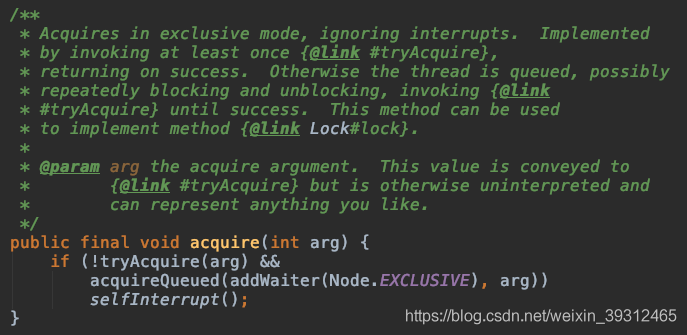
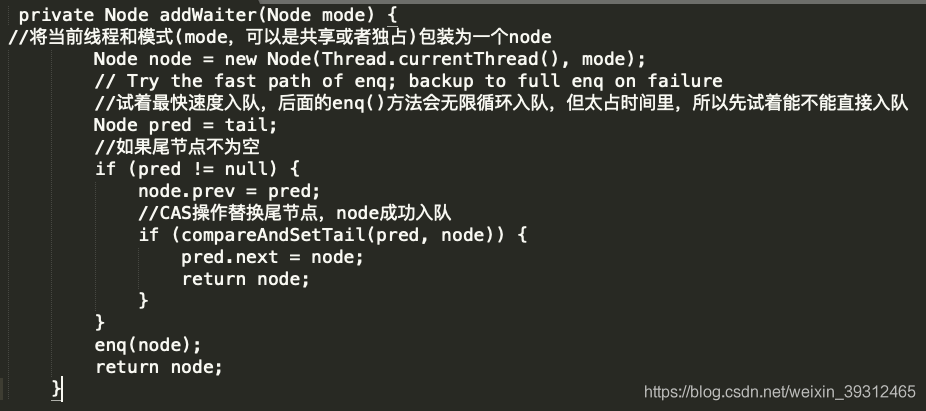
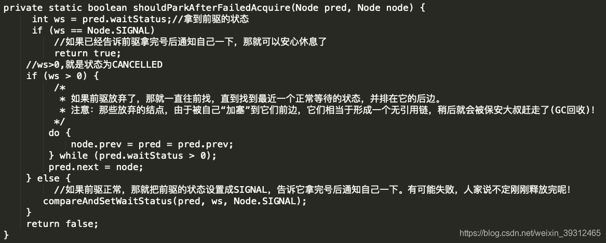
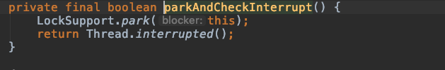
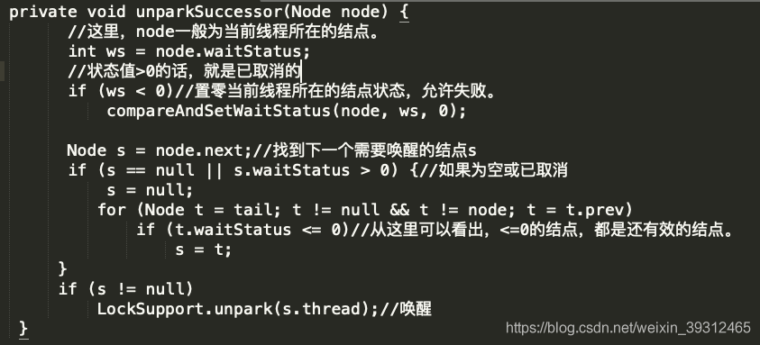
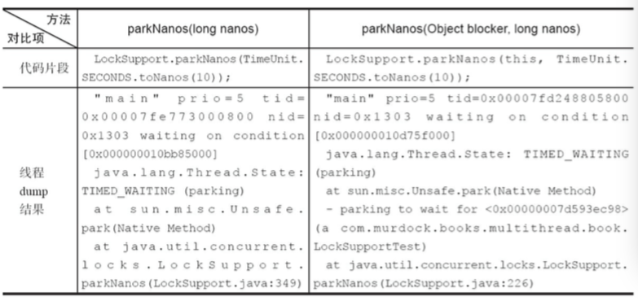

# Java多线程原理

## Java对象的内存布局 JMM


- markword 对象头: 8字节
- class pointer 类型指针：默认8字节，JVM默认开启对象头压缩，所以只占4字节
- instance data实例数据
- padding: JVM默认存储能被8整除的位数数据，所以要补齐


数组类对象多4个字节的数组长度数据


> Object o = new Object();使用了多少字节的数据
>
> new Object()-> 开启对象头压缩： 8+4+0+4 16个字节
>
> Obecjt o->类型指针，开启压缩 4字节


## sychronized加锁过程


1. 当只有一个线程在享用这些数据的时候只加偏向锁，这把锁不用向操作系统去进行申请，在用户态直接生成
2. 当另外一个线程进来争取资源的时候，先接触偏向锁状态，加上一把轻量级锁（自旋锁，无锁），此时拿不到锁的状态会进行自旋，直到将线程栈中的Lock Record中的锁加到所要申请的资源上
3. 当竞争过于激烈的时候，多余的线程进行自旋会消耗大量的无效CPU资源，此时向操作系统申请重量级锁，这个重量级锁是向系统内核申请，所以效率慢，所有多余的线程会被搁置在这个重量级锁的队列中，等待得到锁资源

> 编译成二进制机器码以后，读高2位，如果是01，则是无锁或者偏向锁状态，再往前读一位，如果是1就是有锁


> hashCode字段并不是刚开始生成字节码就会有，而是调用了hashCode方法以后才会去生成


> 分带年龄最多GC15次，因为4个bit位最多只能存到15

## cache Line的概念，缓存行共享

缓存行默认是64位

如果有两个数据在同一个缓存行，而且在执行时被加了volatile关键字，那么会不停的修改写到主存并通知另外一个线程去读取主存，效率低，所以要进行缓存行对齐


> 最好的方法就是在改对象前面加l1-l8个long类型的数据，后边加上l9-l16个long类型的数据，这样就能保证两个数据不在同一缓存行

> disruptor多线程框架就是使用的这样的思想

## 超线程概念

> 一个ALU对应多个PC|Registers寄存器，也就是所谓的四核八线程


## MISE cache缓存行同步


## JSR内存屏障

#### 1.LoadLoad屏障

#### 2. StroeStore屏障

#### 3. LoadStore屏障

#### 4. StoreLoad屏障


## 系统底层如何保证有序性

1. 内存屏障`sfence mfence lfence`等系统原语
2. 当一个数据超出块大小后可`锁总线`


## volatile如何解决指令重排序

1. volatile i

2. ACC_VOLATILE

3. JVM的内存屏障

   屏障两边的指令不可以重排，保证有序

4. hotspot实现

   `bytecodeinterpreter.cpp`

   


## Java中的四种引用（强软弱虚）

### 强引用

> M m = new M();
>
> m-> new M();这个引用就是强引用

### 软引用

> M<byte[]> m = new M<>(new byte[1024*10])
>
> 内存不够的时候软引用的对象将会被回收掉

> 作用，用来做文件的缓存

### 弱引用

> M<N> m = new M<N>(new N());
>
> 一旦被垃圾回收器发现就会被回收

### 虚引用

> M<N> m = new M<>(new N(), QUEUE)
>
> 作用 用来管理堆外内存

JVM只能管理JVM的内存对象，要直接使用堆外内存，先使用一个对象与堆外内存关联

但是当对象被回收时，JVM无法去释放堆外内存

所以需要一个虚引用，GC去查看是否存在虚引用，如果有  回收对象的时候会同时去对堆外内存进行释放


### synchronized具有重入性

如果是同一线程进来，是可以调用带有synchronized的方法，否则会造成死锁

> 例如
>
> 子类synchronized m(){
>
> ​	super.m();
>
> }
>
> 如果不能重入，此处造成了死锁


### sync(Object)过程

> 1. markword记录线程ID（偏向锁）
> 2. 如果线程征用，升级为自旋锁
> 3. 10次以后自旋线程还是拿不到锁，升级为重量级锁


### synchronized不能使用String常量，Interger Long


### 可重入锁

```java
Lock lock = new ReentrantLock();

lock.lock();
lock.unlock();
```

> synchronized可以自动解锁，但是lock不能自动解锁，最好在finally里面释放锁；

> lock.tryLock()；
>
> 尝试在一个时间类拿到锁，如果没有拿到直接执行自定义代码


### 除了synchronized一般都是CAS


### CountDownLatch

> countDownLatch.await();在此阻塞，当计数器为0的时候才放行dd


### CyclicBarrier

```java
CyclicBarrier barrier = new CyclicBarrier(20, ()->{
    System.out.println("11111111");
})
    
barrier.await();
```

> 当await()满20个时，解除阻塞


### Phaser

```java
class XXX extends Phaser{
    @Override
    protected boolean onAdvance(int phaser, int registerParties){
        switch(phaser):
        case 1:
        case 2:
        case 3:
    }
}

//等待条件满足并放行，进入下一个阻塞点
phaser.arriveAndAwaitAdavance();
//注册条件，当上边方法满足时放行
phaser.bulkRegister(int nums);
//不再对该线程放行
phaser.arriveAndDeregister();
```


### ReadWriteLock

```java
ReadWriteLock readWriteLock = new ReentrantReadWriteLock();
Lock readLock = readWriteLock.readLock();
Lock writeLock = readWriteLock.writeLock();
```


### Semaphore 

```java
Semaphore s = new Semaphore(int nums); // nums 可同时并发的线程数

s.acquire(); //获取许可，如果拿到了 nums-1,nums为0时不允许放行线程运行,没拿到就阻塞在这里

s.release(); //释放资源，nums+1;
```


### Exchanger<T>

```java
Exchanger<Object> exchanger = new Exchanger<>();

Obejct o = new Object();

o = exchanger.exchange(o)
```

exchange只能在两个线程之间进行通信，如果没有进行exchange()，则阻塞在此处；


### LockSupport

> `LockSupport`是一个线程阻塞工具类，所有的方法都是静态方法，可以让线程在任意位置阻塞，当然阻塞之后肯定得有唤醒的方法。

```java
public static void park(Object blocker); // 暂停当前线程
public static void parkNanos(Object blocker, long nanos); // 暂停当前线程，不过有超时时间的限制
public static void parkUntil(Object blocker, long deadline); // 暂停当前线程，直到某个时间
public static void park(); // 无期限暂停当前线程
public static void parkNanos(long nanos); // 暂停当前线程，不过有超时时间的限制
public static void parkUntil(long deadline); // 暂停当前线程，直到某个时间
public static void unpark(Thread thread); // 恢复当前线程
public static Object getBlocker(Thread t);
```


### 淘宝面试题

> 实现一个容器，提供两个方法,add,size，写两个线程，线程1添加10个元素到容器中，线程2实现监控元素的个数，当个数到5个的时候，线程2给出提示并结束

> 写一个固定容量同步容器，拥有put和get方法，以及getCount方法，能够支持两个生产者线程以及10个消费者线程的阻塞调用


### 异常和锁

程序之中如果出现异常，默认情况下 锁会被释放

# AQS(AbstractQueueSynchronizer)

> volatile cas 队列的组合

volatile-> volatile int status（status交给子类去定义）

cas->多线程加入队列的时候保证只有一个分支


1. Thread—>入队=>`acquireQueued(addWaiter(Node.EXCLUSIVE, arg))`
2. 实例化一个node=>`thread链表node`
3. 根据线程来实例化一个node
4. 再次实例化一个thread为null的node对象
5. 把null这个node设置为aqs的头和尾部=>`队列初始化，有排队`
6. 维护t2的链表关系，t2入队
7. 自旋一次，看能不能拿到锁
8. t2阻塞


## AQS源码解读

在开头加一句话，CAS的原子性是因为说cpu在执行cas时对这一块内存是独占排他的。
AQS全名AbstractQueuedSynchronizer，就和字面上一样，是维护了一个队列的同步器框架。

AQS类里有一个Node类，对线程进行了封装。看看里面的字段：

static final class Node {

```java
    // 共享模式下等待的标记
    static final Node SHARED = new Node();
    // 独占模式下等待的标记
    static final Node EXCLUSIVE = null;

    // 线程的等待状态 表示线程已经被取消
    static final int CANCELLED =  1;
    // 线程的等待状态 表示后继线程需要被唤醒
    static final int SIGNAL    = -1;
    // 线程的等待状态 表示线程在Condtion上
    static final int CONDITION = -2;

    // 表示下一个acquireShared需要无条件的传播
    static final int PROPAGATE = -3;


    volatile int waitStatus;


    volatile Node prev;


    volatile Node next;

    /**
     * 当前节点的线程,初始化后使用,在使用后失效 
     */
    volatile Thread thread;

    /**
     * 链接到等在等待条件上的下一个节点,或特殊的值SHARED,因为条件队列只有在独占模式时才能被访问,
     * 所以我们只需要一个简单的连接队列在等待的时候保存节点,然后把它们转移到队列中重新获取
     * 因为条件只能是独占性的,我们通过使用特殊的值来表示共享模式
     */
    Node nextWaiter;

    /**
     * 如果节点处于共享模式下等待直接返回true
     */
    final boolean isShared() {
        return nextWaiter == SHARED;
    }

    /**
     * 返回当前节点的前驱节点,如果为空,直接抛出空指针异常
     */
    final Node predecessor() throws NullPointerException {
        Node p = prev;
        if (p == null)
            throw new NullPointerException();
        else
            return p;
    }

    Node() {    // 用来建立初始化的head 或 SHARED的标记
    }

    Node(Thread thread, Node mode) {     // 指定线程和模式的构造方法
        this.nextWaiter = mode;
        this.thread = thread;
    }

    Node(Thread thread, int waitStatus) { // 指定线程和节点状态的构造方法
        this.waitStatus = waitStatus;
        this.thread = thread;
    }
}
```

然后是AQS类里的其他几个字段(volatile和CAS可以在博客里的其他文章看)


好了，接下来就是开始获取里，直接上源码：

注释里说的很清楚，以独占模式尝试获取锁，忽略里中断。里面的tryAcquire()方法是用来给我们自己实现的，毕竟AQS是一个框架(可以去我的博客里看ReentrentLock的tryAcquire()是怎么实现的)。后面接着的是addWaiter()方法：




然后看acquireQueued()方法：


shouldParkAfterFailedAcquire和parkAndCheckInterrupt两个方法用来让当前节点找到一个合适的地方开始等待




1.调用自定义同步器的tryAcquire()尝试直接去获取资源，如果成功则直接返回；
2.没成功，则addWaiter()将该线程加入等待队列的尾部，并标记为独占模式；
3.acquireQueued()使线程在等待队列中休息，有机会时（轮到自己，会被unpark()）会去尝试获取资源。获取到资源后才返回。如果在整个等待过程中被中断过，则返回true，否则返回false。
4.如果线程在等待过程中被中断过，它是不响应的。只是获取资源后才再进行自我中断selfInterrupt()，将中断补上。

接下来看如何释放：

改写tryRelease()方法，成功后，释放资源，用unparkSuccessor(h)来释放并唤醒下一个节点

至于共享模式的话，其实就是在获取成功后会唤醒后面的节点，共享模式释放的时候，也会唤醒后继。（这个时候PROPAGATE这个值才会被用到).
最后，个人觉得的话，这东西就是一个队列，内部一直循环请求，再如ReentrantLock,其实内部就是一个acquire(1)，只获取一个资源，本身有一个state,state=0的话就是锁没被占用，！=0就表示锁被占用里。


# LockSupport

### LockSupport 用法简介

LockSupport 和 CAS 是Java并发包中很多并发工具控制机制的基础，它们底层其实都是依赖Unsafe实现。

LockSupport是用来创建锁和其他同步类的基本**线程阻塞**原语。LockSupport 提供park()和unpark()方法实现阻塞线程和解除线程阻塞，LockSupport和每个使用它的线程都与一个许可(permit)关联。permit相当于1，0的开关，默认是0，调用一次unpark就加1变成1，调用一次park会消费permit, 也就是将1变成0，同时park立即返回。再次调用park会变成block（因为permit为0了，会阻塞在这里，直到permit变为1）, 这时调用unpark会把permit置为1。每个线程都有一个相关的permit, permit最多只有一个，重复调用unpark也不会积累。

park()和unpark()不会有 “Thread.suspend和Thread.resume所可能引发的死锁” 问题，由于许可的存在，调用 park 的线程和另一个试图将其 unpark 的线程之间的竞争将保持活性。

如果调用线程被中断，则park方法会返回。同时park也拥有可以设置超时时间的版本。

需要特别注意的一点：**park 方法还可以在其他任何时间“毫无理由”地返回，因此通常必须在重新检查返回条件的循环里调用此方法**。从这个意义上说，park 是“忙碌等待”的一种优化，它不会浪费这么多的时间进行自旋，但是必须将它与 unpark 配对使用才更高效。

三种形式的 park 还各自支持一个 blocker 对象参数。此对象在线程受阻塞时被记录，以允许监视工具和诊断工具确定线程受阻塞的原因。（这样的工具可以使用方法 getBlocker(java.lang.Thread) 访问 blocker。）建议最好使用这些形式，而不是不带此参数的原始形式。在锁实现中提供的作为 blocker 的普通参数是 this。
看下线程dump的结果来理解blocker的作用。



从线程dump结果可以看出：
有blocker的可以传递给开发人员更多的现场信息，可以查看到当前线程的阻塞对象，方便定位问题。所以java6新增加带blocker入参的系列park方法，替代原有的park方法。

看一个Java docs中的示例用法：一个先进先出非重入锁类的框架

```java
class FIFOMutex {
    private final AtomicBoolean locked = new AtomicBoolean(false);
    private final Queue<Thread> waiters
      = new ConcurrentLinkedQueue<Thread>();
 
    public void lock() {
      boolean wasInterrupted = false;
      Thread current = Thread.currentThread();
      waiters.add(current);
 
      // Block while not first in queue or cannot acquire lock
      while (waiters.peek() != current ||
             !locked.compareAndSet(false, true)) {
        LockSupport.park(this);
        if (Thread.interrupted()) // ignore interrupts while waiting
          wasInterrupted = true;
      }

      waiters.remove();
      if (wasInterrupted)          // reassert interrupt status on exit
        current.interrupt();
    }
 
    public void unlock() {
      locked.set(false);
      LockSupport.unpark(waiters.peek());
    }
  }}
```

## LockSupport 源码解读

1. LockSupport中主要的两个成员变量：

```java
// Hotspot implementation via intrinsics API
    private static final sun.misc.Unsafe UNSAFE;
    private static final long parkBlockerOffset;
```

unsafe:全名sun.misc.Unsafe可以直接操控内存，被JDK广泛用于自己的包中，如java.nio和java.util.concurrent。但是不建议在生产环境中使用这个类。因为这个API十分不安全、不轻便、而且不稳定。
LockSupport的方法底层都是调用Unsafe的方法实现。

再来看parkBlockerOffset:
parkBlocker就是第一部分说到的用于记录线程被谁阻塞的，用于线程监控和分析工具来定位原因的，可以通过LockSupport的getBlocker获取到阻塞的对象。

```java
 static {
        try {
            UNSAFE = sun.misc.Unsafe.getUnsafe();
            Class<?> tk = Thread.class;
            parkBlockerOffset = UNSAFE.objectFieldOffset
                (tk.getDeclaredField("parkBlocker"));
        } catch (Exception ex) { throw new Error(ex); }
 }
```

从这个静态语句块可以看的出来，先是通过反射机制获取Thread类的parkBlocker字段对象。然后通过sun.misc.Unsafe对象的objectFieldOffset方法获取到parkBlocker在内存里的偏移量，parkBlockerOffset的值就是这么来的.

JVM的实现可以自由选择如何实现Java对象的“布局”，也就是在内存里Java对象的各个部分放在哪里，包括对象的实例字段和一些元数据之类。 sun.misc.Unsafe里关于对象字段访问的方法把对象布局抽象出来，它提供了objectFieldOffset()方法用于获取某个字段相对 Java对象的“起始地址”的偏移量，也提供了getInt、getLong、getObject之类的方法可以使用前面获取的偏移量来访问某个Java 对象的某个字段。

为什么要用偏移量来获取对象？干吗不要直接写个get，set方法。多简单？
仔细想想就能明白，这个parkBlocker就是在线程处于阻塞的情况下才会被赋值。线程都已经阻塞了，如果不通过这种内存的方法，而是直接调用线程内的方法，线程是不会回应调用的。

2.LockSupport的方法：


可以看到，LockSupport中主要是park和unpark方法以及设置和读取parkBlocker方法。

```java
 private static void setBlocker(Thread t, Object arg) {
        // Even though volatile, hotspot doesn't need a write barrier here.
        UNSAFE.putObject(t, parkBlockerOffset, arg);
  }
```

对给定线程t的parkBlocker赋值。

```java
    public static Object getBlocker(Thread t) {
        if (t == null)
            throw new NullPointerException();
        return UNSAFE.getObjectVolatile(t, parkBlockerOffset);
    }
  
```

从线程t中获取它的parkBlocker对象，即返回的是阻塞线程t的Blocker对象。

接下来主查两类方法，一类是阻塞park方法，一类是解除阻塞unpark方法

**阻塞线程**

- park()

```java
public static void park() {
        UNSAFE.park(false, 0L);
}
```

调用native方法阻塞当前线程。

- parkNanos(long nanos)

```java
public static void parkNanos(long nanos) {
        if (nanos > 0)
            UNSAFE.park(false, nanos);
}
```

阻塞当前线程，最长不超过nanos纳秒，返回条件在park()的基础上增加了超时返回。

- parkUntil(long deadline)

```java
public static void parkUntil(long deadline) {
  UNSAFE.park(true, deadline);
}
```

阻塞当前线程，知道deadline时间（deadline - 毫秒数）。

JDK1.6引入这三个方法对应的拥有Blocker版本。

- park(Object blocker)

```java
public static void park(Object blocker) {
  Thread t = Thread.currentThread();
  setBlocker(t, blocker);
  UNSAFE.park(false, 0L);
  setBlocker(t, null);
}
```

1) 记录当前线程等待的对象（阻塞对象）；
2) 阻塞当前线程；
3) 当前线程等待对象置为null。

- parkNanos(Object blocker, long nanos)

```java
public static void parkNanos(Object blocker, long nanos) {
  if (nanos > 0) {
      Thread t = Thread.currentThread();
      setBlocker(t, blocker);
      UNSAFE.park(false, nanos);
      setBlocker(t, null);
  }
}
```

阻塞当前线程，最长等待时间不超过nanos毫秒，同样，在阻塞当前线程的时候做了记录当前线程等待的对象操作。

- parkUntil(Object blocker, long deadline)

```java
public static void parkUntil(Object blocker, long deadline) {
  Thread t = Thread.currentThread();
  setBlocker(t, blocker);
  UNSAFE.park(true, deadline);
  setBlocker(t, null);
}
```

阻塞当前线程直到deadline时间，相同的，也做了阻塞前记录当前线程等待对象的操作。

**唤醒线程**

- unpark(Thread thread)

```java
public static void unpark(Thread thread) {
  if (thread != null)
      UNSAFE.unpark(thread);
}
```

唤醒处于阻塞状态的线程Thread。