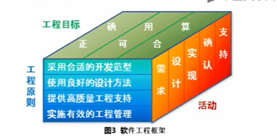
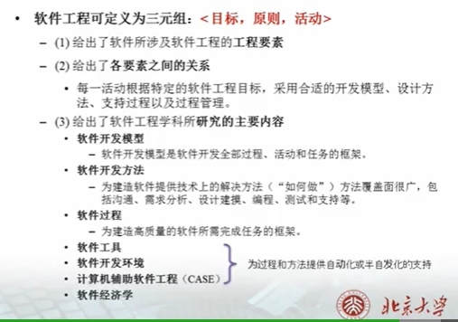

软件工程可定义为三元组:<==目标、原则、活动==>

- 给出了软件所涉及软件工程的工程要素
- 给出了各要素之间的关系
- 给出了软件工程学科所研究的主要内容

## 软件工程的目标

生产具有==正确性、可用性==以及==开销合宜==的产品。

- 正确性
  - 意指软件产品达到预期功能的程度。
- 可用性
  - 意指软件基本结构、实现及文档为用户可用的程度。
- 开销合宜
  - ·指软件开发、运行的整个开销满足用户要求的程度

## 软件工程的活动

生产一个最终满足需求且达到工程目标的软件产品所需要的步骤。

主要包括**需求**、**设计**、**实现**、**确认**和**支持**等活动。

## 软件工程的原则

### 选取适宜的开发模型

### 提供高质量的工程支持

### 重视开发过程的管理

## 软件工程的作用

