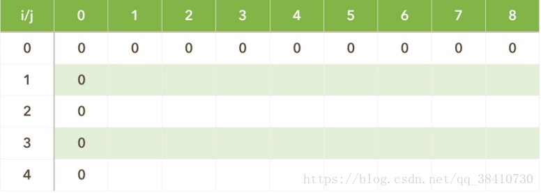
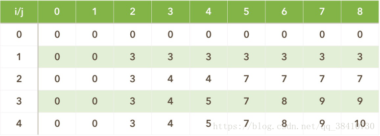
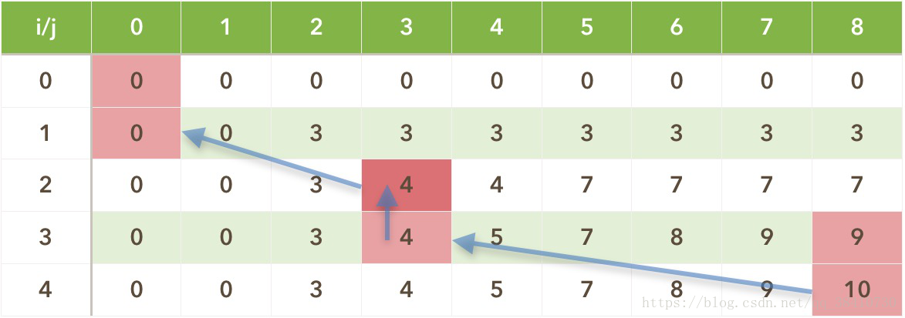
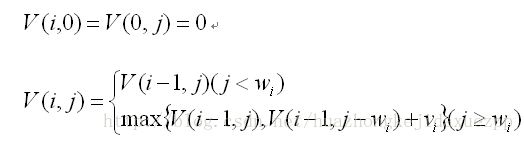
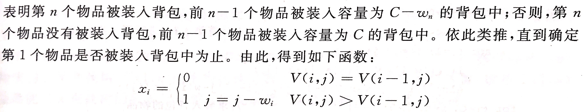

### 动态规划的应用场景

适用动态规划的问题必须满足最优化原理、无后效性和重叠性。

**a.最优化原理（最优子结构性质）** 最优化原理可这样阐述：一个最优化策略具有这样的性质，不论过去状态和决策如何，对前面的决策所形成的状态而言，余下的诸决策必须构成最优策略。简而言之，一个最优化策略的子策略总是最优的。一个问题满足最优化原理又称其具有最优子结构性质。

**b.无后效性** 将各阶段按照一定的次序排列好之后，对于某个给定的阶段状态，它以前各阶段的状态无法直接影响它未来的决策，而只能通过当前的这个状态。换句话说，每个状态都是过去历史的一个完整总结。这就是无后向性，又称为无后效性。

**c.子问题的重叠性** 动态规划将原来具有指数级时间复杂度的搜索算法改进成了具有多项式时间复杂度的算法。其中的关键在于解决冗余，这是动态规划算法的根本目的。动态规划实质上是一种以空间换时间的算法，它在实现的过程中，不得不存储产生过程中的各种状态，所以它的空间复杂度要大于其它的算法。

### 3.动态规划的原理

动态规划与分治法类似，都是把大问题拆分成小问题，通过寻找大问题与小问题的递推关系，解决一个个小问题，最终达到解决原问题的效果。但不同的是，分治法在子问题和子子问题等上被重复计算了很多次，而动态规划则具有记忆性，通过填写表把所有已经解决的子问题答案纪录下来，在新问题里需要用到的子问题可以直接提取，避免了重复计算，从而节约了时间，所以在问题满足最优性原理之后，用动态规划解决问题的核心就在于填表，表填写完毕，最优解也就找到。

最优性原理是动态规划的基础，最优性原理是指“多阶段决策过程的最优决策序列具有这样的性质：**不论初始状态和初始决策如何，对于前面决策所造成的某一状态而言，其后各阶段的决策序列必须构成最优策略”。**


### 4.背包问题的解决过程

在解决问题之前，为描述方便，首先定义一些变量：**Vi表示第 i 个物品的价值，Wi表示第 i 个物品的体积，定义V(i,j)：当前背包容量 j，前 i 个物品最佳组合 对应的价值**，同时背包问题抽象化（X1，X2，…，Xn，其中 Xi 取0或1，表示第 i 个物品选或不选）。

1、建立模型，即求max(V1X1+V2X2+…+VnXn)；

2、寻找约束条件，W1X1+W2X2+…+WnXn<capacity；

3、寻找递推关系式，面对当前商品有两种可能性：

**包的容量比该商品体积小，装不下，此时的价值与前i-1个的价值是一样的，即V(i,j)=V(i-1,j)；**

**还有足够的容量可以装该商品，但\**装了也不一定达到当前最优价值\**，\**所以在装与不装之间选择最优的一个\**，即V(i,j)=max｛V(i-1,j)，V(i-1,j-w(i))+v(i)｝。**

其中V(i-1,j)表示不装，V(i-1,j-w(i))+v(i) 表示装了第i个商品，背包容量减少w(i)，但价值增加了v(i)；

由此可以得出递推关系式：

> （1）j<w(i)，  V(i,j)=V(i-1,j)
>
> （2）j>=w(i)， V(i,j)=max｛V(i-1,j)，V(i-1,j-w(i))+v(i)｝  其中**V(i-1,j)表示装的下，却不装**

(1)式表明：如果第i个物品的重量大于背包的容量，则装人前i个物品得到的最大价值和装入前i-1个物品得到的最大价是相同的，即物品i不能装入背包；

第(2)个式子表明:如果第i个物品的重量小于背包的容量，则会有一下两种情况：(a)如果把第i个物品装入背包，则背包物品的价值等于第i-1个物品装入容量位j-wi 的背包中的价值加上第i个物品的价值vi; (b)如果第i个物品没有装入背包，则背包中物品价值就等于把前i-1个物品装入容量为j的背包中所取得的价值。显然，取二者中价值最大的，作为把前i个物品装入容量为j的背包中的最优解。

这里需要解释一下，为什么背包容量足够的情况下，还需要 V(i,j)=max｛V(i-1,j)，V(i-1,j-w(i))+v(i)｝？

> V(i-1,j-w(i))+v(i) 表示装了第i个物品后背包中的最大价值，所以当前背包容量 j 中，必定有w(i)个容量给了第i个背包。
>
> 因此只剩余j-w(i)个容量用来装，除了第i件物品的其他所有物品。
>
> V(i-1,j-w(i))是前i-1个物品装入容量为j-w(i)的背包中最大价值。
>
> 注意，这里有一个问题。前i-1个物品装入容量为j-w(i)的背包中最大价值+物品i的价值。可能不如将，前i-1个物品装入容量为j的背包中得到的价值大。也就是说,可能出现 V(i-1,j) > (V(i-1,j-w(i))+v(i))
>
> 比如说，将第i个物品放入背包，可能会导致前面更有价值的物品放不进背包。因此，还不如不把第i个物品放进去，把空间让出来，从而能让前i-1个物品中更有价值的物品能够放入背包。从而让V(i,j)取得最大的值。
>
> 所以我们需要 max｛V(i-1,j)，V(i-1,j-w(i))+v(i)｝，来作为把前i个物品装入容量为j的背包中的最优解。

4、填表，首先初始化边界条件，V(0,j)=V(i,0)=0；



然后一行一行的填表：

如，i=1，j=1，w(1)=2，v(1)=3，有j<w(1)，故V(1,1)=V(1-1,1)=0；
又如i=1，j=2，w(1)=2，v(1)=3，有j=w(1),故V(1,2)=max｛ V(1-1,2)，V(1-1,2-w(1))+v(1) ｝=max｛0，0+3｝=3；
如此下去，填到最后一个，i=4，j=8，w(4)=5，v(4)=6，有j>w(4)，故V(4,8)=max｛ V(4-1,8)，V(4-1,8-w(4))+v(4) ｝=max｛9，4+6｝=10……

所以填完表如下图：



5、表格填完，最优解即是V(number,capacity)=V(4,8)=10。（也就是说，在有4个可选物品，背包容量为8的情况下，能装入的最大价值为10）。

### 5.背包问题最优解回溯（求解 这个最优解由哪些商品组成？）

通过上面的方法可以求出背包问题的最优解，但还不知道这个最优解由哪些商品组成，故要根据最优解回溯找出解的组成，根据填表的原理可以有如下的寻解方式：

V(i,j)=V(i-1,j)时，说明没有选择第i 个商品，则回到V(i-1,j)；
V(i,j)=V(i-1,j-w(i))+v(i)时，说明装了第i个商品，该商品是最优解组成的一部分，随后我们得回到装该商品之前，即回到V(i-1,j-w(i))；
一直遍历到i＝0结束为止，所有解的组成都会找到。

就拿上面的例子来说吧：

最优解为V(4,8)=10，而V(4,8)!=V(3,8)却有V(4,8)=V(3,8-w(4))+v(4)=V(3,3)+6=4+6=10，所以第4件商品被选中，并且回到V(3,8-w(4))=V(3,3)；
有V(3,3)=V(2,3)=4，所以第3件商品没被选择，回到V(2,3)；
而V(2,3)!=V(1,3)却有V(2,3)=V(1,3-w(2))+v(2)=V(1,0)+4=0+4=4，所以第2件商品被选中，并且回到V(1,3-w(2))=V(1,0)；
有V(1,0)=V(0,0)=0，所以第1件商品没被选择。



### 动态规划法求解0/1背包问题：

1）基本思想：

令表示在前个物品中能够装入容量为的背包中的物品的最大值，则可以得到如下动态函数：



## 




```java
 
import java.util.*;
 
public class DynamicProgramming {
 
	public static void main(String[] args) {
		Scanner sc = new Scanner(System.in);
		while (sc.hasNext()) {
 
			/* 1.读取数据 */
 
			int number = sc.nextInt(); // 物品的数量
 
			// 注意：我们声明数组的长度为"n+1",并另score[0]和time[0]等于0。
			// 从而使得 数组的下标，对应于题目的序号。即score[1]对应于第一题的分数,time[1]对应于第一题的时间
			int[] weight = new int[number + 1]; // {0,2,3,4,5} 每个物品对应的重量
			int[] value = new int[number + 1]; // {0,3,4,5,6} 每个物品对应的价值
 
			weight[0] = 0;
			for (int i = 1; i < number + 1; i++) {
				weight[i] = sc.nextInt();
			}
 
			value[0] = 0;
			for (int i = 1; i < number + 1; i++) {
				value[i] = sc.nextInt();
			}
 
			int capacity = sc.nextInt(); // 背包容量
 
			/* 2.求解01背包问题 */
 
			int[][] v = new int[number + 1][capacity + 1];// 声明动态规划表.其中v[i][j]对应于：当前有i个物品可选，并且当前背包的容量为j时，我们能得到的最大价值
 
			// 填动态规划表。当前有i个物品可选，并且当前背包的容量为j。
			for (int i = 0; i < number + 1; i++) {
				for (int j = 0; j < capacity + 1; j++) {
					if (i == 0) {
						v[i][j] = 0; // 边界情况：若只有0道题目可以选做，那只能得到0分。所以令V(0,j)=0
					} else if (j == 0) {
						v[i][j] = 0; // 边界情况：若只有0分钟的考试时间，那也只能得0分。所以令V(i,0)=0
					} else {
						if (j < weight[i]) {
							v[i][j] = v[i - 1][j];// 包的容量比当前该物品体积小，装不下，此时的价值与前i-1个的价值是一样的，即V(i,j)=V(i-1,j)；
						} else {
							v[i][j] = Math.max(v[i - 1][j], v[i - 1][j - weight[i]] + value[i]);// 还有足够的容量可以装当前该物品，但装了当前物品也不一定达到当前最优价值，所以在装与不装之间选择最优的一个，即V(i,j)=max｛V(i-1,j)，V(i-1,j-w(i))+v(i)｝。
						}
					}
				}
			}
 
			System.out.println();
			System.out.println("动态规划表如下：");
			for (int i = 0; i < number + 1; i++) {
				for (int j = 0; j < capacity + 1; j++) {
					System.out.print(v[i][j] + "\t");
				}
				System.out.println();
			}
			System.out.println("背包内最大的物品价值总和为：" + v[number][capacity]);// 有number个物品可选，且背包的容量为capacity的情况下，能装入背包的最大价值
 
			/* 3.价值最大时，包内装入了哪些物品？ */
 
			int[] item = new int[number + 1];// 下标i对应的物品若被选中，设置值为1
			Arrays.fill(item, 0);// 将数组item的所有元素初始化为0
 
			// 从最优解，倒推回去找
			int j = capacity;
			for (int i = number; i > 0; i--) {
				if (v[i][j] > v[i - 1][j]) {// 在最优解中，v[i][j]>v[i-1][j]说明选择了第i个商品
					item[i] = 1;
					j = j - weight[i];
				}
			}
 
			System.out.print("包内物品的编号为：");
			for (int i = 0; i < number + 1; i++) {
				if (item[i] == 1) {
					System.out.print(i + " ");
				}
			}
			System.out.println("----------------------------");
 
		}
 
	}
 
}
```

​          