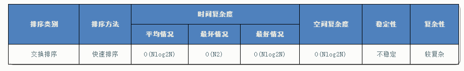

[](http://images2015.cnblogs.com/blog/318837/201604/318837-20160421155746320-2138416137.png)

上图中，演示了快速排序的处理过程：

**初始状态**为一组无序的数组：2、4、5、1、3。

经过以上操作步骤后，完成了**第一次的排序**，得到新的数组：1、2、5、4、3。

新的数组中，以2为分割点，左边都是比2小的数，右边都是比2大的数。

因为2已经在数组中找到了合适的位置，所以不用再动。

2左边的数组只有一个元素1，所以显然不用再排序，位置也被确定。（注：这种情况时，left指针和right指针显然是重合的。因此在代码中，我们可以通过设置判定条件**left****必须小于right****，如果不满足，则不用排序了**）。

而对于2右边的数组5、4、3，设置left指向5，right指向3，开始继续**重复图中的一、二、三、四步骤**，对新的数组进行排序。

核心代码

```java
public int division(int[] list, int left, int right) {
    // 以最左边的数(left)为基准
    int base = list[left];
    while (left < right) {
        // 从序列右端开始，向左遍历，直到找到小于base的数
        while (left < right && list[right] >= base)
            right--;

        // 找到了比base小的元素，将这个元素放到最左边的位置

        list[left] = list[right];
        // 从序列左端开始，向右遍历，直到找到大于base的数
        while (left < right && list[left] <= base)
            left++;
        // 找到了比base大的元素，将这个元素放到最右边的位置
        list[right] = list[left];
    }
    // 最后将base放到left位置。此时，left位置的左侧数值应该都比left小；
    // 而left位置的右侧数值应该都比left大。
    list[left] = base;
    return left;
}

 

private void quickSort(int[] list, int left, int right) {
    // 左下标一定小于右下标，否则就越界了
    if (left < right) {
        // 对数组进行分割，取出下次分割的基准标号
        int base = division(list, left, right);
        System.out.format("base = %d:\t", list[base]);
        printPart(list, left, right);
        // 对“基准标号“左侧的一组数值进行递归的切割，以至于将这些数值完整的排序
        quickSort(list, left, base - 1);
        // 对“基准标号“右侧的一组数值进行递归的切割，以至于将这些数值完整的排序
        quickSort(list, base + 1, right);

    }

}
```


# 算法分析

## 快速排序算法的性能




## 时间复杂度

当数据有序时，以第一个关键字为基准分为两个子序列，前一个子序列为空，此时执行效率最差。

而当数据随机分布时，以第一个关键字为基准分为两个子序列，两个子序列的元素个数接近相等，此时执行效率最好。

所以，数据越随机分布时，快速排序性能越好；数据越接近有序，快速排序性能越差。

 

## 空间复杂度

快速排序在每次分割的过程中，需要 1 个空间存储基准值。而快速排序的大概需要 Nlog2N次的分割处理，所以占用空间也是 Nlog2N 个。


## 算法稳定性

在快速排序中，相等元素可能会因为分区而交换顺序，所以它是不稳定的算法。


完整java代码

```java
public class QuickSort {
 
    public int division(int[] list, int left, int right) {
        // 以最左边的数(left)为基准
        int base = list[left];
        while (left < right) {
            // 从序列右端开始，向左遍历，直到找到小于base的数
            while (left < right && list[right] >= base)
                right--;
            // 找到了比base小的元素，将这个元素放到最左边的位置
            list[left] = list[right];
 
            // 从序列左端开始，向右遍历，直到找到大于base的数
            while (left < right && list[left] <= base)
                left++;
            // 找到了比base大的元素，将这个元素放到最右边的位置
            list[right] = list[left];
        }
 
        // 最后将base放到left位置。此时，left位置的左侧数值应该都比left小；
        // 而left位置的右侧数值应该都比left大。
        list[left] = base;
        return left;
    }
 
    private void quickSort(int[] list, int left, int right) {
 
        // 左下标一定小于右下标，否则就越界了
        if (left < right) {
            // 对数组进行分割，取出下次分割的基准标号
            int base = division(list, left, right);
 
            System.out.format("base = %d:\t", list[base]);
            printPart(list, left, right);
 
            // 对“基准标号“左侧的一组数值进行递归的切割，以至于将这些数值完整的排序
            quickSort(list, left, base - 1);
 
            // 对“基准标号“右侧的一组数值进行递归的切割，以至于将这些数值完整的排序
            quickSort(list, base + 1, right);
        }
    }
 
    // 打印序列
    public void printPart(int[] list, int begin, int end) {
        for (int i = 0; i < begin; i++) {
            System.out.print("\t");
        }
        for (int i = begin; i <= end; i++) {
            System.out.print(list[i] + "\t");
        }
        System.out.println();
    }
 
    public static void main(String[] args) {
        // 初始化一个序列
        int[] array = {
                1, 3, 4, 5, 2, 6, 9, 7, 8, 0
        };
 
        // 调用快速排序方法
        QuickSort quick = new QuickSort();
        System.out.print("排序前:\t\t");
        quick.printPart(array, 0, array.length - 1);
        quick.quickSort(array, 0, array.length - 1);
        System.out.print("排序后:\t\t");
        quick.printPart(array, 0, array.length - 1);
    }
}
```

