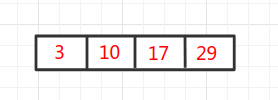
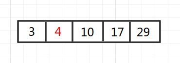
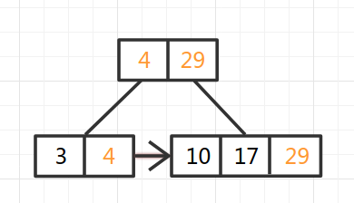
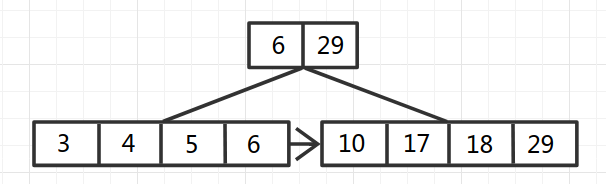
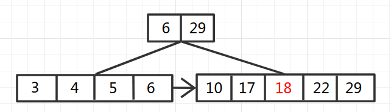
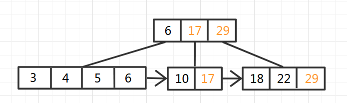
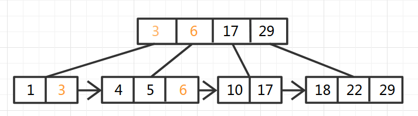
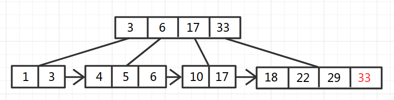
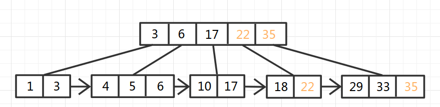
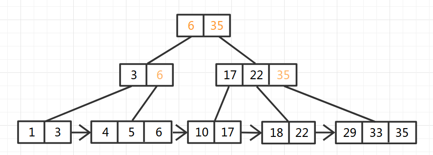

## 解释一

### **B树**

   **[B-tree](https://baike.baidu.com/item/B-tree/6606402)树即[B树](https://baike.baidu.com/item/B树/5411672)**，B即Balanced，平衡的意思。因为B树的原英文名称为B-tree，而国内很多人喜欢把B-tree译作B-树，其实，这是个非常不好的直译，很容易让人产生[误解](https://baike.baidu.com/item/误解/8094198)。如[人们](https://baike.baidu.com/item/人们/876144)可能会以为B-树是一种树，而B树又是另一种树。而事实上是，**B-tree就是指的B树**。特此说明。

先介绍下二叉搜索树

​    1.所有非叶子结点至多拥有两个儿子（Left和Right）；

​    2.所有结点存储一个关键字；

​    3.非叶子结点的左指针指向小于其关键字的子树，右指针指向大于其关键字的子树；

​    如：

​    


​    二叉搜索树的搜索，从根结点开始，如果查询的关键字与结点的关键字相等，那么就命中；

否则，如果查询关键字比结点关键字小，就进入左儿子；如果比结点关键字大，就进入

右儿子；如果左儿子或右儿子的指针为空，则报告找不到相应的关键字；

​    如果二叉搜索树的所有非叶子结点的左右子树的结点数目均保持差不多（平衡），那么B树

的搜索性能逼近二分查找；但它比连续内存空间的二分查找的优点是，改变二叉搜索树结构

（插入与删除结点）不需要移动大段的内存数据，甚至通常是常数开销；

​    如：

   


  但二叉搜索树在经过多次插入与删除后，有可能导致不同的结构：


 


  右边也是一个二叉搜索树，但它的搜索性能已经是线性的了；同样的关键字集合有可能导致不同的

树结构索引；所以，使用二叉搜索树还要考虑尽可能让B树保持左图的结构，和避免右图的结构，也就

是所谓的“平衡”问题；   

​    实际使用的二叉搜索树都是在原二叉搜索树的基础上加上平衡算法，即“平衡二叉树”；如何保持B树

结点分布均匀的平衡算法是平衡二叉树的关键；平衡算法是一种在二叉搜索树中插入和删除结点的


---

### B树（B-树）

​    是一种多路搜索树（并不是二叉的）：

​    1.定义任意非叶子结点最多只有M个儿子；且M>2；

​    2.根结点的儿子数为[2, M]；

​    3.除根结点以外的非叶子结点的儿子数为[M/2, M]；

​    4.每个结点存放至少M/2-1（取上整）和至多M-1个关键字；（至少2个关键字）

​    5.非叶子结点的关键字个数=指向儿子的指针个数-1；

​    6.非叶子结点的关键字：K[1], K[2], …, K[M-1]；且K[i] < K[i+1]；

​    7.非叶子结点的指针：P[1], P[2], …, P[M]；其中P[1]指向关键字小于K[1]的

子树，P[M]指向关键字大于K[M-1]的子树，其它P[i]指向关键字属于(K[i-1], K[i])的子树；

​    8.所有叶子结点位于同一层；

​    如：（M=3）


​    B-树的搜索，从根结点开始，对结点内的关键字（有序）序列进行二分查找，如果

命中则结束，否则进入查询关键字所属范围的儿子结点；重复，直到所对应的儿子指针为

空，或已经是叶子结点；

B-树的特性：

​    1.关键字集合分布在整颗树中；

​    2.任何一个关键字出现且只出现在一个结点中；

​    3.搜索有可能在非叶子结点结束；

​    4.其搜索性能等价于在关键字全集内做一次二分查找；

​    5.自动层次控制；

​    由于限制了除根结点以外的非叶子结点，至少含有M/2个儿子，确保了结点的至少

利用率，其最底搜索性能为：


  

​    其中，M为设定的非叶子结点最多子树个数，N为关键字总数；

​    所以B-树的性能总是等价于二分查找（与M值无关），也就没有B树平衡的问题；

​    由于M/2的限制，在插入结点时，如果结点已满，需要将结点分裂为两个各占

M/2的结点；删除结点时，需将两个不足M/2的兄弟结点合并；


----

### **B+树**

​    B+树是B-树的变体，也是一种多路搜索树：

​    1.其定义基本与B-树同，除了：

​    2.非叶子结点的子树指针与关键字个数相同；

​    3.非叶子结点的子树指针P[i]，指向关键字值属于[K[i], K[i+1])的子树

（B-树是开区间）；

​    5.为所有叶子结点增加一个链指针；

​    6.所有关键字都在叶子结点出现；

​    如：（M=3）


  B+的搜索与B-树也基本相同，区别是B+树只有达到叶子结点才命中（B-树可以在

非叶子结点命中），其性能也等价于在关键字全集做一次二分查找；

​    B+的特性：

​    1.所有关键字都出现在叶子结点的链表中（稠密索引），且链表中的关键字恰好

是有序的；

​    2.不可能在非叶子结点命中；

​    3.非叶子结点相当于是叶子结点的索引（稀疏索引），叶子结点相当于是存储

（关键字）数据的数据层；

​    4.更适合文件索引系统；

---

### **B\*树**

​    是B+树的变体，在B+树的非根和非叶子结点再增加指向兄弟的指针；


  B*树定义了非叶子结点关键字个数至少为(2/3)*M，即块的最低使用率为2/3

（代替B+树的1/2）；

​    B+树的分裂：当一个结点满时，分配一个新的结点，并将原结点中1/2的数据

复制到新结点，最后在父结点中增加新结点的指针；B+树的分裂只影响原结点和父

结点，而不会影响兄弟结点，所以它不需要指向兄弟的指针；

​    B*树的分裂：当一个结点满时，如果它的下一个兄弟结点未满，那么将一部分

数据移到兄弟结点中，再在原结点插入关键字，最后修改父结点中兄弟结点的关键字

（因为兄弟结点的关键字范围改变了）；如果兄弟也满了，则在原结点与兄弟结点之

间增加新结点，并各复制1/3的数据到新结点，最后在父结点增加新结点的指针；

​    所以，B*树分配新结点的概率比B+树要低，空间使用率更高；


---

### **小结**

​    二叉搜索树：二叉树，每个结点只存储一个关键字，等于则命中，小于走左结点，大于

走右结点；

​    B（B-）树：多路搜索树，每个结点存储M/2到M个关键字，非叶子结点存储指向关键

字范围的子结点；

​    所有关键字在整颗树中出现，且只出现一次，非叶子结点可以命中；

​    B+树：在B-树基础上，为叶子结点增加链表指针，所有关键字都在叶子结点

中出现，非叶子结点作为叶子结点的索引；B+树总是到叶子结点才命中；

​    B*树：在B+树基础上，为非叶子结点也增加链表指针，将结点的最低利用率

从1/2提高到2/3；


----

## 解释二

### 平衡多路查找树（B-Tree）

B-Tree是为磁盘等外存储设备设计的一种平衡查找树。因此在讲B-Tree之前先了解下磁盘的相关知识。

系统从磁盘读取数据到内存时是以磁盘块（block）为基本单位的，位于同一个磁盘块中的数据会被一次性读取出来，而不是需要什么取什么。

InnoDB存储引擎中有页（Page）的概念，页是其磁盘管理的最小单位。InnoDB存储引擎中默认每个页的大小为16KB，可通过参数innodb_page_size将页的大小设置为4K、8K、16K，在[MySQL](http://lib.csdn.net/base/mysql)中可通过如下命令查看页的大小：

```
mysql> show variables like 'innodb_page_size';
```

而系统一个磁盘块的存储空间往往没有这么大，因此InnoDB每次申请磁盘空间时都会是若干地址连续磁盘块来达到页的大小16KB。InnoDB在把磁盘数据读入到磁盘时会以页为基本单位，在查询数据时如果一个页中的每条数据都能有助于定位数据记录的位置，这将会减少磁盘I/O次数，提高查询效率。

B-Tree结构的数据可以让系统高效的找到数据所在的磁盘块。为了描述B-Tree，首先定义一条记录为一个二元组[key, data] ，key为记录的键值，对应表中的主键值，data为一行记录中除主键外的数据。对于不同的记录，key值互不相同。

一棵m阶的B-Tree有如下特性： 
1. 每个节点最多有m个孩子。 
2. 除了根节点和叶子节点外，其它每个节点至少有Ceil(m/2)个孩子。 
3. 若根节点不是叶子节点，则至少有2个孩子 
4. 所有叶子节点都在同一层，且不包含其它关键字信息 
5. 每个非终端节点包含n个关键字信息（P0,P1,…Pn, k1,…kn） 
6. 关键字的个数n满足：ceil(m/2)-1 <= n <= m-1 
7. ki(i=1,…n)为关键字，且关键字升序排序。 
8. Pi(i=1,…n)为指向子树根节点的指针。P(i-1)指向的子树的所有节点关键字均小于ki，但都大于k(i-1)

B-Tree中的每个节点根据实际情况可以包含大量的关键字信息和分支，如下图所示为一个3阶的B-Tree： 


每个节点占用一个盘块的磁盘空间，一个节点上有两个升序排序的关键字和三个指向子树根节点的指针，指针存储的是子节点所在磁盘块的地址。两个关键词划分成的三个范围域对应三个指针指向的子树的数据的范围域。以根节点为例，关键字为17和35，P1指针指向的子树的数据范围为小于17，P2指针指向的子树的数据范围为17~35，P3指针指向的子树的数据范围为大于35。

模拟查找关键字29的过程：

1. 根据根节点找到磁盘块1，读入内存。【磁盘I/O操作第1次】
2. 比较关键字29在区间（17,35），找到磁盘块1的指针P2。
3. 根据P2指针找到磁盘块3，读入内存。【磁盘I/O操作第2次】
4. 比较关键字29在区间（26,30），找到磁盘块3的指针P2。
5. 根据P2指针找到磁盘块8，读入内存。【磁盘I/O操作第3次】
6. 在磁盘块8中的关键字列表中找到关键字29。

分析上面过程，发现需要3次磁盘I/O操作，和3次内存查找操作。由于内存中的关键字是一个有序表结构，可以利用二分法查找提高效率。而3次磁盘I/O操作是影响整个B-Tree查找效率的决定因素。B-Tree相对于AVLTree缩减了节点个数，使每次磁盘I/O取到内存的数据都发挥了作用，从而提高了查询效率。


### B+Tree

B+Tree是在B-Tree基础上的一种优化，使其更适合实现外存储索引结构，InnoDB存储引擎就是用B+Tree实现其索引结构。

从上一节中的B-Tree结构图中可以看到每个节点中不仅包含数据的key值，还有data值。而每一个页的存储空间是有限的，如果data数据较大时将会导致每个节点（即一个页）能存储的key的数量很小，当存储的数据量很大时同样会导致B-Tree的深度较大，增大查询时的磁盘I/O次数，进而影响查询效率。在B+Tree中，所有数据记录节点都是按照键值大小顺序存放在同一层的叶子节点上，而非叶子节点上只存储key值信息，这样可以大大加大每个节点存储的key值数量，降低B+Tree的高度。

B+Tree相对于B-Tree有几点不同：

1. 非叶子节点只存储键值信息。
2. 所有叶子节点之间都有一个链指针。
3. 数据记录都存放在叶子节点中。

将上一节中的B-Tree优化，由于B+Tree的非叶子节点只存储键值信息，假设每个磁盘块能存储4个键值及指针信息，则变成B+Tree后其结构如下图所示： 


通常在B+Tree上有两个头指针，一个指向根节点，另一个指向关键字最小的叶子节点，而且所有叶子节点（即数据节点）之间是一种链式环结构。因此可以对B+Tree进行两种查找运算：一种是对于主键的范围查找和分页查找，另一种是从根节点开始，进行随机查找。

可能上面例子中只有22条数据记录，看不出B+Tree的优点，下面做一个推算：

InnoDB存储引擎中页的大小为16KB，一般表的主键类型为INT（占用4个字节）或BIGINT（占用8个字节），指针类型也一般为4或8个字节，也就是说一个页（B+Tree中的一个节点）中大概存储16KB/(8B+8B)=1K个键值（因为是估值，为方便计算，这里的K取值为〖10〗^3）。也就是说一个深度为3的B+Tree索引可以维护10^3 * 10^3 * 10^3 = 10亿 条记录。

实际情况中每个节点可能不能填充满，因此在数据库中，B+Tree的高度一般都在2~4层。[mysql](http://lib.csdn.net/base/mysql)的InnoDB存储引擎在设计时是将根节点常驻内存的，也就是说查找某一键值的行记录时最多只需要1~3次磁盘I/O操作。

数据库中的B+Tree索引可以分为聚集索引（clustered index）和辅助索引（secondary index）。上面的B+Tree示例图在数据库中的实现即为聚集索引，聚集索引的B+Tree中的叶子节点存放的是整张表的行记录数据。辅助索引与聚集索引的区别在于辅助索引的叶子节点并不包含行记录的全部数据，而是存储相应行数据的聚集索引键，即主键。当通过辅助索引来查询数据时，InnoDB存储引擎会遍历辅助索引找到主键，然后再通过主键在聚集索引中找到完整的行记录数据。

 

---

## 代码实现

### B-tree

```java
package tree;
 
 
/**
 * Created by bruce_shan on 2018/7/8 17:08.
 * Description :  B-树 也作 B树  java 实现
 */
public class BTree<Key extends Comparable<Key>, Value> {
 
    private static final int M = 4;  // B树的阶数
 
    private Node root;       //  B-tree 的根节点
    private int height;      //  B-tree 的高度
    private int N;           //  B-tree 树中键值对的数目
 
    // B-tree 节点类型
    private static final class Node {
        private int m;                             // number of children
        private Entry[] children = new Entry[M];   // the array of children
        // create a node with k children
        private Node(int k) {
            m = k;
        }
    }
    //  B-tree 节点中的元素类型
    private static class Entry {
        private Comparable key;
        private Object val;
        private Node next;     // 指向节点中下一元素
        public Entry(Comparable key, Object val, Node next) {
            this.key  = key;
            this.val  = val;
            this.next = next;
        }
    }
 
 
    /**
     * 初始化空 B-tree树
     */
    public BTree() {
        root = new Node(0);
    }
 
    /**
     *  判断 B-tree 是否是空树
     */
    public boolean isEmpty() {
        return size() == 0;
    }
 
    public int size() {
        return N;
    }
 
    public int height() {
        return height;
    }
 
    /**
     *   get操作
     */
    public Value get(Key key) {
        if (key == null) throw new NullPointerException("key must not be null");
        return search(root, key, height);
    }
 
    /**
     *   put 操作
     */
    public void put(Key key, Value val) {
        if (key == null) throw new NullPointerException("key must not be null");
        Node u = insert(root, key, val, height);
        N++;
        if (u == null) return;
 
        // need to split root
        Node t = new Node(2);
        t.children[0] = new Entry(root.children[0].key, null, root);
        t.children[1] = new Entry(u.children[0].key, null, u);
        root = t;
        height++;
    }
 
 
    //  搜索操作
    private Value search(Node x, Key key, int ht) {
        Entry[] children = x.children;
 
        // 节点内数组操作  内部遍历
        if (ht == 0) {
            for (int j = 0; j < x.m; j++) {
                if (equals(key, children[j].key)) return (Value) children[j].val;
            }
        }
 
        //  外部定位
        else {
            for (int j = 0; j < x.m; j++) {
                if (j+1 == x.m || less(key, children[j+1].key))
                    return search(children[j].next, key, ht-1);
            }
        }
        return null;
    }
    //  插入操作
    private Node insert(Node h, Key key, Value val, int ht) {
        int j;
        Entry t = new Entry(key, val, null);
 
        // 节点内部数组操作
        if (ht == 0) {
            for (j = 0; j < h.m; j++) {
                if (less(key, h.children[j].key)) break;
            }
        }
        // 外部遍历
        else {
            for (j = 0; j < h.m; j++) {
                if ((j+1 == h.m) || less(key, h.children[j+1].key)) {
                    Node u = insert(h.children[j++].next, key, val, ht-1);
                    if (u == null) return null;
                    t.key = u.children[0].key;
                    t.next = u;
                    break;
                }
            }
        }
 
        for (int i = h.m; i > j; i--)
            h.children[i] = h.children[i-1];
        h.children[j] = t;
        h.m++;
        if (h.m < M) return null;
        else         return split(h);
    }
 
    //  分裂节点成两半
    private Node split(Node h) {
        Node t = new Node(M/2);
        h.m = M/2;
        for (int j = 0; j < M/2; j++)
            t.children[j] = h.children[M/2+j];
        return t;
    }
    // 判断两个元素是否相等
    private boolean equals(Comparable k1, Comparable k2) {
        return k1.compareTo(k2) == 0;
    }
 
    // 判断两个元素的大小
    private boolean less(Comparable k1, Comparable k2) {
        return k1.compareTo(k2) < 0;
    }
}
```


### B+-Tree

#### 例子

建立一个阶为4的B+树,随机一些数据进行插入(只用key,忽略value):
10,17,3,29,6,5,18,4,22,1,33,35
首先,依次插入10,17,3,19,都能存放在初始节点中,在插入时会查找到正确的位置并且进行插入:



之后插入6,插入成功后发现当前节点的键的数量为5,大于了最大值4,所以需要从中间拆分为两部分,同时把拆分后的两个节点最大的键取出来插入到父节点中(图中橙色节点):





之后继续插入5,18,4都能够成功插入.5插入时先从根节点出发，因为小于第一个key 6，所直接插入6对应的子节点。18插入时因为大于6小于29，所以插入到29对应的子节点。(如果插入的数大于29，同样会插入到29对应的子节点，但是同时会更新非叶子结点的值，保证非叶子结点键始终是它所指向的子节点的最大值。）插入的结果应该为



之后插入22,因为22大于6小于29，所以插入29对应叶子节点。插入后叶子节点超过上限,进行拆分,拆分后仍然将拆分的两部分的最大值插入到父节点:





之后按照此规则继续插入1,1小于6，则直接插入到6对应叶子节点，这个4阶B树将变成:



再拆入33,35,注意，插入33时，因为33大于了最大值29，所以需要更新父节点的最大值，这样才能保证父节点键值始终是其指向的节点的最大值。插入35时,叶节点分解成两个,然后依旧将分解之后的结果发送到父节点,父节点更新节点和指针,更新后发现当前节点也超过了4个,那么当前节点也进行分解,生成父节点,如此重复,直到没有节点为止:







图中没有画出的一点是,所有的值都只在叶子节点存储,非叶子节点只有键,不存储值.
查询时则十分简单,非叶子节点直接顺序比较,找到区间则递归调用查找函数,叶子节点则采用二分查找,找到对应节点.


#### 代码实现

```java
package bPlusTree;

/**
 * 实现B+树
 *
 * @param <T> 指定值类型
 * @param <V> 使用泛型，指定索引类型,并且指定必须继承Comparable
 */
public class BPlusTree <T, V extends Comparable<V>>{
    //B+树的阶
    private Integer bTreeOrder;
    //B+树的非叶子节点最小拥有的子节点数量（同时也是键的最小数量）
    //private Integer minNUmber;
    //B+树的非叶子节点最大拥有的节点数量（同时也是键的最大数量）
    private Integer maxNumber;

    private Node<T, V> root;

    private LeafNode<T, V> left;

    //无参构造方法，默认阶为3
    public BPlusTree(){
        this(3);
    }

    //有参构造方法，可以设定B+树的阶
    public BPlusTree(Integer bTreeOrder){
        this.bTreeOrder = bTreeOrder;
        //this.minNUmber = (int) Math.ceil(1.0 * bTreeOrder / 2.0);
        //因为插入节点过程中可能出现超过上限的情况,所以这里要加1
        this.maxNumber = bTreeOrder + 1;
        this.root = new LeafNode<T, V>();
        this.left = null;
    }

    //查询
    public T find(V key){
        T t = this.root.find(key);
        if(t == null){
            System.out.println("不存在");
        }
        return t;
    }

    //插入
    public void insert(T value, V key){
        if(key == null)
            return;
        Node<T, V> t = this.root.insert(value, key);
        if(t != null)
            this.root = t;
        this.left = (LeafNode<T, V>)this.root.refreshLeft();

//        System.out.println("插入完成,当前根节点为:");
//        for(int j = 0; j < this.root.number; j++) {
//            System.out.print((V) this.root.keys[j] + " ");
//        }
//        System.out.println();
    }


    /**
     * 节点父类，因为在B+树中，非叶子节点不用存储具体的数据，只需要把索引作为键就可以了
     * 所以叶子节点和非叶子节点的类不太一样，但是又会公用一些方法，所以用Node类作为父类,
     * 而且因为要互相调用一些公有方法，所以使用抽象类
     *
     * @param <T> 同BPlusTree
     * @param <V>
     */
    abstract class Node<T, V extends Comparable<V>>{
        //父节点
        protected Node<T, V> parent;
        //子节点
        protected Node<T, V>[] childs;
        //键（子节点）数量
        protected Integer number;
        //键
        protected Object keys[];

        //构造方法
        public Node(){
            this.keys = new Object[maxNumber];
            this.childs = new Node[maxNumber];
            this.number = 0;
            this.parent = null;
        }

        //查找
        abstract T find(V key);

        //插入
        abstract Node<T, V> insert(T value, V key);

        abstract LeafNode<T, V> refreshLeft();
    }


    /**
     * 非叶节点类
     * @param <T>
     * @param <V>
     */

    class BPlusNode <T, V extends Comparable<V>> extends Node<T, V>{

        public BPlusNode() {
            super();
        }

        /**
         * 递归查找,这里只是为了确定值究竟在哪一块,真正的查找到叶子节点才会查
         * @param key
         * @return
         */
        @Override
        T find(V key) {
            int i = 0;
            while(i < this.number){
                if(key.compareTo((V) this.keys[i]) <= 0)
                    break;
                i++;
            }
            if(this.number == i)
                return null;
            return this.childs[i].find(key);
        }

        /**
         * 递归插入,先把值插入到对应的叶子节点,最终讲调用叶子节点的插入类
         * @param value
         * @param key
         */
        @Override
        Node<T, V> insert(T value, V key) {
            int i = 0;
            while(i < this.number){
                if(key.compareTo((V) this.keys[i]) < 0)
                    break;
                i++;
            }
            if(key.compareTo((V) this.keys[this.number - 1]) >= 0) {
                i--;
//                if(this.childs[i].number + 1 <= bTreeOrder) {
//                    this.keys[this.number - 1] = key;
//                }
            }

//            System.out.println("非叶子节点查找key: " + this.keys[i]);

            return this.childs[i].insert(value, key);
        }

        @Override
        LeafNode<T, V> refreshLeft() {
            return this.childs[0].refreshLeft();
        }

        /**
         * 当叶子节点插入成功完成分解时,递归地向父节点插入新的节点以保持平衡
         * @param node1
         * @param node2
         * @param key
         */
        Node<T, V> insertNode(Node<T, V> node1, Node<T, V> node2, V key){

//            System.out.println("非叶子节点,插入key: " + node1.keys[node1.number - 1] + " " + node2.keys[node2.number - 1]);

            V oldKey = null;
            if(this.number > 0)
                oldKey = (V) this.keys[this.number - 1];
            //如果原有key为null,说明这个非节点是空的,直接放入两个节点即可
            if(key == null || this.number <= 0){
//                System.out.println("非叶子节点,插入key: " + node1.keys[node1.number - 1] + " " + node2.keys[node2.number - 1] + "直接插入");
                this.keys[0] = node1.keys[node1.number - 1];
                this.keys[1] = node2.keys[node2.number - 1];
                this.childs[0] = node1;
                this.childs[1] = node2;
                this.number += 2;
                return this;
            }
            //原有节点不为空,则应该先寻找原有节点的位置,然后将新的节点插入到原有节点中
            int i = 0;
            while(key.compareTo((V)this.keys[i]) != 0){
                i++;
            }
            //左边节点的最大值可以直接插入,右边的要挪一挪再进行插入
            this.keys[i] = node1.keys[node1.number - 1];
            this.childs[i] = node1;

            Object tempKeys[] = new Object[maxNumber];
            Object tempChilds[] = new Node[maxNumber];

            System.arraycopy(this.keys, 0, tempKeys, 0, i + 1);
            System.arraycopy(this.childs, 0, tempChilds, 0, i + 1);
            System.arraycopy(this.keys, i + 1, tempKeys, i + 2, this.number - i - 1);
            System.arraycopy(this.childs, i + 1, tempChilds, i + 2, this.number - i - 1);
            tempKeys[i + 1] = node2.keys[node2.number - 1];
            tempChilds[i + 1] = node2;

            this.number++;

            //判断是否需要拆分
            //如果不需要拆分,把数组复制回去,直接返回
            if(this.number <= bTreeOrder){
                System.arraycopy(tempKeys, 0, this.keys, 0, this.number);
                System.arraycopy(tempChilds, 0, this.childs, 0, this.number);

//                System.out.println("非叶子节点,插入key: " + node1.keys[node1.number - 1] + " " + node2.keys[node2.number - 1] + ", 不需要拆分");

                return null;
            }

//            System.out.println("非叶子节点,插入key: " + node1.keys[node1.number - 1] + " " + node2.keys[node2.number - 1] + ",需要拆分");

            //如果需要拆分,和拆叶子节点时类似,从中间拆开
            Integer middle = this.number / 2;

            //新建非叶子节点,作为拆分的右半部分
            BPlusNode<T, V> tempNode = new BPlusNode<T, V>();
            //非叶节点拆分后应该将其子节点的父节点指针更新为正确的指针
            tempNode.number = this.number - middle;
            tempNode.parent = this.parent;
            //如果父节点为空,则新建一个非叶子节点作为父节点,并且让拆分成功的两个非叶子节点的指针指向父节点
            if(this.parent == null) {

//                System.out.println("非叶子节点,插入key: " + node1.keys[node1.number - 1] + " " + node2.keys[node2.number - 1] + ",新建父节点");

                BPlusNode<T, V> tempBPlusNode = new BPlusNode<>();
                tempNode.parent = tempBPlusNode;
                this.parent = tempBPlusNode;
                oldKey = null;
            }
            System.arraycopy(tempKeys, middle, tempNode.keys, 0, tempNode.number);
            System.arraycopy(tempChilds, middle, tempNode.childs, 0, tempNode.number);
            for(int j = 0; j < tempNode.number; j++){
                tempNode.childs[j].parent = tempNode;
            }
            //让原有非叶子节点作为左边节点
            this.number = middle;
            this.keys = new Object[maxNumber];
            this.childs = new Node[maxNumber];
            System.arraycopy(tempKeys, 0, this.keys, 0, middle);
            System.arraycopy(tempChilds, 0, this.childs, 0, middle);

            //叶子节点拆分成功后,需要把新生成的节点插入父节点
            BPlusNode<T, V> parentNode = (BPlusNode<T, V>)this.parent;
            return parentNode.insertNode(this, tempNode, oldKey);
        }

    }

    /**
     * 叶节点类
     * @param <T>
     * @param <V>
     */
    class LeafNode <T, V extends Comparable<V>> extends Node<T, V> {

        protected Object values[];
        protected LeafNode left;
        protected LeafNode right;

        public LeafNode(){
            super();
            this.values = new Object[maxNumber];
            this.left = null;
            this.right = null;
        }

        /**
         * 进行查找,经典二分查找,不多加注释
         * @param key
         * @return
         */
        @Override
        T find(V key) {
            if(this.number <=0)
                return null;

//            System.out.println("叶子节点查找");

            Integer left = 0;
            Integer right = this.number;

            Integer middle = (left + right) / 2;

            while(left < right){
                V middleKey = (V) this.keys[middle];
                if(key.compareTo(middleKey) == 0)
                    return (T) this.values[middle];
                else if(key.compareTo(middleKey) < 0)
                    right = middle;
                else
                    left = middle;
                middle = (left + right) / 2;
            }
            return null;
        }

        /**
         *
         * @param value
         * @param key
         */
        @Override
        Node<T, V> insert(T value, V key) {

//            System.out.println("叶子节点,插入key: " + key);

            //保存原始存在父节点的key值
            V oldKey = null;
            if(this.number > 0)
                oldKey = (V) this.keys[this.number - 1];
            //先插入数据
            int i = 0;
            while(i < this.number){
                if(key.compareTo((V) this.keys[i]) < 0)
                    break;
                    i++;
            }

            //复制数组,完成添加
            Object tempKeys[] = new Object[maxNumber];
            Object tempValues[] = new Object[maxNumber];
            System.arraycopy(this.keys, 0, tempKeys, 0, i);
            System.arraycopy(this.values, 0, tempValues, 0, i);
            System.arraycopy(this.keys, i, tempKeys, i + 1, this.number - i);
            System.arraycopy(this.values, i, tempValues, i + 1, this.number - i);
            tempKeys[i] = key;
            tempValues[i] = value;

            this.number++;

//            System.out.println("插入完成,当前节点key为:");
//            for(int j = 0; j < this.number; j++)
//                System.out.print(tempKeys[j] + " ");
//            System.out.println();

            //判断是否需要拆分
            //如果不需要拆分完成复制后直接返回
            if(this.number <= bTreeOrder){
                System.arraycopy(tempKeys, 0, this.keys, 0, this.number);
                System.arraycopy(tempValues, 0, this.values, 0, this.number);

                //有可能虽然没有节点分裂，但是实际上插入的值大于了原来的最大值，所以所有父节点的边界值都要进行更新
                Node node = this;
                while (node.parent != null){
                    V tempkey = (V)node.keys[node.number - 1];
                    if(tempkey.compareTo((V)node.parent.keys[node.parent.number - 1]) > 0){
                        node.parent.keys[node.parent.number - 1] = tempkey;
                        node = node.parent;
                    }
                    else {
                    	break;
                    }
                }
//                System.out.println("叶子节点,插入key: " + key + ",不需要拆分");

                return null;
            }

//            System.out.println("叶子节点,插入key: " + key + ",需要拆分");

            //如果需要拆分,则从中间把节点拆分差不多的两部分
            Integer middle = this.number / 2;

            //新建叶子节点,作为拆分的右半部分
            LeafNode<T, V> tempNode = new LeafNode<T, V>();
            tempNode.number = this.number - middle;
            tempNode.parent = this.parent;
            //如果父节点为空,则新建一个非叶子节点作为父节点,并且让拆分成功的两个叶子节点的指针指向父节点
            if(this.parent == null) {

//                System.out.println("叶子节点,插入key: " + key + ",父节点为空 新建父节点");

                BPlusNode<T, V> tempBPlusNode = new BPlusNode<>();
                tempNode.parent = tempBPlusNode;
                this.parent = tempBPlusNode;
                oldKey = null;
            }
            System.arraycopy(tempKeys, middle, tempNode.keys, 0, tempNode.number);
            System.arraycopy(tempValues, middle, tempNode.values, 0, tempNode.number);

            //让原有叶子节点作为拆分的左半部分
            this.number = middle;
            this.keys = new Object[maxNumber];
            this.values = new Object[maxNumber];
            System.arraycopy(tempKeys, 0, this.keys, 0, middle);
            System.arraycopy(tempValues, 0, this.values, 0, middle);

            this.right = tempNode;
            tempNode.left = this;

            //叶子节点拆分成功后,需要把新生成的节点插入父节点
            BPlusNode<T, V> parentNode = (BPlusNode<T, V>)this.parent;
            return parentNode.insertNode(this, tempNode, oldKey);
        }

        @Override
        LeafNode<T, V> refreshLeft() {
            if(this.number <= 0)
                return null;
            return this;
        }
    }
}


```

