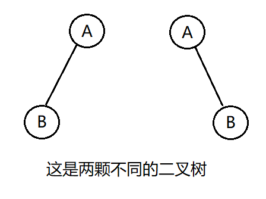
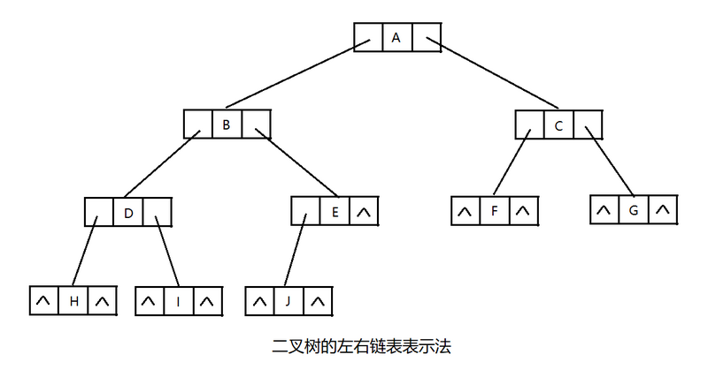

#### 1、二叉树

##### 1.二叉树的定义

二叉树（Binary Tree）是有限个节点的集合，这个集合可以是空集，也可以是一个根节点和两颗不相交的子二叉树组成的集合，其中一颗树叫根的左子树，另一颗树叫右子树。所以二叉树是一个递归地概念。

```
值得注意的是二叉树规定自己可以使空集，而且很明确的区分了一个根节点的两个子树分别是左子树和右子树，如下图所示的两棵树就不是同一棵树。
```



##### 2.两种特殊的二叉树

2.1 满二叉树（Full Binary Tree）
一棵满二叉树就是高度为k，且拥有(2^k)-1个节点的二叉树，一棵满二叉树每个节点，要么都有两棵子树，要么都没有子树；而且每一层所有的节点之间必须要么都有两棵子树，要么都没子树。


2.2 完全二叉树（Complete Binary Tree）
完全二叉树是一颗特殊的二叉树，它遵循以下规则：
假设完全二叉树高度为k，则完全二叉树需要符合以下两点：
1）所有叶子节点都出现在k层或k-1层，并且从1~k-1层必须达到最大节点数。
2）第k层可以是不满的，但是第k层的所有节点必须集中在最左边。


##### 3.二叉树的实现

二叉树的实现要比普通树容易，因为其每个节点最多只有两个子节点
其实，二叉树的每个左右子节点仍是一颗二叉树，因此，我们可以使用递归的方式来定义二叉树，二叉树的实现代码如下

```
public class BinaryTreeNode {
    
    private int data;  //数据
    private BinaryTreeNode leftChirld;  //左孩子
    private BinaryTreeNode rightChirld; //右孩子
    
    public int getData() {
        return data;
    }
    public void setData(int data) {
        this.data = data;
    }
    public BinaryTreeNode getLeftChirld() {
        return leftChirld;
    }
    public void setLeftChirld(BinaryTreeNode leftChirld) {
        this.leftChirld = leftChirld;
    }
    public BinaryTreeNode getRightChirld() {
        return rightChirld;
    }
    public void setRightChirld(BinaryTreeNode rightChirld) {
        this.rightChirld = rightChirld;
    }        
}
```

这种实现方式称之为二叉树的左右链表表示法，如图所示

到此为止，二叉树的节点已经有了，接下来是对二叉树的操作，比如创建二叉树、添加元素、清空元素、遍历二叉树...
**3.1 二叉树的创建**
创建二叉树，一般有两种情况：初始化一个根节点或者初始化一棵空二叉树。代码如下：

```
public class BinaryTree {
    private BinaryTreeNode root;
    
    //初始化二叉树
    public BinaryTree(){}
    
    public BinaryTree(BinaryTreeNode root){
        this.root = root;
    }
    
    public void setRoot(BinaryTreeNode root){
        this.root = root;
    }
    
    public BinaryTreeNode getRoot(){
        return root;
    }
}
```

**3.2 二叉树的清空**
对于二叉树的清空，首先提供一个清空某个节点为根节点的子树的方法，即递归的删除每个节点；接着提供删除一个删除树的方法：

```
    /**
     * 二叉树的清空：
     * 首先提供一个清空以某个节点为根节点的子树的方法，既递归地删除每个节点；
     * 接着提供一个删除树的方法，直接通过第一种方法删除到根节点即可
     */
    //清除某个子树的所有节点
    public void clear(BinaryTreeNode node){
        if(node!=null){
            clear(node.getLeftChirld());
            clear(node.getRightChirld());
            node = null; //删除节点
        }
    }
    //清空树
    public void clear(){
        clear(root);
    }
```

**3.3 判断二叉树是否为空**
只需判断根节点是否存在即可：

```
    //判断二叉树是否为空
    public boolean isEmpty(){
        return root == null;
    }
```

**3.4 求二叉树的高度**
思路：首先需要一种获取以某个节点为子树的高度方法，使用递归实现。如果一个节点为空，那么这个节点肯定是一颗空树，高度为0；如果不为空，则遍历地比较它的左右子树高度，高的一个为这颗子树的最大高度，然后加上自身的高度即可

```
    /**
     * 求二叉树的高度：
     * 首先要一种获取以某个节点为子树的高度的方法，使用递归调用。
     * 如果一个节点为空，那么这个节点肯定是一颗空树，高度为0；
     * 如果不为空，那么我们要遍历地比较它的左子树高度和右子树高度，
     *     高的一个为这个子树的最大高度，然后加上自己本身的高度就是了
     * 获取二叉树的高度，只需要调用第一种方法，即传入根节点
     */
    
    //获取二叉树的高度
    public int heigh(){
        return heigh(root);
    }
    
    //获取以某节点为子树的高度
    public int heigh(BinaryTreeNode node){
        if(node==null){
            return 0; //递归结束，空子树高度为0
        }else{
            //递归获取左子树高度
            int l = heigh(node.getLeftChirld());
            //递归获取右子树高度
            int r = heigh(node.getRightChirld());
            //高度应该算更高的一边，（+1是因为要算上自身这一层）
            return l>r? (l+1):(r+1);
        }
    }
```

**3.5 求二叉树的节点数**
思路：获取二叉树节点数，需要获取以某个节点为根的子树的节点数实现。
如果节点为空，则个数肯定为0；如果不为空，则算上这个节点之后，继续递归计算所有子树的节点数，全部相加即可

```
    /**
    * 获取二叉树的节点数
    */
    public int size(){
        return size(root);
    }
    /**
     * 求二叉树的节点数：
     * 求节点数时，我们看看获取某个节点为子树的节点数的实现。
     * 首先节点为空，则个数肯定为0；
     * 如果不为空，那就算上这个节点之后继续递归所有左右子树的子节点数，
     *    全部相加就是以所给节点为根的子树的节点数
     * 如果求二叉树的节点数，则输入根节点即可
     */
    
    public int size(BinaryTreeNode node){
        if(node==null){
            return 0;  //如果节点为空，则返回节点数为0
        }else{
            //计算本节点 所以要+1
            //递归获取左子树节点数和右子树节点数，最终相加
            return 1+size(node.getLeftChirld())+size(node.getRightChirld());
        }
    }
```

**3.6 返回某节点的父亲节点**
思路：首先，同样需要通过一种方法来获取某个节点在某个子树中的父节点，这里使用递归实现，接着通过这种方法获取这个节点在二叉树中的父节点
事实上，以现有的这种二叉树的形式，我们并没有办法直接获取一个节点的父节点， 这里只能通过从根节点遍历来比较获取

```
    //node节点在subTree子树中的父节点
    public BinaryTreeNode getParent(BinaryTreeNode subTree,BinaryTreeNode node){
        if(subTree==null){
            return null;   //如果是空子树，则没有父节点
        }
        if(subTree.getLeftChirld()==node || subTree.getRightChirld() == node){
            return subTree;   //如果子树的根节点的左右孩子之一是待查节点，则返回子树的根节点
        }
        BinaryTreeNode parent = null;
        if(getParent(subTree.getLeftChirld(),node)!=null){
            parent = getParent(subTree.getLeftChirld(),node);
            return parent;
        }else{
            //递归左右子树
            return getParent(subTree.getRightChirld(),node);
        }
    }
    
    //查找node节点在二叉树中的父节点
    public BinaryTreeNode getParent(BinaryTreeNode node){
        return (root==null||root==node)? null:getParent(root,node);
    }
```

**3.7 返回左右子树**
这个操作很简单，直接用节点的方法来获取即可

```
    //获取某个节点的左子树
    public BinaryTreeNode getleftTree(BinaryTreeNode node){
        return node.getLeftChirld();
    }
    
    //获取某个节点的右子树
    public BinaryTreeNode getrightTree(BinaryTreeNode node){
        return node.getRightChirld();
    }
```

**3.8 二叉树的插入**
二叉树的插入分析：

```
 * 分两种情况：插入某个节点的左子节点；插入某个节点的右子节点
 * 值得指出的是，当这个节点本身有子节点时，这样的插入也会覆盖原来在这个位置上的节点。
 * 另外，虽然插入的是子节点，但是子节点也可以代表一颗子树。
 * 因为但从这个节点来看并不知道这个节点是否有左右子树存在，所以虽然插入的是一个节点，但有可能
 * 插入可很多节点（插入的是一颗子树）
    //给某个节点插入左节点
    public void insertLeft(BinaryTreeNode parent,BinaryTreeNode newnode){
        parent.setLeftChirld(newnode);
    }
    //给某个节点插入右节点
    public void insertRitht(BinaryTreeNode parent,BinaryTreeNode newnode){
        parent.setRightChirld(newnode);
    }
```

##### 4、二叉树的遍历

二叉树的遍历是按照一定的规律来顺序遍历各二叉树节点，使得每个节点都会被访问且仅访问一次。通常二叉树的遍历根据根节点的遍历次序分为：先根遍历、中根遍历、后根遍历。
**4.1 先根遍历(PreOrder)**
若二叉树为空，则退出，否则进行下面操作

- 访问根节点
- 先根遍历左子树
- 先根遍历右子树
- 退出

按照先根遍历地方式，遍历如下二叉树，则访问顺序为：A、B、D、H、I、E、J、C、F、G


```
    public void PreOrder(BinaryTreeNode node){
        if(node!=null){
            System.out.println(node.getData()); //先访问根节点
            PreOrder(node.getLeftChirld());  //先根遍历左子树
            PreOrder(node.getRightChirld());  //先根遍历右子树
        }
    }
```

**4.2 中根遍历(InOrder)**
若二叉树为空，则退出，否则进行下面操作

- 中根遍历左子树
- 访问根节点
- 中根遍历右子树
- 退出

按照中根遍历地方式，遍历如下二叉树，则访问顺序为：H、D、I、B、J、E、A、F、C、G


```
    public void InOrder(BinaryTreeNode node){
        if(node!=null){
            InOrder(node.getLeftChirld());  //中根遍历左子树
            System.out.println(node);    //访问根节点
            InOrder(node.getRightChirld());  //中根遍历右子树
        }
    }
```

**4.3 后根遍历(PostOrder)**
若二叉树为空，则退出，否则进行下面操作

- 后根遍历左子树
- 后根遍历右子树
- 访问根节点
- 退出

按照后根遍历地方式，遍历如下二叉树，则访问顺序为：H、I、D、J、E、B、F、G、C、A


```
    public void PostOrder(BinaryTreeNode node){
        if(node!=null){
            PostOrder(node.getLeftChirld());  //后根遍历左子树
            PostOrder(node.getRightChirld());  //后根遍历右子树
            System.out.println(node);   //访问根节点
        }
    }
}
```