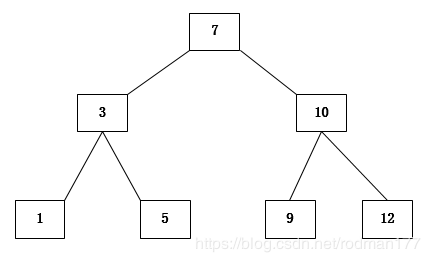
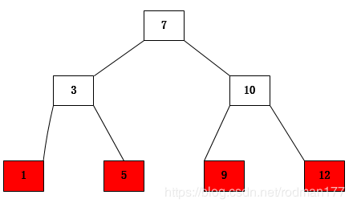
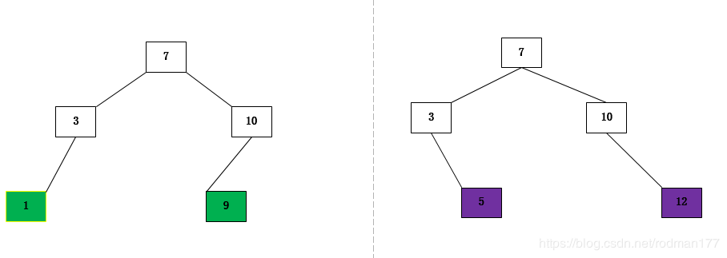
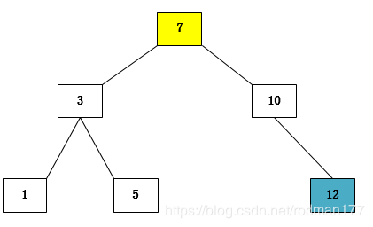
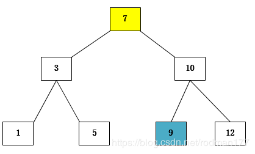

二叉搜索树又叫二叉查找树，二叉排序树；它具有以下特点

1. 如果它的左子树不为空，则左子树上结点的值都小于根结点。
2. 如果它的右子树不为空，则右子树上结点的值都大于根结点。
3. 子树同样也要遵循以上两点

为什么又叫做二叉排序树呢？二叉树的遍历方式：前 中 后 层次（Mysq）
只要一颗树是二叉搜索树，那么它的中序遍历一定是有序的。左根（输出）右 堆排序 归并排序，大顶堆 小顶堆


当链表退化了怎么解决？

变成AVL数：平衡二叉树(追求极致的平衡，理想状态)折中


----

## CSDN

什么是二叉查找树：
根节点的值大于其左子树中任意一个节点的值，小于其右节点中任意一节点的值，这一规则适用于二叉查找树中的每一个节点。
本文章重点来讨论一下关于二叉查找树删除节点的问题。
有一下二叉查找树，如图：


在删除节点的时候我们只需考虑一下三种情况：
（1）要删除的节点是叶子结点，如图：

（2）要删除的节点有左节点但是没有右节点，或者有右节点但是没有左节点，如图：


（3）要删除的节点既有左节点又有右节点，在这种情况下，我们只需要将找到待删节点的右子树中值最小的节点，将其删除并且获取其值，并用其值替换待删节点的值即可。如图：


```java
package com.zc.algorithm;

public class BinarySortTree {

    public class Node{
        int value;
        Node left;
        Node right;

        public Node(int  value)
        {
            this.value = value;
        }
        public void add(Node node)
        {
            if(node == null)
            {
                return;
            }
            //判断传入的节点的值比当前子树的根节点的值大还是小
            if(node.value < this.value)
            {
                //如果左节点为空
                if(this.left == null)
                {
                    this.left = node;
                }
                else
                {
                    this.left.add(node);
                }
            }
            else
            {
                if(this.right == null)
                {
                    this.right =node;
                }
                else
                {
                    this.right.add(node);
                }

            }
        }

        /**
         * 前序遍历二叉排序树
         * @param node
         */
        public void middleOder(Node node)
        {
            if(node == null)
            {
                return;
            }
            middleOder(node.left);
            System.out.println(node.value);
            middleOder(node.right);
        }

        /**
         * 查找某一节点
         * @param value
         * @return
         */
        public Node search(int value)
        {
            if(this.value == value)
            {
                return this;
            }
            else if(value < this.value)
            {
                if(this.left == null)
                {
                    return null;
                }
                 return this.left.search(value);
            }
            else
            {
                if(this.right == null)
                {
                    return null;
                }
                return  this.right.search(value);
            }

        }
        public Node searchParent(int value) {
            if((this.left != null && this.left.value == value) || (this.right != null && this.right.value == value))
            {
                return this;
            }
            else
            {
                if(this.value > value&& this.left != null)
                {
                    return this.left.searchParent(value);
                }
                else if(this.value < value && this.right !=null)
                {
                    return this.right.searchParent(value);
                }
            }
            return null;
        }
      }


    Node root;
    /**
     * 向二叉排序树中添加节点
     * @param node
     */
    public void add(Node node)
    {
        if(root == null)
        {
            root = node;
        }
      else
        {
            root.add(node);
        }
    }
    public void frontShow()
    {
        if(root != null)
        {
            this.root.middleOder(root);
        }
    }
    public Node SearchNode(int value)
    {
        if(root == null)
            return null;
        else
        {
            return root.search(value);
        }
    }

    public void delete(int value) {
        if (root == null)
            return;
        else
        {
            Node target = SearchNode(value);
            //如果没有这个节点
            if(target == null)
            {
                return;
            }
            //找到他的父节点
            Node parent = searchParent(value);
            //要删除的节点是叶子结点
            if(target.left == null && target.right == null)
            {
                //要删除的节点是节点的左子节点
                if(parent.left.value == value)
                {
                    parent.left =null;
                }
                else
                {
                    parent.right = null;
                }
            }
            //要删除的节点有两个子节点的情况
            else if(target.left != null && target.right != null)
            {
                   //删除右子树中值最小的节点，并获取到该节点的值
                int min = minDelete(target.right);
                //替换目标节点中的值
                target.value = min;
            }
            else
            {
                //需要删除的目标节点的左节点不为空
                if(target.left != null)
                {
                    //要删除的子节点是其父节点的左子节点，并且有左节点而没有有节点
                    if(parent.left.value == value)
                    {
                        parent.left = target.left;
                    }
                    //要删除的子节点是其父节点的右子节点，并且有左节点而没有有节点
                    else
                    {
                        parent.right = target.left;
                    }
                }
                //需要删除的目标节点的右节点不为空
                else
                {
                    //要删除的节点是父节点的左节点，并且有右节点儿没有左节点
                    if(parent.left.value == value)
                    {
                        parent.left = target.right;
                    }
                    //要删除的节点是其父节点的右节点，并且有右孩子没有左孩子
                    else
                    {
                        parent.right = target.right;
                    }
                }


            }

        }
    }

    /**
     * 删除一颗树中最小的节点
     * @param node
     * @return
     */
    public int minDelete(Node node)
    {
        Node target = node;
        while(target.left != null)
        {
            target = target.left;
        }
       delete(target.value);
        return target.value;

    }
    /**
     * 查找父节点
     * @param value
     * @return
     */
    public Node searchParent(int value)
    {
        if(root == null)
        {
            return null;
        }
        else
        {
            return root.searchParent(value);
        }
    }
    public static void main(String[] args)
    {
        int[] arr = new int[]{7,3,10,12,5,1,9};
        BinarySortTree binTree = new BinarySortTree();
        for(int i : arr)
        {
            binTree.add(binTree.new Node(i));
        }
        binTree.delete(7);
        //查看树中的值
        binTree.frontShow();
        //查找
      //  Node node = binTree.new Node(3);
        //Node res = binTree.SearchNode(node.value);
        //System.out.println(res.value);
       // Node temp = binTree.SearchNode(20);
        //System.out.println(temp.value);
    }
}


```

