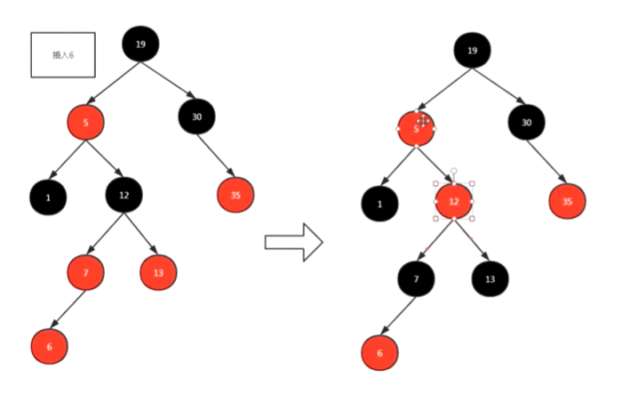
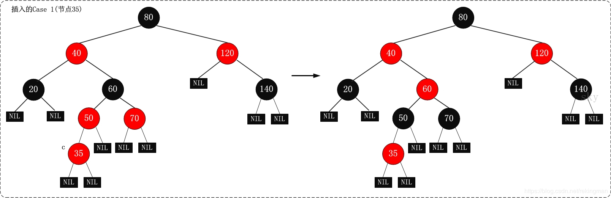
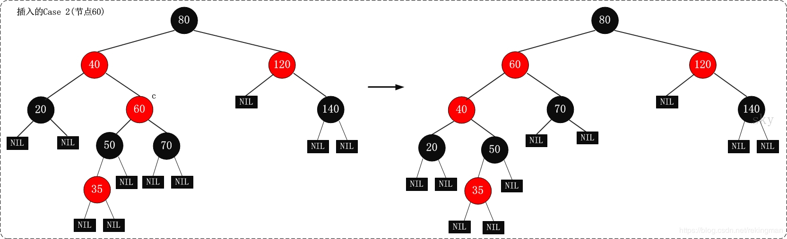
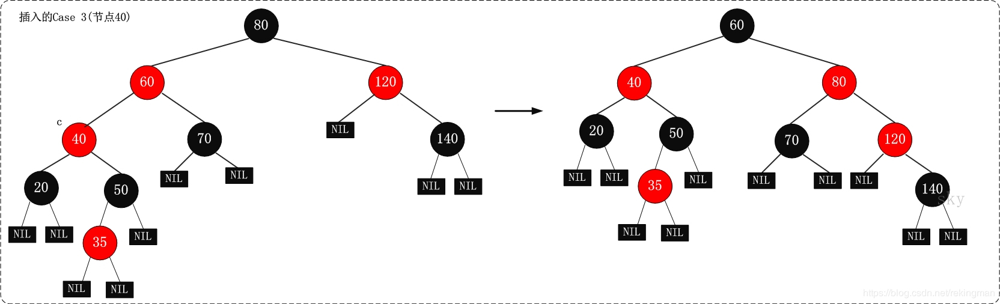
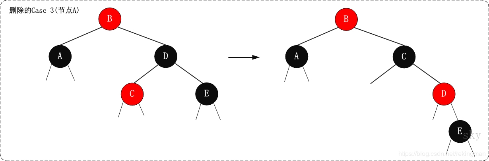
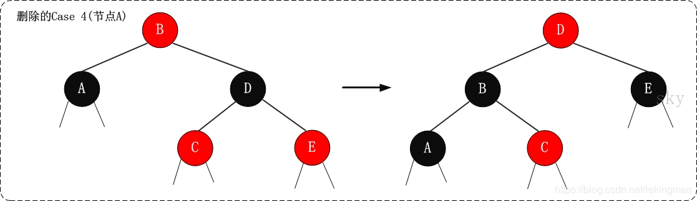

时间复杂度O(logN)


红黑树的底层数据就够就是：二叉查找树(特殊的二叉树)


红黑树的性质：

1. 每个节点不是红色就是黑色

2. 不可能有连在一起的红色节点

3. 根节点都是黑色root

4. 每个红色节点的两个子节点都是黑色。叶子节点是黑色：出度为0。

   

满足了性质就可以近似的平衡了，不一定要红黑，可以为其他的


NIL：叶子结点下挂的两个虚节点。所有的NIL节点都是黑色


为了满足红黑树的性质，因此出现了旋转

红黑树有三种变换：

1. 改变颜色：最简单 红变黑 黑变红
2. 左旋： 针对于点旋，但是点上面的子树也要跟着转。
3. 右旋


变换规则

1. 变颜色的情况：当前结点的父亲是红色，且它的祖父结点的也是红色。（叔叔结点）：
   1. 把父节点设为黑色
   2. 把叔叔也设为黑色
   3. 把祖父也就是父亲的父亲设为红色（爷爷）
   4. 把指针定义到祖父结点设为当前要操作的（爷爷）分析的点变换的规则
2. 左旋：当前父结点是红色，叔叔是黑色的时候，且当前的结点是右孑树。左旋以父结点作为左旋
3. 右旋：当前父结点是红色，叔叔是黑色的时候，且当前的结点是左子树。右旋
      1. 把父结点变为黑色
      2. 把祖父结点变为红色（爷爷）
      3. 以祖父结点旋转（爷爷） TreeMap JDK18大学给小学弟（）




-----

## CSDN

### 一、红黑树性质

1. 结点必须是红色或者黑色。
2. 根节点必须是黑色。
3. 叶节点(NIL)必须是黑色(NIL节点无数据，是空节点)。
4. 红色结点不能连续。
5. 从任一节点出发到其每个叶子节点的路径，黑色节点的数量必须相等。

### 二、添加节点旋转变色规则

已知插入根节点涂为黑色，其他节点都是涂红色；如果插入结点的父节点为黑色，就不需要进行旋转变色调整，其他情况都需要根据实际选择合适的处理策略进行调整，使其符合红黑树性质。最开始调整的时候是将插入结点作为当前节点。

|        | 实际情况                                                     | 处理策略                                                     |
| ------ | ------------------------------------------------------------ | ------------------------------------------------------------ |
| 第一种 | 当前节点的父节点是红色，且其祖父节点的另一个子节点（叔叔节点）也是红色，祖父节点不是根节点。 | （1）将父节点和叔叔节点设为黑色。（2）将祖父节点设为红色。（3）将祖父节点作为新的当前节点。 |
| 第二种 | 当前节点的父节点是红色，叔叔节点也是红色，且当前节点在最边上（即每行最左边或最右边的节点），祖父节点是根节点。 | （1）将根节点作为新的当前节点，以根节点为支点进行左旋（插入的是右孩子）或者右旋（左孩子）。（2）旋转后将新的根节点变黑色，其他节点根据需要变色，只要保证不出现红红连续节点即可。（3）判断性质5是否已满足，不满足则以当前节点为支点进行一次左旋或右旋，旋转后依旧要保证不出现红红连续节点，否则进行变色。 |
| 第三种 | 其他所有情况，前提是当前节点的父节点是红色。                 | （1）将父节点作为新的当前节点。（2）以新的当前节点为支点进行左旋（插入的是右孩子）或者右旋（左孩子）。 |

以下是分别三种CASE对应的图示：

- CASE1



- CASE2



- CASE3



### 三、删除节点旋转变色规则

第一步：将红黑树当作一颗二叉查找树，将节点删除。
 这和"删除常规二叉查找树中删除节点的方法是一样的"。分3种情况：
 ① 被删除节点没有儿子，即为叶节点。那么，直接将该节点删除就OK了。
 ② 被删除节点只有一个儿子。那么，直接删除该节点，并用该节点的唯一子节点顶替它的位置。
 ③ 被删除节点有两个儿子。那么，先找出它的后继节点；然后把“它的后继节点的内容”复制给“该节点的内容”；之后，删除“它的后继节点”。在这里，后继节点相当于替身，在将后继节点的内容复制给"被删除节点"之后，再将后继节点删除。这样就巧妙的将问题转换为"删除后继节点"的情况了，下面就考虑后继节点。 在"被删除节点"有两个非空子节点的情况下，它的后继节点不可能是双子非空。既然"的后继节点"不可能双子都非空，就意味着"该节点的后继节点"要么没有儿子，要么只有一个儿子。若没有儿子，则按"情况① "进行处理；若只有一个儿子，则按"情况② "进行处理。

第二步：通过"旋转和重新着色"等一系列来修正该树，使之重新成为一棵红黑树。
 因为"第一步"中删除节点之后，可能会违背红黑树的特性。所以需要通过"旋转和重新着色"来修正该树，使之重新成为一棵红黑树。

|            | 现象说明                                                     | 处理策略                                                     |
| ---------- | ------------------------------------------------------------ | ------------------------------------------------------------ |
| **Case 1** | x是"黑+黑"节点，x的兄弟节点是红色。(此时x的父节点和x的兄弟节点的子节点都是黑节点)。 | (01) 将x的兄弟节点设为“黑色”。(02) 将x的父节点设为“红色”。(03) 对x的父节点进行左旋。(04) 左旋后，重新设置x的兄弟节点。 |
| **Case 2** | x是“黑+黑”节点，x的兄弟节点是黑色，x的兄弟节点的两个孩子都是黑色。 | (01) 将x的兄弟节点设为“红色”。(02) 设置“x的父节点”为“新的x节点”。 |
| **Case 3** | x是“黑+黑”节点，x的兄弟节点是黑色；x的兄弟节点的左孩子是红色，右孩子是黑色的。 | (01) 将x兄弟节点的左孩子设为“黑色”。(02) 将x兄弟节点设为“红色”。(03) 对x的兄弟节点进行右旋。(04) 右旋后，重新设置x的兄弟节点。 |
| **Case 4** | x是“黑+黑”节点，x的兄弟节点是黑色；x的兄弟节点的右孩子是红色的，x的兄弟节点的左孩子任意颜色。 | (01) 将x父节点颜色 赋值给 x的兄弟节点。(02) 将x父节点设为“黑色”。(03) 将x兄弟节点的右子节设为“黑色”。(04) 对x的父节点进行左旋。(05) 设置“x”为“根节点”。 |

删除修正的CASE的图示：

- CASE1


- CASE2


- CASE3



- CASE4



```java
package com.flyingstars.www.rb;

/**
 * @param <T>
 * @author linxu
 * @date 2019/5/3
 * <p>红黑树的实现</p>
 * <p>继承比较器</p>
 */

public class RBTree<T extends Comparable<T>> {

    private RBTNode<T> mRoot;    // 根结点

    private static final boolean RED = false;
    private static final boolean BLACK = true;

    public class RBTNode<T extends Comparable<T>> {
        boolean color;        // 颜色
        T key;                // 关键字(键值)
        RBTNode<T> left;    // 左孩子
        RBTNode<T> right;    // 右孩子
        RBTNode<T> parent;    // 父结点

        public RBTNode(T key, boolean color, RBTNode<T> parent, RBTNode<T> left, RBTNode<T> right) {
            this.key = key;
            this.color = color;
            this.parent = parent;
            this.left = left;
            this.right = right;
        }


        public T getKey() {
            return key;
        }

        public String toString() {
            return "" + key + (this.color == RED ? "(R)" : "B");
        }
    }

    public RBTree() {
        mRoot = null;
    }

    private RBTNode<T> parentOf(RBTNode<T> node) {
        return node != null ? node.parent : null;
    }

    private boolean colorOf(RBTNode<T> node) {
        return node != null ? node.color : BLACK;
    }

    private boolean isRed(RBTNode<T> node) {
        return ((node != null) && (node.color == RED)) ? true : false;
    }

    private boolean isBlack(RBTNode<T> node) {
        return !isRed(node);
    }

    private void setBlack(RBTNode<T> node) {
        if (node != null)
            node.color = BLACK;
    }

    private void setRed(RBTNode<T> node) {
        if (node != null)
            node.color = RED;
    }

    private void setParent(RBTNode<T> node, RBTNode<T> parent) {
        if (node != null)
            node.parent = parent;
    }

    private void setColor(RBTNode<T> node, boolean color) {
        if (node != null)
            node.color = color;
    }

    /*
     * 前序遍历"红黑树"
     */
    private void preOrder(RBTNode<T> tree) {
        if (tree != null) {
            System.out.print(tree.key + " ");
            preOrder(tree.left);
            preOrder(tree.right);
        }
    }

    public void preOrder() {
        preOrder(mRoot);
    }

    /*
     * 中序遍历"红黑树"
     */
    private void inOrder(RBTNode<T> tree) {
        if (tree != null) {
            inOrder(tree.left);
            System.out.print(tree.key + " ");
            inOrder(tree.right);
        }
    }

    public void inOrder() {
        inOrder(mRoot);
    }


    /*
     * 后序遍历"红黑树"
     */
    private void postOrder(RBTNode<T> tree) {
        if (tree != null) {
            postOrder(tree.left);
            postOrder(tree.right);
            System.out.print(tree.key + " ");
        }
    }

    public void postOrder() {
        postOrder(mRoot);
    }


    /*
     * (递归实现)查找"红黑树x"中键值为key的节点
     */
    private RBTNode<T> search(RBTNode<T> x, T key) {
        if (x == null)
            return x;

        int cmp = key.compareTo(x.key);
        if (cmp < 0)
            return search(x.left, key);
        else if (cmp > 0)
            return search(x.right, key);
        else
            return x;
    }

    public RBTNode<T> search(T key) {
        return search(mRoot, key);
    }

    /*
     * (非递归实现)查找"红黑树x"中键值为key的节点
     */
    private RBTNode<T> iterativeSearch(RBTNode<T> x, T key) {
        while (x != null) {
            int cmp = key.compareTo(x.key);

            if (cmp < 0)
                x = x.left;
            else if (cmp > 0)
                x = x.right;
            else
                return x;
        }

        return x;
    }

    public RBTNode<T> iterativeSearch(T key) {
        return iterativeSearch(mRoot, key);
    }

    /*
     * 查找最小结点：返回tree为根结点的红黑树的最小结点。
     */
    private RBTNode<T> minimum(RBTNode<T> tree) {
        if (tree == null)
            return null;

        while (tree.left != null)
            tree = tree.left;
        return tree;
    }

    public T minimum() {
        RBTNode<T> p = minimum(mRoot);
        if (p != null)
            return p.key;

        return null;
    }

    /*
     * 查找最大结点：返回tree为根结点的红黑树的最大结点。
     */
    private RBTNode<T> maximum(RBTNode<T> tree) {
        if (tree == null)
            return null;

        while (tree.right != null)
            tree = tree.right;
        return tree;
    }

    public T maximum() {
        RBTNode<T> p = maximum(mRoot);
        if (p != null)
            return p.key;

        return null;
    }

    /*
     * 找结点(x)的后继结点。即，查找"红黑树中数据值大于该结点"的"最小结点"。
     */
    public RBTNode<T> successor(RBTNode<T> x) {
        // 如果x存在右孩子，则"x的后继结点"为 "以其右孩子为根的子树的最小结点"。
        if (x.right != null)
            return minimum(x.right);

        // 如果x没有右孩子。则x有以下两种可能：
        // (01) x是"一个左孩子"，则"x的后继结点"为 "它的父结点"。
        // (02) x是"一个右孩子"，则查找"x的最低的父结点，并且该父结点要具有左孩子"，找到的这个"最低的父结点"就是"x的后继结点"。
        RBTNode<T> y = x.parent;
        while ((y != null) && (x == y.right)) {
            x = y;
            y = y.parent;
        }

        return y;
    }

    /*
     * 找结点(x)的前驱结点。即，查找"红黑树中数据值小于该结点"的"最大结点"。
     */
    public RBTNode<T> predecessor(RBTNode<T> x) {
        // 如果x存在左孩子，则"x的前驱结点"为 "以其左孩子为根的子树的最大结点"。
        if (x.left != null)
            return maximum(x.left);

        // 如果x没有左孩子。则x有以下两种可能：
        // (01) x是"一个右孩子"，则"x的前驱结点"为 "它的父结点"。
        // (01) x是"一个左孩子"，则查找"x的最低的父结点，并且该父结点要具有右孩子"，找到的这个"最低的父结点"就是"x的前驱结点"。
        RBTNode<T> y = x.parent;
        while ((y != null) && (x == y.left)) {
            x = y;
            y = y.parent;
        }

        return y;
    }

    /*
     * 对红黑树的节点(x)进行左旋转
     *
     * 左旋示意图(对节点x进行左旋)：
     *      px                              px
     *     /                               /
     *    x                               y
     *   /  \      --(左旋)-.           / \                #
     *  lx   y                         x  ry
     *     /   \                      /    \
     *    ly   ry                    lx     ly
     *
     *
     */
    private void leftRotate(RBTNode<T> x) {
        // 设置x的右孩子为y
        RBTNode<T> y = x.right;
        // 将 “y的左孩子” 设为 “x的右孩子”；
        // 如果y的左孩子非空，将 “x” 设为 “y的左孩子的父亲”
        x.right = y.left;
        if (y.left != null)
            y.left.parent = x;
        // 将 “x的父亲” 设为 “y的父亲”
        y.parent = x.parent;
        if (x.parent == null) {
            this.mRoot = y;            // 如果 “x的父亲” 是空节点，则将y设为根节点
        } else {
            if (x.parent.left == x)
                x.parent.left = y;    // 如果 x是它父节点的左孩子，则将y设为“x的父节点的左孩子”
            else
                x.parent.right = y;    // 如果 x是它父节点的左孩子，则将y设为“x的父节点的左孩子”
        }
        // 将 “x” 设为 “y的左孩子”
        y.left = x;
        // 将 “x的父节点” 设为 “y”
        x.parent = y;
    }

    /*
     * 对红黑树的节点(y)进行右旋转
     *
     * 右旋示意图(对节点y进行左旋)：
     *            py                               py
     *           /                                /
     *          y                                x
     *         /  \      --(右旋)-.            /  \                     #
     *        x   ry                           lx   y
     *       / \                                   / \                   #
     *      lx  rx                                rx  ry
     *
     */
    private void rightRotate(RBTNode<T> y) {
        // 设置x是当前节点的左孩子。
        RBTNode<T> x = y.left;

        // 将 “x的右孩子” 设为 “y的左孩子”；
        // 如果"x的右孩子"不为空的话，将 “y” 设为 “x的右孩子的父亲”
        y.left = x.right;
        if (x.right != null)
            x.right.parent = y;

        // 将 “y的父亲” 设为 “x的父亲”
        x.parent = y.parent;

        if (y.parent == null) {
            this.mRoot = x;            // 如果 “y的父亲” 是空节点，则将x设为根节点
        } else {
            if (y == y.parent.right)
                y.parent.right = x;    // 如果 y是它父节点的右孩子，则将x设为“y的父节点的右孩子”
            else
                y.parent.left = x;    // (y是它父节点的左孩子) 将x设为“x的父节点的左孩子”
        }

        // 将 “y” 设为 “x的右孩子”
        x.right = y;

        // 将 “y的父节点” 设为 “x”
        y.parent = x;
    }

    /*
     * 红黑树插入修正函数
     *
     * 在向红黑树中插入节点之后(失去平衡)，再调用该函数；
     * 目的是将它重新塑造成一颗红黑树。
     *
     * 参数说明：
     *     node 插入的结点        // 对应《算法导论》中的z
     */
    private void insertFixUp(RBTNode<T> node) {
        RBTNode<T> parent, gparent;
        // 若“父节点存在，并且父节点的颜色是红色”
        while (((parent = parentOf(node)) != null) && isRed(parent)) {
            gparent = parentOf(parent);
            //若“父节点”是“祖父节点的左孩子”
            if (parent == gparent.left) {
                // Case 1条件：叔叔节点是红色
                RBTNode<T> uncle = gparent.right;
                if ((uncle != null) && isRed(uncle)) {
                    setBlack(uncle);
                    setBlack(parent);
                    setRed(gparent);
                    node = gparent;
                    continue;
                }
                // Case 2条件：叔叔是黑色，且当前节点是右孩子
                if (parent.right == node) {
                    RBTNode<T> tmp;
                    leftRotate(parent);
                    tmp = parent;
                    parent = node;
                    node = tmp;
                }
                // Case 3条件：叔叔是黑色，且当前节点是左孩子。
                setBlack(parent);
                setRed(gparent);
                rightRotate(gparent);
            } else {    //若“z的父节点”是“z的祖父节点的右孩子”
                // Case 1条件：叔叔节点是红色
                RBTNode<T> uncle = gparent.left;
                if ((uncle != null) && isRed(uncle)) {
                    setBlack(uncle);
                    setBlack(parent);
                    setRed(gparent);
                    node = gparent;
                    continue;
                }
                // Case 2条件：叔叔是黑色，且当前节点是左孩子
                if (parent.left == node) {
                    RBTNode<T> tmp;
                    rightRotate(parent);
                    tmp = parent;
                    parent = node;
                    node = tmp;
                }
                // Case 3条件：叔叔是黑色，且当前节点是右孩子。
                setBlack(parent);
                setRed(gparent);
                leftRotate(gparent);
            }
        }
        // 将根节点设为黑色
        setBlack(this.mRoot);
    }

    /*
     * 将结点插入到红黑树中
     *
     * 参数说明：
     *     node 插入的结点        // 对应《算法导论》中的node
     */
    private void insert(RBTNode<T> node) {
        int cmp;
        RBTNode<T> y = null;
        RBTNode<T> x = this.mRoot;
        // 1. 将红黑树当作一颗二叉查找树，将节点添加到二叉查找树中。
        while (x != null) {
            y = x;
            cmp = node.key.compareTo(x.key);
            if (cmp < 0)
                x = x.left;
            else
                x = x.right;
        }
        node.parent = y;
        if (y != null) {
            cmp = node.key.compareTo(y.key);
            if (cmp < 0)
                y.left = node;
            else
                y.right = node;
        } else {
            this.mRoot = node;
        }
        // 2. 设置节点的颜色为红色
        node.color = RED;
        // 3. 将它重新修正为一颗二叉查找树
        insertFixUp(node);
    }

    /*
     * 新建结点(key)，并将其插入到红黑树中
     *
     * 参数说明：
     *     key 插入结点的键值
     */
    public void insert(T key) {
        RBTNode<T> node = new RBTNode<T>(key, BLACK, null, null, null);
        // 如果新建结点失败，则返回。
        if (node != null)
            insert(node);
    }


    /*
     * 红黑树删除修正函数
     *
     * 在从红黑树中删除插入节点之后(红黑树失去平衡)，再调用该函数；
     * 目的是将它重新塑造成一颗红黑树。
     *
     * 参数说明：
     *     node 待修正的节点
     */
    private void removeFixUp(RBTNode<T> node, RBTNode<T> parent) {
        RBTNode<T> other;

        while ((node == null || isBlack(node)) && (node != this.mRoot)) {
            if (parent.left == node) {
                other = parent.right;
                if (isRed(other)) {
                    // Case 1: x的兄弟w是红色的
                    setBlack(other);
                    setRed(parent);
                    leftRotate(parent);
                    other = parent.right;
                }

                if ((other.left == null || isBlack(other.left)) &&
                        (other.right == null || isBlack(other.right))) {
                    // Case 2: x的兄弟w是黑色，且w的俩个孩子也都是黑色的
                    setRed(other);
                    node = parent;
                    parent = parentOf(node);
                } else {

                    if (other.right == null || isBlack(other.right)) {
                        // Case 3: x的兄弟w是黑色的，并且w的左孩子是红色，右孩子为黑色。
                        setBlack(other.left);
                        setRed(other);
                        rightRotate(other);
                        other = parent.right;
                    }
                    // Case 4: x的兄弟w是黑色的；并且w的右孩子是红色的，左孩子任意颜色。
                    setColor(other, colorOf(parent));
                    setBlack(parent);
                    setBlack(other.right);
                    leftRotate(parent);
                    node = this.mRoot;
                    break;
                }
            } else {

                other = parent.left;
                if (isRed(other)) {
                    // Case 1: x的兄弟w是红色的
                    setBlack(other);
                    setRed(parent);
                    rightRotate(parent);
                    other = parent.left;
                }

                if ((other.left == null || isBlack(other.left)) &&
                        (other.right == null || isBlack(other.right))) {
                    // Case 2: x的兄弟w是黑色，且w的俩个孩子也都是黑色的
                    setRed(other);
                    node = parent;
                    parent = parentOf(node);
                } else {

                    if (other.left == null || isBlack(other.left)) {
                        // Case 3: x的兄弟w是黑色的，并且w的左孩子是红色，右孩子为黑色。
                        setBlack(other.right);
                        setRed(other);
                        leftRotate(other);
                        other = parent.left;
                    }

                    // Case 4: x的兄弟w是黑色的；并且w的右孩子是红色的，左孩子任意颜色。
                    setColor(other, colorOf(parent));
                    setBlack(parent);
                    setBlack(other.left);
                    rightRotate(parent);
                    node = this.mRoot;
                    break;
                }
            }
        }

        if (node != null)
            setBlack(node);
    }

    /*
     * 删除结点(node)，并返回被删除的结点
     *
     * 参数说明：
     *     node 删除的结点
     */
    private void remove(RBTNode<T> node) {
        RBTNode<T> child, parent;
        boolean color;

        // 被删除节点的"左右孩子都不为空"的情况。
        if ((node.left != null) && (node.right != null)) {
            // 被删节点的后继节点。(称为"取代节点")
            // 用它来取代"被删节点"的位置，然后再将"被删节点"去掉。
            RBTNode<T> replace = node;

            // 获取后继节点
            replace = replace.right;
            while (replace.left != null)
                replace = replace.left;

            // "node节点"不是根节点(只有根节点不存在父节点)
            if (parentOf(node) != null) {
                if (parentOf(node).left == node)
                    parentOf(node).left = replace;
                else
                    parentOf(node).right = replace;
            } else {
                // "node节点"是根节点，更新根节点。
                this.mRoot = replace;
            }

            // child是"取代节点"的右孩子，也是需要"调整的节点"。
            // "取代节点"肯定不存在左孩子！因为它是一个后继节点。
            child = replace.right;
            parent = parentOf(replace);
            // 保存"取代节点"的颜色
            color = colorOf(replace);

            // "被删除节点"是"它的后继节点的父节点"
            if (parent == node) {
                parent = replace;
            } else {
                // child不为空
                if (child != null)
                    setParent(child, parent);
                parent.left = child;

                replace.right = node.right;
                setParent(node.right, replace);
            }

            replace.parent = node.parent;
            replace.color = node.color;
            replace.left = node.left;
            node.left.parent = replace;

            if (color == BLACK)
                removeFixUp(child, parent);

            node = null;
            return;
        }

        if (node.left != null) {
            child = node.left;
        } else {
            child = node.right;
        }

        parent = node.parent;
        // 保存"取代节点"的颜色
        color = node.color;

        if (child != null)
            child.parent = parent;

        // "node节点"不是根节点
        if (parent != null) {
            if (parent.left == node)
                parent.left = child;
            else
                parent.right = child;
        } else {
            this.mRoot = child;
        }

        if (color == BLACK)
            removeFixUp(child, parent);
        node = null;
    }

    /*
     * 删除结点(z)，并返回被删除的结点
     *
     * 参数说明：
     *     tree 红黑树的根结点
     *     z 删除的结点
     */
    public void remove(T key) {
        RBTNode<T> node;
        if ((node = search(mRoot, key)) != null)
            remove(node);
    }

    /*
     * 销毁红黑树
     */
    private void destroy(RBTNode<T> tree) {
        if (tree == null)
            return;

        if (tree.left != null)
            destroy(tree.left);
        if (tree.right != null)
            destroy(tree.right);

        tree = null;
    }

    public void clear() {
        destroy(mRoot);
        mRoot = null;
    }

    /*
     * 打印"红黑树"
     *
     * key        -- 节点的键值
     * direction  --  0，表示该节点是根节点;
     *               -1，表示该节点是它的父结点的左孩子;
     *                1，表示该节点是它的父结点的右孩子。
     */
    private void print(RBTNode<T> tree, T key, int direction) {

        if (tree != null) {

            if (direction == 0)    // tree是根节点
                System.out.printf("%2d(B) is root\n", tree.key);
            else                // tree是分支节点
                System.out.printf("%2d(%s) is %2d's %6s child\n", tree.key, isRed(tree) ? "R" : "B", key, direction == 1 ? "right" : "left");

            print(tree.left, tree.key, -1);
            print(tree.right, tree.key, 1);
        }
    }

    public void print() {
        if (mRoot != null)
            print(mRoot, mRoot.key, 0);
    }
}

```

