##### 浏览器输入网址之后发生了什么   

1. DNS域名解析     
2. HTTP协议生成请求报文     
3. TCP协议将请求报文分割成报文段，进行可靠传输     
4. IP协议进行分组转发     
5. TCP协议重组请求报文     
6. HTTP协议对请求进行处理     

​    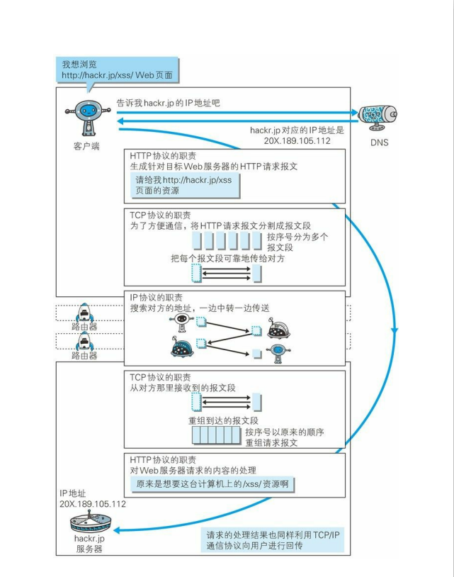

##### 网络体系（OSI七层、TCP/IP四层、五层）   

​        

######     TCP/IP协议各层的作用   

1. 应用层：应用层的任务是通过应用进程之间的交互来完成特定网络应用。应用层协议定义的是应用进程间通信和交互的规则。这里的进程是指主机中正在与运行的程序。对于不同的网络应用需要有不同的应用层协议。在互联网中的应用层协议有很多，如域名系统DNS，支持万维网应用的HTTP协议，支持电子邮件的SMTP协议，等等。    
2. 传输层：传输层的任务是负责向两台主机中进程之间的通信提供通用的数据传输服务。应用进程利用该服务传送应用层报文。主要有TCP协议和UDP协议。     
3. 网络层：网络层的任务是为分组交换网上的不同主机提供通信服务。在发送数据的时候，网络层把运输层产生的报文段或者用户数据报封装成分组或包进行传送。主要使用IP协议。     
4. 网络接口层：操作系统中的设备驱动和计算机对应的网络接口，它们一起处理与传输媒介的物理接口细节。主要有ARP协议和RARP协议。     

#####     应用层   

######     HTTP和HTTPS的区别   

1. ​      端口 ：HTTP的URL由“http://”起始且默认使用端口80，而HTTPS的UR由“https://”起始且默认使用端口443。     
2. ​      安全性和资源消耗： HTTP协议运行在TCP之上，所有传输的内容都是明文，客户端和服务器端都无法验证对方的身份。HTTPS是运行在SSL/TLS之上的HTTP协议，SSL/TLS 运行在TCP之上。所有传输的内容都经过加密，加密采用对称加密，但对称加密的密钥用服务器方的证书进行了非对称加密。所以说，HTTP 安全性没有 HTTPS高，但是 HTTPS 比HTTP耗费更多服务器资源。     

1. ​      对称加密：密钥只有一个，加密解密为同一个密码，且加解密速度快，典型的对称加密算法有DES、AES等；     

​        

1. ​      非对称加密：密钥成对出现（且根据公钥无法推知私钥，根据私钥也无法推知公钥），加密解密使用不同密钥（公钥加密需要私钥解密，私钥加密需要公钥解密），相对对称加密速度较慢，典型的非对称加密算法有RSA、DSA等。     

​        

​       

######     HTTPS的加密过程   

​        

1. ​      证书验证，客户端发送一个证书请求个服务器端，服务器端返回证书，客户端对证书进行验证。     
2. ​      交换密钥，使用非对称加密，客户端使用公钥进行加密，服务器端使用密钥解密。     
3. ​      交换数据，使用对称加密的方式对数据进行加密，然后进行传输。     

######     HTTP1.0和HTPP1.1的区别   

1. ​      缓存处理：在HTTP1.0中主要使用header里的If-Modified-Since,Expires来做为缓存判断的标准，HTTP1.1则引入了更多的缓存控制策略例如Entity tag，If-Unmodified-Since, If-Match, If-None-Match等更多可供选择的缓存头来控制缓存策略。     
2. ​      带宽优化及网络连接的使用：HTTP1.0中，存在一些浪费带宽的现象，例如客户端只是需要某个对象的一部分，而服务器却将整个对象送过来了，并且不支持断点续传功能，HTTP1.1则在请求头引入了range头域，它允许只请求资源的某个部分，即返回码是206（Partial Content），这样就方便了开发者自由的选择以便于充分利用带宽和连接。     
3. ​      错误通知的管理：在HTTP1.1中新增了24个错误状态响应码，如409（Conflict）表示请求的资源与资源的当前状态发生冲突；410（Gone）表示服务器上的某个资源被永久性的删除。     
4. ​      Host头处理：在HTTP1.0中认为每台服务器都绑定一个唯一的IP地址，因此，请求消息中的URL并没有传递主机名（hostname）。但随着虚拟主机技术的发展，在一台物理服务器上可以存在多个虚拟主机（Multi-homed Web Servers），并且它们共享一个IP地址。HTTP1.1的请求消息和响应消息都应支持Host头域，且请求消息中如果没有Host头域会报告一个错误（400 Bad Request）。     
5. ​      长连接：HTTP 1.1支持长连接（PersistentConnection）和请求的流水线（Pipelining）处理，在一个TCP连接上可以传送多个HTTP请求和响应，减少了建立和关闭连接的消耗和延迟，在HTTP1.1中默认开启Connection： keep-alive，一定程度上弥补了HTTP1.0每次请求都要创建连接的缺点。     

######     长连接和短连接的区别   

​        

​       

######     HTTP2.0与HTTP1.x的区别   

1. ​      新的二进制格式（Binary Format）：HTTP1.x的解析是基于文本。基于文本协议的格式解析存在天然缺陷，文本的表现形式有多样性，要做到健壮性考虑的场景必然很多，二进制则不同，只认0和1的组合。基于这种考虑HTTP2.0的协议解析决定采用二进制格式，实现方便且健壮     
2. ​      多路复用（MultiPlexing）：即连接共享，即每一个request都是是用作连接共享机制的。一个request对应一个id，这样一个连接上可以有多个request，每个连接的request可以随机的混杂在一起，接收方可以根据request的 id将request再归属到各自不同的服务端请求里面。     
3. ​      header压缩：HTTP1.x的header带有大量信息，而且每次都要重复发送，HTTP2.0使用encoder来减少需要传输的header大小，通讯双方各自cache一份header fields表，既避免了重复header的传输，又减小了需要传输的大小。     
4. ​      服务端推送（server push）：同SPDY一样，HTTP2.0也具有server push功能。     

​    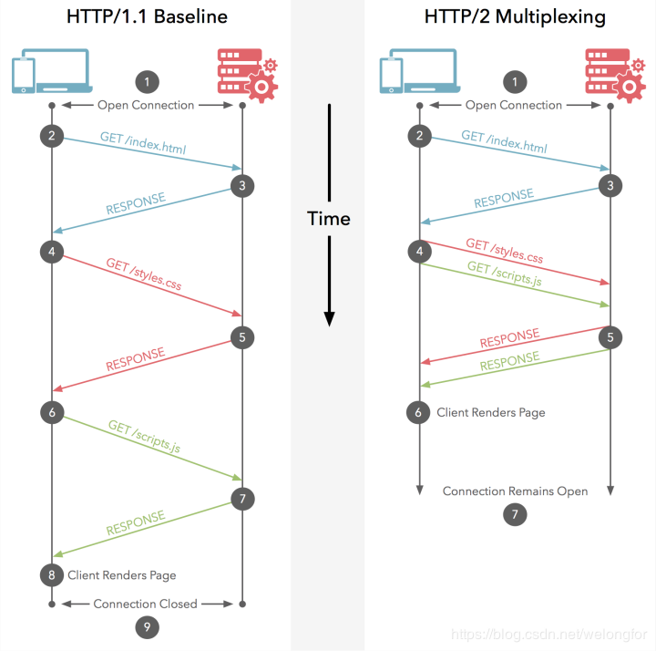    

######     HTTP协议中的GET和POST方式的区别   

1. ​      参数位置：GET方法参数位置包含在URL，POST方法参数包含在请求主体     
2. ​      参数长度：GET方法的URL长度有限度，POST长度没有限制     
3. ​      参数编码：GET方法参数编码是ASCII码，POST没有限制     
4. ​      TCP数据包：GET方法产生一个TCP数据包，把首部和数据一起发送，POST方法产生两个TCP数据包，先发首部，服务器响应后再发数据     

######     HTTP的报文结构   

​        

######     HTTP协议有那些请求 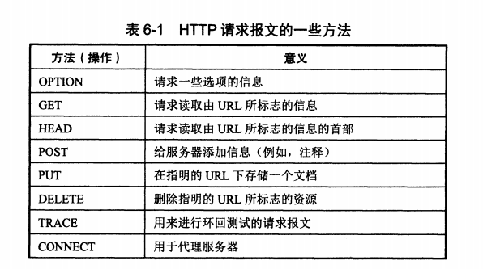    

​       

######     HTTP的状态码   

​    答：     

​       

######     HTTP的首部字段   

​    答：   

1. ​      通用首部字段（General Header Fields）     

​    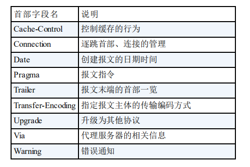    

​       

​       

​       

1. ​      请求首部字段（Request Header Fields）     

​    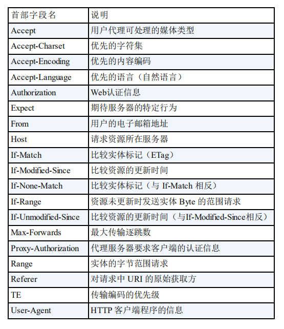    

1. ​      响应首部字段（Respond Header Fields）     

​        

1. ​      实体首部字段（Entity Header Fields）     

​        

######     Session和Cookie的区别   

​    答：   

1. ​      储存位置：Cookie是客户端会话技术，数据保存在客户端，Session是服务器端会话技术，数据保存在服务器端。     
2. ​      存储容量：Cookie一般<=4KB，Session无限制。     
3. ​      跨域支持：Cookie支持跨域，Session不支持。     

​       

​    Cookie的知识点：   

1. ​      概念：     

​    客户端会话技术，将数据保存在客户端   

1. ​      使用步骤：     

1. ​      创建Cookie对象，绑定数据     

​    new Cookie(Cookie cookie)   

1. ​      发送Cookie对象     

​    response.addCookie(Cookie cookie)   

1. ​      获取Cookie，拿到数据     

​    Cookie[] request.getCookies()   

1. ​      实现原理：     

​    基于响应头的set-cookie和请求头cookie实现   

1. ​      细节：     

1. ​      一次可不可以发送多少个Cookie     

​    可以，可以创建多个Cookie对象，使用response调用多次addCookie方法发送多个Cookie   

1. ​      Cookie在浏览器中保存多长时间     

​    默认情况下，当浏览器关闭，Cookie数据被销毁   

​    持久化存储：   

​    setMaxAge(int seconds)   

​    正数：将Cookie数据写到硬盘的文件中，持久化存储   

​    负数：默认情况   

​    0：删除Cookie   

1. ​      Cookie能不能存中文     

​    在tomcat 8之前不能存储，tomcat 8之后可以   

1. ​      Cookie的共享问题：     

1. ​      假设在一个tomcat服务器，部署了多个项目，那么在这些项目中Cookie能不能共享     

​    默认情况下不能共享   

​    setPath(String path)：设置Cookie的取值范围，默认情况下，设置当前虚拟目录，如果要共享，可以将path设置为“/”   

1. ​      不同的tomcat服务器间Cookie的共享问题     

​    setDomain(String path)：如果设置一级域名相同，那么多个服务器之间Cookie可以共享   

1. ​      Cookie的特点和作用     

​    特点：   

1. ​      Cookie储存数据在客户端浏览器     
2. ​      浏览器对于单个Cookie的大小有限制（4KB）以及对于同一域名下的总Cookie数量也有限制（20个）     

​    作用：   

1. ​      Cookie一般用于存储少量的不太敏感的数据     
2. ​      在不登陆的情况下，完成服务器对客户端的身份识别     

######     如何设计API的安全性   

​    Token授权机制、时间戳超时机制、签名机制、拒绝重复调用   

######     HTTP攻击有哪些   

​    跨站脚本攻击（XSS）、Dos攻击、SQL注入攻击、OS命令注入攻击、HTTP头部攻击、目录攻击、开放重定向攻击   

######     HTTP和WebSocket的联系和区别，什么情况下用WebSocket   

​    答：HTTP1.x是半双工通信，客户端请求服务器响应，是无状态的，如果要实现实时通讯需要长轮询或者长连接的方式，这两种方式带来资源浪费。WebSocket是HTML5以后基于TCP协议应用层的一种全双工实时通讯协议。客户端和服务端可以进行信息的相互传递。它是借Http请求产生握手，在Http的头部会包含WebSocket协议的请求，所以握手之后，协议进行一个升级，转成TCP协议进行交流。WebSocket可以应用于聊天和即时信息   

######     WebSocket通信流程   

​    答：   

1. ​      建立socket通信，包括客户端和服务器端创建套接字（socket方法），服务器端绑定端口（bind方法），建立监听（listen方法），客户端创建连接（connect方法）。     
2. ​      TCP三次握手建立连接     
3. ​      客户端服务器端收发数据（send方法、recv方法），读写数据（read方法、write方法）。     
4. ​      TCP四次挥手关闭连接     
5. ​      关闭socket（close方法）     

​        

######     Socket编程主要大的步骤   

1. ​      创建套接字（socket方法）     
2. ​      客户端建立连接（connect方法），服务器端绑定端口（bind），建立监听（listen方法）     
3. ​      写入数据（write方法），发送数据（send方法），接收数据（recv方法）读取数据（read方法）     
4. ​      关闭连接（close方法）     

######     socket常见读写错误   

1. ​      EAGAIN的错误：一般是对非阻塞端口读写产生的错误。     
2. ​      EINTR：errno=4，错误描述Interrupted system call，操作也应该继续。     
3. ​      ECONNABORTED，错误描述software caused connection abort，即“软件引起的连接中止     
4. ​      ECONNRESET 不在TCP_SYN_SENT状态收到的rst，connection reset by peer，即“对方复位连接”，这种情况一般发生在服务进程较客户进程提前终止。     
5. ​      EPIPE ，错误被描述为“broken pipe”，即“管道破裂”，这种情况一般发生在客户进程不理会（或未及时处理）Socket 错误     
6. ​      ECONNREFUSED在TCP_SYN_SENT状态收到的rst，一般说明对方没有对应的监听服务。     
7. ​      ETIMEDOUT，错误被描述为“connect time out”，即“连接超时”，这种情况一般发生在服务器主机崩溃。     
8. ​      EHOSTTUNREACH  ENETUNREACH，no route to host(软错)路由上引发了一个目的地不可达的ICMP错误 其中(1)(3)，客户端会进行定时多次重试，一定次数后才返回错误。     

######     DHCP原理   

​        

​    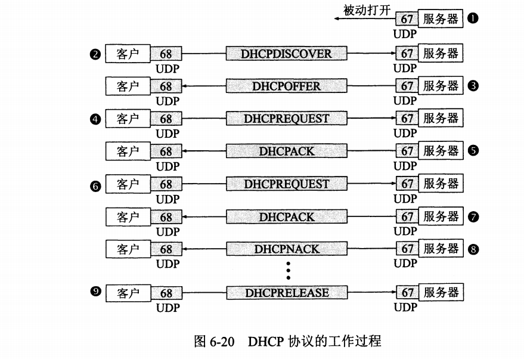    

​    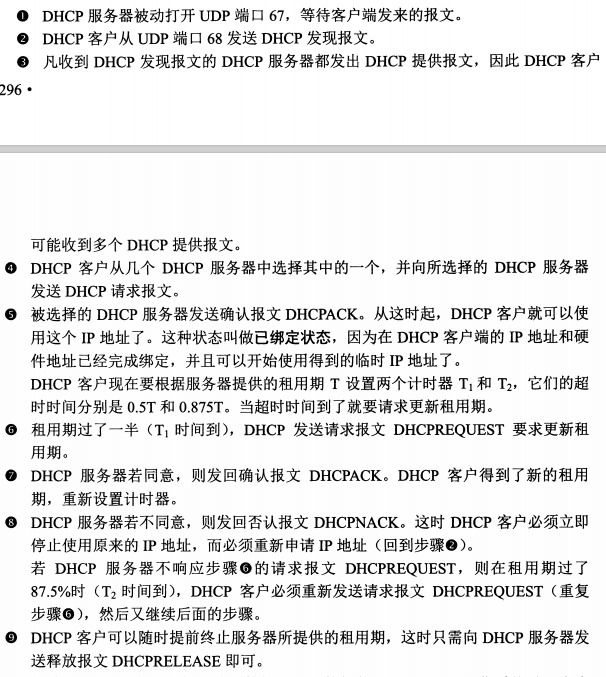    

​       

######     域名系统DNS   

​    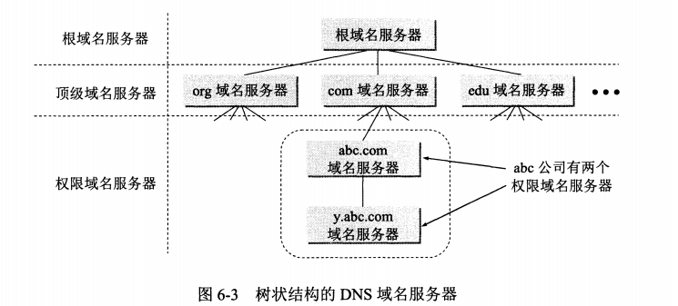    

######      FTP的两种模式   

​        

​       

#####     传输层   

######     TCP三次握手和四次挥手的图   

1. ​      三次握手     

​       

​    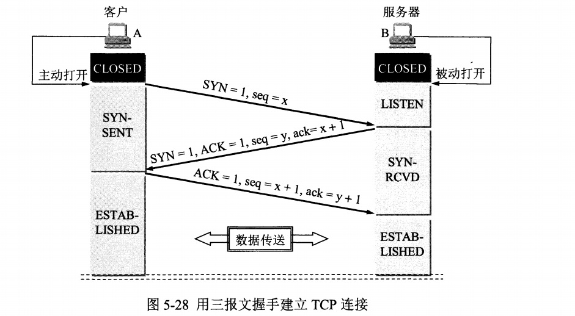    

1. ​      四次挥手     

​        

​       

######     第三次握手可以发送数据了吗   

​    不能，需要三次握手成功之后才开始发送数据   

######     TCP连接唯一性如何保证   

​    对TCP而言在三次握手时的SYN标志会使用上一个ISN值，这个值是使用32位计数器，内由0-4294967295，每一次连接容都会分配到一个ISN值，连接双方对这个值会记录共识，假如这个值不一，就说明了这个连接已超时或无效甚至是被人恶意攻击冒充连接。   

######     为什么要有TIME_WAIT   

​        

######     我是服务端你是TIME_WAIT客户端，我给你发了一段数据，我的seq是100，你应该回我ack多少（假设已经建立了三次握手，现在给你发了一段数据）   

​    建立连接：Ack号 = Seq号 + 1   

​    传输数据：Ack号 = Seq号 + 传递的字节数 + 1   

######     TCP和UDP的区别   

​    答：   

1. ​      连接：UDP是无连接的，发送数据之前无需建立连接，发送数据结束后也无需释放连接。TCP是面向连接的，在发送数据之前需要通过三次握手建立连接，发送数据结束后需要通过四次挥手释放连接。     
2. ​      交付：UDP使用尽最大努力交付，即不保证可靠交付，主机不需要维持复杂的连接状态表。TCP提供可靠交付，即通过TCP连接传送的数据，无差错、不丢失、不重复，并且按序到达。     
3. ​      数据：UDP是面向报文的，UDP对于应用层交下来的报文，添加首部后就向下交给IP层，既不合并，也不拆分，一次交付一个完整的报文。TCP是面向字节流的，虽然应用程序和TCP的交互是一次一个数据块（大小不等），但TCP把应用程序交下来的数据看出成一连串无结构的字节流。TCP不保证接收方应用程序所收到的数据块和发送方应用程序所发出的数据块具有对应大小关系。     
4. ​      通信双方：UDP支持一对一、一对多、多对一、多对多的交互通信。TCP连接是点对点（一对一），每一条TCP连接只能有两个端点。     
5. ​      拥塞：UDP没有拥塞控制，网络的拥塞不会使源主机的发送速率降低。TCP通过慢开始、拥塞避免、快重传、快恢复等算法进行拥塞控制。     
6. ​      首部：UDP首开销小，只有8个字节。TCP首部是20个字节。     

​       

######     TCP可靠连接的实现   

​    答：   

1. ​      滑动窗口     
2. ​      选择确认     
3. ​      超时重传     

######     TCP的流量控制   

######     TCP拥塞控制的方法   

1. ​      慢开始     

​        

1. ​      拥塞避免     

​        

1. ​      快重传     

​       

1. ​      快恢复     

######     TCP三次握手和四次挥手时客户端和服务端的状态   

​    答：参考上面两个图   

######     常见端口和对应服务   

​    答：   

​        

#####     网络层   

######     子网的划分   

​    答：   

​        

######     交换机和路由器的区别   

​    答：   

1. ​      工作层次：交换机主要工作在数据链路层，路由器主要工作在网络层     
2. ​      转发依据：交换机转发依据的对象是MAC地址，路由器转发依据的对象是IP地址     
3. ​      功能：交换机功能较简单，只是将主机连接起来组件局域网，路由器可以将局域网连接起来，还能分割广播域，还能提供防火墙     

######     如果不想要一个ip，如何释放，如何重新获取一个ip   

######     子网掩码的最大长度   

​    30位，子网掩码将某个IP地址划分成网络地址和主机地址两部分，在一个网段中，有2个地址是被固定占用的，一个是网段地址，一个是网段内广播地址，其他是主机可用的地址，至少一个，不然就没有意义了。也就是说，被掩码所分的网段至少要包含3个地址。   

######     MAC表、路由表、ARP表的字段   

​    答：   

1. ​      MAC表     

​    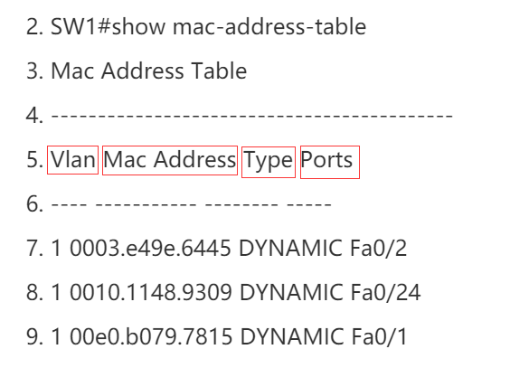    

1. ​      路由表     

​        

​        

1. ​      ARP表     

​    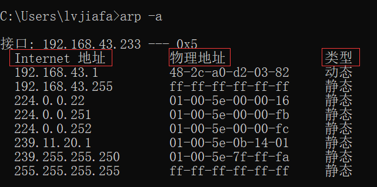    

######     ARP协议的作用   

​    答：将IP地址转换为物理地址   

######     ARP协议的工作原理   

1. ​      首先，每个主机都会在自己的ARP缓冲区中建立一个ARP列表，以表示IP地址和MAC地址之间的对应关系。     
2. ​      当源主机要发送数据时，首先检查ARP列表中是否有对应IP地址的目的主机的MAC地址，如果有，则直接发送数据，如果没有，就向本网段的所有主机发送ARP数据包，该数据包包括的内容有：源主机IP地址，源主机MAC地址，目的主机的IP地址。     
3. ​      当本网络的所有主机收到该ARP数据包时，首先检查数据包中的IP地址是否是自己的IP地址，如果不是，则忽略该数据包，如果是，则首先从数据包中取出源主机的IP和MAC地址写入到ARP列表中，如果已经存在，则覆盖，然后将自己的MAC地址写入ARP响应包中，告诉源主机自己是它想要找的MAC地址。     
4. ​      源主机收到ARP响应包后。将目的主机的IP和MAC地址写入ARP列表，并利用此信息发送数据。如果源主机一直没有收到ARP响应数据包，表示ARP查询失败。     

​    广播发送ARP请求，单播发送ARP响应。   

######     IPV6地址的基本类型   

1. ​      单播（unicast）：单播就是传统的点对点通信。     
2. ​      多播（multicast）：多播是一点对多点的通信，数据报发送到一组计算机中的每一个。IPV6没有广播的术语，而是将广播看作多播的一个特例。     
3. ​      任播（anycast）：这是IPV6增加的一种类型。任播的终点是一组计算机，但是数据包只交付给其中一个，通常是距离最近的一个。     

​       

######     IPV6的首部   

​       

​        

​       

######     路由选择协议   

1. ​      内部网关协议RIP（Routing Information Protocol）：RIP是一种分布式的基于距离向量的路由选择协议。     
2. ​      内部网关协议OPSF（Open Shortest Path First）：OSPF是使用分布式的链路状态协议。     
3. ​      外部网关协议BGP（Border Gateway Protocol）：边界网关协议。     

######     IO多路复用   

1. ​      select     

​    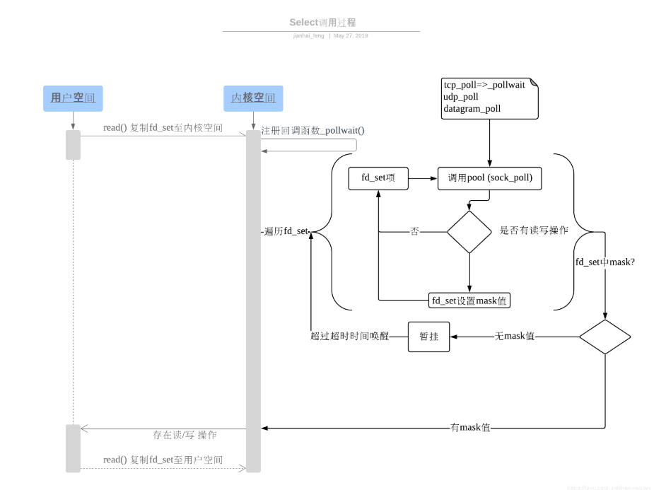    

1. ​      epoll     

​        

######     epoll和select的区别