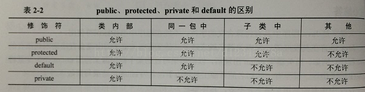

### 1.了解面向服务框架SOA，微服务吗？

面向服务的架构（SOA）是一个组件模型，它将应用程序的不同功能单元（称为服务）通过这些服务之间定义良好的接口和契约联系起来。接口是采用中立的方式 进行定义的，它应该独立于实现服务的硬件平台、操作系统和编程语言。这使得构建在各种各样的系统中的服务可以以一种统一和通用的方式进行交互。

微服务：彻底的组件化和服务化，Docker容器，进程隔离；微服务的目的是有效的拆分应用，实现敏捷开发和部署 。


### 2.分布式系统如何负载均衡？如何确定访问的资源在哪个服务器上？

1. 轮询

   作为非常经典的负载均衡策略，早期该策略应用地非常广泛。其原理很简单，给每个请求标记一个序号，然后将请求依次派发到服务器节点中，适用于集群中各个节点提供服务能力等同且无状态的场景。其缺点也非常明显，该策略将节点视为等同，与实际中复杂的环境不符。加权轮询为轮询的一个改进策略，每个节点会有权重属性，但是因为权重的设置难以做到随实际情况变化，仍有一定的不足。

2. 随机

   与轮询相似，只是不需要对每个请求进行编号，每次随机取一个。同样地，该策略也将后端的每个节点是为等同的。另外同样也有改进的加权随机的算法

3. 最小响应时间

   通过记录每次请求所需的时间，得出平均的响应时间，然后根据响应时间选择最小的响应时间。该策略能较好地反应服务器的状态，但是由于是平均响应时间的关系，时间上有些滞后，无法满足快速响应的要求。因此在此基础之上，会有一些改进版本的策略，如只计算最近若干次的平均时间的策略等。

4. 最小并发数

   客户端的每一次请求服务在服务器停留的时间可能会有较大的差异,随着工作时间加长,如果采用简单的轮循或随机均衡算法,每一台服务器上的连接进程可能会产生较大的不同,并没有达到真正的负载均衡｡最小并发数的策略则是记录了当前时刻，每个备选节点正在处理的事务数，然后选择并发数最小的节点。该策略能够快速地反应服务器的当前状况，较为合理地将负责分配均匀，适用于对当前系统负载较为敏感的场景。

5. 一致性哈希。

   在后端节点有状态的情况下，需要使用哈希的方法进行负载均衡，


### 3.设计一个分布式负载均衡缓冲系统，如何快速定位到是那个服务器（使用key分段、一致性hash）


### 4.如何保证缓冲区和数据库之间的强一致性（使用加锁）

“先淘汰缓存，再修改数据库”

“先操作缓存，在写数据库成功之前，如果有读请求发生，可能导致旧数据入缓存，引发数据不一致”

写流程：

（1）先淘汰cache

（2）再写db

读流程：

（1）先读cache，如果数据命中hit则返回

（2）如果数据未命中miss则读db

（3）将db中读取出来的数据入缓存

其实不需要让全局的请求串行化，而只需要“让同一个数据的访问能串行化”就行。

在一个服务内，如何做到“让同一个数据的访问串行化”，只需要“让同一个数据的访问通过同一条DB连接执行”就行。

如何做到“让同一个数据的访问通过同一条DB连接执行”，只需要“在DB连接池层面稍微修改，按数据取连接即可”

获取DB连接的CPool.GetDBConnection()【返回任何一个可用DB连接】改为

CPool.GetDBConnection(longid)【返回id取模相关联的DB连接】

#### 能否做到同一个数据的访问落在同一个服务上？

可以，同样是用id去区分。

由于数据库层面的读写并发，引发的数据库与缓存数据不一致的问题（本质是后发生的读请求先返回了），可能通过两个小的改动解决：

（1）修改服务Service连接池，id取模选取服务连接，能够保证同一个数据的读写都落在同一个后端服务上

（2）修改数据库DB连接池，id取模选取DB连接，能够保证同一个数据的读写在数据库层面是串行的

### 5.HashMap高并发情况下会出现什么问题，（扩容问题）

### 6.说一说在浏览器中输入一个url后，直到浏览器显示页面的过程中发生了什么

（我主要说了DNS，然后他有接着问了DNS的细节，然后就是ARP路由，然后服务器处理，返回，浏览器呈现，获取html中的依赖资源）

#### 1. 在浏览器中输入url

  用户输入url，例如http://[www.baidu.com](http://www.baidu.com/)。其中http为协议，[www.baidu.com](http://www.baidu.com/)为网络地址，及指出需要的资源在那台计算机上。一般网络地址可以为域名或IP地址，此处为域名。使用域名是为了方便记忆，但是为了让计算机理解这个地址还需要把它解析为IP地址。

#### 2.应用层DNS解析域名

  客户端先检查本地是否有对应的IP地址，若找到则返回响应的IP地址。若没找到则请求上级DNS服务器，直至找到或到根节点。


- DNS中递归查询和迭代查询的区别


1、 递归查询： 一般客户机和服务器之间属递归查询，即当客户机向DNS服务器发出请求后，若DNS服务器本身不能解析，则会向另外的DNS服务器发出查询请求，得到结果后转交客户机。

2、 迭代查询（反复查询）： 一般DNS服务器之间属迭代查询，如：若DNS2不能响应DNS1的请求，则它会将DNS3的IP给DNS2，以便其再向DNS3发出请求。

以一个DNS请求解析为例：

1）用户发起域名请求到dnsA，这时dnsA有这个记录，将结果返回给用户，这个过程是递归查询。

2）用户发起域名请求到dnsA，这时dns没有这个记录，它去向dnsB问有没有这个记录，以此类推，直到把结果返回给用户，这个过程是递归查询。

3）用户发起域名请求到dnsA，这时dnsA没有这个记录，它告诉用户，我没有这个记录，你去问dnsB吧，这个过程是迭代查询。


#### 3.应用层客户端发送HTTP请求

HTTP请求包括请求报头和请求主体两个部分，其中请求报头包含了至关重要的信息，包括请求的方法（GET / POST）、目标url、遵循的协议（http / https / ftp…），返回的信息是否需要缓存，以及客户端是否发送cookie等。

#### 4.传输层TCP传输报文

  位于传输层的TCP协议为传输报文提供可靠的字节流服务。它为了方便传输，将大块的数据分割成以报文段为单位的数据包进行管理，并为它们编号，方便服务器接收时能准确地还原报文信息。TCP协议通过“三次握手”等方法保证传输的安全可靠。

 “三次握手”的过程是，发送端先发送一个带有SYN（synchronize）标志的数据包给接收端，在一定的延迟时间内等待接收的回复。接收端收到数据包后，传回一个带有SYN/ACK标志的数据包以示传达确认信息。接收方收到后再发送一个带有ACK标志的数据包给接收端以示握手成功。在这个过程中，如果发送端在规定延迟时间内没有收到回复则默认接收方没有收到请求，而再次发送，直到收到回复为止。

[](http://images0.cnblogs.com/blog/622045/201507/020946557039933.png) 

#### 5.网络层IP协议查询MAC地址

  IP协议的作用是把TCP分割好的各种数据包传送给接收方。而要保证确实能传到接收方还需要接收方的MAC地址，也就是物理地址。IP地址和MAC地址是一一对应的关系，一个网络设备的IP地址可以更换，但是MAC地址一般是固定不变的。ARP协议可以将IP地址解析成对应的MAC地址。当通信的双方不在同一个局域网时，需要多次中转才能到达最终的目标，在中转的过程中需要通过下一个中转站的MAC地址来搜索下一个中转目标。

#### 6.数据到达数据链路层

  在找到对方的MAC地址后，就将数据发送到数据链路层传输。这时，客户端发送请求的阶段结束

#### 7.服务器接收数据

  接收端的服务器在链路层接收到数据包，再层层向上直到应用层。这过程中包括在运输层通过TCP协议讲分段的数据包重新组成原来的HTTP请求报文。

#### 8.服务器响应请求

  服务接收到客户端发送的HTTP请求后，查找客户端请求的资源，并返回响应报文，响应报文中包括一个重要的信息——状态码。状态码由三位数字组成，其中比较常见的是200 OK表示请求成功。301表示永久重定向，即请求的资源已经永久转移到新的位置。在返回301状态码的同时，响应报文也会附带重定向的url，客户端接收到后将http请求的url做相应的改变再重新发送。404 not found 表示客户端请求的资源找不到。

#### 9. 服务器返回相应文件

  请求成功后，服务器会返回相应的HTML文件。接下来就到了页面的渲染阶段了。

#### 10. 页面渲染

  现代浏览器渲染页面的过程是这样的：jiexiHTML以构建DOM树 –> 构建渲染树 –> 布局渲染树 –> 绘制渲染树。

  DOM树是由HTML文件中的标签排列组成，渲染树是在DOM树中加入CSS或HTML中的style样式而形成。渲染树只包含需要显示在页面中的DOM元素，像<head>元素或display属性值为none的元素都不在渲染树中。

  在浏览器还没接收到完整的HTML文件时，它就开始渲染页面了，在遇到外部链入的脚本标签或样式标签或图片时，会再次发送HTTP请求重复上述的步骤。在收到CSS文件后会对已经渲染的页面重新渲染，加入它们应有的样式，图片文件加载完立刻显示在相应位置。在这一过程中可能会触发页面的重绘或重排。


### 7.字符串中句子的反转（比如ABC DEF，输出DEF ABC）

（很简单，可以先反转整个字符串，然后反转单词，或者先将句子切分为单词，然后反转）；


### 8.给任意二叉树的所有结点加next指针


### 9.用过反向代理吗？


### 1 .进程间共享内存的方式有哪些？（8种）

无名管道，有名管道，高级管道，信号量，消息队列，共享内存，套接字


### 2 .linux下如何查看网络端口状态（netstat），如何查看内存使用情况（top）


### 3.ConcurrentHashMap如何扩容，内部结构？


### 4.知道java的异常吗？


### 5.运行时异常如果不处理会怎么样？应该怎么处理运行时异常？

不会怎么样，会在运行的时候出错。（RuntimeError是uncheck异常，所以不需要捕获）


### 6.写代码：给你5000万个int，求出前1000个最大的数，有2G内存。

（我刚开始以为5000万个int很多，还把G和byte的换算忘了，后来面试官指导才想起来。我的方法是维护一个1000的小根堆，然后遍历数组，总体下来时间复杂度是O（nlg1000)）

见排序的堆排序。


### 7.给你n个不重复的整数，随机找出m个不重复的整数，要求时间和空间复杂度都是O(m)。

（方法很简单，就是每次把取出来的数放到后面，只在前面的数组随机访问就可以了，时间复杂度是O(m)，空间复杂度是O(1)，不过我刚开始没有想到把选出来的放后面去。。。）。


### 8.对于SQL慢查询的优化？

（主要是从查询语句和数据库表设计两个方面来考虑，查询语句方面可以增加索引，增加查询筛选的限制条件；数据库表设计的时候可以拆分表，设计得更细粒度。但是后来才发现面试官想要的就是查询大量数据的慢查询问题的优化。。。）

先使用explain等找到耗时的地方，然后针对性的优化。SQL语句的优化。应该是需要针对业务数据进行一些特殊的优化。比如数据分类等。如果无法改变数据库设计，那就只能优化SQL语句，改变数据库参数设置了。


### 9.用过哪些容器？（tomcat）对比过Tomcat与其他服务器的区别吗？比如nginx？

nginx常用做静态内容服务和代理服务器，Tomcat能够动态的生成资源并返回到客户端。

Nginx 应该叫做「HTTP Server」；而 Tomcat 则是一个「Application Server」，或者更准确的来说，是一个「Servlet/JSP」应用的容器；

虽然Tomcat也可以认为是HTTP服务器，但通常它仍然会和Nginx配合在一起使用：

- 动静态资源分离——运用Nginx的反向代理功能分发请求：所有动态资源的请求交给Tomcat，而静态资源的请求（例如图片、视频、CSS、JavaScript文件等）则直接由Nginx返回到浏览器，这样能大大减轻Tomcat的压力。
- 负载均衡，当业务压力增大时，可能一个Tomcat的实例不足以处理，那么这时可以启动多个Tomcat实例进行水平扩展，而Nginx的负载均衡功能可以把请求通过算法分发到各个不同的实例进行处理。


### 10.用过动态代理吗？以后会经常用到的

AOP。


### 11.有遇到过OOM吗？

https://www.cnblogs.com/ThinkVenus/p/6805495.html

 OOM，全称“Out Of Memory”，翻译成中文就是“内存用完了”，来源于java.lang.OutOfMemoryError。看下关于的官方说明： Thrown when the Java Virtual Machine cannot allocate an object because it is out of memory, and no more memory could be made available by the garbage collector. 意思就是说，当JVM因为没有足够的内存来为对象分配空间并且垃圾回收器也已经没有空间可回收时，就会抛出这个error（注：非exception，因为这个问题已经严重到不足以被应用处理）。

---


### 1.自我介绍，说说你项目中的数据流向（画结构框图）

### 2.看过什么书？

### 3.说说深入理解JVM中印象最深刻的章节（我说了JVM内存模型，垃圾回收和类加载）；

补充：还问了堆和栈中存的是什么？static修饰的变量存在哪里？（方法区）

### 4.说说《Effective Java》中你印象最深的三条和你的理解

能不用string的就不使用；

用静态工厂方法代替构造器；

不要过度使用异常；

重写equals方法；

重写equals方法的时候记得重写hashcode；

使类和成员的可访问性最小化等等。

### 5.你觉得你哪一块只是最熟悉（我说了Java的基本数据结构）

### 6.那你说说HashMap的内部实现；

jdk1.8是用的红黑树，之前用的Entry数组，而Entry是一个链表类型的数据结构。

### 7.HashMap是线程安全的吗？（不是，ConcurrentHashMap是）

### 8.那ConcurrentHashMap内部是如何实现的？每个segment是个什么数据结构？（HashTable）

由多个segment组成，每个segment是一个HashEntry数组，HashEntry是链表。

实现同步的方法是segment继承了ReentrantLock类；Hashtable实现线程安全的方法是使用synchronized。

### 9.你的项目中用到哪些技术？（Spring）

### 10.说说你用了它的什么？（Spring IOC用的最多）

### 11.Spring的优点？Spring AOP的原理？Spring如何实现解耦合？

1.使用Spring的IOC容器，将对象之间的依赖关系交给Spring，降低组件之间的耦合性，让我们更专注于应用逻辑。

2.可以提供众多服务，事务管理，WS等。

3.引入AOP技术，将公共服务抽象出来，简化了代码编写；

4.对主流的框架提供了很好的集成支持，方便继承各种优秀的框架；

5.Spring属于低侵入，代码污染极低。

6.降低Java EE API的使用难度；

### 12.对链表了解吗？（我说是List吗）是，

（了解ArrayList和LinkedList），那你说说他们的区别？

### 13.会做链表两个结点的交换吗？（链表反转吗？）

是的，你写代码实现把。

### 14.再写一个，给你一个链表和一个整数k（k大于等于0，小于等于链表长度，链表长度未知），按k步长反转链表（比如1->2->3->4->5->6->7，当k=3的时候结果是3->2->1->6->5->4->7)

### 15.说说mybatis配置了xml过后是如何完成数据库操作的？

### 16.static变量内存分配在哪里？

在方法区，方法区用于存储已被虚拟机加载的类信息、常量、静态变量、即时编译后的代码等。


 

### 1.判断一个数是不是丑数

### 2.打印树的每一层最右侧节点

```java
public void printRight(TreeNode root){
	if(root == null)
		return;
	LinkedList<Integer> queue = new LinkedList<Integer>();
	queue.add(root);
	int cur = 1;
	int nextLine = 0;
	int curSum = 1;
	while(!queue.isEmpty()){
		TreeNode tmp = queue.poll();
		if(curSum == cur)
			System.out.print(tmp.val+",");
		cur--;
		if(tmp.left != null){
			queue.add(root.left);
			nextLine++;
		}
		if(tmp.right!= null){
		queue.add(root.right);
		nextLine++;
		}
		if(cur == 0){
			cur = nextLine;
			curSum = nextLine;
			nextLine = 0;
		}

	}

}
```

### 3.HashMap 的原理，实现简单的 get/put 操作；

### 4.map 源码，怎样解决冲突，和扩容

### 5.servlet流程

init->service->destory;

### 6.序列化，以及json传输

### 7.tomcat均衡方式 ，netty

### 8.java的反射机制

在[运行状态](http://baike.baidu.com/view/627351.htm)中，对于任意一个类，都能够知道这个类的所有属性和方法；对于任意一个对象，都能够调用它的任意方法和属性；这种动态获取信息以及动态调用对象方法的功能称为java语言的反射机制。


### 1.java中hashMap结构，处理冲突方法，还有啥方法，各个方法优缺点。

 1.开放定址法，这种方法也称再散列法，其基本思想是：当关键字key的哈希地址p=H（key）出现冲突时，以p为基础，产生另一个哈希地址p1，如果p1仍然冲突，再以p为基础，产生另一个哈希地址p2，…，直到找出一个不冲突的哈希地址pi ，将相应元素存入其中。

2.再哈希法，这种方法是同时构造多个不同的哈希函数：

  Hi=RH1（key） i=1，2，…，k

当哈希地址Hi=RH1（key）发生冲突时，再计算Hi=RH2（key）……，直到冲突不再产生。这种方法不易产生聚集，但增加了计算时间。

3.链地址法，这种方法的基本思想是将所有哈希地址为i的元素构成一个称为同义词链的单链表，并将单链表的头指针存在哈希表的第i个单元中，因而查找、插入和删除主要在同义词链中进行。链地址法适用于经常进行插入和删除的情况。

4.建立公共溢出区，这种方法的基本思想是：将哈希表分为基本表和溢出表两部分，凡是和基本表发生冲突的元素，一律填入溢出表。

5.红黑树。

 

### 2.进程调度；

无论是在[批处理系统](http://baike.baidu.com/view/1685060.htm)还是[分时系统](http://baike.baidu.com/view/1295402.htm)中，用户进程数一般都多于[处理机](http://baike.baidu.com/view/2107226.htm)数、这将导致它们互相争夺处理机。另外，系统进程也同样需要使用[处理机](http://baike.baidu.com/view/2107226.htm)。这就要求进程调度程序按一定的策略，动态地把[处理机](http://baike.baidu.com/view/2107226.htm)分配给处于就绪队列中的某一个[进程](http://baike.baidu.com/view/19746.htm)，以使之执行。

调度算法：

先来先服务和短作业(进程)优先调度算法，高优先权优先调度算法，基于时间片的轮转调度算法。

5.页面置换；

在地址映射过程中，若在页面中发现所要访问的页面不在内存中，则产生[缺页中断](http://baike.baidu.com/view/3071978.htm)。当发生缺页中断时，如果操作系统内存中没有空闲页面，则[操作系统](http://baike.baidu.com/view/880.htm)必须在内存选择一个页面将其移出内存，以便为即将调入的页面让出空间。而用来选择淘汰哪一页的规则叫做页面置换算法。

先入先出（FIFO）法。这种算法的实质是，总是选择在主存中停留时间最长（即最老）的一页置换，即先进入内存的页，先退出内存。

当需要置换一页时，选择在之前一段时间里最久没有使用过的页面予以置换。这种算法就称为最久未使用算法

### 8.spring，quartz,spark,lucene，

Quartz是一个完全由Java编写的开源作业调度框架,为在Java应用程序中进行作业调度提供了简单却强大的机制。

Spark 是一种与 [Hadoop](http://baike.baidu.com/view/908354.htm) 相似的开源集群计算环境。

lucene：是一个[开放源代码](http://baike.baidu.com/view/1708.htm)的全文检索引擎工具包，但它不是一个完整的全文检索引擎，而是一个全文检索引擎的架构，提供了完整的查询引擎和索引引擎，部分[文本分析](http://baike.baidu.com/view/3488135.htm)引擎。

### 9.自己实现IOC

http://blog.csdn.net/d12345678a/article/details/53909646

### 10.const/reactor

Reactor 是一个基于 JVM 之上的异步应用基础库。

### 12.volatile实现原理

它在多处理器开发中保证了共享变量的“可见性”。可见性的意思是当一个线程修改一个共享变量时，另外一个线程能读到这个修改的值。

- 将当前处理器缓存行的数据会写回到系统内存。
- 这个写回内存的操作会引起在其他CPU里缓存了该内存地址的数据无效。

处理器为了提高处理速度，不直接和内存进行通讯，而是先将系统内存的数据读到内部缓存（L1,L2或其他）后再进行操作，但操作完之后不知道何时会 写到内存，如果对声明了Volatile变量进行写操作，JVM就会向处理器发送一条Lock前缀的指令，将这个变量所在缓存行的数据写回到系统内存。但是就算写回到内存，如果其他处理器缓存的值还是旧的，再执行计算操作就会有问题，所以在多处理器下，为了保证各个处理器的缓存是一致的，就会实现缓存一致性协议，每个处理器通过嗅探在总线上传播的数据来检查自己缓存的值是不是过期了，当处理器发现自己缓存行对应的内存地址被修改，就会将当前处理器的缓存行设置成无效状态，当处理器要对这个数据进行修改操作的时候，会强制重新从系统内存里把数据读到处理器缓存里。

缓存一致性机制会阻止同时修改被两个以上处理器缓存的内存区域数据。一个处理器的缓存回写到内存会导致其他处理器的缓存无效。

### 13.spring的一些知识，如：有哪些注入方式

三种：通过set方式注入，通过构造器注入，通过工厂方法（接口注入，具有侵入性，不推荐）

XML配置，Java注解，构造器。

### 14.boolean占几个字节，protected权限能否被包外访问

因为jvm没有boolean类型，所以如果jvm实现规范的话，那么如果是boolean类型的数组的话，每个boolean类型（按照byte数组存储）占用1bytes,否者按照int类型存储，占用4bytes.得出boolean类型占了单独使用是4个字节，在数组中又是1个字节。

protected权限不能被包外访问。



### 16.说怎么判断是一个人注册大量小号。

从判断注册页面过来的请求是否是同一IP之类的说了

问题1：美团面试官来到一个城市面试应聘者，面试有三天，每天面试官上午可以面试三场，下午可以面试四场，怎么设计面试系统，面试者可以选择面试日期，面试时间和面试官。

标记，同步，

问题2：有一些爬虫IP不断的访问美团网站，现在美团设定一个IP5分钟之内访问美团网站超过100次，就判定为爬虫IP，怎么设计这个程序？如果100改成10000，怎么设计？

读取log中的IP记录，并统计每个IP的访问次数，以5分钟为分隔，超过100的IP就是爬虫IP，没有超过的在5分钟的时候清零，继续统计。