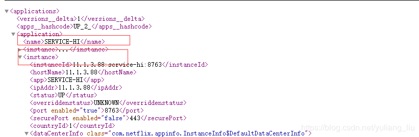
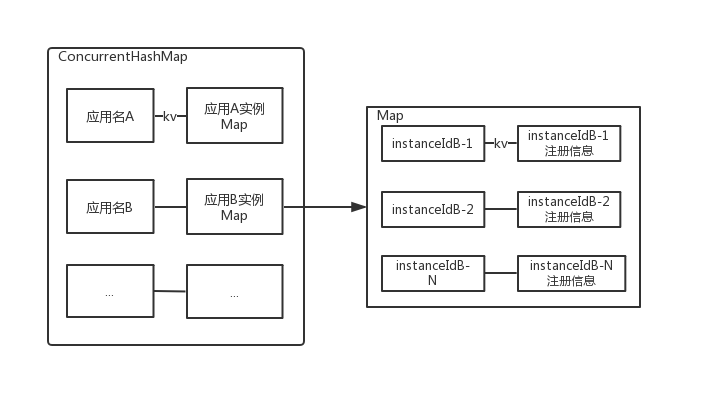

## 1，springcloud和dubbo的区别

SpringCloud是基于SpringBoot的基础上的一个微服务框架,包括了

- 服务注册发现
- 断路器
- 服务网关
- 客户端负载均衡
- 服务跟踪
- 消息总线
- 消息驱动
- 批量任务


SpringCloud抛弃了Dubbo的RPC通信,采用的是基于Http的Rest方式,在应用层进行传输


Dubbo是基于RPC的通信框架,在传输层进行传输


##  2，多线程aqs 

http://gogs.kermi.cool/Kermi/JavaGuide/src/master/docs/java/Multithread/AQS.md

AQS的全称为（AbstractQueuedSynchronizer），这个类在java.util.concurrent.locks包下面

AQS是一个用来构建锁和同步器的框架，使用AQS能简单且高效地构造出应用广泛的大量的同步器，比如我们提到的ReentrantLock，Semaphore，其他的诸如ReentrantReadWriteLock，SynchronousQueue，FutureTask等等皆是基于AQS的。当然，我们自己也能利用AQS非常轻松容易地构造出符合我们自己需求的同步器。

> **AQS核心思想是，如果被请求的共享资源空闲，则将当前请求资源的线程设置为有效的工作线程，并且将共享资源设置为锁定状态。如果被请求的共享资源被占用，那么就需要一套线程阻塞等待以及被唤醒时锁分配的机制，这个机制AQS是用CLH队列锁实现的，即将暂时获取不到锁的线程加入到队列中。**

3，多线程顺序打印abc 

```java
package thread;

/**
 * @author yangsy5
 * @date 2020-08-03
 */
public class ThreadsPrintABC {
  private static boolean flaga = true;
  private static boolean flagb = false;
  private static boolean flagc = false;

  public static void main(String[] args) {
    final Object lock = new Object();

    new Thread(
        () -> {
          synchronized (lock) {
            if (flaga) {
              System.out.println("a");
              flaga = false;
              flagb = true;
              flagc = false;
              lock.notifyAll();
            } else {
              try {
                lock.wait();
              } catch (Exception e) {
                e.printStackTrace();
              }
            }
          }
        }).start();

      new Thread(
              () -> {
                  synchronized (lock) {
                      if (flagb) {
                          System.out.println("b");
                          flaga = false;
                          flagb = false;
                          flagc = true;
                          lock.notifyAll();
                      } else {
                          try {
                              lock.wait();
                          } catch (Exception e) {
                              e.printStackTrace();
                          }
                      }
                  }
              }).start();

      new Thread(
              () -> {
                  synchronized (lock) {
                      if (flagc) {
                          System.out.println("c");
                          flaga = true;
                          flagb = false;
                          flagc = false;
                          lock.notifyAll();
                      } else {
                          try {
                              lock.wait();
                          } catch (Exception e) {
                              e.printStackTrace();
                          }
                      }
                  }
              }).start();
  }
}

```

```java
package thread;

import java.util.concurrent.locks.LockSupport;

/**
 * @author yangsy5
 * @date 2020-08-03
 */
public class ThreadPrintABCInUtil {

  static Thread threada, threadb, threadc;

  public static void main(String[] args) {
    threada =
        new Thread(
            () -> {
              for (int i = 0; i < 10; i++) {
                System.out.println(Thread.currentThread().getName());
                // 唤醒下一个线程
                LockSupport.unpark(threadb);
                // 当前线程阻塞
                LockSupport.park();
              }
            },
            "A");
    threadb =
        new Thread(
            () -> {
              for (int i = 0; i < 10; i++) {
                System.out.println(Thread.currentThread().getName());
                // 唤醒下一个线程
                LockSupport.unpark(threadc);
                // 当前线程阻塞
                LockSupport.park();
              }
            },
            "B");
    threadc =
        new Thread(
            () -> {
              for (int i = 0; i < 10; i++) {
                System.out.println(Thread.currentThread().getName());
                // 唤醒下一个线程
                LockSupport.unpark(threada);
                // 当前线程阻塞
                LockSupport.park();
              }
            },
            "C");
    threada.start();
    threadb.start();
    threadc.start();
  }
}

```


4,redis哨兵和集群 ，缓存穿透解决方案 

 1、设置热点数据永不过期

从缓存层来看，没有设置过期时间，所以不会出现热点 key 过期后产生的问题。

 2、加互斥锁

分布式锁：使用分布式锁，保证对于每个 key 同时只有一个线程去查询后端服务，其他线程没有获得分布式锁的权限，因此只需要等待即可。这种方式将高并发的压力转移到了分布式锁，因对分布式锁的考验很大。

https://juejin.im/post/6844903663362637832

5，悲观锁和乐观锁 

[http://gogs.kermi.cool/Kermi/JavaGuide/src/master/docs/essential-content-for-interview/%E9%9D%A2%E8%AF%95%E5%BF%85%E5%A4%87%E4%B9%8B%E4%B9%90%E8%A7%82%E9%94%81%E4%B8%8E%E6%82%B2%E8%A7%82%E9%94%81.md](http://gogs.kermi.cool/Kermi/JavaGuide/src/master/docs/essential-content-for-interview/面试必备之乐观锁与悲观锁.md)

6，怎解解决分布式数据一致性 

2PC.TCC

7，eruaka数据怎么存储

Eureka Server 的数据存储分了两层：数据存储层和缓存层。数据存储层记录注册到 Eureka Server 上的服务信息，缓存层是经过包装后的数据，可以直接在 Eureka Client 调用时返回。我们先来看看数据存储层的数据结构。

Eureka Server 的数据存储层是双层的 ConcurrentHashMap，我们知道 ConcurrentHashMap 是线程安全高效的 Map 集合。

```java
private final ConcurrentHashMap<String, Map<String, Lease<InstanceInfo>>> registry= new ConcurrentHashMap<String, Map<String, Lease<InstanceInfo>>>();
```

第一层的 ConcurrentHashMap 的 `key=spring.application.name` 也就是客户端实例注册的应用名；value 为嵌套的 ConcurrentHashMap。

第二层嵌套的 ConcurrentHashMap 的 `key=instanceId` 也就是服务的唯一实例 ID，value 为 Lease 对象，Lease 对象存储着这个实例的所有注册信息，包括 ip 、端口、属性等。

根据这个存储结构我们可以发现，Eureka Server 第一层都是存储着所有的服务名，以及服务名对应的实例信息，也就是说第一层都是按照服务应用名这个维度来切分存储：



第二层是根据实例的唯一 ID 来存储的，那么按照这个结构最终的存储数据格式为：

数据存储层数据结构如下图所示：



当如服务的状态发生变更时，会同步 Eureka Server 中的 registry 数据信息，比如服务注册、剔除服务时。

 8，courrentHashMap 怎么保证数据安全和高效率的 

多线程情况下锁链表

9，activity 怎么流转起来的，

10， activity的网关 11，spring ioc ，aop实现原理 12，sql什么情况会使得索引失效 13，类似男女数据字典，使用hash，还是红黑树，为什么 14，使用springboot的优势在哪 15，@responseBody 返回json，和返回jsp页面 有什么不同 16，jvm调优，老年代和新生代的垃圾回收算法

